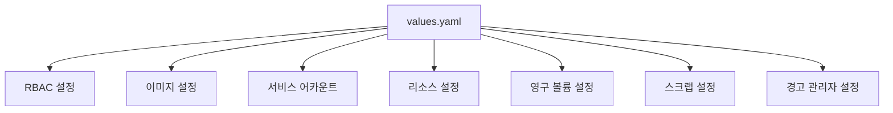
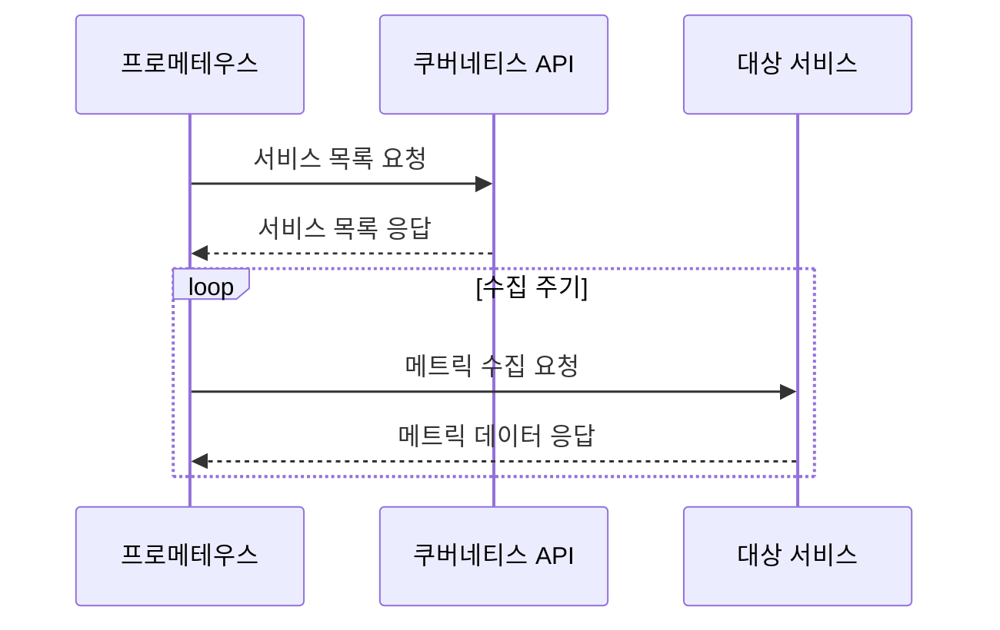

# 메트릭 수집

<cite>
**이 문서에서 참조한 파일**   
- [values.yaml](file://helm/development-tools/prometheus/values.yaml)
- [deploy.yaml](file://helm/development-tools/prometheus/templates/deploy.yaml)
- [kube-state-metrics/Chart.yaml](file://helm/development-tools/prometheus/charts/kube-state-metrics/Chart.yaml)
- [kube-state-metrics/values.yaml](file://helm/development-tools/prometheus/charts/kube-state-metrics/values.yaml)
- [prometheus-node-exporter/Chart.yaml](file://helm/development-tools/prometheus/charts/prometheus-node-exporter/Chart.yaml)
- [prometheus-node-exporter/values.yaml](file://helm/development-tools/prometheus/charts/prometheus-node-exporter/values.yaml)
</cite>

## 목차
1. [소개](#소개)
2. [프로메테우스 설정 구조](#프로메테우스-설정-구조)
3. [스크랩 및 작업 구성](#스크랩-및-작업-구성)
4. [서비스 디스커버리 및 수집 주기](#서비스-디스커버리-및-수집-주기)
5. [주요 익스포터 통합](#주요-익스포터-통합)
6. [커스텀 메트릭 수집 전략](#커스텀-메트릭-수집-전략)
7. [성능 최적화 및 저장소 설정](#성능-최적화-및-저장소-설정)
8. [리텐션 정책](#리텐션-정책)
9. [결론](#결론)

## 소개
이 문서는 쿠버네티스 환경에서 프로메테우스를 활용한 메트릭 수집 시스템의 구조와 설정 방법을 상세히 설명합니다. `values.yaml` 및 매니페스트 파일을 기반으로 한 설정 분석을 통해 스크랩(job) 구성, 서비스 디스커버리 방식, 메트릭 수집 주기 등을 다룹니다. 또한 kube-state-metrics 및 node-exporter와 같은 주요 익스포터의 통합 방법과 커스텀 메트릭 수집 전략을 포함하며, 성능 최적화를 위한 샘플링 전략, 저장소 설정, 리텐션 정책도 설명합니다.

## 프로메테우스 설정 구조

프로메테우스는 헬름 차트를 통해 쿠버네티스 환경에 배포되며, 주요 설정은 `values.yaml` 파일을 통해 관리됩니다. 이 설정 파일은 프로메테우스 서버의 전반적인 동작 방식을 정의하며, RBAC, 이미지 설정, 서비스 어카운트, 리소스 요청 및 제한, 영구 볼륨 설정 등을 포함합니다.



**Diagram sources**
- [values.yaml](file://helm/development-tools/prometheus/values.yaml)

**Section sources**
- [values.yaml](file://helm/development-tools/prometheus/values.yaml)

## 스크랩 및 작업 구성

프로메테우스의 메트릭 수집은 스크랩(job)을 통해 이루어지며, 각 job은 특정 대상에서 메트릭을 수집하는 역할을 합니다. `values.yaml` 파일 내 `server.global` 섹션에서 기본 수집 간격(`scrape_interval`)과 타임아웃(`scrape_timeout`)을 설정할 수 있습니다.

```yaml
server:
  global:
    scrape_interval: 1m
    scrape_timeout: 10s
    evaluation_interval: 1m
```

각 job은 서비스 모니터(ServiceMonitor) 또는 파드 모니터(PodMonitor) 리소스를 통해 동적으로 정의되며, 이를 통해 쿠버네티스 서비스 및 파드에 대한 메트릭 수집이 가능합니다.

**Section sources**
- [values.yaml](file://helm/development-tools/prometheus/values.yaml)

## 서비스 디스커버리 및 수집 주기

프로메테우스는 쿠버네티스 API를 통해 서비스 디스커버리를 수행하며, 서비스 모니터를 사용하여 대상 서비스를 자동으로 탐지합니다. 수집 주기는 `scrape_interval` 값에 따라 결정되며, 기본값은 1분입니다. 필요에 따라 특정 job에 대해 다른 수집 주기를 설정할 수 있습니다.



**Diagram sources**
- [values.yaml](file://helm/development-tools/prometheus/values.yaml)
- [deploy.yaml](file://helm/development-tools/prometheus/templates/deploy.yaml)

**Section sources**
- [values.yaml](file://helm/development-tools/prometheus/values.yaml)

## 주요 익스포터 통합

### kube-state-metrics
kube-state-metrics는 쿠버네티스 클러스터의 상태를 메트릭으로 노출합니다. 이 익스포터는 프로메테우스 차트의 하위 차트로 포함되어 있으며, `prometheusScrape: true` 설정을 통해 자동으로 스크랩됩니다.

```yaml
# kube-state-metrics/values.yaml
prometheusScrape: true
image:
  repository: kube-state-metrics/kube-state-metrics
  tag: ""
```

### node-exporter
node-exporter는 각 노드의 하드웨어 및 운영 체제 메트릭을 수집합니다. 이 익스포터는 데몬셋으로 배포되며, 호스트 네트워크 및 PID 네임스페이스를 공유하여 노드 수준의 메트릭을 수집합니다.

```yaml
# prometheus-node-exporter/values.yaml
hostNetwork: true
hostPID: true
hostRootFsMount:
  enabled: true
```

**Section sources**
- [kube-state-metrics/values.yaml](file://helm/development-tools/prometheus/charts/kube-state-metrics/values.yaml)
- [prometheus-node-exporter/values.yaml](file://helm/development-tools/prometheus/charts/prometheus-node-exporter/values.yaml)

## 커스텀 메트릭 수집 전략

커스텀 메트릭은 애플리케이션에서 직접 노출되며, 일반적으로 `/metrics` 엔드포인트를 통해 제공됩니다. 프로메테우스는 서비스 모니터를 통해 이러한 엔드포인트를 자동으로 탐지하고 수집합니다. 추가적인 커스텀 메트릭은 `extraArgs`를 통해 수집 대상을 확장할 수 있습니다.

```yaml
server:
  extraArgs:
    - web.enable-lifecycle
```

**Section sources**
- [values.yaml](file://helm/development-tools/prometheus/values.yaml)

## 성능 최적화 및 저장소 설정

프로메테우스의 성능은 적절한 리소스 요청 및 제한 설정과 영구 볼륨 구성에 의해 크게 영향을 받습니다. `values.yaml` 파일에서 CPU 및 메모리 리소스를 설정하고, `persistentVolume`을 통해 데이터 저장소를 구성할 수 있습니다.

```yaml
server:
  resources:
    requests:
      memory: 512Mi
      cpu: 500m
    limits:
      memory: 1Gi
      cpu: 1000m
  persistentVolume:
    enabled: true
    size: 8Gi
    storageClass: "openebs-hostpath"
```

**Section sources**
- [values.yaml](file://helm/development-tools/prometheus/values.yaml)

## 리텐션 정책

메트릭 데이터의 보존 기간은 `retention` 설정을 통해 정의할 수 있습니다. 기본적으로 데이터는 15일간 보관되며, 필요에 따라 조정할 수 있습니다. 또한 `retentionSize`를 사용하여 저장 공간 기반의 리텐션 정책을 적용할 수 있습니다.

```yaml
server:
  retention: 30d
  retentionSize: 10GB
```

**Section sources**
- [values.yaml](file://helm/development-tools/prometheus/values.yaml)

## 결론

이 문서는 프로메테우스를 활용한 메트릭 수집 시스템의 전반적인 구조와 설정 방법을 상세히 설명하였습니다. 스크랩 설정, job 구성, 서비스 디스커버리, 주요 익스포터 통합, 커스텀 메트릭 수집 전략, 성능 최적화 및 리텐션 정책까지 포괄적으로 다루었습니다. 이러한 설정들을 적절히 구성함으로써 안정적이고 효율적인 모니터링 환경을 구축할 수 있습니다.