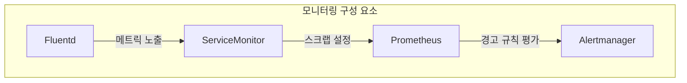
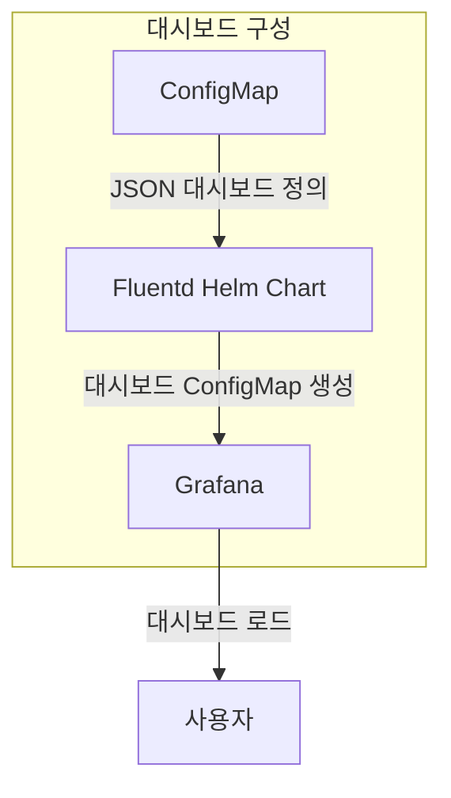
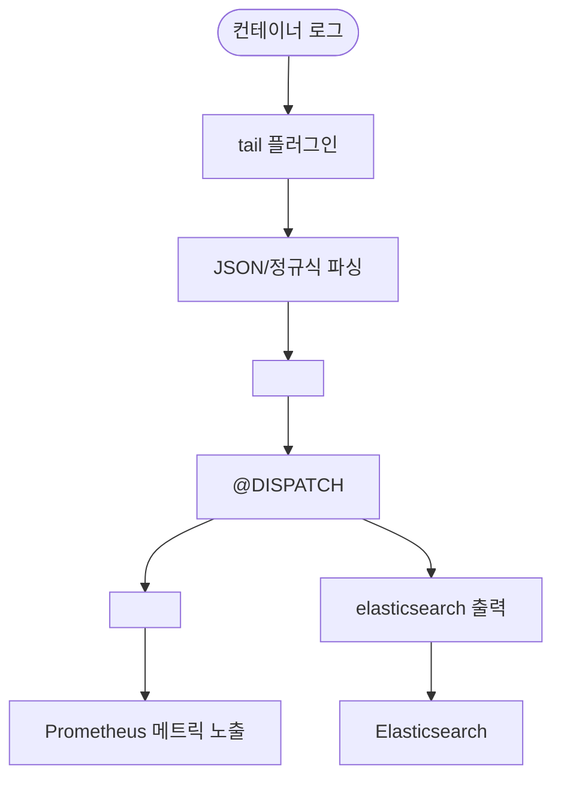
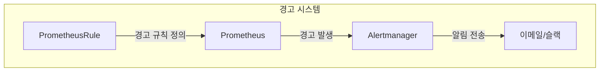

# 모니터링 설정

<cite>
**이 문서에서 참조한 파일**   
- [values.yaml](file://helm/development-tools/fluentd/values.yaml)
- [servicemonitor.yaml](file://helm/development-tools/fluentd/templates/servicemonitor.yaml)
- [prometheusrules.yaml](file://helm/development-tools/fluentd/templates/prometheusrules.yaml)
- [configmap-dashboards.yaml](file://helm/development-tools/fluentd/templates/configmap-dashboards.yaml)
- [fluentd.json](file://helm/development-tools/fluentd/dashboards/fluentd.json)
- [daemonset.yaml](file://helm/development-tools/fluentd/templates/daemonset.yaml)
- [deployment.yaml](file://helm/development-tools/fluentd/templates/deployment.yaml)
- [statefulset.yaml](file://helm/development-tools/fluentd/templates/statefulset.yaml)
</cite>

## 목차
1. [소개](#소개)
2. [프로메테우스를 통한 메트릭 수집 구조](#프로메테우스를-통한-메트릭-수집-구조)
3. [그라파나 대시보드를 통한 시각화](#그라파나-대시보드를-통한-시각화)
4. [플루언트디를 통한 로그 수집 및 전송 파이프라인](#플루언트디를-통한-로그-수집-및-전송-파이프라인)
5. [환경별 최적화된 구성 방법](#환경별-최적화된-구성-방법)
6. [경고 설정 및 문제 해결 가이드](#경고-설정-및-문제-해결-가이드)

## 소개
이 문서는 쿠버네티스 환경에서 Prometheus, Grafana, Fluentd를 활용한 종합적인 모니터링 및 로깅 시스템 설정을 설명합니다. 각 구성 요소의 역할과 상호작용 구조를 이해하고, 실제 운영 환경에 맞게 최적화하는 방법을 제시합니다. 특히 Helm 차트 기반의 설정 파일 분석을 통해 구성의 일관성과 재사용성을 보장합니다.

## 프로메테우스를 통한 메트릭 수집 구조

**다이어그램 출처**
- [servicemonitor.yaml](file://helm/development-tools/fluentd/templates/servicemonitor.yaml#L1-L45)
- [values.yaml](file://helm/development-tools/fluentd/values.yaml#L213-L245)

Fluentd는 내장된 Prometheus 플러그인을 통해 자체 운영 상태 메트릭을 `/metrics` 엔드포인트에서 노출합니다. 이 메트릭은 `ServiceMonitor` 리소스를 통해 Prometheus에 의해 자동으로 수집됩니다. `ServiceMonitor`는 `monitoring.coreos.com/v1` API를 사용하여 수집 주기, 경로, 리레이블링 규칙 등을 정의합니다. 수집된 메트릭은 Fluentd의 입력/출력 처리 속도, 버퍼 상태, 재시도 횟수 등을 포함하며, 시스템의 정상 동작 여부를 판단하는 데 사용됩니다.

**섹션 출처**
- [values.yaml](file://helm/development-tools/fluentd/values.yaml#L213-L245)
- [servicemonitor.yaml](file://helm/development-tools/fluentd/templates/servicemonitor.yaml#L1-L45)

## 그라파나 대시보드를 통한 시각화

**다이어그램 출처**
- [configmap-dashboards.yaml](file://helm/development-tools/fluentd/templates/configmap-dashboards.yaml#L1-L19)
- [fluentd.json](file://helm/development-tools/fluentd/dashboards/fluentd.json#L1-L800)

Helm 차트는 `dashboards/` 디렉터리에 위치한 `fluentd.json` 파일을 기반으로 ConfigMap 리소스를 생성합니다. 이 ConfigMap은 Grafana가 자동으로 로드할 수 있는 형식으로 대시보드를 저장합니다. 생성된 ConfigMap은 `grafana_dashboard: "1"` 라벨을 가지며, Grafana의 대시보드 공급자 설정에 따라 자동으로 인식됩니다. 대시보드는 Fluentd의 입력/출력 처리 속도, 버퍼 사용률, 재시도 및 오류 발생률 등 핵심 운영 지표를 시각화합니다.

**섹션 출처**
- [values.yaml](file://helm/development-tools/fluentd/values.yaml#L270-L277)
- [configmap-dashboards.yaml](file://helm/development-tools/fluentd/templates/configmap-dashboards.yaml#L1-L19)
- [fluentd.json](file://helm/development-tools/fluentd/dashboards/fluentd.json#L1-L800)

## 플루언트디를 통한 로그 수집 및 전송 파이프라인

**다이어그램 출처**
- [values.yaml](file://helm/development-tools/fluentd/values.yaml#L289-L390)

Fluentd는 `DaemonSet` 형태로 각 노드에 배포되어, `/var/log/containers/*.log` 경로의 컨테이너 로그 파일을 실시간으로 추적합니다. 로그는 JSON 또는 정규식 패턴으로 파싱되며, Kubernetes 메타데이터(네임스페이스, 파드 이름, 레이블 등)가 자동으로 추가됩니다. 이후 로그는 Elasticsearch로 전송되기 전에 필터링 및 라우팅됩니다. 동시에 Prometheus 메트릭도 수집되어 모니터링 시스템에 제공됩니다.

**섹션 출처**
- [values.yaml](file://helm/development-tools/fluentd/values.yaml#L5-L9)
- [values.yaml](file://helm/development-tools/fluentd/values.yaml#L289-L390)
- [daemonset.yaml](file://helm/development-tools/fluentd/templates/daemonset.yaml#L1-L41)

## 환경별 최적화된 구성 방법

### 배포 형태 선택
`values.yaml` 파일의 `kind` 설정을 통해 Fluentd의 배포 형태를 `DaemonSet`, `Deployment`, `StatefulSet` 중에서 선택할 수 있습니다. 일반적으로 로그 수집은 노드 단위로 수행되어야 하므로 `DaemonSet`이 기본값으로 권장됩니다.

### 리소스 및 자동 스케일링
`resources` 설정을 통해 CPU 및 메모리 리소스를 명시적으로 지정할 수 있으며, `autoscaling` 설정을 통해 HPA를 활성화하여 부하에 따라 복제본 수를 자동 조절할 수 있습니다.

### 볼륨 마운트
`mountVarLogDirectory` 및 `mountDockerContainersDirectory` 설정을 통해 호스트의 로그 디렉터리를 마운트하여 로그를 수집할 수 있도록 합니다.

**섹션 출처**
- [values.yaml](file://helm/development-tools/fluentd/values.yaml#L5-L9)
- [values.yaml](file://helm/development-tools/fluentd/values.yaml#L82-L97)
- [values.yaml](file://helm/development-tools/fluentd/values.yaml#L184-L185)

## 경고 설정 및 문제 해결 가이드

**다이어그램 출처**
- [prometheusrules.yaml](file://helm/development-tools/fluentd/templates/prometheusrules.yaml#L1-L22)
- [values.yaml](file://helm/development-tools/fluentd/values.yaml#L246-L269)

`metrics.prometheusRule.enabled` 값을 `true`로 설정하면, Fluentd 관련 경고 규칙을 정의할 수 있습니다. 예시로는 Fluentd 인스턴스가 다운되었을 때(`FluentdDown`) 또는 Prometheus가 Fluentd를 스크랩하지 못할 때(`FluentdScrapeMissing`) 알림을 보내는 규칙이 있습니다. 이러한 규칙은 `PrometheusRule` CRD를 통해 생성되며, Alertmanager를 통해 최종 사용자에게 알림이 전달됩니다.

### 문제 해결 가이드
- **로그 수집 누락**: Fluentd 파드의 로그를 확인하고, `in_tail_container_logs` 소스가 로그 파일을 정상적으로 읽고 있는지 확인합니다.
- **Elasticsearch 전송 실패**: 출력 플러그인의 오류 메트릭(`fluentd_output_status_num_errors`)을 확인하고, 네트워크 연결 및 인증 정보를 점검합니다.
- **버퍼 과부하**: `fluentd_output_status_buffer_available_space_ratio` 메트릭이 낮은지 확인하고, 출력 대상의 성능을 최적화하거나 버퍼 크기를 조정합니다.

**섹션 출처**
- [values.yaml](file://helm/development-tools/fluentd/values.yaml#L246-L269)
- [prometheusrules.yaml](file://helm/development-tools/fluentd/templates/prometheusrules.yaml#L1-L22)
- [fluentd.json](file://helm/development-tools/fluentd/dashboards/fluentd.json#L1-L800)