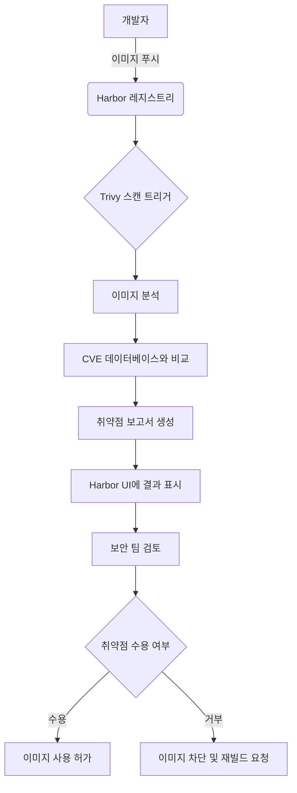
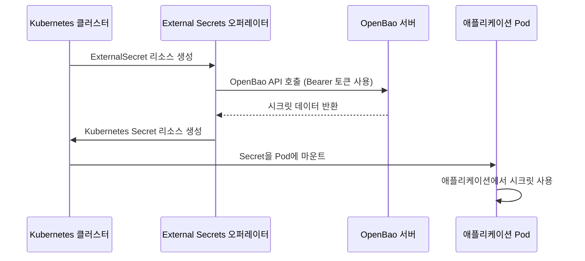
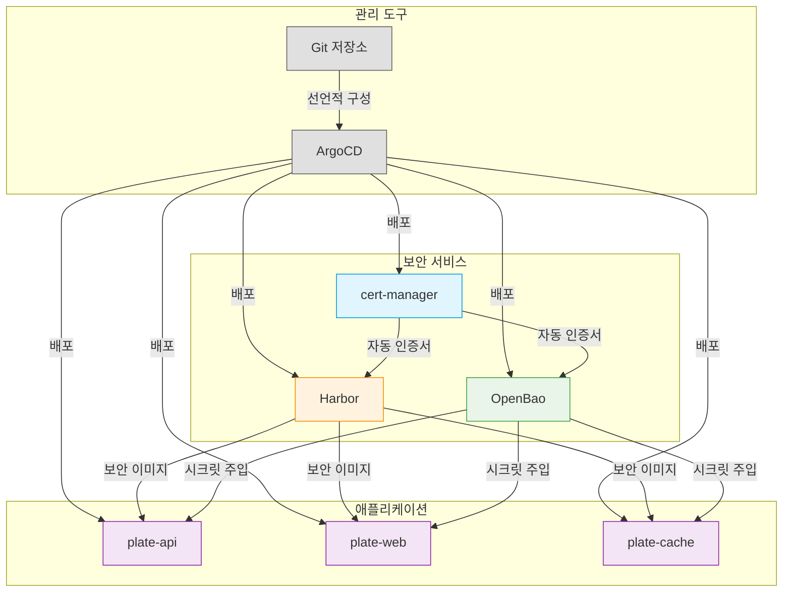

# 보안 기능

<cite>
**이 문서에서 참조한 파일**   
- [README.md](file://README.md)
- [cert-manager/values.yaml](file://helm/cluster-services/cert-manager/values.yaml)
- [cert-manager/templates/cluster-issuer-prod.yaml](file://helm/cluster-services/cert-manager/templates/cluster-issuer-prod.yaml)
- [cert-manager/templates/cluster-issuer-staging.yaml](file://helm/cluster-services/cert-manager/templates/cluster-issuer-staging.yaml)
- [nfs-provisioner/templates/podsecuritypolicy.yaml](file://helm/cluster-services/nfs-provisioner/templates/podsecuritypolicy.yaml)
- [harbor/values.yaml](file://helm/development-tools/harbor/values.yaml)
- [harbor/templates/trivy/trivy-sts.yaml](file://helm/development-tools/harbor/templates/trivy/trivy-sts.yaml)
- [openbao/values.yaml](file://helm/development-tools/openbao/values.yaml)
- [openbao-secrets-manager/values.yaml](file://helm/shared-configs/openbao-secrets-manager/values.yaml)
- [openbao-secrets-manager/templates/secret-store.yaml](file://helm/shared-configs/openbao-secrets-manager/templates/secret-store.yaml)
- [openbao-secrets-manager/templates/external-secret.yaml](file://helm/shared-configs/openbao-secrets-manager/templates/external-secret.yaml)
</cite>

## 목차
1. [소개](#소개)
2. [SSL/TLS 인증서 자동 관리](#ssltls-인증서-자동-관리)
3. [RBAC 기반 접근 제어](#rbac-기반-접근-제어)
4. [Pod Security Policy를 활용한 보안 강화](#pod-security-policy를-활용한-보안-강화)
5. [Harbor를 통한 이미지 보안 스캔](#harbor를-통한-이미지-보안-스캔)
6. [OpenBao를 활용한 시크릿 관리](#openbao를-활용한-시크릿-관리)
7. [보안 기능 통합 아키텍처](#보안-기능-통합-아키텍처)
8. [일반적인 보안 오류 및 해결 방법](#일반적인-보안-오류-및-해결-방법)
9. [결론](#결론)

## 소개
prj-devops 프로젝트는 프로덕션 환경에서 안정적으로 운영될 수 있도록 설계된 DevOps 인프라 구조로, 다계층 보안 메커니즘을 통합하여 시스템의 전반적인 보안을 강화하고 있습니다. 이 문서는 프로젝트 내에서 구현된 핵심 보안 기능들을 상세히 설명하며, 각 기능의 구현 방식, 구성 방법, 운영 시 고려사항을 다룹니다. 특히 cert-manager를 통한 SSL/TLS 인증서 자동 관리, RBAC 기반 접근 제어, Pod Security Policy(PSB)를 활용한 보안 강화, Harbor를 통한 이미지 보안 스캔, OpenBao를 활용한 시크릿 관리 등 주요 보안 메커니즘에 대해 집중적으로 설명합니다. 이러한 기능들은 서로 유기적으로 작동하여 전체 시스템의 보안을 다층적으로 강화하며, GitOps 기반의 선언적 구성 관리를 통해 일관성과 추적성을 보장합니다.

## SSL/TLS 인증서 자동 관리
prj-devops는 cert-manager를 활용하여 Kubernetes 환경에서 SSL/TLS 인증서를 자동으로 관리합니다. 이는 Let's Encrypt와의 통합을 통해 도메인 기반의 인증서를 자동으로 발급, 갱신 및 관리함으로써, 수동적인 인증서 관리에서 발생할 수 있는 오류와 보안 취약점을 최소화합니다. cert-manager는 ACME 프로토콜을 사용하여 Let's Encrypt와 통신하며, HTTP-01 챌린지를 통해 도메인 소유권을 검증합니다. 이 과정은 Ingress 리소스를 통해 자동으로 처리되며, 사용자는 복잡한 인증서 관리 절차 없이도 안전한 HTTPS 연결을 제공할 수 있습니다.

### 프로덕션 및 스테이징 환경 분리
프로젝트는 프로덕션과 스테이징 환경을 명확히 구분하여 보안 위험을 최소화합니다. `helm/cluster-services/cert-manager/values.yaml` 파일에서 `clusterIssuer` 설정을 통해 두 환경을 위한 별도의 ClusterIssuer를 정의합니다. 프로덕션 환경(`production`)은 Let's Encrypt의 실서명 서버(`https://acme-v02.api.letsencrypt.org/directory`)를 사용하여 유효한 인증서를 발급받습니다. 반면, 스테이징 환경(`staging`)은 시험용 서버(`https://acme-staging-v02.api.letsencrypt.org/directory`)를 사용하여 테스트 목적의 인증서를 발급받습니다. 이는 프로덕션 환경에서 실서명 인증서의 무효화 리스크를 방지하고, 스테이징 환경에서의 테스트를 자유롭게 수행할 수 있도록 합니다.

### 인증서 자동 발급 및 갱신
cert-manager는 `ClusterIssuer` 리소스를 통해 클러스터 전체에서 사용할 수 있는 인증서 발급 정책을 정의합니다. `cluster-issuer-prod.yaml` 및 `cluster-issuer-staging.yaml` 템플릿 파일은 `.Values.clusterIssuer` 설정에 따라 각 환경의 ClusterIssuer를 생성합니다. 이 리소스는 ACME 서버 URL, 이메일 주소, 개인 키를 저장할 시크릿 이름 및 HTTP-01 챌린지 설정을 포함합니다. Ingress 리소스에 `cert-manager.io/cluster-issuer` 어노테이션을 추가하면, cert-manager는 자동으로 해당 도메인에 대한 인증서 요청을 생성하고, 발급된 인증서를 지정된 시크릿에 저장합니다. 인증서는 만료 30일 전에 자동으로 갱신되며, 이를 통해 서비스 중단 없이 지속적인 보안 연결을 유지할 수 있습니다.

**Section sources**
- [cert-manager/values.yaml](file://helm/cluster-services/cert-manager/values.yaml#L9-L35)
- [cert-manager/templates/cluster-issuer-prod.yaml](file://helm/cluster-services/cert-manager/templates/cluster-issuer-prod.yaml#L1-L20)
- [cert-manager/templates/cluster-issuer-staging.yaml](file://helm/cluster-services/cert-manager/templates/cluster-issuer-staging.yaml#L1-L20)

## RBAC 기반 접근 제어
prj-devops는 Kubernetes의 RBAC(Role-Based Access Control) 메커니즘을 철저히 적용하여, 사용자와 서비스 어카운트의 리소스 접근 권한을 세밀하게 제어합니다. 이는 최소 권한 원칙을 따르며, 각 구성 요소가 필요한 최소한의 권한만을 부여받도록 설계되어 있습니다. 예를 들어, `nfs-provisioner`는 스토리지 프로비저닝을 위한 전용 클러스터 롤과 롤 바인딩을 가지며, `argocd`는 애플리케이션 배포를 위한 전용 권한을 가집니다. 이러한 구조는 권한 상승 공격이나 잘못된 구성으로 인한 보안 사고를 방지합니다.

### 서비스 어카운트와 롤의 명시적 정의
각 핵심 컴포넌트는 전용 서비스 어카운트(ServiceAccount)를 통해 실행되며, 이 서비스 어카운트는 필요한 권한만을 부여받는 롤(Role) 또는 클러스터 롤(ClusterRole)과 바인딩됩니다. 예를 들어, `helm/development-tools/argocd/templates/argocd-server/clusterrole.yaml`은 ArgoCD 서버가 클러스터 리소스를 관리할 수 있는 권한을 정의하고, `helm/development-tools/argocd/templates/argocd-server/serviceaccount.yaml`은 이를 위한 서비스 어카운트를 생성합니다. 이는 각 컴포넌트의 권한을 명확히 분리하여, 하나의 컴포넌트가 손상되더라도 다른 컴포넌트에 영향을 미치는 것을 제한합니다.

### 네임스페이스 기반의 접근 제어
프로젝트는 `plate-stg`와 `plate-prod`와 같은 별도의 네임스페이스를 사용하여 스테이징과 프로덕션 환경을 물리적으로 분리합니다. RBAC 정책은 이 네임스페이스를 기준으로 적용되며, 프로덕션 네임스페이스에 대한 접근은 엄격히 제한됩니다. ArgoCD Application 리소스는 `destination.namespace` 필드를 통해 각 애플리케이션이 배포될 네임스페이스를 명시적으로 지정합니다. 이는 사용자가 의도하지 않은 네임스페이스에 리소스를 배포하는 것을 방지하고, 환경 간의 오염을 차단합니다.

**Section sources**
- [nfs-provisioner/templates/podsecuritypolicy.yaml](file://helm/cluster-services/nfs-provisioner/templates/podsecuritypolicy.yaml#L1-L30)
- [environments/argocd/apps/plate-api-prod.yaml](file://environments/argocd/apps/plate-api-prod.yaml#L1-L20)

## Pod Security Policy를 활용한 보안 강화
prj-devops는 Pod Security Policy(PSB)를 사용하여 Pod의 보안 설정을 강제합니다. PSB는 Pod가 생성될 때 특정 보안 조건을 충족해야 하도록 요구하며, 이를 통해 컨테이너의 권한 상승, 파일 시스템 접근, 네트워크 사용 등을 제어합니다. 이는 Pod 수준에서의 보안을 강화하고, 공격자가 컨테이너 내부에 침투했을 때의 피해를 최소화하는 데 중요한 역할을 합니다.

### Pod Security Policy 설정
`helm/cluster-services/nfs-provisioner/templates/podsecuritypolicy.yaml` 파일은 NFS 프로비저너를 위한 PSB를 정의합니다. 이 정책은 다음과 같은 보안 규칙을 포함합니다:
- `privileged: false`: 특권 모드 실행을 금지합니다.
- `allowPrivilegeEscalation: false`: 권한 상승을 금지합니다.
- `requiredDropCapabilities: - ALL`: 모든 리눅스 캡처리티를 삭제합니다.
- `readOnlyRootFilesystem: false`: 루트 파일 시스템을 읽기 전용으로 설정하지 않습니다 (NFS 프로비저너의 기능상 필요).
- `volumes: - 'secret', - 'nfs', - 'persistentVolumeClaim'`: 허용되는 볼륨 유형을 제한합니다.

이러한 설정은 Pod가 최소한의 권한으로 실행되도록 강제하며, 시스템 리소스에 대한 불필요한 접근을 차단합니다. `global.psp.enable` 설정을 통해 OpenBao와 같은 다른 컴포넌트에도 PSB를 적용할 수 있습니다.

**Section sources**
- [nfs-provisioner/templates/podsecuritypolicy.yaml](file://helm/cluster-services/nfs-provisioner/templates/podsecuritypolicy.yaml#L1-L30)
- [openbao/values.yaml](file://helm/development-tools/openbao/values.yaml#L32-L42)

## Harbor를 통한 이미지 보안 스캔
Harbor는 컨테이너 이미지 레지스트리로서, 이미지 저장소뿐만 아니라 보안 스캔 기능을 제공합니다. prj-devops는 Harbor를 통해 모든 컨테이너 이미지를 저장하고, Trivy 스캐너를 사용하여 이미지에 포함된 알려진 취약점(Vulnerabilities)을 자동으로 스캔합니다. 이는 악성 코드나 보안 취약점이 포함된 이미지가 프로덕션 환경에 배포되는 것을 방지합니다.

### Trivy 기반 이미지 스캔
Harbor는 내장된 Trivy 스캐너를 사용하여 이미지 스캔을 수행합니다. `helm/development-tools/harbor/values.yaml` 파일에서 `trivy.enabled: true` 설정을 통해 Trivy 기능을 활성화합니다. Trivy는 이미지의 OS 패키지 및 애플리케이션 종속성(dependencies)을 분석하여, CVE(Common Vulnerabilities and Exposures) 데이터베이스와 비교하여 알려진 취약점을 식별합니다. 스캔 결과는 Harbor 웹 UI에서 확인할 수 있으며, 취약점의 심각도(Critical, High, Medium, Low)에 따라 분류됩니다.

### 스캔 정책 및 통합
Harbor는 다양한 스캔 정책을 설정할 수 있습니다. `values.yaml` 파일에서 `trivy.severity`를 통해 스캔 대상 취약점의 최소 심각도를 설정할 수 있으며, `trivy.ignoreUnfixed`를 통해 수정되지 않은 취약점만 표시할 수 있습니다. 이미지 스캔은 이미지 푸시 후 자동으로 트리거되며, CI/CD 파이프라인과 통합하여 이미지 푸시 전에 스캔을 수행할 수도 있습니다. 이는 보안 검사를 배포 프로세스의 필수 단계로 만들고, 보안 위협을 조기에 발견할 수 있도록 합니다.

**Diagram sources**
- [harbor/values.yaml](file://helm/development-tools/harbor/values.yaml#L794-L800)
- [harbor/templates/trivy/trivy-sts.yaml](file://helm/development-tools/harbor/templates/trivy/trivy-sts.yaml#L1-L232)
- [harbor/templates/trivy/trivy-secret.yaml](file://helm/development-tools/harbor/templates/trivy/trivy-secret.yaml#L1-L14)
- [harbor/templates/trivy/trivy-svc.yaml](file://helm/development-tools/harbor/templates/trivy/trivy-svc.yaml#L1-L18)

## OpenBao를 활용한 시크릿 관리
prj-devops는 OpenBao를 중앙 집중식 시크릿 관리자로 사용하여, 데이터베이스 비밀번호, API 키, TLS 인증서 등의 민감한 정보를 안전하게 저장하고 관리합니다. OpenBao는 동적 시크릿 생성, 액세스 제어, 감사 로그 기능을 제공하며, Kubernetes와의 통합을 통해 애플리케이션 Pod에 시크릿을 안전하게 주입할 수 있습니다.

### 시크릿 저장 및 접근 제어
OpenBao는 `kv-v2` 시크릿 엔진을 사용하여 시크릿을 저장합니다. `helm/shared-configs/openbao-secrets-manager/values.yaml` 파일에서 `openbao.path: "secret"`을 통해 기본 경로를 설정하며, `environments.staging.remoteRef.key: "server/staging"`과 같이 환경별로 다른 경로를 지정할 수 있습니다. 각 시크릿은 경로 기반의 접근 제어 정책(ACL)에 의해 보호되며, 특정 서비스 어카운트만이 특정 경로의 시크릿을 읽을 수 있도록 권한을 부여할 수 있습니다. 이는 민감한 정보의 무단 접근을 방지합니다.

### External Secrets를 통한 시크릿 동기화
prj-devops는 `external-secrets` 오퍼레이터를 사용하여 OpenBao에 저장된 시크릿을 Kubernetes 시크릿으로 자동 동기화합니다. `openbao-secrets-manager` Helm 차트는 `external-secret.yaml` 템플릿을 통해 `ExternalSecret` 리소스를 생성합니다. 이 리소스는 OpenBao의 특정 경로에서 시크릿을 가져와, 지정된 네임스페이스에 Kubernetes `Secret` 리소스로 생성합니다. `refreshInterval: "1h"` 설정을 통해 주기적으로 동기화를 수행하여, 시크릿이 변경되었을 때 자동으로 업데이트됩니다. 이는 애플리케이션 Pod가 OpenBao에 직접 연결하지 않고도 최신 시크릿을 사용할 수 있도록 합니다.

**Diagram sources**
- [openbao-secrets-manager/values.yaml](file://helm/shared-configs/openbao-secrets-manager/values.yaml#L1-L230)
- [openbao-secrets-manager/templates/secret-store.yaml](file://helm/shared-configs/openbao-secrets-manager/templates/secret-store.yaml#L1-L29)
- [openbao-secrets-manager/templates/external-secret.yaml](file://helm/shared-configs/openbao-secrets-manager/templates/external-secret.yaml#L1-L49)
- [openbao/values.yaml](file://helm/development-tools/openbao/values.yaml#L48-L340)

## 보안 기능 통합 아키텍처
prj-devops의 보안 기능들은 서로 유기적으로 연결되어 있으며, GitOps 기반의 선언적 구성 관리를 통해 일관성 있게 운영됩니다. cert-manager는 Ingress 리소스를 통해 자동으로 인증서를 발급받으며, 이 인증서는 Harbor와 OpenBao의 웹 UI에 HTTPS 연결을 제공합니다. Harbor는 이미지 스캔을 통해 안전한 컨테이너 이미지를 보장하고, OpenBao는 이러한 이미지에서 실행되는 애플리케이션에 필요한 시크릿을 안전하게 제공합니다. 모든 구성은 Helm 차트와 ArgoCD Application 리소스를 통해 Git 저장소에 형상 관리되며, 변경 사항은 ArgoCD를 통해 자동으로 클러스터에 동기화됩니다. 이는 보안 정책의 일관성과 추적성을 보장하며, 수동적인 구성 실수를 방지합니다.

**Diagram sources**
- [README.md](file://README.md#L248-L265)
- [environments/argocd/app-of-apps.yaml](file://environments/argocd/app-of-apps.yaml#L1-L20)

## 일반적인 보안 오류 및 해결 방법
### 인증서 발급 실패
**현상**: Ingress 리소스에 인증서가 바인딩되지 않고, `kubectl get certificates` 명령어로 상태를 확인하면 `Failed` 또는 `Pending` 상태로 표시됩니다.
**원인**: 가장 흔한 원인은 DNS 레코드가 Ingress Controller의 LoadBalancer IP와 올바르게 연결되지 않았거나, HTTP-01 챌린지 응답을 위한 네트워크 경로가 차단된 경우입니다.
**해결 방법**: `kubectl describe certificate <인증서 이름>` 명령어를 사용하여 이벤트 로그를 확인합니다. `Order` 및 `Challenge` 리소스의 상태를 확인하여 문제의 정확한 위치를 파악합니다. DNS 레코드가 올바르게 설정되었는지, 방화벽이 80번 포트를 차단하지 않는지 확인합니다.

### OpenBao 시크릿 동기화 실패
**현상**: `ExternalSecret` 리소스는 생성되었지만, 대상 `Secret` 리소스가 생성되지 않거나, 생성된 시크릿의 내용이 OpenBao의 내용과 일치하지 않습니다.
**원인**: OpenBao 서버에 대한 접근이 불가능하거나, `SecretStore`에 설정된 토큰이 만료되었거나, OpenBao의 ACL 정책이 외부 시크릿 오퍼레이터의 서비스 어카운트에 충분한 권한을 부여하지 않은 경우입니다.
**해결 방법**: `kubectl logs -n <external-secrets-namespace> <external-secrets-pod>` 명령어로 외부 시크릿 오퍼레이터의 로그를 확인합니다. OpenBao 서버의 접근성, 토큰의 유효성, ACL 정책을 점검합니다.

### Harbor 이미지 스캔 미수행
**현상**: 이미지를 Harbor에 푸시했지만, 스캔이 자동으로 시작되지 않거나, 스캔 상태가 `Not Scanned`으로 표시됩니다.
**원因**: Trivy 스캐너가 정상적으로 실행되지 않았거나, Harbor 구성에서 스캔 기능이 비활성화된 경우입니다.
**해결 방법**: `kubectl get pods -n <harbor-namespace>` 명령어로 `harbor-trivy` Pod의 상태를 확인합니다. Pod가 `CrashLoopBackOff` 상태인지, 로그에 오류 메시지가 있는지 확인합니다. `values.yaml` 파일에서 `trivy.enabled` 설정이 `true`인지 확인합니다.

**Section sources**
- [README.md](file://README.md#L339-L342)
- [openbao-secrets-manager/values.yaml](file://helm/shared-configs/openbao-secrets-manager/values.yaml#L21-L34)
- [harbor/values.yaml](file://helm/development-tools/harbor/values.yaml#L794-L800)

## 결론
prj-devops 프로젝트는 cert-manager, RBAC, Pod Security Policy, Harbor, OpenBao 등 다양한 보안 도구를 통합하여 다층적인 보안 아키텍처를 구축하고 있습니다. 이러한 기능들은 각각의 영역에서 보안을 강화할 뿐만 아니라, 서로 긴밀하게 연동되어 전체 시스템의 보안 수준을 극대화합니다. GitOps 기반의 선언적 구성 관리는 이러한 복잡한 보안 설정을 일관성 있고 추적 가능하게 유지하며, 수동적인 구성 실수를 방지합니다. 이 문서에서 설명한 설정과 운영 가이드를 따르면, 안정적이고 보안성이 강화된 프로덕션 환경을 구축하고 운영할 수 있습니다. 지속적인 모니터링과 정기적인 보안 점검을 통해, 새로운 보안 위협에 대응하고 시스템의 보안성을 지속적으로 유지해야 합니다.