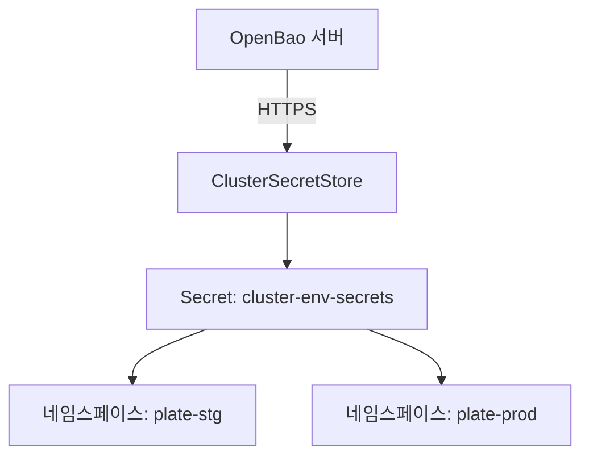
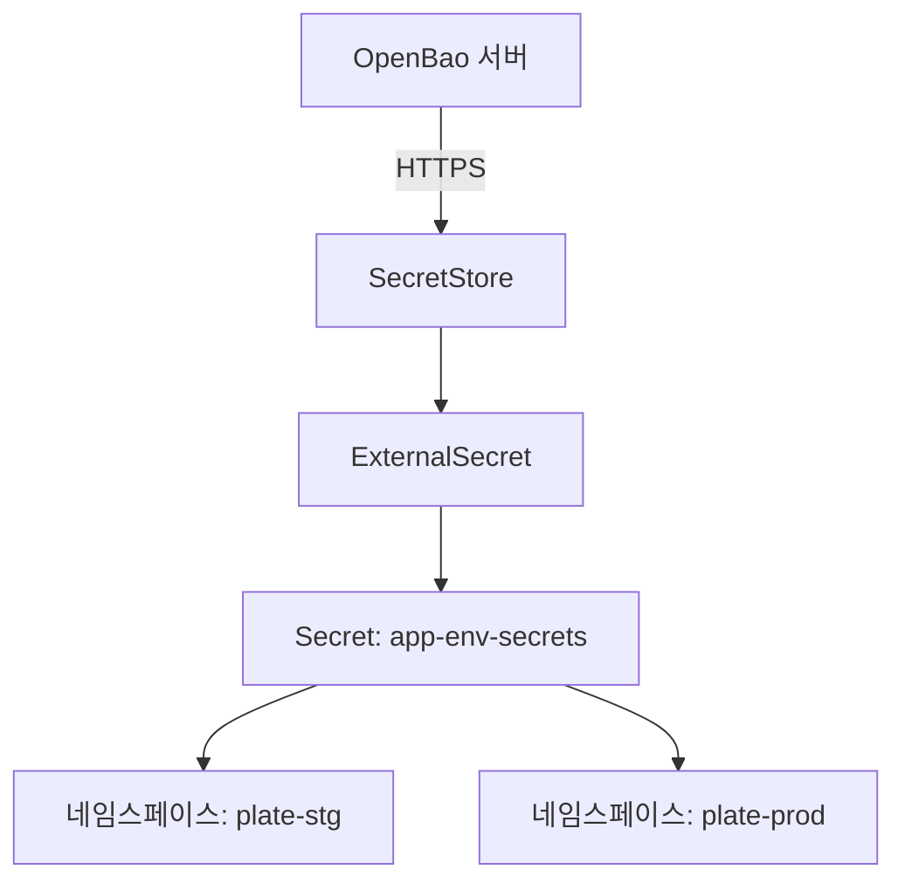
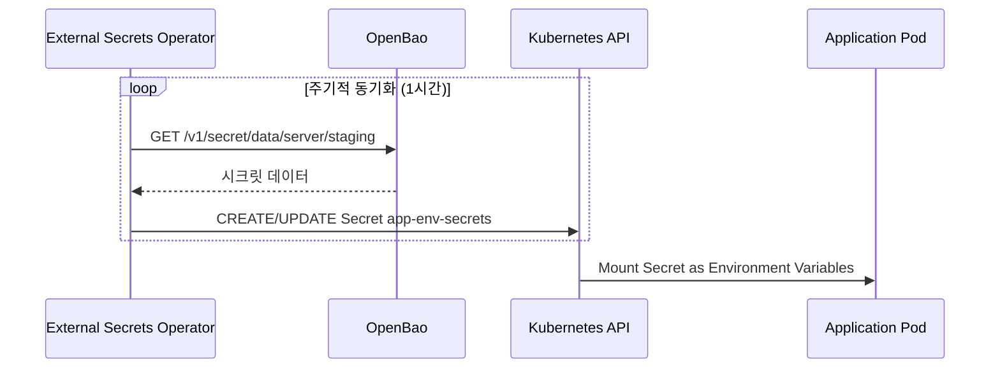
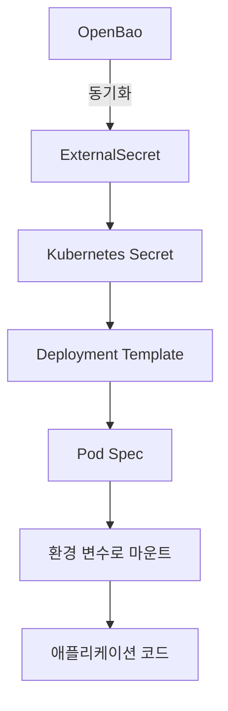

# 시크릿 관리

<cite>
**이 문서에서 참조한 파일**   
- [openbao-secrets-manager/values.yaml](file://helm/shared-configs/openbao-secrets-manager/values.yaml)
- [openbao-secrets-manager/templates/secret-store.yaml](file://helm/shared-configs/openbao-secrets-manager/templates/secret-store.yaml)
- [openbao-secrets-manager/templates/external-secret.yaml](file://helm/shared-configs/openbao-secrets-manager/templates/external-secret.yaml)
- [openbao-secrets-manager/templates/service-account.yaml](file://helm/shared-configs/openbao-secrets-manager/templates/service-account.yaml)
- [openbao-cluster-secrets-manager/values.yaml](file://helm/shared-configs/openbao-cluster-secrets-manager/values.yaml)
- [openbao-cluster-secrets-manager/templates/openbao-token-secret.yaml](file://helm/shared-configs/openbao-cluster-secrets-manager/templates/openbao-token-secret.yaml)
- [plate-api/values.yaml](file://helm/applications/plate-server/values.yaml)
- [plate-api/templates/deployment.yaml](file://helm/applications/plate-server/templates/deployment.yaml)
- [create-token.sh](file://scripts/openbao/create-token.sh)
- [setup-esc.sh](file://scripts/openbao/setup-esc.sh)
- [create-secrets.sh](file://scripts/openbao/create-secrets.sh)
- [openbao/values.yaml](file://helm/development-tools/openbao/values.yaml)
</cite>

## 목차
1. [소개](#소개)
2. [중앙 집중식 시크릿 저장소 구성](#중앙-집중식-시크릿-저장소-구성)
3. [동적 시크릿 생성 및 자동 주입](#동적-시크릿-생성-및-자동-주입)
4. [시크릿 수명 주기 관리](#시크릿-수명-주기-관리)
5. [액세스 정책 정의](#액세스-정책-정의)
6. [Helm 차트를 통한 배포 및 보안 설정](#helm-차트를-통한-배포-및-보안-설정)
7. [시크릿 접근 감사 로깅 및 위협 탐지](#시크릿-접근-감사-로깅-및-위협-탐지)

## 소개

OpenBao는 Kubernetes 환경에서 중앙 집중식으로 시크릿을 관리하는 솔루션으로, 민감한 정보(예: API 키, 데이터베이스 자격 증명, 인증서)를 안전하게 저장하고 애플리케이션에 동적으로 주입할 수 있도록 합니다. 본 문서는 OpenBao를 활용한 시크릿 관리 시스템의 핵심 구성 요소와 운영 방식을 설명합니다. 시크릿 저장소 설정, 동적 생성, 자동 주입 메커니즘, 수명 주기 관리, 액세스 정책, Helm을 통한 배포 설정, 그리고 감사 로깅 및 위협 탐지 기능까지 포괄합니다.

## 중앙 집중식 시크릿 저장소 구성

OpenBao는 외부 시크릿 관리자(External Secrets Operator, ESC)와 통합되어 Kubernetes 클러스터 외부에 있는 시크릿을 클러스터 내부로 동기화합니다. 시크릿 저장소는 두 가지 유형으로 구성됩니다.

### 클러스터 레벨 시크릿 저장소

`openbao-cluster-secrets-manager` Helm 차트는 클러스터 전체에서 공유되는 시크릿을 관리합니다. 이 저장소는 `ClusterSecretStore` 리소스를 사용하여 모든 네임스페이스에서 접근할 수 있는 시크릿을 제공합니다. 예를 들어, GitHub 클라이언트 ID 및 비밀과 같은 공통 인증 정보가 여기에 저장됩니다.

**다이어그램 소스**
- [openbao-cluster-secrets-manager/values.yaml](file://helm/shared-configs/openbao-cluster-secrets-manager/values.yaml#L20-L46)

### 네임스페이스 레벨 시크릿 저장소

`openbao-secrets-manager` Helm 차트는 각 애플리케이션 환경(staging, production)에 맞는 시크릿을 관리합니다. 이 저장소는 `SecretStore` 리소스를 사용하여 특정 네임스페이스에만 시크릿을 동기화합니다. 예를 들어, 백엔드 애플리케이션의 데이터베이스 URL, AWS 자격 증명, SMTP 설정 등이 여기에 포함됩니다.

**다이어그램 소스**
- [openbao-secrets-manager/values.yaml](file://helm/shared-configs/openbao-secrets-manager/values.yaml#L34-L164)
- [openbao-secrets-manager/templates/secret-store.yaml](file://helm/shared-configs/openbao-secrets-manager/templates/secret-store.yaml#L1-L29)

**섹션 소스**
- [openbao-secrets-manager/values.yaml](file://helm/shared-configs/openbao-secrets-manager/values.yaml#L1-L233)
- [openbao-cluster-secrets-manager/values.yaml](file://helm/shared-configs/openbao-cluster-secrets-manager/values.yaml#L1-L46)

## 동적 시크릿 생성 및 자동 주입

OpenBao는 시크릿을 정적 파일이 아닌 동적으로 생성하고, 애플리케이션 Pod에 자동으로 주입하는 메커니즘을 제공합니다.

### 동적 시크릿 생성

`external-secrets.io/v1` API를 사용하는 `ExternalSecret` 리소스는 OpenBao 내의 특정 경로(예: `secret/server/staging`)에 있는 시크릿을 지정된 주기(예: 1시간)로 폴링하여 Kubernetes `Secret` 리소스로 동기화합니다. 이 과정은 OpenBao에 저장된 시크릿이 변경되면 자동으로 클러스터 내 시크릿도 업데이트되도록 보장합니다.

**다이어그램 소스**
- [openbao-secrets-manager/templates/external-secret.yaml](file://helm/shared-configs/openbao-secrets-manager/templates/external-secret.yaml#L1-L49)

### 시크릿 자동 주입

애플리케이션 Pod는 생성된 `Secret` 리소스를 환경 변수로 사용합니다. `plate-api` Helm 차트의 `values.yaml` 파일은 `appSecrets` 섹션을 통해 어떤 시크릿을 주입할지 정의합니다. `deployment.yaml` 템플릿은 이를 바탕으로 `env` 섹션을 생성하여, Pod가 시작될 때 시크릿의 값을 환경 변수로 로드합니다.

**다이어그램 소스**
- [plate-api/values.yaml](file://helm/applications/plate-server/values.yaml#L32-L85)
- [plate-api/templates/deployment.yaml](file://helm/applications/plate-server/templates/deployment.yaml#L33-L41)

**섹션 소스**
- [openbao-secrets-manager/templates/external-secret.yaml](file://helm/shared-configs/openbao-secrets-manager/templates/external-secret.yaml#L1-L49)
- [plate-api/values.yaml](file://helm/applications/plate-server/values.yaml#L1-L85)
- [plate-api/templates/deployment.yaml](file://helm/applications/plate-server/templates/deployment.yaml#L1-L45)

## 시크릿 수명 주기 관리

시크릿의 수명 주기는 생성, 사용, 갱신, 폐기의 단계로 관리됩니다.

### 생성 및 갱신

`create-token.sh` 스크립트는 OpenBao에 정책을 기반으로 새로운 토큰을 생성합니다. 이 토큰은 `TTL(Time To Live)`과 `Period`라는 두 가지 주요 속성으로 수명을 관리합니다. `TTL`은 토큰의 총 유효 기간이며, `Period`는 토큰이 자동으로 갱신되는 주기입니다. 예를 들어, `TTL=720h`, `Period=24h`로 설정하면 토큰은 30일 동안 유효하지만, 매일 자동으로 갱신되어 유효 기간이 연장됩니다.

### 폐기

불필요하거나 유출된 토큰은 `revoke-non-root-tokens.sh` 스크립트를 사용하여 즉시 폐기(revoke)할 수 있습니다. 또한, `create-token.sh` 스크립트는 동일한 정책을 사용하는 기존 토큰을 검색하고 무효화하는 옵션을 제공하여, 새로운 토큰 생성 시 이전 토큰의 사용을 방지합니다.

**섹션 소스**
- [create-token.sh](file://scripts/openbao/create-token.sh#L1-L550)
- [setup-esc.sh](file://scripts/openbao/setup-esc.sh#L1-L149)

## 액세스 정책 정의

OpenBao의 액세스 제어는 HCL(HashiCorp Configuration Language)로 작성된 정책(Policy)을 통해 정의됩니다. 정책은 특정 경로에 대한 읽기, 쓰기, 삭제 등의 권한을 명시합니다.

### 정책 생성

`setup-esc.sh` 스크립트는 `esc-policy.hcl` 파일에 정의된 정책을 OpenBao에 업로드합니다. 이 정책은 `secret/data/server/*` 및 `secret/data/harbor/*` 경로에 대한 읽기 권한을 부여하여, 외부 시크릿 관리자가 이 경로의 시크릿을 가져올 수 있도록 합니다.

### 정책 적용

생성된 토큰은 하나 이상의 정책과 연결됩니다. `create-token.sh` 스크립트를 사용하여 토큰을 생성할 때, 사용자는 토큰에 적용할 정책을 선택할 수 있습니다. 이 토큰은 이후 OpenBao API에 접근할 때 해당 정책의 권한을 갖게 됩니다.

**섹션 소스**
- [setup-esc.sh](file://scripts/openbao/setup-esc.sh#L26-L37)
- [create-token.sh](file://scripts/openbao/create-token.sh#L81-L104)

## Helm 차트를 통한 배포 및 보안 설정

OpenBao 관련 컴포넌트는 Helm 차트를 통해 선언적으로 배포되며, values.yaml 파일을 통해 보안 관련 설정을 관리합니다.

### 주요 보안 관련 설정

`openbao-secrets-manager` 차트의 `values.yaml` 파일은 다음과 같은 보안 설정을 포함합니다:
- **securityContext**: 컨테이너가 루트 사용자가 아닌 비루트 사용자(`runAsNonRoot: true`, `runAsUser: 1001`)로 실행되도록 설정합니다.
- **resources**: CPU 및 메모리 리소스의 요청과 제한을 설정하여 리소스 과다 사용을 방지합니다.
- **serviceAccount**: 외부 시크릿 관리자가 Kubernetes API에 접근하기 위한 전용 서비스 어카운트를 생성합니다.

### Pod Security Policy 적용

`helm/development-tools/openbao` 디렉토리 내의 `injector-psp.yaml` 및 `server-psp.yaml` 파일은 OpenBao injector와 서버 컴포넌트에 적용되는 Pod Security Policy(PSP)를 정의합니다. 이 정책은 Pod의 보안 컨텍스트, 볼륨 유형, 특권 모드 등을 제한하여 Pod의 보안을 강화합니다. Helm 차트의 `values.yaml` 파일은 이러한 PSP 리소스를 조건부로 생성할 수 있도록 `psp.enabled` 같은 옵션을 제공합니다.

**섹션 소스**
- [openbao-secrets-manager/values.yaml](file://helm/shared-configs/openbao-secrets-manager/values.yaml#L184-L209)
- [openbao/values.yaml](file://helm/development-tools/openbao/values.yaml#L1-L100) (PSP 관련 설정 추정)

## 시크릿 접근 감사 로깅 및 위협 탐지

OpenBao는 모든 시크릿 접근 시도를 상세하게 로깅하여 감사 추적이 가능하게 합니다.

### 감사 로깅

OpenBao 서버는 기본적으로 감사 로그를 활성화합니다. 모든 API 호출(예: `vault kv get`, `vault kv put`)은 로그에 기록되며, 호출한 클라이언트의 IP 주소, 요청 시간, 접근한 경로, 사용된 토큰의 일부 정보 등이 포함됩니다. 이 로그는 `vault audit` 명령어를 통해 확인하거나, 외부 로깅 시스템(Fluentd, Promtail)으로 전송하여 중앙에서 관리할 수 있습니다.

### 위협 탐지

감사 로그는 위협 탐지의 기초 자료로 활용됩니다. 예를 들어, 특정 시간 내에 비정상적으로 많은 시크릿 접근 시도가 발생했는지, 알려지지 않은 IP 주소에서 접근이 발생했는지 등을 모니터링할 수 있습니다. 이 정보는 Prometheus와 Grafana를 통해 시각화하고, Alertmanager를 통해 경고를 설정할 수 있습니다. `create-secrets.sh` 스크립트는 시크릿 생성 후 정상적인 접근 테스트를 수행하여, 초기 설정의 정상 여부를 검증합니다.

**섹션 소스**
- [create-secrets.sh](file://scripts/openbao/create-secrets.sh#L1-L29)
- [setup-esc.sh](file://scripts/openbao/setup-esc.sh#L103-L119)