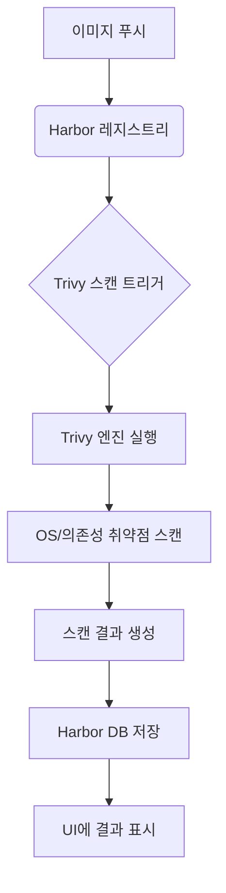
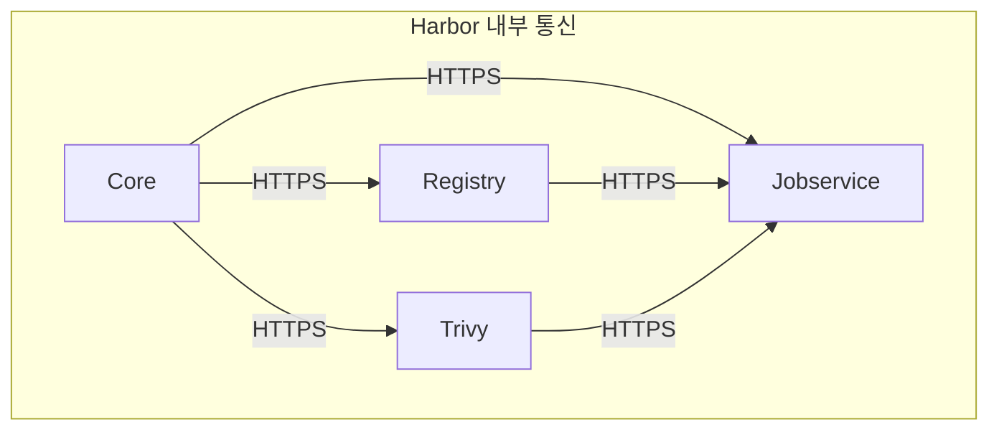

# 이미지 보안

<cite>
**이 문서에서 참조한 파일**  
- [harbor/Chart.yaml](file://helm/development-tools/harbor/Chart.yaml)
- [harbor/values.yaml](file://helm/development-tools/harbor/values.yaml)
- [harbor/templates/trivy/trivy-secret.yaml](file://helm/development-tools/harbor/templates/trivy/trivy-secret.yaml)
- [harbor/templates/trivy/trivy-sts.yaml](file://helm/development-tools/harbor/templates/trivy/trivy-sts.yaml)
- [harbor/templates/trivy/trivy-svc.yaml](file://helm/development-tools/harbor/templates/trivy/trivy-svc.yaml)
- [harbor/templates/trivy/trivy-tls.yaml](file://helm/development-tools/harbor/templates/trivy/trivy-tls.yaml)
- [harbor/templates/registry/registry-secret.yaml](file://helm/development-tools/harbor/templates/registry/registry-secret.yaml)
- [harbor/templates/registry/registry-tls.yaml](file://helm/development-tools/harbor/templates/registry/registry-tls.yaml)
- [harbor/templates/registry/registry-cm.yaml](file://helm/development-tools/harbor/templates/registry/registry-cm.yaml)
- [harbor/templates/core/core-secret.yaml](file://helm/development-tools/harbor/templates/core/core-secret.yaml)
- [harbor/templates/core/core-tls.yaml](file://helm/development-tools/harbor/templates/core/core-tls.yaml)
- [harbor/templates/jobservice/jobservice-secrets.yaml](file://helm/development-tools/harbor/templates/jobservice/jobservice-secrets.yaml)
- [harbor/templates/jobservice/jobservice-tls.yaml](file://helm/development-tools/harbor/templates/jobservice/jobservice-tls.yaml)
</cite>

## 목차
1. [소개](#소개)
2. [Harbor 이미지 스캐닝 및 취약점 분석](#harbor-이미지-스캐닝-및-취약점-분석)
3. [정책 기반 이미지 푸시 제어 및 SBOM 생성](#정책-기반-이미지-푸시-제어-및-sbom-생성)
4. [이미지 서명 및 검증](#이미지-서명-및-검증)
5. [TLS 보안 설정 및 secret.yaml 구성](#tls-보안-설정-및-secretyaml-구성)
6. [프라이빗 레지스트리 접근 제어 정책](#프라이빗-레지스트리-접근-제어-정책)
7. [CI/CD 파이프라인과의 스캔 결과 통합](#cicd-파이프라인과의-스캔-결과-통합)
8. [취약점 기준 자동 블록킹 전략](#취약점-기준-자동-블록킹-전략)

## 소개
Harbor는 신뢰할 수 있는 클라우드 네이티브 레지스트리로, 컨테이너 이미지 및 아티팩트의 저장, 서명, 스캔 기능을 제공합니다. 본 문서는 Harbor를 활용한 컨테이너 이미지 보안 강화 전략에 대해 설명합니다. Trivy 엔진을 통한 이미지 스캐닝, 취약점 분석, 정책 기반 이미지 푸시 제어, SBOM(Software Bill of Materials) 생성, 이미지 서명 및 검증 기능을 포함하며, TLS 보안 설정을 위한 `secret.yaml` 구성 방법과 프라이빗 레지스트리 접근 제어 정책도 다룹니다. 또한, CI/CD 파이프라인에 스캔 결과를 통합하고 취약점 기준에 따라 자동으로 이미지 푸시를 차단하는 전략을 설명합니다.

## Harbor 이미지 스캐닝 및 취약점 분석
Harbor는 Trivy 오픈소스 취약점 스캐너를 통합하여 컨테이너 이미지와 소프트웨어 종속성에 대한 보안 취약점을 자동으로 분석합니다. Trivy는 OS 패키지 및 언어별 종속성(Cargo, Composer, npm, NuGet, pip, etc.)의 취약점을 식별하며, Harbor는 이를 기반으로 이미지의 보안 상태를 평가합니다. 스캔은 이미지 푸시 후 자동으로 실행되며, 결과는 Harbor 웹 UI에서 시각적으로 확인할 수 있습니다.

Trivy는 Harbor의 Helm 차트에서 활성화되며, `values.yaml` 파일 내 `trivy.enabled: true` 설정을 통해 제어됩니다. Trivy 어댑터는 StatefulSet으로 배포되며, Redis를 사용하여 스캔 캐시를 관리합니다. 스캔 결과는 Harbor의 정책 엔진과 연동되어 이미지 푸시 제어에 활용됩니다.

**다이어그램 출처**  
- [harbor/values.yaml](file://helm/development-tools/harbor/values.yaml#L794-L800)
- [harbor/templates/trivy/trivy-sts.yaml](file://helm/development-tools/harbor/templates/trivy/trivy-sts.yaml#L1-L232)

**섹션 출처**  
- [harbor/values.yaml](file://helm/development-tools/harbor/values.yaml#L794-L800)
- [harbor/templates/trivy/trivy-sts.yaml](file://helm/development-tools/harbor/templates/trivy/trivy-sts.yaml#L1-L232)

## 정책 기반 이미지 푸시 제어 및 SBOM 생성
Harbor는 프로젝트 단위로 이미지 푸시에 대한 보안 정책을 설정할 수 있습니다. 주요 정책 중 하나는 "스캔 후 푸시 허용"입니다. 이 정책을 활성화하면, 이미지가 푸시된 후 자동으로 Trivy 스캔이 실행되며, 스캔이 완료되기 전까지는 이미지를 풀할 수 없습니다. 이는 보안 검사 없이 이미지를 사용하는 것을 방지합니다.

또한, Harbor는 이미지의 SBOM(Software Bill of Materials) 생성을 지원합니다. SBOM은 이미지 내에 포함된 모든 소프트웨어 구성 요소(OS 패키지, 라이브러리 등)의 목록을 제공하여, 공급망 보안(Supply Chain Security)을 강화합니다. 사용자는 UI를 통해 이미지의 SBOM을 다운로드하고 분석할 수 있습니다.

**섹션 출처**  
- [harbor/values.yaml](file://helm/development-tools/harbor/values.yaml#L794-L800)

## 이미지 서명 및 검증
Harbor는 Notary v2를 통한 이미지 서명 기능을 제공하여, 이미지의 무결성과 출처를 보장합니다. 이미지가 푸시되면, 허가된 사용자 또는 시스템이 해당 이미지를 디지털 서명할 수 있습니다. 이후 이미지를 풀할 때, Harbor는 서명을 검증하여 이미지가 허가된 출처에서 왔는지, 그리고 변경되지 않았는지를 확인합니다. 이 기능은 악의적인 이미지 삽입을 방지하고, 신뢰할 수 있는 배포 파이프라인을 구축하는 데 필수적입니다.

## TLS 보안 설정 및 secret.yaml 구성
Harbor 구성 요소들 간의 내부 통신을 보호하기 위해 내부 TLS(internal TLS)를 구성할 수 있습니다. 내부 TLS는 Harbor의 핵심(core), 레지스트리(registry), jobservice, Trivy 등 주요 컴포넌트 간의 HTTPS 통신을 암호화합니다. `values.yaml` 파일에서 `internalTLS.enabled: true`로 설정하고, 인증서 소스를 `auto`, `manual`, 또는 `secret`으로 지정할 수 있습니다.

`secret` 소스를 사용할 경우, 사용자는 사전에 생성한 Kubernetes Secret을 통해 TLS 인증서를 제공해야 합니다. 각 컴포넌트에 대한 별도의 Secret이 필요하며, 예를 들어 `core-tls.yaml` 템플릿은 `internalTLS.core.secretName` 값에 지정된 Secret을 참조합니다. 이 Secret은 `tls.crt`와 `tls.key`라는 키를 포함해야 합니다.

**다이어그램 출처**  
- [harbor/values.yaml](file://helm/development-tools/harbor/values.yaml#L281-L282)
- [harbor/templates/core/core-tls.yaml](file://helm/development-tools/harbor/templates/core/core-tls.yaml#L1-L17)
- [harbor/templates/registry/registry-tls.yaml](file://helm/development-tools/harbor/templates/registry/registry-tls.yaml#L1-L17)

**섹션 출처**  
- [harbor/values.yaml](file://helm/development-tools/harbor/values.yaml#L281-L331)
- [harbor/templates/core/core-tls.yaml](file://helm/development-tools/harbor/templates/core/core-tls.yaml#L1-L17)
- [harbor/templates/registry/registry-tls.yaml](file://helm/development-tools/harbor/templates/registry/registry-tls.yaml#L1-L17)

## 프라이빗 레지스트리 접근 제어 정책
Harbor는 세분화된 접근 제어를 제공합니다. 사용자와 그룹은 프로젝트 단위로 다양한 역할(관리자, 개발자, 게스트 등)을 부여받을 수 있습니다. 이 역할에 따라 이미지 푸시, 풀, 삭제, 스캔 실행 등의 권한이 제어됩니다. 또한, Harbor는 LDAP/AD 통합을 지원하여 기존의 기업 인증 시스템과 연동할 수 있습니다. 이를 통해 중앙에서 사용자 접근을 관리하고, 보안 정책을 일관되게 적용할 수 있습니다.

## CI/CD 파이프라인과의 스캔 결과 통합
Harbor의 보안 기능은 CI/CD 파이프라인과 긴밀하게 통합될 수 있습니다. 예를 들어, Jenkins 또는 GitLab CI 파이프라인에서 이미지를 빌드하고 푸시한 후, Harbor API를 호출하여 스캔이 완료될 때까지 대기하고, 스캔 결과를 가져올 수 있습니다. 파이프라인은 이 결과를 기반으로 빌드를 성공 또는 실패로 표시할 수 있습니다. 이는 보안 검사를 개발 프로세스의 필수 단계로 만드는 DevSecOps 접근법을 가능하게 합니다.

## 취약점 기준 자동 블록킹 전략
Harbor는 프로젝트 수준에서 "고위험 취약점이 있는 이미지 푸시 차단"과 같은 정책을 설정할 수 있습니다. 예를 들어, Critical 또는 High 등급의 취약점이 일정 개수 이상 발견되면, 해당 이미지의 푸시를 자동으로 거부할 수 있습니다. 이 정책은 `values.yaml`의 `trivy.severity` 설정과 연동되어, CI/CD 파이프라인에서 이미지가 푸시되기 전에 보안 상태를 강제로 검사하도록 합니다. 이는 위험한 이미지가 프로덕션 환경에 배포되는 것을 방지하는 강력한 장벽을 제공합니다.

**섹션 출처**  
- [harbor/values.yaml](file://helm/development-tools/harbor/values.yaml#L794-L800)
- [harbor/templates/trivy/trivy-secret.yaml](file://helm/development-tools/harbor/templates/trivy/trivy-secret.yaml#L1-L14)