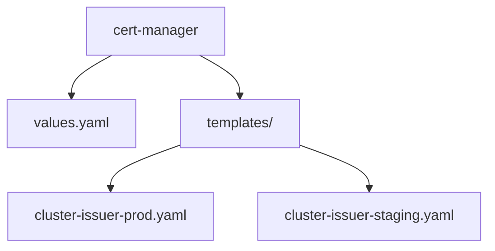
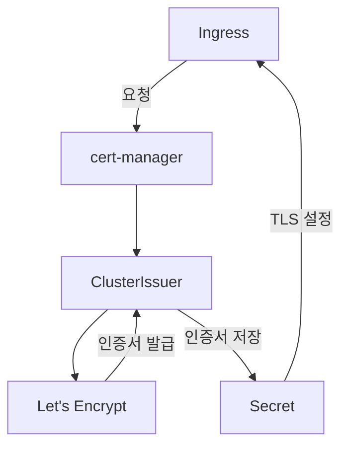
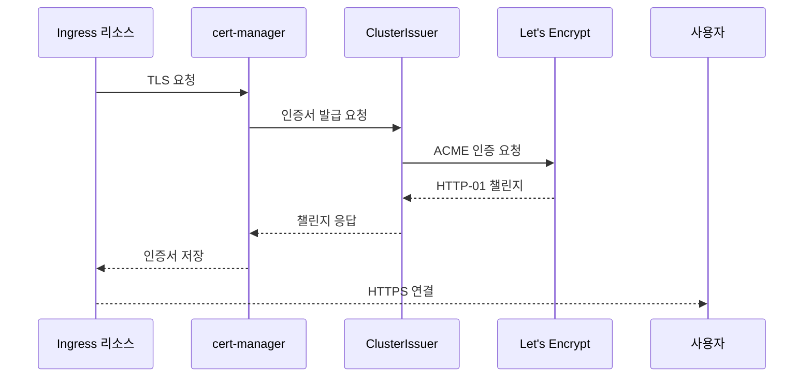
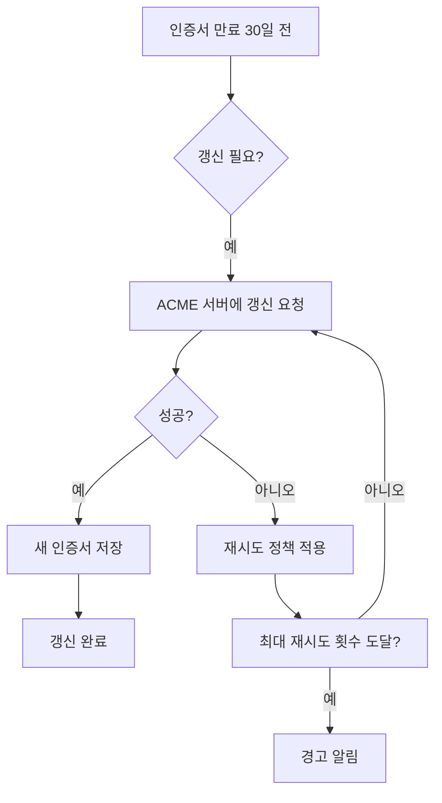
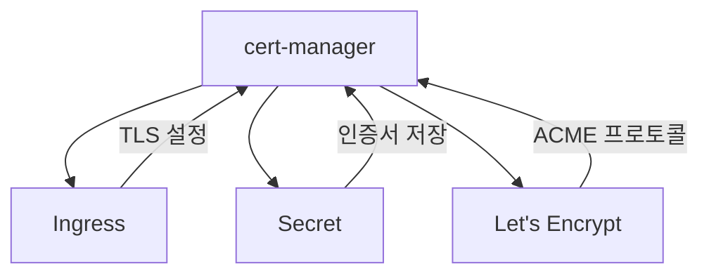

# 인증서 관리

<cite>
**이 문서에서 참조한 파일**   
- [values.yaml](file://helm/cluster-services/cert-manager/values.yaml)
- [cluster-issuer-prod.yaml](file://helm/cluster-services/cert-manager/templates/cluster-issuer-prod.yaml)
- [cluster-issuer-staging.yaml](file://helm/cluster-services/cert-manager/templates/cluster-issuer-staging.yaml)
- [plate-api/values.yaml](file://helm/applications/plate-api/values.yaml)
- [plate-web/values.yaml](file://helm/applications/plate-web/values.yaml)
- [plate-llm/values.yaml](file://helm/applications/plate-llm/values.yaml)
- [ingress/values.yaml](file://helm/ingress/values.yaml)
- [ingress.yaml](file://helm/ingress/templates/ingress.yaml)
</cite>

## 목차
1. [소개](#소개)
2. [프로젝트 구조](#프로젝트-구조)
3. [핵심 구성 요소](#핵심-구성-요소)
4. [아키텍처 개요](#아키텍처-개요)
5. [상세 구성 요소 분석](#상세-구성-요소-분석)
6. [의존성 분석](#의존성-분석)
7. [성능 고려사항](#성능-고려사항)
8. [문제 해결 가이드](#문제-해결-가이드)
9. [결론](#결론)

## 소개
이 문서는 cert-manager를 활용한 SSL/TLS 인증서 자동 관리 기능에 대해 설명합니다. 프로덕션 및 스테이징 환경을 위한 ClusterIssuer 설정 방법, 인증서 자동 갱신 메커니즘, ACME 프로토콜 통합, Let's Encrypt와의 연동 방식을 다룹니다. 또한 Helm 차트 설정 예제를 통해 values.yaml과 템플릿 파일의 구성 방식을 설명하고, 인증서 발급 오류 발생 시 진단 및 해결 방법을 안내합니다. 인증서 만료 모니터링 및 Alertmanager와의 통합을 통한 사전 경고 시스템 구축 방법도 포함합니다.

## 프로젝트 구조
cert-manager는 `helm/cluster-services/cert-manager/` 디렉터리에 위치하며, Helm 차트를 통해 설치 및 관리됩니다. 이 차트는 `values.yaml` 파일을 통해 설정되며, `templates/` 디렉터리에는 `cluster-issuer-prod.yaml`과 `cluster-issuer-staging.yaml` 템플릿 파일이 포함되어 있습니다. 이 템플릿들은 프로덕션과 스테이징 환경을 위한 ClusterIssuer 리소스를 생성합니다.



**도표 출처**
- [values.yaml](file://helm/cluster-services/cert-manager/values.yaml#L1-L35)
- [cluster-issuer-prod.yaml](file://helm/cluster-services/cert-manager/templates/cluster-issuer-prod.yaml#L1-L20)
- [cluster-issuer-staging.yaml](file://helm/cluster-services/cert-manager/templates/cluster-issuer-staging.yaml#L1-L20)

**섹션 출처**
- [values.yaml](file://helm/cluster-services/cert-manager/values.yaml#L1-L35)
- [cluster-issuer-prod.yaml](file://helm/cluster-services/cert-manager/templates/cluster-issuer-prod.yaml#L1-L20)
- [cluster-issuer-staging.yaml](file://helm/cluster-services/cert-manager/templates/cluster-issuer-staging.yaml#L1-L20)

## 핵심 구성 요소
cert-manager의 핵심 구성 요소는 ClusterIssuer와 Certificate 리소스입니다. ClusterIssuer는 인증서 발급을 위한 공급자를 정의하며, Certificate는 실제 인증서를 요청하고 관리하는 리소스입니다. 이 구성 요소들은 ACME 프로토콜을 통해 Let's Encrypt와 통신하여 인증서를 자동으로 발급하고 갱신합니다.

**섹션 출처**
- [values.yaml](file://helm/cluster-services/cert-manager/values.yaml#L10-L35)
- [cluster-issuer-prod.yaml](file://helm/cluster-services/cert-manager/templates/cluster-issuer-prod.yaml#L1-L20)
- [cluster-issuer-staging.yaml](file://helm/cluster-services/cert-manager/templates/cluster-issuer-staging.yaml#L1-L20)

## 아키텍처 개요
cert-manager는 Kubernetes 클러스터 내에서 인증서를 자동으로 관리하는 아키텍처를 제공합니다. 이 아키텍처는 Ingress 리소스와 연동되어, 도메인에 대한 인증서를 자동으로 발급하고 갱신합니다. 프로덕션 환경과 스테이징 환경을 위해 별도의 ClusterIssuer가 설정되어 있으며, 각 환경에 맞는 인증서를 발급받습니다.



**도표 출처**
- [values.yaml](file://helm/cluster-services/cert-manager/values.yaml#L10-L35)
- [cluster-issuer-prod.yaml](file://helm/cluster-services/cert-manager/templates/cluster-issuer-prod.yaml#L1-L20)
- [cluster-issuer-staging.yaml](file://helm/cluster-services/cert-manager/templates/cluster-issuer-staging.yaml#L1-L20)

## 상세 구성 요소 분석

### ClusterIssuer 설정 분석
ClusterIssuer는 cert-manager가 인증서를 발급받기 위해 사용하는 공급자를 정의합니다. 프로덕션 환경과 스테이징 환경을 위해 별도의 설정이 제공됩니다. 프로덕션 환경은 Let's Encrypt의 실서명 서버를 사용하며, 스테이징 환경은 테스트용 서버를 사용합니다.

#### ClusterIssuer 템플릿 분석
```mermaid
classDiagram
class ClusterIssuer {
+string name
+string server
+string email
+string privateKeySecretRef
+list solvers
}
ClusterIssuer : +name : ClusterIssuer 이름
ClusterIssuer : +server : ACME 서버 URL
ClusterIssuer : +email : 등록 이메일
ClusterIssuer : +privateKeySecretRef : 개인 키 시크릿 참조
ClusterIssuer : +solvers : 도메인 검증 방법
```

**도표 출처**
- [values.yaml](file://helm/cluster-services/cert-manager/values.yaml#L12-L35)
- [cluster-issuer-prod.yaml](file://helm/cluster-services/cert-manager/templates/cluster-issuer-prod.yaml#L1-L20)
- [cluster-issuer-staging.yaml](file://helm/cluster-services/cert-manager/templates/cluster-issuer-staging.yaml#L1-L20)

#### Ingress와의 연동 분석


**도표 출처**
- [values.yaml](file://helm/cluster-services/cert-manager/values.yaml#L19-L22)
- [cluster-issuer-prod.yaml](file://helm/cluster-services/cert-manager/templates/cluster-issuer-prod.yaml#L18-L19)
- [cluster-issuer-staging.yaml](file://helm/cluster-services/cert-manager/templates/cluster-issuer-staging.yaml#L18-L19)

**섹션 출처**
- [values.yaml](file://helm/cluster-services/cert-manager/values.yaml#L1-L35)
- [cluster-issuer-prod.yaml](file://helm/cluster-services/cert-manager/templates/cluster-issuer-prod.yaml#L1-L20)
- [cluster-issuer-staging.yaml](file://helm/cluster-services/cert-manager/templates/cluster-issuer-staging.yaml#L1-L20)

### 인증서 자동 갱신 메커니즘
cert-manager는 인증서 만료 30일 전에 자동으로 갱신을 시도합니다. 이 과정은 백그라운드에서 주기적으로 실행되며, 실패할 경우 재시도 정책에 따라 추가 시도를 수행합니다.



**도표 출처**
- [values.yaml](file://helm/cluster-services/cert-manager/values.yaml#L13-L35)

## 의존성 분석
cert-manager는 Kubernetes 클러스터의 Ingress 리소스와 긴밀하게 연동되어 작동합니다. 또한, Let's Encrypt와의 통신을 위해 ACME 프로토콜을 사용하며, 인증서 저장을 위해 Kubernetes Secret 리소스를 활용합니다.



**도표 출처**
- [values.yaml](file://helm/cluster-services/cert-manager/values.yaml#L10-L35)
- [cluster-issuer-prod.yaml](file://helm/cluster-services/cert-manager/templates/cluster-issuer-prod.yaml#L1-L20)
- [cluster-issuer-staging.yaml](file://helm/cluster-services/cert-manager/templates/cluster-issuer-staging.yaml#L1-L20)

**섹션 출처**
- [values.yaml](file://helm/cluster-services/cert-manager/values.yaml#L1-L35)
- [cluster-issuer-prod.yaml](file://helm/cluster-services/cert-manager/templates/cluster-issuer-prod.yaml#L1-L20)
- [cluster-issuer-staging.yaml](file://helm/cluster-services/cert-manager/templates/cluster-issuer-staging.yaml#L1-L20)

## 성능 고려사항
cert-manager는 인증서 갱신을 위한 리소스 소모를 최소화하기 위해 설계되었습니다. 갱신 주기는 인증서 만료 30일 전으로 설정되어 있으며, 실패 시 재시도 정책을 통해 안정성을 보장합니다. 또한, HTTP-01 챌린지를 사용하여 도메인 소유권을 검증함으로써, DNS 설정 변경 없이도 인증서를 발급받을 수 있습니다.

## 문제 해결 가이드
인증서 발급 오류가 발생할 경우, 다음 단계를 따라 진단 및 해결할 수 있습니다:

1. **Ingress 리소스 확인**: Ingress 리소스의 annotations와 tls 설정이 올바르게 구성되었는지 확인합니다.
2. **ClusterIssuer 상태 확인**: `kubectl describe clusterissuer` 명령을 사용하여 ClusterIssuer의 상태를 확인합니다.
3. **cert-manager 로그 확인**: cert-manager 컨테이너의 로그를 확인하여 오류 원인을 파악합니다.
4. **ACME 챌린지 확인**: HTTP-01 챌린지가 정상적으로 처리되는지 확인합니다.

**섹션 출처**
- [values.yaml](file://helm/cluster-services/cert-manager/values.yaml#L1-L35)
- [cluster-issuer-prod.yaml](file://helm/cluster-services/cert-manager/templates/cluster-issuer-prod.yaml#L1-L20)
- [cluster-issuer-staging.yaml](file://helm/cluster-services/cert-manager/templates/cluster-issuer-staging.yaml#L1-L20)

## 결론
cert-manager는 Kubernetes 환경에서 SSL/TLS 인증서를 자동으로 관리하는 강력한 도구입니다. 프로덕션 및 스테이징 환경을 위한 별도의 ClusterIssuer 설정, ACME 프로토콜을 통한 Let's Encrypt 연동, 자동 갱신 메커니즘을 통해 안정적이고 효율적인 인증서 관리를 제공합니다. Helm 차트를 통해 쉽게 설정하고 관리할 수 있으며, 다양한 애플리케이션과의 통합이 용이합니다.