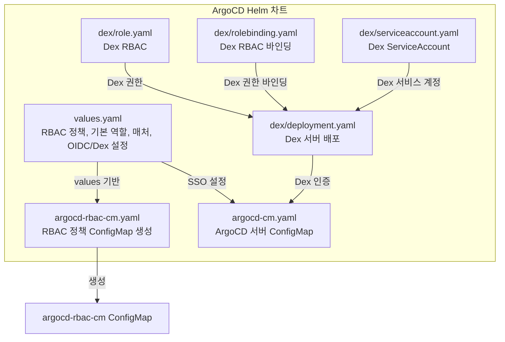
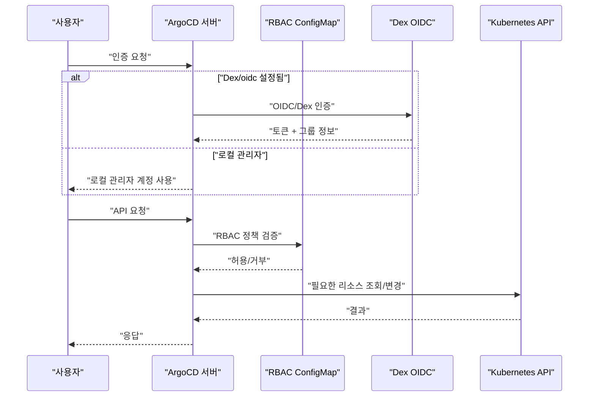
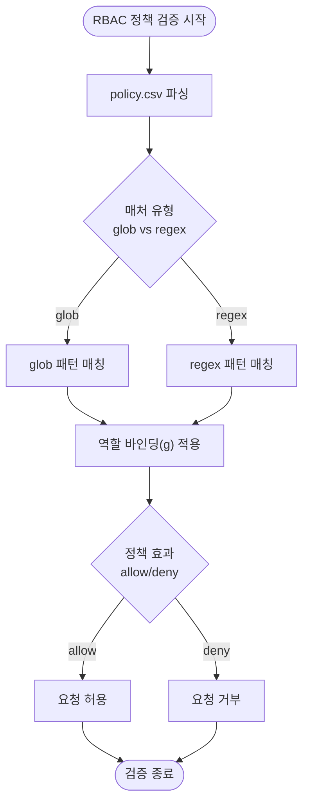
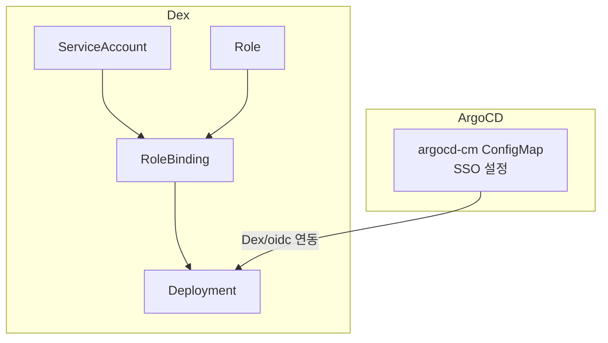
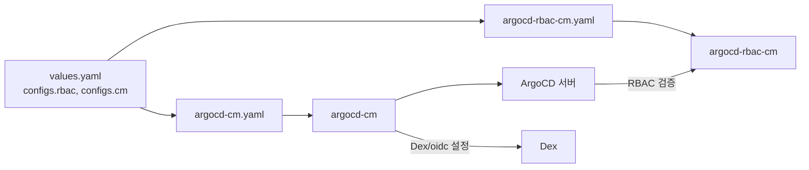

# 접근 제어

<cite>
**문서에서 인용된 파일 목록**
- [argocd-rbac-cm.yaml](file://helm/development-tools/argocd/templates/argocd-configs/argocd-rbac-cm.yaml)
- [values.yaml](file://helm/development-tools/argocd/values.yaml)
- [README.md](file://helm/development-tools/argocd/README.md)
- [deployment.yaml](file://helm/development-tools/argocd/templates/dex/deployment.yaml)
- [role.yaml](file://helm/development-tools/argocd/templates/dex/role.yaml)
- [rolebinding.yaml](file://helm/development-tools/argocd/templates/dex/rolebinding.yaml)
- [serviceaccount.yaml](file://helm/development-tools/argocd/templates/dex/serviceaccount.yaml)
- [NOTES.txt](file://helm/development-tools/argocd/templates/NOTES.txt)
- [argocd-cm.yaml](file://helm/development-tools/argocd/templates/argocd-configs/argocd-cm.yaml)
</cite>

## 목차
1. [소개](#소개)
2. [프로젝트 구조](#프로젝트-구조)
3. [핵심 컴포넌트](#핵심-컴포넌트)
4. [아키텍처 개요](#아키텍처-개요)
5. [상세 컴포넌트 분석](#상세-컴포넌트-분석)
6. [의존성 분석](#의존성-분석)
7. [성능 고려사항](#성능-고려사항)
8. [장애 진단 가이드](#장애-진단-가이드)
9. [결론](#결론)
10. [부록](#부록)

## 소개
본 문서는 RBAC(Role-Based Access Control) 기반의 접근 제어 시스템을 중심으로, ArgoCD의 argocd-rbac-cm.yaml을 통한 역할 및 권한 정의 방법, 사용자 그룹별 접근 정책 설정, 프로젝트 기반 접근 제어 구현 방식을 설명합니다. 실제 코드 예제를 통해 정책 표현식(policy expression)의 작성 방법과 일반적인 권한 구성 오류, 그 해결 방법을 안내하며, 외부 인증 시스템(Dex)과의 통합을 통한 SSO 연동 방안도 포함합니다.

## 프로젝트 구조
ArgoCD는 Helm 차트를 통해 다양한 구성 요소를 관리합니다. 접근 제어 관련 핵심은 다음과 같습니다:
- RBAC 정책 ConfigMap 생성 템플릿
- RBAC 정책 및 기본 역할, 매처 설정
- Dex 인증 서버 배포 및 RBAC
- ArgoCD 서버 설정(ConfigMap) 및 SSO 연동

**다이어그램 출처**
- [argocd-rbac-cm.yaml](file://helm/development-tools/argocd/templates/argocd-configs/argocd-rbac-cm.yaml#L1-L20)
- [values.yaml](file://helm/development-tools/argocd/values.yaml#L461-L515)
- [argocd-cm.yaml](file://helm/development-tools/argocd/templates/argocd-configs/argocd-cm.yaml#L1-L18)
- [deployment.yaml](file://helm/development-tools/argocd/templates/dex/deployment.yaml#L150-L255)
- [role.yaml](file://helm/development-tools/argocd/templates/dex/role.yaml#L1-L19)
- [rolebinding.yaml](file://helm/development-tools/argocd/templates/dex/rolebinding.yaml#L1-L17)
- [serviceaccount.yaml](file://helm/development-tools/argocd/templates/dex/serviceaccount.yaml#L1-L16)

**섹션 출처**
- [argocd-rbac-cm.yaml](file://helm/development-tools/argocd/templates/argocd-configs/argocd-rbac-cm.yaml#L1-L20)
- [values.yaml](file://helm/development-tools/argocd/values.yaml#L461-L515)
- [README.md](file://helm/development-tools/argocd/README.md#L830-L869)

## 핵심 컴포넌트
- RBAC 정책 ConfigMap 생성 템플릿
  - argocd-rbac-cm.yaml은 values.yaml에 정의된 configs.rbac 항목을 기반으로 argocd-rbac-cm ConfigMap을 생성합니다.
  - 이 ConfigMap에는 policy.csv, policy.default, policy.matchMode, scopes 등이 포함됩니다.
- RBAC 정책 및 기본 역할
  - values.yaml의 configs.rbac.policy.csv에 정책 표현식이 선언되어 있으며, 기본 역할(default role)은 configs.rbac.policy.default로 지정됩니다.
  - 매처(matcher)는 configs.rbac.policy.matchMode로 glob 또는 regex를 선택할 수 있습니다.
- Dex 인증 서버
  - Dex는 values.yaml의 configs.cm.dex.config 또는 configs.cm.oidc.config을 통해 SSO 연동이 가능하며, deployment.yaml에 Dex 서버가 배포됩니다.
  - Dex는 role/rolebinding/serviceaccount를 통해 필요한 RBAC 권한을 갖습니다.
- ArgoCD 서버 ConfigMap
  - argocd-cm.yaml은 ArgoCD 서버 설정(ConfigMap)을 생성하며, SSO 관련 설정은 여기에 포함됩니다.

**섹션 출처**
- [argocd-rbac-cm.yaml](file://helm/development-tools/argocd/templates/argocd-configs/argocd-rbac-cm.yaml#L1-L20)
- [values.yaml](file://helm/development-tools/argocd/values.yaml#L461-L515)
- [README.md](file://helm/development-tools/argocd/README.md#L830-L869)
- [deployment.yaml](file://helm/development-tools/argocd/templates/dex/deployment.yaml#L150-L255)
- [role.yaml](file://helm/development-tools/argocd/templates/dex/role.yaml#L1-L19)
- [rolebinding.yaml](file://helm/development-tools/argocd/templates/dex/rolebinding.yaml#L1-L17)
- [serviceaccount.yaml](file://helm/development-tools/argocd/templates/dex/serviceaccount.yaml#L1-L16)
- [argocd-cm.yaml](file://helm/development-tools/argocd/templates/argocd-configs/argocd-cm.yaml#L1-L18)

## 아키텍처 개요
ArgoCD는 RBAC 정책을 ConfigMap으로 관리하고, 사용자는 Dex 또는 OIDC를 통해 인증됩니다. 인증 후 ArgoCD는 RBAC 정책을 기반으로 요청을 검증합니다.

**다이어그램 출처**
- [values.yaml](file://helm/development-tools/argocd/values.yaml#L461-L515)
- [README.md](file://helm/development-tools/argocd/README.md#L830-L869)
- [deployment.yaml](file://helm/development-tools/argocd/templates/dex/deployment.yaml#L150-L255)
- [NOTES.txt](file://helm/development-tools/argocd/templates/NOTES.txt#L27-L37)

## 상세 컴포넌트 분석

### RBAC 정책 표현식 작성
- policy.csv 형식
  - ArgoCD RBAC은 Casbin 기반으로, 정책 표현식은 p, subject, resource, action, object, effect 순서로 구성됩니다.
  - 역할 정의/바인딩은 g, subject, inherited-subject 형식으로 표현됩니다.
- 예시 정책
  - 관리자 역할: 모든 리소스에 대해 허용
  - 읽기 전용 역할: 애플리케이션, 클러스터, 저장소, 로그, 프로젝트에 대해 get/list만 허용
  - 사용자 바인딩: admin 사용자를 role:admin에 바인딩
- 매처(matcher)
  - policy.matchMode는 glob 또는 regex로 설정 가능하며, 정책 매칭 방식에 영향을 줍니다.
- 기본 역할
  - policy.default는 인증된 사용자가 일치하는 정책이 없을 때 적용되는 역할입니다.

**다이어그램 출처**
- [values.yaml](file://helm/development-tools/argocd/values.yaml#L461-L515)

**섹션 출처**
- [values.yaml](file://helm/development-tools/argocd/values.yaml#L461-L515)

### Dex와의 SSO 연동
- Dex 배포
  - deployment.yaml에 Dex 서버가 배포되며, 볼륨 마운트, 리소스, 보안 컨텍스트 등을 설정할 수 있습니다.
- Dex RBAC
  - role/rolebinding/serviceaccount를 통해 Dex가 필요한 ConfigMap/Secret을 읽고, 서비스 계정을 통해 인증 서버를 운영합니다.
- ArgoCD SSO 설정
  - configs.cm.dex.config 또는 configs.cm.oidc.config을 통해 Dex 또는 OIDC 연동이 가능합니다.
  - NOTES.txt에 Dex/oidc 설정 시 첫 방문 후 SSO 로그인이 가능하다는 안내가 있습니다.

**다이어그램 출처**
- [deployment.yaml](file://helm/development-tools/argocd/templates/dex/deployment.yaml#L150-L255)
- [role.yaml](file://helm/development-tools/argocd/templates/dex/role.yaml#L1-L19)
- [rolebinding.yaml](file://helm/development-tools/argocd/templates/dex/rolebinding.yaml#L1-L17)
- [serviceaccount.yaml](file://helm/development-tools/argocd/templates/dex/serviceaccount.yaml#L1-L16)
- [values.yaml](file://helm/development-tools/argocd/values.yaml#L212-L241)
- [NOTES.txt](file://helm/development-tools/argocd/templates/NOTES.txt#L27-L37)

**섹션 출처**
- [deployment.yaml](file://helm/development-tools/argocd/templates/dex/deployment.yaml#L150-L255)
- [role.yaml](file://helm/development-tools/argocd/templates/dex/role.yaml#L1-L19)
- [rolebinding.yaml](file://helm/development-tools/argocd/templates/dex/rolebinding.yaml#L1-L17)
- [serviceaccount.yaml](file://helm/development-tools/argocd/templates/dex/serviceaccount.yaml#L1-L16)
- [values.yaml](file://helm/development-tools/argocd/values.yaml#L212-L241)
- [NOTES.txt](file://helm/development-tools/argocd/templates/NOTES.txt#L27-L37)

### 프로젝트 기반 접근 제어
- 프로젝트 범위
  - ArgoCD는 프로젝트 단위로 클러스터/저장소/네임스페이스를 제한할 수 있습니다. 이는 프로젝트 설정에 따라 달라지며, 저장소/클러스터/네임스페이스 제한은 values.yaml의 clusterCredentials 항목을 통해 프로젝트 스코프로 설정할 수 있습니다.
- 권한 부여
  - RBAC 정책은 프로젝트 리소스에 대한 접근을 제어하며, policy.csv에 정의된 규칙에 따라 특정 프로젝트에 대한 작업이 허용되는지 판단됩니다.

**섹션 출처**
- [values.yaml](file://helm/development-tools/argocd/values.yaml#L624-L672)

## 의존성 분석
- RBAC 정책 ConfigMap은 values.yaml의 configs.rbac 항목에 의해 생성되며, ArgoCD 서버는 이 ConfigMap을 기반으로 인가를 수행합니다.
- Dex는 ArgoCD 서버와 별도로 배포되지만, ArgoCD 서버의 SSO 설정에 따라 인증 흐름이 달라집니다.
- ArgoCD 서버 ConfigMap(argocd-cm)은 SSO 설정을 포함하므로, Dex/oidc 설정 여부에 따라 인증 방식이 결정됩니다.

**다이어그램 출처**
- [values.yaml](file://helm/development-tools/argocd/values.yaml#L461-L515)
- [argocd-rbac-cm.yaml](file://helm/development-tools/argocd/templates/argocd-configs/argocd-rbac-cm.yaml#L1-L20)
- [argocd-cm.yaml](file://helm/development-tools/argocd/templates/argocd-configs/argocd-cm.yaml#L1-L18)

**섹션 출처**
- [values.yaml](file://helm/development-tools/argocd/values.yaml#L461-L515)
- [argocd-rbac-cm.yaml](file://helm/development-tools/argocd/templates/argocd-configs/argocd-rbac-cm.yaml#L1-L20)
- [argocd-cm.yaml](file://helm/development-tools/argocd/templates/argocd-configs/argocd-cm.yaml#L1-L18)

## 성능 고려사항
- RBAC 검증 성능
  - policy.matchMode는 glob 또는 regex로 설정 가능하며, 복잡한 정책이나 많은 규칙은 검증 성능에 영향을 줄 수 있습니다. glob이 더 빠르게 작동할 수 있으므로, 가능한 경우 glob을 사용하는 것이 좋습니다.
- Dex 성능
  - Dex 서버는 인증 처리를 담당하므로, 적절한 리소스 할당과 프로브 설정이 필요합니다. deployment.yaml에 리소스, 프로브, 보안 컨텍스트 등을 설정할 수 있습니다.

**섹션 출처**
- [values.yaml](file://helm/development-tools/argocd/values.yaml#L461-L515)
- [deployment.yaml](file://helm/development-tools/argocd/templates/dex/deployment.yaml#L150-L255)

## 장애 진단 가이드
- RBAC 정책 미적용
  - configs.rbac.create가 false이면 RBAC ConfigMap이 생성되지 않아 인가가 작동하지 않을 수 있습니다. values.yaml에서 create를 true로 설정해야 합니다.
- 기본 역할 누락
  - configs.rbac.policy.default가 비어 있으면 인증된 사용자가 일치하는 정책이 없을 때 아무것도 표시되지 않을 수 있습니다. 기본 역할을 반드시 설정하세요.
- OIDC/Dex 설정 오류
  - configs.cm.dex.config 또는 configs.cm.oidc.config이 누락되었거나 잘못된 경우, NOTES.txt에 따라 첫 방문 후 로그인이 불가능할 수 있습니다. SSO 설정을 확인하고, 필요한 경우 NOTES.txt 안내에 따라 초기 관리자 계정을 활성화하거나 SSO 설정을 추가하세요.
- Dex 권한 문제
  - Dex가 ConfigMap/Secret을 읽지 못하면 인증이 실패할 수 있습니다. role/rolebinding/serviceaccount 설정을 점검하세요.

**섹션 출처**
- [values.yaml](file://helm/development-tools/argocd/values.yaml#L461-L515)
- [README.md](file://helm/development-tools/argocd/README.md#L830-L869)
- [NOTES.txt](file://helm/development-tools/argocd/templates/NOTES.txt#L27-L37)
- [role.yaml](file://helm/development-tools/argocd/templates/dex/role.yaml#L1-L19)
- [rolebinding.yaml](file://helm/development-tools/argocd/templates/dex/rolebinding.yaml#L1-L17)
- [serviceaccount.yaml](file://helm/development-tools/argocd/templates/dex/serviceaccount.yaml#L1-L16)

## 결론
이번 문서에서는 ArgoCD의 RBAC 기반 접근 제어 시스템을 Helm 차트를 통해 구현하는 방법을 살펴보았습니다. RBAC 정책 표현식 작성, 기본 역할 설정, Dex/oidc 통한 SSO 연동, 그리고 프로젝트 기반 접근 제어 방식을 정리했습니다. 실무에서는 policy.csv를 신중하게 관리하고, 매처 유형과 기본 역할을 잘 설정해야 하며, Dex/oidc 설정이 올바르게 되었는지 항상 점검해야 합니다.

## 부록
- RBAC 정책 표현식 예시
  - 관리자 역할: 모든 리소스에 대해 허용
  - 읽기 전용 역할: 애플리케이션, 클러스터, 저장소, 로그, 프로젝트에 대해 get/list만 허용
  - 사용자 바인딩: admin 사용자를 role:admin에 바인딩
- OIDC/Dex 설정 위치
  - configs.cm.dex.config 또는 configs.cm.oidc.config을 통해 SSO 연동이 가능합니다.
- Dex RBAC 권한
  - Dex는 ConfigMap/Secret을 읽기 위한 권한이 필요하며, role/rolebinding/serviceaccount를 통해 부여됩니다.

**섹션 출처**
- [values.yaml](file://helm/development-tools/argocd/values.yaml#L461-L515)
- [README.md](file://helm/development-tools/argocd/README.md#L830-L869)
- [deployment.yaml](file://helm/development-tools/argocd/templates/dex/deployment.yaml#L150-L255)
- [role.yaml](file://helm/development-tools/argocd/templates/dex/role.yaml#L1-L19)
- [rolebinding.yaml](file://helm/development-tools/argocd/templates/dex/rolebinding.yaml#L1-L17)
- [serviceaccount.yaml](file://helm/development-tools/argocd/templates/dex/serviceaccount.yaml#L1-L16)