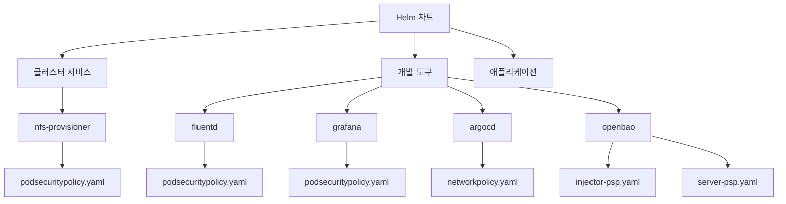
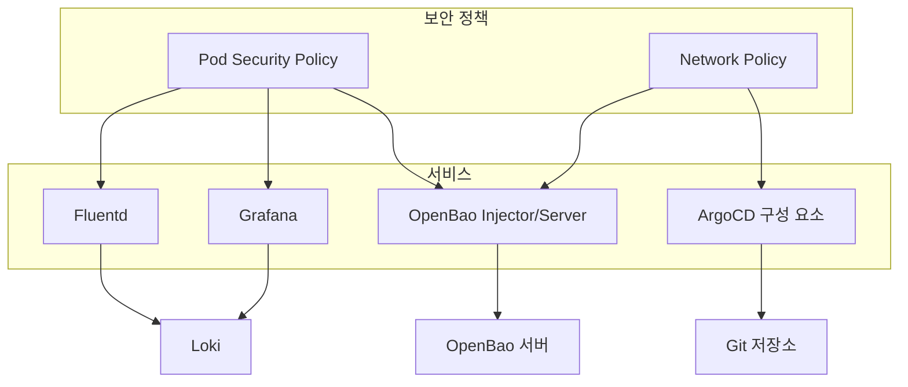
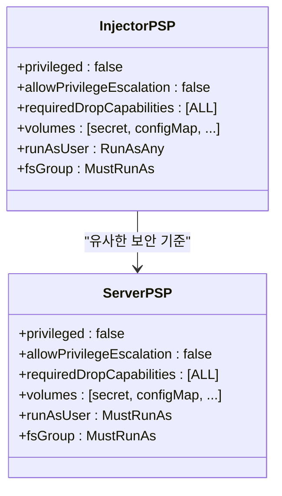
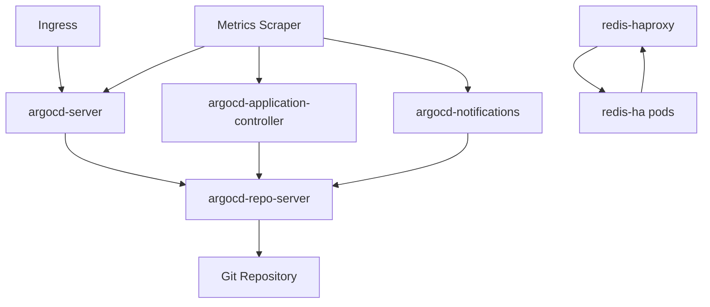
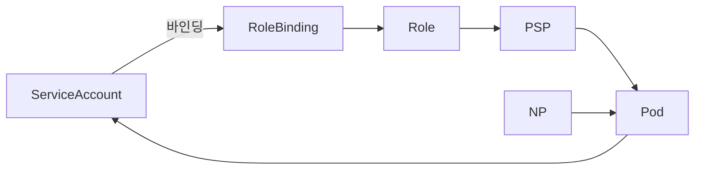

# 파드 보안

<cite>
**이 문서에서 참조한 파일**
- [podsecuritypolicy.yaml](file://helm/cluster-services/nfs-provisioner/templates/podsecuritypolicy.yaml)
- [podsecuritypolicy.yaml](file://helm/development-tools/fluentd/templates/podsecuritypolicy.yaml)
- [podsecuritypolicy.yaml](file://helm/development-tools/grafana/templates/podsecuritypolicy.yaml)
- [podsecuritypolicy.yaml](file://helm/development-tools/promtail/templates/podsecuritypolicy.yaml)
- [networkpolicy-default-deny.yaml](file://helm/development-tools/argocd/templates/networkpolicy-default-deny.yaml)
- [redis-ha-network-policy.yaml](file://helm/development-tools/argocd/charts/redis-ha/templates/redis-ha-network-policy.yaml)
- [redis-haproxy-network-policy.yaml](file://helm/development-tools/argocd/charts/redis-ha/templates/redis-haproxy-network-policy.yaml)
- [networkpolicy.yaml](file://helm/development-tools/argocd/templates/argocd-server/networkpolicy.yaml)
- [networkpolicy.yaml](file://helm/development-tools/argocd/templates/argocd-repo-server/networkpolicy.yaml)
- [networkpolicy.yaml](file://helm/development-tools/argocd/templates/argocd-application-controller/networkpolicy.yaml)
- [networkpolicy.yaml](file://helm/development-tools/argocd/templates/argocd-notifications/networkpolicy.yaml)
- [injector-psp.yaml](file://helm/development-tools/openbao/templates/injector-psp.yaml)
- [server-psp.yaml](file://helm/development-tools/openbao/templates/server-psp.yaml)
</cite>

## 목차
1. [소개](#소개)
2. [프로젝트 구조](#프로젝트-구조)
3. [핵심 구성 요소](#핵심-구성-요소)
4. [아키텍처 개요](#아키텍처-개요)
5. [상세 구성 요소 분석](#상세-구성-요소-분석)
6. [의존성 분석](#의존성-분석)
7. [성능 고려사항](#성능-고려사항)
8. [문제 해결 가이드](#문제-해결-가이드)
9. [결론](#결론)

## 소개
이 문서는 쿠버네티스 환경에서 파드 수준의 보안을 강화하기 위한 Pod Security Policy(이하 PSP) 및 네트워크 정책의 적용 방안을 설명합니다. 특히 OpenBao injector 및 server 구성에서의 PSP 설정 방법, 특권 모드 제한, 볼륨 마운트 제어, 사용자 ID 제약 조건 적용 방식을 다룹니다. 또한 실제 YAML 설정 예제를 통해 보안 정책의 구체적인 구현 방법을 안내하고, 정책 위반 시 발생하는 이벤트 로그 확인 방법을 제공합니다. 마지막으로 Pod Security Admission으로의 마이그레이션 전략도 포함합니다.

## 프로젝트 구조
본 프로젝트는 Helm 차트 기반으로 구성되며, `helm/` 디렉터리 하위에 클러스터 서비스, 개발 도구, 애플리케이션별 차트가 각각 구성되어 있습니다. 보안 정책은 주로 `development-tools` 및 `cluster-services` 디렉터리 내 Helm 차트에 정의되어 있으며, PSP 및 네트워크 정책 리소스가 템플릿 형태로 포함되어 있습니다. 특히 OpenBao, Fluentd, Grafana, ArgoCD 등 주요 구성 요소에 대해 세부적인 보안 정책이 정의되어 있습니다.

**Diagram sources**
- [podsecuritypolicy.yaml](file://helm/cluster-services/nfs-provisioner/templates/podsecuritypolicy.yaml)
- [podsecuritypolicy.yaml](file://helm/development-tools/fluentd/templates/podsecuritypolicy.yaml)
- [podsecuritypolicy.yaml](file://helm/development-tools/grafana/templates/podsecuritypolicy.yaml)
- [networkpolicy.yaml](file://helm/development-tools/argocd/templates/argocd-server/networkpolicy.yaml)
- [injector-psp.yaml](file://helm/development-tools/openbao/templates/injector-psp.yaml)
- [server-psp.yaml](file://helm/development-tools/openbao/templates/server-psp.yaml)

**Section sources**
- [podsecuritypolicy.yaml](file://helm/cluster-services/nfs-provisioner/templates/podsecuritypolicy.yaml)
- [podsecuritypolicy.yaml](file://helm/development-tools/fluentd/templates/podsecuritypolicy.yaml)
- [podsecuritypolicy.yaml](file://helm/development-tools/grafana/templates/podsecuritypolicy.yaml)
- [networkpolicy.yaml](file://helm/development-tools/argocd/templates/argocd-server/networkpolicy.yaml)
- [injector-psp.yaml](file://helm/development-tools/openbao/templates/injector-psp.yaml)
- [server-psp.yaml](file://helm/development-tools/openbao/templates/server-psp.yaml)

## 핵심 구성 요소
본 환경에서는 PSP를 통해 파드의 특권 모드 실행, 호스트 네트워크/IPC/PID 접근, 볼륨 타입 사용 등을 제한하고 있습니다. 예를 들어, nfs-provisioner의 PSP는 특권 모드를 비활성화하고 `ALL` 캐패빌리티를 강제로 제거하며, 허용된 볼륨 유형으로 `secret`, `nfs`, `persistentVolumeClaim`만 지정합니다. 반면, Fluentd 및 Grafana의 PSP는 추가적으로 `supplementalGroups` 및 `fsGroup`에 대해 `MustRunAs` 규칙을 적용하여 그룹 ID가 1 이상 65535 이하로 제한되도록 합니다.

OpenBao의 경우, injector 및 server 구성 요소에 각각 별도의 PSP가 정의되어 있으며, 특권 모드 및 특권 상승을 명시적으로 금지하고 있습니다. 또한, 네트워크 정책을 통해 ArgoCD 구성 요소들 간의 통신을 제어하고 있으며, 기본적으로 인그레스 트래픽을 차단하는 `default-deny` 정책도 함께 적용됩니다.

**Section sources**
- [podsecuritypolicy.yaml](file://helm/cluster-services/nfs-provisioner/templates/podsecuritypolicy.yaml)
- [podsecuritypolicy.yaml](file://helm/development-tools/fluentd/templates/podsecuritypolicy.yaml)
- [podsecuritypolicy.yaml](file://helm/development-tools/grafana/templates/podsecuritypolicy.yaml)
- [injector-psp.yaml](file://helm/development-tools/openbao/templates/injector-psp.yaml)
- [server-psp.yaml](file://helm/development-tools/openbao/templates/server-psp.yaml)
- [networkpolicy-default-deny.yaml](file://helm/development-tools/argocd/templates/networkpolicy-default-deny.yaml)

## 아키텍처 개요
전체 아키텍처는 Helm을 통해 관리되는 여러 개발 및 인프라 서비스들로 구성되며, 각 서비스는 자체 PSP 및 네트워크 정책을 통해 보안이 강화됩니다. PSP는 파드 생성 시 권한 및 리소스 사용을 제한하며, 네트워크 정책은 파드 간 통신을 제어합니다. 이러한 정책들은 RBAC와 함께 작동하여, 서비스 어카운트에 적절한 권한을 부여받은 경우에만 정책을 사용할 수 있도록 합니다.

**Diagram sources**
- [injector-psp.yaml](file://helm/development-tools/openbao/templates/injector-psp.yaml)
- [server-psp.yaml](file://helm/development-tools/openbao/templates/server-psp.yaml)
- [networkpolicy.yaml](file://helm/development-tools/argocd/templates/argocd-server/networkpolicy.yaml)
- [podsecuritypolicy.yaml](file://helm/development-tools/grafana/templates/podsecuritypolicy.yaml)
- [podsecuritypolicy.yaml](file://helm/development-tools/fluentd/templates/podsecuritypolicy.yaml)

## 상세 구성 요소 분석

### OpenBao PSP 분석
OpenBao injector 및 server는 각각 별도의 PSP를 통해 보안 정책을 적용받습니다. 두 정책 모두 `privileged: false` 및 `allowPrivilegeEscalation: false`로 설정되어 특권 모드 실행과 권한 상승을 방지합니다. 또한 `requiredDropCapabilities`에 `ALL`이 지정되어 모든 리눅스 캐패빌리티가 제거되며, `runAsUser`, `fsGroup`, `supplementalGroups`는 `RunAsAny` 또는 `MustRunAs` 규칙에 따라 사용자 및 그룹 ID가 제한됩니다.

**Diagram sources**
- [injector-psp.yaml](file://helm/development-tools/openbao/templates/injector-psp.yaml)
- [server-psp.yaml](file://helm/development-tools/openbao/templates/server-psp.yaml)

**Section sources**
- [injector-psp.yaml](file://helm/development-tools/openbao/templates/injector-psp.yaml)
- [server-psp.yaml](file://helm/development-tools/openbao/templates/server-psp.yaml)

### 네트워크 정책 분석
ArgoCD는 여러 구성 요소(서버, 리포지토리 서버, 컨트롤러 등)에 대해 세분화된 네트워크 정책을 적용합니다. 예를 들어, `argocd-server`는 모든 인그레스 트래픽을 허용하는 정책을 가지며, `argocd-repo-server`는 컨트롤러, 서버, 알림 서비스 등에서 오는 트래픽만 허용합니다. 또한 `redis-ha` 및 `redis-haproxy` 구성 요소들 간의 통신도 네트워크 정책을 통해 제어됩니다.

**Diagram sources**
- [networkpolicy.yaml](file://helm/development-tools/argocd/templates/argocd-server/networkpolicy.yaml)
- [networkpolicy.yaml](file://helm/development-tools/argocd/templates/argocd-repo-server/networkpolicy.yaml)
- [redis-ha-network-policy.yaml](file://helm/development-tools/argocd/charts/redis-ha/templates/redis-ha-network-policy.yaml)
- [redis-haproxy-network-policy.yaml](file://helm/development-tools/argocd/charts/redis-ha/templates/redis-haproxy-network-policy.yaml)

**Section sources**
- [networkpolicy.yaml](file://helm/development-tools/argocd/templates/argocd-server/networkpolicy.yaml)
- [networkpolicy.yaml](file://helm/development-tools/argocd/templates/argocd-repo-server/networkpolicy.yaml)
- [redis-ha-network-policy.yaml](file://helm/development-tools/argocd/charts/redis-ha/templates/redis-ha-network-policy.yaml)
- [redis-haproxy-network-policy.yaml](file://helm/development-tools/argocd/charts/redis-ha/templates/redis-haproxy-network-policy.yaml)

## 의존성 분석
PSP 및 네트워크 정책은 RBAC와 긴밀하게 연계되어 있습니다. 예를 들어, 특정 서비스 어카운트가 PSP를 사용하려면 해당 PSP를 사용할 수 있는 권한을 가진 Role 또는 ClusterRole에 바인딩되어야 합니다. Helm 차트 내에서는 `psp-role.yaml` 및 `psp-rolebinding.yaml` 파일을 통해 이러한 관계가 정의됩니다. 또한 네트워크 정책은 파드 레이블을 기반으로 동작하므로, 관련 구성 요소들의 레이블 일관성이 중요합니다.

**Diagram sources**
- [injector-psp-rolebinding.yaml](file://helm/development-tools/openbao/templates/injector-psp-rolebinding.yaml)
- [server-psp-rolebinding.yaml](file://helm/development-tools/openbao/templates/server-psp-rolebinding.yaml)
- [injector-psp.yaml](file://helm/development-tools/openbao/templates/injector-psp.yaml)
- [server-psp.yaml](file://helm/development-tools/openbao/templates/server-psp.yaml)

**Section sources**
- [injector-psp-rolebinding.yaml](file://helm/development-tools/openbao/templates/injector-psp-rolebinding.yaml)
- [server-psp-rolebinding.yaml](file://helm/development-tools/openbao/templates/server-psp-rolebinding.yaml)

## 성능 고려사항
PSP는 파드 생성 시 admission controller에 의해 검사되므로, 과도하게 복잡한 정책은 API 서버 성능에 영향을 줄 수 있습니다. 따라서 정책은 최소한의 필요한 규칙만 포함하도록 설계되어야 하며, 불필요한 볼륨 유형이나 네트워크 규칙은 제거하는 것이 좋습니다. 또한 네트워크 정책은 CNI 구현체에 따라 성능 차이가 있을 수 있으므로, 선택한 CNI의 특성을 고려한 정책 설계가 필요합니다.

## 문제 해결 가이드
PSP 위반 시, 파드 생성이 거부되며 이벤트 로그에 다음과 유사한 메시지가 기록됩니다: `Pod "xxx" is forbidden: unable to validate against any pod security policy`. 이 경우 `kubectl describe psp <policy-name>`을 통해 해당 PSP의 정책을 확인하고, 파드의 보안 컨텍스트가 정책과 충돌하는지 분석해야 합니다. 네트워크 정책 위반은 일반적으로 연결 거부로 나타나며, `kubectl describe networkpolicy` 및 `kubectl get networkpolicystatus`를 통해 상태를 진단할 수 있습니다.

**Section sources**
- [injector-psp.yaml](file://helm/development-tools/openbao/templates/injector-psp.yaml)
- [server-psp.yaml](file://helm/development-tools/openbao/templates/server-psp.yaml)
- [networkpolicy.yaml](file://helm/development-tools/argocd/templates/argocd-server/networkpolicy.yaml)

## 결론
본 문서는 PSP 및 네트워크 정책을 활용한 파드 수준 보안 강화 방안을 상세히 설명하였습니다. OpenBao를 포함한 주요 구성 요소들에 대해 특권 제한, 볼륨 제어, 사용자 ID 제약 등을 적용하는 방법을 제시하였으며, 실제 Helm 템플릿 예제를 통해 구현 방식을 안내하였습니다. 향후 PSP는 쿠버네티스 1.25 이상 버전에서 폐기될 예정이므로, Pod Security Admission(PSA)으로의 마이그레이션을 계획하는 것이 중요합니다. PSA는 네임스페이스 단위로 `enforce`, `audit`, `warn` 모드를 설정할 수 있어, 보다 유연하고 관리하기 쉬운 보안 정책 적용이 가능합니다.