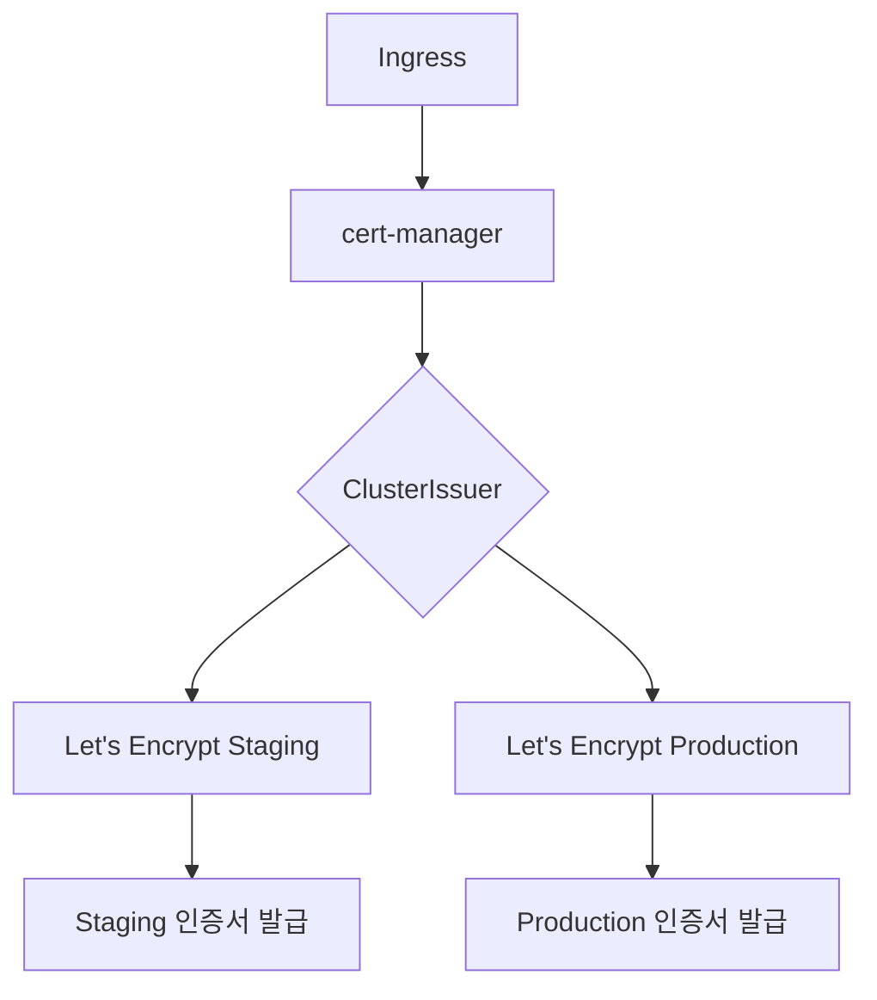
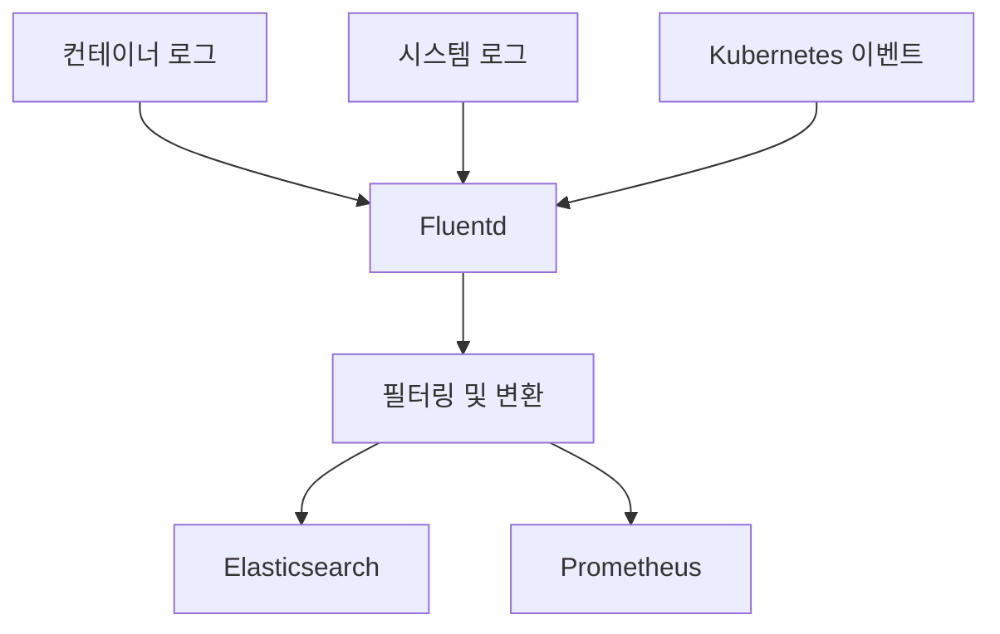
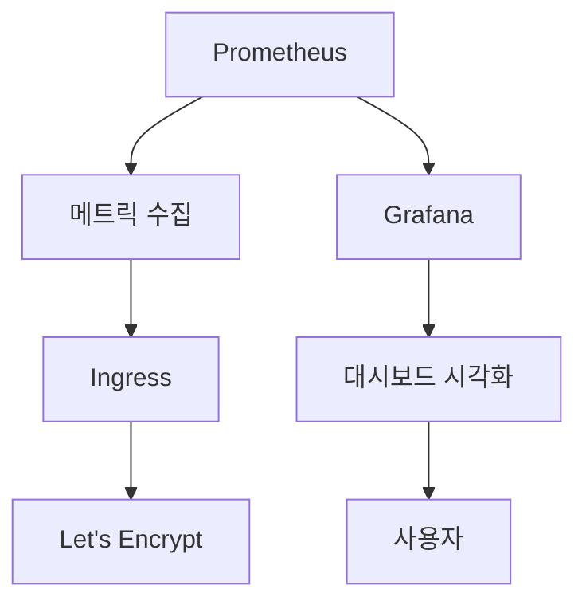

# 보안 및 모니터링

<cite>
**이 문서에서 참조된 파일**   
- [values.yaml](file://helm/cluster-services/cert-manager/values.yaml#L1-L35)
- [cluster-issuer-prod.yaml](file://helm/cluster-services/cert-manager/templates/cluster-issuer-prod.yaml#L1-L20)
- [cluster-issuer-staging.yaml](file://helm/cluster-services/cert-manager/templates/cluster-issuer-staging.yaml#L1-L20)
- [values.yaml](file://helm/development-tools/fluentd/values.yaml#L1-L404)
- [daemonset.yaml](file://helm/development-tools/fluentd/templates/daemonset.yaml#L1-L41)
- [fluentd-configurations-cm.yaml](file://helm/development-tools/fluentd/templates/fluentd-configurations-cm.yaml#L1-L38)
- [systemd.yaml](file://helm/development-tools/fluentd/templates/files.conf/systemd.yaml#L1-L84)
- [prometheus.yaml](file://helm/development-tools/fluentd/templates/files.conf/prometheus.yaml#L1-L26)
- [values.yaml](file://helm/development-tools/prometheus/values.yaml#L1-L800)
- [deploy.yaml](file://helm/development-tools/prometheus/templates/deploy.yaml#L1-L487)
- [cm.yaml](file://helm/development-tools/prometheus/templates/cm.yaml#L1-L108)
- [values.yaml](file://helm/development-tools/grafana/values.yaml#L1-L800)
- [deployment.yaml](file://helm/development-tools/grafana/templates/deployment.yaml#L1-L54)
- [configmap-dashboard-provider.yaml](file://helm/development-tools/grafana/templates/configmap-dashboard-provider.yaml#L1-L16)
</cite>

## 목차
1. [소개](#소개)
2. [cert-manager를 통한 SSL/TLS 인증서 관리](#cert-manager를-통한-ssltls-인증서-관리)
3. [Fluentd를 통한 로그 수집 및 전송](#fluentd를-통한-로그-수집-및-전송)
4. [Prometheus와 Grafana를 통한 모니터링](#prometheus와-grafana를-통한-모니터링)
5. [결론](#결론)

## 소개
이 문서는 prj-devops 프로젝트의 보안 및 모니터링 기능에 대해 설명합니다. cert-manager를 통한 SSL/TLS 인증서 자동 관리, Fluentd를 통한 로그 수집 및 전송, Prometheus와 Grafana를 통한 모니터링 설정에 대해 자세히 다룹니다. 각 구성 요소의 역할, 설정 방법, 주요 기능을 설명하며, 보안 및 모니터링 설정이 시스템의 안정성과 신뢰성에 어떻게 기여하는지 이해할 수 있도록 돕습니다.

## cert-manager를 통한 SSL/TLS 인증서 관리

cert-manager는 Kubernetes 클러스터에서 SSL/TLS 인증서를 자동으로 관리하는 데 사용됩니다. 이 구성 요소는 Let's Encrypt와 통합되어 인증서를 자동으로 발급하고 갱신합니다. 두 가지 환경(스테이징과 프로덕션)에 대해 별도의 ClusterIssuer가 설정되어 있으며, 각각 다른 Let's Encrypt 서버를 사용합니다.

스테이징 환경에서는 시험용 인증서를 사용하며, 프로덕션 환경에서는 실서명 인증서를 적용합니다. 이를 통해 개발 및 테스트 환경에서의 안전한 테스트와 프로덕션 환경에서의 신뢰성 있는 보안을 보장합니다. cert-manager는 HTTP-01 챌린지를 통해 도메인 소유권을 검증하며, 인증서 갱신은 자동으로 처리됩니다.

**Diagram sources**
- [values.yaml](file://helm/cluster-services/cert-manager/values.yaml#L1-L35)
- [cluster-issuer-prod.yaml](file://helm/cluster-services/cert-manager/templates/cluster-issuer-prod.yaml#L1-L20)
- [cluster-issuer-staging.yaml](file://helm/cluster-services/cert-manager/templates/cluster-issuer-staging.yaml#L1-L20)

**Section sources**
- [values.yaml](file://helm/cluster-services/cert-manager/values.yaml#L1-L35)
- [cluster-issuer-prod.yaml](file://helm/cluster-services/cert-manager/templates/cluster-issuer-prod.yaml#L1-L20)
- [cluster-issuer-staging.yaml](file://helm/cluster-services/cert-manager/templates/cluster-issuer-staging.yaml#L1-L20)

## Fluentd를 통한 로그 수집 및 전송

Fluentd는 Kubernetes 클러스터 내에서 발생하는 로그를 수집하고, 이를 Elasticsearch와 같은 외부 시스템으로 전송하는 데 사용됩니다. Fluentd는 DaemonSet으로 배포되어 각 노드에서 로그를 수집하며, 다양한 소스에서 로그를 수집할 수 있습니다.

Fluentd는 컨테이너 로그, 시스템 로그, Kubernetes 이벤트 등을 수집하며, 수집된 로그는 필터링 및 변환된 후 외부 시스템으로 전송됩니다. Fluentd는 Prometheus와 통합되어 메트릭을 노출하며, 이를 통해 Fluentd 자체의 상태를 모니터링할 수 있습니다.

**Diagram sources**
- [values.yaml](file://helm/development-tools/fluentd/values.yaml#L1-L404)
- [daemonset.yaml](file://helm/development-tools/fluentd/templates/daemonset.yaml#L1-L41)
- [fluentd-configurations-cm.yaml](file://helm/development-tools/fluentd/templates/fluentd-configurations-cm.yaml#L1-L38)

**Section sources**
- [values.yaml](file://helm/development-tools/fluentd/values.yaml#L1-L404)
- [daemonset.yaml](file://helm/development-tools/fluentd/templates/daemonset.yaml#L1-L41)
- [fluentd-configurations-cm.yaml](file://helm/development-tools/fluentd/templates/fluentd-configurations-cm.yaml#L1-L38)
- [systemd.yaml](file://helm/development-tools/fluentd/templates/files.conf/systemd.yaml#L1-L84)
- [prometheus.yaml](file://helm/development-tools/fluentd/templates/files.conf/prometheus.yaml#L1-L26)

## Prometheus와 Grafana를 통한 모니터링

Prometheus는 Kubernetes 클러스터의 메트릭을 수집하고, Grafana는 이를 시각화하여 대시보드로 제공합니다. Prometheus는 다양한 소스에서 메트릭을 수집하며, 수집된 메트릭은 Grafana에서 시각화됩니다.

Prometheus는 Ingress를 통해 외부에서 접근할 수 있으며, Let's Encrypt를 통해 SSL/TLS 인증서를 자동으로 관리합니다. Grafana도 마찬가지로 Ingress를 통해 접근할 수 있으며, 인증서는 자동으로 갱신됩니다. Grafana는 Prometheus를 데이터 소스로 사용하여 다양한 대시보드를 제공하며, 이를 통해 시스템의 상태를 실시간으로 모니터링할 수 있습니다.

**Diagram sources**
- [values.yaml](file://helm/development-tools/prometheus/values.yaml#L1-L800)
- [deploy.yaml](file://helm/development-tools/prometheus/templates/deploy.yaml#L1-L487)
- [cm.yaml](file://helm/development-tools/prometheus/templates/cm.yaml#L1-L108)
- [values.yaml](file://helm/development-tools/grafana/values.yaml#L1-L800)
- [deployment.yaml](file://helm/development-tools/grafana/templates/deployment.yaml#L1-L54)
- [configmap-dashboard-provider.yaml](file://helm/development-tools/grafana/templates/configmap-dashboard-provider.yaml#L1-L16)

**Section sources**
- [values.yaml](file://helm/development-tools/prometheus/values.yaml#L1-L800)
- [deploy.yaml](file://helm/development-tools/prometheus/templates/deploy.yaml#L1-L487)
- [cm.yaml](file://helm/development-tools/prometheus/templates/cm.yaml#L1-L108)
- [values.yaml](file://helm/development-tools/grafana/values.yaml#L1-L800)
- [deployment.yaml](file://helm/development-tools/grafana/templates/deployment.yaml#L1-L54)
- [configmap-dashboard-provider.yaml](file://helm/development-tools/grafana/templates/configmap-dashboard-provider.yaml#L1-L16)

## 결론

prj-devops 프로젝트는 cert-manager, Fluentd, Prometheus, Grafana를 통해 강력한 보안 및 모니터링 기능을 제공합니다. cert-manager는 SSL/TLS 인증서를 자동으로 관리하여 보안을 강화하며, Fluentd는 로그를 수집하고 전송하여 문제를 신속하게 진단할 수 있도록 합니다. Prometheus와 Grafana는 메트릭을 수집하고 시각화하여 시스템의 상태를 실시간으로 모니터링할 수 있도록 합니다. 이러한 구성 요소들은 시스템의 안정성과 신뢰성을 크게 향상시킵니다.