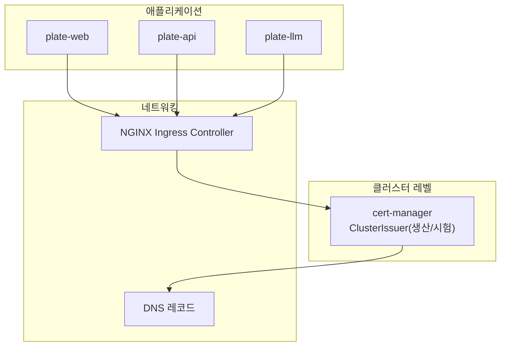
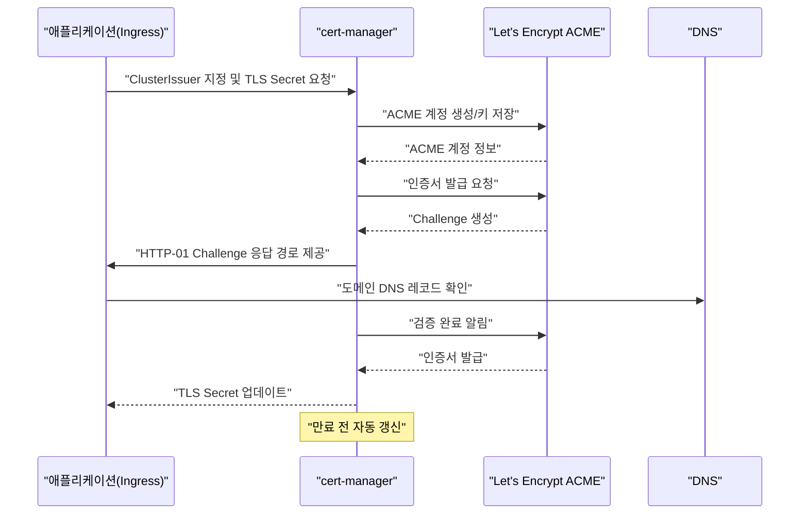
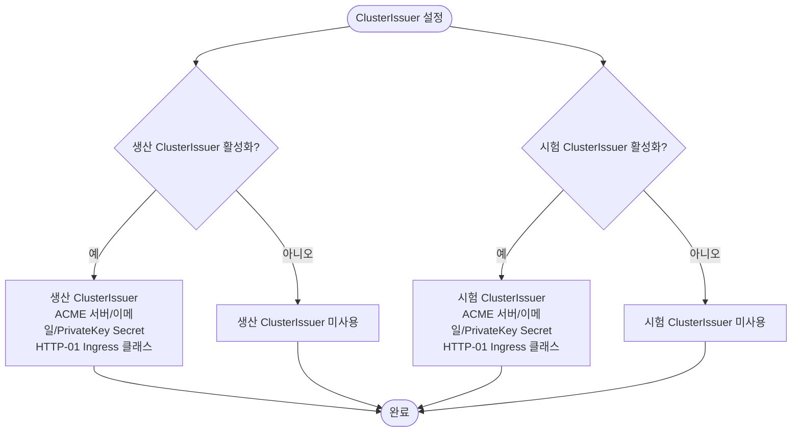
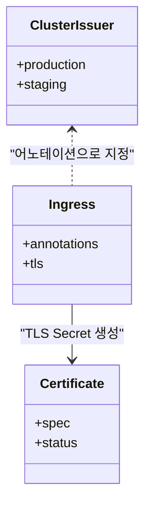
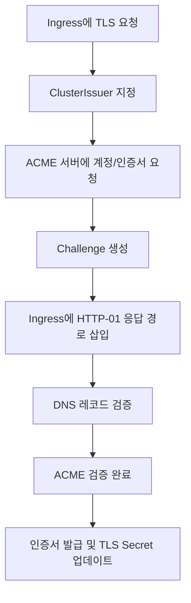
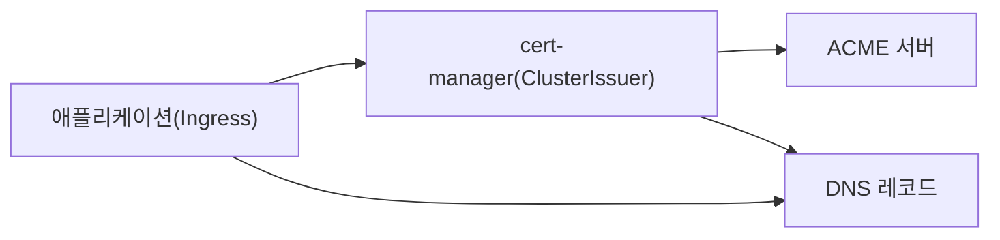

# 인증서 관리

<cite>
**문서에서 참조하는 파일**
- [README.md](file://README.md)
- [helm/cluster-services/cert-manager/Chart.yaml](file://helm/cluster-services/cert-manager/Chart.yaml)
- [helm/cluster-services/cert-manager/values.yaml](file://helm/cluster-services/cert-manager/values.yaml)
- [helm/cluster-services/cert-manager/templates/cluster-issuer-prod.yaml](file://helm/cluster-services/cert-manager/templates/cluster-issuer-prod.yaml)
- [helm/cluster-services/cert-manager/templates/cluster-issuer-staging.yaml](file://helm/cluster-services/cert-manager/templates/cluster-issuer-staging.yaml)
- [helm/applications/plate-server/values.yaml](file://helm/applications/plate-server/values.yaml)
- [helm/applications/plate-web/values.yaml](file://helm/applications/plate-web/values.yaml)
- [helm/applications/plate-llm/values.yaml](file://helm/applications/plate-llm/values.yaml)
- [environments/argocd/apps/ingress-prod.yaml](file://environments/argocd/apps/ingress-prod.yaml)
- [environments/argocd/apps/ingress-stg.yaml](file://environments/argocd/apps/ingress-stg.yaml)
</cite>

## 목차
1. [소개](#소개)
2. [프로젝트 구조](#프로젝트-구조)
3. [핵심 구성 요소](#핵심-구성-요소)
4. [아키텍처 개요](#아키텍처-개요)
5. [상세 구성 요소 분석](#상세-구성-요소-분석)
6. [의존성 분석](#의존성-분석)
7. [성능 고려사항](#성능-고려사항)
8. [장애 대응 가이드](#장애-대응-가이드)
9. [결론](#결론)
10. [부록](#부록)

## 소개
본 문서는 cert-manager를 활용한 SSL/TLS 인증서 자동 관리 시스템을 설명합니다. 프로덕션 및 스테이징 환경에서 ClusterIssuer 설정 방법, 인증서 자동 갱신 메커니즘, ACME 프로토콜을 통한 Let's Encrypt 연동 방식을 상세히 다룹니다. 또한, helm/cluster-services/cert-manager 디렉토리의 설정 파일들을 분석하여 각 환경별 인증서 발급 정책과 보안 설정을 문서화하고, 인증서 관리에서 발생할 수 있는 일반적인 문제와 그 해결 방법, 모니터링 및 경고 설정 방법도 포함합니다.

## 프로젝트 구조
cert-manager는 클러스터 레벨 서비스로 배포되며, Let's Encrypt ACME 서버와 통신하여 인증서를 발급하고 갱신합니다. 프로덕션과 스테이징 환경 모두 동일한 구조를 따르지만, ACME 서버 URL과 이메일, Private Key 저장소 이름이 다르게 설정됩니다. 인그레스 컨트롤러를 통한 HTTP-01 검증을 사용하며, 각 애플리케이션 차트에서는 cert-manager를 사용할 ClusterIssuer를 지정하고 TLS Secret 이름을 설정합니다.

**도표 출처**
- [helm/cluster-services/cert-manager/values.yaml](file://helm/cluster-services/cert-manager/values.yaml#L9-L35)
- [helm/applications/plate-web/values.yaml](file://helm/applications/plate-web/values.yaml#L50-L66)
- [helm/applications/plate-server/values.yaml](file://helm/applications/plate-server/values.yaml#L92-L108)
- [helm/applications/plate-llm/values.yaml](file://helm/applications/plate-llm/values.yaml#L44-L59)

**섹션 출처**
- [README.md](file://README.md#L249-L265)
- [helm/cluster-services/cert-manager/Chart.yaml](file://helm/cluster-services/cert-manager/Chart.yaml#L1-L20)

## 핵심 구성 요소
- ClusterIssuer(생산): Let's Encrypt Production ACME 서버를 사용하며, HTTP-01 검증을 위한 Ingress 클래스를 지정합니다.
- ClusterIssuer(시험): Let's Encrypt Staging ACME 서버를 사용하며, 동일한 HTTP-01 검증 설정을 적용합니다.
- 애플리케이션 차트: cert-manager.io/cluster-issuer 어노테이션을 통해 사용할 ClusterIssuer를 지정하고, TLS Secret 이름을 설정합니다.
- Ingress: HTTP-01 검증을 위해 Ingress 리소스에 어노테이션을 추가하고, cert-manager가 자동으로 Challenge 리소스를 생성합니다.

**섹션 출처**
- [helm/cluster-services/cert-manager/values.yaml](file://helm/cluster-services/cert-manager/values.yaml#L9-L35)
- [helm/applications/plate-web/values.yaml](file://helm/applications/plate-web/values.yaml#L50-L66)
- [helm/applications/plate-server/values.yaml](file://helm/applications/plate-server/values.yaml#L92-L108)
- [helm/applications/plate-llm/values.yaml](file://helm/applications/plate-llm/values.yaml#L44-L59)

## 아키텍처 개요
cert-manager는 ACME 프로토콜을 통해 Let's Encrypt에 인증서 발급을 요청하고, HTTP-01 검증을 통해 도메인 소유권을 증명합니다. 검증이 성공하면 인증서를 발급하고, 만료 전에 자동 갱신합니다. 이 과정은 Certificate, Order, Challenge 등의 리소스를 통해 추적됩니다.

**도표 출처**
- [helm/cluster-services/cert-manager/values.yaml](file://helm/cluster-services/cert-manager/values.yaml#L9-L35)
- [helm/applications/plate-web/values.yaml](file://helm/applications/plate-web/values.yaml#L50-L66)
- [helm/applications/plate-server/values.yaml](file://helm/applications/plate-server/values.yaml#L92-L108)
- [helm/applications/plate-llm/values.yaml](file://helm/applications/plate-llm/values.yaml#L44-L59)

## 상세 구성 요소 분석

### ClusterIssuer 설정
- 생산 환경 ClusterIssuer
  - ACME 서버: Let's Encrypt Production
  - 이메일: 관리자 이메일
  - Private Key 저장소 이름: 별도 Secret 이름
  - HTTP-01 검증: 지정된 Ingress 클래스를 사용
- 시험 환경 ClusterIssuer
  - ACME 서버: Let's Encrypt Staging
  - 이메일: 관리자 이메일
  - Private Key 저장소 이름: 별도 Secret 이름
  - HTTP-01 검증: 동일한 Ingress 클래스 사용

**도표 출처**
- [helm/cluster-services/cert-manager/values.yaml](file://helm/cluster-services/cert-manager/values.yaml#L9-L35)
- [helm/cluster-services/cert-manager/templates/cluster-issuer-prod.yaml](file://helm/cluster-services/cert-manager/templates/cluster-issuer-prod.yaml#L1-L20)
- [helm/cluster-services/cert-manager/templates/cluster-issuer-staging.yaml](file://helm/cluster-services/cert-manager/templates/cluster-issuer-staging.yaml#L1-L20)

**섹션 출처**
- [helm/cluster-services/cert-manager/values.yaml](file://helm/cluster-services/cert-manager/values.yaml#L9-L35)
- [helm/cluster-services/cert-manager/templates/cluster-issuer-prod.yaml](file://helm/cluster-services/cert-manager/templates/cluster-issuer-prod.yaml#L1-L20)
- [helm/cluster-services/cert-manager/templates/cluster-issuer-staging.yaml](file://helm/cluster-services/cert-manager/templates/cluster-issuer-staging.yaml#L1-L20)

### 애플리케이션별 인증서 발급 정책
- plate-web
  - ClusterIssuer: production
  - Ingress 어노테이션: HTTP-01 검증 편집 방식 사용
  - TLS Secret: web-tls
- plate-api
  - ClusterIssuer: production
  - Ingress 어노테이션: HTTP-01 검증 편집 방식 사용
  - TLS Secret: server-tls
- plate-llm
  - ClusterIssuer: production
  - Ingress 어노테이션: HTTP-01 검증 편집 방식 사용
  - TLS Secret: llm-tls

**도표 출처**
- [helm/applications/plate-web/values.yaml](file://helm/applications/plate-web/values.yaml#L50-L66)
- [helm/applications/plate-server/values.yaml](file://helm/applications/plate-server/values.yaml#L92-L108)
- [helm/applications/plate-llm/values.yaml](file://helm/applications/plate-llm/values.yaml#L44-L59)

**섹션 출처**
- [helm/applications/plate-web/values.yaml](file://helm/applications/plate-web/values.yaml#L50-L66)
- [helm/applications/plate-server/values.yaml](file://helm/applications/plate-server/values.yaml#L92-L108)
- [helm/applications/plate-llm/values.yaml](file://helm/applications/plate-llm/values.yaml#L44-L59)

### ACME HTTP-01 검증 흐름
- cert-manager는 ACME 서버에 계정을 등록하고, 인증서 발급을 요청합니다.
- ACME는 HTTP-01 Challenge를 생성하고, cert-manager는 Ingress에 검증 응답 경로를 삽입합니다.
- 클라이언트는 해당 경로에 접근하여 검증을 완료하고, cert-manager는 이를 확인한 후 인증서를 발급합니다.

**도표 출처**
- [helm/cluster-services/cert-manager/values.yaml](file://helm/cluster-services/cert-manager/values.yaml#L9-L35)
- [helm/applications/plate-web/values.yaml](file://helm/applications/plate-web/values.yaml#L50-L66)
- [helm/applications/plate-server/values.yaml](file://helm/applications/plate-server/values.yaml#L92-L108)
- [helm/applications/plate-llm/values.yaml](file://helm/applications/plate-llm/values.yaml#L44-L59)

**섹션 출처**
- [helm/cluster-services/cert-manager/values.yaml](file://helm/cluster-services/cert-manager/values.yaml#L9-L35)

### 인증서 자동 갱신 메커니즘
- cert-manager는 인증서 만료 전에 자동으로 갱신을 시도합니다.
- 갱신 실패 시 Challenge 리소스를 통해 문제를 진단하고, 필요한 경우 수동 보완이 가능합니다.

**섹션 출처**
- [README.md](file://README.md#L339-L340)

## 의존성 분석
- cert-manager는 클러스터 레벨에 배포되며, ClusterIssuer 리소스를 통해 ACME 서버에 연결됩니다.
- 애플리케이션 차트는 Ingress 리소스에 cert-manager 어노테이션을 추가함으로써 인증서 발급을 요청합니다.
- Ingress Controller는 HTTP-01 검증 응답을 제공해야 하며, DNS 레코드가 올바르게 설정되어야 합니다.

**도표 출처**
- [helm/cluster-services/cert-manager/values.yaml](file://helm/cluster-services/cert-manager/values.yaml#L9-L35)
- [helm/applications/plate-web/values.yaml](file://helm/applications/plate-web/values.yaml#L50-L66)
- [helm/applications/plate-server/values.yaml](file://helm/applications/plate-server/values.yaml#L92-L108)
- [helm/applications/plate-llm/values.yaml](file://helm/applications/plate-llm/values.yaml#L44-L59)

**섹션 출처**
- [helm/cluster-services/cert-manager/values.yaml](file://helm/cluster-services/cert-manager/values.yaml#L9-L35)
- [helm/applications/plate-web/values.yaml](file://helm/applications/plate-web/values.yaml#L50-L66)
- [helm/applications/plate-server/values.yaml](file://helm/applications/plate-server/values.yaml#L92-L108)
- [helm/applications/plate-llm/values.yaml](file://helm/applications/plate-llm/values.yaml#L44-L59)

## 성능 고려사항
- HTTP-01 검증은 Ingress Controller의 응답 지연에 영향을 받습니다. 검증 응답 경로가 제대로 제공되지 않으면 인증서 발급이 지연됩니다.
- ACME 서버 호출 빈도는 cert-manager 내부 정책에 따라 조절되며, 과도한 요청은 Rate Limit에 걸릴 수 있습니다.
- DNS 레코드 업데이트 지연은 인증서 발급 지연으로 이어질 수 있으므로, DNS 업데이트 후에는 검증 재시도를 권장합니다.

[이 섹션은 일반적인 성능 논의를 포함하므로 구체적인 파일 분석 없음]

## 장애 대응 가이드
- 인증서 문제 진단
  - cert-manager Pod 로그 확인
  - Certificate, Order, Challenge 리소스 상태 확인
- Ingress 문제 진단
  - DNS A/CNAME 레코드 확인
  - Ingress Controller LoadBalancer IP 매칭 여부 점검
- 일반적인 점검 명령
  - 배포 상태 확인
  - Ingress 상태 확인
  - 인증서 상태 확인

**섹션 출처**
- [README.md](file://README.md#L339-L354)

## 결론
이 시스템은 cert-manager를 통한 자동 인증서 관리를 통해 Let's Encrypt ACME를 활용한 안정적인 TLS 보안을 제공합니다. 프로덕션과 스테이징 환경 모두 동일한 구조를 따르며, ClusterIssuer 설정과 HTTP-01 검증을 통해 신뢰할 수 있는 인증서 발급 및 갱신이 가능합니다. 문제 발생 시 cert-manager 리소스 상태와 DNS/Ingress 설정을 점검함으로써 신속한 복구가 가능합니다.

[이 섹션은 요약 내용을 포함하므로 구체적인 파일 분석 없음]

## 부록

### 환경별 인증서 발급 정책 요약
- 스테이징 환경
  - ClusterIssuer: 시험용 ACME 서버 사용
  - 검증 방식: HTTP-01
  - 어노테이션: HTTP-01 검증 편집 방식 사용
- 프로덕션 환경
  - ClusterIssuer: 실서명 ACME 서버 사용
  - 검증 방식: HTTP-01
  - 어노테이션: HTTP-01 검증 편집 방식 사용

**섹션 출처**
- [helm/cluster-services/cert-manager/values.yaml](file://helm/cluster-services/cert-manager/values.yaml#L9-L35)
- [helm/applications/plate-web/values.yaml](file://helm/applications/plate-web/values.yaml#L50-L66)
- [helm/applications/plate-server/values.yaml](file://helm/applications/plate-server/values.yaml#L92-L108)
- [helm/applications/plate-llm/values.yaml](file://helm/applications/plate-llm/values.yaml#L44-L59)

### ArgoCD 연동
- 인그레스 애플리케이션은 ArgoCD를 통해 자동 동기화되며, 프로덕션/스테이징 환경별 Application이 별도로 관리됩니다.

**섹션 출처**
- [environments/argocd/apps/ingress-prod.yaml](file://environments/argocd/apps/ingress-prod.yaml#L1-L81)
- [environments/argocd/apps/ingress-stg.yaml](file://environments/argocd/apps/ingress-stg.yaml#L1-L70)