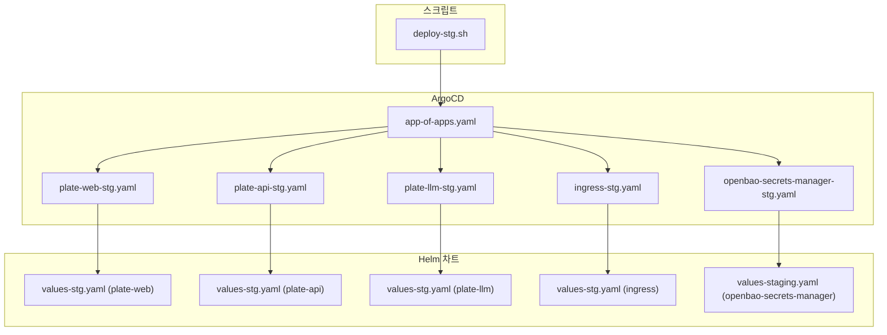
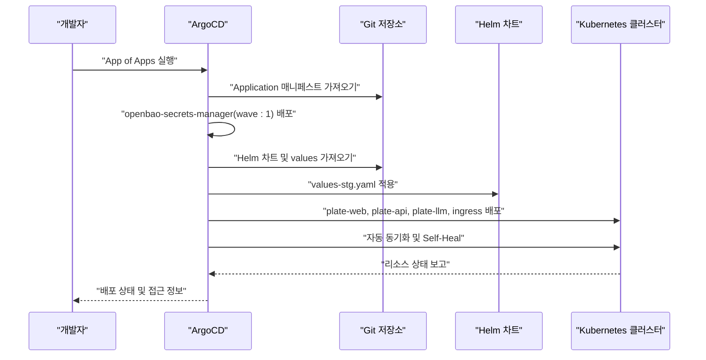
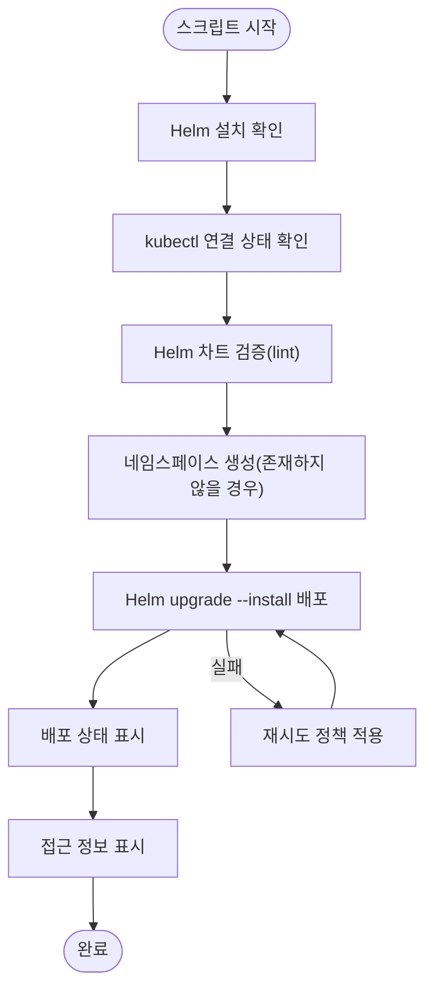
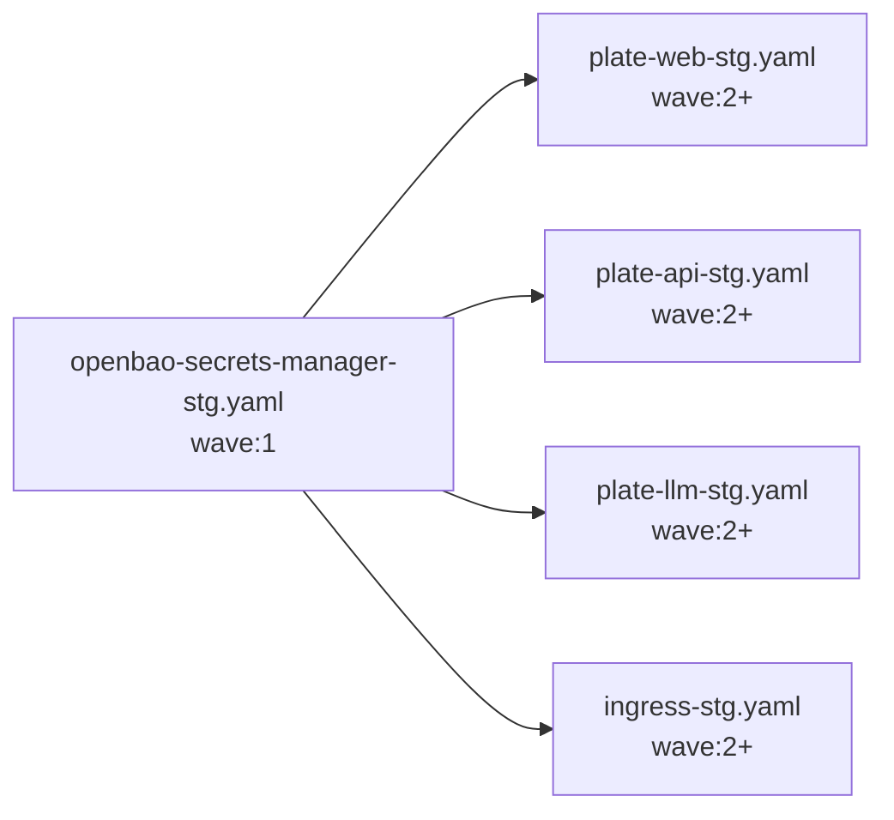

# 스테이징 환경 배포 (deploy-stg.sh)

<cite>
**문서에서 참조하는 파일 목록**
- [deploy-stg.sh](file://scripts/deploy-stg.sh)
- [plate-web-stg.yaml](file://environments/argocd/apps/plate-web-stg.yaml)
- [plate-api-stg.yaml](file://environments/argocd/apps/plate-api-stg.yaml)
- [plate-llm-stg.yaml](file://environments/argocd/apps/plate-llm-stg.yaml)
- [ingress-stg.yaml](file://environments/argocd/apps/ingress-stg.yaml)
- [openbao-secrets-manager-stg.yaml](file://environments/argocd/apps/openbao-secrets-manager-stg.yaml)
- [app-of-apps.yaml](file://environments/argocd/app-of-apps.yaml)
- [values-stg.yaml (plate-web)](file://helm/applications/plate-web/values-stg.yaml)
- [values-stg.yaml (plate-api)](file://helm/applications/plate-server/values-stg.yaml)
- [values-stg.yaml (plate-llm)](file://helm/applications/plate-llm/values-stg.yaml)
- [values-stg.yaml (ingress)](file://helm/ingress/values-stg.yaml)
- [values-staging.yaml (openbao-secrets-manager)](file://helm/shared-configs/openbao-secrets-manager/values-staging.yaml)
</cite>

## 목차
1. [소개](#소개)
2. [프로젝트 구조](#프로젝트-구조)
3. [핵심 컴포넌트](#핵심-컴포넌트)
4. [아키텍처 개요](#아키텍처-개요)
5. [상세 컴포넌트 분석](#상세-컴포넌트-분석)
6. [의존성 분석](#의존성-분석)
7. [성능 고려사항](#성능-고려사항)
8. [Troubleshooting 가이드](#troubleshooting-가이드)
9. [결론](#결론)
10. [부록](#부록)

## 소개
본 문서는 스테이징 환경에 애플리케이션을 배포하는 과정을 상세히 설명합니다. 배포는 Helm 차트를 통해 ArgoCD Application 리소스를 적용함으로써 수행되며, 스크립트는 environments/argocd/apps/ 디렉토리에 위치한 스테이징 관련 Application 매니페스트를 활용합니다. 또한 배포 전후의 상태 검증 절차, 로깅 및 모니터링 설정, 그리고 개발 및 테스트 용도로 사용되는 스테이징 환경의 특수한 구성 옵션(예: 리소스 제한 완화, 디버깅 기능 활성화)을 안내합니다.

## 프로젝트 구조
배포와 관련된 핵심 영역은 다음과 같습니다:
- 스크립트: 스테이징 배포를 위한 Bash 스크립트
- ArgoCD Application 매니페스트: 스테이징 환경에 배포할 애플리케이션 정의
- Helm 차트 및 values: 각 애플리케이션의 구성 및 환경별 오버라이드
- App of Apps: 여러 Application을 한 번에 관리하는 ArgoCD Application

**도표 출처**
- [app-of-apps.yaml](file://environments/argocd/app-of-apps.yaml#L1-L35)
- [plate-web-stg.yaml](file://environments/argocd/apps/plate-web-stg.yaml#L1-L62)
- [plate-api-stg.yaml](file://environments/argocd/apps/plate-api-stg.yaml#L1-L62)
- [plate-llm-stg.yaml](file://environments/argocd/apps/plate-llm-stg.yaml#L1-L64)
- [ingress-stg.yaml](file://environments/argocd/apps/ingress-stg.yaml#L1-L70)
- [openbao-secrets-manager-stg.yaml](file://environments/argocd/apps/openbao-secrets-manager-stg.yaml#L1-L78)
- [values-stg.yaml (plate-web)](file://helm/applications/plate-web/values-stg.yaml#L1-L23)
- [values-stg.yaml (plate-api)](file://helm/applications/plate-server/values-stg.yaml#L1-L19)
- [values-stg.yaml (plate-llm)](file://helm/applications/plate-llm/values-stg.yaml#L1-L54)
- [values-stg.yaml (ingress)](file://helm/ingress/values-stg.yaml#L1-L59)
- [values-staging.yaml (openbao-secrets-manager)](file://helm/shared-configs/openbao-secrets-manager/values-staging.yaml#L1-L167)

**섹션 출처**
- [deploy-stg.sh](file://scripts/deploy-stg.sh#L1-L173)
- [app-of-apps.yaml](file://environments/argocd/app-of-apps.yaml#L1-L35)

## 핵심 컴포넌트
- 스크립트: 스테이징 환경에 애플리케이션을 배포하고 상태를 검증하며 접근 정보를 표시합니다. Helm 검증, 네임스페이스 생성, 배포, 상태 조회, 접근 정보 표시, 삭제 명령 등을 지원합니다.
- ArgoCD Application: 각 애플리케이션(plate-web, plate-api, plate-llm, ingress, openbao-secrets-manager)에 대해 Git 소스, 목적지 네임스페이스, 자동 동기화 정책, 재시도 정책, ignoreDifferences 등을 정의합니다.
- Helm values: 각 애플리케이션에 대한 리소스 제한, 이미지 태그, Ingress 설정, 시크릿 주입 등 스테이징 환경 특화 설정이 포함됩니다.

**섹션 출처**
- [deploy-stg.sh](file://scripts/deploy-stg.sh#L1-L173)
- [plate-web-stg.yaml](file://environments/argocd/apps/plate-web-stg.yaml#L1-L62)
- [plate-api-stg.yaml](file://environments/argocd/apps/plate-api-stg.yaml#L1-L62)
- [plate-llm-stg.yaml](file://environments/argocd/apps/plate-llm-stg.yaml#L1-L64)
- [ingress-stg.yaml](file://environments/argocd/apps/ingress-stg.yaml#L1-L70)
- [openbao-secrets-manager-stg.yaml](file://environments/argocd/apps/openbao-secrets-manager-stg.yaml#L1-L78)
- [values-stg.yaml (plate-web)](file://helm/applications/plate-web/values-stg.yaml#L1-L23)
- [values-stg.yaml (plate-api)](file://helm/applications/plate-server/values-stg.yaml#L1-L19)
- [values-stg.yaml (plate-llm)](file://helm/applications/plate-llm/values-stg.yaml#L1-L54)
- [values-stg.yaml (ingress)](file://helm/ingress/values-stg.yaml#L1-L59)
- [values-staging.yaml (openbao-secrets-manager)](file://helm/shared-configs/openbao-secrets-manager/values-staging.yaml#L1-L167)

## 아키텍처 개요
스테이징 환경 배포는 다음과 같은 흐름으로 진행됩니다:
1. App of Apps(Application of Applications)를 통해 스테이징 환경에 배포할 모든 Application을 한 번에 관리합니다.
2. 각 Application은 Git 저장소의 Helm 차트를 소스로 하며, 환경별 values를 적용합니다.
3. openbao-secrets-manager(Application wave:1)가 먼저 배포되어 시크릿 관리를 준비하고, 이후 plate-web, plate-api, plate-llm, ingress(Application wave:2 이상)이 순차적으로 배포됩니다.
4. 배포 후에는 ArgoCD가 자동 동기화를 통해 Git 변경사항을 반영하고, selfHeal을 통해 수동 변경을 복구합니다.

**도표 출처**
- [app-of-apps.yaml](file://environments/argocd/app-of-apps.yaml#L1-L35)
- [openbao-secrets-manager-stg.yaml](file://environments/argocd/apps/openbao-secrets-manager-stg.yaml#L1-L78)
- [plate-web-stg.yaml](file://environments/argocd/apps/plate-web-stg.yaml#L1-L62)
- [plate-api-stg.yaml](file://environments/argocd/apps/plate-api-stg.yaml#L1-L62)
- [plate-llm-stg.yaml](file://environments/argocd/apps/plate-llm-stg.yaml#L1-L64)
- [ingress-stg.yaml](file://environments/argocd/apps/ingress-stg.yaml#L1-L70)
- [values-stg.yaml (plate-web)](file://helm/applications/plate-web/values-stg.yaml#L1-L23)
- [values-stg.yaml (plate-api)](file://helm/applications/plate-server/values-stg.yaml#L1-L19)
- [values-stg.yaml (plate-llm)](file://helm/applications/plate-llm/values-stg.yaml#L1-L54)
- [values-stg.yaml (ingress)](file://helm/ingress/values-stg.yaml#L1-L59)

## 상세 컴포넌트 분석

### deploy-stg.sh 스크립트
- 목적: 스테이징 환경에 애플리케이션을 배포하고, 배포 전후 상태를 검증하며 접근 정보를 표시합니다.
- 주요 기능:
  - Helm 설치 여부 확인
  - kubectl 연결 상태 확인
  - Helm 차트 검증(lint)
  - 네임스페이스 생성(존재하지 않을 경우)
  - Helm upgrade --install을 통한 배포(wait 및 timeout 설정)
  - 배포 상태 표시(Helm release 상태, Pods, Services, Ingresses)
  - 접근 정보 표시(Host 기반 URL)
  - 상태 확인(status) 및 삭제(delete) 명령어 제공

**도표 출처**
- [deploy-stg.sh](file://scripts/deploy-stg.sh#L1-L173)

**섹션 출처**
- [deploy-stg.sh](file://scripts/deploy-stg.sh#L1-L173)

### plate-web-stg.yaml (ArgoCD Application)
- Git 소스: helm/applications/plate-web
- 목적지: plate-stg 네임스페이스
- 자동 동기화: prune, selfHeal, CreateNamespace=true, ApplyOutOfSyncOnly=true
- 재시도: 최대 5회, 지수 백오프
- 정보: 환경, 도메인, 설명

**섹션 출처**
- [plate-web-stg.yaml](file://environments/argocd/apps/plate-web-stg.yaml#L1-L62)

### plate-api-stg.yaml (ArgoCD Application)
- Git 소스: helm/applications/plate-server
- 목적지: plate-stg 네임스페이스
- 자동 동기화: prune, selfHeal, CreateNamespace=true, ApplyOutOfSyncOnly=true
- 재시도: 최대 5회, 지수 백오프
- 정보: 환경, 도메인, 설명

**섹션 출처**
- [plate-api-stg.yaml](file://environments/argocd/apps/plate-api-stg.yaml#L1-L62)

### plate-llm-stg.yaml (ArgoCD Application)
- Git 소스: helm/applications/plate-llm
- 목적지: plate-stg 네임스페이스
- Sync Wave: 2 (openbao-secrets-manager 이후 배포)
- 자동 동기화: prune, selfHeal, CreateNamespace=true, ApplyOutOfSyncOnly=true
- 재시도: 최대 5회, 지수 백오프
- 정보: 환경, 도메인, 설명

**섹션 출처**
- [plate-llm-stg.yaml](file://environments/argocd/apps/plate-llm-stg.yaml#L1-L64)

### ingress-stg.yaml (ArgoCD Application)
- Git 소스: helm/ingress
- 목적지: plate-stg 네임스페이스
- App name: plate
- values-stg.yaml에 따라 stg.cocdev.co.kr, llm.cocdev.co.kr 라우팅 설정
- 자동 동기화: prune, selfHeal, CreateNamespace=true, ApplyOutOfSyncOnly=true, RespectIgnoreDifferences=true
- 재시도: 최대 3회, 지수 백오프

**섹션 출처**
- [ingress-stg.yaml](file://environments/argocd/apps/ingress-stg.yaml#L1-L70)
- [values-stg.yaml (ingress)](file://helm/ingress/values-stg.yaml#L1-L59)

### openbao-secrets-manager-stg.yaml (ArgoCD Application)
- Git 소스: helm/shared-configs/openbao-secrets-manager
- 목적지: plate-stg 네임스페이스
- Sync Wave: 1 (애플리케이션보다 먼저 배포)
- ignoreDifferences: Secret data, ExternalSecret status 무시
- 자동 동기화: prune=true, selfHeal=true, allowEmpty=false
- 재시도: 최대 5회, 지수 백오프
- values-staging.yaml: plate-stg 네임스페이스에 대한 시크릿 매핑, 리소스 제한 완화

**섹션 출처**
- [openbao-secrets-manager-stg.yaml](file://environments/argocd/apps/openbao-secrets-manager-stg.yaml#L1-L78)
- [values-staging.yaml (openbao-secrets-manager)](file://helm/shared-configs/openbao-secrets-manager/values-staging.yaml#L1-L167)

### App of Apps (app-of-apps.yaml)
- environments/argocd/apps 디렉토리의 모든 Application을 한 번에 관리
- 자동 동기화: prune, selfHeal, CreateNamespace=true
- 정보: 설명, 환경, 구성 요소, 네임스페이스

**섹션 출처**
- [app-of-apps.yaml](file://environments/argocd/app-of-apps.yaml#L1-L35)

### 스테이징 환경 특화 구성 (values-stg.yaml)
- plate-web-stg:
  - replicaCount: 1
  - image.pullPolicy: Always (최신 이미지 사용)
  - 리소스 제한: CPU 500m, Memory 512Mi (제한 완화)
  - Ingress 비활성화 (통합 템플릿에서 관리)

- plate-api-stg:
  - replicaCount: 1
  - backend.image.repository: Harbor registry(stg)
  - port: 3006
  - 리소스 제한: CPU 500m, Memory 1Gi (제한 완화)

- plate-llm-stg:
  - replicaCount: 1
  - image.pullPolicy: Always
  - ingress.enabled: true (llm.cocdev.co.kr)
  - tls: letsencrypt-prod 사용
  - resources: CPU 1000m, Memory 2Gi (제한 완화)
  - appSecrets: cluster-env-secrets 사용

**섹션 출처**
- [values-stg.yaml (plate-web)](file://helm/applications/plate-web/values-stg.yaml#L1-L23)
- [values-stg.yaml (plate-api)](file://helm/applications/plate-server/values-stg.yaml#L1-L19)
- [values-stg.yaml (plate-llm)](file://helm/applications/plate-llm/values-stg.yaml#L1-L54)

## 의존성 분석
- 배포 순서:
  - openbao-secrets-manager(wave:1) → plate-web, plate-api, plate-llm, ingress(wave:2 이상)
- 네임스페이스:
  - 모든 Application은 plate-stg 네임스페이스에 배포
- 자동 동기화:
  - 모든 Application에 대해 prune, selfHeal, CreateNamespace=true, ApplyOutOfSyncOnly=true
- 재시도 정책:
  - openbao-secrets-manager: 5회, 지수 백오프
  - ingress: 3회, 지수 백오프
  - plate-*: 5회, 지수 백오프
- ignoreDifferences:
  - openbao-secrets-manager: Secret data, ExternalSecret status 무시

**도표 출처**
- [openbao-secrets-manager-stg.yaml](file://environments/argocd/apps/openbao-secrets-manager-stg.yaml#L1-L78)
- [plate-web-stg.yaml](file://environments/argocd/apps/plate-web-stg.yaml#L1-L62)
- [plate-api-stg.yaml](file://environments/argocd/apps/plate-api-stg.yaml#L1-L62)
- [plate-llm-stg.yaml](file://environments/argocd/apps/plate-llm-stg.yaml#L1-L64)
- [ingress-stg.yaml](file://environments/argocd/apps/ingress-stg.yaml#L1-L70)

**섹션 출처**
- [openbao-secrets-manager-stg.yaml](file://environments/argocd/apps/openbao-secrets-manager-stg.yaml#L1-L78)
- [plate-web-stg.yaml](file://environments/argocd/apps/plate-web-stg.yaml#L1-L62)
- [plate-api-stg.yaml](file://environments/argocd/apps/plate-api-stg.yaml#L1-L62)
- [plate-llm-stg.yaml](file://environments/argocd/apps/plate-llm-stg.yaml#L1-L64)
- [ingress-stg.yaml](file://environments/argocd/apps/ingress-stg.yaml#L1-L70)

## 성능 고려사항
- 리소스 제한 완화: 스테이징 환경에서는 CPU/Memory 제한을 낮게 설정하여 테스트 편의성을 높입니다. 운영 환경에서는 제한을 강화하세요.
- 자동 동기화 최적화: ApplyOutOfSyncOnly=true를 통해 변경된 리소스만 적용하여 성능을 최적화합니다.
- 재시도 정책: 지수 백오프를 통한 안정적인 재시도를 통해 일시적 오류에 대한 회복력을 높입니다.
- 네임스페이스 생성: CreateNamespace=true를 통해 자동 생성을 통해 배포 준비를 간소화합니다.

[이 섹션은 일반적인 성능 논의를 포함하므로 구체적인 파일 분석 없음]

## Troubleshooting 가이드
- Helm 검증 실패:
  - 원인: Chart.yaml 누락 또는 values 오류
  - 조치: values-stg.yaml 및 공통 values 확인, lint 재검증
- 네임스페이스 생성 실패:
  - 원인: 권한 부족 또는 네임스페이스 중복
  - 조치: RBAC 확인, 기존 네임스페이스 상태 점검
- 배포 시간 초과:
  - 원인: Pod Pending, Image Pull, 리소스 부족
  - 조치: --timeout 증가, 리소스 제한 조정, 이미지 캐시 확인
- Ingress URL 확인 불가:
  - 원인: Host 미설정 또는 TLS 문제
  - 조치: values-stg.yaml ingress 설정 확인, cert-manager 상태 점검
- 시크릿 관리 문제:
  - 원인: ignoreDifferences로 인한 외부 시스템 관리
  - 조치: ExternalSecret 상태 확인, OpenBao 토큰 및 Store 설정 점검

**섹션 출처**
- [deploy-stg.sh](file://scripts/deploy-stg.sh#L1-L173)
- [openbao-secrets-manager-stg.yaml](file://environments/argocd/apps/openbao-secrets-manager-stg.yaml#L1-L78)
- [values-stg.yaml (ingress)](file://helm/ingress/values-stg.yaml#L1-L59)

## 결론
deploy-stg.sh 스크립트는 스테이징 환경에 애플리케이션을 효율적으로 배포하고, ArgoCD Application 매니페스트를 통해 Git 기반 자동 동기화를 실현합니다. openbao-secrets-manager를 통해 시크릿 관리를 먼저 준비하고, 이후 plate-web, plate-api, plate-llm, ingress를 순차적으로 배포함으로써 안정적인 스테이징 환경을 구축합니다. 스테이징 환경 특화로 리소스 제한 완화, 디버깅 편의를 위한 설정이 적용되었으며, 배포 전후 상태 검증과 접근 정보 표시를 통해 운영 편의성을 높였습니다.

[이 섹션은 요약을 포함하므로 구체적인 파일 분석 없음]

## 부록
- 배포 명령어 예시:
  - 배포: scripts/deploy-stg.sh deploy
  - 상태 확인: scripts/deploy-stg.sh status
  - 삭제: scripts/deploy-stg.sh delete
- 주요 values 파일 위치:
  - plate-web: helm/applications/plate-web/values-stg.yaml
  - plate-api: helm/applications/plate-server/values-stg.yaml
  - plate-llm: helm/applications/plate-llm/values-stg.yaml
  - ingress: helm/ingress/values-stg.yaml
  - openbao-secrets-manager: helm/shared-configs/openbao-secrets-manager/values-staging.yaml

[이 섹션은 일반 정보를 포함하므로 구체적인 파일 분석 없음]