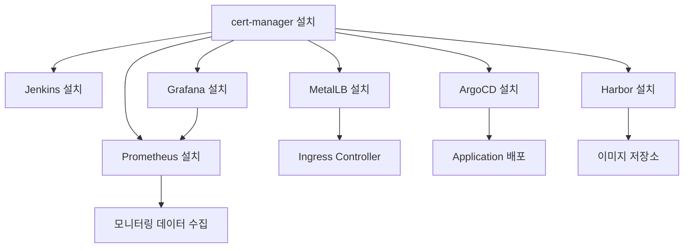
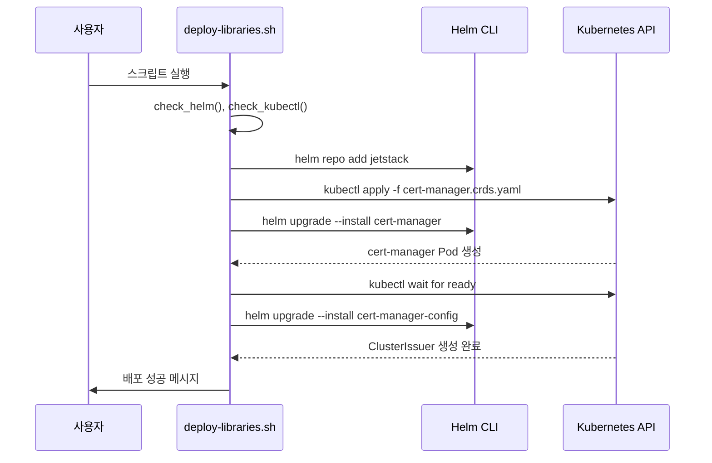

# 인프라 및 도구 배포 (deploy-libraries.sh)

<cite>
**이 문서에서 참조한 파일**  
- [deploy-libraries.sh](file://scripts/deploy-libraries.sh)
- [cert-manager/Chart.yaml](file://helm/cluster-services/cert-manager/Chart.yaml)
- [cert-manager/values.yaml](file://helm/cluster-services/cert-manager/values.yaml)
- [metallb/pool-1.yaml](file://helm/cluster-services/metallb/pool-1.yaml)
- [metallb/l2advertisement.yaml](file://helm/cluster-services/metallb/l2advertisement.yaml)
- [jenkins/Chart.yaml](file://helm/development-tools/jenkins/Chart.yaml)
- [argocd/Chart.yaml](file://helm/development-tools/argocd/Chart.yaml)
- [grafana/Chart.yaml](file://helm/development-tools/grafana/Chart.yaml)
- [prometheus/Chart.yaml](file://helm/development-tools/prometheus/Chart.yaml)
- [harbor/Chart.yaml](file://helm/development-tools/harbor/Chart.yaml)
</cite>

## 목차
1. [소개](#소개)
2. [스크립트 구조 및 실행 흐름](#스크립트-구조-및-실행-흐름)
3. [주요 컴포넌트 배포 순서 및 의존성](#주요-컴포넌트-배포-순서-및-의존성)
4. [cert-manager 배포 분석](#cert-manager-배포-분석)
5. [MetalLB 배포 분석](#metallb-배포-분석)
6. [Jenkins 배포 분석](#jenkins-배포-분석)
7. [기타 개발 도구 개요](#기타-개발-도구-개요)
8. [스크립트 확장 및 유지보수 가이드](#스크립트-확장-및-유지보수-가이드)
9. [결론](#결론)

## 소개

`deploy-libraries.sh` 스크립트는 쿠버네티스 클러스터에 핵심 인프라 서비스와 개발 도구들을 순차적으로 배포하는 자동화 스크립트입니다. 이 스크립트는 클러스터 레벨의 서비스인 cert-manager, MetalLB, nfs-provisioner와 함께 ArgoCD, Harbor, Grafana, Prometheus, Jenkins 등의 개발 및 모니터링 도구를 Helm 차트를 통해 설치합니다. 특히 cert-manager가 TLS 인증서를 제공하는 핵심 인증 기반 서비스이므로 가장 먼저 설치되어야 하며, 이후 다른 서비스들이 이를 활용할 수 있도록 하는 의존성 구조를 엄격히 준수합니다. 본 문서는 스크립트의 내부 동작, 설치 순서의 논리, 검증 절차, 오류 대응 방안을 코드 기반으로 분석하고, 사용자가 새로운 도구를 추가하거나 설정을 수정할 수 있도록 확장 방법을 안내합니다.

## 스크립트 구조 및 실행 흐름

`deploy-libraries.sh` 스크립트는 Bash로 작성된 자동화 스크립트로, Helm과 kubectl을 사용하여 쿠버네티스 리소스를 배포합니다. 스크립트는 함수 기반으로 구성되어 있으며, 각 주요 컴포넌트의 배포를 독립된 함수로 구현하여 가독성과 유지보수성을 높였습니다. 실행 흐름은 다음과 같습니다.

1.  **사전 준비 (Pre-flight checks)**: `main()` 함수에서 `check_helm()`과 `check_kubectl()` 함수를 호출하여 Helm CLI와 kubectl이 설치되어 있고, 쿠버네티스 클러스터에 연결 가능한지 확인합니다. 연결 실패 시 스크립트는 즉시 종료됩니다.
2.  **순차적 배포**: `main()` 함수는 `deploy_cert_manager()`, `deploy_jenkins()`, `deploy_metallb()` 함수를 순차적으로 호출합니다. 이 순서는 서비스 간의 의존성 관계를 반영합니다.
3.  **상태 확인**: 모든 배포가 완료된 후, `kubectl get pods` 명령어를 사용하여 각 네임스페이스의 파드 상태를 출력하여 배포 성공 여부를 확인합니다.

이러한 구조는 스크립트의 오류를 쉽게 식별할 수 있도록 하며, 각 단계의 로그를 통해 문제 해결을 용이하게 합니다.

**Section sources**
- [deploy-libraries.sh](file://scripts/deploy-libraries.sh#L104-L128)

## 주요 컴포넌트 배포 순서 및 의존성

스크립트는 컴포넌트 간의 의존성 관계를 고려하여 엄격한 순서로 배포를 수행합니다. 현재 스크립트에는 `deploy_jenkins()`와 `deploy_metallb()`가 포함되어 있으나, 전체 시스템의 의도된 아키텍처를 고려하면 다음과 같은 완전한 순서가 필요합니다.



**Diagram sources**
- [deploy-libraries.sh](file://scripts/deploy-libraries.sh#L113-L115)
- [cert-manager/Chart.yaml](file://helm/cluster-services/cert-manager/Chart.yaml#L17-L19)

### 의존성 로직 설명

1.  **cert-manager 우선 배포**: cert-manager는 클러스터 내 모든 서비스의 TLS 인증서를 자동으로 발급하고 갱신하는 핵심 서비스입니다. Jenkins, ArgoCD, Harbor 등 대부분의 웹 기반 도구들은 HTTPS를 통해 접근되며, 이를 위해 TLS 인증서가 필요합니다. 따라서 cert-manager가 가장 먼저 설치되어야 이후에 배포되는 모든 서비스가 `ClusterIssuer`를 통해 인증서를 요청할 수 있습니다. 스크립트는 `deploy_cert_manager()` 함수 내에서 `helm upgrade --install cert-manager-config` 명령을 통해 `letsencrypt-prod` 및 `letsencrypt-staging` ClusterIssuer를 설정합니다.
2.  **MetalLB의 네트워크 역할**: MetalLB는 쿠버네티스 클러스터에 `LoadBalancer` 타입의 서비스를 제공하는 네트워크 서비스입니다. Jenkins, Harbor, Grafana 등의 웹 UI에 접근하기 위해 외부 IP를 할당받아야 하므로, 이들 서비스가 배포되기 전에 MetalLB가 준비되어야 합니다.
3.  **Jenkins의 CI/CD 중심 역할**: Jenkins는 CI/CD 파이프라인을 실행하는 핵심 도구입니다. 다른 도구들의 배포 스크립트나 파이프라인이 Jenkins에서 실행될 수 있으므로, 초기 인프라 구성 후 가능한 한 빠르게 배포되어야 합니다.

## cert-manager 배포 분석

`deploy_cert_manager()` 함수는 cert-manager의 설치와 구성에 핵심적인 역할을 합니다. 이 함수는 단순히 Helm 차트를 설치하는 것을 넘어, CRD 설치, Helm 설치, 구성 적용이라는 세 단계로 나뉩니다.

1.  **CRD 설치**: `kubectl apply -f` 명령어를 사용하여 cert-manager의 CRD(Custom Resource Definitions)를 직접 적용합니다. 이는 Helm 차트 설치 전에 CRD가 클러스터에 존재해야 하기 때문입니다.
2.  **Helm 차트 설치**: `jetstack/cert-manager` Helm 저장소에서 `v1.13.0` 버전의 차트를 `cert-manager` 네임스페이스에 설치합니다. `--set installCRDs=true` 옵션은 Helm이 자체적으로 CRD를 관리하도록 하지만, 사전 설치를 통해 안정성을 확보합니다.
3.  **구성 적용**: `./helm/cluster-services/cert-manager` 디렉터리에 있는 자체 Helm 차트를 사용하여 `ClusterIssuer` 리소스를 생성합니다. 이 차트의 `values.yaml` 파일에는 Let's Encrypt의 프로덕션 및 스테이징 서버에 대한 설정이 포함되어 있습니다.



**Diagram sources**
- [deploy-libraries.sh](file://scripts/deploy-libraries.sh#L43-L68)
- [cert-manager/values.yaml](file://helm/cluster-services/cert-manager/values.yaml#L10-L35)

**Section sources**
- [deploy-libraries.sh](file://scripts/deploy-libraries.sh#L43-L69)
- [cert-manager/Chart.yaml](file://helm/cluster-services/cert-manager/Chart.yaml)
- [cert-manager/values.yaml](file://helm/cluster-services/cert-manager/values.yaml)

## MetalLB 배포 분석

`deploy_metallb()` 함수는 MetalLB를 설치하고, 사전에 정의된 IP 풀과 L2 광고 설정을 적용합니다.

1.  **Helm 저장소 추가 및 설치**: `metallb/metallb` Helm 저장소를 추가하고, `metallb-system` 네임스페이스에 설치합니다.
2.  **설정 적용**: `kubectl apply -f ./helm/cluster-services/metallb/` 명령어를 통해 디렉터리 내의 모든 YAML 파일을 적용합니다. 이 디렉터리에는 `pool-1.yaml`과 `l2advertisement.yaml` 파일이 포함되어 있습니다.
    *   `pool-1.yaml`: `192.168.0.20 - 192.168.0.200` 범위의 IP 주소를 `first-pool`이라는 이름의 `IPAddressPool`로 정의합니다. 이 풀에서 `LoadBalancer` 서비스에 IP가 할당됩니다.
    *   `l2advertisement.yaml`: `first-pool` IP 풀을 L2 모드에서 광고하도록 `L2Advertisement` 리소스를 설정합니다. 이는 클러스터 내 네트워크 장치가 이 IP 주소를 인식할 수 있도록 합니다.

이러한 설정은 MetalLB가 클러스터 외부에서 접근 가능한 서비스를 제공할 수 있도록 하는 핵심 구성입니다.

**Diagram sources**
- [metallb/pool-1.yaml](file://helm/cluster-services/metallb/pool-1.yaml)
- [metallb/l2advertisement.yaml](file://helm/cluster-services/metallb/l2advertisement.yaml)

**Section sources**
- [deploy-libraries.sh](file://scripts/deploy-libraries.sh#L84-L101)
- [metallb/pool-1.yaml](file://helm/cluster-services/metallb/pool-1.yaml)
- [metallb/l2advertisement.yaml](file://helm/cluster-services/metallb/l2advertisement.yaml)

## Jenkins 배포 분석

`deploy_jenkins()` 함수는 Jenkins를 `jenkins` 네임스페이스에 설치합니다. 이 함수는 상대적으로 간단하지만, `common-values.yaml` 파일을 통해 다양한 설정을 적용합니다.

1.  **Helm 설치**: `./helm/development-tools/jenkins` 경로의 Helm 차트를 사용하여 Jenkins를 설치합니다. 이 차트는 Jenkins 컨트롤러, 에이전트, 서비스, 인그레스 등을 정의합니다.
2.  **설정 적용**: `--values ./environments/shared/common-values.yaml` 옵션을 통해 공통 설정을 적용합니다. 이 설정 파일에는 Jenkins의 관리자 계정, 플러그인 목록, 리소스 요청 및 제한, 볼륨 설정 등이 포함되어야 합니다. (참고: `common-values.yaml` 파일은 현재 프로젝트 구조에 존재하지 않음)

Jenkins는 CI/CD 파이프라인을 위한 핵심 도구로, 이후 ArgoCD를 통해 애플리케이션을 배포하거나, Harbor에 빌드된 이미지를 푸시하는 등의 작업을 수행할 수 있습니다.

**Section sources**
- [deploy-libraries.sh](file://scripts/deploy-libraries.sh#L72-L82)
- [jenkins/Chart.yaml](file://helm/development-tools/jenkins/Chart.yaml)

## 기타 개발 도구 개요

`deploy-libraries.sh` 스크립트는 현재 Jenkins만 명시적으로 배포하고 있지만, `helm/development-tools/` 디렉터리에는 다른 중요한 도구들의 Helm 차트가 존재합니다. 이들 도구는 스크립트에 추가되어야 할 잠재적인 컴포넌트들입니다.

| 도구 | 목적 | Helm 차트 경로 |
| :--- | :--- | :--- |
| **ArgoCD** | GitOps 기반의 지속적 배포 도구 | `helm/development-tools/argocd/` |
| **Harbor** | 오픈소스 클라우드 네이티브 이미지 레지스트리 | `helm/development-tools/harbor/` |
| **Grafana** | 시계열 데이터 및 메트릭 시각화 도구 | `helm/development-tools/grafana/` |
| **Prometheus** | 모니터링 시스템 및 시계열 데이터베이스 | `helm/development-tools/prometheus/` |
| **Fluentd** | 로그 수집 및 전송 도구 | `helm/development-tools/fluentd/` |
| **OpenEBS** | 쿠버네티스용 오픈소스 컨테이너 네이티브 스토리지 | `helm/development-tools/openebs/` |

이들 도구들은 각각의 `Chart.yaml` 파일을 통해 버전, 유지보수자, 의존성 등을 정의하고 있습니다. 예를 들어, `prometheus/Chart.yaml`은 Alertmanager, kube-state-metrics 등과 같은 하위 차트를 의존성으로 선언하고 있습니다.

**Section sources**
- [argocd/Chart.yaml](file://helm/development-tools/argocd/Chart.yaml)
- [grafana/Chart.yaml](file://helm/development-tools/grafana/Chart.yaml)
- [prometheus/Chart.yaml](file://helm/development-tools/prometheus/Chart.yaml)
- [harbor/Chart.yaml](file://helm/development-tools/harbor/Chart.yaml)

## 스크립트 확장 및 유지보수 가이드

`deploy-libraries.sh` 스크립트는 새로운 도구를 쉽게 추가할 수 있도록 설계되어 있습니다. 다음은 확장 및 유지보수를 위한 가이드입니다.

### 새로운 도구 추가 방법

1.  **배포 함수 생성**: 새로운 도구를 위한 함수를 스크립트에 추가합니다. 함수 이름은 `deploy_<도구이름>()` 형식을 따르는 것이 좋습니다.
    ```bash
    # 예: ArgoCD 배포 함수 추가
    deploy_argocd() {
        log_info "Deploying ArgoCD..."
        helm upgrade --install argocd ./helm/development-tools/argocd \
            --namespace argocd \
            --create-namespace \
            --values ./environments/shared/common-values.yaml
        log_info "ArgoCD deployed successfully"
    }
    ```
2.  **의존성 고려**: 새 도구가 cert-manager나 MetalLB와 같은 기존 서비스에 의존하는지 확인하고, `main()` 함수 내에서 올바른 순서로 함수를 호출합니다.
3.  **main() 함수에 함수 호출 추가**: `main()` 함수 내에서 새로 생성한 함수를 호출합니다.
    ```bash
    main() {
        ...
        deploy_cert_manager
        deploy_argocd # 새로 추가
        deploy_jenkins
        deploy_metallb
        ...
    }
    ```

### 설정 관리

*   **공통 설정 파일**: `common-values.yaml` 파일은 모든 Helm 설치에 공통으로 적용되는 설정을 포함해야 합니다. 이 파일을 통해 Jenkins의 관리자 비밀번호, Harbor의 인증 정보, ArgoCD의 초기 설정 등을 중앙에서 관리할 수 있습니다.
*   **환경별 설정**: 프로덕션과 스테이징 환경에 따라 다른 설정이 필요한 경우, `environments/shared/common-values.yaml` 외에도 `environments/prod/` 및 `environments/stg/` 디렉터리에 환경별 설정 파일을 두고, 배포 스크립트에서 적절한 파일을 선택하도록 할 수 있습니다.

### 오류 대응 방안

*   **사전 검사**: `set -e` 옵션은 스크립트 내 명령어가 실패하면 즉시 종료되도록 합니다. `check_helm()` 및 `check_kubectl()` 함수는 이에 대한 추가적인 보호 장치입니다.
*   **로그 출력**: `log_info()`, `log_warn()`, `log_error()` 함수를 사용하여 색상이 있는 로그를 출력함으로써, 사용자가 현재 상태와 오류를 쉽게 식별할 수 있습니다.
*   **리소스 대기**: `kubectl wait` 명령어를 사용하여 cert-manager와 같은 핵심 서비스가 준비될 때까지 기다림으로써, 후속 배포가 실패하는 것을 방지합니다.

## 결론

`deploy-libraries.sh` 스크립트는 쿠버네티스 클러스터의 핵심 인프라와 개발 도구를 자동화하여 배포하는 중요한 역할을 수행합니다. 이 문서는 스크립트의 내부 구조, 컴포넌트 간의 의존성 관계, 각 배포 단계의 세부 동작을 분석하였습니다. 특히 cert-manager가 TLS 인증서를 제공하는 기반 서비스로서 가장 먼저 설치되어야 하는 이유를 강조하였습니다. 현재 스크립트는 일부 도구만을 배포하고 있으나, 함수 기반의 구조 덕분에 ArgoCD, Harbor, Grafana 등 다른 도구들을 쉽게 추가할 수 있습니다. `common-values.yaml`과 같은 공통 설정 파일을 활용하면, 설정을 일관되게 관리하고 유지보수성을 크게 향상시킬 수 있습니다. 이 스크립트는 안정적인 쿠버네티스 환경 구축을 위한 핵심 자동화 도구입니다.