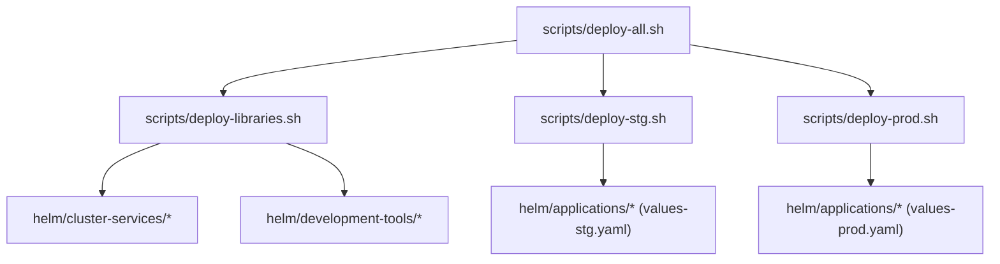
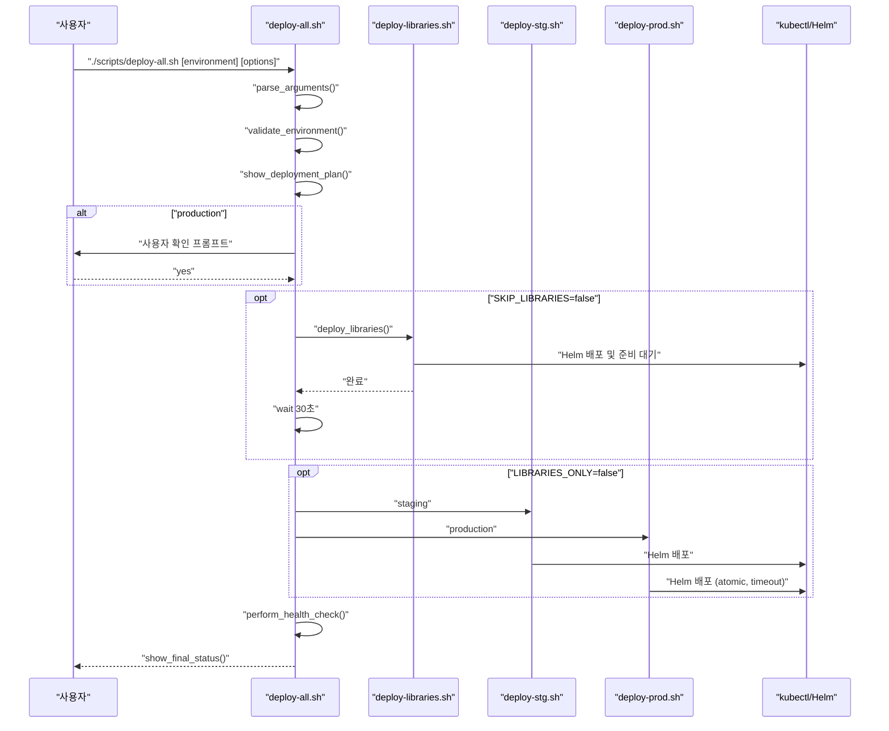
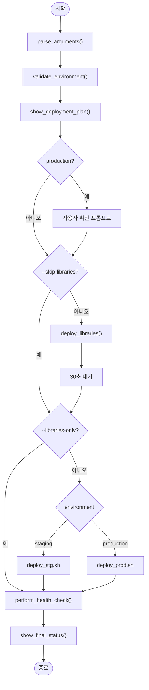
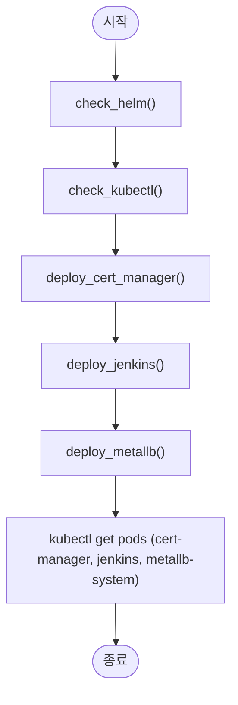
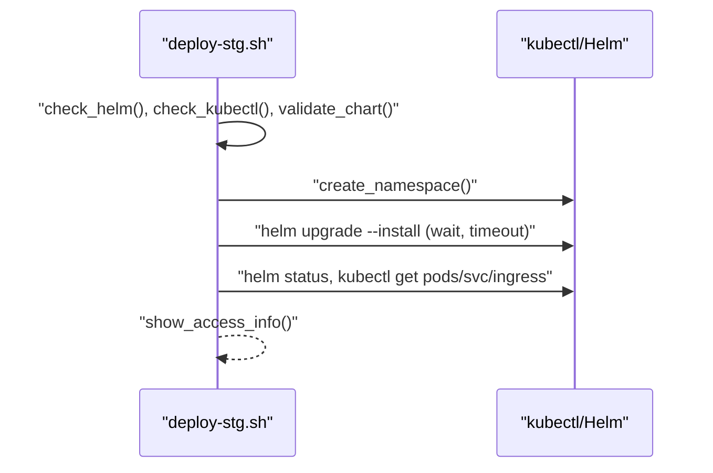
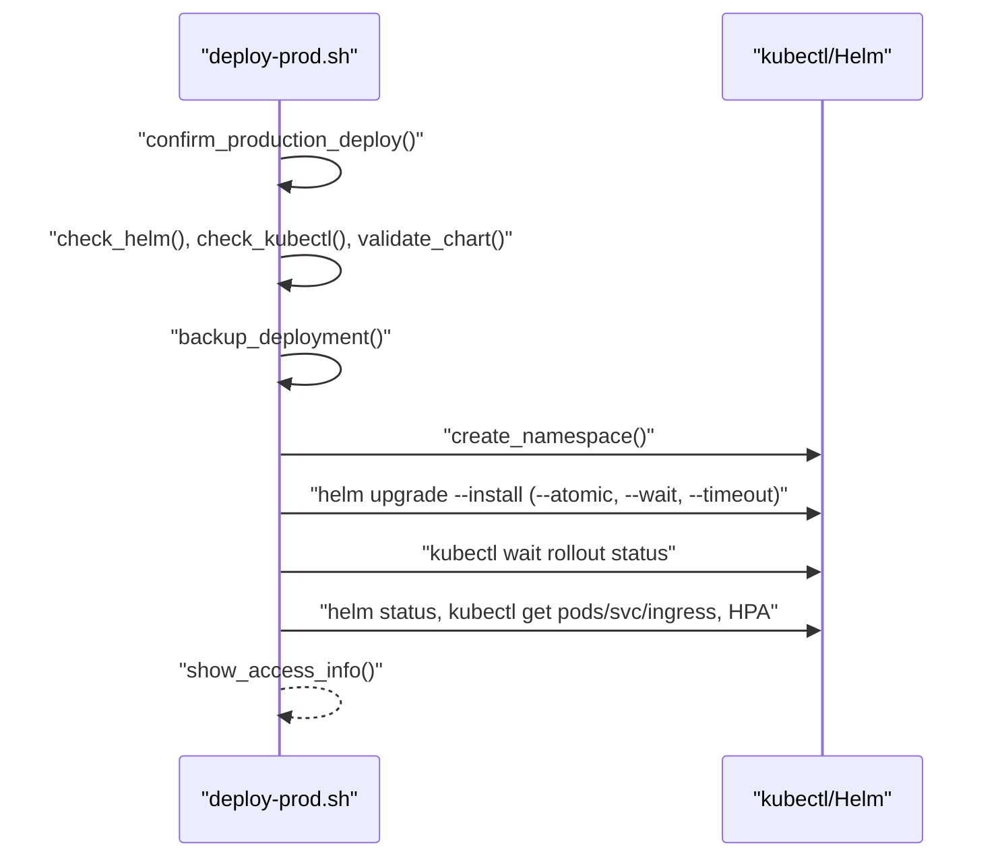
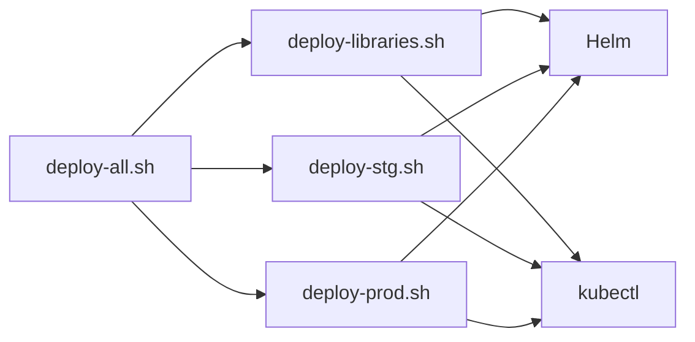

# 전체 배포 오케스트레이션 (deploy-all.sh)

<cite>
**문서에서 참조하는 파일 목록**
- [deploy-all.sh](file://scripts/deploy-all.sh)
- [deploy-libraries.sh](file://scripts/deploy-libraries.sh)
- [deploy-stg.sh](file://scripts/deploy-stg.sh)
- [deploy-prod.sh](file://scripts/deploy-prod.sh)
- [README.md](file://README.md)
</cite>

## 목차
1. [소개](#소개)
2. [프로젝트 구조](#프로젝트-구조)
3. [핵심 컴포넌트](#핵심-컴포넌트)
4. [아키텍처 개요](#아키텍처-개요)
5. [상세 컴포넌트 분석](#상세-컴포넌트-분석)
6. [의존성 분석](#의존성-분석)
7. [성능 고려사항](#성능-고려사항)
8. [고장 대응 가이드](#고장-대응-가이드)
9. [결론](#결론)
10. [부록](#부록)

## 소개
이 문서는 prj-devops 저장소의 메인 배포 오케스트레이션 진입점인 deploy-all.sh 스크립트의 전체 동작 흐름을 분석하고 설명합니다. 스크립트는 클러스터 서비스, 개발 도구, 애플리케이션까지 전체 시스템을 단일 명령어로 배포하는 것을 목표로 하며, 다음과 같은 세 가지 주요 단계로 구성됩니다:
- 초기화 단계: 환경 파싱, 옵션 처리, 색상 로깅 유틸리티 정의
- 인프라 및 도구 배포: deploy-libraries.sh 호출
- 애플리케이션 배포: 환경별 스크립트(deploy-stg.sh 또는 deploy-prod.sh) 호출

또한, 오류 처리 전략, 로깅 방식, 사용자 커스터마이징 포인트, 실패 시 롤백 절차, 상태 확인 방법 등을 코드 예제 경로와 함께 제시합니다.

## 프로젝트 구조
- deploy-all.sh는 scripts 디렉토리에 위치하며, deploy-libraries.sh, deploy-stg.sh, deploy-prod.sh를 조율합니다.
- deploy-libraries.sh는 Helm을 통해 cert-manager, Jenkins, MetalLB 등의 클러스터 서비스 및 개발 도구를 배포합니다.
- deploy-stg.sh는 스테이징 환경에 애플리케이션을 배포하고, deploy-prod.sh는 프로덕션 환경에 배포하며 안전 검사(사용자 확인, 백업, 롤백)를 포함합니다.
- README.md는 배포 스크립트 사용법, 환경별 설정, 운영 원칙, 보안 및 모니터링 정보를 제공합니다.

**도표 출처**
- [deploy-all.sh](file://scripts/deploy-all.sh#L1-L279)
- [deploy-libraries.sh](file://scripts/deploy-libraries.sh#L1-L128)
- [deploy-stg.sh](file://scripts/deploy-stg.sh#L1-L173)
- [deploy-prod.sh](file://scripts/deploy-prod.sh#L1-L299)

**섹션 출처**
- [deploy-all.sh](file://scripts/deploy-all.sh#L1-L279)
- [README.md](file://README.md#L111-L154)

## 핵심 컴포넌트
- deploy-all.sh: 메인 오케스트레이터. 환경 파싱, 옵션 처리, 라이브러리 배포, 애플리케이션 배포, 헬스 체크, 최종 상태 보고를 담당합니다.
- deploy-libraries.sh: Helm을 통한 클러스터 서비스 및 개발 도구 배포 스크립트.
- deploy-stg.sh: 스테이징 환경 배포 스크립트. 린트 검증, 네임스페이스 생성, 배포, 상태 확인, 접근 정보 표시.
- deploy-prod.sh: 프로덕션 환경 배포 스크립트. 사용자 확인, 자동 백업, 헬스 체크, 롤백 지원, 상태 확인, 접근 정보 표시.

**섹션 출처**
- [deploy-all.sh](file://scripts/deploy-all.sh#L1-L279)
- [deploy-libraries.sh](file://scripts/deploy-libraries.sh#L1-L128)
- [deploy-stg.sh](file://scripts/deploy-stg.sh#L1-L173)
- [deploy-prod.sh](file://scripts/deploy-prod.sh#L1-L299)

## 아키텍처 개요
deploy-all.sh는 다음과 같은 제어 흐름을 따릅니다:
1) 환경 파싱: 첫 번째 인수를 환경(staging/production)으로 인식하고, 두 번째 이후 인수는 옵션(--skip-libraries, --libraries-only, --dry-run, --help)으로 처리합니다.
2) 라이브러리 배포: deploy-libraries.sh를 호출하여 클러스터 서비스 및 개발 도구를 배포합니다.
3) 애플리케이션 배포: 환경에 따라 deploy-stg.sh 또는 deploy-prod.sh를 호출합니다.
4) 헬스 체크: kubectl을 통한 클러스터 연결 검사, cert-manager 상태 검사, 애플리케이션 Pod 상태 검사.
5) 최종 상태 보고: 배포 요약, DRY RUN 모드 표시, 프로덕션 시 팁 안내.

**도표 출처**
- [deploy-all.sh](file://scripts/deploy-all.sh#L218-L279)
- [deploy-libraries.sh](file://scripts/deploy-libraries.sh#L104-L128)
- [deploy-stg.sh](file://scripts/deploy-stg.sh#L77-L151)
- [deploy-prod.sh](file://scripts/deploy-prod.sh#L148-L267)

**섹션 출처**
- [deploy-all.sh](file://scripts/deploy-all.sh#L218-L279)

## 상세 컴포넌트 분석

### deploy-all.sh 분석
- 환경 파싱 및 옵션 처리
  - 환경: staging/stg/stage → staging, production/prod → production
  - 옵션: --skip-libraries, --libraries-only, --dry-run, --help
- 라이브러리 배포
  - deploy-libraries.sh 존재 여부 검사 후 실행
  - 배포 완료 후 짧은 대기(30초)를 통해 의존 서비스 준비 대기
- 애플리케이션 배포
  - staging → deploy-stg.sh
  - production → deploy-prod.sh
- 헬스 체크
  - kubectl cluster-info 검사
  - cert-manager 상태 검사(라이브러리 배포 시)
  - 애플리케이션 Pod 상태 검사(네임스페이스에 따라)
- 최종 상태 보고
  - 환경, 라이브러리 배포 여부, 애플리케이션 배포 여부, DRY RUN 여부 표시
  - 프로덕션 시 모니터링 팁 안내

**도표 출처**
- [deploy-all.sh](file://scripts/deploy-all.sh#L65-L279)

**섹션 출처**
- [deploy-all.sh](file://scripts/deploy-all.sh#L1-L279)

### deploy-libraries.sh 분석
- 사전 검사: Helm 설치 여부, kubectl 클러스터 연결 상태
- 배포 순서:
  - cert-manager: Jetstack 저장소 추가, CRDs 설치, Helm 설치, 준비 대기, 설정 적용
  - Jenkins: values.yaml 기반 Helm 설치
  - MetalLB: 저장소 추가, Helm 설치, 설정 적용
- 배포 완료 후 각 네임스페이스의 Pod 상태 출력

**도표 출처**
- [deploy-libraries.sh](file://scripts/deploy-libraries.sh#L27-L128)

**섹션 출처**
- [deploy-libraries.sh](file://scripts/deploy-libraries.sh#L1-L128)

### deploy-stg.sh 분석
- 사전 검사: Helm 설치 여부, kubectl 클러스터 연결 상태
- 차트 검증: Chart.yaml 존재 여부, helm lint
- 네임스페이스 생성: 존재하지 않으면 생성 및 라벨 설정
- 배포: Helm upgrade --install, --wait, --timeout
- 상태 확인: helm status, kubectl get pods/svc/ingress
- 접근 정보: Ingress Host 기반 URL 표시

**도표 출처**
- [deploy-stg.sh](file://scripts/deploy-stg.sh#L39-L151)

**섹션 출처**
- [deploy-stg.sh](file://scripts/deploy-stg.sh#L1-L173)

### deploy-prod.sh 분석
- 사전 검사: Helm 설치 여부, kubectl 클러스터 연결 상태, 클러스터 이름 검증
- 차트 검증: Chart.yaml 존재 여부, helm lint, helm template
- 백업: 현재 values와 manifest 백업 디렉토리 생성
- 네임스페이스 생성: 존재하지 않으면 생성 및 라벨 설정
- 배포: Helm upgrade --install, --wait, --timeout, --atomic (실패 시 자동 롤백)
- 헬스 체크: Pod 준비 상태, 롤아웃 상태 검사
- 상태 확인: helm status, kubectl get pods/svc/ingress, HPA
- 접근 정보: Ingress Host 기반 URL 표시
- 롤백: ./deploy-prod.sh rollback [revision]

**도표 출처**
- [deploy-prod.sh](file://scripts/deploy-prod.sh#L43-L267)

**섹션 출처**
- [deploy-prod.sh](file://scripts/deploy-prod.sh#L1-L299)

## 의존성 분석
- deploy-all.sh는 deploy-libraries.sh, deploy-stg.sh, deploy-prod.sh에 직접 의존하며, 이들의 실행 결과에 따라 흐름이 달라집니다.
- deploy-libraries.sh는 Helm과 kubectl에 의존하며, cert-manager, Jenkins, MetalLB 배포에 필요한 저장소와 설정 파일에 의존합니다.
- deploy-stg.sh/deploy-prod.sh는 Helm 차트(values-stg.yaml 또는 values-prod.yaml)에 의존하며, 네임스페이스, Ingress, Service 리소스에 대한 kubectl 명령에 의존합니다.

**도표 출처**
- [deploy-all.sh](file://scripts/deploy-all.sh#L118-L154)
- [deploy-libraries.sh](file://scripts/deploy-libraries.sh#L27-L128)
- [deploy-stg.sh](file://scripts/deploy-stg.sh#L39-L151)
- [deploy-prod.sh](file://scripts/deploy-prod.sh#L69-L267)

**섹션 출처**
- [deploy-all.sh](file://scripts/deploy-all.sh#L118-L154)
- [deploy-libraries.sh](file://scripts/deploy-libraries.sh#L27-L128)
- [deploy-stg.sh](file://scripts/deploy-stg.sh#L39-L151)
- [deploy-prod.sh](file://scripts/deploy-prod.sh#L69-L267)

## 성능 고려사항
- 라이브러리 배포 후 30초 대기는 의존 서비스가 준비되도록 하는 간접적인 성능 최적화입니다.
- 프로덕션 배포 시 --atomic 플래그를 통한 롤백은 장애 복구 시간을 단축하지만, 롤백 과정 자체에도 시간이 소요될 수 있으므로 배포 시기를 신중히 선택해야 합니다.
- 헬스 체크는 Pod 준비 상태와 롤아웃 상태를 검사하므로, 네트워크 지연이나 클러스터 부하에 따라 응답 시간이 변할 수 있습니다.

[이 섹션은 일반적인 성능 논의를 포함하므로 특정 파일 분석 없음]

## 고장 대응 가이드
- 오류 처리 전략
  - deploy-all.sh: set -e를 사용하여 명령 실패 시 즉시 종료; 환경 및 옵션 파싱 오류 시 도움말 출력 후 종료.
  - deploy-libraries.sh: Helm/kubectl 미설치 또는 클러스터 연결 실패 시 오류 출력 후 종료.
  - deploy-stg.sh: 차트 검증 실패 시 오류 출력 후 종료.
  - deploy-prod.sh: 프로덕션 배포 전 사용자 확인, 클러스터 이름 검증, 차트 검증, 백업, 헬스 체크를 통한 안정성 확보.
- 롤백 절차
  - 프로덕션: ./scripts/deploy-prod.sh rollback [리비전 번호]를 통해 Helm 롤백 수행.
  - 스테이징: ./scripts/deploy-stg.sh delete를 통해 삭제하거나, ArgoCD를 통한 Git 기반 재동기화를 통해 롤백.
- 상태 확인 방법
  - 스테이징: ./scripts/deploy-stg.sh status
  - 프로덕션: ./scripts/deploy-prod.sh status
  - 공통: kubectl get pods -n [namespace], kubectl get ingress/svc -n [namespace] 확인

**섹션 출처**
- [deploy-all.sh](file://scripts/deploy-all.sh#L65-L116)
- [deploy-libraries.sh](file://scripts/deploy-libraries.sh#L27-L41)
- [deploy-stg.sh](file://scripts/deploy-stg.sh#L55-L91)
- [deploy-prod.sh](file://scripts/deploy-prod.sh#L118-L191)
- [README.md](file://README.md#L267-L285)

## 결론
deploy-all.sh는 환경 파싱, 옵션 처리, 라이브러리 배포, 애플리케이션 배포, 헬스 체크, 최종 상태 보고를 통합적으로 관리하는 오케스트레이션 스크립트입니다. deploy-libraries.sh를 통해 클러스터 서비스와 개발 도구를 먼저 배포하고, 이후 환경에 따라 deploy-stg.sh 또는 deploy-prod.sh를 호출함으로써 일관되고 안정적인 배포 흐름을 제공합니다. 프로덕션 배포에는 사용자 확인, 자동 백업, 헬스 체크, 롤백 지원이 포함되어 있어 운영 안정성을 강화합니다.

[이 섹션은 요약 내용을 포함하므로 특정 파일 분석 없음]

## 부록
- 사용자 커스터마이징 포인트
  - 환경 추가: environments 디렉토리에 새 환경 폴더 생성, 환경별 values 파일 작성, deploy-all.sh에 분기 추가.
  - 애플리케이션 추가: helm/applications/에 새 차트 생성, 환경별 values 파일 작성, deploy-stg.sh/deploy-prod.sh에 분기 또는 ArgoCD Application 추가.
  - 인프라 수정: helm/cluster-services/ 또는 helm/development-tools/ 내 차트 수정 후 스테이징 검증 → 프로덕션 반영.
- 배포 권장 절차
  - 항상 드라이런(dry-run) 선 실행
  - 스테이징에서 기능/성능 검증
  - 점검 창(또는 저부하 시간대)에 적용
  - 배포 직후/초기 구간 모니터링
  - 롤백 시나리오 및 이전 리비전 번호 메모

**섹션 출처**
- [README.md](file://README.md#L301-L334)