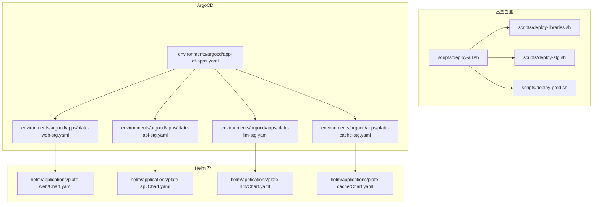
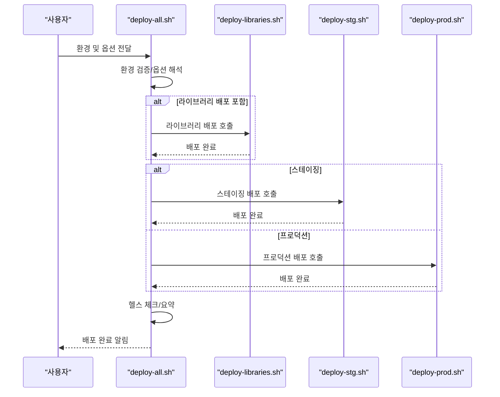
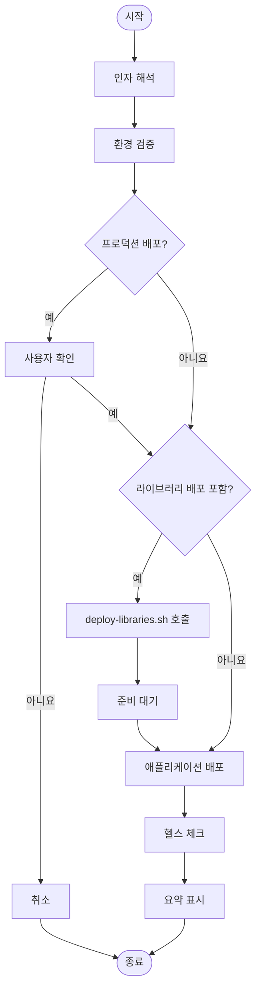
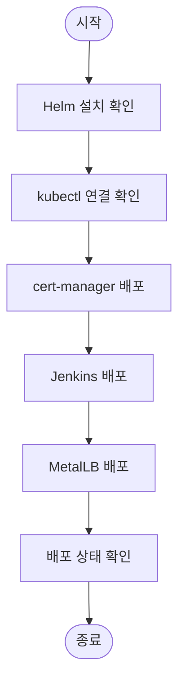
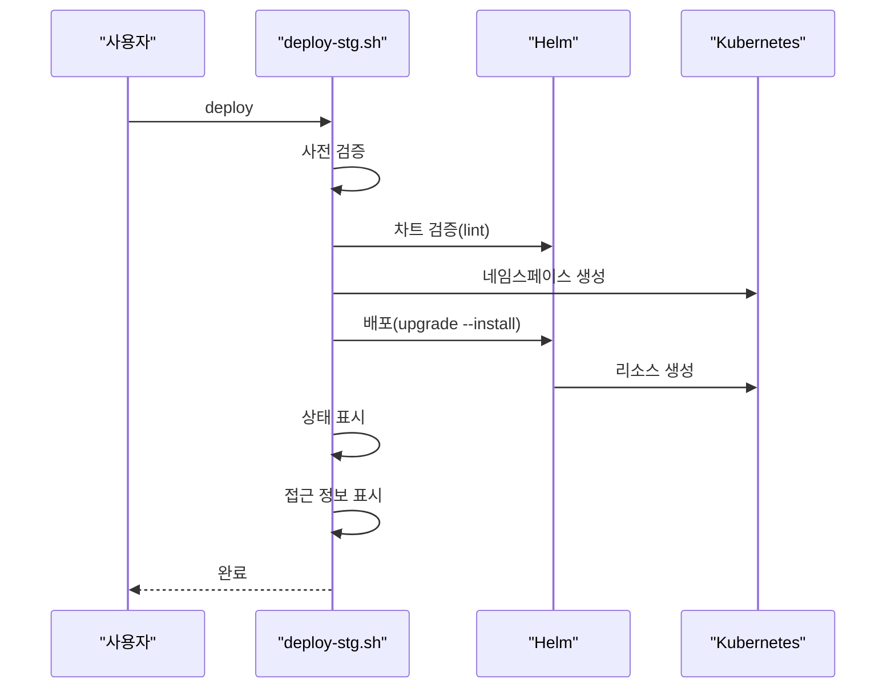
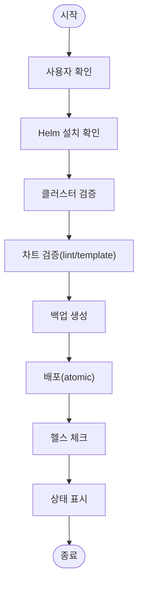
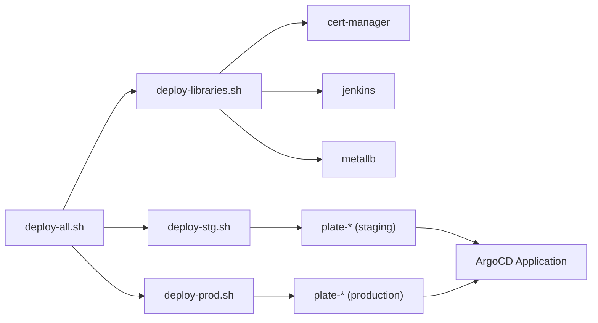

# 주요 진입점

<cite>
**문서에 참조된 파일 목록**
- [deploy-all.sh](file://scripts/deploy-all.sh)
- [deploy-libraries.sh](file://scripts/deploy-libraries.sh)
- [deploy-stg.sh](file://scripts/deploy-stg.sh)
- [deploy-prod.sh](file://scripts/deploy-prod.sh)
- [README.md](file://README.md)
- [app-of-apps.yaml](file://environments/argocd/app-of-apps.yaml)
- [plate-web-stg.yaml](file://environments/argocd/apps/plate-web-stg.yaml)
- [plate-api-stg.yaml](file://environments/argocd/apps/plate-api-stg.yaml)
- [plate-llm-stg.yaml](file://environments/argocd/apps/plate-llm-stg.yaml)
- [plate-cache-stg.yaml](file://environments/argocd/apps/plate-cache-stg.yaml)
- [plate-web Chart.yaml](file://helm/applications/plate-web/Chart.yaml)
- [plate-api Chart.yaml](file://helm/applications/plate-api/Chart.yaml)
- [plate-llm Chart.yaml](file://helm/applications/plate-llm/Chart.yaml)
- [plate-cache Chart.yaml](file://helm/applications/plate-cache/Chart.yaml)
</cite>

## 목차
1. [소개](#소개)
2. [프로젝트 구조](#프로젝트-구조)
3. [핵심 컴포넌트](#핵심-컴포넌트)
4. [아키텍처 개요](#아키텍처-개요)
5. [상세 컴포넌트 분석](#상세-컴포넌트-분석)
6. [의존성 분석](#의존성-분석)
7. [성능 고려사항](#성능-고려사항)
8. [장애 대응 가이드](#장애-대응-가이드)
9. [결론](#결론)
10. [부록](#부록)

## 소개
본 문서는 prj-devops의 주요 배포 진입점 스크립트들에 대해 상세히 설명합니다. 배포 파이프라인은 다음과 같은 4개 스크립트로 구성되며, 각각의 목적, 인자, 내부 동작 원리, 오류 처리 방식을 코드 경로를 중심으로 설명합니다:
- deploy-all.sh: 전체 시스템 배포 오케스트레이터. 내부적으로 deploy-libraries.sh와 환경별 배포 스크립트를 호출합니다.
- deploy-libraries.sh: 클러스터 서비스 및 개발 도구를 배포하는 스크립트. cert-manager, MetalLB, ArgoCD, Harbor, Grafana, Prometheus 등의 순서와 의존성을 설명합니다.
- deploy-stg.sh: 스테이징 환경에 plate-web, plate-api, plate-llm, plate-cache 애플리케이션을 배포하는 스크립트. Helm 차트를 적용하고 상태/접근 정보를 표시합니다.
- deploy-prod.sh: 프로덕션 환경 배포 스크립트. 안전 검사, 백업, 헬스 체크, 롤백 기능을 포함합니다.

## 프로젝트 구조
배포 스크립트들은 scripts/ 디렉터리에 위치하고, ArgoCD Application 정의는 environments/argocd/ 디렉터리에 있습니다. 또한 애플리케이션 Helm 차트는 helm/applications/ 디렉터리에 위치합니다.

**도표 출처**
- [deploy-all.sh](file://scripts/deploy-all.sh#L1-L279)
- [deploy-libraries.sh](file://scripts/deploy-libraries.sh#L1-L128)
- [deploy-stg.sh](file://scripts/deploy-stg.sh#L1-L173)
- [deploy-prod.sh](file://scripts/deploy-prod.sh#L1-L299)
- [app-of-apps.yaml](file://environments/argocd/app-of-apps.yaml#L1-L35)
- [plate-web-stg.yaml](file://environments/argocd/apps/plate-web-stg.yaml#L1-L62)
- [plate-api-stg.yaml](file://environments/argocd/apps/plate-api-stg.yaml#L1-L62)
- [plate-llm-stg.yaml](file://environments/argocd/apps/plate-llm-stg.yaml#L1-L62)
- [plate-cache-stg.yaml](file://environments/argocd/apps/plate-cache-stg.yaml#L1-L51)
- [plate-web Chart.yaml](file://helm/applications/plate-web/Chart.yaml#L1-L17)
- [plate-api Chart.yaml](file://helm/applications/plate-api/Chart.yaml#L1-L16)
- [plate-llm Chart.yaml](file://helm/applications/plate-llm/Chart.yaml#L1-L19)
- [plate-cache Chart.yaml](file://helm/applications/plate-cache/Chart.yaml#L1-L16)

**섹션 출처**
- [README.md](file://README.md#L1-L120)

## 핵심 컴포넌트
- deploy-all.sh: 환경(스테이징/프로덕션)과 옵션(라이브러리 건너뛰기, 라이브러리만 배포, 드라이런)을 받아 전체 배포를 오케스트레이션합니다. 라이브러리 배포 후 애플리케이션 배포를 순차적으로 진행하고, 헬스 체크 및 요약을 수행합니다.
- deploy-libraries.sh: cert-manager, Jenkins, MetalLB를 순차적으로 배포하며, 사전 검증(Helm, kubectl)과 배포 후 상태 확인을 포함합니다.
- deploy-stg.sh: 스테이징 환경에 특정 애플리케이션을 배포하고, 검증, 상태 표시, 접근 정보 표시를 수행합니다.
- deploy-prod.sh: 프로덕션 환경 배포에 안전장치를 강화합니다. 사용자 확인, 클러스터 검증, 차트 검증, 백업, 헬스 체크, 롤백 기능을 포함합니다.

**섹션 출처**
- [deploy-all.sh](file://scripts/deploy-all.sh#L1-L279)
- [deploy-libraries.sh](file://scripts/deploy-libraries.sh#L1-L128)
- [deploy-stg.sh](file://scripts/deploy-stg.sh#L1-L173)
- [deploy-prod.sh](file://scripts/deploy-prod.sh#L1-L299)

## 아키텍처 개요
배포 파이프라인은 다음과 같은 흐름으로 작동합니다:
- deploy-all.sh이 환경과 옵션을 해석하고, deploy-libraries.sh과 환경별 배포 스크립트(deploy-stg.sh 또는 deploy-prod.sh)를 호출합니다.
- deploy-libraries.sh은 cert-manager, Jenkins, MetalLB를 배포하고, 사전 검증을 수행합니다.
- deploy-stg.sh/deploy-prod.sh은 각각 스테이징/프로덕션 환경에 대해 Helm 차트를 검증하고 배포하며, 상태/접근 정보를 표시합니다.
- ArgoCD Application 정의는 GitOps 방식으로 애플리케이션 배포를 자동화하며, app-of-apps.yaml이 하위 Application들을 관리합니다.

**도표 출처**
- [deploy-all.sh](file://scripts/deploy-all.sh#L1-L279)
- [deploy-libraries.sh](file://scripts/deploy-libraries.sh#L1-L128)
- [deploy-stg.sh](file://scripts/deploy-stg.sh#L1-L173)
- [deploy-prod.sh](file://scripts/deploy-prod.sh#L1-L299)

## 상세 컴포넌트 분석

### deploy-all.sh 분석
- 목적: 전체 시스템 배포 오케스트레이션. 환경(스테이징/프로덕션)과 옵션(라이브러리 건너뛰기, 라이브러리만 배포, 드라이런)을 처리하고, 라이브러리 배포 후 애플리케이션 배포를 순차적으로 진행합니다.
- 주요 인자:
  - 환경: staging(default), production
  - 옵션: --skip-libraries, --libraries-only, --dry-run, --help
- 내부 동작:
  - 인자 해석(parse_arguments): 옵션을 파싱하고 DRY_RUN 환경 변수를 설정합니다.
  - 환경 검증(validate_environment): 환경 이름을 표준화합니다.
  - 라이브러리 배포(deploy_libraries): deploy-libraries.sh를 호출합니다.
  - 애플리케이션 배포(deploy_application): 환경에 따라 deploy-stg.sh 또는 deploy-prod.sh를 호출합니다.
  - 헬스 체크(perform_health_check): kubectl 연결 상태와 cert-manager, 애플리케이션 상태를 검사합니다.
  - 요약(show_final_status): 배포 요약과 프로덕션 시 팁을 표시합니다.
- 오류 처리:
  - 존재하지 않는 스크립트나 잘못된 환경에 대해 오류 메시지를 출력하고 종료합니다.
  - 프로덕션 배포 시 사용자 확인 프롬프트를 통해 취소를 허용합니다.
  - 라이브러리 배포 후 일정 시간 대기하여 준비 상태를 기다립니다.

**도표 출처**
- [deploy-all.sh](file://scripts/deploy-all.sh#L1-L279)

**섹션 출처**
- [deploy-all.sh](file://scripts/deploy-all.sh#L1-L279)

### deploy-libraries.sh 분석
- 목적: 클러스터 서비스 및 개발 도구를 배포합니다. cert-manager, Jenkins, MetalLB를 순차적으로 배포하고 사전 검증을 수행합니다.
- 사전 검증:
  - Helm 설치 확인(check_helm)
  - kubectl 연결 상태 확인(check_kubectl)
- 배포 순서:
  - cert-manager: Jetstack 저장소 추가, CRDs 설치, cert-manager 설치, 준비 대기, 설정 적용
  - Jenkins: values.yaml 기반 설치
  - MetalLB: 저장소 추가, 설치, 설정 적용
- 배포 후 상태 확인: 각 네임스페이스의 Pod 상태를 표시합니다.

**도표 출처**
- [deploy-libraries.sh](file://scripts/deploy-libraries.sh#L1-L128)

**섹션 출처**
- [deploy-libraries.sh](file://scripts/deploy-libraries.sh#L1-L128)

### deploy-stg.sh 분석
- 목적: 스테이징 환경에 특정 애플리케이션을 배포하고 검증, 상태 표시, 접근 정보 표시를 수행합니다.
- 주요 인자:
  - deploy(default), status, delete
- 내부 동작:
  - 사전 검증: Helm 설치 확인, kubectl 연결 확인, 차트 검증(helm lint)
  - 네임스페이스 생성(create_namespace): 존재하지 않으면 생성하고 라벨 설정
  - 배포(deploy_app): Helm upgrade --install로 배포하고 대기
  - 상태 표시(show_status): Helm release 상태, Pod/Service/Ingress 목록 표시
  - 접근 정보 표시(show_access_info): Ingress 호스트 기반 URL 표시
- 오류 처리:
  - Chart.yaml 누락 시 오류 출력
  - Helm lint/templating 실패 시 종료

**도표 출처**
- [deploy-stg.sh](file://scripts/deploy-stg.sh#L1-L173)

**섹션 출처**
- [deploy-stg.sh](file://scripts/deploy-stg.sh#L1-L173)

### deploy-prod.sh 분석
- 목적: 프로덕션 환경 배포에 안전장치를 강화합니다. 사용자 확인, 클러스터 검증, 차트 검증, 백업, 헬스 체크, 롤백 기능을 포함합니다.
- 주요 인자:
  - deploy(default), status, rollback [revision], delete
- 안전장치:
  - 사용자 확인(confirm_production_deploy)
  - 클러스터 검증(check_kubectl): 현재 컨텍스트(cluster name) 검증
  - 차트 검증(validate_chart): lint + template 검증
  - 백업(backup_deployment): 현재 values/manifest 백업
  - 헬스 체크(verify_deployment): Pod 준비 상태, 롤아웃 상태 검증
  - 롤백(rollback): helm rollback 지원
- 환경 변수:
  - DRY_RUN: 드라이런 모드
  - SKIP_BACKUP: 백업 건너뛰기

**도표 출처**
- [deploy-prod.sh](file://scripts/deploy-prod.sh#L1-L299)

**섹션 출처**
- [deploy-prod.sh](file://scripts/deploy-prod.sh#L1-L299)

## 의존성 분석
- deploy-all.sh은 deploy-libraries.sh과 deploy-stg.sh/deploy-prod.sh에 직접 의존합니다. 환경에 따라 다른 배포 스크립트를 호출하고, 라이브러리 배포 후 대기 시간을 두고 애플리케이션 배포를 진행합니다.
- deploy-libraries.sh은 cert-manager, Jenkins, MetalLB를 순차적으로 배포하며, 사전 검증을 통해 Helm과 kubectl이 준비되었음을 보장합니다.
- deploy-stg.sh/deploy-prod.sh은 각각 스테이징/프로덕션 환경에 대해 Helm 차트를 검증하고 배포하며, 상태/접근 정보를 표시합니다.
- ArgoCD Application 정의는 GitOps 방식으로 애플리케이션 배포를 자동화합니다. app-of-apps.yaml이 하위 Application들을 관리하고, 각 Application은 환경별 values 파일을 사용하여 Helm 차트를 적용합니다.

**도표 출처**
- [deploy-all.sh](file://scripts/deploy-all.sh#L1-L279)
- [deploy-libraries.sh](file://scripts/deploy-libraries.sh#L1-L128)
- [deploy-stg.sh](file://scripts/deploy-stg.sh#L1-L173)
- [deploy-prod.sh](file://scripts/deploy-prod.sh#L1-L299)
- [app-of-apps.yaml](file://environments/argocd/app-of-apps.yaml#L1-L35)

**섹션 출처**
- [deploy-all.sh](file://scripts/deploy-all.sh#L1-L279)
- [deploy-libraries.sh](file://scripts/deploy-libraries.sh#L1-L128)
- [deploy-stg.sh](file://scripts/deploy-stg.sh#L1-L173)
- [deploy-prod.sh](file://scripts/deploy-prod.sh#L1-L299)
- [app-of-apps.yaml](file://environments/argocd/app-of-apps.yaml#L1-L35)

## 성능 고려사항
- 배포 스크립트는 각 단계별로 사전 검증을 수행하여 불필요한 오류를 조기에 탐지하고, 배포 후 헬스 체크를 통해 안정성을 확보합니다.
- deploy-all.sh은 라이브러리 배포 후 일정 시간 대기를 통해 의존 컴포넌트가 준비되도록 합니다.
- deploy-stg.sh/deploy-prod.sh은 Helm upgrade --install 시 --wait 및 --timeout을 사용하여 배포 완료까지 대기합니다.
- ArgoCD Application은 syncOptions에 CreateNamespace=true, ApplyOutOfSyncOnly=true 등을 사용하여 배포 성능을 최적화합니다.

[이 섹션은 일반적인 성능 논의를 포함하므로 구체적인 파일 분석 없음]

## 장애 대응 가이드
- 인증서 문제: cert-manager Pod 로그 확인, Certificate/Order/Challenge 리소스 상태 점검
- Ingress 문제: DNS 레코드(A/CNAME) 확인, Ingress Controller LB IP 매칭 여부 점검
- Pod 문제: 리소스 부족(CrashLoopBackOff/OOMKilled), 이미지 Pull 오류 확인
- 배포 실패 시 롤백: deploy-prod.sh의 rollback 명령 사용

**섹션 출처**
- [README.md](file://README.md#L335-L355)
- [deploy-prod.sh](file://scripts/deploy-prod.sh#L270-L299)

## 결론
- deploy-all.sh은 환경과 옵션에 따라 라이브러리 배포와 애플리케이션 배포를 오케스트레이션하며, 헬스 체크와 요약을 통해 배포 안정성을 높입니다.
- deploy-libraries.sh은 cert-manager, Jenkins, MetalLB를 순차적으로 배포하고 사전 검증을 통해 준비 상태를 보장합니다.
- deploy-stg.sh/deploy-prod.sh은 각 환경에 맞춘 검증, 상태 표시, 접근 정보 표시를 제공하며, 프로덕션 배포에는 안전장치와 롤백 기능이 포함되어 있습니다.
- ArgoCD Application 정의는 GitOps 방식으로 애플리케이션 배포를 자동화하고, app-of-apps 패턴을 통해 의존 관계를 명확히 관리합니다.

[이 섹션은 요약을 포함하므로 구체적인 파일 분석 없음]

## 부록
- 사용자 정의 및 확장 방법:
  - 새 환경 추가: environments/ 디렉터리에 새 디렉터리를 만들고 환경 전용 values 파일을 작성한 뒤, 스크립트 분기/조건을 추가합니다.
  - 새 애플리케이션 추가: helm/applications/ 이하 새 차트를 생성하고, 환경별 values 파일을 작성한 뒤, 스크립트/ArgoCD Application 정의를 추가합니다.
  - 인프라 수정 절차: helm/cluster-services/ 또는 helm/development-tools/ 내 차트 수정 후 스테이징 검증, 프로덕션 반영 및 추적 기록을 따릅니다.

**섹션 출처**
- [README.md](file://README.md#L315-L334)