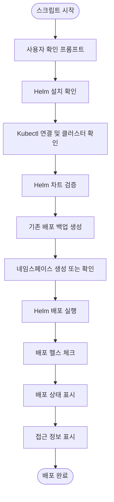
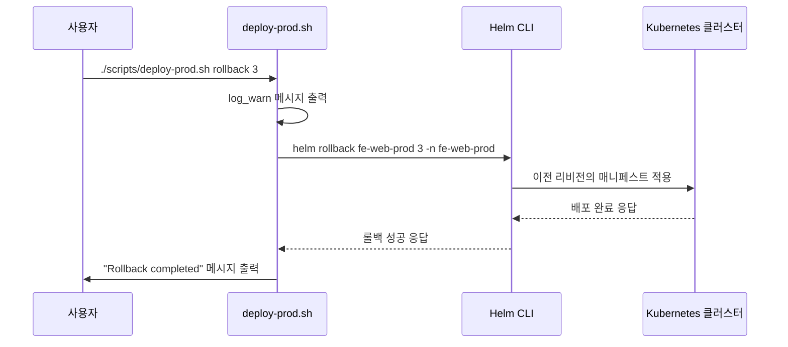
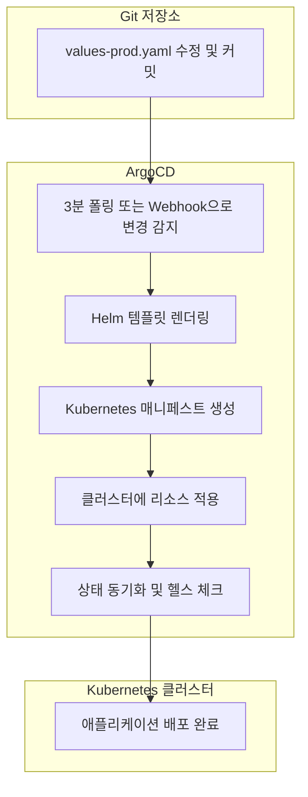

# 프로덕션 환경 배포 (deploy-prod.sh)

<cite>
**이 문서에서 참조한 파일**  
- [deploy-prod.sh](file://scripts/deploy-prod.sh)
- [deploy-stg.sh](file://scripts/deploy-stg.sh)
- [deploy-all.sh](file://scripts/deploy-all.sh)
- [plate-web-prod.yaml](file://environments/argocd/apps/plate-web-prod.yaml)
- [plate-api-prod.yaml](file://environments/argocd/apps/plate-api-prod.yaml)
- [ingress-stg.yaml](file://environments/argocd/apps/ingress-stg.yaml)
- [README.md](file://README.md)
</cite>

## 목차
1. [소개](#소개)
2. [스크립트 구조 및 흐름](#스크립트-구조-및-흐름)
3. [핵심 구성 요소 분석](#핵심-구성-요소-분석)
4. [배포 절차 및 안전 장치](#배포-절차-및-안전-장치)
5. [GitOps 통합 및 ArgoCD 연동](#gitops-통합-및-argocd-연동)
6. [롤백 및 상태 확인](#롤백-및-상태-확인)
7. [결론](#결론)

## 소개

`deploy-prod.sh` 스크립트는 프로덕션 환경에 애플리케이션을 안전하게 배포하기 위한 핵심 도구입니다. 이 스크립트는 스테이징 환경과 유사한 구조를 가지되, 프로덕션 환경의 엄격한 보안 및 안정성 요구사항을 반영하여 추가적인 검증 단계와 보호 장치를 포함하고 있습니다. 특히 사용자 확인, 클러스터 연결 검증, 차트 검증, 백업 생성, 헬스 체크 등 다중 안전 장치를 통해 오배포를 방지하고, 문제가 발생할 경우 신속한 복구가 가능하도록 설계되었습니다. 또한 이 스크립트는 ArgoCD 기반의 GitOps 워크플로우와 통합되어 변경 사항이 Git 저장소에 커밋된 후에만 적용되며, 이로 인해 감사 추적성과 재현 가능성이 보장됩니다.

**Section sources**
- [README.md](file://README.md#L265-L274)

## 스크립트 구조 및 흐름

`deploy-prod.sh` 스크립트는 모듈화된 함수 구조를 가지며, 각 단계별로 명확한 책임을 분리하고 있습니다. 주요 구성 요소로는 로깅 유틸리티, 전처리 검사, 배포 실행, 상태 확인 및 접근 정보 표시 기능이 포함됩니다. 스크립트는 `main` 함수에서 시작하여 안전 확인, 헬름 및 쿠버네티스 연결 검증, 차트 검증, 백업 생성, 네임스페이스 생성, 애플리케이션 배포, 헬스 체크, 상태 및 접근 정보 표시 순서로 진행됩니다. 이 구조는 코드의 가독성과 유지보수성을 높이며, 각 단계의 실패 시 스크립트는 즉시 중단되어 안정적인 배포를 보장합니다.

**Diagram sources**
- [deploy-prod.sh](file://scripts/deploy-prod.sh#L243-L267)

**Section sources**
- [deploy-prod.sh](file://scripts/deploy-prod.sh#L1-L299)

## 핵심 구성 요소 분석

### 안전 확인 및 전처리 검사

`deploy-prod.sh` 스크립트의 핵심은 프로덕션 환경에 대한 오배포를 방지하기 위한 다중 안전 장치입니다. `confirm_production_deploy` 함수는 사용자에게 명시적인 확인을 요구하며, `check_kubectl` 함수는 현재 연결된 클러스터 이름에 'prod' 또는 'production'이 포함되어 있는지 확인하여 잘못된 클러스터에 배포되는 것을 방지합니다. 또한 `validate_chart` 함수는 `helm lint`와 `helm template` 명령어를 사용하여 Helm 차트의 구문 오류와 렌더링 오류를 사전에 검출합니다. 이러한 전처리 검사는 실제 배포 전에 잠재적인 문제를 식별하여 프로덕션 환경의 안정성을 보장합니다.

**Section sources**
- [deploy-prod.sh](file://scripts/deploy-prod.sh#L43-L95)
- [deploy-prod.sh](file://scripts/deploy-prod.sh#L97-L116)

### 백업 및 롤백 메커니즘

스크립트는 `backup_deployment` 함수를 통해 배포 전에 현재 릴리스의 값을 `helm get values` 명령어로, 매니페스트는 `helm get manifest` 명령어로 백업 디렉터리에 저장합니다. 이 백업은 `rollback` 명령어를 통해 이전 상태로 되돌리는 데 사용됩니다. `deploy-prod.sh` 스크립트는 `helm rollback` 명령어를 직접 호출하여 지정된 리비전으로 롤백할 수 있도록 지원합니다. 이 메커니즘은 배포 후 문제가 발생할 경우 신속하게 이전 안정 상태로 복구할 수 있는 안전망을 제공합니다.

**Diagram sources**
- [deploy-prod.sh](file://scripts/deploy-prod.sh#L118-L137)
- [deploy-prod.sh](file://scripts/deploy-prod.sh#L277-L282)

**Section sources**
- [deploy-prod.sh](file://scripts/deploy-prod.sh#L118-L137)
- [deploy-prod.sh](file://scripts/deploy-prod.sh#L277-L282)

## 배포 절차 및 안전 장치

`deploy-prod.sh` 스크립트는 `main` 함수에서 정의된 일련의 절차를 통해 안전한 배포를 수행합니다. 먼저 `confirm_production_deploy` 함수가 실행되어 사용자의 명시적인 동의를 받습니다. 이후 `check_helm`, `check_kubectl`, `validate_chart` 함수를 통해 배포 환경과 Helm 차트의 무결성을 검증합니다. 검증이 완료되면 `backup_deployment` 함수가 현재 배포 상태를 백업하고, `create_namespace` 함수가 네임스페이스를 생성하거나 확인합니다. 최종적으로 `deploy_app` 함수가 `helm upgrade --install` 명령어를 실행하여 애플리케이션을 배포하며, `--atomic` 플래그를 통해 배포 실패 시 자동 롤백이 발생합니다. 배포 후 `verify_deployment` 함수가 포드의 준비 상태와 롤아웃 상태를 확인하여 성공적인 배포를 검증합니다.

**Section sources**
- [deploy-prod.sh](file://scripts/deploy-prod.sh#L243-L267)

## GitOps 통합 및 ArgoCD 연동

`deploy-prod.sh` 스크립트는 단일 배포를 위한 도구이지만, 전체 배포 워크플로우는 ArgoCD를 기반으로 한 GitOps 원칙에 따라 운영됩니다. `environments/argocd/apps/` 디렉터리에 위치한 `plate-web-prod.yaml`과 같은 ArgoCD Application 매니페스트는 `syncPolicy.automated.selfHeal: true` 설정을 통해 Git 저장소의 상태와 클러스터의 상태를 자동으로 동기화합니다. 이는 수동으로 `deploy-prod.sh`을 실행하지 않더라도, Git에 values 파일의 변경이 커밋되면 ArgoCD가 자동으로 변경 사항을 감지하고 클러스터에 적용함을 의미합니다. `deploy-prod.sh`은 이 GitOps 워크플로우의 검증 및 수동 오버라이드를 위한 보조 도구로, 변경 사항이 Git에 커밋된 후에만 적용되는 원칙을 보장합니다.

**Diagram sources**
- [plate-web-prod.yaml](file://environments/argocd/apps/plate-web-prod.yaml#L31-L37)
- [README.md](file://README.md#L131-L135)

**Section sources**
- [plate-web-prod.yaml](file://environments/argocd/apps/plate-web-prod.yaml#L31-L37)
- [README.md](file://README.md#L131-L135)

## 롤백 및 상태 확인

`deploy-prod.sh` 스크립트는 `rollback` 명령어를 통해 이전 배포로 되돌리는 기능을 제공합니다. 사용자는 `./scripts/deploy-prod.sh rollback [revision]` 명령어를 사용하여 특정 리비전으로 롤백할 수 있습니다. 또한 `status` 명령어를 통해 현재 배포 상태를 확인할 수 있으며, 이는 `helm status` 명령어를 호출하여 릴리스 정보를 표시하고, `kubectl get pods`, `kubectl get svc`, `kubectl get ingress` 명령어를 통해 관련 리소스의 상태를 출력합니다. `show_access_info` 함수는 Ingress 리소스에서 호스트 정보를 추출하여 사용자가 애플리케이션에 접근할 수 있는 URL을 제공합니다. 이러한 기능들은 배포 후 운영 상태를 모니터링하고 문제를 진단하는 데 필수적입니다.

**Section sources**
- [deploy-prod.sh](file://scripts/deploy-prod.sh#L270-L282)
- [deploy-prod.sh](file://scripts/deploy-prod.sh#L192-L240)

## 결론

`deploy-prod.sh` 스크립트는 프로덕션 환경에 대한 안전한 배포를 보장하기 위해 설계된 포괄적인 도구입니다. 사용자 확인, 환경 검증, 차트 검증, 자동 백업, 헬스 체크 등 다층적인 안전 장치를 통해 오배포의 위험을 최소화합니다. 동시에, 이 스크립트는 ArgoCD 기반의 GitOps 워크플로우와 긴밀하게 통합되어 있으며, 변경 사항이 Git 저장소에 커밋된 후에만 적용되는 원칙을 따릅니다. 이는 감사 추적성과 재현 가능성을 보장하며, 인프라 및 애플리케이션 구성의 전체 이력을 Git을 통해 관리할 수 있게 합니다. `deploy-prod.sh`은 단순한 배포 스크립트를 넘어, 안정성, 보안성, 추적성을 갖춘 현대적인 DevOps 실천의 핵심 구성 요소입니다.