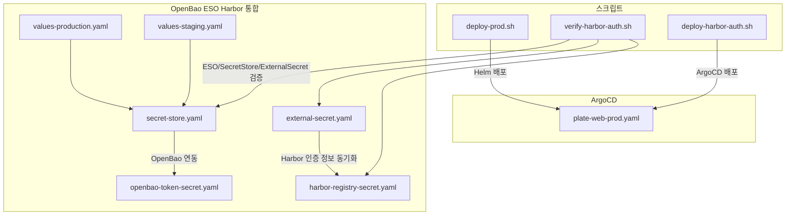
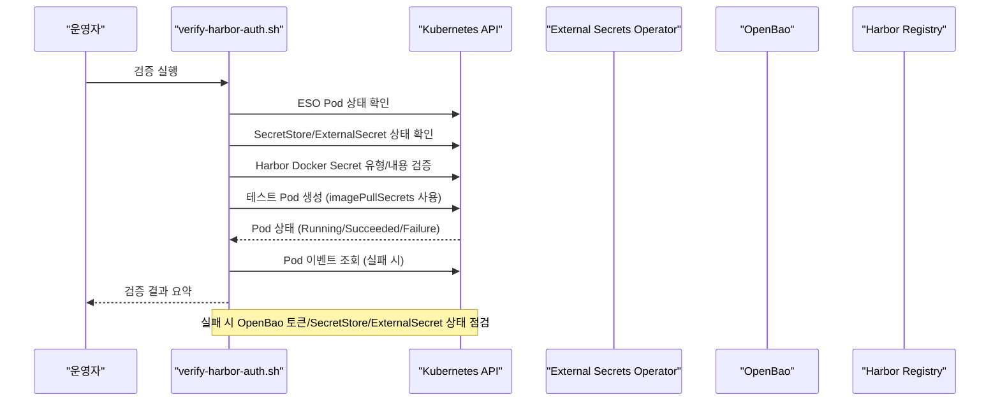
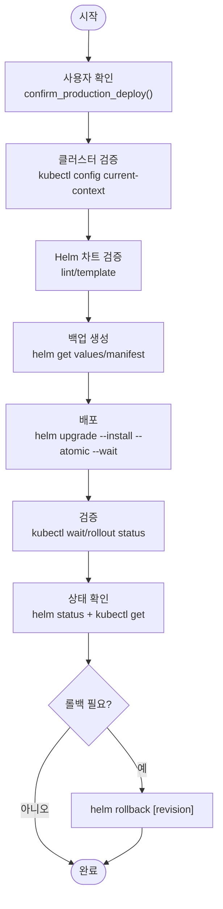
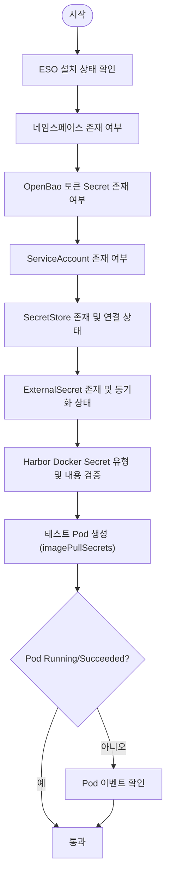
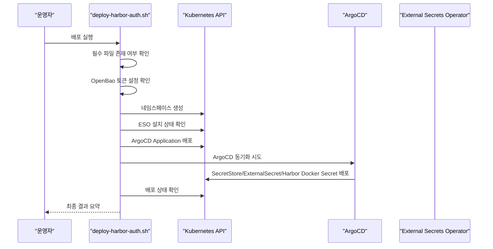
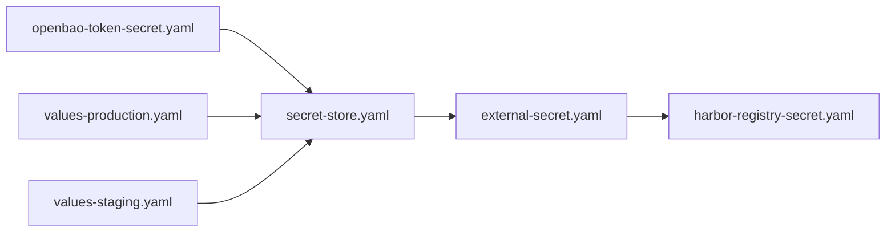

# 문제 해결

<cite>
**문서에서 참조하는 파일**
- [scripts/deploy-prod.sh](file://scripts/deploy-prod.sh)
- [scripts/verify-harbor-auth.sh](file://scripts/verify-harbor-auth.sh)
- [scripts/deploy-harbor-auth.sh](file://scripts/deploy-harbor-auth.sh)
- [environments/argocd/apps/plate-web-prod.yaml](file://environments/argocd/apps/plate-web-prod.yaml)
- [helm/shared-configs/openbao-secrets-manager/values-production.yaml](file://helm/shared-configs/openbao-secrets-manager/values-production.yaml)
- [helm/shared-configs/openbao-secrets-manager/values-staging.yaml](file://helm/shared-configs/openbao-secrets-manager/values-staging.yaml)
- [helm/shared-configs/openbao-secrets-manager/templates/harbor-registry-secret.yaml](file://helm/shared-configs/openbao-secrets-manager/templates/harbor-registry-secret.yaml)
- [helm/shared-configs/openbao-secrets-manager/templates/secret-store.yaml](file://helm/shared-configs/openbao-secrets-manager/templates/secret-store.yaml)
- [helm/shared-configs/openbao-secrets-manager/templates/external-secret.yaml](file://helm/shared-configs/openbao-secrets-manager/templates/external-secret.yaml)
- [helm/shared-configs/openbao-secrets-manager/templates/openbao-token-secret.yaml](file://helm/shared-configs/openbao-secrets-manager/templates/openbao-token-secret.yaml)
</cite>

## 목차
1. [소개](#소개)
2. [프로젝트 구조](#프로젝트-구조)
3. [핵심 구성 요소](#핵심-구성-요소)
4. [아키텍처 개요](#아키텍처-개요)
5. [상세 구성 요소 분석](#상세-구성-요소-분석)
6. [의존성 분석](#의존성-분석)
7. [성능 고려사항](#성능-고려사항)
8. [장애 진단 가이드](#장애-진단-가이드)
9. [결론](#결론)

## 소개
이 섹션은 프로덕션 배포 시 발생할 수 있는 일반적인 문제와 그 해결 방법을 다룹니다. 포괄적인 안전 절차(사용자 확인, 클러스터 이름 검증), 롤백 절차(helm rollback 사용), Harbor 인증 문제 발생 시 image pull 실패 진단(verify-harbor-auth.sh 기반 테스트 Pod 생성 및 이벤트 확인), ArgoCD 동기화 실패 시 Git 저장소 접근 권한 및 Secret 설정 점검 방법을 포함합니다. 실제 코드 예시는 deploy-prod.sh의 confirm_production_deploy 및 rollback 기능, verify-harbor-auth.sh의 테스트 Pod 생성 로직을 참조하며, 문제 해결을 위한 명령어 예시(kubectl describe pod, helm status 등)를 제공합니다.

## 프로젝트 구조
- 배포 스크립트: 프로덕션 배포, Harbor 인증 검증, Harbor 인증 ESO 리소스 배포
- ArgoCD Application: 프로덕션/스테이징 애플리케이션 정의
- OpenBao + ESO + Harbor 통합: ExternalSecrets를 통한 Harbor 인증 정보 관리
- Helm 차트: OpenBao Secrets Manager를 통한 SecretStore/ExternalSecret/Token Secret 관리

**도표 출처**
- [scripts/deploy-prod.sh](file://scripts/deploy-prod.sh#L43-L67)
- [scripts/verify-harbor-auth.sh](file://scripts/verify-harbor-auth.sh#L143-L189)
- [scripts/deploy-harbor-auth.sh](file://scripts/deploy-harbor-auth.sh#L101-L141)
- [environments/argocd/apps/plate-web-prod.yaml](file://environments/argocd/apps/plate-web-prod.yaml#L13-L31)
- [helm/shared-configs/openbao-secrets-manager/templates/secret-store.yaml](file://helm/shared-configs/openbao-secrets-manager/templates/secret-store.yaml#L1-L29)
- [helm/shared-configs/openbao-secrets-manager/templates/external-secret.yaml](file://helm/shared-configs/openbao-secrets-manager/templates/external-secret.yaml#L1-L49)
- [helm/shared-configs/openbao-secrets-manager/templates/harbor-registry-secret.yaml](file://helm/shared-configs/openbao-secrets-manager/templates/harbor-registry-secret.yaml#L1-L77)
- [helm/shared-configs/openbao-secrets-manager/templates/openbao-token-secret.yaml](file://helm/shared-configs/openbao-secrets-manager/templates/openbao-token-secret.yaml#L1-L26)
- [helm/shared-configs/openbao-secrets-manager/values-production.yaml](file://helm/shared-configs/openbao-secrets-manager/values-production.yaml#L1-L195)
- [helm/shared-configs/openbao-secrets-manager/values-staging.yaml](file://helm/shared-configs/openbao-secrets-manager/values-staging.yaml#L1-L164)

**섹션 출처**
- [scripts/deploy-prod.sh](file://scripts/deploy-prod.sh#L43-L67)
- [scripts/verify-harbor-auth.sh](file://scripts/verify-harbor-auth.sh#L143-L189)
- [scripts/deploy-harbor-auth.sh](file://scripts/deploy-harbor-auth.sh#L101-L141)
- [environments/argocd/apps/plate-web-prod.yaml](file://environments/argocd/apps/plate-web-prod.yaml#L13-L31)
- [helm/shared-configs/openbao-secrets-manager/templates/secret-store.yaml](file://helm/shared-configs/openbao-secrets-manager/templates/secret-store.yaml#L1-L29)
- [helm/shared-configs/openbao-secrets-manager/templates/external-secret.yaml](file://helm/shared-configs/openbao-secrets-manager/templates/external-secret.yaml#L1-L49)
- [helm/shared-configs/openbao-secrets-manager/templates/harbor-registry-secret.yaml](file://helm/shared-configs/openbao-secrets-manager/templates/harbor-registry-secret.yaml#L1-L77)
- [helm/shared-configs/openbao-secrets-manager/templates/openbao-token-secret.yaml](file://helm/shared-configs/openbao-secrets-manager/templates/openbao-token-secret.yaml#L1-L26)
- [helm/shared-configs/openbao-secrets-manager/values-production.yaml](file://helm/shared-configs/openbao-secrets-manager/values-production.yaml#L1-L195)
- [helm/shared-configs/openbao-secrets-manager/values-staging.yaml](file://helm/shared-configs/openbao-secrets-manager/values-staging.yaml#L1-L164)

## 핵심 구성 요소
- 프로덕션 배포 스크립트: 사용자 확인, 클러스터 검증, Helm 차트 검증, 백업, 배포, 검증, 상태 확인, 롤백 명령어 포함
- Harbor 인증 검증 스크립트: ESO 설치 상태, SecretStore/ExternalSecret 상태, Harbor Docker Secret 유형 및 내용 검증, 테스트 Pod를 통한 image pull 검증
- Harbor 인증 ESO 리소스 배포 스크립트: ArgoCD를 통한 OpenBao 토큰, SecretStore, ExternalSecret, Harbor Docker Secret 배포 및 상태 확인
- ArgoCD Application: 프로덕션 애플리케이션 정의, 자동 동기화, Self Heal, Retry 정책, Revision History Limit 설정
- OpenBao Secrets Manager Helm 템플릿: SecretStore, ExternalSecret, Harbor Docker Secret, OpenBao Token Secret 관리

**섹션 출처**
- [scripts/deploy-prod.sh](file://scripts/deploy-prod.sh#L43-L67)
- [scripts/verify-harbor-auth.sh](file://scripts/verify-harbor-auth.sh#L143-L189)
- [scripts/deploy-harbor-auth.sh](file://scripts/deploy-harbor-auth.sh#L101-L141)
- [environments/argocd/apps/plate-web-prod.yaml](file://environments/argocd/apps/plate-web-prod.yaml#L31-L61)
- [helm/shared-configs/openbao-secrets-manager/templates/secret-store.yaml](file://helm/shared-configs/openbao-secrets-manager/templates/secret-store.yaml#L1-L29)
- [helm/shared-configs/openbao-secrets-manager/templates/external-secret.yaml](file://helm/shared-configs/openbao-secrets-manager/templates/external-secret.yaml#L1-L49)
- [helm/shared-configs/openbao-secrets-manager/templates/harbor-registry-secret.yaml](file://helm/shared-configs/openbao-secrets-manager/templates/harbor-registry-secret.yaml#L1-L77)
- [helm/shared-configs/openbao-secrets-manager/templates/openbao-token-secret.yaml](file://helm/shared-configs/openbao-secrets-manager/templates/openbao-token-secret.yaml#L1-L26)

## 아키텍처 개요
Harbor 인증 문제 진단 흐름은 다음과 같습니다:
- ESO 설치 상태 확인
- SecretStore 연결 상태 확인
- ExternalSecret 동기화 상태 확인
- Harbor Docker Secret 유형 및 내용 검증
- 테스트 Pod 생성을 통한 image pull 검증
- 실패 시 Pod 이벤트 확인

**도표 출처**
- [scripts/verify-harbor-auth.sh](file://scripts/verify-harbor-auth.sh#L40-L189)
- [helm/shared-configs/openbao-secrets-manager/templates/secret-store.yaml](file://helm/shared-configs/openbao-secrets-manager/templates/secret-store.yaml#L1-L29)
- [helm/shared-configs/openbao-secrets-manager/templates/external-secret.yaml](file://helm/shared-configs/openbao-secrets-manager/templates/external-secret.yaml#L1-L49)
- [helm/shared-configs/openbao-secrets-manager/templates/harbor-registry-secret.yaml](file://helm/shared-configs/openbao-secrets-manager/templates/harbor-registry-secret.yaml#L1-L77)
- [helm/shared-configs/openbao-secrets-manager/templates/openbao-token-secret.yaml](file://helm/shared-configs/openbao-secrets-manager/templates/openbao-token-secret.yaml#L1-L26)

## 상세 구성 요소 분석

### 프로덕션 배포 안전 절차 및 롤백 절차
- 사용자 확인: confirm_production_deploy 함수에서 사용자에게 프로덕션 배포 경고를 표시하고, 'yes' 입력을 요구합니다. DRY_RUN 모드에서는 실제 변경 없이 dry-run만 수행됩니다.
- 클러스터 검증: kubectl config current-context를 통해 현재 연결된 클러스터 이름을 확인하고, prod 또는 production을 포함하지 않으면 추가 확인을 요구합니다.
- Helm 차트 검증: Chart.yaml 존재 여부, helm lint, helm template 검증을 통해 차트 무결성을 확인합니다.
- 백업: helm get values/manifest를 이용해 현재 배포 상태를 백업 디렉토리에 저장합니다.
- 배포: --atomic 옵션을 사용하여 실패 시 자동 롤백되도록 하며, --wait/--timeout을 통해 배포 완료까지 대기합니다.
- 검증: kubectl wait/rollout status를 통해 Pod 준비 상태와 롤아웃 상태를 검증합니다.
- 상태 확인: helm status, kubectl get pods/svc/ingress/hpa를 통해 배포 상태를 요약합니다.
- 롤백: ./deploy-prod.sh rollback [revision] 명령어를 통해 지정된 revision으로 롤백합니다.

**도표 출처**
- [scripts/deploy-prod.sh](file://scripts/deploy-prod.sh#L43-L67)
- [scripts/deploy-prod.sh](file://scripts/deploy-prod.sh#L84-L95)
- [scripts/deploy-prod.sh](file://scripts/deploy-prod.sh#L107-L116)
- [scripts/deploy-prod.sh](file://scripts/deploy-prod.sh#L127-L137)
- [scripts/deploy-prod.sh](file://scripts/deploy-prod.sh#L148-L173)
- [scripts/deploy-prod.sh](file://scripts/deploy-prod.sh#L175-L219)
- [scripts/deploy-prod.sh](file://scripts/deploy-prod.sh#L276-L287)

**섹션 출처**
- [scripts/deploy-prod.sh](file://scripts/deploy-prod.sh#L43-L67)
- [scripts/deploy-prod.sh](file://scripts/deploy-prod.sh#L84-L95)
- [scripts/deploy-prod.sh](file://scripts/deploy-prod.sh#L107-L116)
- [scripts/deploy-prod.sh](file://scripts/deploy-prod.sh#L127-L137)
- [scripts/deploy-prod.sh](file://scripts/deploy-prod.sh#L148-L173)
- [scripts/deploy-prod.sh](file://scripts/deploy-prod.sh#L175-L219)
- [scripts/deploy-prod.sh](file://scripts/deploy-prod.sh#L276-L287)

### Harbor 인증 문제 진단 (verify-harbor-auth.sh)
- ESO 설치 상태: external-secrets-system 네임스페이스에 있는 ESO Pod 상태를 확인합니다.
- 네임스페이스별 검증: plate-stg/plate-prod 각각 존재 여부 확인
- OpenBao 토큰 Secret: openbao-token 존재 여부 확인
- ServiceAccount: harbor-secret-reader 존재 여부 확인
- SecretStore: openbao-harbor 존재 여부 및 연결 상태 확인
- ExternalSecret: harbor-registry-secret 존재 여부 및 동기화 상태 확인
- Harbor Docker Secret: harbor-docker-secret 유형(kubernetes.io/dockerconfigjson) 및 Harbor URL 포함 여부 검증
- 테스트 Pod: plate-stg 네임스페이스에 imagePullSecrets를 사용해 테스트 Pod 생성 후 Running/Succeeded 여부 확인
- 실패 시 Pod 이벤트: kubectl describe pod로 이벤트를 분석하여 실패 원인 파악

**도표 출처**
- [scripts/verify-harbor-auth.sh](file://scripts/verify-harbor-auth.sh#L40-L189)

**섹션 출처**
- [scripts/verify-harbor-auth.sh](file://scripts/verify-harbor-auth.sh#L40-L189)

### Harbor 인증 ESO 리소스 배포 (deploy-harbor-auth.sh + ArgoCD)
- 필수 파일 확인: openbao-token-secret.yaml, secret-store.yaml, external-secret.yaml, serviceaccount.yaml 존재 여부
- OpenBao 토큰 설정 확인: REPLACE 문자열이 남아 있지 않은지 확인
- 네임스페이스 생성: plate-stg/plate-prod 존재 여부 확인 및 생성
- ESO 설치 확인: external-secrets-system 존재 여부 및 Pod 상태 확인
- ArgoCD Application 배포: harbor-auth-eso Application YAML 배포
- ArgoCD 동기화: argocd app sync 또는 자동 동기화 대기
- 배포 상태 확인: SecretStore/ExternalSecret/Harbor Docker Secret 상태 확인

**도표 출처**
- [scripts/deploy-harbor-auth.sh](file://scripts/deploy-harbor-auth.sh#L26-L141)
- [scripts/deploy-harbor-auth.sh](file://scripts/deploy-harbor-auth.sh#L144-L194)

**섹션 출처**
- [scripts/deploy-harbor-auth.sh](file://scripts/deploy-harbor-auth.sh#L26-L141)
- [scripts/deploy-harbor-auth.sh](file://scripts/deploy-harbor-auth.sh#L144-L194)

### ArgoCD 동기화 실패 시 Git 접근 권한 및 Secret 설정 점검
- Git 저장소 접근 권한: Application spec.source.repoURL이 올바른지, branch/revision 설정이 적절한지 확인
- Secret 설정: SecretStore/ExternalSecret에 대한 OpenBao 토큰 Secret이 올바르게 설정되어 있는지 확인
- 동기화 정책: automated/prune/selfHeal/retry 설정이 적절한지 확인
- Revision History Limit: 롤백 가능한 리비전 수를 고려한 설정

**섹션 출처**
- [environments/argocd/apps/plate-web-prod.yaml](file://environments/argocd/apps/plate-web-prod.yaml#L17-L31)
- [environments/argocd/apps/plate-web-prod.yaml](file://environments/argocd/apps/plate-web-prod.yaml#L31-L61)
- [helm/shared-configs/openbao-secrets-manager/templates/secret-store.yaml](file://helm/shared-configs/openbao-secrets-manager/templates/secret-store.yaml#L1-L29)
- [helm/shared-configs/openbao-secrets-manager/templates/openbao-token-secret.yaml](file://helm/shared-configs/openbao-secrets-manager/templates/openbao-token-secret.yaml#L1-L26)

## 의존성 분석
- OpenBao Secrets Manager 템플릿 의존성
  - SecretStore는 OpenBao 서버 정보와 OpenBao Token Secret을 참조합니다.
  - ExternalSecret는 SecretStore를 참조하고 Harbor 인증 정보(remoteRef)를 가져와 Harbor Docker Secret을 동기화합니다.
  - Harbor Docker Secret은 .dockerconfigjson 유형이며, registry/username/password를 템플릿 데이터로 구성합니다.

**도표 출처**
- [helm/shared-configs/openbao-secrets-manager/templates/openbao-token-secret.yaml](file://helm/shared-configs/openbao-secrets-manager/templates/openbao-token-secret.yaml#L1-L26)
- [helm/shared-configs/openbao-secrets-manager/templates/secret-store.yaml](file://helm/shared-configs/openbao-secrets-manager/templates/secret-store.yaml#L1-L29)
- [helm/shared-configs/openbao-secrets-manager/templates/external-secret.yaml](file://helm/shared-configs/openbao-secrets-manager/templates/external-secret.yaml#L1-L49)
- [helm/shared-configs/openbao-secrets-manager/templates/harbor-registry-secret.yaml](file://helm/shared-configs/openbao-secrets-manager/templates/harbor-registry-secret.yaml#L1-L77)
- [helm/shared-configs/openbao-secrets-manager/values-production.yaml](file://helm/shared-configs/openbao-secrets-manager/values-production.yaml#L1-L195)
- [helm/shared-configs/openbao-secrets-manager/values-staging.yaml](file://helm/shared-configs/openbao-secrets-manager/values-staging.yaml#L1-L164)

**섹션 출처**
- [helm/shared-configs/openbao-secrets-manager/templates/openbao-token-secret.yaml](file://helm/shared-configs/openbao-secrets-manager/templates/openbao-token-secret.yaml#L1-L26)
- [helm/shared-configs/openbao-secrets-manager/templates/secret-store.yaml](file://helm/shared-configs/openbao-secrets-manager/templates/secret-store.yaml#L1-L29)
- [helm/shared-configs/openbao-secrets-manager/templates/external-secret.yaml](file://helm/shared-configs/openbao-secrets-manager/templates/external-secret.yaml#L1-L49)
- [helm/shared-configs/openbao-secrets-manager/templates/harbor-registry-secret.yaml](file://helm/shared-configs/openbao-secrets-manager/templates/harbor-registry-secret.yaml#L1-L77)
- [helm/shared-configs/openbao-secrets-manager/values-production.yaml](file://helm/shared-configs/openbao-secrets-manager/values-production.yaml#L1-L195)
- [helm/shared-configs/openbao-secrets-manager/values-staging.yaml](file://helm/shared-configs/openbao-secrets-manager/values-staging.yaml#L1-L164)

## 성능 고려사항
- ArgoCD 동기화 정책: automated/selfHeal/retry 설정은 동기화 성공률과 지연 시간에 영향을 미칩니다. Production에서는 보수적인 retry 설정이 권장됩니다.
- Revision History Limit: 롤백 가능한 리비전 수를 조절하여 리소스 사용량과 성능을 균형 있게 관리합니다.
- ESO Refresh Interval: ExternalSecret의 refreshInterval은 OpenBao에 대한 요청 빈도를 조절하여 성능에 영향을 줄 수 있습니다.

[이 섹션은 일반적인 성능 논의를 포함하므로 특정 파일 분석 없음]

## 장애 진단 가이드

### 프로덕션 배포 시 안전 절차
- 사용자 확인: confirm_production_deploy 함수를 통해 사용자가 프로덕션 배포를 의도적으로 진행하는지 확인합니다.
- 클러스터 검증: kubectl config current-context를 통해 prod 또는 production을 포함하는지 확인하고, 그렇지 않으면 추가 확인을 요구합니다.
- Helm 차트 검증: Chart.yaml 존재 여부, helm lint, helm template 검증을 통해 차트 무결성을 확인합니다.
- 백업: helm get values/manifest를 이용해 현재 배포 상태를 백업 디렉토리에 저장합니다.
- 배포: --atomic 옵션을 사용하여 실패 시 자동 롤백되도록 하며, --wait/--timeout을 통해 배포 완료까지 대기합니다.
- 검증: kubectl wait/rollout status를 통해 Pod 준비 상태와 롤아웃 상태를 검증합니다.
- 상태 확인: helm status, kubectl get pods/svc/ingress/hpa를 통해 배포 상태를 요약합니다.
- 롤백: ./deploy-prod.sh rollback [revision] 명령어를 통해 지정된 revision으로 롤백합니다.

**섹션 출처**
- [scripts/deploy-prod.sh](file://scripts/deploy-prod.sh#L43-L67)
- [scripts/deploy-prod.sh](file://scripts/deploy-prod.sh#L84-L95)
- [scripts/deploy-prod.sh](file://scripts/deploy-prod.sh#L107-L116)
- [scripts/deploy-prod.sh](file://scripts/deploy-prod.sh#L127-L137)
- [scripts/deploy-prod.sh](file://scripts/deploy-prod.sh#L148-L173)
- [scripts/deploy-prod.sh](file://scripts/deploy-prod.sh#L175-L219)
- [scripts/deploy-prod.sh](file://scripts/deploy-prod.sh#L276-L287)

### Harbor 인증 문제 발생 시 image pull 실패 진단
- ESO 설치 상태 확인: external-secrets-system 네임스페이스에 있는 ESO Pod 상태를 확인합니다.
- SecretStore 연결 상태 확인: SecretStore의 conditions 상태가 True인지 확인합니다.
- ExternalSecret 동기화 상태 확인: ExternalSecret의 conditions 상태가 True인지 확인합니다.
- Harbor Docker Secret 유형 및 내용 검증: Harbor Docker Secret이 kubernetes.io/dockerconfigjson 유형인지, Harbor URL이 포함되는지 확인합니다.
- 테스트 Pod 생성 및 image pull 검증: plate-stg 네임스페이스에 imagePullSecrets를 사용해 테스트 Pod를 생성하고 Running/Succeeded 여부를 확인합니다.
- 실패 시 Pod 이벤트 확인: kubectl describe pod로 이벤트를 분석하여 실패 원인 파악합니다.

**섹션 출처**
- [scripts/verify-harbor-auth.sh](file://scripts/verify-harbor-auth.sh#L40-L189)

### ArgoCD 동기화 실패 시 Git 저장소 접근 권한 및 Secret 설정 점검
- Git 저장소 접근 권한: Application spec.source.repoURL이 올바른지, branch/revision 설정이 적절한지 확인합니다.
- Secret 설정: SecretStore/ExternalSecret에 대한 OpenBao 토큰 Secret이 올바르게 설정되어 있는지 확인합니다.
- 동기화 정책: automated/prune/selfHeal/retry 설정이 적절한지 확인합니다.
- Revision History Limit: 롤백 가능한 리비전 수를 고려한 설정입니다.

**섹션 출처**
- [environments/argocd/apps/plate-web-prod.yaml](file://environments/argocd/apps/plate-web-prod.yaml#L17-L31)
- [environments/argocd/apps/plate-web-prod.yaml](file://environments/argocd/apps/plate-web-prod.yaml#L31-L61)
- [helm/shared-configs/openbao-secrets-manager/templates/secret-store.yaml](file://helm/shared-configs/openbao-secrets-manager/templates/secret-store.yaml#L1-L29)
- [helm/shared-configs/openbao-secrets-manager/templates/openbao-token-secret.yaml](file://helm/shared-configs/openbao-secrets-manager/templates/openbao-token-secret.yaml#L1-L26)

## 결론
- 프로덕션 배포는 사용자 확인, 클러스터 검증, Helm 차트 검증, 백업, 배포, 검증, 상태 확인, 롤백 절차를 포함해야 합니다.
- Harbor 인증 문제 진단은 ESO 설치 상태, SecretStore/ExternalSecret 상태, Harbor Docker Secret 유형 및 내용, 테스트 Pod를 통한 image pull 검증, 실패 시 Pod 이벤트 확인을 통해 체계적으로 접근합니다.
- ArgoCD 동기화 실패 시 Git 저장소 접근 권한과 Secret 설정을 점검하고, 동기화 정책 및 Revision History Limit을 적절히 조정해야 합니다.