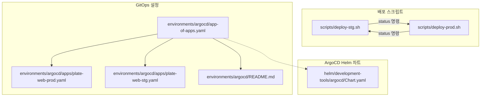
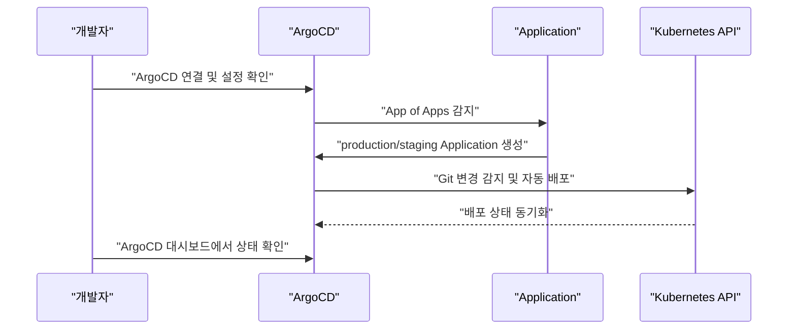
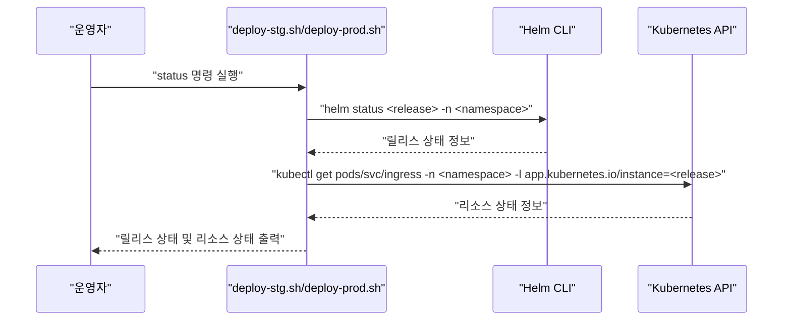
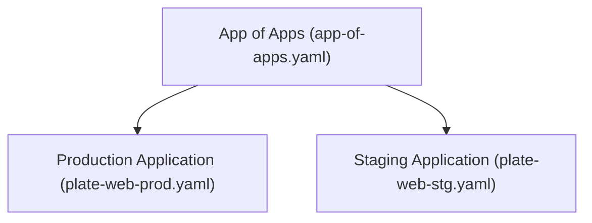
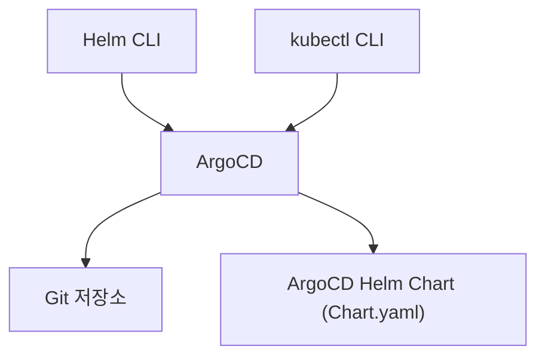

# 상태 확인

<cite>
**문서에서 참조한 파일 목록**
- [deploy-stg.sh](file://scripts/deploy-stg.sh)
- [deploy-prod.sh](file://scripts/deploy-prod.sh)
- [README.md](file://environments/argocd/README.md)
- [app-of-apps.yaml](file://environments/argocd/app-of-apps.yaml)
- [plate-web-prod.yaml](file://environments/argocd/apps/plate-web-prod.yaml)
- [plate-web-stg.yaml](file://environments/argocd/apps/plate-web-stg.yaml)
- [Chart.yaml](file://helm/development-tools/argocd/Chart.yaml)
</cite>

## 목차
1. [소개](#소개)
2. [프로젝트 구조](#프로젝트-구조)
3. [핵심 구성 요소](#핵심-구성-요소)
4. [아키텍처 개요](#아키텍처-개요)
5. [상세 구성 요소 분석](#상세-구성-요소-분석)
6. [의존성 분석](#의존성-분석)
7. [성능 고려사항](#성능-고려사항)
8. [장애 진단 가이드](#장애-진단-가이드)
9. [결론](#결론)

## 소개
이 섹션은 prj-devops로 배포된 시스템의 상태를 확인하는 방법을 설명합니다. 배포 스크립트의 status 명령어를 사용하여 Helm 릴리스 상태를 확인하고, kubectl 명령어를 통해 Pod, Service, Ingress 리소스의 상태를 점검하며, ArgoCD 대시보드를 통한 GitOps 기반 배포 상태를 모니터링하는 방법을 다룹니다. 실제 코드 예시로는 deploy-stg.sh 및 deploy-prod.sh 스크립트 내의 show_status 함수를 참조하며, Helm status 명령어와 kubectl get pods/service/ingress 명령어의 사용법을 상세히 설명합니다. 운영 환경에서의 상태 확인 시 주의사항과 일반적인 이슈(예: Pod가 Running 상태가 아닌 경우, Ingress 라우팅 문제 등)에 대한 진단 방법도 포함합니다.

## 프로젝트 구조
- 배포 스크립트
  - 스테이징 환경 배포 스크립트: scripts/deploy-stg.sh
  - 프로덕션 환경 배포 스크립트: scripts/deploy-prod.sh
- GitOps 설정
  - ArgoCD App of Apps 패턴: environments/argocd/app-of-apps.yaml
  - 환경별 Application 정의: environments/argocd/apps/plate-web-prod.yaml, environments/argocd/apps/plate-web-stg.yaml
  - ArgoCD GitOps 문서: environments/argocd/README.md
- ArgoCD Helm 차트
  - ArgoCD Helm 차트 메타데이터: helm/development-tools/argocd/Chart.yaml

**도표 출처**
- [deploy-stg.sh](file://scripts/deploy-stg.sh#L91-L113)
- [deploy-prod.sh](file://scripts/deploy-prod.sh#L192-L218)
- [app-of-apps.yaml](file://environments/argocd/app-of-apps.yaml#L1-L35)
- [plate-web-prod.yaml](file://environments/argocd/apps/plate-web-prod.yaml#L1-L62)
- [plate-web-stg.yaml](file://environments/argocd/apps/plate-web-stg.yaml#L1-L62)
- [README.md](file://environments/argocd/README.md#L1-L107)
- [Chart.yaml](file://helm/development-tools/argocd/Chart.yaml#L1-L32)

**섹션 출처**
- [deploy-stg.sh](file://scripts/deploy-stg.sh#L91-L113)
- [deploy-prod.sh](file://scripts/deploy-prod.sh#L192-L218)
- [app-of-apps.yaml](file://environments/argocd/app-of-apps.yaml#L1-L35)
- [plate-web-prod.yaml](file://environments/argocd/apps/plate-web-prod.yaml#L1-L62)
- [plate-web-stg.yaml](file://environments/argocd/apps/plate-web-stg.yaml#L1-L62)
- [README.md](file://environments/argocd/README.md#L1-L107)
- [Chart.yaml](file://helm/development-tools/argocd/Chart.yaml#L1-L32)

## 핵심 구성 요소
- Helm 릴리스 상태 확인
  - 스테이징: deploy-stg.sh의 show_status 함수에서 Helm 릴리스 상태를 출력합니다.
  - 프로덕션: deploy-prod.sh의 show_status 함수에서 Helm 릴리스 상태를 출력합니다.
- kubectl 리소스 상태 확인
  - Pod, Service, Ingress 리소스를 각각 조회하여 현재 상태를 확인합니다.
  - 프로덕션에서는 Pod에 대해 더 많은 정보(-o wide)를 출력합니다.
- ArgoCD 대시보드를 통한 GitOps 상태 확인
  - App of Apps 패턴을 통해 여러 환경의 Application이 자동 생성되고 동기화됩니다.
  - 각 환경별 Application은 production/staging 환경에 맞게 설정되어 있습니다.

**섹션 출처**
- [deploy-stg.sh](file://scripts/deploy-stg.sh#L91-L113)
- [deploy-prod.sh](file://scripts/deploy-prod.sh#L192-L218)
- [app-of-apps.yaml](file://environments/argocd/app-of-apps.yaml#L1-L35)
- [plate-web-prod.yaml](file://environments/argocd/apps/plate-web-prod.yaml#L1-L62)
- [plate-web-stg.yaml](file://environments/argocd/apps/plate-web-stg.yaml#L1-L62)

## 아키텍처 개요
다음 그림은 GitOps 기반 배포 상태 확인 흐름을 보여줍니다. ArgoCD가 App of Apps를 감지하고, 각 환경(Application)을 자동 생성하며, 배포 후 상태를 확인하는 과정을 나타냅니다.

**도표 출처**
- [README.md](file://environments/argocd/README.md#L1-L107)
- [app-of-apps.yaml](file://environments/argocd/app-of-apps.yaml#L1-L35)
- [plate-web-prod.yaml](file://environments/argocd/apps/plate-web-prod.yaml#L1-L62)
- [plate-web-stg.yaml](file://environments/argocd/apps/plate-web-stg.yaml#L1-L62)

## 상세 구성 요소 분석

### Helm 릴리스 상태 확인
- 스테이징 환경
  - deploy-stg.sh의 show_status 함수는 Helm 릴리스 상태를 출력하고, 해당 릴리스에 속한 Pod, Service, Ingress 리소스를 조회합니다.
  - 사용되는 Helm 명령어: helm status <release> -n <namespace>
  - 사용되는 kubectl 명령어: kubectl get pods/svc/ingress -n <namespace> -l app.kubernetes.io/instance=<release>
- 프로덕션 환경
  - deploy-prod.sh의 show_status 함수는 Helm 릴리스 상태를 출력하고, Pod에 대해 더 많은 정보(-o wide)를 출력하며, HPA 리소스가 존재할 경우 함께 조회합니다.
  - 사용되는 Helm 명령어: helm status <release> -n <namespace>
  - 사용되는 kubectl 명령어: kubectl get pods -n <namespace> -l app.kubernetes.io/instance=<release> -o wide, kubectl get svc/ingress/hpa -n <namespace> -l app.kubernetes.io/instance=<release>

**도표 출처**
- [deploy-stg.sh](file://scripts/deploy-stg.sh#L91-L113)
- [deploy-prod.sh](file://scripts/deploy-prod.sh#L192-L218)

**섹션 출처**
- [deploy-stg.sh](file://scripts/deploy-stg.sh#L91-L113)
- [deploy-prod.sh](file://scripts/deploy-prod.sh#L192-L218)

### kubectl 리소스 상태 확인
- Pod 상태 확인
  - 스테이징: kubectl get pods -n <namespace> -l app.kubernetes.io/instance=<release>
  - 프로덕션: kubectl get pods -n <namespace> -l app.kubernetes.io/instance=<release> -o wide
- Service 상태 확인
  - 스테이징: kubectl get svc -n <namespace> -l app.kubernetes.io/instance=<release>
  - 프로덕션: kubectl get svc -n <namespace> -l app.kubernetes.io/instance=<release>
- Ingress 상태 확인
  - 스테이징: kubectl get ingress -n <namespace> -l app.kubernetes.io/instance=<release>
  - 프로덕션: kubectl get ingress -n <namespace> -l app.kubernetes.io/instance=<release>
- HPA 상태 확인 (프로덕션)
  - kubectl get hpa -n <namespace> -l app.kubernetes.io/instance=<release> 2>/dev/null || true

**섹션 출처**
- [deploy-stg.sh](file://scripts/deploy-stg.sh#L100-L113)
- [deploy-prod.sh](file://scripts/deploy-prod.sh#L201-L218)

### ArgoCD 대시보드를 통한 GitOps 상태 확인
- App of Apps 패턴
  - environments/argocd/app-of-apps.yaml에 따라 ArgoCD가 App of Apps를 감지하고, environments/argocd/apps/ 하위에 있는 Application들을 자동 생성합니다.
- 환경별 Application
  - production: environments/argocd/apps/plate-web-prod.yaml
  - staging: environments/argocd/apps/plate-web-stg.yaml
- GitOps 워크플로우
  - environments/argocd/README.md에 따라 Git 변경이 감지되면 자동 배포가 시작되고, ArgoCD 대시보드에서 상태가 동기화됩니다.

**도표 출처**
- [app-of-apps.yaml](file://environments/argocd/app-of-apps.yaml#L1-L35)
- [plate-web-prod.yaml](file://environments/argocd/apps/plate-web-prod.yaml#L1-L62)
- [plate-web-stg.yaml](file://environments/argocd/apps/plate-web-stg.yaml#L1-L62)

**섹션 출처**
- [app-of-apps.yaml](file://environments/argocd/app-of-apps.yaml#L1-L35)
- [plate-web-prod.yaml](file://environments/argocd/apps/plate-web-prod.yaml#L1-L62)
- [plate-web-stg.yaml](file://environments/argocd/apps/plate-web-stg.yaml#L1-L62)
- [README.md](file://environments/argocd/README.md#L1-L107)

## 의존성 분석
- 배포 스크립트는 Helm CLI와 kubectl CLI에 의존합니다.
- ArgoCD는 Kubernetes 클러스터에 설치되어 있어야 하며, ArgoCD Helm 차트를 통해 설치됩니다.
- GitOps 기반 배포는 Git 저장소와 ArgoCD 간의 연동이 필수적입니다.

**도표 출처**
- [deploy-stg.sh](file://scripts/deploy-stg.sh#L39-L53)
- [deploy-prod.sh](file://scripts/deploy-prod.sh#L69-L95)
- [Chart.yaml](file://helm/development-tools/argocd/Chart.yaml#L1-L32)

**섹션 출처**
- [deploy-stg.sh](file://scripts/deploy-stg.sh#L39-L53)
- [deploy-prod.sh](file://scripts/deploy-prod.sh#L69-L95)
- [Chart.yaml](file://helm/development-tools/argocd/Chart.yaml#L1-L32)

## 성능 고려사항
- Helm 릴리스 상태 확인 시에는 릴리스의 복잡성과 네임스페이스 내 리소스 수에 따라 응답 시간이 달라질 수 있습니다.
- kubectl get 명령어는 대량의 리소스를 조회할 경우 응답 시간이 길어질 수 있으므로, 필요한 리소스만 필터링하여 조회하는 것이 좋습니다.
- ArgoCD 대시보드는 Git 변경 감지를 기반으로 동작하므로, Git 저장소의 변경 빈도에 따라 배포 주기가 영향을 받습니다.

[이 섹션은 일반적인 성능 논의를 포함하므로 특정 파일 분석 없음]

## 장애 진단 가이드
- Pod가 Running 상태가 아닌 경우
  - 프로덕션에서는 kubectl rollout status deployment를 통해 롤아웃 상태를 확인하고, 문제가 있을 경우 롤백 또는 재시도를 고려합니다.
  - 스테이징에서는 helm status를 통해 릴리스 상태를 확인하고, Pod 상태를 점검합니다.
- Ingress 라우팅 문제
  - Ingress 리소스 상태를 확인하고, Service와 연결된 포트/선택자 설정을 점검합니다.
  - 프로덕션에서는 HPA 리소스가 있을 경우 함께 확인하여 자동 확장 정책이 정상적으로 작동하는지 확인합니다.
- 클러스터 연결 문제
  - kubectl cluster-info를 통해 클러스터 연결 상태를 확인하고, 잘못된 context에 연결되지 않도록 주의합니다.
- GitOps 상태 불일치
  - ArgoCD 대시보드에서 Application의 Sync 상태를 확인하고, 자동 동기화(Automated) 및 Self-Heal 설정이 올바르게 적용되었는지 점검합니다.

**섹션 출처**
- [deploy-prod.sh](file://scripts/deploy-prod.sh#L175-L190)
- [deploy-stg.sh](file://scripts/deploy-stg.sh#L91-L113)
- [deploy-prod.sh](file://scripts/deploy-prod.sh#L192-L218)
- [README.md](file://environments/argocd/README.md#L1-L107)

## 결론
- Helm 릴리스 상태 확인은 deploy-stg.sh/deploy-prod.sh의 show_status 함수를 통해 간편하게 수행할 수 있으며, kubectl을 통해 Pod, Service, Ingress 리소스 상태를 함께 점검할 수 있습니다.
- GitOps 기반 배포는 ArgoCD App of Apps 패턴을 통해 자동화되며, 대시보드를 통해 배포 상태를 실시간으로 모니터링할 수 있습니다.
- 운영 환경에서는 안전성을 위해 프로덕션 배포 전후에 상태 확인 절차를 따르고, 일반적인 이슈에 대한 진단 방법을 숙지하는 것이 중요합니다.

[이 섹션은 요약을 포함하므로 특정 파일 분석 없음]