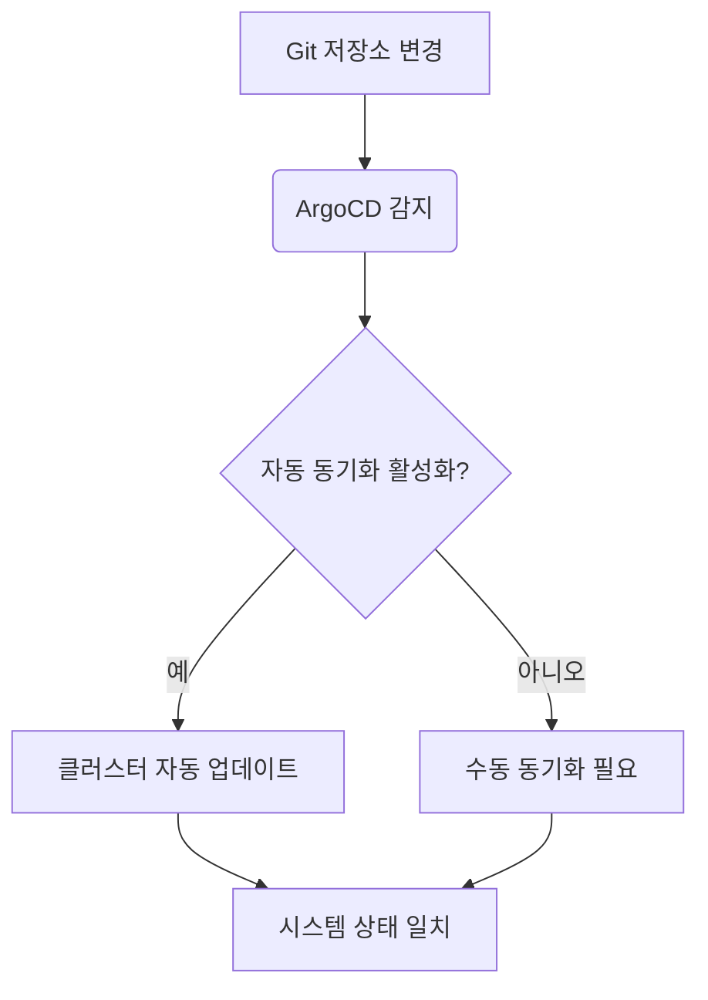
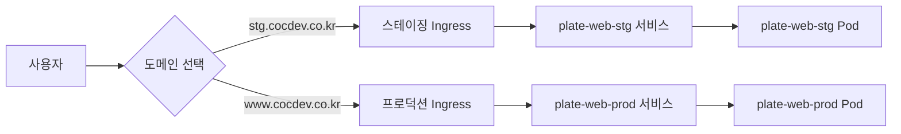
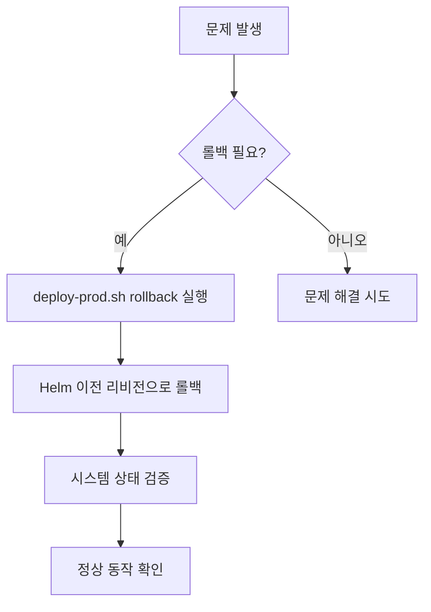

# 운영 가이드

<cite>
**이 문서에서 참조한 파일**  
- [README.md](file://README.md)
- [environments/argocd/README.md](file://environments/argocd/README.md)
- [environments/argocd/app-of-apps.yaml](file://environments/argocd/app-of-apps.yaml)
- [environments/argocd/apps/plate-web-prod.yaml](file://environments/argocd/apps/plate-web-prod.yaml)
- [environments/argocd/apps/plate-api-prod.yaml](file://environments/argocd/apps/plate-api-prod.yaml)
- [environments/argocd/apps/plate-cache-prod.yaml](file://environments/argocd/apps/plate-cache-prod.yaml)
- [helm/applications/plate-web/values-prod.yaml](file://helm/applications/plate-web/values-prod.yaml)
- [helm/applications/plate-api/values-prod.yaml](file://helm/applications/plate-api/values-prod.yaml)
- [helm/applications/plate-cache/values-prod.yaml](file://helm/applications/plate-cache/values-prod.yaml)
- [scripts/deploy-prod.sh](file://scripts/deploy-prod.sh)
- [scripts/deploy-stg.sh](file://scripts/deploy-stg.sh)
</cite>

## 목차
1. [소개](#소개)
2. [시스템 상태 확인](#시스템-상태-확인)
3. [애플리케이션 접속 방법](#애플리케이션-접속-방법)
4. [문제 진단 및 로그 확인](#문제-진단-및-로그-확인)
5. [배포 롤백 절차](#배포-롤백-절차)
6. [일반적인 문제 해결](#일반적인-문제-해결)

## 소개

이 문서는 `prj-devops`로 배포된 시스템의 운영을 위한 포괄적인 가이드를 제공합니다. 시스템의 안정적인 운영을 위해 상태 확인, 애플리케이션 접근, 문제 진단 및 해결 방법을 안내합니다. 특히, 배포 스크립트와 ArgoCD를 활용한 모니터링 및 관리 방법을 포함하여 운영 효율성을 높이는 데 중점을 두고 있습니다.

**Section sources**
- [README.md](file://README.md#L1-L417)

## 시스템 상태 확인

시스템의 현재 상태를 확인하는 방법은 다음과 같습니다.

### 배포 스크립트를 통한 상태 확인

`deploy-stg.sh` 및 `deploy-prod.sh` 스크립트는 `status` 명령어를 통해 각 환경의 배포 상태를 확인할 수 있습니다.

```bash
# 스테이징 환경 상태 확인
./scripts/deploy-stg.sh status

# 프로덕션 환경 상태 확인
./scripts/deploy-prod.sh status
```

이 명령어는 Helm 릴리스 상태, Pod 상태, 서비스 및 Ingress 정보를 출력하여 현재 배포 상태를 종합적으로 파악할 수 있도록 합니다.

### ArgoCD 대시보드를 통한 모니터링

ArgoCD는 GitOps 기반의 배포 관리 도구로, 시스템의 모든 구성 요소를 시각적으로 모니터링할 수 있습니다.

1. ArgoCD 대시보드에 접속합니다.
2. `cocdev-platform-apps` 애플리케이션(App of Apps)을 확인합니다.
3. 하위 애플리케이션들(`plate-web-prod`, `plate-api-prod`, `plate-cache-prod` 등)의 동기화 상태(Sync Status)와 건강 상태(Health Status)를 확인합니다.
4. 상태가 `OutOfSync`인 경우, Git 저장소와 클러스터 상태가 일치하지 않음을 의미하며, 동기화가 필요합니다.

ArgoCD는 자동 동기화(selfHeal) 기능을 통해 수동으로 변경된 사항을 자동으로 원래 상태로 복구합니다.



**Diagram sources**
- [environments/argocd/app-of-apps.yaml](file://environments/argocd/app-of-apps.yaml#L1-L35)
- [environments/argocd/apps/plate-web-prod.yaml](file://environments/argocd/apps/plate-web-prod.yaml#L1-L46)

**Section sources**
- [scripts/deploy-stg.sh](file://scripts/deploy-stg.sh#L92-L113)
- [scripts/deploy-prod.sh](file://scripts/deploy-prod.sh#L193-L218)
- [environments/argocd/README.md](file://environments/argocd/README.md#L1-L107)

## 애플리케이션 접속 방법

배포 완료 후, 다음 URL을 통해 애플리케이션에 접근할 수 있습니다.

- **스테이징 환경**: `https://cocdev.co.kr` 또는 `https://stg.cocdev.co.kr`
- **프로덕션 환경**: `https://cocdev.co.kr` 또는 `https://www.cocdev.co.kr`

접속 정보는 `deploy-stg.sh` 및 `deploy-prod.sh` 스크립트의 `show_access_info` 함수에 의해 출력됩니다. 이 함수는 Ingress 리소스에서 호스트 정보를 가져와 접근 가능한 URL을 안내합니다.



**Diagram sources**
- [environments/argocd/apps/plate-web-prod.yaml](file://environments/argocd/apps/plate-web-prod.yaml#L1-L46)
- [helm/applications/plate-web/values-prod.yaml](file://helm/applications/plate-web/values-prod.yaml#L1-L39)

**Section sources**
- [scripts/deploy-stg.sh](file://scripts/deploy-stg.sh#L116-L131)
- [scripts/deploy-prod.sh](file://scripts/deploy-prod.sh#L221-L239)
- [README.md](file://README.md#L280-L283)

## 문제 진단 및 로그 확인

문제 발생 시, 로그와 메트릭을 확인하여 원인을 진단할 수 있습니다.

### 로그 확인

각 애플리케이션의 Pod 로그를 확인합니다.

```bash
# plate-web 애플리케이션 로그 확인
kubectl logs -n plate-prod -l app.kubernetes.io/name=plate-web

# plate-api 애플리케이션 로그 확인
kubectl logs -n plate-prod -l app.kubernetes.io/name=plate-api
```

### 메트릭 확인

Prometheus와 Grafana를 통해 시스템의 CPU, 메모리 사용량, 네트워크 트래픽 등의 메트릭을 모니터링할 수 있습니다. Grafana 대시보드에 접속하여 실시간 성능 지표를 확인합니다.

### 추가 진단 명령

```bash
# Ingress 상태 확인
kubectl get ingress -A

# 인증서 상태 확인
kubectl get certificates -A

# 특정 네임스페이스의 모든 리소스 확인
kubectl get all -n plate-prod
```

**Section sources**
- [README.md](file://README.md#L346-L354)

## 배포 롤백 절차

문제가 발생한 경우, `deploy-prod.sh` 스크립트의 `rollback` 명령어를 사용하여 이전 버전으로 롤백할 수 있습니다.

```bash
# 기본적으로 이전 리비전으로 롤백
./scripts/deploy-prod.sh rollback

# 특정 리비전 번호로 롤백
./scripts/deploy-prod.sh rollback <리비전_번호>
```

이 명령어는 Helm의 `rollback` 기능을 호출하여, 지정된 리비전의 구성으로 시스템을 되돌립니다. 롤백 후에는 시스템 상태를 다시 확인하여 정상 동작하는지 검증해야 합니다.



**Diagram sources**
- [scripts/deploy-prod.sh](file://scripts/deploy-prod.sh#L277-L282)

**Section sources**
- [scripts/deploy-prod.sh](file://scripts/deploy-prod.sh#L277-L287)

## 일반적인 문제 해결

운영 중에 발생할 수 있는 일반적인 이슈와 그 해결 방법을 정리합니다.

### 1. 인증서 문제

- **현상**: HTTPS 접속이 실패하거나 인증서 오류가 발생
- **원인**: cert-manager가 Let's Encrypt로부터 인증서를 발급받지 못함
- **해결 방법**:
  1. cert-manager Pod의 로그를 확인합니다.
  2. Certificate, Order, Challenge 리소스의 상태를 확인합니다.
  3. DNS 설정이 올바르게 되어 있는지 확인합니다.

### 2. Ingress 문제

- **현상**: 도메인으로 접근이 안 됨
- **원인**: DNS 레코드가 Ingress Controller의 LoadBalancer IP와 연결되지 않음
- **해결 방법**:
  1. `kubectl get ingress -A`로 Ingress의 ADDRESS가 할당되었는지 확인합니다.
  2. DNS A 레코드가 해당 IP 주소를 가리키도록 설정합니다.

### 3. Pod 문제

- **현상**: Pod가 `CrashLoopBackOff` 또는 `Pending` 상태
- **원인**: 리소스 부족 또는 이미지 Pull 오류
- **해결 방법**:
  1. `kubectl describe pod <pod_name>`으로 이벤트 로그를 확인합니다.
  2. `kubectl logs <pod_name>`으로 애플리케이션 로그를 확인합니다.
  3. `resources` 설정이 적절한지 values 파일을 확인합니다.

이러한 절차를 따르면 시스템의 안정적인 운영과 신속한 문제 해결이 가능합니다.

**Section sources**
- [README.md](file://README.md#L339-L342)