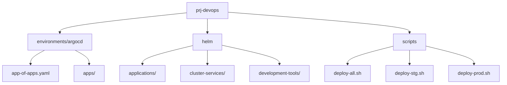
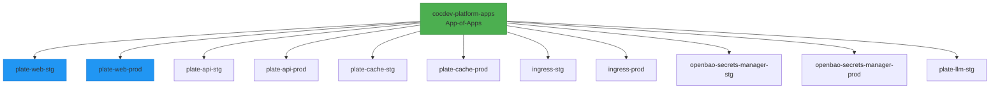
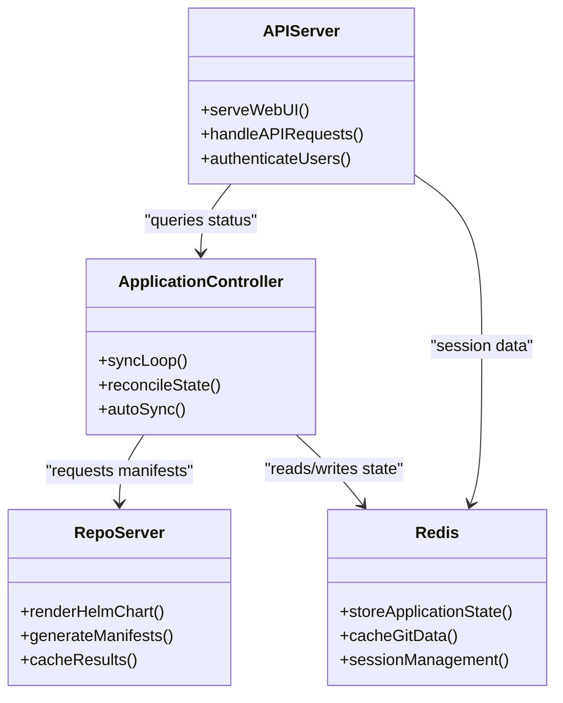
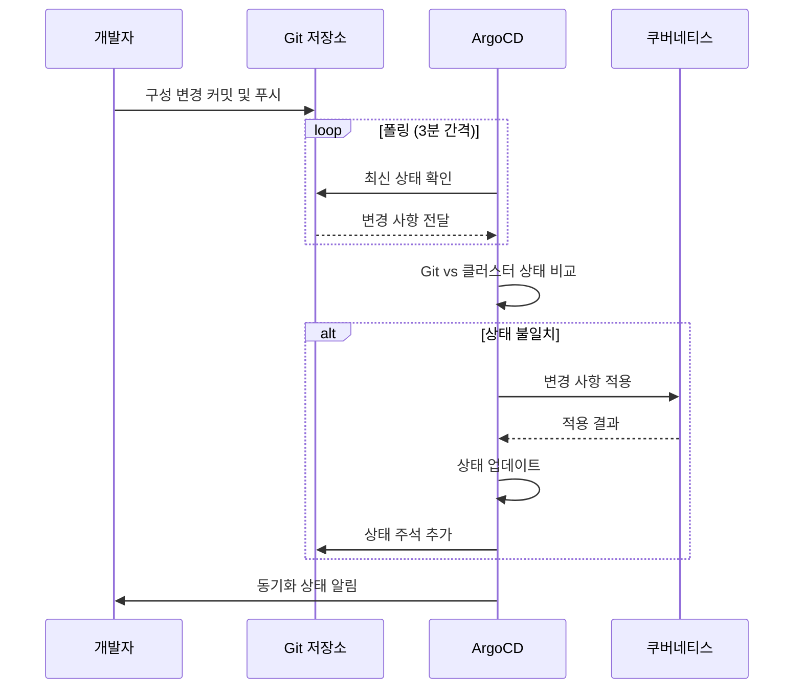
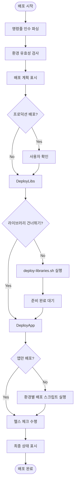
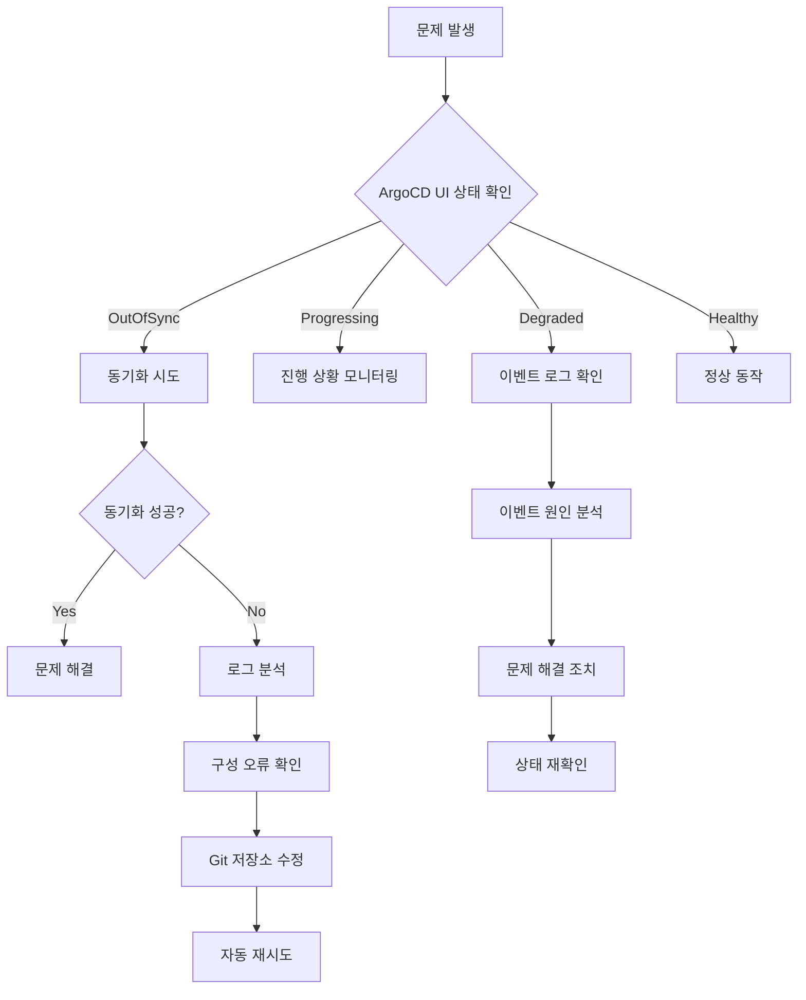

# ArgoCD App-of-Apps 패턴

<cite>
**이 문서에서 참조한 파일**
- [app-of-apps.yaml](file://environments/argocd/app-of-apps.yaml)
- [plate-web-stg.yaml](file://environments/argocd/apps/plate-web-stg.yaml)
- [plate-web-prod.yaml](file://environments/argocd/apps/plate-web-prod.yaml)
- [argocd/Chart.yaml](file://helm/development-tools/argocd/Chart.yaml)
- [plate-api/Chart.yaml](file://helm/applications/plate-api/Chart.yaml)
- [plate-web/Chart.yaml](file://helm/applications/plate-web/Chart.yaml)
- [deploy-all.sh](file://scripts/deploy-all.sh)
- [deploy-stg.sh](file://scripts/deploy-stg.sh)
- [deploy-prod.sh](file://scripts/deploy-prod.sh)
- [deploy-libraries.sh](file://scripts/deploy-libraries.sh)
</cite>

## 목차
1. [소개](#소개)
2. [프로젝트 구조](#프로젝트-구조)
3. [App-of-Apps 패턴 구조](#app-of-apps-패턴-구조)
4. [ArgoCD 구성 요소 역할](#argocd-구성-요소-역할)
5. [GitOps 워크플로우 및 상태 동기화](#gitops-워크플로우-및-상태-동기화)
6. [다중 환경 관리 전략](#다중-환경-관리-전략)
7. [스크립트 통합 방식](#스크립트-통합-방식)
8. [문제 해결 및 상태 확인](#문제-해결-및-상태-확인)
9. [결론](#결론)

## 소개
이 문서는 prj-devops 리포지토리에서 ArgoCD를 활용한 App-of-Apps 패턴의 구현을 상세히 설명합니다. GitOps 기반의 선언적 배포 방식을 통해 애플리케이션의 일관성과 신뢰성을 보장하며, 다중 환경(스테이징/프로덕션)에 대한 효율적인 관리 체계를 제공합니다. environments/argocd 디렉터리에 정의된 계층적 애플리케이션 구조는 전체 플랫폼의 배포를 중앙에서 통제할 수 있도록 설계되었습니다.

## 프로젝트 구조
프로젝트는 Helm 차트 기반의 선언적 구성과 ArgoCD를 통한 GitOps 워크플로우로 구성되어 있습니다. 핵심 디렉터리는 다음과 같습니다:

- `environments/argocd/`: ArgoCD Application 리소스 정의
- `helm/`: 애플리케이션 및 클러스터 서비스 Helm 차트
- `scripts/`: 배포 오케스트레이션 스크립트



**다이어그램 출처**
- [app-of-apps.yaml](file://environments/argocd/app-of-apps.yaml)
- [deploy-all.sh](file://scripts/deploy-all.sh)

**섹션 출처**
- [app-of-apps.yaml](file://environments/argocd/app-of-apps.yaml)
- [deploy-all.sh](file://scripts/deploy-all.sh)

## App-of-Apps 패턴 구조
App-of-Apps 패턴은 하나의 메인 Application이 여러 하위 Application들을 관리하는 계층적 구조입니다. `environments/argocd/app-of-apps.yaml` 파일은 이 패턴의 진입점으로, 모든 환경의 애플리케이션들을 자동으로 생성하고 관리합니다.



**다이어그램 출처**
- [app-of-apps.yaml](file://environments/argocd/app-of-apps.yaml)
- [plate-web-stg.yaml](file://environments/argocd/apps/plate-web-stg.yaml)
- [plate-web-prod.yaml](file://environments/argocd/apps/plate-web-prod.yaml)

**섹션 출처**
- [app-of-apps.yaml](file://environments/argocd/app-of-apps.yaml)

## ArgoCD 구성 요소 역할
ArgoCD는 Git 저장소의 선언적 구성과 클러스터의 실제 상태를 지속적으로 비교하고 동기화합니다. 각 구성 요소는 다음과 같은 역할을 수행합니다:

### 핵심 구성 요소
- **Application Controller**: Git과 클러스터 상태를 비교하고 동기화를 수행
- **Repo Server**: Helm 차트를 렌더링하고 매니페스트를 생성
- **API Server**: UI와 CLI를 위한 REST API 제공
- **Redis**: 상태 저장 및 캐싱



**다이어그램 출처**
- [argocd/Chart.yaml](file://helm/development-tools/argocd/Chart.yaml)

**섹션 출처**
- [argocd/Chart.yaml](file://helm/development-tools/argocd/Chart.yaml)

## GitOps 워크플로우 및 상태 동기화
GitOps 워크플로우는 Git 저장소를 단일 진실 공급원(Single Source of Truth)으로 삼아 인프라와 애플리케이션의 상태를 관리합니다.

### 워크플로우 단계
1. **변경 요청**: Git 저장소에 구성 변경
2. **자동 감지**: ArgoCD가 변경 사항 감지 (기본 3분 폴링)
3. **상태 비교**: Git 상태와 클러스터 상태 비교
4. **자동 동기화**: 차이점이 있으면 자동으로 클러스터에 적용
5. **상태 보고**: 동기화 결과를 Git과 UI에 반영



**다이어그램 출처**
- [app-of-apps.yaml](file://environments/argocd/app-of-apps.yaml)
- [environments/argocd/README.md](file://environments/argocd/README.md)

**섹션 출처**
- [environments/argocd/README.md](file://environments/argocd/README.md)

## 다중 환경 관리 전략
다중 환경(스테이징/프로덕션)은 환경별로 독립적인 네임스페이스와 구성 값을 사용하여 관리됩니다.

### 환경별 차이점
| 항목 | 스테이징 | 프로덕션 |
|------|---------|---------|
| 네임스페이스 | plate-stg | plate-prod |
| 이미지 태그 | latest | 안정 버전 |
| 복제본 수 | 1 | 3 |
| TLS 비밀번호 | web-stg-tls | web-prod-tls |
| 재시도 제한 | 5회 | 3회 |

### 동기화 정책
```yaml
syncPolicy:
  automated:
    prune: true      # Git에서 삭제된 리소스 자동 정리
    selfHeal: true   # 수동 변경 자동 복구
  syncOptions:
    - CreateNamespace=true
    - ApplyOutOfSyncOnly=true
```

**섹션 출처**
- [plate-web-stg.yaml](file://environments/argocd/apps/plate-web-stg.yaml)
- [plate-web-prod.yaml](file://environments/argocd/apps/plate-web-prod.yaml)

## 스크립트 통합 방식
`scripts/deploy-all.sh` 스크립트는 전체 배포 프로세스를 오케스트레이션합니다. 이 스크립트는 라이브러리와 애플리케이션의 배포 순서를 관리하며, 환경에 따라 적절한 하위 스크립트를 호출합니다.



**다이어그램 출처**
- [deploy-all.sh](file://scripts/deploy-all.sh)

**섹션 출처**
- [deploy-all.sh](file://scripts/deploy-all.sh)
- [deploy-libraries.sh](file://scripts/deploy-libraries.sh)

## 문제 해결 및 상태 확인
배포 문제를 해결하고 상태를 확인하기 위한 절차는 다음과 같습니다.

### 일반적인 문제 유형
- **동기화 실패**: Git과 클러스터 상태 불일치
- **리소스 생성 실패**: RBAC 권한 부족
- **이미지 풀 실패**: 이미지 레지스트리 접근 문제
- **네트워크 문제**: Ingress 또는 Service 구성 오류

### 상태 확인 절차
1. ArgoCD UI에서 Application 상태 확인
2. `kubectl get apps -n argocd` 명령으로 상태 확인
3. `argocd app logs <app-name>`으로 로그 확인
4. `argocd app diff <app-name>`으로 차이점 확인
5. `argocd app sync <app-name>`으로 수동 동기화



**다이어그램 출처**
- [environments/argocd/README.md](file://environments/argocd/README.md)

**섹션 출처**
- [environments/argocd/README.md](file://environments/argocd/README.md)
- [deploy-stg.sh](file://scripts/deploy-stg.sh)
- [deploy-prod.sh](file://scripts/deploy-prod.sh)

## 결론
ArgoCD App-of-Apps 패턴은 복잡한 다중 환경 애플리케이션 구조를 효과적으로 관리할 수 있는 강력한 솔루션입니다. GitOps 원칙을 따르는 이 패턴은 구성의 일관성, 추적 가능성, 자동화된 복구 기능을 제공하여 운영 신뢰성을 크게 향상시킵니다. environments/argocd 디렉터리에 정의된 계층적 구조는 전체 플랫폼의 배포를 중앙에서 통제할 수 있도록 하며, scripts 디렉터리의 오케스트레이션 스크립트는 배포 프로세스의 유연성과 안정성을 보장합니다. 이 아키텍처는 지속적인 통합 및 배포(CI/CD) 파이프라인과 잘 통합되어 현대적인 클라우드 네이티브 환경을 위한 견고한 기반을 제공합니다.