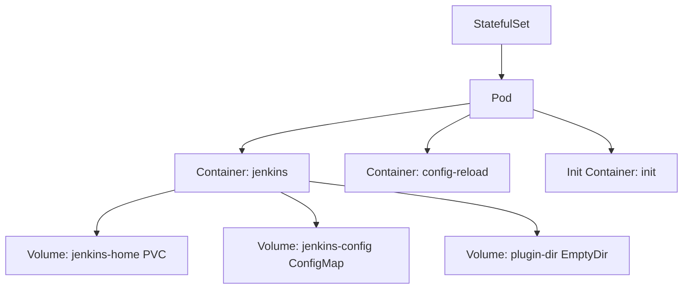
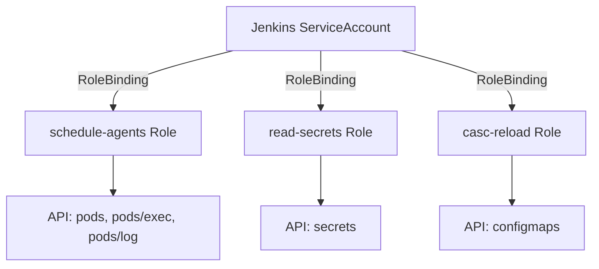
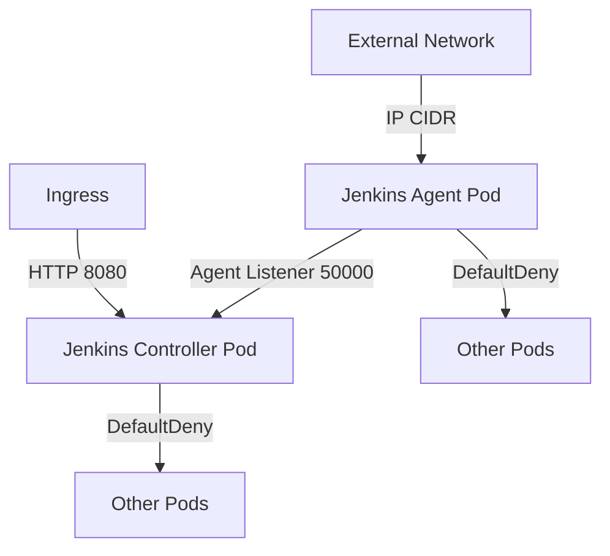
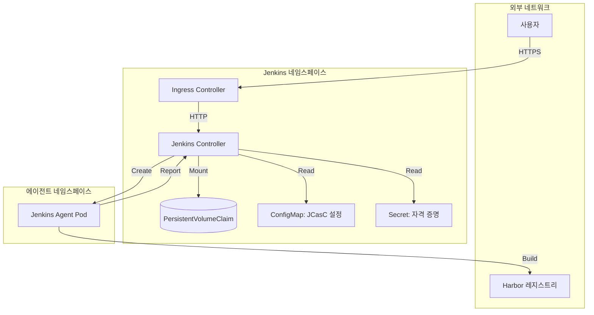
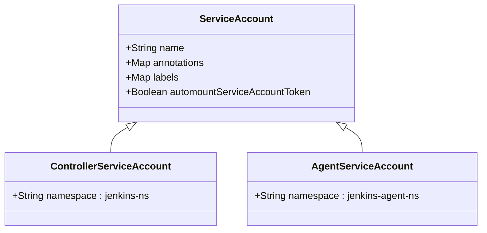
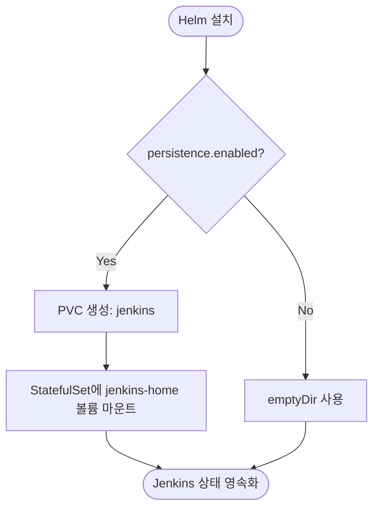
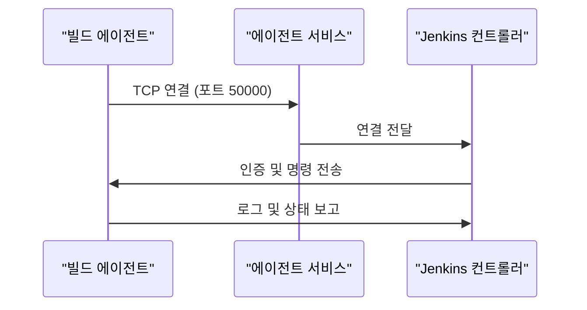
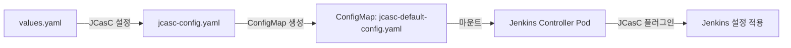

# CI/CD 통합 (Jenkins)

<cite>
**이 문서에서 참조한 파일**  
- [Chart.yaml](file://helm/development-tools/jenkins/Chart.yaml)
- [values.yaml](file://helm/development-tools/jenkins/values.yaml)
- [jenkins-controller-statefulset.yaml](file://helm/development-tools/jenkins/templates/jenkins-controller-statefulset.yaml)
- [rbac.yaml](file://helm/development-tools/jenkins/templates/rbac.yaml)
- [jcasc-config.yaml](file://helm/development-tools/jenkins/templates/jcasc-config.yaml)
- [jenkins-controller-ingress.yaml](file://helm/development-tools/jenkins/templates/jenkins-controller-ingress.yaml)
- [jenkins-controller-networkpolicy.yaml](file://helm/development-tools/jenkins/templates/jenkins-controller-networkpolicy.yaml)
- [home-pvc.yaml](file://helm/development-tools/jenkins/templates/home-pvc.yaml)
- [jenkins-agent-svc.yaml](file://helm/development-tools/jenkins/templates/jenkins-agent-svc.yaml)
- [service-account.yaml](file://helm/development-tools/jenkins/templates/service-account.yaml)
- [service-account-agent.yaml](file://helm/development-tools/jenkins/templates/service-account-agent.yaml)
- [config.yaml](file://helm/development-tools/jenkins/templates/config.yaml)
</cite>

## 목차
1. [소개](#소개)
2. [핵심 구성 요소 분석](#핵심-구성-요소-분석)
3. [아키텍처 개요](#아키텍처-개요)
4. [상세 구성 요소 분석](#상세-구성-요소-분석)
5. [파이프라인 및 빌드 에이전트 관리](#파이프라인-및-빌드-에이전트-관리)
6. [보안 설정 (JCasC)](#보안-설정-jcasc)
7. [외부 시스템 통합](#외부-시스템-통합)
8. [고가용성 및 데이터 영속성](#고가용성-및-데이터-영속성)
9. [결론](#결론)

## 소개

이 문서는 Jenkins Helm 차트를 활용한 CI/CD 파이프라인 통합의 구현 세부 사항을 설명합니다. Jenkins는 쿠버네티스 환경에서 지속적인 통합 및 배포를 위한 핵심 도구로, Helm 차트를 통해 안정적이고 확장 가능한 방식으로 배포됩니다. 본 문서는 Jenkins의 주요 구성 요소들인 StatefulSet, RBAC, 네트워크 정책 등의 역할과 설정을 분석하고, 파이프라인 구조, 빌드 에이전트 관리, 보안 설정(JCasC), 그리고 Harbor, Kubernetes와의 통합 방식을 설명합니다. 또한 고가용성 및 데이터 영속성을 보장하기 위한 구성도 포함됩니다.

**Section sources**
- [Chart.yaml](file://helm/development-tools/jenkins/Chart.yaml#L1-L50)
- [values.yaml](file://helm/development-tools/jenkins/values.yaml#L1-L1387)

## 핵심 구성 요소 분석

Jenkins Helm 차트는 여러 핵심 쿠버네티스 리소스를 통해 안정적인 CI/CD 환경을 제공합니다. 이 섹션에서는 StatefulSet, RBAC, 네트워크 정책 등 주요 구성 요소의 역할과 설정을 분석합니다.

### StatefulSet

Jenkins 컨트롤러는 StatefulSet으로 배포되어 상태를 유지하는 애플리케이션의 특성을 보장합니다. StatefulSet은 고유한 네트워크 식별자와 안정적인 스토리지 볼륨을 제공하여, Jenkins의 설정, 플러그인, 빌드 기록 등 중요한 상태 정보가 유지되도록 합니다. `jenkins-controller-statefulset.yaml` 템플릿은 컨트롤러의 복제본 수를 1로 설정하고, `jenkins-home` PVC를 볼륨으로 마운트하여 데이터 영속성을 구현합니다. 또한, 포드의 레이블, 어피니티, 허용 오차 등을 설정하여 포드의 스케줄링과 배치를 제어합니다.

**Diagram sources**
- [jenkins-controller-statefulset.yaml](file://helm/development-tools/jenkins/templates/jenkins-controller-statefulset.yaml#L1-L420)
- [values.yaml](file://helm/development-tools/jenkins/values.yaml#L35-L695)

**Section sources**
- [jenkins-controller-statefulset.yaml](file://helm/development-tools/jenkins/templates/jenkins-controller-statefulset.yaml#L1-L420)
- [values.yaml](file://helm/development-tools/jenkins/values.yaml#L35-L695)

### RBAC (Role-Based Access Control)

Jenkins는 쿠버네티스 클러스터 내에서 에이전트 포드를 동적으로 생성하고 관리해야 하므로, 적절한 RBAC 설정이 필수적입니다. `rbac.yaml` 템플릿은 Jenkins 서비스 어카운트에 필요한 권한을 정의합니다. 주요 역할은 다음과 같습니다:
- **`schedule-agents` Role**: Jenkins가 에이전트 포드를 생성, 삭제, 조회할 수 있도록 `pods`, `pods/exec`, `pods/log` 등의 리소스에 대한 권한을 부여합니다.
- **`read-secrets` Role**: Jenkins Credentials Provider 플러그인이 쿠버네티스 비밀번호를 읽을 수 있도록 `secrets` 리소스에 대한 권한을 부여합니다.
- **`casc-reload` Role**: JCasC 설정이 변경될 때 자동으로 리로드하기 위해 `configmaps` 리소스를 모니터링할 수 있는 권한을 부여합니다.

이러한 역할(Role)은 Jenkins 서비스 어카운트에 바인딩되어, Jenkins 컨트롤러가 필요한 작업을 수행할 수 있도록 합니다.

**Diagram sources**
- [rbac.yaml](file://helm/development-tools/jenkins/templates/rbac.yaml#L1-L151)
- [values.yaml](file://helm/development-tools/jenkins/values.yaml#L1325-L1332)

**Section sources**
- [rbac.yaml](file://helm/development-tools/jenkins/templates/rbac.yaml#L1-L151)
- [values.yaml](file://helm/development-tools/jenkins/values.yaml#L1325-L1332)

### 네트워크 정책

네트워크 정책은 Jenkins 컨트롤러와 에이전트 간의 통신을 보안적으로 제어합니다. `jenkins-controller-networkpolicy.yaml` 템플릿은 두 가지 주요 정책을 정의합니다:
1. **컨트롤러 네트워크 정책**: 컨트롤러 포드에 대한 인바운드 트래픽을 제어합니다. 웹 UI 접근을 위한 HTTP 포트(8080)와 에이전트 연결을 위한 에이전트 리스너 포트(50000)에 대한 접근을 허용합니다. 내부 에이전트(같은 클러스터 내) 또는 외부 IP CIDR 범위로부터의 연결을 허용할 수 있습니다.
2. **에이전트 네트워크 정책**: 에이전트 포드에 대해 기본적으로 모든 트래픽을 차단하는 `DefaultDeny` 정책을 적용합니다. 이는 에이전트 포드가 불필요한 네트워크 노출 없이 안전하게 실행되도록 합니다.

**Diagram sources**
- [jenkins-controller-networkpolicy.yaml](file://helm/development-tools/jenkins/templates/jenkins-controller-networkpolicy.yaml#L1-L65)
- [values.yaml](file://helm/development-tools/jenkins/values.yaml#L1298-L1323)

**Section sources**
- [jenkins-controller-networkpolicy.yaml](file://helm/development-tools/jenkins/templates/jenkins-controller-networkpolicy.yaml#L1-L65)
- [values.yaml](file://helm/development-tools/jenkins/values.yaml#L1298-L1323)

## 아키텍처 개요

Jenkins Helm 차트는 쿠버네티스 클러스터 내에서 CI/CD 서버를 배포하고 관리하는 포괄적인 아키텍처를 제공합니다. 아래 다이어그램은 주요 구성 요소와 그들 간의 상호작용을 보여줍니다.

**Diagram sources**
- [jenkins-controller-ingress.yaml](file://helm/development-tools/jenkins/templates/jenkins-controller-ingress.yaml#L1-L72)
- [jenkins-controller-statefulset.yaml](file://helm/development-tools/jenkins/templates/jenkins-controller-statefulset.yaml#L1-L420)
- [home-pvc.yaml](file://helm/development-tools/jenkins/templates/home-pvc.yaml#L1-L36)
- [rbac.yaml](file://helm/development-tools/jenkins/templates/rbac.yaml#L1-L151)

## 상세 구성 요소 분석

이 섹션에서는 Jenkins Helm 차트의 핵심 구성 요소들에 대해 더 깊이 있는 분석을 제공합니다.

### 서비스 어카운트

Jenkins는 두 개의 서비스 어카운트를 사용하여 리소스 접근을 관리합니다.
- **컨트롤러 서비스 어카운트 (`service-account.yaml`)**: Jenkins 컨트롤러 포드가 사용하는 서비스 어카운트입니다. 이 어카운트는 RBAC에 의해 에이전트 포드 생성 및 설정 관리 권한이 부여됩니다.
- **에이전트 서비스 어카운트 (`service-account-agent.yaml`)**: Jenkins 에이전트 포드가 사용하는 서비스 어카운트입니다. 이 어카운트는 에이전트가 실행되는 네임스페이스에서 필요한 권한을 가집니다. 기본적으로 생성되지 않으며, `serviceAccountAgent.create` 값을 `true`로 설정해야 생성됩니다.

**Diagram sources**
- [service-account.yaml](file://helm/development-tools/jenkins/templates/service-account.yaml#L1-L22)
- [service-account-agent.yaml](file://helm/development-tools/jenkins/templates/service-account-agent.yaml#L1-L22)
- [values.yaml](file://helm/development-tools/jenkins/values.yaml#L1333-L1363)

**Section sources**
- [service-account.yaml](file://helm/development-tools/jenkins/templates/service-account.yaml#L1-L22)
- [service-account-agent.yaml](file://helm/development-tools/jenkins/templates/service-account-agent.yaml#L1-L22)

### 영속성 볼륨 클레임 (PVC)

Jenkins의 상태 정보는 `home-pvc.yaml` 템플릿에 정의된 PVC를 통해 영속화됩니다. `persistence.enabled`가 `true`로 설정되면, 이 템플릿은 `jenkins`라는 이름의 PVC를 생성합니다. 이 PVC는 `openebs-hostpath` 스토리지 클래스를 사용하며, 8Gi의 저장소를 요청합니다. Jenkins 컨트롤러의 StatefulSet은 이 PVC를 `jenkins-home` 볼륨으로 마운트하여, 설정 파일, 플러그인, 빌드 기록 등을 안정적으로 저장합니다.

**Diagram sources**
- [home-pvc.yaml](file://helm/development-tools/jenkins/templates/home-pvc.yaml#L1-L36)
- [values.yaml](file://helm/development-tools/jenkins/values.yaml#L1253-L1297)

**Section sources**
- [home-pvc.yaml](file://helm/development-tools/jenkins/templates/home-pvc.yaml#L1-L36)
- [values.yaml](file://helm/development-tools/jenkins/values.yaml#L1253-L1297)

## 파이프라인 및 빌드 에이전트 관리

Jenkins는 쿠버네티스 플러그인을 통해 빌드 에이전트를 동적으로 관리합니다. 이는 리소스를 효율적으로 사용하고 다양한 빌드 환경을 유연하게 지원할 수 있게 합니다.

### 에이전트 서비스

`jenkins-agent-svc.yaml` 템플릿은 에이전트 포드가 Jenkins 컨트롤러에 연결하기 위한 서비스를 정의합니다. 이 서비스는 기본적으로 `ClusterIP` 타입이며, 컨트롤러의 `50000` 포트를 노출합니다. 외부 에이전트 연결이 필요한 경우, `LoadBalancer` 타입으로 변경하거나 `LoadBalancerSourceRanges`를 설정하여 특정 IP 범위만 허용할 수 있습니다.

**Diagram sources**
- [jenkins-agent-svc.yaml](file://helm/development-tools/jenkins/templates/jenkins-agent-svc.yaml#L1-L38)
- [values.yaml](file://helm/development-tools/jenkins/values.yaml#L333-L388)

**Section sources**
- [jenkins-agent-svc.yaml](file://helm/development-tools/jenkins/templates/jenkins-agent-svc.yaml#L1-L38)
- [values.yaml](file://helm/development-tools/jenkins/values.yaml#L333-L388)

### 에이전트 템플릿

`values.yaml` 파일의 `agent` 섹션은 기본 에이전트의 구성(이미지, 리소스 요청, 볼륨 등)을 정의합니다. `additionalAgents`를 사용하면 다양한 용도의 전문화된 에이전트 템플릿(예: Maven, Python)을 추가로 정의할 수 있습니다. 이러한 템플릿은 JCasC를 통해 쿠버네티스 클라우드에 적용되어, 파이프라인에서 필요에 따라 적절한 에이전트를 선택할 수 있습니다.

## 보안 설정 (JCasC)

Jenkins Configuration as Code (JCasC)는 Jenkins의 설정을 코드로 관리할 수 있게 해주는 핵심 기능입니다. 이는 설정의 일관성과 버전 관리를 보장합니다.

### JCasC 구성

`jcasc-config.yaml` 템플릿은 `values.yaml` 파일의 `controller.JCasC.configScripts`에 정의된 설정을 ConfigMap으로 생성합니다. 이러한 ConfigMap은 Jenkins 컨트롤러 포드에 마운트되어, Jenkins 시작 시 JCasC 플러그인이 이를 읽고 적용합니다. 예를 들어, `securityRealm`과 `authorizationStrategy`를 설정하여 인증 및 권한 부여 정책을 코드로 정의할 수 있습니다.

**Diagram sources**
- [jcasc-config.yaml](file://helm/development-tools/jenkins/templates/jcasc-config.yaml#L1-L95)
- [values.yaml](file://helm/development-tools/jenkins/values.yaml#L511-L554)

**Section sources**
- [jcasc-config.yaml](file://helm/development-tools/jenkins/templates/jcasc-config.yaml#L1-L95)
- [values.yaml](file://helm/development-tools/jenkins/values.yaml#L511-L554)

### 자동 리로드

`sidecars.configAutoReload.enabled`가 `true`로 설정되면, `config-reload` 사이드카 컨테이너가 실행되어 JCasC 설정이 변경될 때 Jenkins를 자동으로 리로드합니다. 이는 설정 변경 후 수동으로 재시작할 필요 없이 실시간으로 반영되도록 합니다. 사이드카는 `casc-reload` RBAC 권한을 통해 ConfigMap의 변경을 감지하고, Jenkins의 `/reload-configuration-as-code` 엔드포인트를 호출합니다.

## 외부 시스템 통합

Jenkins는 다양한 외부 시스템과 통합되어 CI/CD 프로세스를 완성합니다.

### Harbor 통합

Jenkins 파이프라인은 빌드 후 생성된 컨테이너 이미지를 Harbor 레지스트리에 푸시합니다. 이를 위해 Jenkins에는 Harbor에 접근할 수 있는 자격 증명(비밀번호)이 저장되어야 합니다. 이 자격 증명은 쿠버네티스 `Secret`으로 관리되며, RBAC 설정을 통해 Jenkins가 이를 읽을 수 있도록 합니다. 파이프라인 스크립트에서는 이 자격 증명을 사용하여 `docker login` 및 `docker push` 명령을 실행합니다.

### Kubernetes 통합

Jenkins는 쿠버네티스 플러그인을 통해 직접 쿠버네티스 클러스터를 관리할 수 있습니다. 이는 빌드 후 애플리케이션을 쿠버네티스에 배포하는 데 사용됩니다. Jenkins 컨트롤러는 `kubeconfig` 파일이나 서비스 어카운트를 통해 쿠버네티스 API 서버에 인증합니다. 파이프라인에서는 `kubectl` 명령을 사용하여 배포, 롤아웃, 상태 확인 등의 작업을 수행합니다.

## 고가용성 및 데이터 영속성

Jenkins Helm 차트는 단일 컨트롤러 인스턴스를 기본으로 제공하므로, 고가용성(HA)은 기본적으로 제공되지 않습니다. 그러나 StatefulSet과 PVC를 사용함으로써 데이터 영속성은 보장됩니다.

### 데이터 영속성

`persistence.enabled`가 `true`로 설정되면, Jenkins의 모든 상태 정보가 PVC에 저장됩니다. 이는 Jenkins 컨트롤러 포드가 재시작되거나 이전되어도 설정과 빌드 기록이 유지되도록 합니다. 스토리지 클래스는 `openebs-hostpath`로 설정되어 있으며, 이는 노드의 로컬 디스크를 사용하는 영구 볼륨을 프로비저닝합니다.

### 고가용성

현재 구성에서는 Jenkins 컨트롤러의 복제본 수(`replicas`)가 1로 고정되어 있으므로, 단일 실패 지점(SPOF)이 존재합니다. 고가용성을 구현하려면 Jenkins 컨트롤러를 여러 개의 복제본으로 실행하고, 공유 데이터베이스(예: MySQL)와 공유 파일 저장소(예: NFS)를 사용하는 복잡한 HA 아키텍처를 구축해야 합니다. 이는 현재 Helm 차트의 기본 설정을 크게 초월하는 작업입니다.

## 결론

이 문서는 Jenkins Helm 차트를 통해 CI/CD 파이프라인을 구현하는 방법을 종합적으로 분석했습니다. StatefulSet, RBAC, 네트워크 정책 등의 쿠버네티스 리소스를 통해 Jenkins의 안정적인 배포와 보안을 보장하고, JCasC를 통해 설정을 코드로 관리함으로써 운영의 일관성을 높였습니다. 빌드 에이전트의 동적 관리와 Harbor, Kubernetes와의 통합을 통해 유연하고 자동화된 배포 프로세스를 구축할 수 있습니다. 데이터 영속성은 PVC를 통해 보장되지만, 고가용성은 추가적인 아키텍처 설계가 필요합니다. 이 구현은 안정적인 CI/CD 환경을 위한 견고한 기반을 제공합니다.