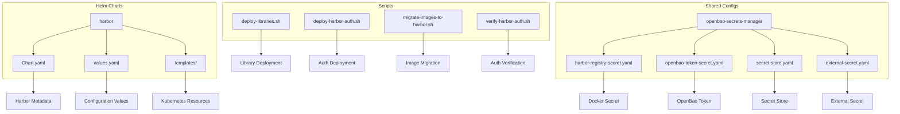
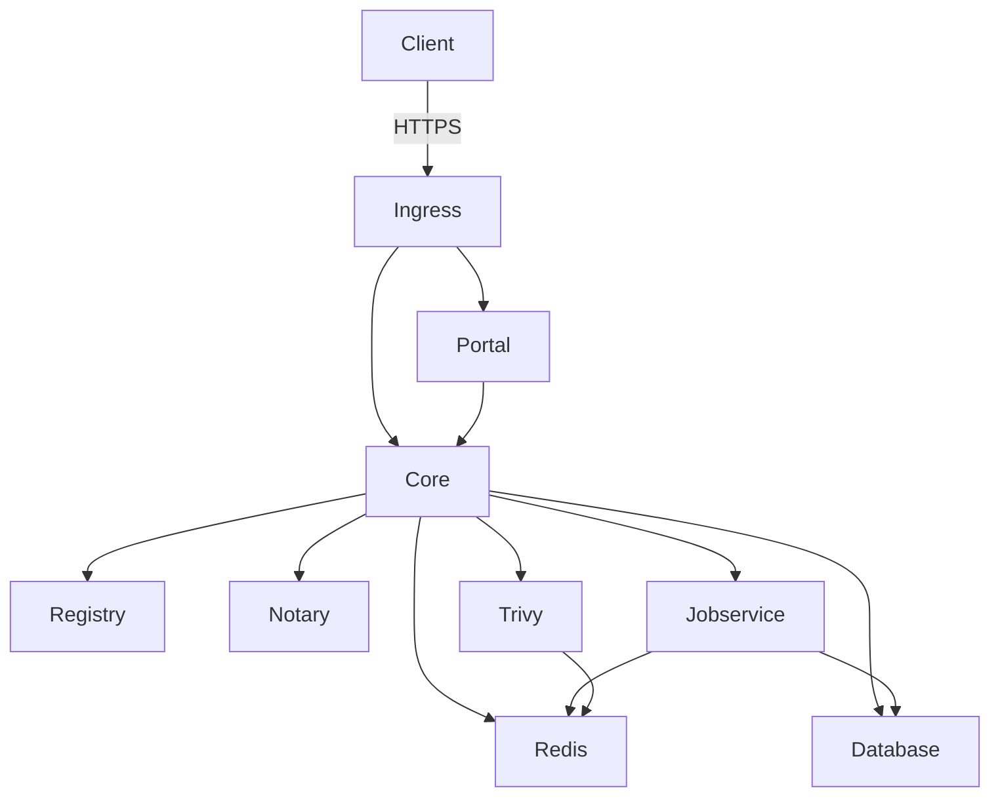
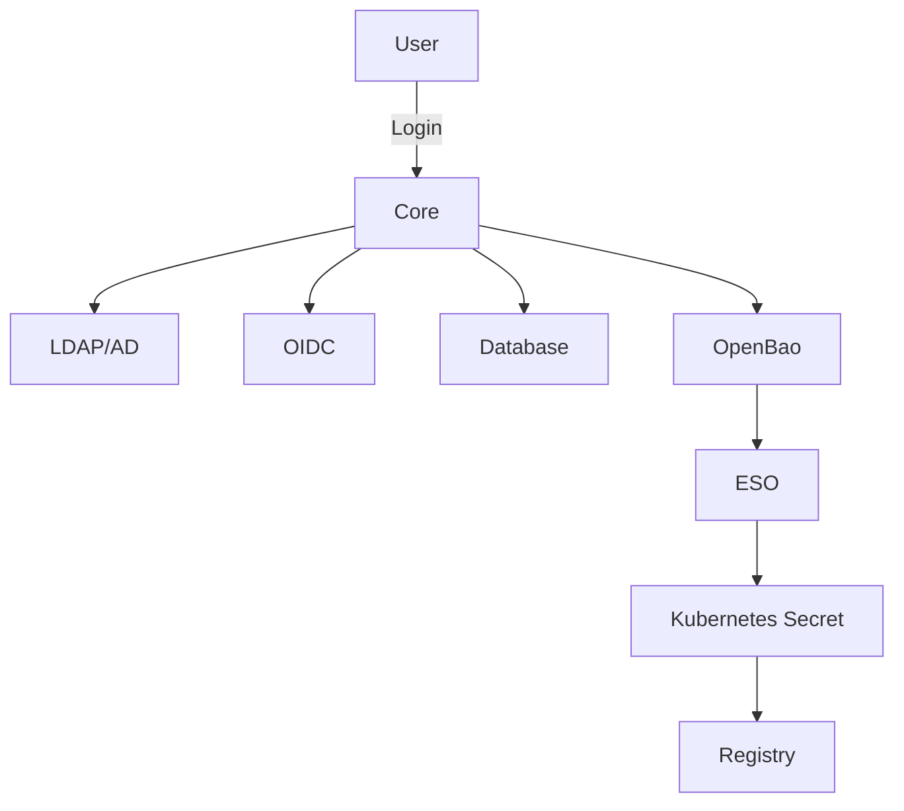
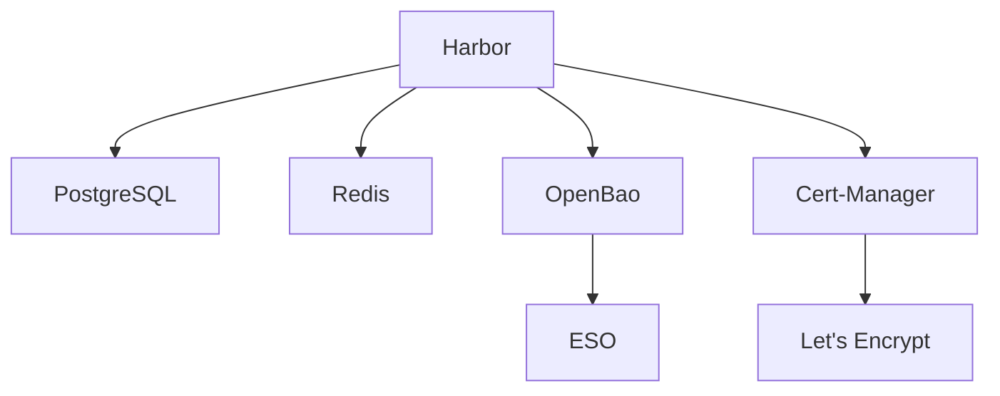

# Harbor 프라이빗 레지스트리

<cite>
**이 문서에서 참조한 파일**
- [Chart.yaml](file://helm/development-tools/harbor/Chart.yaml)
- [values.yaml](file://helm/development-tools/harbor/values.yaml)
- [deploy-libraries.sh](file://scripts/deploy-libraries.sh)
- [deploy-harbor-auth.sh](file://scripts/deploy-harbor-auth.sh)
- [migrate-images-to-harbor.sh](file://scripts/migrate-images-to-harbor.sh)
- [verify-harbor-auth.sh](file://scripts/verify-harbor-auth.sh)
- [harbor-registry-secret.yaml](file://helm/shared-configs/openbao-secrets-manager/templates/harbor-registry-secret.yaml)
- [openbao-token-secret.yaml](file://helm/shared-configs/openbao-secrets-manager/templates/openbao-token-secret.yaml)
- [secret-store.yaml](file://helm/shared-configs/openbao-secrets-manager/templates/secret-store.yaml)
- [external-secret.yaml](file://helm/shared-configs/openbao-secrets-manager/templates/external-secret.yaml)
- [values.yaml](file://helm/shared-configs/openbao-secrets-manager/values.yaml)
- [core-dpl.yaml](file://helm/development-tools/harbor/templates/core/core-dpl.yaml)
- [registry-dpl.yaml](file://helm/development-tools/harbor/templates/registry/registry-dpl.yaml)
- [jobservice-dpl.yaml](file://helm/development-tools/harbor/templates/jobservice/jobservice-dpl.yaml)
- [trivy-sts.yaml](file://helm/development-tools/harbor/templates/trivy/trivy-sts.yaml)
</cite>

## 목차
1. [소개](#소개)
2. [프로젝트 구조](#프로젝트-구조)
3. [핵심 구성 요소 분석](#핵심-구성-요소-분석)
4. [아키텍처 개요](#아키텍처-개요)
5. [상세 구성 요소 분석](#상세-구성-요소-분석)
6. [의존성 분석](#의존성-분석)
7. [성능 고려사항](#성능-고려사항)
8. [문제 해결 가이드](#문제-해결-가이드)
9. [결론](#결론)

## 소개
Harbor는 신뢰할 수 있는 클라우드 네이티브 레지스트리로서, 컨테이너 이미지 및 콘텐츠를 저장, 서명 및 스캔하는 오픈소스 솔루션입니다. 본 문서는 Helm 차트를 통해 구현된 Harbor 프라이빗 컨테이너 이미지 레지스트리의 구현 세부 사항을 설명합니다. Harbor는 쿠버네티스 환경에서 안전한 이미지 저장소를 제공하며, 인증, 권한 관리, 이미지 스캔 및 저장소 정책과 같은 다양한 보안 기능을 포함합니다.

Harbor는 Core, Registry, Notary, Trivy 등 여러 구성 요소로 구성되어 있으며, 각각의 역할과 상호작용을 통해 전체 시스템의 기능을 제공합니다. 설치 프로세스는 `deploy-libraries.sh` 스크립트를 통해 자동화되며, 이미지 마이그레이션 및 인증 검증을 위한 전용 스크립트들이 함께 제공됩니다. 또한 Harbor는 쿠버네티스 클러스터와 통합되어 이미지 풀 인증 설정을 통해 안전한 이미지 접근을 보장합니다.

## 프로젝트 구조
Harbor는 Helm 차트를 통해 쿠버네티스에 배포되며, 관련 구성 파일과 스크립트는 프로젝트의 특정 디렉터리에 위치합니다. 주요 구성 요소는 다음과 같습니다:

- `helm/development-tools/harbor/`: Harbor Helm 차트의 주요 구성 파일들
  - `Chart.yaml`: 차트의 메타데이터 및 버전 정보
  - `values.yaml`: 사용자 정의 가능한 구성 값들
  - `templates/`: 쿠버네티스 리소스를 생성하는 템플릿 파일들
- `scripts/`: Harbor 관련 운영 스크립트들
  - `deploy-libraries.sh`: 라이브러리 컴포넌트들을 배포하는 스크립트
  - `deploy-harbor-auth.sh`: Harbor 인증 ESO 리소스를 ArgoCD를 통해 배포하는 스크립트
  - `migrate-images-to-harbor.sh`: 기존 이미지를 Harbor로 마이그레이션하는 스크립트
  - `verify-harbor-auth.sh`: Harbor 인증 설정을 검증하는 스크립트
- `helm/shared-configs/openbao-secrets-manager/`: OpenBao와 ESO를 통한 비밀 관리 구성

**도표 출처**
- [Chart.yaml](file://helm/development-tools/harbor/Chart.yaml)
- [values.yaml](file://helm/development-tools/harbor/values.yaml)
- [deploy-libraries.sh](file://scripts/deploy-libraries.sh)
- [deploy-harbor-auth.sh](file://scripts/deploy-harbor-auth.sh)
- [migrate-images-to-harbor.sh](file://scripts/migrate-images-to-harbor.sh)
- [verify-harbor-auth.sh](file://scripts/verify-harbor-auth.sh)
- [harbor-registry-secret.yaml](file://helm/shared-configs/openbao-secrets-manager/templates/harbor-registry-secret.yaml)
- [openbao-token-secret.yaml](file://helm/shared-configs/openbao-secrets-manager/templates/openbao-token-secret.yaml)
- [secret-store.yaml](file://helm/shared-configs/openbao-secrets-manager/templates/secret-store.yaml)
- [external-secret.yaml](file://helm/shared-configs/openbao-secrets-manager/templates/external-secret.yaml)

**섹션 출처**
- [Chart.yaml](file://helm/development-tools/harbor/Chart.yaml)
- [values.yaml](file://helm/development-tools/harbor/values.yaml)
- [deploy-libraries.sh](file://scripts/deploy-libraries.sh)
- [deploy-harbor-auth.sh](file://scripts/deploy-harbor-auth.sh)
- [migrate-images-to-harbor.sh](file://scripts/migrate-images-to-harbor.sh)
- [verify-harbor-auth.sh](file://scripts/verify-harbor-auth.sh)
- [harbor-registry-secret.yaml](file://helm/shared-configs/openbao-secrets-manager/templates/harbor-registry-secret.yaml)
- [openbao-token-secret.yaml](file://helm/shared-configs/openbao-secrets-manager/templates/openbao-token-secret.yaml)
- [secret-store.yaml](file://helm/shared-configs/openbao-secrets-manager/templates/secret-store.yaml)
- [external-secret.yaml](file://helm/shared-configs/openbao-secrets-manager/templates/external-secret.yaml)

## 핵심 구성 요소 분석
Harbor는 여러 핵심 구성 요소로 구성되어 있으며, 각각은 특정 기능을 담당합니다. 이러한 구성 요소들은 서로 협력하여 전체 시스템의 기능을 제공합니다.

### Core
Core 서비스는 Harbor의 중심적인 역할을 하며, 사용자 인증, 프로젝트 관리, 이미지 복제 및 웹 UI 제공을 담당합니다. Core는 다른 모든 구성 요소들과 통신하며, 사용자 요청을 처리하고 상태를 관리합니다. Core는 REST API를 통해 외부와 상호작용하며, 토큰 기반 인증을 사용하여 보안을 강화합니다.

**섹션 출처**
- [core-dpl.yaml](file://helm/development-tools/harbor/templates/core/core-dpl.yaml)
- [values.yaml](file://helm/development-tools/harbor/values.yaml)

### Registry
Registry는 Docker 레지스트리 v2 구현체로, 컨테이너 이미지와 아티팩트를 저장하고 제공합니다. Registry는 이미지 푸시 및 풀 요청을 처리하며, 콘텐츠 주소 지정(content addressability) 및 계층 공유(layer sharing) 기능을 제공합니다. Registry는 Core 서비스와 통합되어 인증 및 권한 검사를 수행합니다.

**섹션 출처**
- [registry-dpl.yaml](file://helm/development-tools/harbor/templates/registry/registry-dpl.yaml)
- [values.yaml](file://helm/development-tools/harbor/values.yaml)

### Jobservice
Jobservice는 비동기 작업을 관리하는 구성 요소로, 이미지 복제, 스캔, 가비지 컬렉션 등의 작업을 처리합니다. Jobservice는 작업 큐를 사용하여 작업을 예약하고 실행하며, 작업 상태를 추적하고 로깅합니다. 이 서비스는 시스템의 유지 관리 작업을 자동화하는 데 중요한 역할을 합니다.

**섹션 출처**
- [jobservice-dpl.yaml](file://helm/development-tools/harbor/templates/jobservice/jobservice-dpl.yaml)
- [values.yaml](file://helm/development-tools/harbor/values.yaml)

### Trivy
Trivy는 오픈소스 취약점 스캐너로, 컨테이너 이미지 및 파일 시스템의 보안 취약점을 탐지합니다. Trivy는 OS 패키지 및 언어별 종속성(dependencies)에 대한 취약점을 검사하며, CVE 데이터베이스와 통합되어 최신 보안 정보를 제공합니다. Harbor는 Trivy를 통합하여 이미지 스캔 기능을 제공합니다.

**섹션 출처**
- [trivy-sts.yaml](file://helm/development-tools/harbor/templates/trivy/trivy-sts.yaml)
- [values.yaml](file://helm/development-tools/harbor/values.yaml)

## 아키텍처 개요
Harbor는 마이크로서비스 아키텍처를 기반으로 하며, 각 구성 요소는 독립적인 쿠버네티스 파드로 배포됩니다. 이러한 아키텍처는 확장성과 유지 관리성을 제공합니다. 구성 요소들은 REST API와 메시지 큐를 통해 상호작용하며, Redis와 PostgreSQL과 같은 외부 서비스를 사용하여 상태를 저장합니다.

**도표 출처**
- [core-dpl.yaml](file://helm/development-tools/harbor/templates/core/core-dpl.yaml)
- [registry-dpl.yaml](file://helm/development-tools/harbor/templates/registry/registry-dpl.yaml)
- [jobservice-dpl.yaml](file://helm/development-tools/harbor/templates/jobservice/jobservice-dpl.yaml)
- [trivy-sts.yaml](file://helm/development-tools/harbor/templates/trivy/trivy-sts.yaml)

## 상세 구성 요소 분석
각 구성 요소의 상호작용과 설정은 Harbor의 전반적인 기능과 보안을 결정합니다. 다음은 주요 구성 요소들의 상세 분석입니다.

### 인증 및 권한 관리
Harbor는 RBAC(Role-Based Access Control)를 기반으로 한 세부적인 권한 관리 시스템을 제공합니다. 사용자와 그룹은 프로젝트 수준에서 다양한 역할(관리자, 개발자, 게스트 등)을 할당받을 수 있습니다. 인증은 로컬 데이터베이스, LDAP/AD, OIDC를 통해 수행될 수 있습니다. OpenBao와 ESO(External Secrets Operator)를 통합하여 Harbor 인증 정보를 안전하게 관리합니다.

**도표 출처**
- [deploy-harbor-auth.sh](file://scripts/deploy-harbor-auth.sh)
- [harbor-registry-secret.yaml](file://helm/shared-configs/openbao-secrets-manager/templates/harbor-registry-secret.yaml)
- [openbao-token-secret.yaml](file://helm/shared-configs/openbao-secrets-manager/templates/openbao-token-secret.yaml)
- [secret-store.yaml](file://helm/shared-configs/openbao-secrets-manager/templates/secret-store.yaml)
- [external-secret.yaml](file://helm/shared-configs/openbao-secrets-manager/templates/external-secret.yaml)

**섹션 출처**
- [deploy-harbor-auth.sh](file://scripts/deploy-harbor-auth.sh)
- [harbor-registry-secret.yaml](file://helm/shared-configs/openbao-secrets-manager/templates/harbor-registry-secret.yaml)
- [openbao-token-secret.yaml](file://helm/shared-configs/openbao-secrets-manager/templates/openbao-token-secret.yaml)
- [secret-store.yaml](file://helm/shared-configs/openbao-secrets-manager/templates/secret-store.yaml)
- [external-secret.yaml](file://helm/shared-configs/openbao-secrets-manager/templates/external-secret.yaml)

### 이미지 스캔 보안 기능
Harbor는 Trivy를 통합하여 컨테이너 이미지의 보안 취약점을 스캔합니다. 이미지 푸시 후 자동 스캔이 가능하며, 스캔 결과는 UI를 통해 확인할 수 있습니다. 정책 기반 스캔을 통해 취약점 임계값을 설정하고, 높은 위험도의 취약점이 있는 이미지는 차단할 수 있습니다. 이 기능은 보안 기반 DevOps(SecDevOps) 프로세스의 핵심 요소입니다.

**섹션 출처**
- [trivy-sts.yaml](file://helm/development-tools/harbor/templates/trivy/trivy-sts.yaml)
- [values.yaml](file://helm/development-tools/harbor/values.yaml)

### 저장소 정책
Harbor는 이미지 복제, 가비지 컬렉션, 청사진(artifact) 보존 등의 저장소 정책을 제공합니다. 이미지 복제 정책을 통해 여러 Harbor 인스턴스 간에 이미지를 자동으로 동기화할 수 있습니다. 가비지 컬렉션은 사용되지 않는 이미지 계층을 정리하여 저장 공간을 절약합니다. 청사진 보존 정책은 특정 조건(태그, 생성 시간 등)에 따라 이미지를 자동으로 보관하거나 삭제할 수 있습니다.

**섹션 출처**
- [jobservice-dpl.yaml](file://helm/development-tools/harbor/templates/jobservice/jobservice-dpl.yaml)
- [values.yaml](file://helm/development-tools/harbor/values.yaml)

## 의존성 분석
Harbor는 여러 외부 서비스와 통합되어 작동합니다. 주요 의존성은 다음과 같습니다:

- **PostgreSQL**: 메타데이터 저장을 위한 외부 데이터베이스
- **Redis**: 세션 저장 및 캐싱을 위한 외부 캐시 서버
- **OpenBao**: 비밀 정보 저장 및 관리를 위한 외부 비밀 관리 도구
- **ESO(External Secrets Operator)**: 쿠버네티스 외부의 비밀 정보를 쿠버네티스 Secret으로 동기화하는 오퍼레이터
- **Cert-Manager**: TLS 인증서 자동 관리를 위한 쿠버네티스 오퍼레이터

**도표 출처**
- [values.yaml](file://helm/development-tools/harbor/values.yaml)
- [deploy-libraries.sh](file://scripts/deploy-libraries.sh)

**섹션 출처**
- [values.yaml](file://helm/development-tools/harbor/values.yaml)
- [deploy-libraries.sh](file://scripts/deploy-libraries.sh)

## 성능 고려사항
Harbor의 성능은 여러 요인에 의해 영향을 받습니다. 주요 고려사항은 다음과 같습니다:

- **스토리지 백엔드**: 이미지 저장을 위한 스토리지 백엔드는 성능에 큰 영향을 미칩니다. 로컬 파일 시스템, S3, GCS 등의 선택이 중요합니다.
- **캐싱**: Redis를 사용한 캐싱은 높은 동시성 환경에서 성능을 크게 향상시킬 수 있습니다.
- **확장성**: Core, Registry, Jobservice 등의 구성 요소는 필요에 따라 복제(replica) 수를 조정하여 확장할 수 있습니다.
- **네트워크**: 이미지 푸시/풀은 대량의 데이터 전송을 수반하므로, 네트워크 대역폭과 지연 시간이 중요합니다.

**섹션 출처**
- [values.yaml](file://helm/development-tools/harbor/values.yaml)

## 문제 해결 가이드
Harbor 운영 중 발생할 수 있는 일반적인 문제와 해결 방법은 다음과 같습니다:

### 인증 문제
- **문제**: Harbor에 로그인할 수 없음
- **해결**: OpenBao 토큰이 올바르게 설정되었는지 확인하고, ESO가 정상적으로 작동하는지 확인합니다.
- **스크립트**: `verify-harbor-auth.sh`를 실행하여 인증 설정을 검증합니다.

### 이미지 풀 문제
- **문제**: 쿠버네티스에서 Harbor 이미지를 풀할 수 없음
- **해결**: `harbor-docker-secret`이 올바르게 생성되었는지 확인하고, 서비스 어카운트에 연결되었는지 확인합니다.
- **스크립트**: `verify-harbor-auth.sh`를 실행하여 이미지 풀 테스트를 수행합니다.

### 설치 문제
- **문제**: Helm 설치 중 오류 발생
- **해결**: 필요한 CRD가 모두 설치되었는지 확인하고, 네임스페이스가 올바르게 생성되었는지 확인합니다.
- **스크립트**: `deploy-libraries.sh`를 통해 필요한 라이브러리들을 먼저 설치합니다.

**섹션 출처**
- [deploy-harbor-auth.sh](file://scripts/deploy-harbor-auth.sh)
- [verify-harbor-auth.sh](file://scripts/verify-harbor-auth.sh)
- [deploy-libraries.sh](file://scripts/deploy-libraries.sh)

## 결론
Harbor는 기업용 컨테이너 이미지 레지스트리로서, 보안, 신뢰성, 확장성을 제공하는 강력한 솔루션입니다. Helm을 통한 배포는 설치와 관리를 단순화하며, OpenBao와 ESO를 통합하여 비밀 정보를 안전하게 관리할 수 있습니다. 이미지 스캔, 복제, 저장소 정책 등의 기능은 DevOps 프로세스의 보안과 효율성을 크게 향상시킵니다. 본 문서에서 설명한 설치, 구성, 운영 가이드를 따르면 안정적인 Harbor 환경을 구축하고 유지 관리할 수 있습니다.