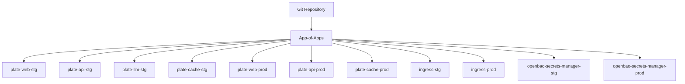
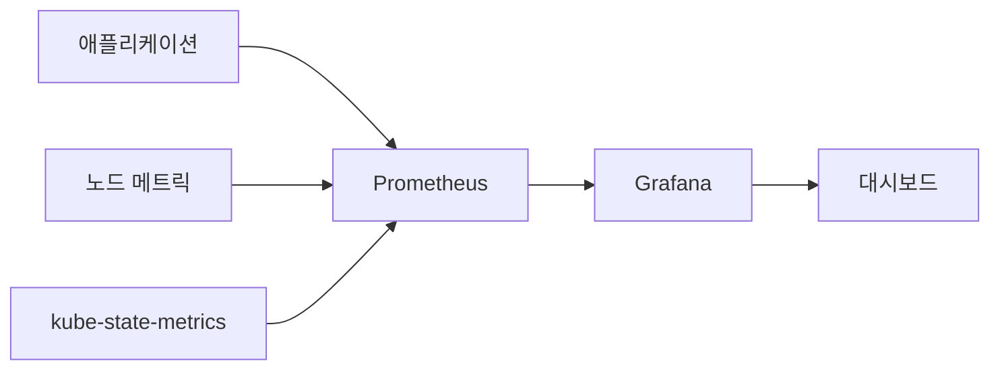
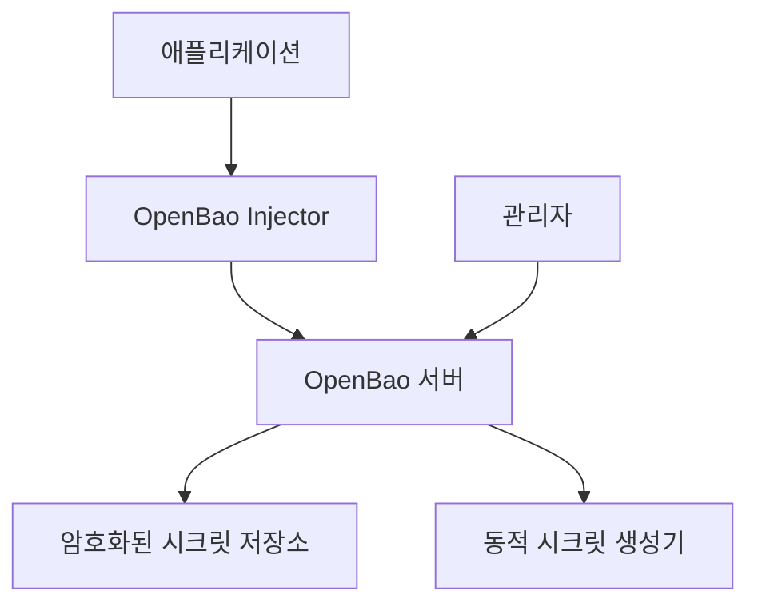

# 구현 하이라이트

<cite>
**이 문서에서 참조한 파일**  
- [README.md](file://README.md)
- [app-of-apps.yaml](file://environments/argocd/app-of-apps.yaml)
- [argocd/Chart.yaml](file://helm/development-tools/argocd/Chart.yaml)
- [harbor/Chart.yaml](file://helm/development-tools/harbor/Chart.yaml)
- [prometheus/Chart.yaml](file://helm/development-tools/prometheus/Chart.yaml)
- [grafana/Chart.yaml](file://helm/development-tools/grafana/Chart.yaml)
- [jenkins/Chart.yaml](file://helm/development-tools/jenkins/Chart.yaml)
- [fluentd/Chart.yaml](file://helm/development-tools/fluentd/Chart.yaml)
- [openbao/Chart.yaml](file://helm/development-tools/openbao/Chart.yaml)
- [plate-api/Chart.yaml](file://helm/applications/plate-api/Chart.yaml)
- [plate-web/Chart.yaml](file://helm/applications/plate-web/Chart.yaml)
- [plate-llm/Chart.yaml](file://helm/applications/plate-llm/Chart.yaml)
- [plate-cache/Chart.yaml](file://helm/applications/plate-cache/Chart.yaml)
- [deploy-all.sh](file://scripts/deploy-all.sh)
- [deploy-libraries.sh](file://scripts/deploy-libraries.sh)
- [deploy-stg.sh](file://scripts/deploy-stg.sh)
- [deploy-prod.sh](file://scripts/deploy-prod.sh)
</cite>

## 목차
1. [소개](#소개)
2. [App-of-Apps 패턴 구현](#app-of-apps-패턴-구현)
3. [Harbor 기반 프라이빗 이미지 레지스트리 운영](#harbor-기반-프라이빗-이미지-레지스트리-운영)
4. [Prometheus와 Grafana 모니터링 스택](#prometheus와-grafana-모니터링-스택)
5. [Jenkins 기반 CI/CD 통합](#jenkins-기반-cicd-통합)
6. [Fluentd를 통한 중앙 집중식 로깅](#fluentd를-통한-중앙-집중식-로깅)
7. [OpenBao를 활용한 시크릿 관리](#openbao를-활용한-시크릿-관리)
8. [배포 자동화 스크립트](#배포-자동화-스크립트)
9. [결론](#결론)

## 소개

prj-devops 프로젝트는 Helm 차트 기반의 프로덕션 레디 Kubernetes 배포 구조를 제공하는 DevOps 솔루션으로, GitOps 원칙에 따라 인프라 및 애플리케이션을 선언적으로 관리합니다. 이 문서는 프로젝트의 핵심 기능 구현 방식을 상세히 설명하며, ArgoCD, Harbor, Prometheus, Grafana, Jenkins, Fluentd, OpenBao 등 주요 구성 요소의 실제 구현 세부 사항을 다룹니다. 각 구성 요소는 Helm 차트로 패키징되어 있으며, 환경별 설정과 함께 일관된 방식으로 배포됩니다.

**구현 하이라이트**
- **App-of-Apps 패턴**: ArgoCD를 통해 다계층 애플리케이션을 중앙에서 관리
- **프라이빗 이미지 레지스트리**: Harbor를 활용한 안전한 이미지 저장 및 배포
- **모니터링 스택**: Prometheus와 Grafana로 구성된 실시간 모니터링 시스템
- **CI/CD 파이프라인**: Jenkins 기반의 지속적 통합 및 배포 자동화
- **중앙 집중식 로깅**: Fluentd를 통한 로그 수집 및 집약
- **시크릿 관리**: OpenBao를 활용한 민감 정보 보안 관리

## App-of-Apps 패턴 구현

ArgoCD는 GitOps 기반의 선언적 지속적 배포 도구로, 이 프로젝트에서는 App-of-Apps 패턴을 통해 전체 애플리케이션 스택을 계층적으로 관리합니다. `environments/argocd/app-of-apps.yaml` 파일은 모든 하위 애플리케이션을 관리하는 최상위 ArgoCD 애플리케이션으로, `environments/argocd/apps/` 디렉터리에 정의된 개별 애플리케이션들을 자동으로 동기화합니다.

이 패턴은 다음과 같은 장점을 제공합니다:
- **자동 동기화**: Git 저장소의 변경 사항을 감지하고 자동으로 클러스터에 반영
- **자기 치유(Self-Healing)**: 클러스터 상태가 선언된 상태와 다를 경우 자동으로 수정
- **프루닝(Pruning)**: 선언되지 않은 리소스를 자동으로 제거하여 일관성 유지
- **환경 분리**: 스테이징과 프로덕션 환경을 별도의 애플리케이션으로 관리

**다이어그램 출처**
- [app-of-apps.yaml](file://environments/argocd/app-of-apps.yaml#L1-L35)
- [environments/argocd/apps/](file://environments/argocd/apps/)

**섹션 출처**
- [app-of-apps.yaml](file://environments/argocd/app-of-apps.yaml#L1-L35)
- [README.md](file://README.md#L356-L407)

## Harbor 기반 프라이빗 이미지 레지스트리 운영

Harbor는 오픈소스 클라우드 네이티브 레지스트리로, 컨테이너 이미지의 저장, 서명, 스캔 기능을 제공합니다. 이 프로젝트에서는 `helm/development-tools/harbor/Chart.yaml`을 통해 Harbor를 Helm 차트로 배포하며, 프라이빗 이미지 저장소를 안정적으로 운영합니다.

주요 기능 및 설정:
- **이미지 보안 스캔**: Trivy 기반의 취약점 스캔
- **역할 기반 접근 제어(RBAC)**: 사용자 및 팀별 접근 권한 관리
- **복제 기능**: 멀티 클러스터 간 이미지 복제
- **LDAP/AD 통합**: 기존 인증 시스템과의 통합
- **HTTPS 강제**: SSL/TLS를 통한 안전한 통신 보장

Harbor는 `deploy-libraries.sh` 스크립트를 통해 클러스터 서비스와 함께 배포되며, 이후 모든 애플리케이션의 컨테이너 이미지는 이 레지스트리에 저장되어 안전하게 관리됩니다.

**섹션 출처**
- [harbor/Chart.yaml](file://helm/development-tools/harbor/Chart.yaml#L1-L25)
- [README.md](file://README.md#L36-L37)
- [deploy-libraries.sh](file://scripts/deploy-libraries.sh#L73-L82)

## Prometheus와 Grafana 모니터링 스택

이 프로젝트는 Prometheus와 Grafana로 구성된 강력한 모니터링 스택을 제공합니다. Prometheus는 메트릭 수집 및 저장을 담당하며, Grafana는 수집된 데이터를 시각화하여 실시간 대시보드를 제공합니다.

### Prometheus 구성
`helm/development-tools/prometheus/Chart.yaml`은 Prometheus의 핵심 구성 요소들을 포함하며, 다음과 같은 의존성을 가집니다:
- **Alertmanager**: 경고 알림 관리
- **kube-state-metrics**: 쿠버네티스 상태 메트릭 수집
- **node-exporter**: 노드 수준 메트릭 수집
- **pushgateway**: 배치 작업 메트릭 수집

### Grafana 구성
`helm/development-tools/grafana/Chart.yaml`은 Grafana 대시보드를 Helm을 통해 관리하며, Prometheus를 기본 데이터 소스로 설정합니다. 사용자 정의 대시보드는 JSON 형식으로 정의되어 Git에 저장되며, 형상 관리가 가능합니다.

**다이어그램 출처**
- [prometheus/Chart.yaml](file://helm/development-tools/prometheus/Chart.yaml#L1-L59)
- [grafana/Chart.yaml](file://helm/development-tools/grafana/Chart.yaml#L1-L36)

**섹션 출처**
- [prometheus/Chart.yaml](file://helm/development-tools/prometheus/Chart.yaml#L1-L59)
- [grafana/Chart.yaml](file://helm/development-tools/grafana/Chart.yaml#L1-L36)
- [README.md](file://README.md#L38-L39)

## Jenkins 기반 CI/CD 통합

Jenkins는 지속적 통합 및 지속적 배포(CI/CD)를 위한 오픈소스 자동화 서버로, 이 프로젝트에서는 `helm/development-tools/jenkins/Chart.yaml`을 통해 Helm으로 배포됩니다. Jenkins는 코드 빌드, 테스트, 이미지 빌드, 배포 파이프라인을 자동화하며, 전체 DevOps 워크플로우의 핵심 역할을 수행합니다.

주요 특징:
- **Jenkinsfile 기반 파이프라인**: 코드로 정의된 CI/CD 파이프라인
- **Kubernetes 플러그인**: 동적 에이전트 프로비저닝
- **Configuration as Code (JCasC)**: Jenkins 설정의 형상 관리
- **보안 플러그인**: 역할 기반 접근 제어 및 보안 강화

Jenkins는 `deploy-libraries.sh` 스크립트를 통해 초기 배포되며, 이후 모든 애플리케이션의 CI/CD 파이프라인이 이 인스턴스에서 실행됩니다.

**섹션 출처**
- [jenkins/Chart.yaml](file://helm/development-tools/jenkins/Chart.yaml#L1-L50)
- [deploy-libraries.sh](file://scripts/deploy-libraries.sh#L73-L82)
- [README.md](file://README.md#L39)

## Fluentd를 통한 중앙 집중식 로깅

Fluentd는 오픈소스 데이터 수집기로, 쿠버네티스 클러스터 내의 모든 컨테이너 로그를 수집하여 중앙 집중식으로 관리합니다. `helm/development-tools/fluentd/Chart.yaml`은 Fluentd를 데몬셋으로 배포하여 각 노드에 에이전트를 설치하고, 로그를 일관된 형식으로 수집합니다.

로그 수집 및 전달 흐름:
1. **노드별 수집**: Fluentd 데몬셋이 각 노드의 컨테이너 로그를 수집
2. **형식화 및 필터링**: JSON 형식으로 변환 및 불필요한 로그 필터링
3. **중앙 저장소 전달**: 수집된 로그를 Elasticsearch, Loki 등으로 전달
4. **시각화**: Grafana를 통해 로그 데이터 시각화

이 구조는 문제 진단 및 감사 추적을 위한 로그의 일관성과 접근성을 보장합니다.

**섹션 출처**
- [fluentd/Chart.yaml](file://helm/development-tools/fluentd/Chart.yaml#L1-L16)
- [README.md](file://README.md#L40)

## OpenBao를 활용한 시크릿 관리

OpenBao는 민감 정보(시크릿)를 안전하게 저장하고 관리하는 도구로, 이 프로젝트에서는 `helm/development-tools/openbao/Chart.yaml`을 통해 배포됩니다. OpenBao는 데이터베이스 자격 증명, API 키, 암호화 키 등의 시크릿을 암호화하여 저장하고, 필요 시에만 접근을 허용합니다.

주요 기능:
- **동적 시크릿 생성**: 데이터베이스 자격 증명 등 동적 시크릿 제공
- **자동 만료 및 회전**: 시크릿의 수명 주기 자동 관리
- **감사 로깅**: 모든 시크릿 접근 기록 추적
- **Kubernetes 통합**: 쿠버네티스 네이티브 방식으로 시크릿 주입

`shared-configs/openbao-secrets-manager/` 디렉터리에는 OpenBao와 통합된 시크릿 매니저 설정이 포함되어 있으며, 애플리케이션은 이 시스템을 통해 안전하게 시크릿을 사용합니다.

**다이어그램 출처**
- [openbao/Chart.yaml](file://helm/development-tools/openbao/Chart.yaml#L1-L26)
- [shared-configs/openbao-secrets-manager/](file://helm/shared-configs/openbao-secrets-manager/)

**섹션 출처**
- [openbao/Chart.yaml](file://helm/development-tools/openbao/Chart.yaml#L1-L26)
- [README.md](file://README.md#L41)

## 배포 자동화 스크립트

이 프로젝트는 `scripts/` 디렉터리에 위치한 일련의 배포 자동화 스크립트를 통해 복잡한 배포 프로세스를 단순화합니다. 주요 스크립트는 다음과 같습니다:

- **deploy-all.sh**: 전체 컴포넌트 배포를 오케스트레이션
- **deploy-libraries.sh**: 클러스터 서비스 및 개발 도구 배포
- **deploy-stg.sh**: 스테이징 환경 전용 배포
- **deploy-prod.sh**: 프로덕션 환경 안전 배포

### deploy-all.sh
메인 오케스트레이션 스크립트로, 환경과 옵션에 따라 라이브러리 및 애플리케이션을 순차적으로 배포합니다. 드라이런 모드, 라이브러리 전용 배포, 애플리케이션 전용 배포 등의 옵션을 지원합니다.

### deploy-prod.sh
프로덕션 배포를 위한 안전장치가 포함된 스크립트로, 다음과 같은 기능을 제공합니다:
- **사용자 확인**: 배포 전 명시적 확인 요청
- **자동 백업**: 기존 배포 상태의 자동 백업
- **건강 상태 검사**: 배포 후 자동 헬스 체크
- **롤백 지원**: 이전 리비전으로의 롤백 기능

이러한 스크립트들은 배포의 일관성과 안정성을 보장하며, 인적 오류를 최소화합니다.

**섹션 출처**
- [deploy-all.sh](file://scripts/deploy-all.sh#L1-L279)
- [deploy-libraries.sh](file://scripts/deploy-libraries.sh#L1-L128)
- [deploy-stg.sh](file://scripts/deploy-stg.sh#L1-L173)
- [deploy-prod.sh](file://scripts/deploy-prod.sh#L1-L299)
- [README.md](file://README.md#L102-L153)

## 결론

prj-devops 프로젝트는 현대적인 클라우드 네이티브 환경을 위한 포괄적인 DevOps 솔루션을 제공합니다. ArgoCD의 App-of-Apps 패턴을 통한 GitOps 기반 배포, Harbor를 활용한 안전한 이미지 관리, Prometheus와 Grafana로 구성된 강력한 모니터링 스택, Jenkins 기반의 CI/CD 통합, Fluentd를 통한 중앙 집중식 로깅, OpenBao를 활용한 시크릿 관리 등 핵심 구성 요소들이 유기적으로 결합되어 프로덕션 레벨의 안정성과 보안을 보장합니다.

모든 구성 요소는 Helm 차트로 패키징되어 있으며, `scripts/` 디렉터리의 자동화 스크립트를 통해 일관되고 안정적인 배포가 가능합니다. 이 구조는 확장성과 유지보수성을 극대화하며, 다양한 규모의 애플리케이션에 적용할 수 있는 유연한 DevOps 인프라를 제공합니다.