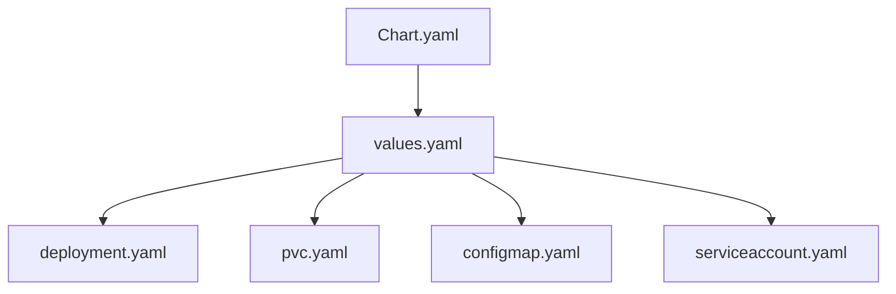
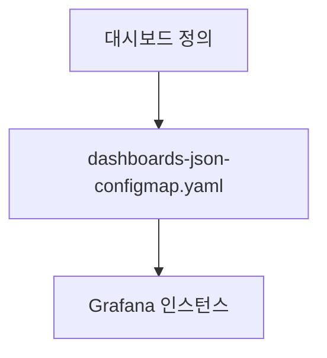
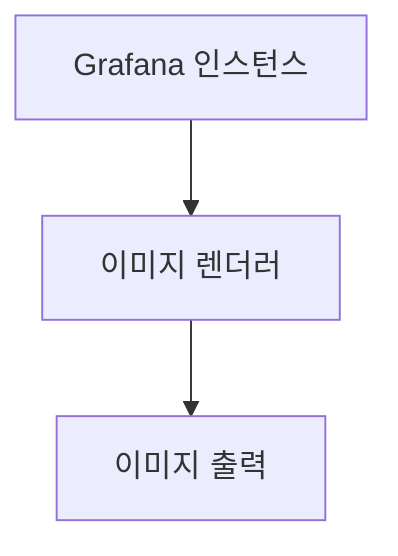

# Grafana 구현

<cite>
**이 문서에서 참조된 파일**   
- [Chart.yaml](file://helm/development-tools/grafana/Chart.yaml)
- [values.yaml](file://helm/development-tools/grafana/values.yaml)
- [deployment.yaml](file://helm/development-tools/grafana/templates/deployment.yaml)
- [pvc.yaml](file://helm/development-tools/grafana/templates/pvc.yaml)
- [configmap.yaml](file://helm/development-tools/grafana/templates/configmap.yaml)
- [configmap-dashboard-provider.yaml](file://helm/development-tools/grafana/templates/configmap-dashboard-provider.yaml)
- [dashboards-json-configmap.yaml](file://helm/development-tools/grafana/templates/dashboards-json-configmap.yaml)
- [image-renderer-deployment.yaml](file://helm/development-tools/grafana/templates/image-renderer-deployment.yaml)
- [serviceaccount.yaml](file://helm/development-tools/grafana/templates/serviceaccount.yaml)
</cite>

## 목차
1. [소개](#소개)
2. [배포 구조](#배포-구조)
3. [데이터 소스 자동 등록](#데이터-소스-자동-등록)
4. [대시보드 선언적 관리](#대시보드-선언적-관리)
5. [영구 저장소(PVC)를 통한 설정 유지](#영구-저장소pvc를-통한-설정-유지)
6. [이미지 렌더러 통합](#이미지-렌더러-통합)
7. [인증 연동 및 서비스 계정](#인증-연동-및-서비스-계정)
8. [values.yaml 기반 커스터마이징 전략](#valuesyaml-기반-커스터마이징-전략)

## 소개
Grafana는 시계열 데이터 및 메트릭을 시각화하고 쿼리하는 데 사용되는 주요 도구입니다. 이 문서는 Helm 차트를 기반으로 Grafana를 구현하는 방법을 상세히 설명합니다. Chart.yaml에서 정의된 배포 구조와 values.yaml을 통한 데이터 소스 자동 등록 기능을 다루며, 대시보드의 선언적 관리 방식과 configmap을 통한 대시보드 임포트 메커니즘을 설명합니다. 또한 영구 저장소(PVC)를 사용한 설정 유지 방법, 이미지 렌더러 통합, 인증 연동 설정 및 서비스 계정을 통한 API 접근 방법을 포함합니다.

## 배포 구조
Grafana Helm 차트는 Chart.yaml 파일을 통해 배포 구조를 정의합니다. 이 파일은 애플리케이션 버전, 설명, 유지 관리자 정보, 종속성 등을 포함합니다. Grafana Helm 차트는 Kubernetes 클러스터에서 Grafana 인스턴스를 배포하기 위한 템플릿과 설정을 제공합니다.



**Diagram sources**
- [Chart.yaml](file://helm/development-tools/grafana/Chart.yaml)
- [values.yaml](file://helm/development-tools/grafana/values.yaml)
- [deployment.yaml](file://helm/development-tools/grafana/templates/deployment.yaml)
- [pvc.yaml](file://helm/development-tools/grafana/templates/pvc.yaml)
- [configmap.yaml](file://helm/development-tools/grafana/templates/configmap.yaml)
- [serviceaccount.yaml](file://helm/development-tools/grafana/templates/serviceaccount.yaml)

**Section sources**
- [Chart.yaml](file://helm/development-tools/grafana/Chart.yaml)

## 데이터 소스 자동 등록
values.yaml 파일을 통해 Grafana에 데이터 소스를 자동으로 등록할 수 있습니다. datasources 섹션에서 데이터 소스의 이름, 유형, URL, 접근 방식 등을 정의할 수 있습니다. 이 설정을 통해 Grafana가 시작될 때 자동으로 데이터 소스를 구성할 수 있습니다.

```yaml
datasources:
  datasources.yaml:
    apiVersion: 1
    datasources:
      - name: Prometheus
        type: prometheus
        url: http://prometheus-prometheus-server
        access: proxy
        isDefault: true
```

**Section sources**
- [values.yaml](file://helm/development-tools/grafana/values.yaml#L673-L695)

## 대시보드 선언적 관리
Grafana Helm 차트는 대시보드를 선언적으로 관리할 수 있는 기능을 제공합니다. values.yaml 파일의 dashboards 섹션을 통해 대시보드를 정의하고, configmap을 통해 대시보드를 임포트할 수 있습니다. 이 방식은 대시보드를 코드로 관리하고 버전 관리 시스템에 저장할 수 있게 해줍니다.



**Diagram sources**
- [dashboards-json-configmap.yaml](file://helm/development-tools/grafana/templates/dashboards-json-configmap.yaml)
- [values.yaml](file://helm/development-tools/grafana/values.yaml#L1-800)

**Section sources**
- [values.yaml](file://helm/development-tools/grafana/values.yaml#L1-800)
- [dashboards-json-configmap.yaml](file://helm/development-tools/grafana/templates/dashboards-json-configmap.yaml)

## 영구 저장소(PVC)를 통한 설정 유지
Grafana의 설정과 데이터를 유지하기 위해 영구 저장소(Persistent Volume Claim, PVC)를 사용할 수 있습니다. values.yaml 파일의 persistence 섹션을 통해 PVC를 구성할 수 있으며, 이는 Grafana 인스턴스가 재시작되더라도 설정과 데이터를 유지할 수 있게 해줍니다.

```yaml
persistence:
  enabled: true
  type: pvc
  accessModes:
    - ReadWriteOnce
  size: 10Gi
  storageClassName: openebs-hostpath
```

**Section sources**
- [values.yaml](file://helm/development-tools/grafana/values.yaml#L422-L441)
- [pvc.yaml](file://helm/development-tools/grafana/templates/pvc.yaml)

## 이미지 렌더러 통합
Grafana는 이미지 렌더러를 통합하여 대시보드를 이미지로 내보낼 수 있는 기능을 제공합니다. values.yaml 파일의 imageRenderer 섹션을 통해 이미지 렌더러를 구성할 수 있으며, 이는 Grafana 인스턴스와 함께 배포됩니다.



**Diagram sources**
- [image-renderer-deployment.yaml](file://helm/development-tools/grafana/templates/image-renderer-deployment.yaml)
- [values.yaml](file://helm/development-tools/grafana/values.yaml#L1-800)

**Section sources**
- [values.yaml](file://helm/development-tools/grafana/values.yaml#L1-800)
- [image-renderer-deployment.yaml](file://helm/development-tools/grafana/templates/image-renderer-deployment.yaml)

## 인증 연동 및 서비스 계정
Grafana는 다양한 인증 방식과 연동할 수 있으며, 서비스 계정을 통해 API에 접근할 수 있습니다. values.yaml 파일의 serviceAccount 섹션을 통해 서비스 계정을 구성할 수 있으며, 이는 Grafana 인스턴스가 Kubernetes API에 접근할 수 있게 해줍니다.

```yaml
serviceAccount:
  create: true
  name: grafana-serviceaccount
  automountServiceAccountToken: true
```

**Section sources**
- [values.yaml](file://helm/development-tools/grafana/values.yaml#L35-L47)
- [serviceaccount.yaml](file://helm/development-tools/grafana/templates/serviceaccount.yaml)

## values.yaml 기반 커스터마이징 전략
values.yaml 파일은 Grafana Helm 차트의 다양한 설정을 커스터마이징할 수 있는 핵심 파일입니다. 이 파일을 통해 데이터 소스, 대시보드, PVC, 이미지 렌더러, 서비스 계정 등을 구성할 수 있으며, 다양한 환경(예: 개발, 스테이징, 프로덕션)에 맞게 설정을 조정할 수 있습니다.

```yaml
# 예: 프로덕션 환경을 위한 values-prod.yaml
replicas: 3
resources:
  limits:
    cpu: 500m
    memory: 1Gi
  requests:
    cpu: 200m
    memory: 512Mi
```

**Section sources**
- [values.yaml](file://helm/development-tools/grafana/values.yaml#L1-800)