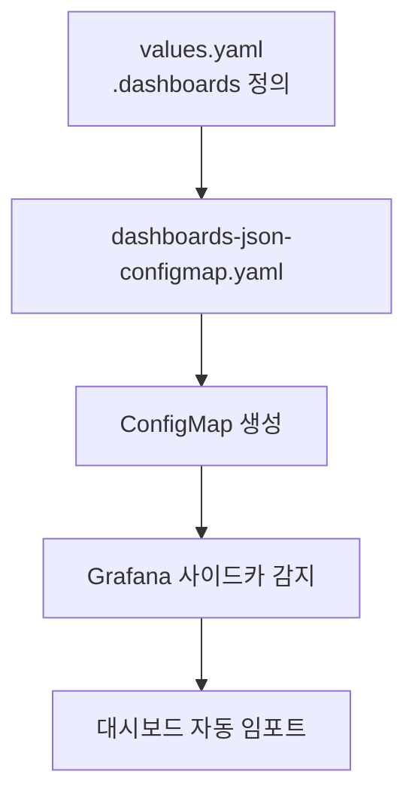
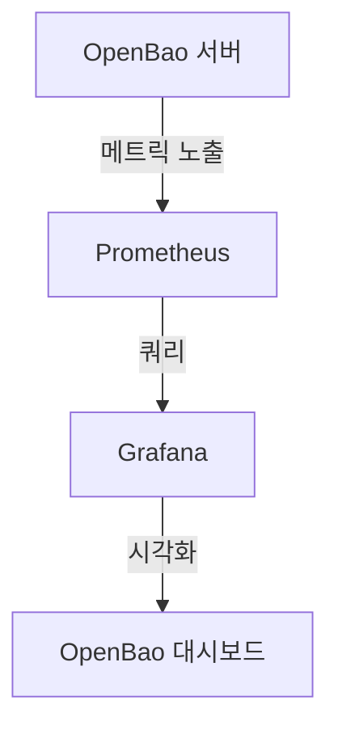
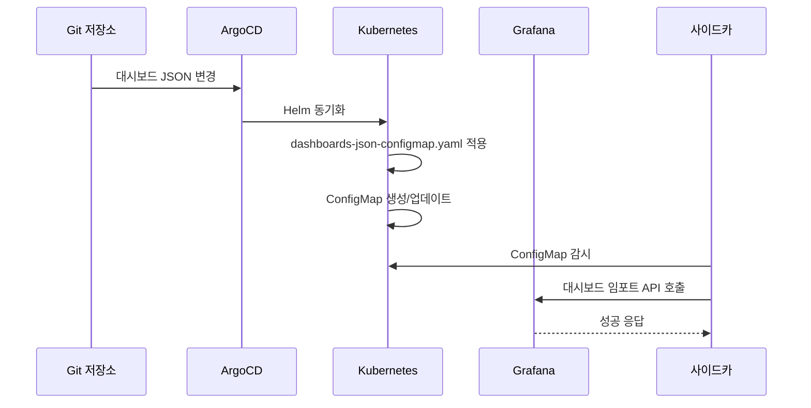

# 대시보드 관리

<cite>
**이 문서에서 참조한 파일**  
- [dashboards-json-configmap.yaml](file://helm/development-tools/grafana/templates/dashboards-json-configmap.yaml)
- [values.yaml](file://helm/development-tools/grafana/values.yaml)
- [dashboard.json](file://helm/development-tools/openbao/grafana/dashboards/dashboard.json)
- [openbao-secrets-manager-prod.yaml](file://environments/argocd/apps/openbao-secrets-manager-prod.yaml)
- [configmap-dashboard-provider.yaml](file://helm/development-tools/grafana/templates/configmap-dashboard-provider.yaml)
</cite>

## 목차
1. [소개](#소개)
2. [대시보드 선언적 관리 개요](#대시보드-선언적-관리-개요)
3. [dashboards-json-configmap.yaml을 통한 대시보드 정의](#dashboards-json-configmapyaml을-통한-대시보드-정의)
4. [values.yaml을 통한 대시보드 설정 오버라이드](#valuesyaml을-통한-대시보드-설정-오버라이드)
5. [OpenBao 연동 대시보드 구조 및 메트릭 수집](#openbao-연동-대시보드-구조-및-메트릭-수집)
6. [ConfigMap을 통한 대시보드 자동 임포트 및 업데이트](#configmap을-통한-대시보드-자동-임포트-및-업데이트)
7. [사용자 정의 대시보드 추가 절차 및 Best Practices](#사용자-정의-대시보드-추가-절차-및-best-practices)
8. [결론](#결론)

## 소개
이 문서는 Grafana 대시보드의 선언적 관리 방식에 대해 상세히 설명합니다. 특히, Helm 차트를 기반으로 한 `dashboards-json-configmap.yaml`을 통한 대시보드 정의 방법과 `values.yaml`에서의 설정 오버라이드 전략을 다룹니다. 또한 OpenBao와 연동된 대시보드의 구조와 메트릭 수집 방식, ConfigMap을 통한 자동 임포트 및 업데이트 메커니즘을 설명하며, 사용자 정의 대시보드 추가를 위한 절차와 모범 사례를 제공합니다.

**대시보드-선언적-관리-개요**
- [dashboards-json-configmap.yaml](file://helm/development-tools/grafana/templates/dashboards-json-configmap.yaml#L1-L36)
- [values.yaml](file://helm/development-tools/grafana/values.yaml#L1-L800)

## 대시보드 선언적 관리 개요
Grafana 대시보드는 Kubernetes 환경에서 Helm 차트를 통해 선언적으로 관리됩니다. 이 방식은 대시보드 정의를 코드로 관리함으로써 버전 관리, 반복 가능한 배포, 변경 사항 추적 등의 이점을 제공합니다. 주요 구성 요소로는 `dashboards-json-configmap.yaml`, `values.yaml`, 그리고 실제 대시보드 JSON 파일이 있습니다.

이러한 선언적 접근은 DevOps 환경에서 대시보드의 일관성과 신뢰성을 보장하며, GitOps 기반의 배포 파이프라인과 잘 통합됩니다.

**대시보드-선언적-관리-개요**
- [dashboards-json-configmap.yaml](file://helm/development-tools/grafana/templates/dashboards-json-configmap.yaml#L1-L36)
- [values.yaml](file://helm/development-tools/grafana/values.yaml#L1-L800)

## dashboards-json-configmap.yaml을 통한 대시보드 정의
`dashboards-json-configmap.yaml`은 Helm 템플릿 파일로, `.Values.dashboards`에 정의된 대시보드를 ConfigMap으로 생성합니다. 이 ConfigMap은 Grafana의 사이드카 컨테이너에 의해 감지되어 자동으로 대시보드로 임포트됩니다.

주요 기능은 다음과 같습니다:
- 여러 대시보드 공급자(provider)를 지원하며, 각각 별도의 ConfigMap으로 생성됩니다.
- 대시보드는 `json` 필드에 직접 포함되거나, `file` 필드를 통해 외부 JSON 파일을 참조할 수 있습니다.
- ConfigMap의 데이터는 `.json` 확장자를 가진 키로 저장되며, Grafana가 이를 인식합니다.

이 메커니즘은 대시보드 정의를 선언적으로 관리하고, Git 저장소를 통해 버전 관리할 수 있게 합니다.



**Diagram sources**
- [dashboards-json-configmap.yaml](file://helm/development-tools/grafana/templates/dashboards-json-configmap.yaml#L1-L36)

**Section sources**
- [dashboards-json-configmap.yaml](file://helm/development-tools/grafana/templates/dashboards-json-configmap.yaml#L1-L36)
- [values.yaml](file://helm/development-tools/grafana/values.yaml#L1-L800)

## values.yaml을 통한 대시보드 설정 오버라이드
`values.yaml` 파일은 Grafana Helm 차트의 구성 값을 정의하며, 대시보드 설정을 오버라이드하는 데 핵심적인 역할을 합니다. 사용자는 `dashboards` 섹션을 통해 원하는 대시보드를 정의하고, 환경별로 다른 `values` 파일(예: `values-production.yaml`)을 사용하여 설정을 오버라이드할 수 있습니다.

예시:
```yaml
dashboards:
  default:
    openbao-dashboard:
      file: dashboards/openbao.json
      revision: 1
      editable: true
```

이 방식은 다양한 환경(개발, 스테이징, 프로덕션)에서 동일한 기본 설정을 유지하면서도, 환경별로 필요한 대시보드만 선택적으로 활성화하거나 수정할 수 있게 합니다.

**Section sources**
- [values.yaml](file://helm/development-tools/grafana/values.yaml#L1-L800)
- [openbao-secrets-manager-prod.yaml](file://environments/argocd/apps/openbao-secrets-manager-prod.yaml#L1-L80)

## OpenBao 연동 대시보드 구조 및 메트릭 수집
OpenBao와 연동된 대시보드는 `dashboard.json` 파일로 정의되며, OpenBao 서버에서 수집된 메트릭을 시각화합니다. 이 대시보드는 주로 다음과 같은 정보를 포함합니다:
- OpenBao 인스턴스의 상태(활성/대기)
- 비밀(secret) 및 엔티티(entity) 수
- 잠금(seal) 상태
- 다양한 작업(생성, 삭제, 읽기 등)의 수와 지연 시간

메트릭 수집은 OpenBao 서버가 Prometheus에 노출하는 메트릭 엔드포인트를 통해 이루어지며, Grafana는 이를 `DS_PROMXY` 데이터 소스로 조회합니다. 대시보드 내 변수(`metrics_prefix`)를 통해 메트릭 접두사를 동적으로 설정할 수 있습니다.



**Diagram sources**
- [dashboard.json](file://helm/development-tools/openbao/grafana/dashboards/dashboard.json#L1-L2545)

**Section sources**
- [dashboard.json](file://helm/development-tools/openbao/grafana/dashboards/dashboard.json#L1-L2545)
- [values.yaml](file://helm/development-tools/grafana/values.yaml#L1-L800)

## ConfigMap을 통한 대시보드 자동 임포트 및 업데이트
대시보드는 ConfigMap으로 생성된 후, Grafana의 사이드카 컨테이너에 의해 자동으로 임포트됩니다. 사이드카는 특정 레이블(`dashboard-provider`)이 지정된 ConfigMap을 지속적으로 감시하며, 새로운 ConfigMap이 생성되거나 기존 ConfigMap이 업데이트되면 즉시 Grafana에 반영합니다.

이 과정은 다음과 같은 장점을 제공합니다:
- 수동 임포트 없이도 대시보드가 자동으로 생성 및 업데이트됩니다.
- Git 저장소의 변경 사항이 자동으로 클러스터에 반영됩니다.
- ArgoCD와 같은 GitOps 도구와 통합하여 선언적 배포가 가능합니다.



**Diagram sources**
- [dashboards-json-configmap.yaml](file://helm/development-tools/grafana/templates/dashboards-json-configmap.yaml#L1-L36)
- [configmap-dashboard-provider.yaml](file://helm/development-tools/grafana/templates/configmap-dashboard-provider.yaml#L1-L16)

**Section sources**
- [dashboards-json-configmap.yaml](file://helm/development-tools/grafana/templates/dashboards-json-configmap.yaml#L1-L36)
- [configmap-dashboard-provider.yaml](file://helm/development-tools/grafana/templates/configmap-dashboard-provider.yaml#L1-L16)

## 사용자 정의 대시보드 추가 절차 및 Best Practices
새로운 사용자 정의 대시보드를 추가하려면 다음 절차를 따릅니다:

1. **대시보드 JSON 생성**: Grafana UI에서 원하는 대시보드를 설계하고 JSON으로 내보냅니다.
2. **파일 저장**: 생성된 JSON 파일을 Helm 차트의 `grafana/dashboards/` 디렉터리에 저장합니다.
3. **values.yaml 수정**: `values.yaml`의 `dashboards` 섹션에 새 대시보드를 추가합니다.
4. **배포**: Helm 차트를 업데이트하여 ConfigMap을 생성하고, 사이드카를 통해 자동 임포트합니다.

**Best Practices**:
- **버전 관리**: 모든 대시보드 JSON 파일을 Git 저장소에 포함하여 버전 관리합니다.
- **모듈화**: 관련 대시보드를 별도의 파일로 분리하여 관리합니다.
- **환경 분리**: 환경별로 다른 `values` 파일을 사용하여 대시보드를 오버라이드합니다.
- **테스트**: 변경 사항을 적용하기 전에 스테이징 환경에서 충분히 테스트합니다.
- **문서화**: 각 대시보드의 목적과 사용 방법을 문서화합니다.

**Section sources**
- [values.yaml](file://helm/development-tools/grafana/values.yaml#L1-L800)
- [dashboard.json](file://helm/development-tools/openbao/grafana/dashboards/dashboard.json#L1-L2545)

## 결론
Grafana 대시보드의 선언적 관리는 DevOps 환경에서 모니터링 인프라의 일관성과 신뢰성을 보장하는 핵심 요소입니다. `dashboards-json-configmap.yaml`과 `values.yaml`을 활용하면 대시보드를 코드로 관리할 수 있으며, ConfigMap과 사이드카 메커니즘을 통해 자동으로 임포트 및 업데이트할 수 있습니다. OpenBao와의 연동을 통해 중요한 보안 메트릭을 실시간으로 모니터링할 수 있으며, 사용자 정의 대시보드 추가를 위한 명확한 절차와 모범 사례를 따르면 효율적인 모니터링 환경을 구축할 수 있습니다.