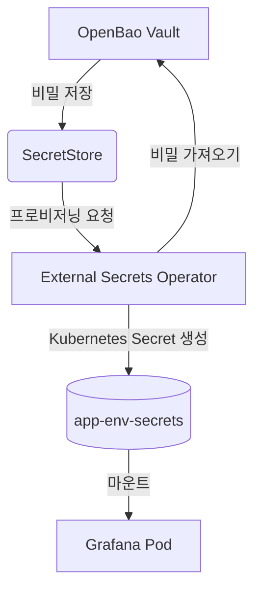

# 데이터 소스 통합

<cite>
**이 문서에서 참조한 파일**   
- [values.yaml](file://helm/development-tools/grafana/values.yaml)
- [values-stg.yaml](file://helm/shared-configs/openbao-secrets-manager/values-staging.yaml)
- [values-prod.yaml](file://helm/shared-configs/openbao-secrets-manager/values-production.yaml)
- [configmap.yaml](file://helm/development-tools/grafana/templates/configmap.yaml)
- [secret.yaml](file://helm/development-tools/grafana/templates/secret.yaml)
- [openbao-secrets-manager/values.yaml](file://helm/shared-configs/openbao-secrets-manager/values.yaml)
- [openbao-secrets-manager/templates/secret-store.yaml](file://helm/shared-configs/openbao-secrets-manager/templates/secret-store.yaml)
- [openbao-secrets-manager/templates/external-secret.yaml](file://helm/shared-configs/openbao-secrets-manager/templates/external-secret.yaml)
</cite>

## 목차
1. [소개](#소개)
2. [데이터 소스 선언적 등록](#데이터-소스-선언적-등록)
3. [인증 및 TLS 구성](#인증-및-tls-구성)
4. [기본 데이터 소스 지정](#기본-데이터-소스-지정)
5. [환경별 오버라이드 전략](#환경별-오버라이드-전략)
6. [비밀 정보 관리 및 OpenBao 통합](#비밀-정보-관리-및-openbao-통합)
7. [결론](#결론)

## 소개
이 문서는 Grafana에 다양한 데이터 소스를 Helm 차트의 `values.yaml` 파일을 통해 선언적으로 등록하는 방법을 설명합니다. 특히 Prometheus와 같은 주요 데이터 소스를 안전하고 효율적으로 구성하는 절차를 다룹니다. 데이터 소스의 인증 설정, TLS 구성, 기본 데이터 소스 지정 방법을 포함하며, 개발, 스테이징, 프로덕션과 같은 다양한 환경에서 `values-stg.yaml`, `values-prod.yaml`과 같은 환경별 values 파일을 사용하여 데이터 소스 구성을 오버라이드하는 전략을 제시합니다. 또한, 비밀번호 및 인증 정보와 같은 민감한 정보를 안전하게 관리하기 위한 방법과, OpenBao를 통한 시크릿 주입을 활용한 보안 강화된 데이터 소스 구성 방법을 상세히 설명합니다.

## 데이터 소스 선언적 등록

Grafana는 Helm 차트를 통해 데이터 소스를 선언적으로 관리할 수 있습니다. 이는 `values.yaml` 파일 내 `datasources` 섹션을 사용하여 구현됩니다. 이 섹션은 Grafana의 내장 프로비저닝 기능을 활용하여, 클러스터 배포 시 자동으로 데이터 소스를 생성하고 구성합니다. 이 방식은 수동 설정의 오류를 방지하고, 구성의 일관성과 추적성을 보장합니다.

`datasources` 블록은 YAML 형식의 배열로 구성되며, 각 항목은 하나의 데이터 소스를 정의합니다. 주요 구성 항목으로는 `name` (데이터 소스 이름), `type` (데이터 소스 유형, 예: `prometheus`), `url` (데이터 소스 엔드포인트 URL), `access` (프록시 또는 직접 접근 방식)가 있습니다. 예를 들어, Prometheus 데이터 소스를 등록하려면 `type`을 `prometheus`로 설정하고, `url`에 Prometheus 서버의 서비스 이름과 포트를 지정합니다.

이 선언적 접근은 GitOps 워크플로우와 완벽하게 통합되며, 모든 구성 변경 사항이 버전 관리 시스템에 기록되어 감사 추적이 가능합니다.

**구성 요소 소스**
- [values.yaml](file://helm/development-tools/grafana/values.yaml#L673-L695)

## 인증 및 TLS 구성

데이터 소스에 대한 안전한 접근을 보장하기 위해 인증과 TLS 구성이 필수적입니다. `datasources` 설정 내 `jsonData` 섹션을 통해 다양한 인증 메커니즘을 구성할 수 있습니다. 대표적인 예로, `authType`을 `basic`으로 설정하면 기본 인증을 사용할 수 있으며, 이때 `user` 및 `password` 필드를 통해 자격 증명을 제공합니다. 그러나 민감한 자격 증명은 `values.yaml` 파일에 직접 노출되어서는 안 됩니다.

대신, `secureJsonData` 섹션을 사용하여 비밀 정보를 분리하고, 이를 Kubernetes Secret과 연결하는 것이 안전한 방법입니다. `secureJsonData` 내의 `password` 또는 `accessKey`와 같은 필드는 Helm 차트가 이를 자동으로 비밀로 처리하고, 별도의 Secret 리소스로 추출합니다. 이렇게 생성된 Secret은 `envFromSecret`이나 `extraSecretMounts` 등을 통해 Grafana 파드에 마운트되어, 런타임 시에만 접근할 수 있도록 합니다.

TLS 구성은 `jsonData` 내 `tlsSkipVerify` (인증서 검증 건너뛰기) 및 `serverName` (SNI 서버 이름)과 같은 옵션을 통해 제어할 수 있습니다. 내부 CA를 사용하는 경우, `extraConfigmapMounts`를 통해 CA 인증서를 ConfigMap으로 마운트하고, `jsonData`에서 해당 경로를 지정할 수 있습니다.

**구성 요소 소스**
- [values.yaml](file://helm/development-tools/grafana/values.yaml#L673-L695)
- [configmap.yaml](file://helm/development-tools/grafana/templates/configmap.yaml)
- [secret.yaml](file://helm/development-tools/grafana/templates/secret.yaml)

## 기본 데이터 소스 지정

Grafana 대시보드에서 특정 데이터 소스를 기본값으로 사용하도록 지정할 수 있습니다. 이는 `datasources` 배열 내에서 원하는 데이터 소스 객체에 `isDefault: true` 속성을 추가함으로써 간단히 설정할 수 있습니다. 예를 들어, Prometheus를 기본 데이터 소스로 설정하려면 다음과 같이 구성합니다:

```yaml
datasources:
  - name: Prometheus
    type: prometheus
    url: http://prometheus-server
    access: proxy
    isDefault: true
```

이 설정은 새로운 대시보드를 생성할 때, 데이터 패널의 데이터 소스 필드에 자동으로 이 데이터 소스가 선택되도록 합니다. 이는 사용자 경험을 향상시키고, 실수로 잘못된 데이터 소스를 선택하는 것을 방지합니다. 여러 데이터 소스를 구성할 경우, 반드시 하나의 데이터 소스만 `isDefault: true`로 설정해야 하며, 그렇지 않으면 예기치 않은 동작이 발생할 수 있습니다.

**구성 요소 소스**
- [values.yaml](file://helm/development-tools/grafana/values.yaml#L684)

## 환경별 오버라이드 전략

다양한 환경(예: 개발, 스테이징, 프로덕션)에서 동일한 Helm 차트를 사용하면서도 각 환경에 맞는 데이터 소스 구성을 유지하기 위해, 환경별 `values` 파일 오버라이드 전략을 사용합니다. 이는 Helm의 `-f` 플래그를 통해 구현됩니다.

기본 `values.yaml` 파일에는 공통적인 설정을 정의하고, 환경별로 특화된 설정은 `values-stg.yaml`, `values-prod.yaml`과 같은 별도의 파일에 작성합니다. 예를 들어, 스테이징 환경의 `values-stg.yaml` 파일은 프로덕션과 다른 Prometheus URL이나 경량화된 리소스 요청을 오버라이드할 수 있습니다. 배포 시에는 다음과 같이 명령어를 사용합니다:

```bash
helm upgrade --install grafana ./grafana -f values.yaml -f values-stg.yaml
```

이 명령어는 `values.yaml`의 설정을 기반으로 하되, `values-stg.yaml`에 정의된 설정으로 오버라이드하여 최종 구성이 생성됩니다. 이 전략은 구성의 재사용성을 극대화하면서도 환경 간의 차이를 명확하게 분리할 수 있게 해줍니다.

**구성 요소 소스**
- [values-stg.yaml](file://helm/shared-configs/openbao-secrets-manager/values-staging.yaml)
- [values-prod.yaml](file://helm/shared-configs/openbao-secrets-manager/values-production.yaml)

## 비밀 정보 관리 및 OpenBao 통합

민감한 데이터 소스 자격 증명을 안전하게 관리하기 위해, 이 시스템은 OpenBao와 External Secrets Operator를 통합합니다. 이 아키텍처는 비밀 정보를 코드화된 구성 파일에 저장하는 것을 방지하고, 중앙 집중식으로 비밀을 관리할 수 있게 합니다.

### OpenBao 기반 비밀 관리

OpenBao는 중앙 비밀 저장소로 작동합니다. 모든 데이터베이스 비밀번호, API 키, 액세스 토큰은 OpenBao에 저장되며, 경로 기반으로 구분됩니다(예: `server/staging`, `server/production`). Helm 차트의 `values.yaml` 파일은 OpenBao의 실제 비밀 값을 포함하지 않습니다. 대신, `external-secrets.io` CRD를 사용하여 OpenBao에서 비밀을 가져오는 방법을 선언합니다.

### External Secrets Operator를 통한 시크릿 주입

`openbao-secrets-manager` Helm 차트는 `SecretStore` 및 `ExternalSecret` 리소스를 정의합니다. `SecretStore`는 OpenBao 서버의 위치, 경로, 인증 방법(토큰 기반)을 구성합니다. `ExternalSecret`은 OpenBao의 특정 경로에서 어떤 키를 가져와야 하는지, 그리고 이를 어떤 이름의 Kubernetes Secret으로 생성할지를 지정합니다.



**다이어그램 소스**
- [secret-store.yaml](file://helm/shared-configs/openbao-secrets-manager/templates/secret-store.yaml)
- [external-secret.yaml](file://helm/shared-configs/openbao-secrets-manager/templates/external-secret.yaml)

이 과정에서, Grafana Helm 차트는 `envFromSecret`을 사용하여 `app-env-secrets`라는 이름의 Kubernetes Secret을 환경 변수로 로드합니다. 데이터 소스 구성에서 `secureJsonData.password`는 이 환경 변수를 참조하도록 설정됩니다. 이로 인해 비밀 정보는 절대 디스크에 노출되지 않고, 메모리 내에서만 사용되며, 전체 프로세스가 자동화되어 운영 오류의 위험을 최소화합니다.

**구성 요소 소스**
- [values.yaml](file://helm/shared-configs/openbao-secrets-manager/values.yaml)
- [secret-store.yaml](file://helm/shared-configs/openbao-secrets-manager/templates/secret-store.yaml)
- [external-secret.yaml](file://helm/shared-configs/openbao-secrets-manager/templates/external-secret.yaml)

## 결론

이 문서는 Grafana 데이터 소스를 선언적으로 구성하고, 환경별로 안전하게 관리하는 포괄적인 가이드를 제공합니다. `values.yaml`을 통한 선언적 등록은 구성의 일관성과 재현성을 보장하며, 환경별 오버라이드 전략은 유연한 배포를 가능하게 합니다. 무엇보다도, OpenBao와 External Secrets Operator를 통합한 비밀 정보 관리 전략은 민감한 자격 증명을 코드에서 분리하고, 중앙 집중식으로 안전하게 보호함으로써, 보안 모범 사례를 준수하는 강력한 아키텍처를 구축합니다. 이 접근 방식은 DevOps 팀이 안정적이고 안전한 모니터링 인프라를 운영할 수 있도록 지원합니다.