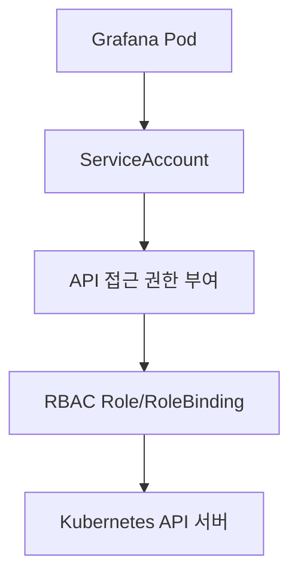
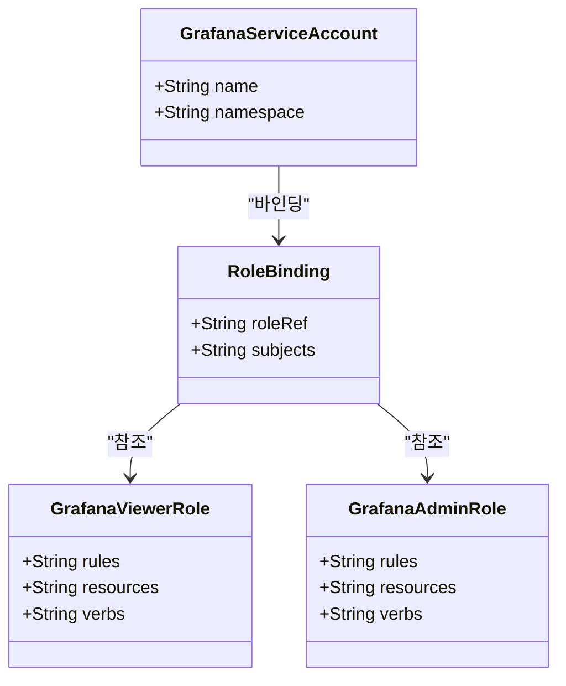
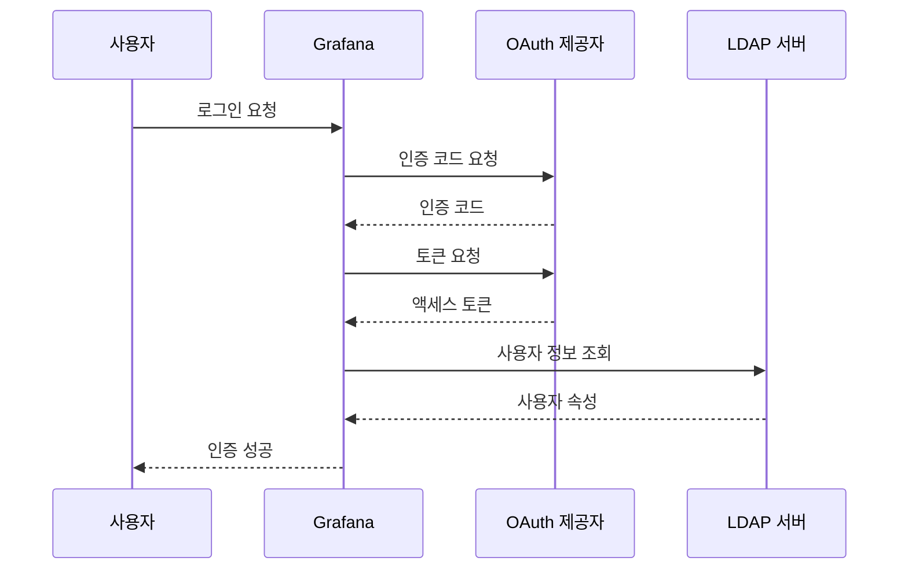
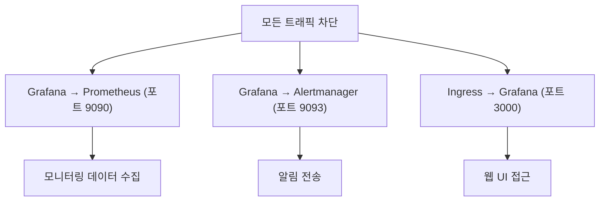
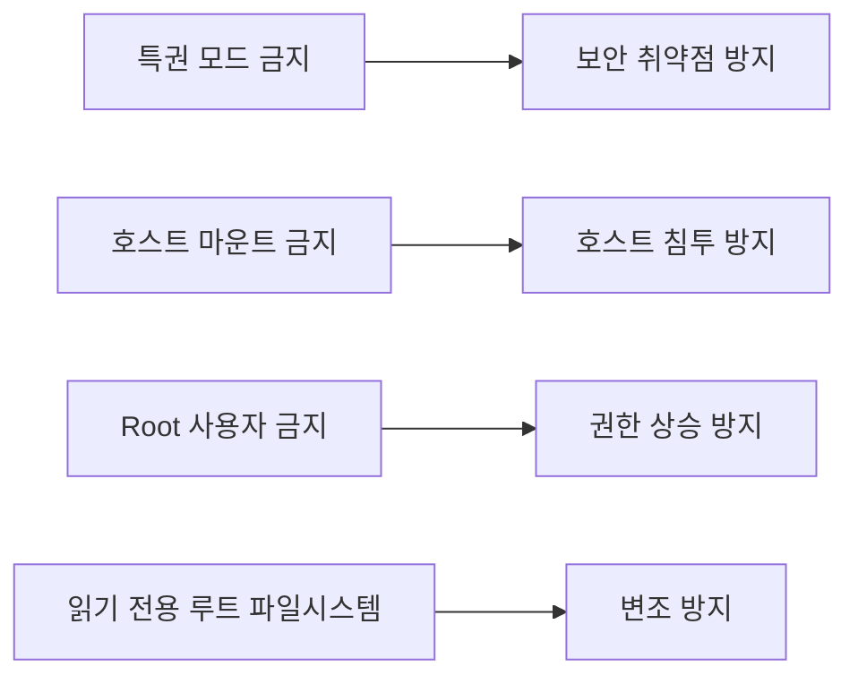
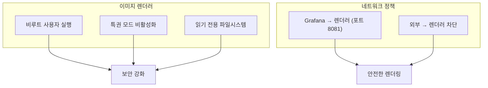
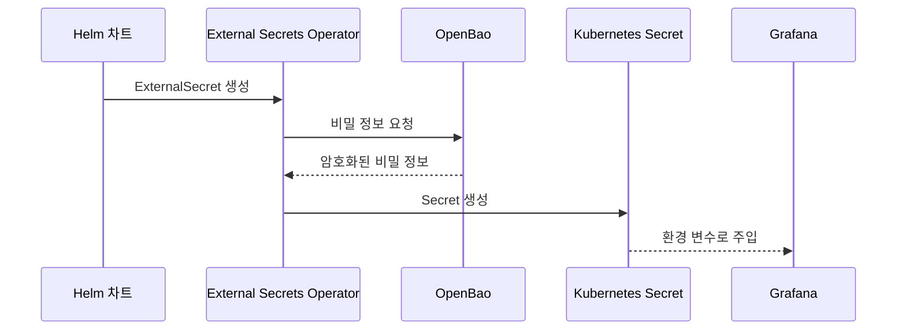

# 보안 설정

<cite>
**이 문서에서 참조한 파일**
- [openbao-secrets-manager/values.yaml](file://helm/shared-configs/openbao-secrets-manager/values.yaml)
- [openbao-secrets-manager/Chart.yaml](file://helm/shared-configs/openbao-secrets-manager/Chart.yaml)
- [openbao-secrets-manager/templates/external-secret.yaml](file://helm/shared-configs/openbao-secrets-manager/templates/external-secret.yaml)
- [openbao-secrets-manager/templates/secret-store.yaml](file://helm/shared-configs/openbao-secrets-manager/templates/secret-store.yaml)
- [openbao-secrets-manager/templates/service-account.yaml](file://helm/shared-configs/openbao-secrets-manager/templates/service-account.yaml)
- [grafana/templates/deployment.yaml](file://helm/development-tools/grafana/templates/deployment.yaml)
- [grafana/templates/serviceaccount.yaml](file://helm/development-tools/grafana/templates/serviceaccount.yaml)
- [grafana/templates/networkpolicy.yaml](file://helm/development-tools/grafana/templates/networkpolicy.yaml)
- [grafana/templates/podsecuritypolicy.yaml](file://helm/development-tools/grafana/templates/podsecuritypolicy.yaml)
- [grafana/templates/image-renderer-deployment.yaml](file://helm/development-tools/grafana/templates/image-renderer-deployment.yaml)
- [grafana/templates/image-renderer-network-policy.yaml](file://helm/development-tools/grafana/templates/image-renderer-network-policy.yaml)
- [openbao/values.yaml](file://helm/development-tools/openbao/values.yaml)
</cite>

## 목차
1. [소개](#소개)
2. [서비스 계정 및 API 접근 제어](#서비스-계정-및-api-접근-제어)
3. [RBAC 기반 역할 관리](#rbac-기반-역할-관리)
4. [인증 연동 설정](#인증-연동-설정)
5. [네트워크 정책을 통한 접근 제어](#네트워크-정책을-통한-접근-제어)
6. [포드 보안 정책(PSP)](#포드-보안-정책psp)
7. [이미지 렌더러 보안 구성](#이미지-렌더러-보안-구성)
8. [민감 정보 관리 및 OpenBao 통합](#민감-정보-관리-및-openbao-통합)
9. [결론](#결론)

## 소개
이 문서는 Grafana 환경의 보안 강화 설정을 상세히 설명합니다. 서비스 계정을 통한 API 접근 권한 부여, RBAC 기반의 역할 관리, LDAP 및 OAuth 인증 연동 설정 방법을 포함합니다. 또한 네트워크 정책(NetworkPolicy), 포드 보안 정책(PSP), 이미지 렌더러의 보안 구성에 대해 다루며, 민감 정보를 values.yaml이 아닌 OpenBao를 통해 안전하게 주입하는 통합 방식을 설명합니다.

**Section sources**
- [openbao-secrets-manager/Chart.yaml](file://helm/shared-configs/openbao-secrets-manager/Chart.yaml)

## 서비스 계정 및 API 접근 제어
Grafana는 Kubernetes 환경에서 서비스 계정을 통해 API 접근 권한을 관리합니다. `serviceaccount.yaml` 템플릿을 통해 Grafana 전용 서비스 계정이 생성되며, 이 계정은 최소한의 권한만 부여받도록 구성됩니다. 서비스 계정은 자동으로 API 자격 증명을 마운트할 수 있으며, 이를 통해 Grafana는 Kubernetes API와 안전하게 통신할 수 있습니다.

**Diagram sources**
- [grafana/templates/serviceaccount.yaml](file://helm/development-tools/grafana/templates/serviceaccount.yaml)

**Section sources**
- [grafana/templates/serviceaccount.yaml](file://helm/development-tools/grafana/templates/serviceaccount.yaml)

## RBAC 기반 역할 관리
Grafana의 RBAC 설정은 `role.yaml` 및 `rolebinding.yaml`을 통해 정의됩니다. 각 환경별 네임스페이스에 맞는 역할이 정의되며, Grafana 서비스 계정에 필요한 최소한의 권한만 부여됩니다. 예를 들어, 대시보드 조회는 읽기 전용 권한으로 제한되며, 설정 변경은 관리자 역할에만 허용됩니다.

**Diagram sources**
- [grafana/templates/role.yaml](file://helm/development-tools/grafana/templates/role.yaml)
- [grafana/templates/rolebinding.yaml](file://helm/development-tools/grafana/templates/rolebinding.yaml)

**Section sources**
- [grafana/templates/role.yaml](file://helm/development-tools/grafana/templates/role.yaml)
- [grafana/templates/rolebinding.yaml](file://helm/development-tools/grafana/templates/rolebinding.yaml)

## 인증 연동 설정
Grafana는 LDAP 및 OAuth를 통한 외부 인증 연동을 지원합니다. 인증 설정은 `values.yaml` 파일 내 `auth` 섹션에서 구성되며, 각 인증 방식에 대한 엔드포인트, 클라이언트 ID, 시크릿 키 등이 정의됩니다. OAuth의 경우, GitHub, Google, Azure AD 등 다양한 공급자와의 통합이 가능합니다.

**Diagram sources**
- [grafana/values.yaml](file://helm/development-tools/grafana/values.yaml)

**Section sources**
- [grafana/values.yaml](file://helm/development-tools/grafana/values.yaml)

## 네트워크 정책을 통한 접근 제어
Grafana는 `networkpolicy.yaml`을 통해 네트워크 수준의 접근 제어를 구현합니다. 기본적으로 모든 인바운드 및 아웃바운드 트래픽을 차단한 후, 특정 포트(예: 3000)와 대상 서비스(예: Prometheus, Alertmanager)에 대해서만 접근을 허용합니다. 이는 공격자가 내부 네트워크로 침투하는 것을 방지하는 데 효과적입니다.

**Diagram sources**
- [grafana/templates/networkpolicy.yaml](file://helm/development-tools/grafana/templates/networkpolicy.yaml)

**Section sources**
- [grafana/templates/networkpolicy.yaml](file://helm/development-tools/grafana/templates/networkpolicy.yaml)

## 포드 보안 정책(PSP)
Grafana는 `podsecuritypolicy.yaml`을 통해 포드 보안 정책을 적용합니다. 이 정책은 특권 모드 실행, 호스트 네트워크/파일 시스템 마운트, root 사용자 실행 등을 금지하며, 모든 컨테이너가 비루트 사용자로 실행되도록 강제합니다. 이를 통해 포드 수준의 보안 위험을 최소화합니다.

**Diagram sources**
- [grafana/templates/podsecuritypolicy.yaml](file://helm/development-tools/grafana/templates/podsecuritypolicy.yaml)

**Section sources**
- [grafana/templates/podsecuritypolicy.yaml](file://helm/development-tools/grafana/templates/podsecuritypolicy.yaml)

## 이미지 렌더러 보안 구성
Grafana의 이미지 렌더러는 별도의 배포(`image-renderer-deployment.yaml`)로 관리되며, 자체 네트워크 정책(`image-renderer-network-policy.yaml`)을 통해 외부 접근을 제한합니다. 렌더러는 HTTP 요청을 수신하지 않고, Grafana 메인 인스턴스와의 내부 통신만 허용되며, 모든 컨테이너는 비루트 사용자로 실행됩니다.

**Diagram sources**
- [grafana/templates/image-renderer-deployment.yaml](file://helm/development-tools/grafana/templates/image-renderer-deployment.yaml)
- [grafana/templates/image-renderer-network-policy.yaml](file://helm/development-tools/grafana/templates/image-renderer-network-policy.yaml)

**Section sources**
- [grafana/templates/image-renderer-deployment.yaml](file://helm/development-tools/grafana/templates/image-renderer-deployment.yaml)
- [grafana/templates/image-renderer-network-policy.yaml](file://helm/development-tools/grafana/templates/image-renderer-network-policy.yaml)

## 민감 정보 관리 및 OpenBao 통합
민감 정보는 `values.yaml`에 직접 포함되지 않고, OpenBao를 통해 안전하게 주입됩니다. `openbao-secrets-manager` 차트는 External Secrets Operator를 사용하여 OpenBao에 저장된 비밀 정보를 Kubernetes Secret으로 동기화합니다. 이 방식은 민감 정보가 코드 저장소에 노출되는 것을 방지하며, 중앙 집중식으로 비밀 정보를 관리할 수 있게 합니다.

**Diagram sources**
- [openbao-secrets-manager/templates/external-secret.yaml](file://helm/shared-configs/openbao-secrets-manager/templates/external-secret.yaml)
- [openbao-secrets-manager/templates/secret-store.yaml](file://helm/shared-configs/openbao-secrets-manager/templates/secret-store.yaml)

**Section sources**
- [openbao-secrets-manager/values.yaml](file://helm/shared-configs/openbao-secrets-manager/values.yaml)
- [openbao-secrets-manager/templates/external-secret.yaml](file://helm/shared-configs/openbao-secrets-manager/templates/external-secret.yaml)
- [openbao-secrets-manager/templates/secret-store.yaml](file://helm/shared-configs/openbao-secrets-manager/templates/secret-store.yaml)

## 결론
본 문서는 Grafana의 보안 강화를 위한 종합적인 설정 가이드를 제공합니다. 서비스 계정, RBAC, 인증 연동, 네트워크 정책, PSP, 이미지 렌더러 보안, 그리고 OpenBao 기반의 민감 정보 관리까지 전반적인 보안 전략을 수립하고 적용하는 방법을 설명했습니다. 이러한 설정들은 함께 작동하여 Grafana 환경의 보안 수준을 크게 향상시킵니다.