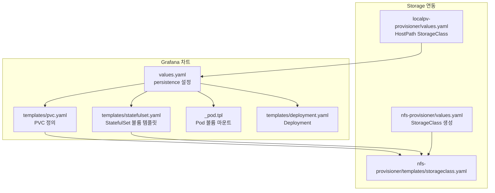
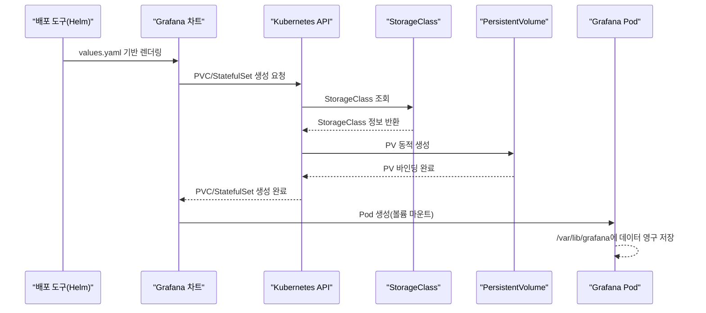
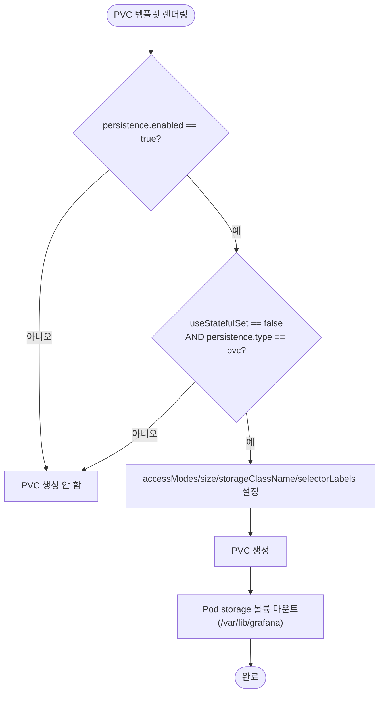
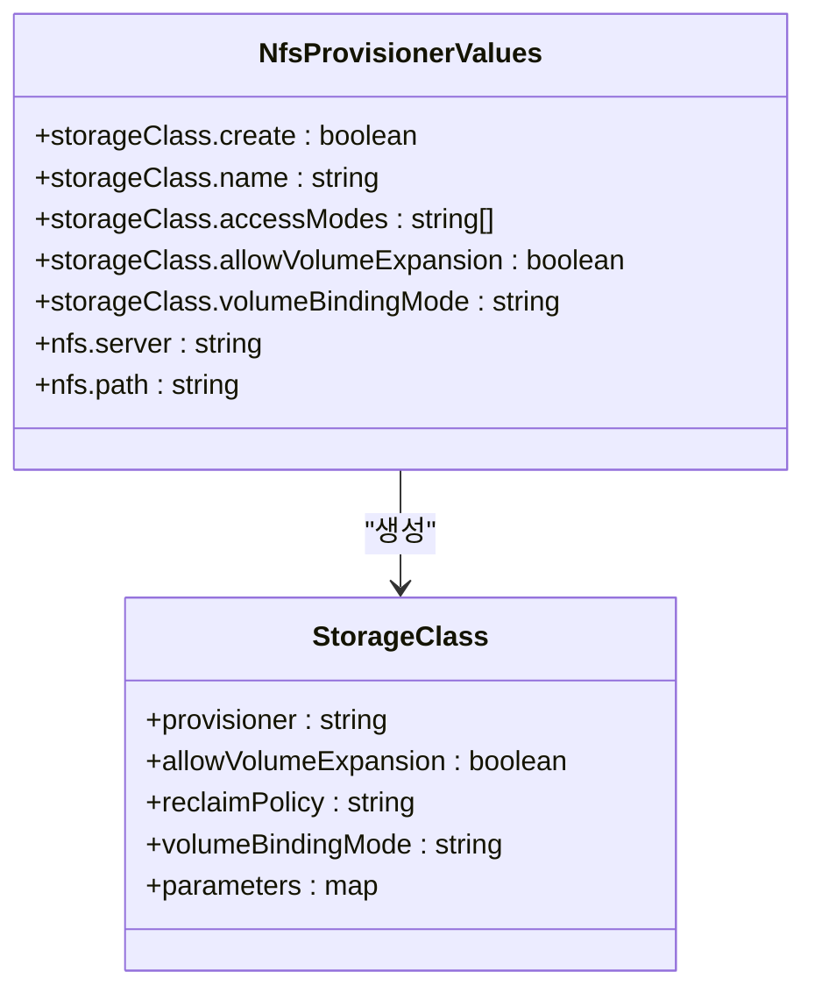
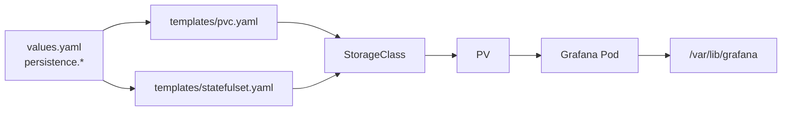

# 영구 저장소 및 설정 유지

<cite>
**문서에서 인용하는 파일 목록**
- [values.yaml](file://helm/development-tools/grafana/values.yaml)
- [pvc.yaml](file://helm/development-tools/grafana/templates/pvc.yaml)
- [statefulset.yaml](file://helm/development-tools/grafana/templates/statefulset.yaml)
- [_pod.tpl](file://helm/development-tools/grafana/templates/_pod.tpl)
- [deployment.yaml](file://helm/development-tools/grafana/templates/deployment.yaml)
- [values.yaml](file://helm/cluster-services/nfs-provisioner/values.yaml)
- [storageclass.yaml](file://helm/cluster-services/nfs-provisioner/templates/storageclass.yaml)
- [values.yaml](file://helm/development-tools/openebs/charts/localpv-provisioner/values.yaml)
</cite>

## 목차
1. [소개](#소개)
2. [프로젝트 구조](#프로젝트-구조)
3. [핵심 구성 요소](#핵심-구성-요소)
4. [아키텍처 개요](#아키텍처-개요)
5. [상세 구성 분석](#상세-구성-분석)
6. [의존성 분석](#의존성-분석)
7. [성능 고려사항](#성능-고려사항)
8. [장애 복구 가이드](#장애-복구-가이드)
9. [결론](#결론)

## 소개
본 문서는 Grafana의 설정과 대시보드 상태를 영구적으로 유지하기 위한 PVC 기반 영구 저장소 구성 방법을 설명합니다. values.yaml에서의 persistence 설정, 접근 모드(accessModes), 스토리지 클래스(storageClassName) 지정 방법을 중심으로, 클러스터 환경별(nfs-provisioner, localpv) 스토리지 연동 전략을 제시하고, 볼륨 마운트 경로, 데이터 백업 및 복구 절차, 장애 복구 시 설정 유지 보장을 위한 방법을 상세히 다룹니다.

## 프로젝트 구조
Grafana는 Helm 차트를 통해 배포되며, 영구 저장소는 PVC 또는 StatefulSet 볼륨 템플릿을 사용하여 구성됩니다. 스토리지 연동은 클러스터 내 StorageClass를 통해 동적 프로비저닝이 가능하도록 되어 있으며, NFS 또는 로컬 볼륨 제공자가 각각 다른 StorageClass를 제공합니다.

**도표 소스**
- [values.yaml](file://helm/development-tools/grafana/values.yaml#L420-L460)
- [pvc.yaml](file://helm/development-tools/grafana/templates/pvc.yaml#L1-L40)
- [statefulset.yaml](file://helm/development-tools/grafana/templates/statefulset.yaml#L40-L64)
- [_pod.tpl](file://helm/development-tools/grafana/templates/_pod.tpl#L1320-L1342)
- [deployment.yaml](file://helm/development-tools/grafana/templates/deployment.yaml#L1-L54)
- [values.yaml](file://helm/cluster-services/nfs-provisioner/values.yaml#L18-L52)
- [storageclass.yaml](file://helm/cluster-services/nfs-provisioner/templates/storageclass.yaml#L1-L34)
- [values.yaml](file://helm/development-tools/openebs/charts/localpv-provisioner/values.yaml#L85-L106)

**섹션 소스**
- [values.yaml](file://helm/development-tools/grafana/values.yaml#L420-L460)
- [pvc.yaml](file://helm/development-tools/grafana/templates/pvc.yaml#L1-L40)
- [statefulset.yaml](file://helm/development-tools/grafana/templates/statefulset.yaml#L40-L64)
- [_pod.tpl](file://helm/development-tools/grafana/templates/_pod.tpl#L1320-L1342)
- [deployment.yaml](file://helm/development-tools/grafana/templates/deployment.yaml#L1-L54)
- [values.yaml](file://helm/cluster-services/nfs-provisioner/values.yaml#L18-L52)
- [storageclass.yaml](file://helm/cluster-services/nfs-provisioner/templates/storageclass.yaml#L1-L34)
- [values.yaml](file://helm/development-tools/openebs/charts/localpv-provisioner/values.yaml#L85-L106)

## 핵심 구성 요소
- 영구 저장소 활성화: persistence.enabled를 true로 설정하고, persistence.type을 pvc 또는 statefulset으로 선택합니다.
- 접근 모드(accessModes): ReadWriteOnce 등 적절한 접근 모드를 지정합니다.
- 스토리지 클래스(storageClassName): 클러스터에 미리 존재하거나 설치된 StorageClass 이름을 지정합니다.
- 볼륨 크기(size): 요청 용량을 지정합니다.
- 볼륨 마운트 경로: /var/lib/grafana에 storage 볼륨이 마운트됩니다.
- PVC vs StatefulSet: Deployment에서는 PVC를 사용하고, StatefulSet에서는 volumeClaimTemplates를 통해 볼륨이 자동 생성됩니다.

**섹션 소스**
- [values.yaml](file://helm/development-tools/grafana/values.yaml#L420-L460)
- [pvc.yaml](file://helm/development-tools/grafana/templates/pvc.yaml#L20-L39)
- [statefulset.yaml](file://helm/development-tools/grafana/templates/statefulset.yaml#L40-L64)
- [_pod.tpl](file://helm/development-tools/grafana/templates/_pod.tpl#L1320-L1342)

## 아키텍처 개요
Grafana는 Deployment 또는 StatefulSet으로 실행되며, persistence.enabled가 true일 경우 PVC 또는 StatefulSet 볼륨 템플릿이 생성됩니다. PVC는 storageClassName을 통해 StorageClass에 의해 동적 프로비저닝되며, NFS 또는 로컬 볼륨 제공자가 각각 다른 StorageClass를 제공합니다. 볼륨은 Pod의 /var/lib/grafana에 마운트되어 Grafana 설정과 대시보드 데이터가 영구 저장됩니다.

**도표 소스**
- [values.yaml](file://helm/development-tools/grafana/values.yaml#L420-L460)
- [pvc.yaml](file://helm/development-tools/grafana/templates/pvc.yaml#L1-L40)
- [statefulset.yaml](file://helm/development-tools/grafana/templates/statefulset.yaml#L40-L64)
- [storageclass.yaml](file://helm/cluster-services/nfs-provisioner/templates/storageclass.yaml#L1-L34)

## 상세 구성 분석

### 1) values.yaml에서의 persistence 설정
- persistence.enabled: 영구 저장소 사용 여부
- persistence.type: pvc 또는 statefulset
- persistence.storageClassName: 사용할 StorageClass 이름
- persistence.accessModes: ReadWriteOnce 등
- persistence.size: 볼륨 용량
- persistence.existingClaim: 기존 PVC 사용 여부
- persistence.subPath: 볼륨 내 하위 디렉토리 마운트
- persistence.finalizers: PVC 보호를 위한 finalizer

**섹션 소스**
- [values.yaml](file://helm/development-tools/grafana/values.yaml#L420-L460)

### 2) PVC 기반 영구 저장소
- PVC 템플릿은 persistence.enabled가 true이고, useStatefulSet이 false이며, persistence.type이 pvc일 때 생성됩니다.
- PVC는 accessModes, storageClassName, selectorLabels 등을 values.yaml에서 가져옵니다.
- PVC는 Pod의 storage 볼륨에 연결되어 /var/lib/grafana에 마운트됩니다.

**도표 소스**
- [pvc.yaml](file://helm/development-tools/grafana/templates/pvc.yaml#L1-L40)
- [_pod.tpl](file://helm/development-tools/grafana/templates/_pod.tpl#L1320-L1342)

**섹션 소스**
- [pvc.yaml](file://helm/development-tools/grafana/templates/pvc.yaml#L1-L40)
- [_pod.tpl](file://helm/development-tools/grafana/templates/_pod.tpl#L1320-L1342)

### 3) StatefulSet 기반 영구 저장소
- persistence.enabled가 true이고, persistence.type이 statefulset일 경우 StatefulSet이 생성됩니다.
- StatefulSet에는 volumeClaimTemplates가 포함되어 볼륨이 자동 생성됩니다.
- 볼륨 크기, 접근 모드, storageClassName은 values.yaml에서 설정됩니다.

**섹션 소스**
- [statefulset.yaml](file://helm/development-tools/grafana/templates/statefulset.yaml#L40-L64)
- [values.yaml](file://helm/development-tools/grafana/values.yaml#L420-L460)

### 4) 볼륨 마운트 경로
- Pod 볼륨 정의에 따라 storage 볼륨이 Pod에 마운트되며, Grafana 서버는 /var/lib/grafana에 데이터를 저장합니다.
- initContainers나 sidecar 컨테이너도 동일한 storage 볼륨을 마운트하여 필요한 작업을 수행합니다.

**섹션 소스**
- [_pod.tpl](file://helm/development-tools/grafana/templates/_pod.tpl#L1320-L1342)

### 5) 클러스터 환경별 스토리지 연동 전략

#### 5.1) NFS 기반 스토리지 연동 (nfs-provisioner)
- StorageClass 생성: storageClass.create가 true일 경우 StorageClass가 생성됩니다.
- StorageClass 이름: storageClass.name(default: nfs-client)
- 접근 모드: storageClass.accessModes(default: ReadWriteOnce)
- 확장 가능 여부: storageClass.allowVolumeExpansion(default: true)
- 볼륨 바인딩 모드: storageClass.volumeBindingMode(default: Immediate)
- NFS 서버 정보: nfs.server, nfs.path

**도표 소스**
- [values.yaml](file://helm/cluster-services/nfs-provisioner/values.yaml#L18-L52)
- [storageclass.yaml](file://helm/cluster-services/nfs-provisioner/templates/storageclass.yaml#L1-L34)

**섹션 소스**
- [values.yaml](file://helm/cluster-services/nfs-provisioner/values.yaml#L18-L52)
- [storageclass.yaml](file://helm/cluster-services/nfs-provisioner/templates/storageclass.yaml#L1-L34)

#### 5.2) 로컬 볼륨 기반 스토리지 연동 (localpv)
- HostPath StorageClass: openebs-hostpath가 기본으로 제공됩니다.
- 재활용 정책: reclaimPolicy(default: Delete)
- 기본 StorageClass 설정: isDefaultClass(default: false)
- 노드 어피니티 라벨: nodeAffinityLabels를 통한 특정 노드에 볼륨 할당 가능

**섹션 소스**
- [values.yaml](file://helm/development-tools/openebs/charts/localpv-provisioner/values.yaml#L85-L106)

### 6) 스토리지 클래스 지정 방법
- persistence.storageClassName에 StorageClass 이름을 직접 지정합니다.
- NFS 기반: nfs-client 또는 사용자 정의 StorageClass 이름
- 로컬 볼륨 기반: openebs-hostpath 또는 사용자 정의 StorageClass 이름

**섹션 소스**
- [values.yaml](file://helm/development-tools/grafana/values.yaml#L420-L460)
- [storageclass.yaml](file://helm/cluster-services/nfs-provisioner/templates/storageclass.yaml#L1-L34)
- [values.yaml](file://helm/development-tools/openebs/charts/localpv-provisioner/values.yaml#L85-L106)

## 의존성 분석
- Grafana 차트는 persistence.enabled가 true일 경우 PVC 또는 StatefulSet 볼륨 템플릿을 생성합니다.
- PVC는 storageClassName을 통해 StorageClass에 의존하며, StorageClass는 nfs-provisioner 또는 localpv-provisioner에 의해 PV가 동적 생성됩니다.
- Pod는 storage 볼륨을 /var/lib/grafana에 마운트하여 데이터 영구 저장이 가능합니다.

**도표 소스**
- [values.yaml](file://helm/development-tools/grafana/values.yaml#L420-L460)
- [pvc.yaml](file://helm/development-tools/grafana/templates/pvc.yaml#L1-L40)
- [statefulset.yaml](file://helm/development-tools/grafana/templates/statefulset.yaml#L40-L64)
- [storageclass.yaml](file://helm/cluster-services/nfs-provisioner/templates/storageclass.yaml#L1-L34)

**섹션 소스**
- [values.yaml](file://helm/development-tools/grafana/values.yaml#L420-L460)
- [pvc.yaml](file://helm/development-tools/grafana/templates/pvc.yaml#L1-L40)
- [statefulset.yaml](file://helm/development-tools/grafana/templates/statefulset.yaml#L40-L64)
- [storageclass.yaml](file://helm/cluster-services/nfs-provisioner/templates/storageclass.yaml#L1-L34)

## 성능 고려사항
- 접근 모드: ReadWriteOnce는 단일 노드에서만 마운트되므로, StatefulSet 또는 단일 리플리카 배치를 권장합니다.
- StorageClass 확장: allowVolumeExpansion이 true인 경우 동적 확장 가능하나, 클러스터 환경에 따라 지원 여부가 다릅니다.
- 볼륨 크기: persistence.size는 초기 용량을 의미하며, 충분한 여유 공간 확보가 필요합니다.
- 볼륨 바인딩 모드: Immediate는 즉시 바인딩되지만, WaitForFirstConsumer은 Pod 스케줄링 후 바인딩되어 노드 가까운 PV 선택에 유리할 수 있습니다.

[이 섹션은 일반적인 성능 가이드를 제공하므로 특정 파일 분석 없음]

## 장애 복구 가이드

### 1) PVC 삭제 시 데이터 보존
- PVC 삭제 시 볼륨 재사용을 위해 storageClassName.reclaimPolicy를 Retain으로 설정하면 PV가 보존되어 데이터를 안전하게 보관할 수 있습니다.
- Retain 정책은 NFS provisioner의 nfs.reclaimPolicy 또는 StorageClass의 reclaimPolicy로 설정할 수 있습니다.

**섹션 소스**
- [values.yaml](file://helm/cluster-services/nfs-provisioner/values.yaml#L10-L17)
- [storageclass.yaml](file://helm/cluster-services/nfs-provisioner/templates/storageclass.yaml#L16-L18)

### 2) 볼륨 확장
- storageClassName.allowVolumeExpansion이 true인 경우, PVC 용량을 늘릴 수 있습니다.
- 확장 후 Grafana Pod가 재시작되거나, Pod가 해당 볼륨을 다시 마운트해야 할 수도 있습니다.

**섹션 소스**
- [values.yaml](file://helm/cluster-services/nfs-provisioner/values.yaml#L33-L40)
- [values.yaml](file://helm/development-tools/grafana/values.yaml#L420-L460)

### 3) 설정 유지 보장
- persistence.enabled가 true이고, persistence.type이 pvc이면 PVC가 생성되어 Pod 재배포 시에도 데이터가 유지됩니다.
- persistence.type이 statefulset이면 StatefulSet 볼륨 템플릿이 자동으로 PV를 생성하므로, Pod 교체 시에도 데이터가 유지됩니다.
- initContainers나 sidecar가 storage 볼륨을 마운트하고 있으므로, 볼륨이 올바르게 마운트되었는지 확인해야 합니다.

**섹션 소스**
- [pvc.yaml](file://helm/development-tools/grafana/templates/pvc.yaml#L1-L40)
- [statefulset.yaml](file://helm/development-tools/grafana/templates/statefulset.yaml#L40-L64)
- [_pod.tpl](file://helm/development-tools/grafana/templates/_pod.tpl#L1320-L1342)

### 4) 백업 및 복구 절차
- PVC 스냅샷 또는 PV 백업 도구를 사용하여 주기적으로 백업합니다.
- 복구 시 PVC를 생성하고, 기존 PV를 재사용하거나 새로운 PV에 데이터를 복사한 후 Pod를 재시작합니다.
- 복구 후 Grafana 설정과 대시보드 데이터가 정상적으로 로드되는지 확인합니다.

[이 섹션은 일반적인 백업/복구 절차를 설명하므로 특정 파일 분석 없음]

## 결론
Grafana의 설정과 대시보드 상태를 영구적으로 유지하려면 persistence.enabled를 true로 설정하고, 적절한 StorageClass(storageClassName)와 접근 모드(accessModes)를 지정해야 합니다. NFS 기반(nfs-provisioner) 또는 로컬 볼륨 기반(localpv) 스토리지를 선택하여 StorageClass를 구성하고, PVC 또는 StatefulSet 볼륨 템플릿을 통해 /var/lib/grafana에 데이터를 영구 저장할 수 있습니다. 또한, 볼륨 확장, PVC 삭제 시 데이터 보존, 백업 및 복구 절차를 고려하여 장애 복구 시 설정 유지 보장을 실현할 수 있습니다.