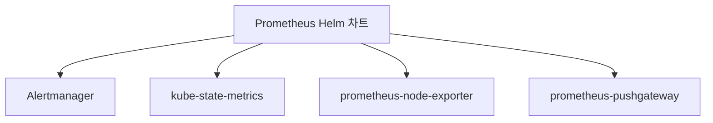
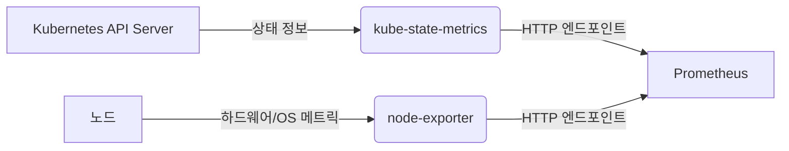
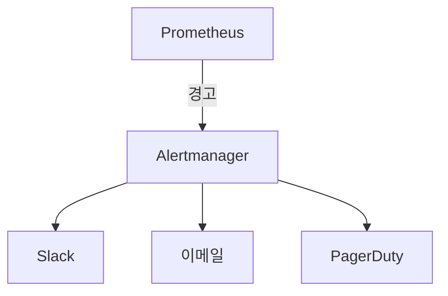
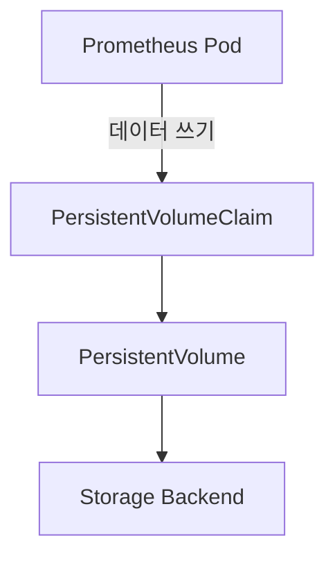
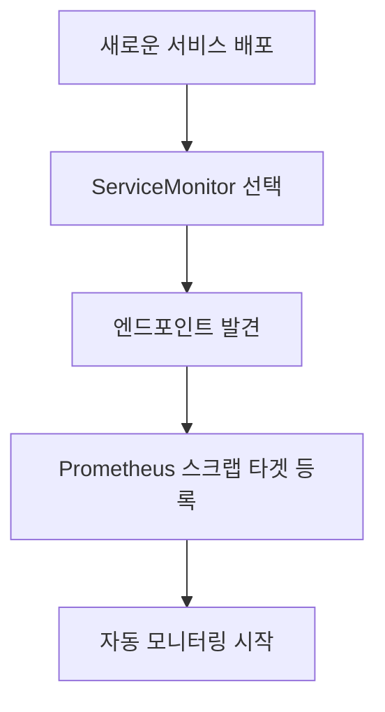
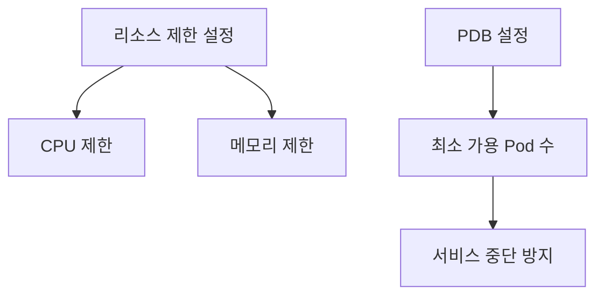

# Prometheus 구현

<cite>
**이 문서에서 참조한 파일**  
- [Chart.yaml](file://helm/development-tools/prometheus/Chart.yaml)
- [values.yaml](file://helm/development-tools/prometheus/values.yaml)
- [deploy.yaml](file://helm/development-tools/prometheus/templates/deploy.yaml)
- [pvc.yaml](file://helm/development-tools/prometheus/templates/pvc.yaml)
- [pdb.yaml](file://helm/development-tools/prometheus/templates/pdb.yaml)
- [charts/alertmanager/Chart.yaml](file://helm/development-tools/prometheus/charts/alertmanager/Chart.yaml)
- [charts/kube-state-metrics/Chart.yaml](file://helm/development-tools/prometheus/charts/kube-state-metrics/Chart.yaml)
- [charts/prometheus-node-exporter/Chart.yaml](file://helm/development-tools/prometheus/charts/prometheus-node-exporter/Chart.yaml)
- [README.md](file://helm/development-tools/prometheus/README.md)
</cite>

## 목차
1. [소개](#소개)
2. [차트 구성 요소](#차트-구성-요소)
3. [핵심 메트릭 수집 구성](#핵심-메트릭-수집-구성)
4. [Alertmanager 통합](#alertmanager-통합)
5. [메트릭 저장을 위한 PVC 설정](#메트릭-저장을-위한-pvc-설정)
6. [ServiceMonitor를 통한 동적 타겟 발견](#servicemonitor를-통한-동적-타겟-발견)
7. [values.yaml 기반 사용자 정의 설정](#valuesyaml-기반-사용자-정의-설정)
8. [프로덕션 환경을 위한 리소스 제한 및 PDB 설정](#프로덕션-환경을-위한-리소스-제한-및-pdb-설정)
9. [결론](#결론)

## 소개

Prometheus는 클라우드 네이티브 컴퓨팅 재단(CNCF)의 프로젝트로, 시스템 및 서비스 모니터링을 위한 강력한 오픈소스 솔루션입니다. 이 문서는 Helm 차트 기반의 Prometheus 구현을 상세히 설명하며, Kubernetes 클러스터의 메트릭 수집, 경고 알림, 저장소 구성 및 프로덕션 환경에 적합한 설정 방법을 다룹니다. 특히, kube-state-metrics와 node-exporter를 통한 메트릭 수집 구조, Alertmanager와의 통합, ServiceMonitor를 활용한 동적 타겟 발견 메커니즘, 그리고 values.yaml을 통한 사용자 정의 설정 방법을 중심으로 설명합니다.

**참조 파일**
- [README.md](file://helm/development-tools/prometheus/README.md)

## 차트 구성 요소

Prometheus Helm 차트는 Chart.yaml 파일에 정의된 여러 주요 구성 요소로 구성되어 있습니다. 이 차트는 코어 Prometheus 서버 외에도 Alertmanager, kube-state-metrics, prometheus-node-exporter, prometheus-pushgateway 등의 서브 차트를 종속성으로 포함하고 있습니다. 이러한 구성은 모니터링 시스템의 핵심 기능을 모듈화하여 관리의 유연성과 확장성을 제공합니다.

**다이어그램 출처**
- [Chart.yaml](file://helm/development-tools/prometheus/Chart.yaml)

**섹션 출처**
- [Chart.yaml](file://helm/development-tools/prometheus/Chart.yaml)

## 핵심 메트릭 수집 구성

Prometheus는 kube-state-metrics와 node-exporter를 통해 Kubernetes 클러스터의 메트릭을 수집합니다. kube-state-metrics는 Kubernetes API 서버에서 오브젝트 상태를 수집하여 메트릭으로 노출하며, node-exporter는 각 노드의 하드웨어 및 운영체제 수준의 메트릭을 수집합니다. 이러한 구성은 클러스터 전반의 상태를 포괄적으로 모니터링할 수 있게 합니다.

**다이어그램 출처**
- [charts/kube-state-metrics/Chart.yaml](file://helm/development-tools/prometheus/charts/kube-state-metrics/Chart.yaml)
- [charts/prometheus-node-exporter/Chart.yaml](file://helm/development-tools/prometheus/charts/prometheus-node-exporter/Chart.yaml)

**섹션 출처**
- [charts/kube-state-metrics/Chart.yaml](file://helm/development-tools/prometheus/charts/kube-state-metrics/Chart.yaml)
- [charts/prometheus-node-exporter/Chart.yaml](file://helm/development-tools/prometheus/charts/prometheus-node-exporter/Chart.yaml)

## Alertmanager 통합

Prometheus Helm 차트는 Alertmanager와의 통합을 통해 경고 알림 시스템을 구성합니다. Chart.yaml의 종속성 섹션에서 Alertmanager 차트가 활성화되어 있으며, 이를 통해 Prometheus에서 생성된 경고를 Alertmanager로 전달하고, 다양한 알림 채널(Slack, 이메일 등)을 통해 사용자에게 전달할 수 있습니다. 이는 운영 환경에서 중요한 이벤트를 실시간으로 감지하고 대응할 수 있는 기반을 제공합니다.

**다이어그램 출처**
- [charts/alertmanager/Chart.yaml](file://helm/development-tools/prometheus/charts/alertmanager/Chart.yaml)

**섹션 출처**
- [charts/alertmanager/Chart.yaml](file://helm/development-tools/prometheus/charts/alertmanager/Chart.yaml)

## 메트릭 저장을 위한 PVC 설정

Prometheus는 수집된 메트릭 데이터를 지속적으로 저장하기 위해 영구 볼륨 클레임(PVC)을 사용합니다. values.yaml 파일에서 `server.persistentVolume.enabled`를 true로 설정하여 PVC를 활성화할 수 있으며, `storageClass`, `size`, `accessModes` 등의 파라미터를 통해 저장소의 특성을 정의할 수 있습니다. 이 설정은 데이터의 지속성과 복구 가능성을 보장하며, 프로덕션 환경에서 필수적인 구성 요소입니다.

**다이어그램 출처**
- [values.yaml](file://helm/development-tools/prometheus/values.yaml)
- [pvc.yaml](file://helm/development-tools/prometheus/templates/pvc.yaml)

**섹션 출처**
- [values.yaml](file://helm/development-tools/prometheus/values.yaml)
- [pvc.yaml](file://helm/development-tools/prometheus/templates/pvc.yaml)

## ServiceMonitor를 통한 동적 타겟 발견

Prometheus는 ServiceMonitor 리소스를 활용하여 동적으로 모니터링 타겟을 발견합니다. ServiceMonitor는 특정 레이블을 가진 서비스를 선택하고, 해당 서비스의 엔드포인트를 Prometheus의 스크랩 타겟으로 자동 등록합니다. 이 메커니즘은 새로운 서비스가 배포되거나 기존 서비스가 확장될 때마다 수동으로 구성 파일을 수정할 필요 없이 자동으로 모니터링 대상에 포함시킬 수 있어, 운영의 효율성을 크게 향상시킵니다.

**다이어그램 출처**
- [values.yaml](file://helm/development-tools/prometheus/values.yaml)

**섹션 출처**
- [values.yaml](file://helm/development-tools/prometheus/values.yaml)

## values.yaml 기반 사용자 정의 설정

values.yaml 파일은 Prometheus Helm 차트의 다양한 설정을 사용자 정의할 수 있는 핵심 구성 파일입니다. 이 파일을 통해 리소스 제한, 노드 선택기, 친화성 설정, 인그레스 구성, 보안 컨텍스트 등 수많은 파라미터를 조정할 수 있습니다. 이러한 유연한 설정은 다양한 환경(개발, 스테이징, 프로덕션)에 맞춰 Prometheus를 최적화할 수 있게 합니다.

**섹션 출처**
- [values.yaml](file://helm/development-tools/prometheus/values.yaml)

## 프로덕션 환경을 위한 리소스 제한 및 PDB 설정

프로덕션 환경에서는 안정성과 가용성이 최우선 과제입니다. values.yaml 파일에서 `server.resources`를 통해 CPU 및 메모리 리소스 요청과 제한을 설정함으로써, Prometheus 서버의 성능을 안정적으로 유지할 수 있습니다. 또한, `server.podDisruptionBudget.enabled`를 true로 설정하여 PDB(Pod Disruption Budget)를 구성하면, 자동 업데이트나 노드 유지보수 시에도 최소한의 Pod 수를 유지하여 서비스 중단을 방지할 수 있습니다.

**다이어그램 출처**
- [values.yaml](file://helm/development-tools/prometheus/values.yaml)
- [pdb.yaml](file://helm/development-tools/prometheus/templates/pdb.yaml)

**섹션 출처**
- [values.yaml](file://helm/development-tools/prometheus/values.yaml)
- [pdb.yaml](file://helm/development-tools/prometheus/templates/pdb.yaml)

## 결론

이 문서는 Helm 차트를 기반으로 한 Prometheus의 구현을 종합적으로 설명하였습니다. Chart.yaml을 통한 핵심 구성 요소의 정의, kube-state-metrics와 node-exporter를 통한 메트릭 수집, Alertmanager와의 통합을 통한 경고 시스템 구성, PVC를 활용한 안정적인 메트릭 저장, ServiceMonitor를 통한 동적 타겟 발견, 그리고 values.yaml을 통한 세부적인 사용자 정의 설정까지, 프로덕션 환경에 적합한 모니터링 시스템을 구축하는 데 필요한 모든 요소를 다루었습니다. 이러한 구성은 Kubernetes 기반 애플리케이션의 가시성과 안정성을 극대화하는 데 핵심적인 역할을 합니다.