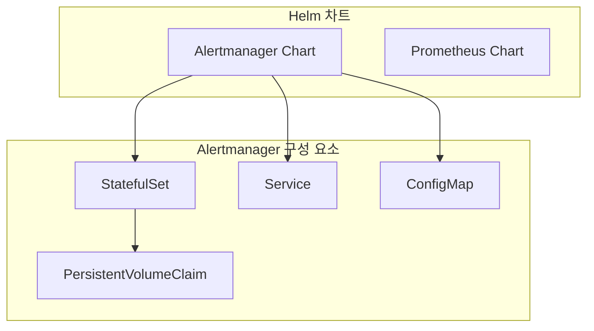
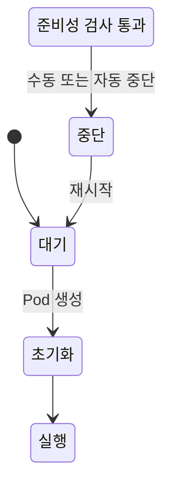
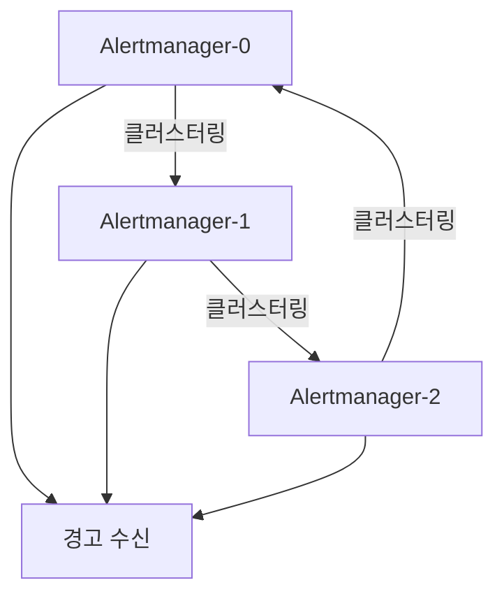
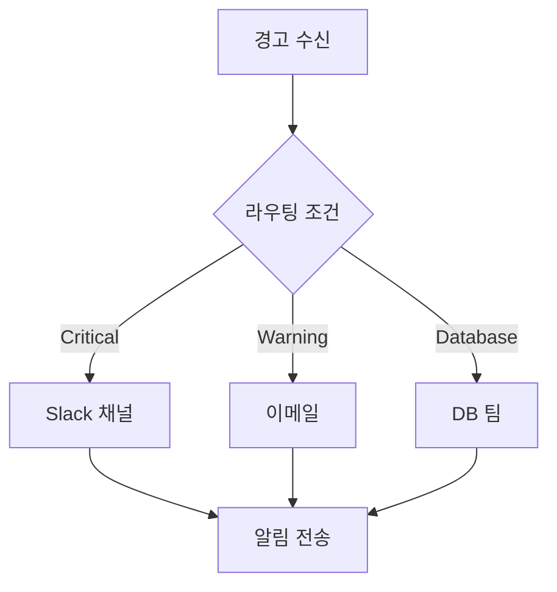

# 경고 시스템 구현

<cite>
**이 문서에서 참조한 파일**  
- [values.yaml](file://helm/development-tools/prometheus/charts/alertmanager/values.yaml)
- [statefulset.yaml](file://helm/development-tools/prometheus/charts/alertmanager/templates/statefulset.yaml)
- [configmap.yaml](file://helm/development-tools/prometheus/charts/alertmanager/templates/configmap.yaml)
- [services.yaml](file://helm/development-tools/prometheus/charts/alertmanager/templates/services.yaml)
- [prometheus/values.yaml](file://helm/development-tools/prometheus/values.yaml)
</cite>

## 목차
1. [소개](#소개)
2. [프로젝트 구조](#프로젝트-구조)
3. [Alertmanager의 StatefulSet 기반 배포](#alertmanager의-statefulset-기반-배포)
4. [HA 구성 및 클러스터링](#ha-구성-및-클러스터링)
5. [알림 채널 설정](#알림-채널-설정)
6. [Prometheus의 룰 정의](#prometheus의-룰-정의)
7. [경고 라우팅 및 중복 제거](#경고-라우팅-및-중복-제거)
8. [실제 values.yaml 설정 예제](#실제-valuesyaml-설정-예제)
9. [결론](#결론)

## 소개
이 문서는 Prometheus와 Alertmanager를 연동한 경고 시스템의 구현을 상세히 설명합니다. Alertmanager의 StatefulSet 기반 배포 구조, 고가용성(HA) 구성, 다양한 알림 채널(메일, 슬랙 등) 설정 방법을 다룹니다. 또한 Prometheus의 recording rule과 alerting rule 정의 방식, 라우팅 트리 기반의 경고 분류 및 중복 제거 전략을 설명하며, 실제 values.yaml 설정 예제를 통해 프로덕션 환경에 적합한 경고 정책을 구성하는 방법을 제시합니다.

## 프로젝트 구조
해당 프로젝트는 Helm 차트 기반으로 구성되어 있으며, `helm/development-tools/prometheus` 디렉터리 내에 Prometheus 및 Alertmanager 관련 설정이 포함되어 있습니다. Alertmanager는 별도의 Helm 차트로 관리되며, 주요 설정 파일은 `values.yaml`과 템플릿 파일들로 구성됩니다. 주요 구성 요소는 다음과 같습니다:

- `charts/alertmanager/`: Alertmanager Helm 차트
- `templates/`: Kubernetes 리소스 템플릿 (StatefulSet, Service, ConfigMap 등)
- `values.yaml`: 사용자 정의 설정 값

**Diagram sources**
- [statefulset.yaml](file://helm/development-tools/prometheus/charts/alertmanager/templates/statefulset.yaml)
- [services.yaml](file://helm/development-tools/prometheus/charts/alertmanager/templates/services.yaml)



**Section sources**
- [statefulset.yaml](file://helm/development-tools/prometheus/charts/alertmanager/templates/statefulset.yaml)
- [services.yaml](file://helm/development-tools/prometheus/charts/alertmanager/templates/services.yaml)

## Alertmanager의 StatefulSet 기반 배포
Alertmanager는 상태를 유지해야 하는 애플리케이션으로, StatefulSet을 통해 배포됩니다. StatefulSet은 각 Pod에 고유한 식별자와 영구 스토리지를 제공하여, 클러스터링 및 고가용성 구성에 적합합니다.

주요 설정 항목:
- `replicaCount`: 복제본 수 (HA 구성 시 3 이상 권장)
- `persistence.enabled`: 영구 스토리지 사용 여부
- `persistence.size`: PVC 크기
- `podAntiAffinity`: 동일 노드에 Pod 스케줄링 방지

**Diagram sources**
- [statefulset.yaml](file://helm/development-tools/prometheus/charts/alertmanager/templates/statefulset.yaml)



**Section sources**
- [statefulset.yaml](file://helm/development-tools/prometheus/charts/alertmanager/templates/statefulset.yaml)

## HA 구성 및 클러스터링
Alertmanager는 클러스터 모드로 실행되어 상태를 공유하고, 단일 장애 지점(SPOF)을 방지합니다. 여러 인스턴스가 피어 간 통신을 통해 알림 상태를 동기화합니다.

주요 설정:
- `replicaCount`: 3 이상 설정
- `podAntiAffinity`: 서로 다른 노드에 스케줄링
- `additionalPeers`: 외부 피어 추가
- 클러스터 포트: `9094` (TCP/UDP)

클러스터링은 Gossip 프로토콜을 기반으로 하며, 각 인스턴스는 다른 인스턴스와 연결되어 상태를 공유합니다. 이를 통해 하나의 인스턴스가 실패하더라도 나머지 인스턴스가 알림을 처리할 수 있습니다.

**Diagram sources**
- [statefulset.yaml](file://helm/development-tools/prometheus/charts/alertmanager/templates/statefulset.yaml)



**Section sources**
- [statefulset.yaml](file://helm/development-tools/prometheus/charts/alertmanager/templates/statefulset.yaml)

## 알림 채널 설정
Alertmanager는 다양한 알림 채널을 지원합니다. 설정은 `config` 섹션 내 `receivers`에 정의됩니다.

지원 채널:
- Slack
- 이메일
- PagerDuty
- Webhook
- OpsGenie 등

예시 설정:
```yaml
config:
  receivers:
    - name: 'slack-notifications'
      slack_configs:
        - channel: '#alerts'
          send_resolved: true
          api_url: 'https://hooks.slack.com/services/...'
```

비밀 정보는 Kubernetes Secret으로 관리하며, `values.yaml`에서 참조할 수 있습니다.

**Section sources**
- [configmap.yaml](file://helm/development-tools/prometheus/charts/alertmanager/templates/configmap.yaml)

## Prometheus의 룰 정의
Prometheus는 recording rules와 alerting rules를 통해 메트릭을 처리하고 경고를 생성합니다.

- **Recording rules**: 복잡한 쿼리를 미리 계산하여 저장
- **Alerting rules**: 조건을 만족하면 Alertmanager로 경고 전송

예시:
```yaml
rule_files:
  - /etc/prometheus/rules/*.rules
```

Helm 차트에서는 `prometheus.values.yaml` 내 `server.extraConfigmapMounts` 등을 통해 룰 파일을 마운트할 수 있습니다.

**Section sources**
- [prometheus/values.yaml](file://helm/development-tools/prometheus/values.yaml)

## 경고 라우팅 및 중복 제거
Alertmanager는 라우팅 트리를 기반으로 경고를 분류하고, 중복을 제거합니다.

주요 기능:
- `route`: 경고를 수신자로 라우팅
- `group_by`: 경고 그룹화 (예: `alertname`, `cluster`)
- `group_wait`, `group_interval`, `repeat_interval`: 중복 제거 및 반복 간격 설정

예시:
```yaml
route:
  group_by: ['alertname', 'cluster']
  group_wait: 30s
  group_interval: 5m
  repeat_interval: 3h
  receiver: 'default-receiver'
```

이를 통해 유사한 경고를 묶어 한 번에 전송함으로써 알림 폭주를 방지합니다.

**Diagram sources**
- [configmap.yaml](file://helm/development-tools/prometheus/charts/alertmanager/templates/configmap.yaml)



**Section sources**
- [configmap.yaml](file://helm/development-tools/prometheus/charts/alertmanager/templates/configmap.yaml)

## 실제 values.yaml 설정 예제
다음은 프로덕션 환경에 적합한 Alertmanager 설정 예제입니다.

```yaml
replicaCount: 3
persistence:
  enabled: true
  size: 10Gi
  storageClass: openebs-hostpath

podAntiAffinity: "soft"
podAntiAffinityTopologyKey: kubernetes.io/hostname

config:
  enabled: true
  global:
    resolve_timeout: 5m
  route:
    group_by: ['alertname']
    group_wait: 30s
    group_interval: 5m
    repeat_interval: 3h
    receiver: 'slack-notifications'
  receivers:
    - name: 'slack-notifications'
      slack_configs:
        - channel: '#alerts'
          send_resolved: true
  templates:
    - '/etc/alertmanager/template/*.tmpl'
```

이 설정은 HA 환경에서 안정적인 경고 전달을 보장합니다.

**Section sources**
- [values.yaml](file://helm/development-tools/prometheus/charts/alertmanager/values.yaml)

## 결론
Prometheus와 Alertmanager를 연동한 경고 시스템은 모니터링 환경의 핵심 요소입니다. StatefulSet 기반의 HA 구성, 다양한 알림 채널, 정교한 라우팅 및 중복 제거 전략을 통해 신뢰성 높은 경고 시스템을 구축할 수 있습니다. Helm 차트를 활용하면 설정을 일관되게 관리하고, 프로덕션 환경에 맞게 쉽게 조정할 수 있습니다.