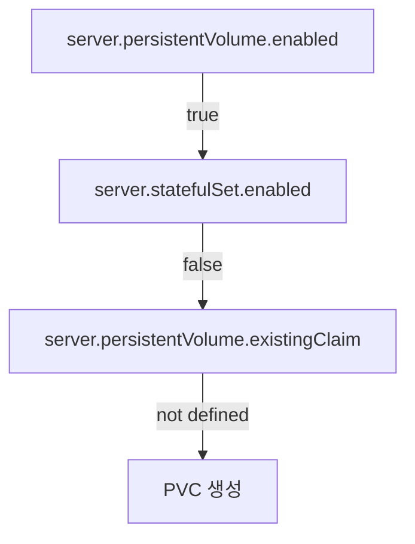

# 데이터 저장소 구성

<cite>
**이 문서에서 참조한 파일**  
- [values.yaml](file://helm/development-tools/prometheus/values.yaml)
- [pvc.yaml](file://helm/development-tools/prometheus/templates/pvc.yaml)
- [deploy.yaml](file://helm/development-tools/prometheus/templates/deploy.yaml)
- [prometheus-pushgateway/values.yaml](file://helm/development-tools/prometheus/charts/prometheus-pushgateway/values.yaml)
- [pushgateway-pvc.yaml](file://helm/development-tools/prometheus/charts/prometheus-pushgateway/templates/pushgateway-pvc.yaml)
</cite>

## 목차
1. [소개](#소개)
2. [PVC 기반 영구 스토리지 설정](#pvc-기반-영구-스토리지-설정)
3. [스토리지 클래스 선택](#스토리지-클래스-선택)
4. [리텐션 정책 및 데이터 압축 전략](#리텐션-정책-및-데이터-압축-전략)
5. [Pushgateway를 통한 단기 메트릭 수집](#pushgateway를-통한-단기-메트릭-수집)
6. [외부 시스템과의 통합](#외부-시스템과의-통합)
7. [스토리지 리소스 확장 전략](#스토리지-리소스-확장-전략)
8. [백업 및 복구 절차](#백업-및-복구-절차)
9. [values.yaml을 통한 구성 예제](#values.yaml을-통한-구성-예제)

## 소개
이 문서는 Kubernetes 환경에서 Prometheus의 지속성 데이터 저장소를 구성하는 방법을 상세히 설명합니다. PVC 기반의 영구 스토리지 설정, 스토리지 클래스 선택, 리텐션 정책, 데이터 압축 전략, Pushgateway를 통한 단기 메트릭 수집, 외부 시스템과의 통합 방법, 스토리지 리소스 확장 전략 및 백업/복구 절차를 다룹니다. 또한 `values.yaml`을 통한 스토리지 크기, 리텐션 기간, 블록 저장소 설정 방법을 실제 예제와 함께 설명합니다.

## PVC 기반 영구 스토리지 설정
Prometheus 서버는 영구적인 데이터 저장을 위해 PVC(Persistent Volume Claim)를 사용합니다. PVC는 데이터의 지속성을 보장하며, Pod가 재시작되거나 이동하더라도 데이터를 유지할 수 있습니다.

### PVC 생성 조건
PVC는 다음 조건을 만족할 때 생성됩니다:
- `server.persistentVolume.enabled`가 `true`로 설정된 경우
- `server.statefulSet.enabled`가 `false`인 경우
- `server.persistentVolume.existingClaim`이 정의되지 않은 경우

이러한 조건은 `pvc.yaml` 템플릿에서 확인할 수 있습니다.



**Diagram sources**
- [pvc.yaml](file://helm/development-tools/prometheus/templates/pvc.yaml#L1-L40)

**Section sources**
- [pvc.yaml](file://helm/development-tools/prometheus/templates/pvc.yaml#L1-L40)

## 스토리지 클래스 선택
스토리지 클래스는 PVC가 동적으로 프로비저닝될 때 사용되는 스토리지 유형을 결정합니다. `values.yaml` 파일에서 `server.persistentVolume.storageClass` 값을 설정하여 스토리지 클래스를 지정할 수 있습니다.

### 스토리지 클래스 설정 예제
```yaml
server:
  persistentVolume:
    storageClass: "openebs-hostpath"
```

이 설정은 `openebs-hostpath` 스토리지 클래스를 사용하여 PVC를 생성합니다. 스토리지 클래스를 지정하지 않으면 기본 프로비저너가 사용됩니다.

**Section sources**
- [values.yaml](file://helm/development-tools/prometheus/values.yaml#L582-L589)

## 리텐션 정책 및 데이터 압축 전략
Prometheus는 데이터 리텐션 정책을 통해 저장된 메트릭 데이터의 보존 기간을 관리합니다. 리텐션 기간과 크기를 설정하여 데이터 저장소를 최적화할 수 있습니다.

### 리텐션 정책 설정
`values.yaml` 파일에서 `server.retention`과 `server.retentionSize`를 설정하여 리텐션 정책을 구성할 수 있습니다.

```yaml
server:
  retention: 15d
  retentionSize: 10GB
```

이 설정은 데이터를 15일 동안 보관하며, 최대 10GB까지 저장할 수 있습니다.

### 데이터 압축 전략
Prometheus는 Write-Ahead Log(WAL) 압축을 통해 디스크 사용량을 줄일 수 있습니다. `extraFlags`에 `storage.tsdb.wal-compression` 플래그를 추가하여 WAL 압축을 활성화할 수 있습니다.

```yaml
server:
  extraFlags:
    - storage.tsdb.wal-compression
```

**Section sources**
- [values.yaml](file://helm/development-tools/prometheus/values.yaml#L245-L262)
- [deploy.yaml](file://helm/development-tools/prometheus/templates/deploy.yaml#L195-L198)

## Pushgateway를 통한 단기 메트릭 수집
Pushgateway는 단기 작업에서 생성된 메트릭을 수집하고 저장하는 데 사용됩니다. 이는 배치 작업이나 짧은 수명의 작업에서 유용합니다.

### Pushgateway 구성
Pushgateway는 별도의 Helm 차트로 제공되며, `values.yaml` 파일에서 구성할 수 있습니다.

```yaml
persistentVolume:
  enabled: true
  size: 2Gi
  mountPath: /data
```

이 설정은 Pushgateway에 2GiB의 PVC를 할당합니다.

**Section sources**
- [prometheus-pushgateway/values.yaml](file://helm/development-tools/prometheus/charts/prometheus-pushgateway/values.yaml#L319-L347)
- [pushgateway-pvc.yaml](file://helm/development-tools/prometheus/charts/prometheus-pushgateway/templates/pushgateway-pvc.yaml#L1-L30)

## 외부 시스템과의 통합
Prometheus는 다양한 외부 시스템과 통합할 수 있습니다. 예를 들어, `remoteWrite`와 `remoteRead`를 사용하여 외부 시스템으로 데이터를 전송하거나 외부 시스템에서 데이터를 읽을 수 있습니다.

### remoteWrite 구성
```yaml
remoteWrite:
  - url: "http://remote-prometheus:9090/api/v1/write"
```

이 설정은 메트릭 데이터를 원격 Prometheus 서버로 전송합니다.

**Section sources**
- [values.yaml](file://helm/development-tools/prometheus/values.yaml#L280-L282)

## 스토리지 리소스 확장 전략
스토리지 리소스를 확장하기 위해 PVC의 크기를 증가시키거나, StatefulSet을 사용하여 여러 PVC를 관리할 수 있습니다.

### StatefulSet 사용
StatefulSet을 사용하면 각 Pod에 대해 별도의 PVC를 생성할 수 있습니다. 이는 고가용성과 확장성을 제공합니다.

```yaml
server:
  statefulSet:
    enabled: true
```

**Section sources**
- [values.yaml](file://helm/development-tools/prometheus/values.yaml#L649-L653)

## 백업 및 복구 절차
데이터의 안전성을 보장하기 위해 정기적인 백업과 복구 절차를 수립해야 합니다. PVC에 저장된 데이터는 볼륨 스냅샷을 사용하여 백업할 수 있습니다.

### 볼륨 스냅샷 생성
```bash
kubectl create snapshot pvc-name --snapshot-class=snapshot-class-name
```

이 명령은 PVC의 스냅샷을 생성합니다. 복구 시에는 스냅샷을 사용하여 새로운 PVC를 생성할 수 있습니다.

**Section sources**
- [values.yaml](file://helm/development-tools/prometheus/values.yaml#L578-L580)

## values.yaml을 통한 구성 예제
다음은 `values.yaml` 파일을 사용하여 Prometheus의 스토리지 설정을 구성하는 예제입니다.

```yaml
server:
  persistentVolume:
    enabled: true
    size: 16Gi
    storageClass: "openebs-hostpath"
    accessModes:
      - ReadWriteOnce
    mountPath: /data
  retention: 30d
  retentionSize: 20GB
  extraFlags:
    - storage.tsdb.wal-compression
```

이 설정은 16GiB의 PVC를 생성하고, 데이터를 30일 동안 보관하며, WAL 압축을 활성화합니다.

**Section sources**
- [values.yaml](file://helm/development-tools/prometheus/values.yaml#L543-L580)