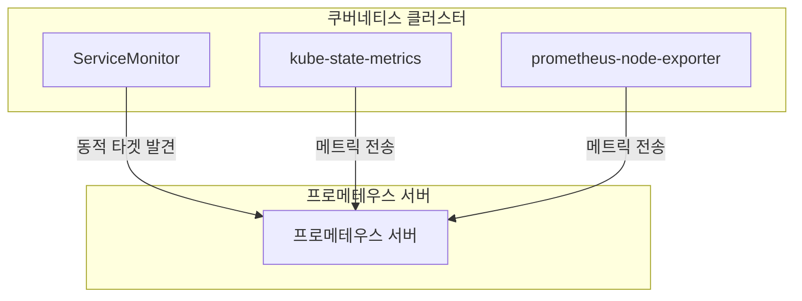
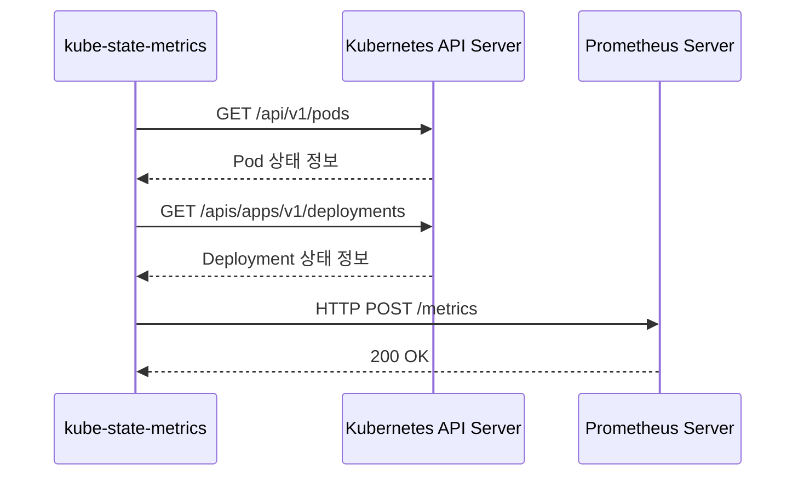
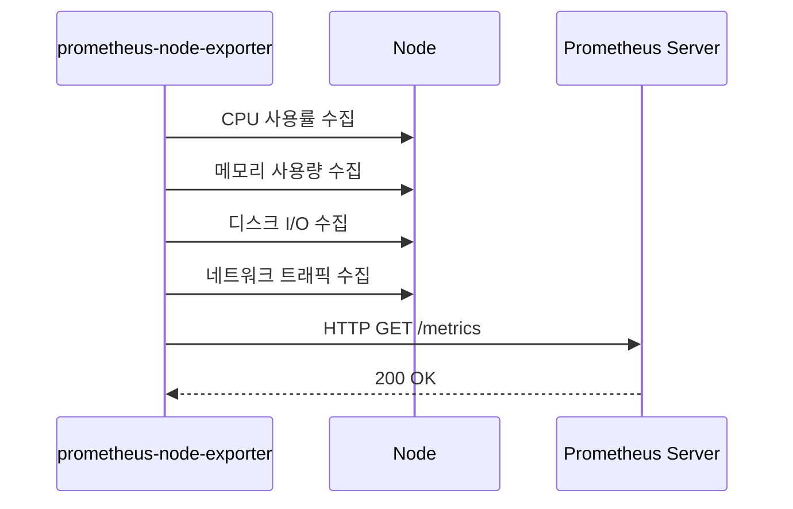
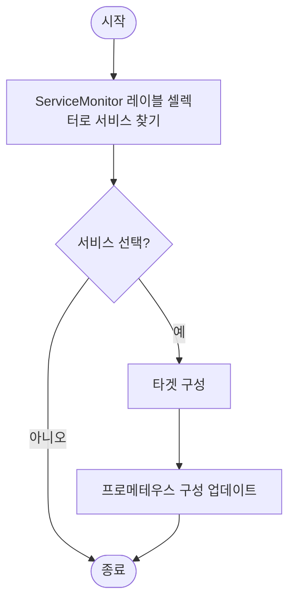
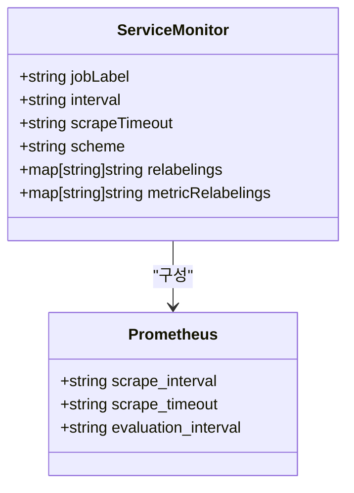
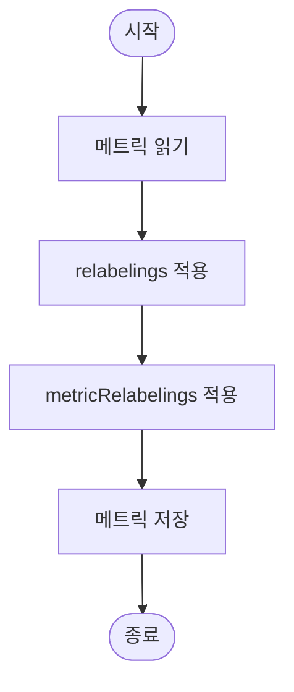
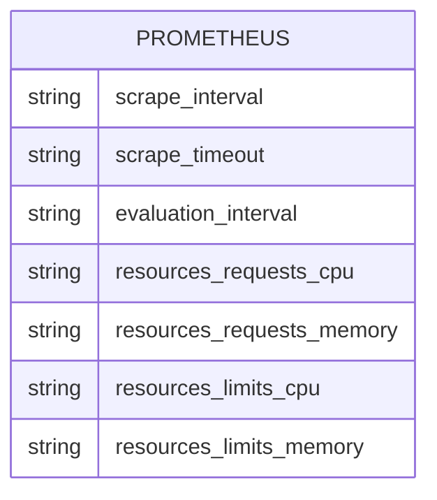

# 메트릭 수집 구현

<cite>
**이 문서에서 참조한 파일**
- [values.yaml](file://helm/development-tools/prometheus/values.yaml)
- [servicemonitor.yaml](file://helm/development-tools/prometheus/charts/kube-state-metrics/templates/servicemonitor.yaml)
- [values.yaml](file://helm/development-tools/prometheus/charts/kube-state-metrics/values.yaml)
- [servicemonitor.yaml](file://helm/development-tools/prometheus/charts/prometheus-node-exporter/templates/servicemonitor.yaml)
- [values.yaml](file://helm/development-tools/prometheus/charts/prometheus-node-exporter/values.yaml)
</cite>

## 목차
1. [소개](#소개)
2. [프로메테우스 기반 메트릭 수집 아키텍처](#프로메테우스-기반-메트릭-수집-아키텍처)
3. [kube-state-metrics를 통한 쿠버네티스 오브젝트 상태 수집](#kube-state-metrics를-통한-쿠버네티스-오브젝트-상태-수집)
4. [prometheus-node-exporter를 통한 노드 수준 메트릭 수집](#prometheus-node-exporter를-통한-노드-수준-메트릭-수집)
5. [ServiceMonitor 리소스를 통한 동적 타겟 발견 메커니즘](#servicemonitor-리소스를-통한-동적-타겟-발견-메커니즘)
6. [수집 대상 필터링 및 샘플링 설정](#수집-대상-필터링-및-샘플링-설정)
7. [메트릭 레이블 재작성 규칙](#메트릭-레이블-재작성-규칙)
8. [values.yaml을 통한 수집 간격, 타임아웃 설정 및 리소스 제한 방법](#values.yaml을-통한-수집-간격-타임아웃-설정-및-리소스-제한-방법)
9. [결론](#결론)

## 소개
이 문서는 프로메테우스 기반 메트릭 수집 시스템의 구현을 상세히 설명합니다. kube-state-metrics를 통한 Kubernetes 오브젝트 상태 수집과 prometheus-node-exporter를 통한 노드 수준 메트릭 수집 구조를 다룹니다. ServiceMonitor 리소스를 통한 동적 타겟 발견 메커니즘, 수집 대상 필터링 및 샘플링 설정, 그리고 메트릭 레이블 재작성 규칙을 설명합니다. values.yaml을 통한 수집 간격, 타임아웃 설정 및 리소스 제한 방법을 포함하며, 실제 코드 예제를 통해 수집 파이프라인을 설명합니다.

## 프로메테우스 기반 메트릭 수집 아키텍처
프로메테우스는 쿠버네티스 환경에서 메트릭을 수집하고 모니터링하기 위한 오픈소스 모니터링 시스템입니다. 이 아키텍처는 프로메테우스 서버, kube-state-metrics, prometheus-node-exporter 및 ServiceMonitor 리소스로 구성됩니다. 프로메테우스 서버는 메트릭을 수집하고 저장하며, kube-state-metrics는 쿠버네티스 오브젝트의 상태를 수집하고, prometheus-node-exporter는 노드 수준의 메트릭을 수집합니다. ServiceMonitor 리소스는 프로메테우스가 수집할 타겟을 동적으로 발견하고 구성합니다.

**다이어그램 소스**
- [values.yaml](file://helm/development-tools/prometheus/values.yaml)
- [servicemonitor.yaml](file://helm/development-tools/prometheus/charts/kube-state-metrics/templates/servicemonitor.yaml)
- [servicemonitor.yaml](file://helm/development-tools/prometheus/charts/prometheus-node-exporter/templates/servicemonitor.yaml)

## kube-state-metrics를 통한 쿠버네티스 오브젝트 상태 수집
kube-state-metrics는 쿠버네티스 오브젝트의 상태를 메트릭으로 수집하여 프로메테우스에 제공합니다. 이 컴포넌트는 쿠버네티스 API 서버에서 오브젝트 상태를 주기적으로 가져와 메트릭으로 변환합니다. 수집 가능한 오브젝트는 Pod, Deployment, Service, ConfigMap, Secret 등 다양합니다. kube-state-metrics는 쿠버네티스 클러스터 내에서 데몬셋 또는 디플로이먼트로 배포되며, 각 노드에서 실행됩니다.

**다이어그램 소스**
- [values.yaml](file://helm/development-tools/prometheus/charts/kube-state-metrics/values.yaml)
- [servicemonitor.yaml](file://helm/development-tools/prometheus/charts/kube-state-metrics/templates/servicemonitor.yaml)

**섹션 소스**
- [values.yaml](file://helm/development-tools/prometheus/charts/kube-state-metrics/values.yaml)
- [servicemonitor.yaml](file://helm/development-tools/prometheus/charts/kube-state-metrics/templates/servicemonitor.yaml)

## prometheus-node-exporter를 통한 노드 수준 메트릭 수집
prometheus-node-exporter는 쿠버네티스 노드의 하드웨어 및 운영 체제 메트릭을 수집합니다. 이 컴포넌트는 각 노드에서 데몬셋으로 실행되며, CPU 사용률, 메모리 사용량, 디스크 I/O, 네트워크 트래픽 등의 메트릭을 수집합니다. 수집된 메트릭은 HTTP 엔드포인트를 통해 노출되며, 프로메테우스 서버가 주기적으로 스크래핑합니다.

**다이어그램 소스**
- [values.yaml](file://helm/development-tools/prometheus/charts/prometheus-node-exporter/values.yaml)
- [servicemonitor.yaml](file://helm/development-tools/prometheus/charts/prometheus-node-exporter/templates/servicemonitor.yaml)

**섹션 소스**
- [values.yaml](file://helm/development-tools/prometheus/charts/prometheus-node-exporter/values.yaml)
- [servicemonitor.yaml](file://helm/development-tools/prometheus/charts/prometheus-node-exporter/templates/servicemonitor.yaml)

## ServiceMonitor 리소스를 통한 동적 타겟 발견 메커니즘
ServiceMonitor 리소스는 프로메테우스가 수집할 타겟을 동적으로 발견하고 구성하는 데 사용됩니다. ServiceMonitor는 쿠버네티스 서비스를 기반으로 타겟을 정의하며, 레이블 셀렉터를 사용하여 관련 서비스를 선택합니다. 프로메테우스 서버는 ServiceMonitor 리소스를 감시하고, 새로운 타겟이 추가되거나 기존 타겟이 변경되면 자동으로 구성이 업데이트됩니다.

**다이어그램 소스**
- [servicemonitor.yaml](file://helm/development-tools/prometheus/charts/kube-state-metrics/templates/servicemonitor.yaml)
- [servicemonitor.yaml](file://helm/development-tools/prometheus/charts/prometheus-node-exporter/templates/servicemonitor.yaml)

**섹션 소스**
- [servicemonitor.yaml](file://helm/development-tools/prometheus/charts/kube-state-metrics/templates/servicemonitor.yaml)
- [servicemonitor.yaml](file://helm/development-tools/prometheus/charts/prometheus-node-exporter/templates/servicemonitor.yaml)

## 수집 대상 필터링 및 샘플링 설정
수집 대상 필터링 및 샘플링 설정은 프로메테우스가 수집할 메트릭을 제어하는 데 사용됩니다. 필터링은 특정 메트릭만 수집하도록 제한하며, 샘플링은 수집 주기를 조정하여 리소스 사용을 최적화합니다. 이러한 설정은 values.yaml 파일에서 구성할 수 있습니다.

**다이어그램 소스**
- [values.yaml](file://helm/development-tools/prometheus/values.yaml)
- [servicemonitor.yaml](file://helm/development-tools/prometheus/charts/kube-state-metrics/templates/servicemonitor.yaml)
- [servicemonitor.yaml](file://helm/development-tools/prometheus/charts/prometheus-node-exporter/templates/servicemonitor.yaml)

**섹션 소스**
- [values.yaml](file://helm/development-tools/prometheus/values.yaml)
- [servicemonitor.yaml](file://helm/development-tools/prometheus/charts/kube-state-metrics/templates/servicemonitor.yaml)
- [servicemonitor.yaml](file://helm/development-tools/prometheus/charts/prometheus-node-exporter/templates/servicemonitor.yaml)

## 메트릭 레이블 재작성 규칙
메트릭 레이블 재작성 규칙은 수집된 메트릭의 레이블을 수정하거나 추가하는 데 사용됩니다. 이 규칙은 relabelings 및 metricRelabelings 설정을 통해 구성할 수 있으며, 메트릭의 의미를 명확히 하거나 불필요한 레이블을 제거하는 데 유용합니다.

**다이어그램 소스**
- [servicemonitor.yaml](file://helm/development-tools/prometheus/charts/kube-state-metrics/templates/servicemonitor.yaml)
- [servicemonitor.yaml](file://helm/development-tools/prometheus/charts/prometheus-node-exporter/templates/servicemonitor.yaml)

**섹션 소스**
- [servicemonitor.yaml](file://helm/development-tools/prometheus/charts/kube-state-metrics/templates/servicemonitor.yaml)
- [servicemonitor.yaml](file://helm/development-tools/prometheus/charts/prometheus-node-exporter/templates/servicemonitor.yaml)

## values.yaml을 통한 수집 간격, 타임아웃 설정 및 리소스 제한 방법
values.yaml 파일을 통해 프로메테우스의 수집 간격, 타임아웃 및 리소스 제한을 구성할 수 있습니다. 이러한 설정은 프로메테우스 서버의 성능과 안정성에 직접적인 영향을 미칩니다. 예를 들어, 수집 간격을 짧게 설정하면 더 자세한 메트릭을 얻을 수 있지만, 리소스 사용량이 증가할 수 있습니다.

**다이어그램 소스**
- [values.yaml](file://helm/development-tools/prometheus/values.yaml)

**섹션 소스**
- [values.yaml](file://helm/development-tools/prometheus/values.yaml)

## 결론
이 문서는 프로메테우스 기반 메트릭 수집 시스템의 구현을 상세히 설명하였습니다. kube-state-metrics를 통한 쿠버네티스 오브젝트 상태 수집과 prometheus-node-exporter를 통한 노드 수준 메트릭 수집 구조를 다루었으며, ServiceMonitor 리소스를 통한 동적 타겟 발견 메커니즘, 수집 대상 필터링 및 샘플링 설정, 그리고 메트릭 레이블 재작성 규칙을 설명하였습니다. 또한, values.yaml을 통한 수집 간격, 타임아웃 설정 및 리소스 제한 방법을 포함하여 실제 코드 예제를 통해 수집 파이프라인을 설명하였습니다. 이러한 정보는 프로메테우스 기반 모니터링 시스템을 효과적으로 구성하고 운영하는 데 도움이 될 것입니다.