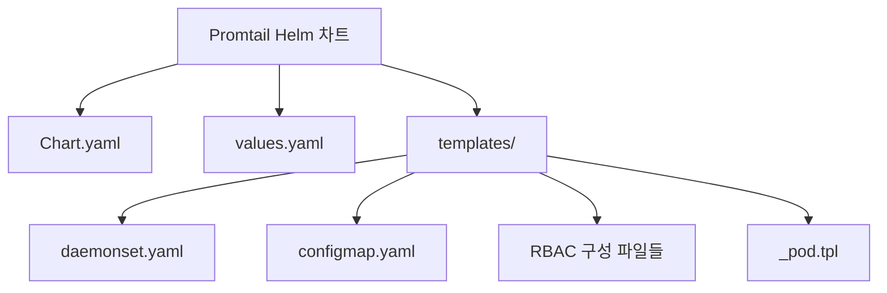
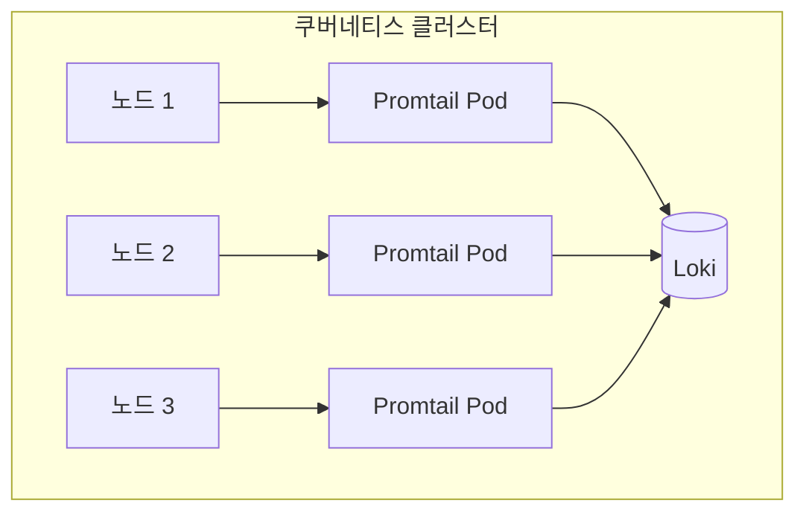
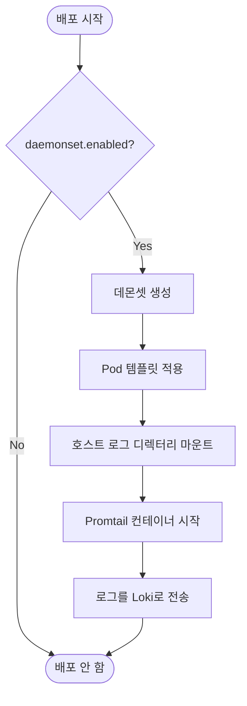
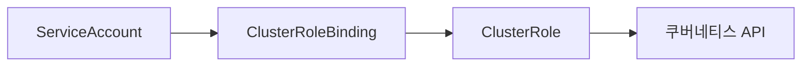

# Promtail 로그 수집 파이프라인

<cite>
**이 문서에서 참조한 파일**  
- [Chart.yaml](file://helm/development-tools/promtail/Chart.yaml)
- [values.yaml](file://helm/development-tools/promtail/values.yaml)
- [configmap.yaml](file://helm/development-tools/promtail/templates/configmap.yaml)
- [daemonset.yaml](file://helm/development-tools/promtail/templates/daemonset.yaml)
- [clusterrole.yaml](file://helm/development-tools/promtail/templates/clusterrole.yaml)
- [clusterrolebinding.yaml](file://helm/development-tools/promtail/templates/clusterrolebinding.yaml)
- [serviceaccount.yaml](file://helm/development-tools/promtail/templates/serviceaccount.yaml)
- [_pod.tpl](file://helm/development-tools/promtail/templates/_pod.tpl)
</cite>

## 목차
1. [소개](#소개)
2. [프로젝트 구조](#프로젝트-구조)
3. [핵심 구성 요소](#핵심-구성-요소)
4. [배포 아키텍처 개요](#배포-아키텍처-개요)
5. [상세 구성 요소 분석](#상세-구성-요소-분석)
6. [권한 및 RBAC 구성](#권한-및-rbac-구성)
7. [로그 수집 필터링 및 파싱 규칙](#로그-수집-필터링-및-파싱-규칙)
8. [운영 환경 구성](#운영-환경-구성)
9. [결론](#결론)

## 소개
Promtail은 로그를 수집하여 Loki 또는 기타 대상 시스템으로 전송하는 에이전트입니다. 본 문서는 Helm 차트를 기반으로 한 Promtail의 로그 수집 파이프라인을 상세히 설명합니다. 데몬셋(DaemonSet)을 통한 노드별 배포 구조, ConfigMap을 통한 로그 수집 설정, 쿠버네티스 API 접근을 위한 RBAC 및 서비스 어카운트 구성, 그리고 운영 환경에서의 리소스 제한 및 네트워크 정책 설정까지 전반적인 구성을 다룹니다.

## 프로젝트 구조
Promtail Helm 차트는 `helm/development-tools/promtail/` 디렉터리에 위치하며, 다음과 같은 주요 구성 요소로 이루어져 있습니다:

- `Chart.yaml`: 차트의 메타데이터 및 버전 정보
- `values.yaml`: 기본 구성 값 정의
- `templates/`: Kubernetes 매니페스트 템플릿
  - `daemonset.yaml`: 데몬셋 배포 정의
  - `configmap.yaml`: 로그 수집 설정 정의
  - `clusterrole.yaml`, `clusterrolebinding.yaml`, `serviceaccount.yaml`: 권한 관리 구성
  - `_pod.tpl`: 공통 Pod 템플릿 정의



**다이어그램 출처**
- [Chart.yaml](file://helm/development-tools/promtail/Chart.yaml)
- [values.yaml](file://helm/development-tools/promtail/values.yaml)
- [daemonset.yaml](file://helm/development-tools/promtail/templates/daemonset.yaml)
- [configmap.yaml](file://helm/development-tools/promtail/templates/configmap.yaml)

**섹션 출처**
- [Chart.yaml](file://helm/development-tools/promtail/Chart.yaml)
- [values.yaml](file://helm/development-tools/promtail/values.yaml)

## 핵심 구성 요소

Promtail의 핵심 구성 요소는 다음과 같습니다:

- **데몬셋(DaemonSet)**: 모든 쿠버네티스 노드에 Promtail Pod를 배포하여 로그를 수집
- **ConfigMap**: 로그 수집 및 파싱 규칙을 정의한 설정 파일
- **ServiceAccount 및 RBAC**: 쿠버네티스 API에 접근하기 위한 권한 부여
- **values.yaml**: 사용자 정의 가능한 다양한 설정 옵션 제공

**섹션 출처**
- [values.yaml](file://helm/development-tools/promtail/values.yaml)
- [daemonset.yaml](file://helm/development-tools/promtail/templates/daemonset.yaml)
- [configmap.yaml](file://helm/development-tools/promtail/templates/configmap.yaml)

## 배포 아키텍처 개요

Promtail은 데몬셋으로 배포되며, 각 노드에 하나의 Pod가 실행됩니다. 이는 모든 노드의 파드 로그를 수집할 수 있도록 보장합니다. Pod는 호스트의 로그 디렉터리(`/var/log/pods`, `/var/lib/docker/containers`)에 접근할 수 있도록 볼륨 마운트가 구성되어 있으며, 수집된 로그는 설정된 Loki 엔드포인트로 전송됩니다.



**다이어그램 출처**
- [daemonset.yaml](file://helm/development-tools/promtail/templates/daemonset.yaml)
- [_pod.tpl](file://helm/development-tools/promtail/templates/_pod.tpl)

**섹션 출처**
- [daemonset.yaml](file://helm/development-tools/promtail/templates/daemonset.yaml)

## 상세 구성 요소 분석

### 데몬셋 배포 구조
Promtail은 `daemonset.yaml`에서 정의된 대로 데몬셋으로 배포됩니다. `.Values.daemonset.enabled` 값이 `true`일 경우에만 배포되며, Pod는 노드의 레이블과 어피니티 설정에 따라 스케줄링됩니다.



**다이어그램 출처**
- [daemonset.yaml](file://helm/development-tools/promtail/templates/daemonset.yaml)
- [_pod.tpl](file://helm/development-tools/promtail/templates/_pod.tpl)

**섹션 출처**
- [daemonset.yaml](file://helm/development-tools/promtail/templates/daemonset.yaml)
- [_pod.tpl](file://helm/development-tools/promtail/templates/_pod.tpl)

### ConfigMap을 통한 로그 수집 설정
`configmap.yaml`은 `values.yaml`의 `config.file` 값을 기반으로 Promtail의 설정 파일을 생성합니다. 설정은 `scrape_configs`, `clients`, `positions` 등의 섹션으로 구성되며, 로그 수집 대상과 전송 대상을 정의합니다.

**섹션 출처**
- [configmap.yaml](file://helm/development-tools/promtail/templates/configmap.yaml)
- [values.yaml](file://helm/development-tools/promtail/values.yaml#L404-L571)

## 권한 및 RBAC 구성

Promtail은 쿠버네티스 API에서 파드 메타데이터를 수집하기 위해 RBAC 권한이 필요합니다. 다음 리소스들이 Helm 차트에 포함되어 있습니다:

- **ServiceAccount**: `promtail` 서비스 어카운트 생성
- **ClusterRole**: 파드, 노드, 네임스페이스 정보를 읽을 수 있는 권한 부여
- **ClusterRoleBinding**: 서비스 어카운트와 클러스터 역할을 바인딩



**다이어그램 출처**
- [serviceaccount.yaml](file://helm/development-tools/promtail/templates/serviceaccount.yaml)
- [clusterrole.yaml](file://helm/development-tools/promtail/templates/clusterrole.yaml)
- [clusterrolebinding.yaml](file://helm/development-tools/promtail/templates/clusterrolebinding.yaml)

**섹션 출처**
- [clusterrole.yaml](file://helm/development-tools/promtail/templates/clusterrole.yaml)
- [clusterrolebinding.yaml](file://helm/development-tools/promtail/templates/clusterrolebinding.yaml)
- [serviceaccount.yaml](file://helm/development-tools/promtail/templates/serviceaccount.yaml)

## 로그 수집 필터링 및 파싱 규칙

`values.yaml` 내 `config.snippets` 섹션을 통해 로그 수집 및 파싱 규칙을 정의할 수 있습니다. 주요 설정은 다음과 같습니다:

- **relabel_configs**: 로그 레이블을 동적으로 추가 또는 수정
- **pipeline_stages**: 로그 파싱 및 변환 파이프라인 (예: CRI 로그 파싱)
- **scrape_configs**: 수집 대상 지정 (예: kubernetes-pods)

특히 `__path__` 레이블은 수집할 로그 파일의 경로를 지정하며, `__meta_kubernetes_pod_uid`와 컨테이너 이름을 조합하여 동적으로 생성됩니다.

**섹션 출처**
- [values.yaml](file://helm/development-tools/promtail/values.yaml#L437-L540)

## 운영 환경 구성

운영 환경에서의 안정성과 보안을 위해 다음과 같은 설정이 가능합니다:

- **리소스 제한**: `resources` 필드를 통해 CPU 및 메모리 요청/제한 설정
- **수집 대상 제외**: `extraRelabelConfigs`를 사용하여 특정 네임스페이스 또는 파드 제외
- **네트워크 정책**: `networkPolicy.enabled`를 `true`로 설정하여 네트워크 접근 제어
- **노드 스케줄링 제어**: `nodeSelector`, `tolerations`, `affinity`를 통해 특정 노드에만 배포

예를 들어, 특정 네임스페이스의 로그를 제외하려면 다음과 같이 설정할 수 있습니다:
```yaml
config:
  snippets:
    extraRelabelConfigs:
      - source_labels: [__meta_kubernetes_namespace]
        regex: kube-system|monitoring
        action: drop
```

**섹션 출처**
- [values.yaml](file://helm/development-tools/promtail/values.yaml#L154-L162)
- [values.yaml](file://helm/development-tools/promtail/values.yaml#L572-L590)
- [values.yaml](file://helm/development-tools/promtail/values.yaml#L202-L215)

## 결론
Promtail은 Helm 차트를 통해 유연하고 안정적인 로그 수집 파이프라인을 제공합니다. 데몬셋 기반의 배포 구조, ConfigMap을 통한 설정 관리, RBAC 기반의 보안 접근, 그리고 `values.yaml`을 통한 세부 운영 설정까지, 쿠버네티스 환경에서 로그를 효율적으로 수집하고 전송할 수 있는 포괄적인 솔루션을 제공합니다. 이를 통해 Loki와의 통합을 통해 중앙 집중식 로그 관리 아키텍처를 구축할 수 있습니다.