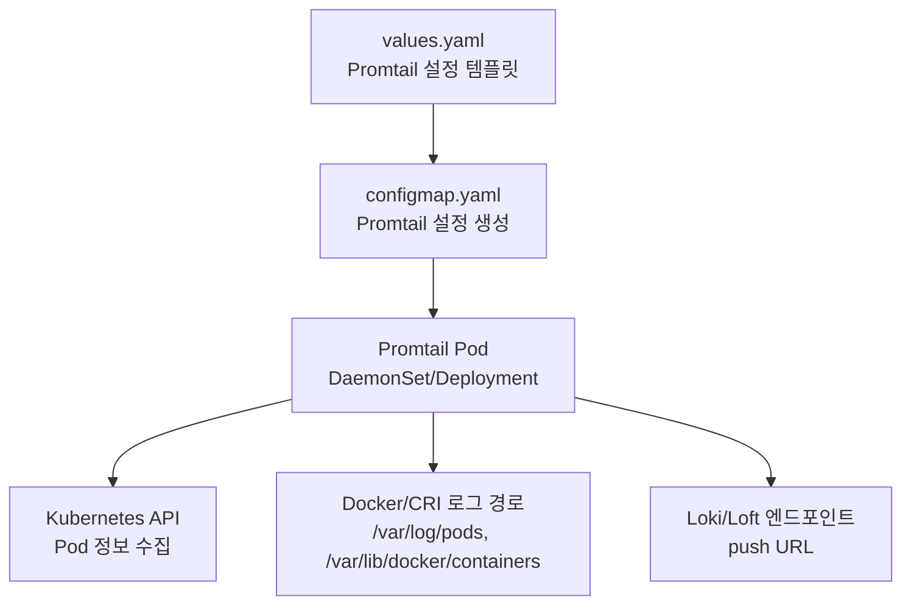
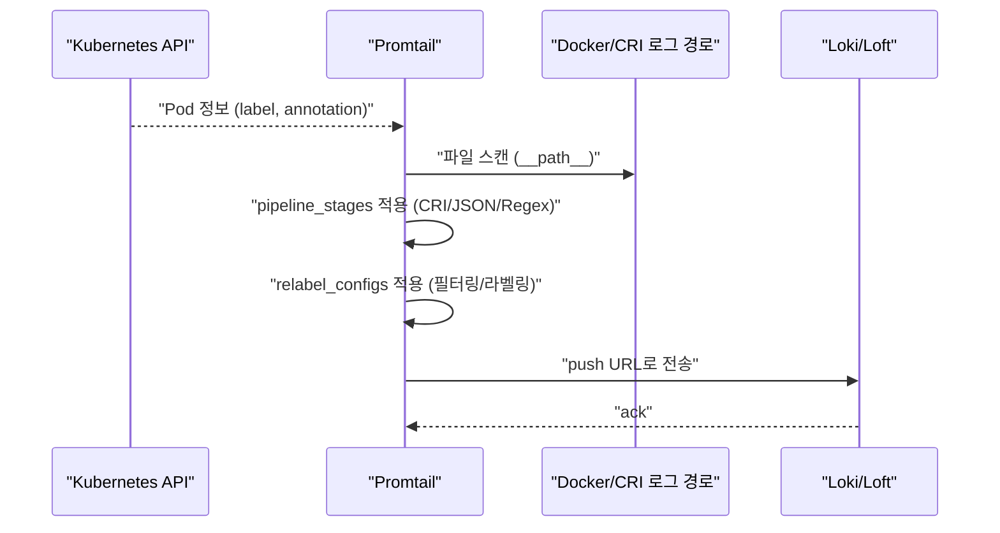
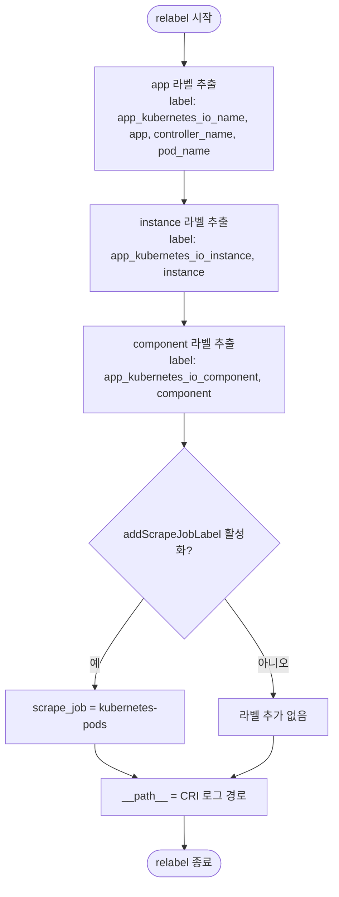
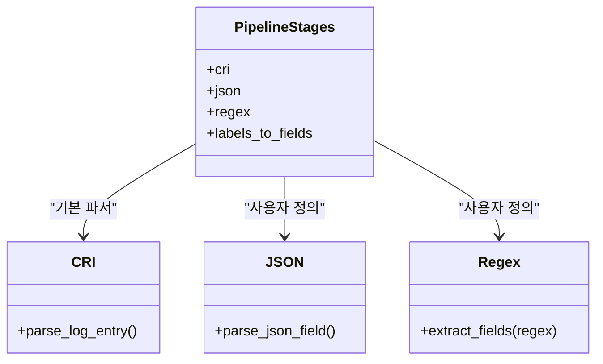
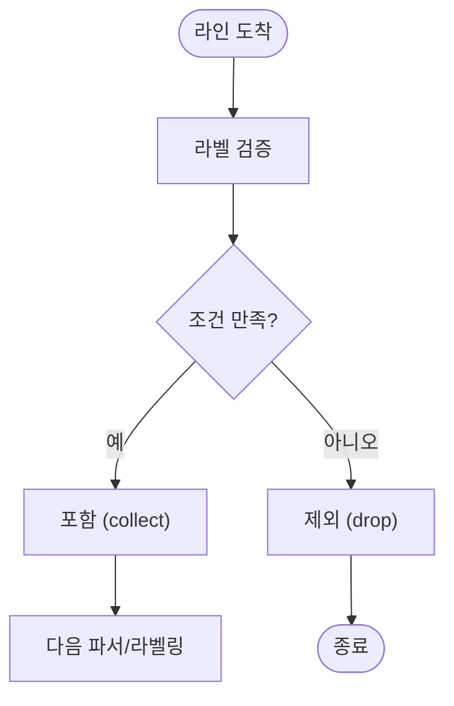
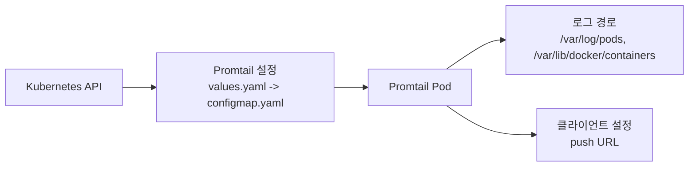

# 로그 수집 구성

<cite>
**문서에서 인용하는 파일**
- [values.yaml](file://helm/development-tools/promtail/values.yaml)
- [configmap.yaml](file://helm/development-tools/promtail/templates/configmap.yaml)
- [_pod.tpl](file://helm/development-tools/promtail/templates/_pod.tpl)
- [README.md](file://helm/development-tools/promtail/README.md)
- [README.md.gotmpl](file://helm/development-tools/promtail/README.md.gotmpl)
- [plate-web/templates/configmap.yaml](file://helm/applications/plate-web/templates/configmap.yaml)
</cite>

## 목차
1. [소개](#소개)
2. [프로젝트 구조](#프로젝트-구조)
3. [핵심 구성 요소](#핵심-구성-요소)
4. [아키텍처 개요](#아키텍처-개요)
5. [상세 구성 분석](#상세-구성-분석)
6. [의존성 분석](#의존성-분석)
7. [성능 고려사항](#성능-고려사항)
8. [장애 진단 가이드](#장애-진단-가이드)
9. [결론](#결론)
10. [부록](#부록)

## 소개
본 문서는 쿠버네티스 환경에서 Promtail을 통한 파드 로그 수집을 위한 필터링 및 파싱 규칙을 상세히 설명합니다. 특히 configmap.yaml에 의해 생성되는 Promtail 설정 파일을 기반으로, 다음과 같은 내용을 다룹니다:
- 수집 대상 지정 (label 조건)
- 파싱 방식 (정규식 파서 또는 JSON 파서)
- 로그 라인 필터링 (include/exclude)
- 사용자 정의 설정 가능 항목 (job_name, pipeline_stages 등)
- 운영 환경에서의 로그 정규화 예시
- 특정 네임스페이스나 컨테이너 로그만 수집하는 방법
- 멀티라인 로그 처리 기법

## 프로젝트 구조
Promtail은 Helm 차트를 통해 설치되며, 설정은 values.yaml에 정의된 템플릿을 통해 configmap.yaml로 생성됩니다. 이후 DaemonSet/Deployment를 통해 Pod에 적용됩니다.

**도표 출처**
- [values.yaml](file://helm/development-tools/promtail/values.yaml#L546-L571)
- [_pod.tpl](file://helm/development-tools/promtail/templates/_pod.tpl#L39-L79)

**섹션 출처**
- [values.yaml](file://helm/development-tools/promtail/values.yaml#L546-L571)
- [_pod.tpl](file://helm/development-tools/promtail/templates/_pod.tpl#L39-L79)

## 핵심 구성 요소
- scrape_configs: Promtail이 수집할 job들을 정의하며, 여기서 label 조건, 파서(stage), 필터링(relabel)이 설정됩니다.
- pipeline_stages: 로그 라인을 파싱하고 라벨링하는 단계입니다. 예를 들어 CRI 파서, 정규식 파서, JSON 파서 등을 포함합니다.
- relabel_configs: 수집된 라인에 대한 라벨 재작성/추가/제거를 통해 필터링 효과를 낼 수 있습니다.
- positions: Promtail이 어디까지 읽었는지를 추적하여 재시작 시 이어받습니다.
- clients: Loki/Loft로 전송할 엔드포인트 URL 등 클라이언트 설정입니다.

**섹션 출처**
- [values.yaml](file://helm/development-tools/promtail/values.yaml#L438-L479)
- [values.yaml](file://helm/development-tools/promtail/values.yaml#L500-L541)
- [values.yaml](file://helm/development-tools/promtail/values.yaml#L428-L431)
- [values.yaml](file://helm/development-tools/promtail/values.yaml#L422-L427)

## 아키텍처 개요
Promtail은 Kubernetes API를 통해 파드 정보를 수집하고, CRI 로그 경로를 스캔하여 로그를 파싱하고 라벨링한 후, 클라이언트 설정에 따라 Loki/Loft로 전송합니다.

**도표 출처**
- [values.yaml](file://helm/development-tools/promtail/values.yaml#L500-L541)
- [values.yaml](file://helm/development-tools/promtail/values.yaml#L438-L479)
- [values.yaml](file://helm/development-tools/promtail/values.yaml#L422-L427)

## 상세 구성 분석

### 1) 수집 대상 지정 (label 조건)
- job_name: kubernetes-pods
- role: pod
- relabel_configs:
  - app, instance, component 라벨 추출 (label 기반)
  - controller 이름 정리 (__tmp_controller_name)
  - 추가적으로 scrape_job 라벨을 붙일 수 있음 (디버깅 목적)
- __path__ 라벨은 CRI 로그 경로로 자동 설정됩니다.

**도표 출처**
- [values.yaml](file://helm/development-tools/promtail/values.yaml#L500-L541)
- [values.yaml](file://helm/development-tools/promtail/values.yaml#L465-L479)

**섹션 출처**
- [values.yaml](file://helm/development-tools/promtail/values.yaml#L500-L541)
- [values.yaml](file://helm/development-tools/promtail/values.yaml#L465-L479)

### 2) 파싱 방식 (정규식 또는 JSON 파서)
- pipeline_stages:
  - CRI 파서: Docker/CRI 로그 포맷을 파싱합니다.
  - JSON 파서: JSON 형식 로그를 파싱합니다.
  - Regex 파서: 정규식을 이용해 특정 필드를 추출합니다.
- CRI 파서는 기본 pipeline_stages에 포함되어 있으며, JSON/Regex 파서는 values.yaml에서 snippets를 통해 추가하거나 수정할 수 있습니다.

**도표 출처**
- [values.yaml](file://helm/development-tools/promtail/values.yaml#L438-L439)
- [values.yaml](file://helm/development-tools/promtail/values.yaml#L438-L479)

**섹션 출처**
- [values.yaml](file://helm/development-tools/promtail/values.yaml#L438-L439)
- [values.yaml](file://helm/development-tools/promtail/values.yaml#L438-L479)

### 3) 로그 라인 필터링 (include/exclude)
- relabel_configs를 통해 필터링이 가능합니다. 예를 들어:
  - 특정 라벨이 일치하는 경우에만 수집 (include)
  - 특정 라벨이 일치하면 제외 (exclude)
- values.yaml에서는 extraRelabelConfigs를 통해 relabel 설정을 확장할 수 있습니다.

**도표 출처**
- [values.yaml](file://helm/development-tools/promtail/values.yaml#L497-L499)
- [values.yaml](file://helm/development-tools/promtail/values.yaml#L537-L540)

**섹션 출처**
- [values.yaml](file://helm/development-tools/promtail/values.yaml#L497-L499)
- [values.yaml](file://helm/development-tools/promtail/values.yaml#L537-L540)

### 4) 사용자 정의 설정 (job_name, pipeline_stages)
- job_name: kubernetes-pods는 기본 job_name이며, 필요 시 extraScrapeConfigs를 통해 추가할 수 있습니다.
- pipeline_stages: snippets.pipelineStages를 수정하여 파서를 추가하거나 변경할 수 있습니다.
- clients: push URL, 클라이언트 옵션 등을 설정할 수 있습니다.
- positions: 위치 추적 파일 경로를 설정합니다.

**섹션 출처**
- [values.yaml](file://helm/development-tools/promtail/values.yaml#L500-L541)
- [values.yaml](file://helm/development-tools/promtail/values.yaml#L438-L479)
- [values.yaml](file://helm/development-tools/promtail/values.yaml#L422-L427)
- [values.yaml](file://helm/development-tools/promtail/values.yaml#L428-L431)

### 5) 운영 환경에서의 로그 정규화 예시
- 일반적인 정규화 팁:
  - 시간/호스트/레벨/서비스명/모듈명/메시지 필드를 일관되게 추출
  - JSON 로그는 JSON 파서를 사용하여 필드를 직접 추출
  - 멀티라인 스택트레이스는 멀티라인 파서로 하나의 로그로 병합
  - 불필요한 라인은 relabel로 제외
- 실질적인 파서/라벨링 규칙은 values.yaml의 snippets를 통해 구성됩니다.

**섹션 출처**
- [values.yaml](file://helm/development-tools/promtail/values.yaml#L438-L479)
- [values.yaml](file://helm/development-tools/promtail/values.yaml#L500-L541)

### 6) 특정 네임스페이스나 컨테이너 로그만 수집하는 방법
- 네임스페이스 수집 제한:
  - relabel_configs에서 namespace 라벨을 기준으로 필터링
  - 예: 특정 namespace만 포함하도록 relabel 조건 추가
- 컨테이너 수집 제한:
  - __meta_kubernetes_pod_container_name 기반 relabel 조건 추가
  - 예: 특정 컨테이너 이름만 포함

**섹션 출처**
- [values.yaml](file://helm/development-tools/promtail/values.yaml#L500-L541)
- [values.yaml](file://helm/development-tools/promtail/values.yaml#L465-L479)

### 7) 멀티라인 로그 처리 기법
- 멀티라인 파서:
  - 첫 줄 패턴(firstline)을 기준으로 여러 줄을 하나의 로그로 병합
  - 예: ISO8601 타임스탬프나 스택트레이스 시작 패턴
- Promtail Helm 차트에서는 멀티라인 파서를 snippets를 통해 추가할 수 있습니다.

**섹션 출처**
- [README.md](file://helm/development-tools/promtail/README.md#L185-L239)
- [README.md.gotmpl](file://helm/development-tools/promtail/README.md.gotmpl#L65-L111)

## 의존성 분석
Promtail 설정은 다음 요소들에 의존합니다:
- Kubernetes API: 파드 정보, 라벨, 어노테이션
- 로그 경로: /var/log/pods, /var/lib/docker/containers
- 클라이언트 설정: push URL, 인증 정보 (values.yaml에서 clients에 정의)

**도표 출처**
- [values.yaml](file://helm/development-tools/promtail/values.yaml#L546-L571)
- [_pod.tpl](file://helm/development-tools/promtail/templates/_pod.tpl#L39-L79)

**섹션 출처**
- [values.yaml](file://helm/development-tools/promtail/values.yaml#L546-L571)
- [_pod.tpl](file://helm/development-tools/promtail/templates/_pod.tpl#L39-L79)

## 성능 고려사항
- 파서 수와 복잡도: 파서가 많거나 복잡할수록 CPU/메모리 사용량 증가
- relabel 필터링: 불필요한 라인은 early drop으로 처리
- positions 파일 위치: I/O 부하 최소화를 위해 적절한 위치에 저장
- 클라이언트 설정: 네트워크 지연/대역폭에 따라 전송 속도 조절

[이 섹션은 일반적인 성능 가이드를 제공하므로 구체적인 파일 분석 없음]

## 장애 진단 가이드
- 설정 재로드:
  - sidecar.configReloader.enabled를 활성화하면 설정 변경 시 재로드 가능
- 디버깅 라벨:
  - addScrapeJobLabel을 활성화하면 scrape_job 라벨을 통해 job별 추적이 쉬움
- 로그 레벨:
  - config.logLevel을 info → debug로 변경하여 상세 로그 확인

**섹션 출처**
- [values.yaml](file://helm/development-tools/promtail/values.yaml#L481-L484)
- [values.yaml](file://helm/development-tools/promtail/values.yaml#L409-L417)
- [values.yaml](file://helm/development-tools/promtail/values.yaml#L594-L648)

## 결론
Promtail은 values.yaml에 정의된 scrape_configs, pipeline_stages, relabel_configs를 통해 쿠버네티스 파드 로그를 효율적으로 수집하고 파싱합니다. 이를 통해 특정 네임스페이스/컨테이너만 수집하거나 멀티라인 로그를 정규화할 수 있으며, 사용자 정의 설정을 통해 다양한 운영 요구사항에 맞춘 로그 수집 전략을 구현할 수 있습니다.

[이 섹션은 요약이므로 구체적인 파일 분석 없음]

## 부록
- 설정 생성 흐름:
  - values.yaml의 config.snippets.scrapeConfigs → configmap.yaml → Promtail 설정
  - _pod.tpl에 따르면 Promtail은 -config.file=/etc/promtail/promtail.yaml로 실행됨

**섹션 출처**
- [values.yaml](file://helm/development-tools/promtail/values.yaml#L500-L541)
- [values.yaml](file://helm/development-tools/promtail/values.yaml#L546-L571)
- [_pod.tpl](file://helm/development-tools/promtail/templates/_pod.tpl#L39-L79)