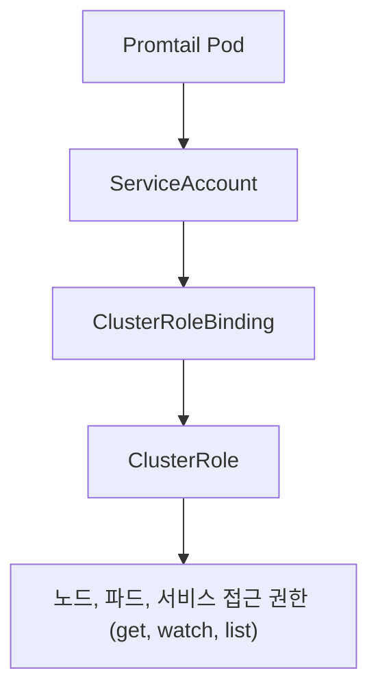
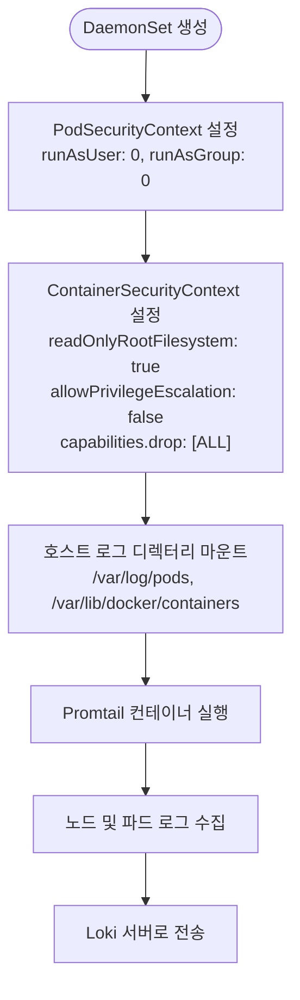

# 보안 및 권한 정책

<cite>
**이 문서에서 참조한 파일**  
- [serviceaccount.yaml](file://helm/development-tools/promtail/templates/serviceaccount.yaml)
- [clusterrole.yaml](file://helm/development-tools/promtail/templates/clusterrole.yaml)
- [clusterrolebinding.yaml](file://helm/development-tools/promtail/templates/clusterrolebinding.yaml)
- [daemonset.yaml](file://helm/development-tools/promtail/templates/daemonset.yaml)
- [configmap.yaml](file://helm/development-tools/promtail/templates/configmap.yaml)
- [networkpolicy.yaml](file://helm/development-tools/promtail/templates/networkpolicy.yaml)
- [values.yaml](file://helm/development-tools/promtail/values.yaml)
</cite>

## 목차
1. [소개](#소개)
2. [RBAC 구성 및 권한 부여](#rbac-구성-및-권한-부여)
3. [서비스 어카운트 및 클러스터 역할](#서비스-어카운트-및-클러스터-역할)
4. [데몬셋 보안 컨텍스트](#데몬셋-보안-컨텍스트)
5. [설정 관리 및 민감 정보 보호](#설정-관리-및-민감-정보-보호)
6. [네트워크 정책 통합](#네트워크-정책-통합)
7. [모범 사례 및 보안 권장 사항](#모범-사례-및-보안-권장-사항)

## 소개
본 문서는 Kubernetes 환경에서 Promtail 로그 수집 에이전트의 안전한 운영을 위한 보안 및 권한 정책을 설명합니다. Promtail은 클러스터 내 모든 노드에서 실행되며, 노드 및 파드 로그를 수집하여 Loki 서버로 전송하는 역할을 수행합니다. 이 과정에서 적절한 RBAC(Role-Based Access Control) 설정, 보안 컨텍스트 구성, 민감 정보 관리 및 네트워크 정책 통합이 필수적입니다. 본 문서는 Helm 차트 기반의 Promtail 배포에서 사용되는 주요 보안 구성 요소를 분석하고, 안전한 운영을 위한 가이드를 제공합니다.

## RBAC 구성 및 권한 부여

Promtail은 노드와 파드의 로그를 수집하기 위해 Kubernetes API에 접근할 수 있는 권한이 필요합니다. 이를 위해 클러스터 레벨의 `ClusterRole`과 `ClusterRoleBinding`이 사용됩니다. `ClusterRole`은 노드, 파드, 서비스, 엔드포인트 등의 리소스에 대한 `get`, `watch`, `list` 권한을 정의하며, `ClusterRoleBinding`은 이 역할을 특정 서비스 어카운트에 바인딩하여 권한을 부여합니다. 이러한 구성은 Promtail이 필요한 최소한의 권한만을 가지도록 하여 원칙적으로 최소 권한 원칙(principle of least privilege)을 준수합니다.



**다이어그램 출처**  
- [clusterrole.yaml](file://helm/development-tools/promtail/templates/clusterrole.yaml#L1-L22)
- [clusterrolebinding.yaml](file://helm/development-tools/promtail/templates/clusterrolebinding.yaml#L1-L17)
- [serviceaccount.yaml](file://helm/development-tools/promtail/templates/serviceaccount.yaml#L1-L19)

**섹션 출처**  
- [clusterrole.yaml](file://helm/development-tools/promtail/templates/clusterrole.yaml#L1-L22)
- [clusterrolebinding.yaml](file://helm/development-tools/promtail/templates/clusterrolebinding.yaml#L1-L17)

## 서비스 어카운트 및 클러스터 역할

Promtail은 전용 서비스 어카운트를 통해 실행되며, 이는 `serviceaccount.yaml` 템플릿을 통해 생성됩니다. 서비스 어카운트는 `automountServiceAccountToken: true`로 설정되어 있으며, 이는 Pod가 자동으로 API 서버 인증 토큰을 마운트할 수 있음을 의미합니다. `values.yaml` 파일에서 `serviceAccount.create: true`로 설정되어 있어, Helm 설치 시 자동으로 서비스 어카운트가 생성됩니다. 이 서비스 어카운트는 `ClusterRoleBinding`을 통해 `ClusterRole`에 연결되며, 노드 및 파드 로그 접근을 위한 권한을 부여받습니다.

```mermaid
classDiagram
class ServiceAccount {
+name : promtail-serviceaccount
+automountServiceAccountToken : true
}
class ClusterRoleBinding {
+subjects : [ServiceAccount]
+roleRef : ClusterRole
}
class ClusterRole {
+rules : [
{resources : [nodes, pods, services], verbs : [get, watch, list]}
]
}
ServiceAccount --> ClusterRoleBinding : "바인딩"
ClusterRoleBinding --> ClusterRole : "참조"
```

**다이어그램 출처**  
- [serviceaccount.yaml](file://helm/development-tools/promtail/templates/serviceaccount.yaml#L1-L19)
- [clusterrolebinding.yaml](file://helm/development-tools/promtail/templates/clusterrolebinding.yaml#L1-L17)
- [clusterrole.yaml](file://helm/development-tools/promtail/templates/clusterrole.yaml#L1-L22)

**섹션 출처**  
- [serviceaccount.yaml](file://helm/development-tools/promtail/templates/serviceaccount.yaml#L1-L19)
- [values.yaml](file://helm/development-tools/promtail/values.yaml#L186-L198)

## 데몬셋 보안 컨텍스트

Promtail은 `DaemonSet`으로 배포되며, 각 노드에 하나의 Pod가 실행됩니다. `daemonset.yaml` 템플릿에서는 Pod 및 컨테이너 수준의 보안 컨텍스트가 정의되어 있습니다. `podSecurityContext`는 `runAsUser: 0`, `runAsGroup: 0`으로 설정되어 루트 사용자로 실행되며, 이는 호스트 파일 시스템(`/var/log/pods`, `/var/lib/docker/containers`)에 접근하기 위해 필요합니다. 반면, `containerSecurityContext`는 `readOnlyRootFilesystem: true`, `allowPrivilegeEscalation: false`, `capabilities.drop: [ALL]`로 설정되어 있어, 컨테이너 내에서의 권한 상승과 불필요한 시스템 호출을 방지합니다. `privileged: false`로 설정되어 있어 특권 모드는 사용되지 않습니다.



**다이어그램 출처**  
- [daemonset.yaml](file://helm/development-tools/promtail/templates/daemonset.yaml#L1-L25)
- [values.yaml](file://helm/development-tools/promtail/values.yaml#L163-L175)

**섹션 출처**  
- [daemonset.yaml](file://helm/development-tools/promtail/templates/daemonset.yaml#L1-L25)
- [values.yaml](file://helm/development-tools/promtail/values.yaml#L163-L175)

## 설정 관리 및 민감 정보 보호

Promtail의 주요 설정은 `configmap.yaml` 템플릿을 통해 `ConfigMap`으로 관리됩니다. `values.yaml` 파일에서 `configmap.enabled: false`로 설정되어 있으나, `config.enabled: true`로 설정되어 있어 설정은 내부적으로 관리됩니다. 설정 파일(`promtail.yaml`)은 `ConfigMap`이 아닌 기본적으로 `Secret`으로 관리되지 않으며, 민감한 정보가 포함되지 않도록 설계되어 있습니다. 로그 수집 대상 경로, Loki 전송 엔드포인트 등은 일반 텍스트로 저장되며, 인증 정보는 별도로 관리되어야 합니다. 이는 설정 파일을 통해 민감 정보가 노출되지 않도록 하는 모범 사례입니다.

**섹션 출처**  
- [configmap.yaml](file://helm/development-tools/promtail/templates/configmap.yaml#L1-L13)
- [values.yaml](file://helm/development-tools/promtail/values.yaml#L78-L81)

## 네트워크 정책 통합

Promtail의 네트워크 트래픽은 `networkpolicy.yaml` 템플릿을 통해 정책적으로 제어됩니다. `networkPolicy.enabled: false`로 기본 설정되어 있으나, 활성화 시 다음과 같은 네트워크 정책이 적용됩니다. 첫째, `egress-dns` 정책을 통해 DNS 조회를 위한 UDP 53번 포트만 허용됩니다. 둘째, `egress-k8s-api` 정책을 통해 Kubernetes API 서버(기본 8443번 포트)로의 통신이 제한됩니다. 셋째, `ingress-metrics` 정책을 통해 메트릭스 수집을 위한 특정 IP 또는 네임스페이스에서의 접근만 허용됩니다. 이러한 정책은 Promtail의 네트워크 접근을 최소화하여 보안을 강화합니다.

```mermaid
graph TB
subgraph "Promtail 네트워크 정책"
A[egress-dns] --> |UDP 53| B[DNS 서버]
C[egress-k8s-api] --> |TCP 8443| D[Kubernetes API]
E[ingress-metrics] <--|HTTP| F[Prometheus]
end
```

**다이어그램 출처**  
- [networkpolicy.yaml](file://helm/development-tools/promtail/templates/networkpolicy.yaml#L1-L124)

**섹션 출처**  
- [networkpolicy.yaml](file://helm/development-tools/promtail/templates/networkpolicy.yaml#L1-L124)
- [values.yaml](file://helm/development-tools/promtail/values.yaml#L572-L590)

## 모범 사례 및 보안 권장 사항

Promtail의 안전한 운영을 위해서는 다음과 같은 모범 사례를 따르는 것이 중요합니다. 첫째, RBAC 설정에서 `ClusterRole`은 `nodes`, `pods` 등 로그 수집에 필요한 최소한의 리소스에 대한 `get`, `watch`, `list` 권한만 부여해야 합니다. 둘째, `privileged: false`로 설정하여 특권 모드를 비활성화하고, `readOnlyRootFilesystem: true` 및 `capabilities.drop: [ALL]`을 통해 컨테이너의 공격 면적을 최소화해야 합니다. 셋째, 설정 파일에는 민감한 정보를 포함하지 않아야 하며, 인증 정보는 별도의 `Secret` 리소스로 관리되어야 합니다. 넷째, `NetworkPolicy`를 활성화하여 Promtail의 입출력 트래픽을 명시적으로 제어함으로써 네트워크 보안을 강화해야 합니다. 마지막으로, `imagePullSecrets`를 사용하여 사설 레지스트리에서 이미지를 안전하게 가져오도록 설정해야 합니다.

**섹션 출처**  
- [values.yaml](file://helm/development-tools/promtail/values.yaml#L176-L181)
- [values.yaml](file://helm/development-tools/promtail/values.yaml#L163-L175)
- [values.yaml](file://helm/development-tools/promtail/values.yaml#L572-L590)
- [values.yaml](file://helm/development-tools/promtail/values.yaml#L107-L108)