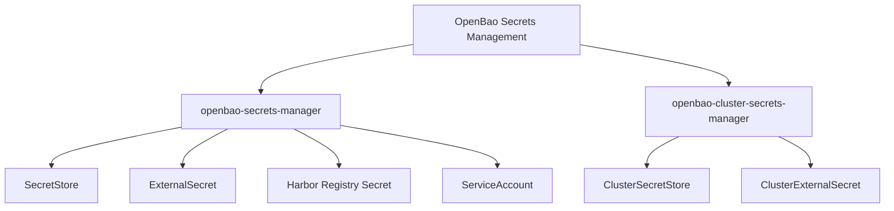
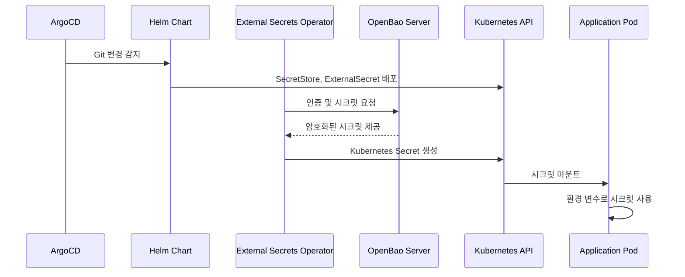
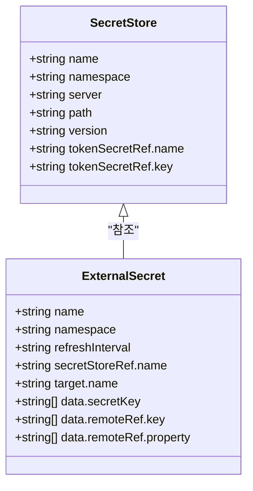
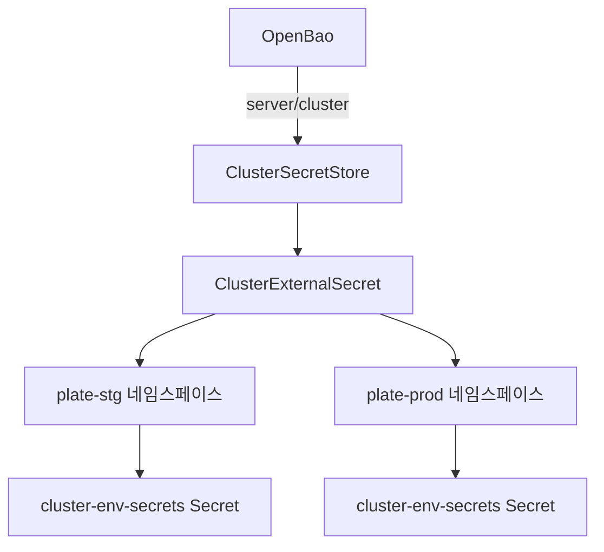
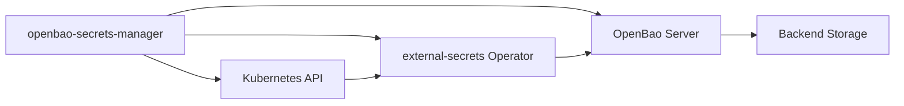

# 시크릿 관리 (OpenBao)

<cite>
**이 문서에서 참조된 파일**  
- [openbao-secrets-manager/Chart.yaml](file://helm/shared-configs/openbao-secrets-manager/Chart.yaml)
- [openbao-secrets-manager/values.yaml](file://helm/shared-configs/openbao-secrets-manager/values.yaml)
- [openbao-secrets-manager/values-staging.yaml](file://helm/shared-configs/openbao-secrets-manager/values-staging.yaml)
- [openbao-secrets-manager/values-production.yaml](file://helm/shared-configs/openbao-secrets-manager/values-production.yaml)
- [openbao-secrets-manager/templates/secret-store.yaml](file://helm/shared-configs/openbao-secrets-manager/templates/secret-store.yaml)
- [openbao-secrets-manager/templates/external-secret.yaml](file://helm/shared-configs/openbao-secrets-manager/templates/external-secret.yaml)
- [openbao-secrets-manager/templates/harbor-registry-secret.yaml](file://helm/shared-configs/openbao-secrets-manager/templates/harbor-registry-secret.yaml)
- [openbao-secrets-manager/templates/service-account.yaml](file://helm/shared-configs/openbao-secrets-manager/templates/service-account.yaml)
- [openbao-secrets-manager/templates/openbao-token-secret.yaml](file://helm/shared-configs/openbao-secrets-manager/templates/openbao-token-secret.yaml)
- [openbao-cluster-secrets-manager/values.yaml](file://helm/shared-configs/openbao-cluster-secrets-manager/values.yaml)
- [openbao-cluster-secrets-manager/templates/openbao-token-secret.yaml](file://helm/shared-configs/openbao-cluster-secrets-manager/templates/openbao-token-secret.yaml)
- [scripts/openbao/create-token.sh](file://scripts/openbao/create-token.sh)
- [scripts/openbao/create-secrets.sh](file://scripts/openbao/create-secrets.sh)
- [scripts/openbao/put-kv.sh](file://scripts/openbao/put-kv.sh)
</cite>

## 목차
1. [소개](#소개)
2. [프로젝트 구조](#프로젝트-구조)
3. [핵심 구성 요소](#핵심-구성-요소)
4. [아키텍처 개요](#아키텍처-개요)
5. [상세 구성 요소 분석](#상세-구성-요소-분석)
6. [의존성 분석](#의존성-분석)
7. [성능 고려사항](#성능-고려사항)
8. [문제 해결 가이드](#문제-해결-가이드)
9. [결론](#결론)

## 소개

OpenBao는 Kubernetes 환경에서 중앙 집중식으로 시크릿을 관리하는 솔루션입니다. 본 문서는 OpenBao를 활용한 시크릿 관리 시스템의 구현을 상세히 설명하며, Helm 차트 기반의 구성 요소들(StatefulSet, Injector, CSI Driver 등)의 역할과 동작 원리를 분석합니다. 또한 시크릿의 동적 생성, 암호화 저장, 애플리케이션 주입 메커니즘을 설명하고, shared-configs/openbao-secrets-manager를 통한 외부 시크릿 통합 방식과 ArgoCD와의 통합도 포함합니다. 접근 제어 정책, 감사 로깅, 재해 복구 전략에 대해서도 다룹니다.

## 프로젝트 구조

OpenBao 기반 시크릿 관리 시스템은 `helm/shared-configs/` 디렉터리 내에 위치하며, `openbao-secrets-manager`와 `openbao-cluster-secrets-manager` 두 개의 Helm 차트로 구성됩니다. 이 구조는 네임스페이스별 시크릿 관리와 클러스터 전역 시크릿 관리를 분리하여 보안과 운영 효율성을 극대화합니다.

**다이어그램 출처**  
- [openbao-secrets-manager/Chart.yaml](file://helm/shared-configs/openbao-secrets-manager/Chart.yaml)
- [openbao-cluster-secrets-manager/values.yaml](file://helm/shared-configs/openbao-cluster-secrets-manager/values.yaml)

**섹션 출처**  
- [openbao-secrets-manager/Chart.yaml](file://helm/shared-configs/openbao-secrets-manager/Chart.yaml)
- [openbao-cluster-secrets-manager/Chart.yaml](file://helm/shared-configs/openbao-cluster-secrets-manager/Chart.yaml)

## 핵심 구성 요소

OpenBao 기반 시크릿 관리는 External Secrets Operator와 연동하여 OpenBao에 저장된 시크릿을 Kubernetes 클러스터 내로 동기화합니다. 주요 구성 요소로는 SecretStore, ExternalSecret, ServiceAccount, 그리고 OpenBao 토큰 관리 메커니즘이 있습니다. 이들 요소는 Helm 차트를 통해 선언적으로 관리되며, 각 환경(staging, production)에 맞춰 오버라이드 가능한 설정 구조를 제공합니다.

**섹션 출처**  
- [openbao-secrets-manager/values.yaml](file://helm/shared-configs/openbao-secrets-manager/values.yaml)
- [openbao-secrets-manager/templates/secret-store.yaml](file://helm/shared-configs/openbao-secrets-manager/templates/secret-store.yaml)
- [openbao-secrets-manager/templates/external-secret.yaml](file://helm/shared-configs/openbao-secrets-manager/templates/external-secret.yaml)

## 아키텍처 개요

OpenBao 시크릿 관리 아키텍처는 OpenBao 서버, External Secrets Operator, 그리고 클러스터 내 애플리케이션 간의 상호작용을 중심으로 구성됩니다. OpenBao는 시크릿을 안전하게 저장하고 암호화하며, External Secrets Operator는 OpenBao에 정의된 정책에 따라 시크릿을 추출하여 Kubernetes Secret으로 동기화합니다. 이 과정은 ArgoCD를 통해 GitOps 방식으로 관리되며, 모든 구성은 형상 관리 시스템에 저장됩니다.

**다이어그램 출처**  
- [openbao-secrets-manager/templates/secret-store.yaml](file://helm/shared-configs/openbao-secrets-manager/templates/secret-store.yaml)
- [openbao-secrets-manager/templates/external-secret.yaml](file://helm/shared-configs/openbao-secrets-manager/templates/external-secret.yaml)
- [scripts/openbao/create-token.sh](file://scripts/openbao/create-token.sh)

## 상세 구성 요소 분석

### SecretStore 및 ExternalSecret 분석

SecretStore는 OpenBao와의 연결 정보를 정의하며, ExternalSecret은 특정 시크릿의 동기화 규칙을 명시합니다. SecretStore는 OpenBao 서버 주소, 경로, 인증 방식 등을 포함하며, ExternalSecret은 원격 시크릿의 키와 속성, 그리고 타겟 쿠버네티스 시크릿 이름을 매핑합니다. 이 구조는 시크릿의 중앙 관리와 애플리케이션 간 재사용을 가능하게 합니다.

**다이어그램 출처**  
- [openbao-secrets-manager/templates/secret-store.yaml](file://helm/shared-configs/openbao-secrets-manager/templates/secret-store.yaml)
- [openbao-secrets-manager/templates/external-secret.yaml](file://helm/shared-configs/openbao-secrets-manager/templates/external-secret.yaml)

**섹션 출처**  
- [openbao-secrets-manager/values.yaml](file://helm/shared-configs/openbao-secrets-manager/values.yaml)
- [openbao-secrets-manager/values-staging.yaml](file://helm/shared-configs/openbao-secrets-manager/values-staging.yaml)
- [openbao-secrets-manager/values-production.yaml](file://helm/shared-configs/openbao-secrets-manager/values-production.yaml)

### Harbor 레지스트리 인증 통합

Harbor 레지스트리에 대한 인증 정보는 별도의 ExternalSecret 리소스를 통해 관리됩니다. `harbor-registry-secret.yaml` 템플릿은 Harbor 로그인에 필요한 사용자 이름과 비밀번호를 OpenBao에서 가져와 `harbor-docker-secret`이라는 이름의 쿠버네티스 시크릿으로 생성합니다. 이 시크릿은 애플리케이션의 imagePullSecrets로 사용되어 프라이빗 이미지 레지스트리 접근을 가능하게 합니다.

**섹션 출처**  
- [openbao-secrets-manager/templates/harbor-registry-secret.yaml](file://helm/shared-configs/openbao-secrets-manager/templates/harbor-registry-secret.yaml)
- [openbao-secrets-manager/values.yaml](file://helm/shared-configs/openbao-secrets-manager/values.yaml)

### 클러스터 전역 시크릿 관리

`openbao-cluster-secrets-manager` 차트는 클러스터 전역에서 공유되는 시크릿을 관리합니다. ClusterSecretStore와 ClusterExternalSecret을 사용하여 모든 네임스페이스에서 접근 가능한 시크릿을 생성합니다. 예를 들어, GitHub OAuth 클라이언트 ID 및 비밀과 같은 공통 인증 정보는 이 메커니즘을 통해 여러 애플리케이션에서 안전하게 공유할 수 있습니다.

**다이어그램 출처**  
- [openbao-cluster-secrets-manager/values.yaml](file://helm/shared-configs/openbao-cluster-secrets-manager/values.yaml)
- [openbao-cluster-secrets-manager/templates/openbao-token-secret.yaml](file://helm/shared-configs/openbao-cluster-secrets-manager/templates/openbao-token-secret.yaml)

**섹션 출처**  
- [openbao-cluster-secrets-manager/values.yaml](file://helm/shared-configs/openbao-cluster-secrets-manager/values.yaml)
- [openbao-cluster-secrets-manager/Chart.yaml](file://helm/shared-configs/openbao-cluster-secrets-manager/Chart.yaml)

## 의존성 분석

OpenBao 시크릿 관리 시스템은 여러 외부 컴포넌트에 의존합니다. 가장 핵심적인 의존성은 External Secrets Operator이며, 이는 Helm 차트의 `dependencies` 섹션을 통해 관리됩니다. 또한 OpenBao 서버 자체가 외부 서비스로 존재하며, 시크릿 토큰은 별도의 스크립트를 통해 생성되어 쿠버네티스 클러스터에 주입됩니다. 이러한 의존성은 시스템의 안정성과 보안을 보장하기 위해 명시적으로 관리되어야 합니다.

**다이어그램 출처**  
- [openbao-secrets-manager/Chart.yaml](file://helm/shared-configs/openbao-secrets-manager/Chart.yaml)
- [openbao-secrets-manager/values.yaml](file://helm/shared-configs/openbao-secrets-manager/values.yaml)

**섹션 출처**  
- [openbao-secrets-manager/Chart.yaml](file://helm/shared-configs/openbao-secrets-manager/Chart.yaml)
- [scripts/openbao/create-token.sh](file://scripts/openbao/create-token.sh)
- [scripts/openbao/create-secrets.sh](file://scripts/openbao/create-secrets.sh)

## 성능 고려사항

시크릿 동기화 주기는 환경에 따라 다르게 설정됩니다. 스테이징 환경에서는 `30m`, 프로덕션 환경에서는 `1h`로 설정되어 있으며, 이는 시스템 부하와 시크릿 갱신 요구사항 사이의 균형을 고려한 것입니다. 리소스 제한도 환경별로 다르게 구성되어 있으며, 프로덕션 환경은 더 높은 CPU 및 메모리 리소스를 할당받아 안정성을 보장합니다. 또한, 프로덕션 환경에서는 읽기 전용 루트 파일 시스템과 노드 어피니티 설정을 통해 추가적인 보안과 성능 최적화를 적용합니다.

**섹션 출처**  
- [openbao-secrets-manager/values-staging.yaml](file://helm/shared-configs/openbao-secrets-manager/values-staging.yaml)
- [openbao-secrets-manager/values-production.yaml](file://helm/shared-configs/openbao-secrets-manager/values-production.yaml)

## 문제 해결 가이드

OpenBao 기반 시크릿 관리에서 발생할 수 있는 주요 문제는 인증 실패, 시크릿 동기화 지연, 네임스페이스 매칭 오류 등입니다. 문제 해결을 위해 다음 절차를 따르는 것이 좋습니다:

1. **External Secrets Operator Pod 로그 확인**: 인증 또는 동기화 오류가 로그에 기록됩니다.
2. **SecretStore 및 ExternalSecret 리소스 상태 확인**: `kubectl get secretstore`, `kubectl get externalsecret` 명령으로 상태를 확인합니다.
3. **OpenBao 토큰 유효성 검사**: `vault token lookup` 명령으로 토큰이 유효한지 확인합니다.
4. **네임스페이스 일치 여부 확인**: SecretStore와 ExternalSecret이 동일한 네임스페이스에 있는지 확인합니다.

스크립트를 통해 시크릿을 생성할 때는 `scripts/openbao/create-token.sh`과 `scripts/openbao/create-secrets.sh`를 사용하며, 이들 스크립트는 인증 상태를 사전에 검사하여 오류를 방지합니다.

**섹션 출처**  
- [scripts/openbao/create-token.sh](file://scripts/openbao/create-token.sh)
- [scripts/openbao/create-secrets.sh](file://scripts/openbao/create-secrets.sh)
- [scripts/openbao/put-kv.sh](file://scripts/openbao/put-kv.sh)

## 결론

OpenBao를 활용한 시크릿 관리 시스템은 중앙 집중식으로 시크릿을 저장하고, External Secrets Operator를 통해 Kubernetes 클러스터 내로 안전하게 동기화하는 강력한 아키텍처를 제공합니다. Helm 차트를 통한 선언적 구성과 ArgoCD 기반의 GitOps 전략은 시스템의 일관성과 추적 가능성을 보장합니다. 네임스페이스별 관리와 클러스터 전역 관리를 분리함으로써 보안과 유연성을 모두 확보하였으며, 환경별로 최적화된 리소스 및 보안 설정을 적용함으로써 프로덕션 환경에서도 안정적인 운영이 가능합니다. 향후 감사 로깅 강화 및 재해 복구 전략 수립을 통해 더욱 견고한 시크릿 관리 체계를 구축할 수 있을 것입니다.