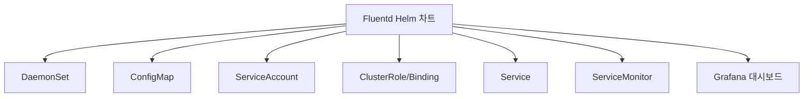
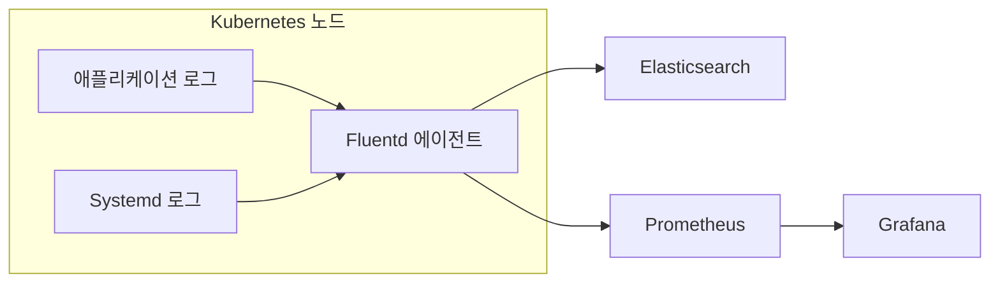
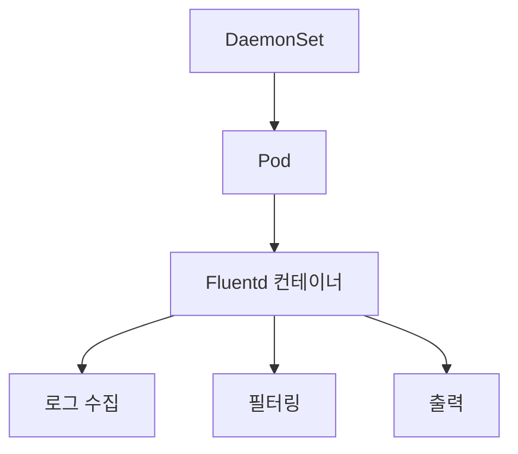
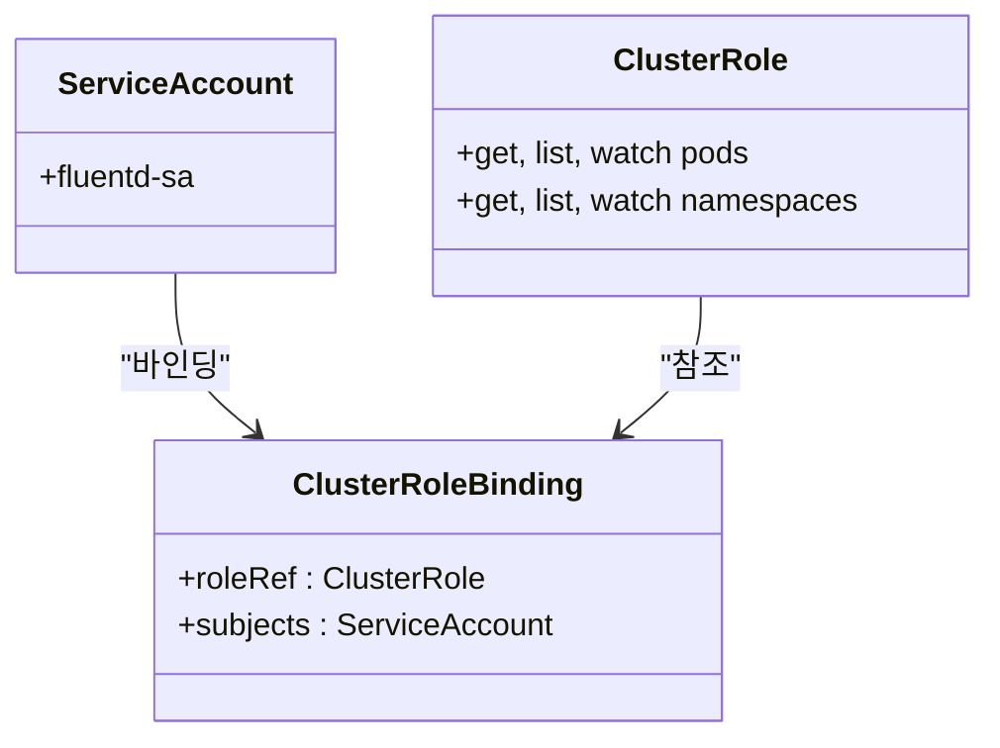
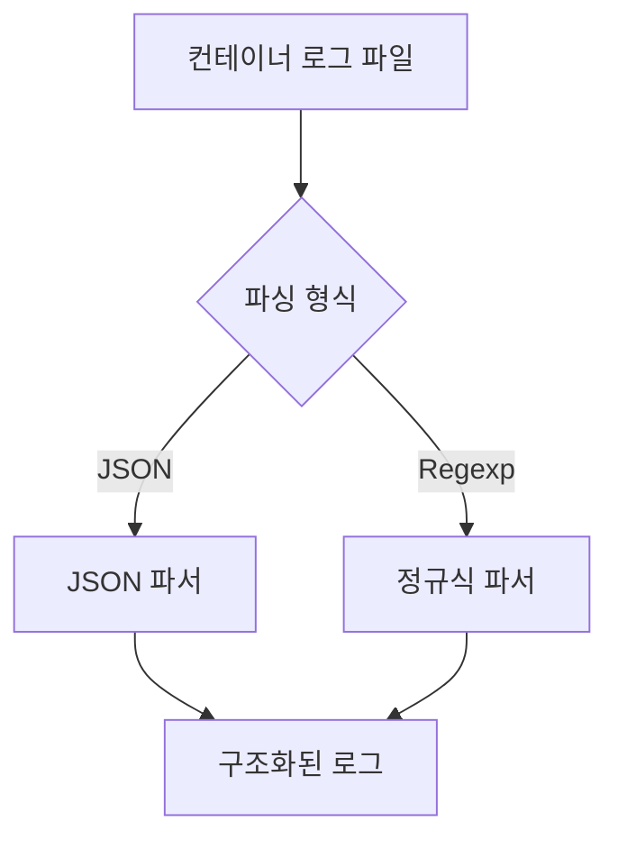
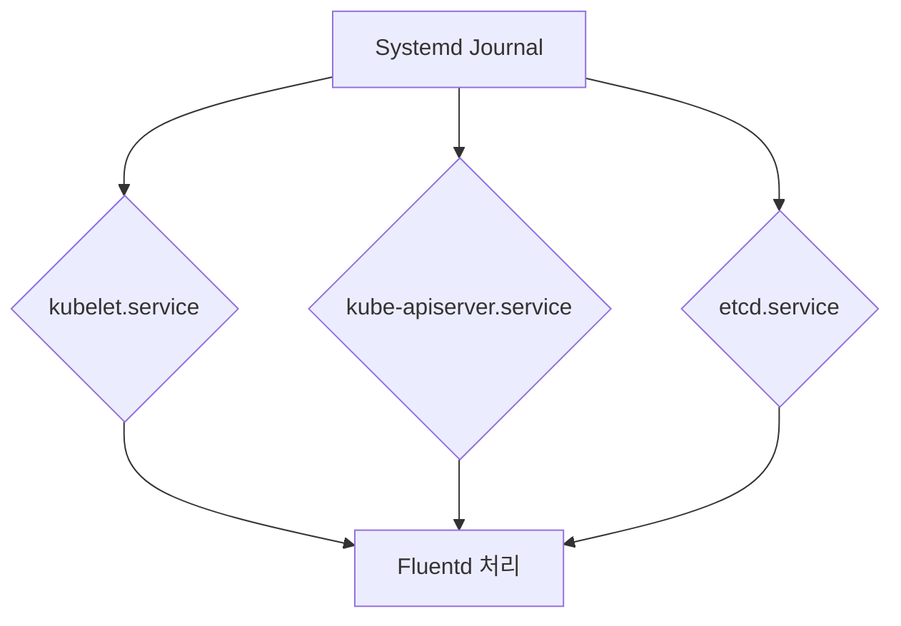
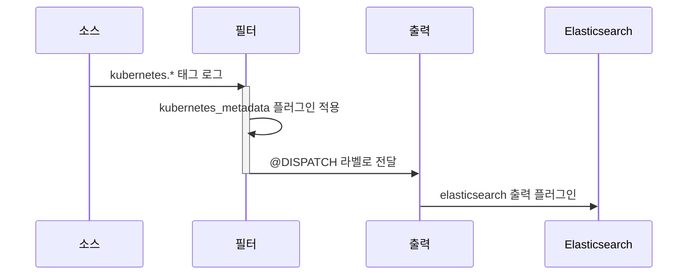

# 중앙 집중식 로깅 (Fluentd)

<cite>
**이 문서에서 참조한 파일**  
- [fluentd/Chart.yaml](file://helm/development-tools/fluentd/Chart.yaml)
- [fluentd/values.yaml](file://helm/development-tools/fluentd/values.yaml)
- [fluentd/templates/daemonset.yaml](file://helm/development-tools/fluentd/templates/daemonset.yaml)
- [fluentd/templates/fluentd-configurations-cm.yaml](file://helm/development-tools/fluentd/templates/fluentd-configurations-cm.yaml)
- [fluentd/templates/files.conf/systemd.yaml](file://helm/development-tools/fluentd/templates/files.conf/systemd.yaml)
- [fluentd/templates/files.conf/prometheus.yaml](file://helm/development-tools/fluentd/templates/files.conf/prometheus.yaml)
- [fluentd/templates/serviceaccount.yaml](file://helm/development-tools/fluentd/templates/serviceaccount.yaml)
- [fluentd/templates/clusterrole.yaml](file://helm/development-tools/fluentd/templates/clusterrole.yaml)
- [fluentd/templates/clusterrolebinding.yaml](file://helm/development-tools/fluentd/templates/clusterrolebinding.yaml)
- [fluentd/templates/service.yaml](file://helm/development-tools/fluentd/templates/service.yaml)
- [fluentd/templates/servicemonitor.yaml](file://helm/development-tools/fluentd/templates/servicemonitor.yaml)
- [fluentd/dashboards/fluentd.json](file://helm/development-tools/fluentd/dashboards/fluentd.json)
</cite>

## 목차
1. [소개](#소개)
2. [프로젝트 구조](#프로젝트-구조)
3. [핵심 구성 요소](#핵심-구성-요소)
4. [아키텍처 개요](#아키텍처-개요)
5. [상세 구성 요소 분석](#상세-구성-요소-분석)
6. [로그 수집 전략](#로그-수집-전략)
7. [필터링 및 변환 프로세스](#필터링-및-변환-프로세스)
8. [Grafana 통합 및 대시보드 구성](#grafana-통합-및-대시보드-구성)
9. [Promtail과의 비교 및 선택 사유](#promtail과의-비교-및-선택-사유)
10. [성능 최적화 전략](#성능-최적화-전략)

## 소개
이 문서는 Kubernetes 환경에서 Fluentd를 활용한 중앙 집중식 로깅 시스템의 구현을 상세히 설명합니다. Fluentd Helm 차트를 기반으로 로그 수집, 필터링, 변환, 저장 및 시각화까지의 전체 파이프라인을 분석합니다. 특히, 다양한 로그 소스(Systemd, 애플리케이션 로그)로부터의 수집 전략과 Grafana를 통한 시각화 방법을 다루며, Promtail과의 비교를 통해 Fluentd 선택의 근거를 제시합니다.

## 프로젝트 구조

Fluentd는 `helm/development-tools/fluentd` 디렉터리에 Helm 차트 형태로 구성되어 있습니다. 주요 구성 요소는 다음과 같습니다:

- `templates/`: DaemonSet, ConfigMap, RBAC, ServiceAccount 등 Kubernetes 리소스 정의
- `dashboards/`: Grafana 대시보드 정의 파일
- `values.yaml`: Helm 차트의 구성 값
- `Chart.yaml`: 차트 메타데이터



**다이어그램 출처**
- [fluentd/Chart.yaml](file://helm/development-tools/fluentd/Chart.yaml)
- [fluentd/values.yaml](file://helm/development-tools/fluentd/values.yaml)

**섹션 출처**
- [fluentd/Chart.yaml](file://helm/development-tools/fluentd/Chart.yaml)
- [fluentd/values.yaml](file://helm/development-tools/fluentd/values.yaml)

## 핵심 구성 요소

Fluentd Helm 차트는 여러 핵심 Kubernetes 리소스로 구성됩니다. 이들은 로그 수집 에이전트로서 Fluentd의 안정적인 동작을 보장합니다.

**섹션 출처**
- [fluentd/templates/daemonset.yaml](file://helm/development-tools/fluentd/templates/daemonset.yaml)
- [fluentd/templates/serviceaccount.yaml](file://helm/development-tools/fluentd/templates/serviceaccount.yaml)
- [fluentd/templates/clusterrole.yaml](file://helm/development-tools/fluentd/templates/clusterrole.yaml)
- [fluentd/templates/clusterrolebinding.yaml](file://helm/development-tools/fluentd/templates/clusterrolebinding.yaml)

## 아키텍처 개요

Fluentd는 각 노드에 에이전트를 배포하여 로그를 수집하고, 중앙의 Elasticsearch로 전달하는 아키텍처를 따릅니다. Prometheus를 통해 메트릭스를 수집하고, Grafana를 통해 시각화합니다.



**다이어그램 출처**
- [fluentd/values.yaml](file://helm/development-tools/fluentd/values.yaml)
- [fluentd/templates/daemonset.yaml](file://helm/development-tools/fluentd/templates/daemonset.yaml)
- [fluentd/templates/servicemonitor.yaml](file://helm/development-tools/fluentd/templates/servicemonitor.yaml)

## 상세 구성 요소 분석

### Fluentd DaemonSet 분석

Fluentd는 DaemonSet으로 배포되어 각 노드에 하나의 Pod가 실행됩니다. 이는 모든 노드에서 로그를 수집할 수 있도록 보장합니다.



**다이어그램 출처**
- [fluentd/templates/daemonset.yaml](file://helm/development-tools/fluentd/templates/daemonset.yaml)
- [fluentd/values.yaml](file://helm/development-tools/fluentd/values.yaml)

### RBAC 구성 분석

Fluentd는 클러스터 전반의 리소스(Pod, Namespace)에 접근해야 하므로, ClusterRole과 ClusterRoleBinding을 통해 적절한 권한을 부여받습니다.



**다이어그램 출처**
- [fluentd/templates/serviceaccount.yaml](file://helm/development-tools/fluentd/templates/serviceaccount.yaml)
- [fluentd/templates/clusterrole.yaml](file://helm/development-tools/fluentd/templates/clusterrole.yaml)
- [fluentd/templates/clusterrolebinding.yaml](file://helm/development-tools/fluentd/templates/clusterrolebinding.yaml)

**섹션 출처**
- [fluentd/templates/serviceaccount.yaml](file://helm/development-tools/fluentd/templates/serviceaccount.yaml)
- [fluentd/templates/clusterrole.yaml](file://helm/development-tools/fluentd/templates/clusterrole.yaml)
- [fluentd/templates/clusterrolebinding.yaml](file://helm/development-tools/fluentd/templates/clusterrolebinding.yaml)

## 로그 수집 전략

Fluentd는 두 가지 주요 소스에서 로그를 수집합니다: 쿠버네티스 컨테이너 로그와 Systemd 로그.

### 쿠버네티스 컨테이너 로그 수집

`/var/log/containers/*.log` 경로에서 JSON 형식의 컨테이너 로그를 수집합니다. `tail` 소스 플러그인을 사용하며, 파싱은 `json`과 `regexp` 두 가지 형식을 지원합니다.



**다이어그램 출처**
- [fluentd/values.yaml](file://helm/development-tools/fluentd/values.yaml#L292-L319)

### Systemd 로그 수집

`systemd` 소스 플러그인을 사용하여 kubelet, etcd, kube-apiserver 등의 시스템 서비스 로그를 수집합니다. 각 서비스별로 별도의 매치 규칙을 정의합니다.



**다이어그램 출처**
- [fluentd/templates/files.conf/systemd.yaml](file://helm/development-tools/fluentd/templates/files.conf/systemd.yaml)

**섹션 출처**
- [fluentd/values.yaml](file://helm/development-tools/fluentd/values.yaml#L292-L319)
- [fluentd/templates/files.conf/systemd.yaml](file://helm/development-tools/fluentd/templates/files.conf/systemd.yaml)

## 필터링 및 변환 프로세스

수집된 로그는 레이블 기반의 라우팅과 메타데이터 부여를 통해 처리됩니다.

### 레이블 기반 라우팅

Fluentd는 `<label>` 태그를 사용하여 로그 처리 흐름을 제어합니다. 수집된 로그는 `@KUBERNETES` 라벨로 시작하여, 필터링 후 `@DISPATCH` 라벨로 전달됩니다.



**다이어그램 출처**
- [fluentd/values.yaml](file://helm/development-tools/fluentd/values.yaml#L329-L375)

### 쿠버네티스 메타데이터 추가

`kubernetes_metadata` 필터 플러그인을 사용하여 Pod 이름, 네임스페이스, 레이블 등의 메타데이터를 로그에 추가합니다. 이를 통해 로그의 컨텍스트를 풍부하게 만듭니다.

**섹션 출처**
- [fluentd/values.yaml](file://helm/development-tools/fluentd/values.yaml#L341-L348)

## Grafana 통합 및 대시보드 구성

Fluentd는 Prometheus 메트릭스를 노출하고, Grafana 대시보드를 통해 시각화합니다.

### 메트릭스 노출

Fluentd는 `prometheus` 소스 플러그인을 통해 `/metrics` 엔드포인트에서 메트릭스를 제공합니다. ServiceMonitor 리소스를 통해 Prometheus가 이를 수집합니다.

```mermaid
flowchart TD
A[Fluentd] --> B[/metrics 엔드포인트]
B --> C[ServiceMonitor]
C --> D[Prometheus]
D --> E[Grafana]
```

**다이어그램 출처**
- [fluentd/templates/files.conf/prometheus.yaml](file://helm/development-tools/fluentd/templates/files.conf/prometheus.yaml)
- [fluentd/templates/servicemonitor.yaml](file://helm/development-tools/fluentd/templates/servicemonitor.yaml)
- [fluentd/templates/service.yaml](file://helm/development-tools/fluentd/templates/service.yaml)

### 대시보드 구성

`dashboards/fluentd.json` 파일은 Fluentd의 상태를 모니터링하기 위한 Grafana 대시보드를 정의합니다. 주요 메트릭스로는 입력/출력 속도, 재시도 횟수, 버퍼 사용량 등이 포함됩니다.

**섹션 출처**
- [fluentd/dashboards/fluentd.json](file://helm/development-tools/fluentd/dashboards/fluentd.json)
- [fluentd/templates/configmap-dashboards.yaml](file://helm/development-tools/fluentd/templates/configmap-dashboards.yaml)

## Promtail과의 비교 및 선택 사유

Fluentd와 Promtail은 모두 로그 수집 에이전트이지만, 다음과 같은 차이점이 있습니다.

| 항목 | Fluentd | Promtail |
|------|--------|---------|
| **언어** | Ruby | Go |
| **성능** | 중간 | 높음 |
| **플러그인 생태계** | 매우 풍부 | 제한적 |
| **구성 복잡성** | 높음 | 낮음 |
| **메모리 사용량** | 높음 | 낮음 |

본 환경에서는 Fluentd를 선택한 이유는 다음과 같습니다:
- 다양한 출력 플러그인(Elasticsearch, Kafka 등) 지원
- 복잡한 필터링 및 변환 기능
- 풍부한 메트릭스 노출
- 기존 운영 팀의 경험

**섹션 출처**
- [fluentd/Chart.yaml](file://helm/development-tools/fluentd/Chart.yaml)
- [fluentd/values.yaml](file://helm/development-tools/fluentd/values.yaml)

## 성능 최적화 전략

Fluentd의 성능을 최적화하기 위한 전략은 다음과 같습니다.

### 리소스 요청 및 제한 설정

CPU 및 메모리 리소스를 적절히 할당하여 OOM(out-of-memory) 방지 및 안정적인 동작 보장

### 버퍼 구성 최적화

디스크 기반 버퍼 사용 및 적절한 큐 크기 설정을 통해 네트워크 지연 시 로그 손실 방지

### 파싱 성능 향상

정규식 파싱보다 JSON 파싱을 우선 사용하여 CPU 부하 감소

### 비동기 출력

출력 플러그인의 비동기 처리 활성화를 통해 입력 처리 지연 최소화

**섹션 출처**
- [fluentd/values.yaml](file://helm/development-tools/fluentd/values.yaml)
- [fluentd/templates/daemonset.yaml](file://helm/development-tools/fluentd/templates/daemonset.yaml)