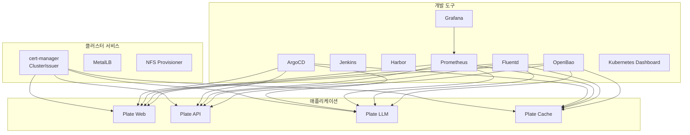
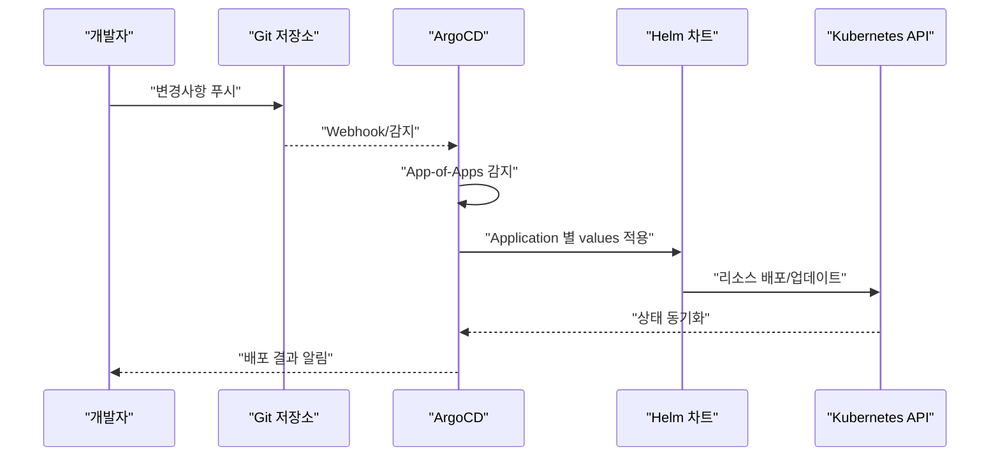
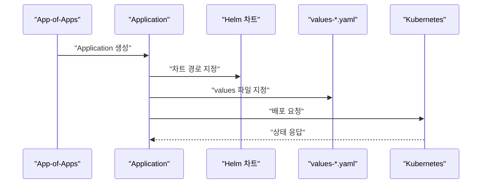
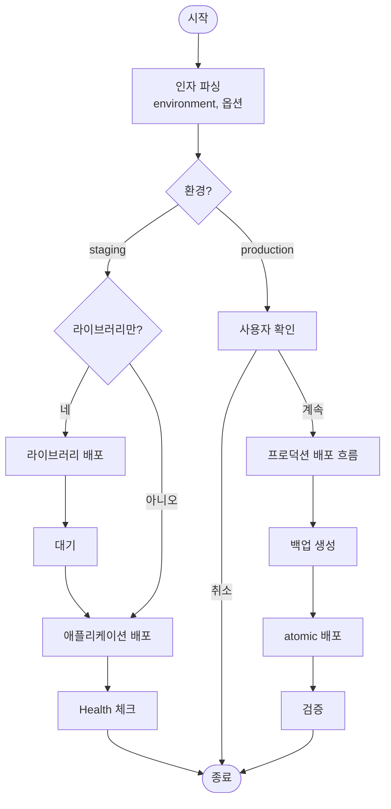
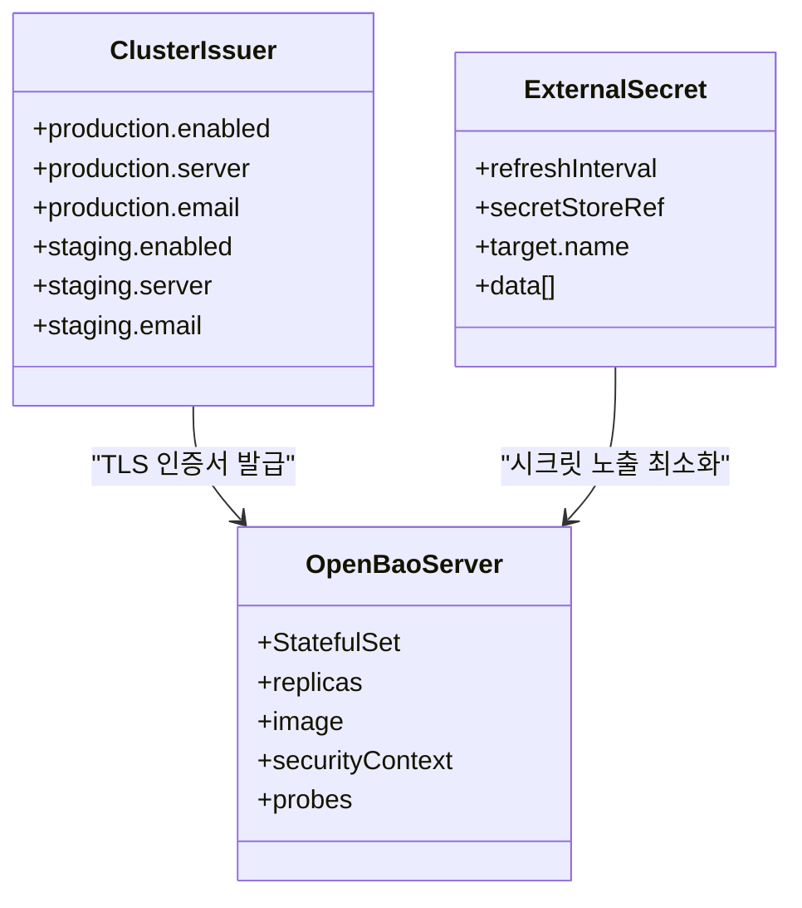
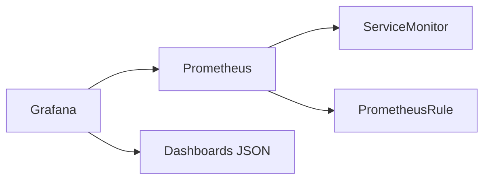
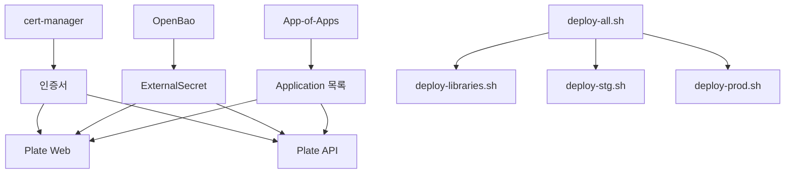

# 기능 개요

<cite>
**문서에서 언급되는 파일 목록**
- [README.md](file://README.md)
- [environments/argocd/README.md](file://environments/argocd/README.md)
- [environments/argocd/app-of-apps.yaml](file://environments/argocd/app-of-apps.yaml)
- [helm/cluster-services/cert-manager/templates/cluster-issuer-prod.yaml](file://helm/cluster-services/cert-manager/templates/cluster-issuer-prod.yaml)
- [helm/cluster-services/cert-manager/templates/cluster-issuer-staging.yaml](file://helm/cluster-services/cert-manager/templates/cluster-issuer-staging.yaml)
- [helm/development-tools/openbao/templates/server-statefulset.yaml](file://helm/development-tools/openbao/templates/server-statefulset.yaml)
- [helm/development-tools/grafana/templates/deployment.yaml](file://helm/development-tools/grafana/templates/deployment.yaml)
- [helm/development-tools/prometheus/templates/deploy.yaml](file://helm/development-tools/prometheus/templates/deploy.yaml)
- [helm/development-tools/fluentd/templates/daemonset.yaml](file://helm/development-tools/fluentd/templates/daemonset.yaml)
- [helm/applications/plate-web/templates/deployment.yaml](file://helm/applications/plate-web/templates/deployment.yaml)
- [helm/applications/plate-server/templates/deployment.yaml](file://helm/applications/plate-server/templates/deployment.yaml)
- [scripts/deploy-all.sh](file://scripts/deploy-all.sh)
- [scripts/deploy-libraries.sh](file://scripts/deploy-libraries.sh)
- [scripts/deploy-stg.sh](file://scripts/deploy-stg.sh)
- [scripts/deploy-prod.sh](file://scripts/deploy-prod.sh)
- [helm/shared-configs/openbao-secrets-manager/templates/external-secret.yaml](file://helm/shared-configs/openbao-secrets-manager/templates/external-secret.yaml)
</cite>

## 목차
1. [소개](#소개)
2. [프로젝트 구조](#프로젝트-구조)
3. [핵심 기능 개요](#핵심-기능-개요)
4. [아키텍처 개요](#아키텍처-개요)
5. [상세 구성 요소 분석](#상세-구성-요소-분석)
6. [의존성 분석](#의존성-분석)
7. [성능 고려사항](#성능-고려사항)
8. [장애 대응 가이드](#장애-대응-가이드)
9. [결론](#결론)

## 소개
이 문서는 prj-devops 저장소의 주요 기능을 계층화된 배포 구조(클러스터 서비스 → 개발 도구 → 애플리케이션), GitOps 기반 자동화된 배포 파이프라인(ArgoCD 기반), 다중 환경 관리(스테이징/프로덕션), 보안 강화(cert-manager, OpenBao), 모니터링(Prometheus, Grafana), 로깅(Fluentd)로 구성된 클라우드 네이티브 배포 시스템을 중심으로 개괄합니다. 각 기능이 전체 시스템에서 수행하는 역할과 사용자에게 제공하는 가치를 명확히 하고, 실제 코드베이스에서의 구현 예시를 통해 통합 방식을 보여줍니다.

## 프로젝트 구조
- 계층화된 배포 구조
  - 클러스터 서비스: 인증서 관리(certificate), 로드 밸런싱(MetalLB), 스토리지(NFS Provisioner)
  - 개발 도구: GitOps(ArcoCD), CI/CD(Jenkins), 레지스트리(Harbor), 모니터링(Grafana, Prometheus), 로깅(Fluentd), 시크릿 관리(OpenBao), 클러스터 UI(Kubernetes Dashboard)
  - 애플리케이션: Plate 웹/API/Llm/Cache 서비스
- GitOps 통합
  - environments/argocd/app-of-apps.yaml을 통한 App-of-Apps 패턴으로 모든 애플리케이션을 선언적으로 관리
- 다중 환경
  - environments/staging, environments/production, environments/shared에 환경별 설정을 분리하여 관리

**도표 출처**
- [environments/argocd/app-of-apps.yaml](file://environments/argocd/app-of-apps.yaml#L1-L35)
- [helm/cluster-services/cert-manager/templates/cluster-issuer-prod.yaml](file://helm/cluster-services/cert-manager/templates/cluster-issuer-prod.yaml#L1-L20)
- [helm/development-tools/prometheus/templates/deploy.yaml](file://helm/development-tools/prometheus/templates/deploy.yaml#L1-L120)
- [helm/development-tools/grafana/templates/deployment.yaml](file://helm/development-tools/grafana/templates/deployment.yaml#L1-L54)
- [helm/development-tools/fluentd/templates/daemonset.yaml](file://helm/development-tools/fluentd/templates/daemonset.yaml#L1-L41)
- [helm/development-tools/openbao/templates/server-statefulset.yaml](file://helm/development-tools/openbao/templates/server-statefulset.yaml#L1-L120)
- [helm/applications/plate-web/templates/deployment.yaml](file://helm/applications/plate-web/templates/deployment.yaml#L1-L128)
- [helm/applications/plate-server/templates/deployment.yaml](file://helm/applications/plate-server/templates/deployment.yaml#L1-L61)

**섹션 출처**
- [README.md](file://README.md#L1-L120)
- [environments/argocd/README.md](file://environments/argocd/README.md#L1-L60)

## 핵심 기능 개요
- 계층화된 배포 구조
  - 클러스터 레벨 인프라(인증서, 로드밸런싱, 스토리지) → 개발 도구(배포/CI/모니터링/로깅/시크릿) → 애플리케이션(서비스)
  - 각 계층은 독립적으로 관리되며, 의존성은 위에서 아래로 보장
- GitOps 기반 자동화된 배포 파이프라인
  - environments/argocd/app-of-apps.yaml을 통한 App-of-Apps 패턴으로 모든 애플리케이션을 선언적으로 관리
  - ArgoCD가 Git 변경을 감지하고 자동 배포, 자동 정리(prune), 자동 회복(selfHeal) 수행
- 다중 환경 관리
  - environments/staging, environments/production, environments/shared에 환경별 values를 분리하여 관리
  - 스테이징/프로덕션 환경별 도메인, 인증서, 리소스, 보안 정책이 다르게 적용
- 보안 강화
  - cert-manager를 통한 Let’s Encrypt 자동 인증서 발급
  - OpenBao를 통한 시크릿 관리 및 ExternalSecret 통한 민감 정보 노출 최소화
  - 프로덕션 환경 보안 강화 정책(비루트 실행, ReadOnly Root, 리소스 제한, TLS 강제 등)
- 모니터링
  - Prometheus를 통한 메트릭 수집
  - Grafana를 통한 대시보드 시각화
- 로깅
  - Fluentd를 통한 로그 수집 및 Prometheus 규칙/ServiceMonitor 연계

**섹션 출처**
- [README.md](file://README.md#L120-L220)
- [environments/argocd/README.md](file://environments/argocd/README.md#L60-L107)
- [helm/cluster-services/cert-manager/templates/cluster-issuer-prod.yaml](file://helm/cluster-services/cert-manager/templates/cluster-issuer-prod.yaml#L1-L20)
- [helm/development-tools/openbao/templates/server-statefulset.yaml](file://helm/development-tools/openbao/templates/server-statefulset.yaml#L1-L120)
- [helm/development-tools/prometheus/templates/deploy.yaml](file://helm/development-tools/prometheus/templates/deploy.yaml#L1-L120)
- [helm/development-tools/grafana/templates/deployment.yaml](file://helm/development-tools/grafana/templates/deployment.yaml#L1-L54)
- [helm/development-tools/fluentd/templates/daemonset.yaml](file://helm/development-tools/fluentd/templates/daemonset.yaml#L1-L41)

## 아키텍처 개요
- GitOps 파이프라인
  - Git 저장소에 변경이 발생하면 ArgoCD가 감지하고, 각 Application은 지정된 Helm 차트와 values를 기준으로 배포
  - App-of-Apps 패턴을 통해 모든 Application을 한 곳에서 관리
- 배포 자동화 스크립트
  - scripts/deploy-all.sh: 라이브러리 배포 → 애플리케이션 배포(스테이징/프로덕션) 오케스트레이션
  - scripts/deploy-libraries.sh: cert-manager, Jenkins, MetalLB 순으로 라이브러리 배포
  - scripts/deploy-stg.sh, scripts/deploy-prod.sh: 스테이징/프로덕션 배포, 검증, 롤백 지원
- 보안 및 시크릿
  - cert-manager: ClusterIssuer(production/staging)를 통한 ACME 자동 인증서 발급
  - OpenBao: StatefulSet으로 OpenBao 서버 클러스터 운영, ExternalSecret을 통한 시크릿 노출 최소화

**도표 출처**
- [environments/argocd/app-of-apps.yaml](file://environments/argocd/app-of-apps.yaml#L1-L35)
- [scripts/deploy-all.sh](file://scripts/deploy-all.sh#L118-L154)
- [scripts/deploy-libraries.sh](file://scripts/deploy-libraries.sh#L43-L102)
- [scripts/deploy-stg.sh](file://scripts/deploy-stg.sh#L77-L89)
- [scripts/deploy-prod.sh](file://scripts/deploy-prod.sh#L147-L167)

**섹션 출처**
- [README.md](file://README.md#L356-L408)
- [environments/argocd/README.md](file://environments/argocd/README.md#L1-L60)

## 상세 구성 요소 분석

### GitOps 기반 자동화된 배포 파이프라인
- App-of-Apps 패턴
  - environments/argocd/app-of-apps.yaml은 environments/argocd/apps에 있는 Application들을 모두 관리
  - syncPolicy.automated: prune, selfHeal 자동 활성화
- Application별 배포
  - 각 Application은 helm/applications/<서비스>를 소스로, values-stg.yaml 또는 values-prod.yaml을 적용
  - Destination에 지정된 네임스페이스에 배포

**도표 출처**
- [environments/argocd/app-of-apps.yaml](file://environments/argocd/app-of-apps.yaml#L1-L35)
- [README.md](file://README.md#L389-L408)

**섹션 출처**
- [environments/argocd/README.md](file://environments/argocd/README.md#L1-L60)
- [environments/argocd/app-of-apps.yaml](file://environments/argocd/app-of-apps.yaml#L1-L35)
- [README.md](file://README.md#L389-L408)

### 배포 자동화 스크립트
- deploy-all.sh
  - 라이브러리 배포 여부, 스테이징/프로덕션, dry-run 옵션을 통한 오케스트레이션
  - 프로덕션 배포 전 사용자 확인, health check 수행
- deploy-libraries.sh
  - cert-manager, Jenkins, MetalLB 순으로 배포
  - cert-manager는 Jetstack 저장소에서 CRDs 설치 후 설치
- deploy-stg.sh / deploy-prod.sh
  - 차트 검증(helm lint/template), 네임스페이스 생성, 배포(wait/timeout), 상태 확인, 접근 정보 표시
  - 프로덕션 배포에는 백업, 롤백, 검증 단계 포함

**도표 출처**
- [scripts/deploy-all.sh](file://scripts/deploy-all.sh#L65-L117)
- [scripts/deploy-all.sh](file://scripts/deploy-all.sh#L118-L154)
- [scripts/deploy-libraries.sh](file://scripts/deploy-libraries.sh#L43-L102)
- [scripts/deploy-stg.sh](file://scripts/deploy-stg.sh#L55-L89)
- [scripts/deploy-prod.sh](file://scripts/deploy-prod.sh#L118-L167)

**섹션 출처**
- [scripts/deploy-all.sh](file://scripts/deploy-all.sh#L1-L170)
- [scripts/deploy-libraries.sh](file://scripts/deploy-libraries.sh#L1-L128)
- [scripts/deploy-stg.sh](file://scripts/deploy-stg.sh#L1-L173)
- [scripts/deploy-prod.sh](file://scripts/deploy-prod.sh#L1-L299)

### 보안 강화 (cert-manager, OpenBao)
- cert-manager
  - ClusterIssuer(production/staging)를 통한 ACME 자동 인증서 발급
  - values에 따라 production/staging 용 ClusterIssuer 생성
- OpenBao
  - StatefulSet으로 OpenBao 서버 클러스터 운영
  - ExternalSecret을 통한 시크릿 노출 최소화

**도표 출처**
- [helm/cluster-services/cert-manager/templates/cluster-issuer-prod.yaml](file://helm/cluster-services/cert-manager/templates/cluster-issuer-prod.yaml#L1-L20)
- [helm/cluster-services/cert-manager/templates/cluster-issuer-staging.yaml](file://helm/cluster-services/cert-manager/templates/cluster-issuer-staging.yaml#L1-L20)
- [helm/development-tools/openbao/templates/server-statefulset.yaml](file://helm/development-tools/openbao/templates/server-statefulset.yaml#L1-L120)
- [helm/shared-configs/openbao-secrets-manager/templates/external-secret.yaml](file://helm/shared-configs/openbao-secrets-manager/templates/external-secret.yaml#L1-L49)

**섹션 출처**
- [helm/cluster-services/cert-manager/templates/cluster-issuer-prod.yaml](file://helm/cluster-services/cert-manager/templates/cluster-issuer-prod.yaml#L1-L20)
- [helm/cluster-services/cert-manager/templates/cluster-issuer-staging.yaml](file://helm/cluster-services/cert-manager/templates/cluster-issuer-staging.yaml#L1-L20)
- [helm/development-tools/openbao/templates/server-statefulset.yaml](file://helm/development-tools/openbao/templates/server-statefulset.yaml#L1-L120)
- [helm/shared-configs/openbao-secrets-manager/templates/external-secret.yaml](file://helm/shared-configs/openbao-secrets-manager/templates/external-secret.yaml#L1-L49)

### 모니터링 (Prometheus, Grafana)
- Prometheus
  - Deployment/DaemonSet/StatefulSet 중 하나로 운영 가능
  - ServiceMonitor/PrometheusRule 연계를 통한 메트릭 수집 및 알람
- Grafana
  - Deployment로 운영
  - Dashboards JSON 연동 및 Service/Ingress 노출

**도표 출처**
- [helm/development-tools/prometheus/templates/deploy.yaml](file://helm/development-tools/prometheus/templates/deploy.yaml#L1-L120)
- [helm/development-tools/grafana/templates/deployment.yaml](file://helm/development-tools/grafana/templates/deployment.yaml#L1-L54)

**섹션 출처**
- [helm/development-tools/prometheus/templates/deploy.yaml](file://helm/development-tools/prometheus/templates/deploy.yaml#L1-L120)
- [helm/development-tools/grafana/templates/deployment.yaml](file://helm/development-tools/grafana/templates/deployment.yaml#L1-L54)

### 로깅 (Fluentd)
- Fluentd
  - DaemonSet으로 운영
  - ConfigMap/ServiceMonitor 연계를 통한 로그 수집 및 메트릭 노출

**섹션 출처**
- [helm/development-tools/fluentd/templates/daemonset.yaml](file://helm/development-tools/fluentd/templates/daemonset.yaml#L1-L41)

### 애플리케이션 배포 (Plate 웹/API)
- Plate 웹/API Deployment
  - Deployment 리소스, Service, ConfigMap, ServiceAccount 템플릿 제공
  - Probe, 자원 제한/요청, 시크릿 연동 등을 포함

**섹션 출처**
- [helm/applications/plate-web/templates/deployment.yaml](file://helm/applications/plate-web/templates/deployment.yaml#L1-L128)
- [helm/applications/plate-server/templates/deployment.yaml](file://helm/applications/plate-server/templates/deployment.yaml#L1-L61)

## 의존성 분석
- 계층 의존성
  - 클러스터 서비스 → 개발 도구 → 애플리케이션
  - cert-manager → 인증서 발급 → 애플리케이션 Ingress TLS
  - OpenBao → ExternalSecret → 애플리케이션 시크릿
- GitOps 의존성
  - environments/argocd/app-of-apps.yaml → environments/argocd/apps/* → helm/applications/*
- 배포 스크립트 의존성
  - deploy-all.sh → deploy-libraries.sh → deploy-stg.sh / deploy-prod.sh

**도표 출처**
- [helm/cluster-services/cert-manager/templates/cluster-issuer-prod.yaml](file://helm/cluster-services/cert-manager/templates/cluster-issuer-prod.yaml#L1-L20)
- [helm/shared-configs/openbao-secrets-manager/templates/external-secret.yaml](file://helm/shared-configs/openbao-secrets-manager/templates/external-secret.yaml#L1-L49)
- [environments/argocd/app-of-apps.yaml](file://environments/argocd/app-of-apps.yaml#L1-L35)
- [scripts/deploy-all.sh](file://scripts/deploy-all.sh#L118-L154)
- [scripts/deploy-libraries.sh](file://scripts/deploy-libraries.sh#L43-L102)
- [scripts/deploy-stg.sh](file://scripts/deploy-stg.sh#L77-L89)
- [scripts/deploy-prod.sh](file://scripts/deploy-prod.sh#L147-L167)

**섹션 출처**
- [README.md](file://README.md#L356-L408)
- [environments/argocd/README.md](file://environments/argocd/README.md#L1-L60)

## 성능 고려사항
- 배포 효율성
  - App-of-Apps 패턴을 통한 선언적 관리로 배포 오류 최소화
  - 배포 스크립트의 dry-run, 검증, 롤백 기능을 통한 안정성 확보
- 모니터링
  - Prometheus와 Grafana 연계를 통한 지표 수집 및 대시보드 시각화
  - Fluentd를 통한 로그 수집 및 메트릭 노출
- 보안
  - cert-manager를 통한 자동 인증서 발급으로 TLS 강제 적용
  - OpenBao를 통한 시크릿 관리로 민감 정보 노출 최소화

[이 섹션은 일반적인 성능 논의를 포함하므로 구체적인 파일 분석 없음]

## 장애 대응 가이드
- 인증서 문제
  - cert-manager Pod 로그 확인, Certificate/Order/Challenge 리소스 상태 점검
- Ingress 문제
  - DNS A/CNAME 레코드 확인, Ingress Controller LB IP 매칭 여부 점검
- Pod 문제
  - 리소스 부족(OOMKilled/CrashLoopBackOff), 이미지 Pull 오류 확인
- 배포 실패 시 롤백
  - 프로덕션 배포 스크립트의 atomic 옵션과 rollback 명령어 사용

**섹션 출처**
- [README.md](file://README.md#L335-L356)
- [scripts/deploy-prod.sh](file://scripts/deploy-prod.sh#L277-L287)

## 결론
prj-devops는 계층화된 배포 구조와 GitOps 기반 자동화를 통해 안정적이고 반복 가능한 클라우드 네이티브 배포를 제공합니다. cert-manager, OpenBao, Prometheus, Grafana, Fluentd 등의 구성 요소를 통합함으로써 보안 강화, 시크릿 관리, 모니터링, 로깅까지 포괄적인 운영 환경을 갖추고 있으며, 스테이징/프로덕션 다중 환경을 효과적으로 관리합니다. 실제 코드베이스에서는 Helm 차트와 ArgoCD Application, 배포 스크립트를 통해 이러한 기능들이 통합되고 실행됩니다.