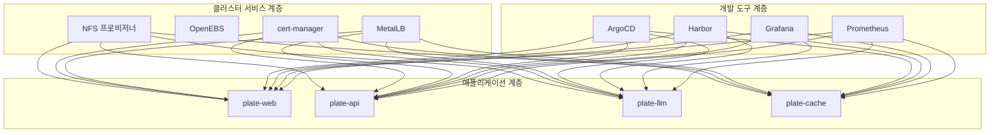

# 기능 아키텍처

<cite>
**이 문서에서 참조한 파일**  
- [README.md](file://README.md)
- [app-of-apps.yaml](file://environments/argocd/app-of-apps.yaml)
- [cert-manager/Chart.yaml](file://helm/cluster-services/cert-manager/Chart.yaml)
- [metallb/metallb-native.yaml](file://helm/cluster-services/metallb/metallb-native.yaml)
- [nfs-provisioner/Chart.yaml](file://helm/cluster-services/nfs-provisioner/Chart.yaml)
- [argocd/Chart.yaml](file://helm/development-tools/argocd/Chart.yaml)
- [harbor/Chart.yaml](file://helm/development-tools/harbor/Chart.yaml)
- [grafana/Chart.yaml](file://helm/development-tools/grafana/Chart.yaml)
- [prometheus/Chart.yaml](file://helm/development-tools/prometheus/Chart.yaml)
- [plate-web/Chart.yaml](file://helm/applications/plate-web/Chart.yaml)
- [plate-api/Chart.yaml](file://helm/applications/plate-server/Chart.yaml)
- [plate-llm/Chart.yaml](file://helm/applications/plate-llm/Chart.yaml)
- [plate-cache/Chart.yaml](file://helm/applications/plate-cache/Chart.yaml)
</cite>

## 목차
1. [소개](#소개)
2. [3계층 아키텍처 개요](#3계층-아키텍처-개요)
3. [클러스터 서비스 계층](#클러스터-서비스-계층)
4. [개발 도구 계층](#개발-도구-계층)
5. [애플리케이션 계층](#애플리케이션-계층)
6. [App-of-Apps 패턴을 통한 계층적 배포 구조](#app-of-apps-패턴을-통한-계층적-배포-구조)
7. [인그레스를 통한 트래픽 라우팅](#인그레스를-통한-트래픽-라우팅)
8. [스토리지 프로비저너를 통한 영구 스토리지 제공](#스토리지-프로비저너를-통한-영구-스토리지-제공)
9. [각 계층 간의 의존성과 통합 방식](#각-계층-간의-의존성과-통합-방식)

## 소개

prj-devops는 Helm 차트를 기반으로 한 프로덕션 준비된 Kubernetes 배포 구조를 제공하는 DevOps 프로젝트입니다. 이 문서는 클러스터 서비스, 개발 도구, 애플리케이션의 3계층 아키텍처를 설명하며, App-of-Apps 패턴을 통한 계층적 배포 구조, 인그레스를 통한 트래픽 라우팅, 스토리지 프로비저너를 통한 영구 스토리지 제공 등 핵심 아키텍처 패턴을 다룹니다. 각 계층 간의 의존성과 통합 방식을 설명하고, 실제 Helm 차트 파일을 참조하여 아키텍처 구현을 설명합니다.

## 3계층 아키텍처 개요

prj-devops는 다음과 같은 3계층 아키텍처로 구성되어 있습니다:

- **클러스터 서비스 계층**: cert-manager, OpenEBS, MetalLB, NFS 프로비저너 등 클러스터 레벨의 인프라 구성 요소
- **개발 도구 계층**: ArgoCD, Harbor, 모니터링 스택(Grafana, Prometheus) 등 CI/CD 및 운영 도구
- **애플리케이션 계층**: plate-web, plate-api, plate-llm, plate-cache 등 비즈니스 로직을 수행하는 애플리케이션

이러한 계층화된 구조는 책임의 경계를 명확히 하여 관리의 용이성과 확장성을 제공합니다.

**다이어그램 출처**  
- [README.md](file://README.md)
- [helm/cluster-services](file://helm/cluster-services)
- [helm/development-tools](file://helm/development-tools)
- [helm/applications](file://helm/applications)

## 클러스터 서비스 계층

클러스터 서비스 계층은 Kubernetes 클러스터의 핵심 인프라를 제공합니다. 이 계층은 cert-manager, MetalLB, NFS 프로비저너로 구성되어 있으며, 각각 SSL/TLS 인증서 관리, 로드 밸런싱, 영구 스토리지 프로비저닝을 담당합니다.

### cert-manager

cert-manager는 Let's Encrypt와 통합하여 자동 SSL/TLS 인증서 발급을 제공합니다. 스테이징 환경과 프로덕션 환경을 위해 별도의 ClusterIssuer가 구성되어 있으며, 각 환경에 맞는 인증서를 발급받습니다.

**다이어그램 출처**  
- [cert-manager/Chart.yaml](file://helm/cluster-services/cert-manager/Chart.yaml)
- [helm/cluster-services/cert-manager/templates/cluster-issuer-staging.yaml](file://helm/cluster-services/cert-manager/templates/cluster-issuer-staging.yaml)
- [helm/cluster-services/cert-manager/templates/cluster-issuer-prod.yaml](file://helm/cluster-services/cert-manager/templates/cluster-issuer-prod.yaml)

### MetalLB

MetalLB는 bare-metal 환경에서 LoadBalancer 타입의 서비스를 지원하는 네트워크 솔루션입니다. L2 어드버타이징 모드를 사용하여 클러스터 외부에서 접근 가능한 IP 주소를 할당합니다.

**다이어그램 출처**  
- [metallb/metallb-native.yaml](file://helm/cluster-services/metallb/metallb-native.yaml)
- [helm/cluster-services/metallb/pool-1.yaml](file://helm/cluster-services/metallb/pool-1.yaml)

### NFS 프로비저너

NFS 프로비저너는 기존의 NFS 서버를 기반으로 동적 Persistent Volume 프로비저닝을 제공합니다. 이를 통해 애플리케이션에서 PVC를 요청하면 자동으로 PV가 생성되고 NFS 서버에 마운트됩니다.

**다이어그램 출처**  
- [nfs-provisioner/Chart.yaml](file://helm/cluster-services/nfs-provisioner/Chart.yaml)
- [helm/cluster-services/nfs-provisioner/values.yaml](file://helm/cluster-services/nfs-provisioner/values.yaml)

## 개발 도구 계층

개발 도구 계층은 CI/CD 파이프라인, 컨테이너 레지스트리, 모니터링 대시보드 등 개발 및 운영에 필요한 도구들을 제공합니다.

### ArgoCD

ArgoCD는 GitOps 기반의 선언적 지속적 배포 도구입니다. App-of-Apps 패턴을 사용하여 모든 애플리케이션의 배포를 중앙에서 관리합니다. Git 저장소의 변경 사항을 감지하여 자동으로 클러스터 상태를 동기화합니다.

**다이어그램 출처**  
- [argocd/Chart.yaml](file://helm/development-tools/argocd/Chart.yaml)
- [environments/argocd/app-of-apps.yaml](file://environments/argocd/app-of-apps.yaml)

### Harbor

Harbor는 오픈소스 클라우드 네이티브 레지스트리로, 컨테이너 이미지 저장, 서명, 스캔 기능을 제공합니다. 프로젝트별로 이미지를 관리하고, RBAC를 통해 접근 제어를 수행합니다.

**다이어그램 출처**  
- [harbor/Chart.yaml](file://helm/development-tools/harbor/Chart.yaml)
- [helm/development-tools/harbor/values.yaml](file://helm/development-tools/harbor/values.yaml)

### 모니터링 스택

모니터링 스택은 Prometheus와 Grafana로 구성되어 있습니다. Prometheus는 메트릭 수집 및 저장을 담당하고, Grafana는 수집된 메트릭을 시각화하여 대시보드로 제공합니다.

**다이어그램 출처**  
- [grafana/Chart.yaml](file://helm/development-tools/grafana/Chart.yaml)
- [prometheus/Chart.yaml](file://helm/development-tools/prometheus/Chart.yaml)
- [helm/development-tools/grafana/values.yaml](file://helm/development-tools/grafana/values.yaml)
- [helm/development-tools/prometheus/values.yaml](file://helm/development-tools/prometheus/values.yaml)

## 애플리케이션 계층

애플리케이션 계층은 비즈니스 로직을 수행하는 실제 서비스들로 구성되어 있습니다. plate-web, plate-api, plate-llm, plate-cache 등 다양한 서비스가 Helm 차트로 관리되며, 환경별로 별도의 values 파일을 통해 설정을 관리합니다.

### plate-web

plate-web은 Plate 서비스의 프론트엔드 웹 애플리케이션입니다. 정적 리소스를 제공하며, Ingress를 통해 외부에서 접근 가능합니다.

**다이어그램 출처**  
- [plate-web/Chart.yaml](file://helm/applications/plate-web/Chart.yaml)
- [helm/applications/plate-web/values-stg.yaml](file://helm/applications/plate-web/values-stg.yaml)
- [helm/applications/plate-web/values-prod.yaml](file://helm/applications/plate-web/values-prod.yaml)

### plate-api

plate-api는 Plate 서비스의 백엔드 API 서버입니다. RESTful API를 제공하며, 데이터베이스와 상호작용합니다.

**다이어그램 출처**  
- [plate-api/Chart.yaml](file://helm/applications/plate-server/Chart.yaml)
- [helm/applications/plate-server/values-stg.yaml](file://helm/applications/plate-server/values-stg.yaml)
- [helm/applications/plate-server/values-prod.yaml](file://helm/applications/plate-server/values-prod.yaml)

### plate-llm

plate-llm은 Plate 서비스의 LLM(대규모 언어 모델) 기능을 담당하는 서비스입니다. AI 기반의 자연어 처리 기능을 제공합니다.

**다이어그램 출처**  
- [plate-llm/Chart.yaml](file://helm/applications/plate-llm/Chart.yaml)
- [helm/applications/plate-llm/values-stg.yaml](file://helm/applications/plate-llm/values-stg.yaml)

### plate-cache

plate-cache는 Plate 서비스의 캐시 스토리지를 제공하는 PVC입니다. Redis 또는 기타 캐시 시스템에서 사용됩니다.

**다이어그램 출처**  
- [plate-cache/Chart.yaml](file://helm/applications/plate-cache/Chart.yaml)
- [helm/applications/plate-cache/values-stg.yaml](file://helm/applications/plate-cache/values-stg.yaml)
- [helm/applications/plate-cache/values-prod.yaml](file://helm/applications/plate-cache/values-prod.yaml)

## App-of-Apps 패턴을 통한 계층적 배포 구조

prj-devops는 ArgoCD의 App-of-Apps 패턴을 사용하여 계층적 배포 구조를 구현합니다. `environments/argocd/app-of-apps.yaml` 파일이 모든 하위 애플리케이션을 관리하며, 각 애플리케이션은 별도의 ArgoCD Application 리소스로 정의됩니다.

이 구조는 다음과 같은 장점을 제공합니다:

- **중앙 집중식 관리**: 모든 애플리케이션의 배포 상태를 하나의 상위 애플리케이션에서 확인할 수 있습니다.
- **의존성 관리**: sync-wave 어노테이션을 사용하여 배포 순서를 제어할 수 있습니다.
- **환경 분리**: 스테이징과 프로덕션 환경을 별도의 Application으로 관리하여 혼란을 방지합니다.
- **자동 동기화**: Git 저장소의 변경 사항을 감지하여 자동으로 클러스터 상태를 동기화합니다.

**다이어그램 출처**  
- [app-of-apps.yaml](file://environments/argocd/app-of-apps.yaml)
- [environments/argocd/apps/plate-web-stg.yaml](file://environments/argocd/apps/plate-web-stg.yaml)
- [environments/argocd/apps/plate-api-prod.yaml](file://environments/argocd/apps/plate-api-prod.yaml)

## 인그레스를 통한 트래픽 라우팅

Ingress 리소스를 사용하여 외부 트래픽을 내부 서비스로 라우팅합니다. MetalLB가 제공하는 LoadBalancer IP를 통해 클러스터 외부에서 접근 가능하며, cert-manager가 발급한 SSL/TLS 인증서를 사용하여 HTTPS 통신을 보장합니다.

스테이징 환경과 프로덕션 환경은 각각 다른 도메인과 인증서를 사용합니다:

- **스테이징**: `cocdev.co.kr`, `stg.cocdev.co.kr` - Let's Encrypt Staging 인증서 사용
- **프로덕션**: `cocdev.co.kr`, `www.cocdev.co.kr` - Let's Encrypt Production 인증서 사용

**다이어그램 출처**  
- [helm/ingress/Chart.yaml](file://helm/ingress/Chart.yaml)
- [helm/ingress/values-stg.yaml](file://helm/ingress/values-stg.yaml)
- [helm/ingress/values.yaml](file://helm/ingress/values.yaml)

## 스토리지 프로비저너를 통한 영구 스토리지 제공

NFS 프로비저너를 사용하여 영구 스토리지를 제공합니다. 애플리케이션에서 PVC를 요청하면, NFS 프로비저너가 자동으로 PV를 생성하고 기존의 NFS 서버에 연결합니다. 이를 통해 데이터의 지속성을 보장하며, 애플리케이션 재시작 시에도 데이터가 유지됩니다.

StorageClass는 `nfs-client`로 정의되어 있으며, PVC 생성 시 이 StorageClass를 참조합니다.

**다이어그램 출처**  
- [nfs-provisioner/Chart.yaml](file://helm/cluster-services/nfs-provisioner/Chart.yaml)
- [helm/cluster-services/nfs-provisioner/templates/storageclass.yaml](file://helm/cluster-services/nfs-provisioner/templates/storageclass.yaml)
- [helm/applications/plate-cache/templates/pvc.yaml](file://helm/applications/plate-cache/templates/pvc.yaml)

## 각 계층 간의 의존성과 통합 방식

각 계층 간의 의존성은 다음과 같은 방식으로 관리됩니다:

- **클러스터 서비스 → 개발 도구**: cert-manager는 ArgoCD, Harbor, Grafana 등의 HTTPS 통신을 위한 인증서를 제공합니다. MetalLB는 이들 서비스의 LoadBalancer IP를 할당합니다.
- **개발 도구 → 애플리케이션**: ArgoCD는 모든 애플리케이션의 배포를 관리합니다. Harbor는 애플리케이션 컨테이너 이미지를 저장하고 제공합니다. 모니터링 스택은 애플리케이션의 메트릭을 수집 및 시각화합니다.
- **클러스터 서비스 → 애플리케이션**: NFS 프로비저너는 애플리케이션의 PVC를 위한 영구 스토리지를 제공합니다. cert-manager는 애플리케이션의 Ingress에 대한 SSL/TLS 인증서를 발급합니다.

이러한 통합 방식은 각 계층이 독립적으로 관리되면서도 필요한 자원을 효율적으로 공유할 수 있도록 합니다.

**다이어그램 출처**  
- [README.md](file://README.md)
- [helm/cluster-services](file://helm/cluster-services)
- [helm/development-tools](file://helm/development-tools)
- [helm/applications](file://helm/applications)