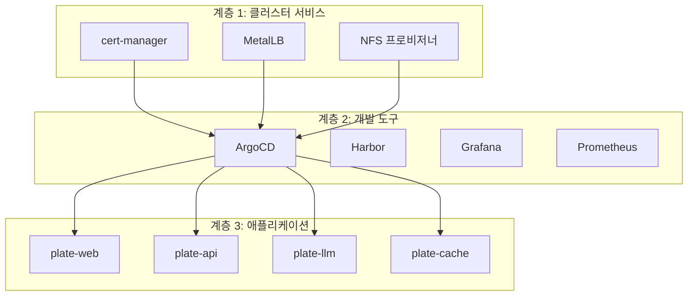
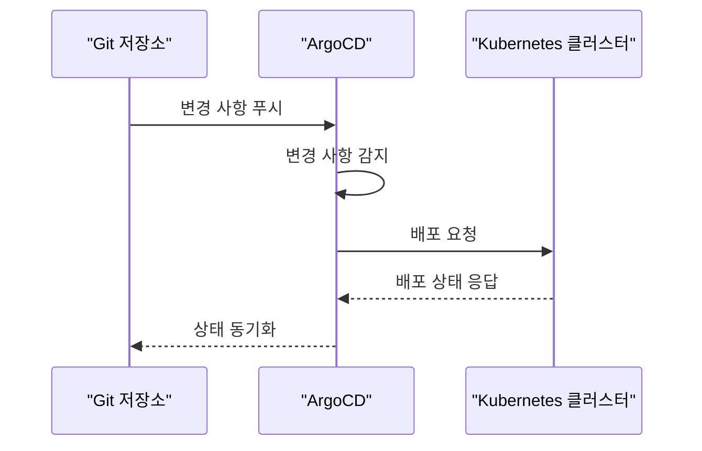
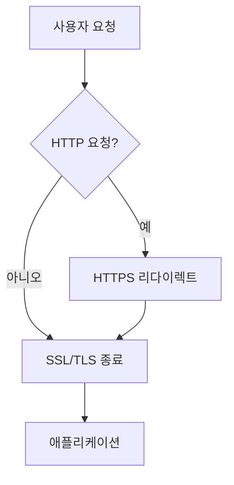
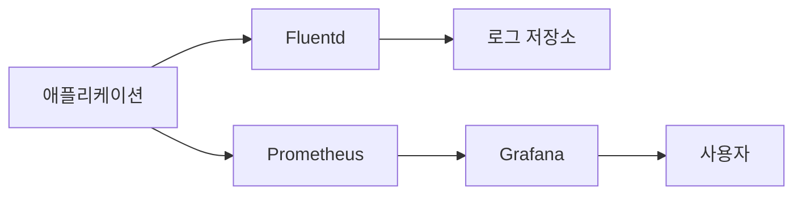
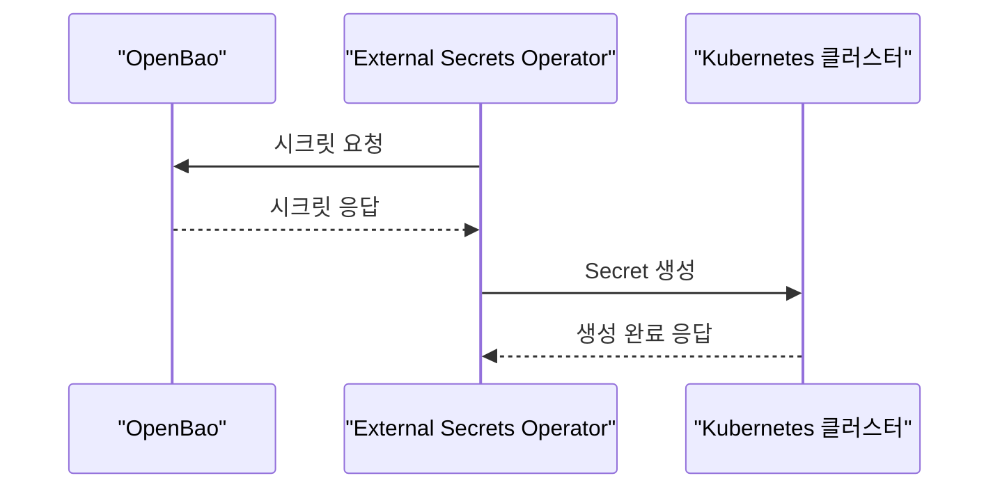

# 주요 기능

<cite>
**이 문서에서 참조한 파일**
- [README.md](file://README.md)
- [environments/argocd/app-of-apps.yaml](file://environments/argocd/app-of-apps.yaml)
- [environments/argocd/apps/ingress-prod.yaml](file://environments/argocd/apps/ingress-prod.yaml)
- [environments/argocd/apps/ingress-stg.yaml](file://environments/argocd/apps/ingress-stg.yaml)
- [environments/argocd/apps/openbao-secrets-manager-prod.yaml](file://environments/argocd/apps/openbao-secrets-manager-prod.yaml)
- [environments/argocd/apps/openbao-secrets-manager-stg.yaml](file://environments/argocd/apps/openbao-secrets-manager-stg.yaml)
- [environments/argocd/apps/plate-api-prod.yaml](file://environments/argocd/apps/plate-api-prod.yaml)
- [environments/argocd/apps/plate-api-stg.yaml](file://environments/argocd/apps/plate-api-stg.yaml)
- [environments/argocd/apps/plate-cache-prod.yaml](file://environments/argocd/apps/plate-cache-prod.yaml)
- [environments/argocd/apps/plate-cache-stg.yaml](file://environments/argocd/apps/plate-cache-stg.yaml)
- [environments/argocd/apps/plate-llm-stg.yaml](file://environments/argocd/apps/plate-llm-stg.yaml)
- [environments/argocd/apps/plate-web-prod.yaml](file://environments/argocd/apps/plate-web-prod.yaml)
- [environments/argocd/apps/plate-web-stg.yaml](file://environments/argocd/apps/plate-web-stg.yaml)
- [helm/cluster-services/cert-manager/Chart.yaml](file://helm/cluster-services/cert-manager/Chart.yaml)
- [helm/cluster-services/cert-manager/values.yaml](file://helm/cluster-services/cert-manager/values.yaml)
- [helm/cluster-services/cert-manager/templates/cluster-issuer-prod.yaml](file://helm/cluster-services/cert-manager/templates/cluster-issuer-prod.yaml)
- [helm/cluster-services/cert-manager/templates/cluster-issuer-staging.yaml](file://helm/cluster-services/cert-manager/templates/cluster-issuer-staging.yaml)
- [helm/development-tools/fluentd/Chart.yaml](file://helm/development-tools/fluentd/Chart.yaml)
- [helm/development-tools/fluentd/values.yaml](file://helm/development-tools/fluentd/values.yaml)
- [helm/development-tools/grafana/Chart.yaml](file://helm/development-tools/grafana/Chart.yaml)
- [helm/development-tools/grafana/values.yaml](file://helm/development-tools/grafana/values.yaml)
- [helm/development-tools/prometheus/Chart.yaml](file://helm/development-tools/prometheus/Chart.yaml)
- [helm/development-tools/prometheus/values.yaml](file://helm/development-tools/prometheus/values.yaml)
- [helm/shared-configs/openbao-secrets-manager/Chart.yaml](file://helm/shared-configs/openbao-secrets-manager/Chart.yaml)
- [helm/shared-configs/openbao-secrets-manager/values.yaml](file://helm/shared-configs/openbao-secrets-manager/values.yaml)
- [helm/shared-configs/openbao-secrets-manager/templates/external-secret.yaml](file://helm/shared-configs/openbao-secrets-manager/templates/external-secret.yaml)
- [helm/shared-configs/openbao-secrets-manager/templates/secret-store.yaml](file://helm/shared-configs/openbao-secrets-manager/templates/secret-store.yaml)
</cite>

## 목차
1. [소개](#소개)
2. [계층화된 배포 구조](#계층화된-배포-구조)
3. [자동화된 배포 파이프라인](#자동화된-배포-파이프라인)
4. [환경 관리](#환경-관리)
5. [보안 기능](#보안-기능)
6. [모니터링 및 로깅](#모니터링-및-로깅)
7. [시크릿 관리](#시크릿-관리)
8. [결론](#결론)

## 소개

prj-devops는 프로덕션 레디 Helm 차트를 기반으로 한 DevOps 프로젝트로, 현대적인 클라우드 네이티브 애플리케이션을 위한 인프라스트럭처 애즈 코드(IaC) 솔루션을 제공합니다. 이 문서는 프로젝트의 주요 기능을 개요하고, 각 기능의 구현 하이라이트와 아키텍처를 설명합니다. 계층화된 배포 구조, 자동화된 배포 파이프라인, 환경 관리, 보안 및 모니터링 등의 핵심 기능을 통해 사용자에게 가치를 제공하며, 시스템의 다른 부분과 어떻게 통합되는지에 대해 설명합니다.

**Section sources**
- [README.md](file://README.md#L1-L417)

## 계층화된 배포 구조

prj-devops는 클러스터 서비스, 개발 도구, 애플리케이션의 3계층 구조로 구성되어 있으며, 각 계층은 명확한 책임 경계를 가지고 있습니다. 이 구조는 인프라와 애플리케이션을 분리하여 관리함으로써 운영의 복잡성을 줄이고, 안정성을 높이는 데 기여합니다.

- **클러스터 서비스**: cert-manager, MetalLB, NFS 프로비저너 등 클러스터 레벨의 인프라 구성 요소를 포함합니다.
- **개발 도구**: ArgoCD, Harbor, Grafana, Prometheus 등 CI/CD, 레지스트리, 모니터링과 같은 운영 도구를 포함합니다.
- **애플리케이션**: plate-web, plate-api, plate-llm, plate-cache 등 비즈니스 로직을 담당하는 애플리케이션을 포함합니다.

이러한 계층 구조는 Helm 차트를 통해 관리되며, `helm/` 디렉터리 하위에 각 계층별로 구성되어 있습니다. 이를 통해 ArgoCD 설정을 단순화하고, 배포의 일관성을 유지할 수 있습니다.

**Diagram sources**
- [README.md](file://README.md#L16-L83)

## 자동화된 배포 파이프라인

prj-devops는 GitOps 통합을 통해 자동화된 배포 파이프라인을 구현합니다. ArgoCD의 App-of-Apps 패턴을 활용하여, 모든 애플리케이션을 선언적으로 관리하며, Git 저장소의 변경 사항을 감지하면 자동으로 배포를 수행합니다.

- **App-of-Apps 패턴**: `environments/argocd/app-of-apps.yaml` 파일이 모든 하위 Application을 관리하며, `environments/argocd/apps/` 디렉터리에 각 서비스별 ArgoCD Application 정의가 위치합니다.
- **자동 동기화**: `syncPolicy.automated` 설정을 통해 Git 저장소의 변경 사항이 발생하면 자동으로 배포됩니다.
- **환경 분리**: 스테이징과 프로덕션 환경이 별도의 Application으로 관리되며, 각 환경별로 독립적인 배포가 가능합니다.

이러한 자동화된 배포 파이프라인은 배포 오류를 줄이고, 빠른 피드백 루프를 제공하여 개발 및 운영 효율성을 극대화합니다.

**Diagram sources**
- [README.md](file://README.md#L356-L407)
- [environments/argocd/app-of-apps.yaml](file://environments/argocd/app-of-apps.yaml)

## 환경 관리

prj-devops는 스테이징과 프로덕션 환경을 완전히 분리하여 관리합니다. 각 환경은 독립적인 설정과 배포 전략을 가지며, 안정적인 운영을 보장합니다.

- **스테이징 환경**: 개발 및 테스트를 위한 환경으로, Let's Encrypt Staging 인증서를 사용하며, 리소스 요청이 개발자 친화적으로 설정되어 있습니다.
- **프로덕션 환경**: 실 서비스를 위한 환경으로, Let's Encrypt Production 인증서를 사용하며, 보안이 강화되고 SSL/TLS가 강제 적용됩니다.

환경별 설정은 Helm 차트의 `values.yaml` 파일을 통해 관리되며, 스테이징과 프로덕션 환경에 따라 각각 `values-stg.yaml`과 `values-prod.yaml` 파일을 사용합니다. 이를 통해 환경별로 최적화된 설정을 적용할 수 있습니다.

**Section sources**
- [README.md](file://README.md#L155-L174)

## 보안 기능

prj-devops는 프로덕션 환경에서의 보안을 최우선으로 고려하여 다양한 보안 기능을 구현하고 있습니다.

- **비루트 컨테이너 실행**: 컨테이너는 비루트 사용자로 실행되어, 시스템 권한을 최소화합니다.
- **읽기 전용 루트 파일시스템**: 가능한 경우 루트 파일시스템을 읽기 전용으로 구성하여, 무단 변경을 방지합니다.
- **리소스 요청/제한 강제**: 리소스 요청과 제한을 강제하여, 리소스 과다 사용을 방지합니다.
- **SSL/TLS 종료 및 강제 HTTPS**: Ingress를 통해 SSL/TLS 종료를 수행하며, HTTPS를 강제 적용하여 통신의 보안을 강화합니다.

특히, cert-manager를 통해 SSL/TLS 인증서를 자동으로 관리하며, Let's Encrypt와 통합하여 실서명 인증서를 발급받습니다. 이를 통해 인증서 만료 문제를 해결하고, 보안을 유지할 수 있습니다.

**Diagram sources**
- [README.md](file://README.md#L248-L265)
- [helm/cluster-services/cert-manager/values.yaml](file://helm/cluster-services/cert-manager/values.yaml#L9-L35)
- [helm/cluster-services/cert-manager/templates/cluster-issuer-prod.yaml](file://helm/cluster-services/cert-manager/templates/cluster-issuer-prod.yaml)
- [helm/cluster-services/cert-manager/templates/cluster-issuer-staging.yaml](file://helm/cluster-services/cert-manager/templates/cluster-issuer-staging.yaml)

## 모니터링 및 로깅

prj-devops는 Prometheus와 Grafana를 통한 모니터링 설정 및 Fluentd를 통한 로그 수집 및 전송 기능을 제공합니다. 이를 통해 시스템의 상태를 실시간으로 모니터링하고, 문제 발생 시 신속하게 대응할 수 있습니다.

- **Prometheus**: 메트릭 수집을 담당하며, `helm/development-tools/prometheus/` 디렉터리에 Helm 차트가 위치합니다. Ingress를 통해 외부에서 접근할 수 있도록 설정되어 있으며, Let's Encrypt를 통해 SSL/TLS 인증서를 자동으로 관리합니다.
- **Grafana**: 모니터링 대시보드를 제공하며, `helm/development-tools/grafana/` 디렉터리에 Helm 차트가 위치합니다. Prometheus를 데이터 소스로 사용하여, 다양한 메트릭을 시각화합니다.
- **Fluentd**: 로그 수집 및 전송을 담당하며, `helm/development-tools/fluentd/` 디렉터리에 Helm 차트가 위치합니다. Kubernetes 클러스터 내의 모든 컨테이너 로그를 수집하여, 외부 로그 저장소로 전송합니다.

이러한 모니터링 및 로깅 기능은 시스템의 가시성을 높이고, 운영 효율성을 개선하는 데 중요한 역할을 합니다.

**Diagram sources**
- [helm/development-tools/prometheus/Chart.yaml](file://helm/development-tools/prometheus/Chart.yaml)
- [helm/development-tools/prometheus/values.yaml](file://helm/development-tools/prometheus/values.yaml#L380-L431)
- [helm/development-tools/grafana/Chart.yaml](file://helm/development-tools/grafana/Chart.yaml)
- [helm/development-tools/grafana/values.yaml](file://helm/development-tools/grafana/values.yaml#L303-L322)
- [helm/development-tools/fluentd/Chart.yaml](file://helm/development-tools/fluentd/Chart.yaml)
- [helm/development-tools/fluentd/values.yaml](file://helm/development-tools/fluentd/values.yaml#L290-L389)

## 시크릿 관리

prj-devops는 OpenBao를 통한 시크릿 관리 기능을 제공합니다. External Secrets Operator를 사용하여, OpenBao에 저장된 시크릿을 Kubernetes 클러스터 내의 애플리케이션에 안전하게 주입합니다.

- **OpenBao**: 시크릿 저장소로 사용되며, `openbao.cocdev.co.kr` 도메인을 통해 접근할 수 있습니다.
- **External Secrets Operator**: OpenBao에 저장된 시크릿을 Kubernetes Secret으로 동기화하며, `helm/shared-configs/openbao-secrets-manager/` 디렉터리에 Helm 차트가 위치합니다.
- **환경별 시크릿**: 스테이징과 프로덕션 환경에 따라 각각 다른 경로에서 시크릿을 가져오며, `server/staging`과 `server/production` 경로를 사용합니다.

이러한 시크릿 관리 기능은 민감한 정보를 안전하게 관리하고, 애플리케이션의 보안을 강화하는 데 기여합니다.

**Diagram sources**
- [helm/shared-configs/openbao-secrets-manager/Chart.yaml](file://helm/shared-configs/openbao-secrets-manager/Chart.yaml)
- [helm/shared-configs/openbao-secrets-manager/values.yaml](file://helm/shared-configs/openbao-secrets-manager/values.yaml#L6-L165)
- [helm/shared-configs/openbao-secrets-manager/templates/external-secret.yaml](file://helm/shared-configs/openbao-secrets-manager/templates/external-secret.yaml)
- [helm/shared-configs/openbao-secrets-manager/templates/secret-store.yaml](file://helm/shared-configs/openbao-secrets-manager/templates/secret-store.yaml)

## 결론

prj-devops는 계층화된 배포 구조, 자동화된 배포 파이프라인, 환경 관리, 보안 및 모니터링 등의 주요 기능을 통해, 현대적인 클라우드 네이티브 애플리케이션을 안정적이고 효율적으로 운영할 수 있는 기반을 제공합니다. 이러한 기능들은 서로 긴밀하게 통합되어 있으며, 사용자에게 높은 가치를 제공합니다. 향후 CI/CD 파이프라인 통합, 백업/복구 전략 구현 등의 개선을 통해, 더욱 완성도 높은 DevOps 환경을 구축할 수 있을 것입니다.