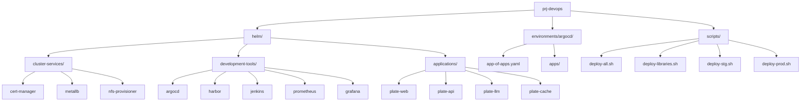
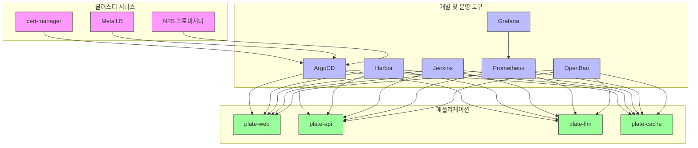

# 프로젝트 개요

<cite>
**이 문서에서 참조한 파일**  
- [README.md](file://README.md)
- [environments/argocd/README.md](file://environments/argocd/README.md)
- [helm/applications/plate-server/Chart.yaml](file://helm/applications/plate-server/Chart.yaml)
- [helm/cluster-services/cert-manager/Chart.yaml](file://helm/cluster-services/cert-manager/Chart.yaml)
- [helm/development-tools/argocd/Chart.yaml](file://helm/development-tools/argocd/Chart.yaml)
- [helm/development-tools/harbor/Chart.yaml](file://helm/development-tools/harbor/Chart.yaml)
- [helm/development-tools/prometheus/Chart.yaml](file://helm/development-tools/prometheus/Chart.yaml)
- [helm/development-tools/grafana/Chart.yaml](file://helm/development-tools/grafana/Chart.yaml)
- [helm/development-tools/jenkins/Chart.yaml](file://helm/development-tools/jenkins/Chart.yaml)
- [helm/shared-configs/openbao-secrets-manager/Chart.yaml](file://helm/shared-configs/openbao-secrets-manager/Chart.yaml)
- [scripts/deploy-all.sh](file://scripts/deploy-all.sh)
- [scripts/deploy-libraries.sh](file://scripts/deploy-libraries.sh)
- [scripts/deploy-stg.sh](file://scripts/deploy-stg.sh)
- [scripts/deploy-prod.sh](file://scripts/deploy-prod.sh)
- [environments/argocd/app-of-apps.yaml](file://environments/argocd/app-of-apps.yaml)
</cite>

## 목차
1. [소개](#소개)
2. [프로젝트 구조](#프로젝트-구조)
3. [주요 구성 요소](#주요-구성-요소)
4. [아키텍처 개요](#아키텍처-개요)
5. [핵심 기능 및 운영 원칙](#핵심-기능-및-운영-원칙)
6. [배포 전략 및 GitOps 통합](#배포-전략-및-gitops-통합)
7. [보안 및 모니터링](#보안-및-모니터링)
8. [결론](#결론)

## 소개

prj-devops 저장소는 Helm 차트 기반의 프로덕션 준비된 Kubernetes 배포 구조를 제공하는 Infrastructure as Code(IaC) 솔루션입니다. 이 문서는 프로젝트의 목적, 주요 특징, 대상 사용자, 핵심 기능 및 전체 아키텍처에 대한 개요를 제공합니다. GitOps 원칙을 기반으로 다중 환경(스테이징 및 프로덕션)에 대한 체계적인 배포를 가능하게 하며, 클라우드 네이티브 애플리케이션의 안정적인 배포 구조를 제공하는 방법을 설명합니다. 주요 구성 요소인 Helm, ArgoCD, cert-manager, Harbor, Prometheus, Grafana, Jenkins 등의 역할과 상호작용을 간략히 소개하고, 전체 시스템의 흐름을 이해할 수 있도록 돕습니다.

**참조 파일**
- [README.md](file://README.md#L1-L417)

## 프로젝트 구조

prj-devops 저장소는 계층화된 구조를 기반으로 구성되어 있으며, 인프라, 개발 도구, 애플리케이션의 세 가지 주요 계층으로 나뉩니다. 이 구조는 책임의 명확한 분리를 통해 관리의 용이성과 확장성을 보장합니다.

### 주요 디렉터리 구조

- **helm/**: 모든 Helm 차트가 포함된 디렉터리로, 다음과 같은 하위 디렉터리로 구성됩니다.
  - `cluster-services/`: 클러스터 수준의 인프라 구성 요소 (cert-manager, MetalLB, NFS 프로비저너)
  - `development-tools/`: CI/CD, 모니터링, 보안 등 운영 도구 (ArgoCD, Harbor, Jenkins, Prometheus, Grafana)
  - `applications/`: 비즈니스 로직을 담당하는 애플리케이션 (plate-web, plate-api, plate-llm, plate-cache)
  - `ingress/`: 통합 Ingress 설정
  - `shared-configs/`: 공유 설정 (OpenBao 시크릿 매니저 통합)
- **environments/argocd/**: ArgoCD를 통한 GitOps 배포를 위한 설정 파일들이 위치합니다.
  - `app-of-apps.yaml`: App-of-Apps 패턴의 메인 정의 파일
  - `apps/`: 각 애플리케이션 및 환경별 ArgoCD Application 정의 파일
- **scripts/**: 배포 자동화를 위한 스크립트들이 포함되어 있습니다.
  - `deploy-all.sh`: 전체 배포 오케스트레이션 스크립트
  - `deploy-libraries.sh`: 인프라 및 도구 배포 스크립트
  - `deploy-stg.sh`, `deploy-prod.sh`: 스테이징 및 프로덕션 환경 전용 배포 스크립트

**다이어그램 출처**
- [README.md](file://README.md#L16-L108)

**섹션 출처**
- [README.md](file://README.md#L16-L108)

## 주요 구성 요소

이 프로젝트는 다양한 오픈소스 도구들을 통합하여 클라우드 네이티브 환경을 구축합니다. 각 구성 요소는 특정한 역할을 수행하며, 서로 긴밀하게 협력하여 전체 시스템을 운영합니다.

### Helm
Helm은 Kubernetes 애플리케이션을 패키징하고 배포하기 위한 표준 도구입니다. 이 프로젝트에서는 모든 구성 요소를 Helm 차트로 정의하여 일관성 있고 재사용 가능한 배포를 가능하게 합니다.

### ArgoCD
ArgoCD는 GitOps 원칙을 기반으로 한 선언적 지속적 배포 도구입니다. Git 저장소의 상태를 기준으로 Kubernetes 클러스터의 실제 상태를 자동으로 동기화합니다. App-of-Apps 패턴을 사용하여 복잡한 애플리케이션 구조를 관리합니다.

### cert-manager
cert-manager는 Kubernetes 클러스터에서 SSL/TLS 인증서를 자동으로 발급하고 관리하는 도구입니다. Let's Encrypt와 통합되어 스테이징 및 프로덕션 환경에 적절한 인증서를 제공합니다.

### Harbor
Harbor는 신뢰할 수 있는 클라우드 네이티브 레지스트리로, 컨테이너 이미지를 저장, 서명 및 스캔합니다. 중앙 집중식 이미지 저장소를 제공하여 이미지 관리의 보안과 효율성을 높입니다.

### Prometheus & Grafana
Prometheus는 메트릭 수집 및 모니터링을 위한 시스템이며, Grafana는 이를 시각화하는 대시보드 도구입니다. 두 도구는 함께 사용되어 시스템의 성능과 가용성을 실시간으로 모니터링할 수 있도록 합니다.

### Jenkins
Jenkins는 CI/CD 파이프라인을 자동화하는 데 사용되는 오픈소스 자동화 서버입니다. 빌드, 테스트, 배포 프로세스를 통합하여 개발 및 운영의 효율성을 극대화합니다.

### OpenBao
OpenBao는 시크릿 관리 도구로, 외부 시크릿 관리자(External Secrets Operator)와 통합되어 애플리케이션의 환경 변수 및 레지스트리 인증 정보를 안전하게 관리합니다.

**섹션 출처**
- [README.md](file://README.md#L7-L14)
- [helm/development-tools/argocd/Chart.yaml](file://helm/development-tools/argocd/Chart.yaml#L1-L32)
- [helm/development-tools/harbor/Chart.yaml](file://helm/development-tools/harbor/Chart.yaml#L1-L25)
- [helm/development-tools/prometheus/Chart.yaml](file://helm/development-tools/prometheus/Chart.yaml#L1-L59)
- [helm/development-tools/grafana/Chart.yaml](file://helm/development-tools/grafana/Chart.yaml#L1-L36)
- [helm/development-tools/jenkins/Chart.yaml](file://helm/development-tools/jenkins/Chart.yaml#L1-L50)
- [helm/shared-configs/openbao-secrets-manager/Chart.yaml](file://helm/shared-configs/openbao-secrets-manager/Chart.yaml#L1-L25)

## 아키텍처 개요

이 프로젝트의 아키텍처는 계층화된 구조와 GitOps 원칙을 기반으로 설계되었습니다. 각 계층은 독립적으로 관리되며, 상위 계층은 하위 계층의 기능을 활용합니다.

**다이어그램 출처**
- [README.md](file://README.md#L10-L14)
- [helm/cluster-services/cert-manager/Chart.yaml](file://helm/cluster-services/cert-manager/Chart.yaml#L1-L23)
- [helm/development-tools/argocd/Chart.yaml](file://helm/development-tools/argocd/Chart.yaml#L1-L32)

**섹션 출처**
- [README.md](file://README.md#L10-L14)

## 핵심 기능 및 운영 원칙

이 프로젝트는 안정성, 보안, 자동화를 핵심 가치로 삼고 있으며, 이를 위한 다양한 기능과 운영 원칙을 수립하고 있습니다.

### 계층화된 배포 구조
- **1계층 (클러스터 서비스)**: cert-manager, MetalLB, NFS 프로비저너 등 클러스터 수준의 인프라 구성 요소
- **2계층 (개발 도구)**: ArgoCD, Harbor, Jenkins, Prometheus, Grafana 등 운영 및 개발 도구
- **3계층 (애플리케이션)**: plate-web, plate-api, plate-llm, plate-cache 등 비즈니스 로직을 담당하는 애플리케이션

### 환경별 설정 관리
- **애플리케이션**: 각 Helm 차트 디렉터리에 `values-stg.yaml` 및 `values-prod.yaml` 파일을 두어 환경별 설정을 관리
- **인프라 및 도구**: 각 Helm 차트 디렉터리의 `values.yaml` 파일을 통해 형상 관리

### 자동화된 배포
- `deploy-all.sh`: 전체 배포를 오케스트레이션하는 메인 스크립트
- `deploy-libraries.sh`: 인프라 및 도구만 배포
- `deploy-stg.sh`: 스테이징 환경 전용 배포 스크립트
- `deploy-prod.sh`: 프로덕션 환경 전용 배포 스크립트 (안전 장치 포함)

**섹션 출처**
- [README.md](file://README.md#L10-L14)
- [scripts/deploy-all.sh](file://scripts/deploy-all.sh#L1-L279)
- [scripts/deploy-libraries.sh](file://scripts/deploy-libraries.sh#L1-L128)
- [scripts/deploy-stg.sh](file://scripts/deploy-stg.sh#L1-L173)
- [scripts/deploy-prod.sh](file://scripts/deploy-prod.sh#L1-L299)

## 배포 전략 및 GitOps 통합

이 프로젝트는 ArgoCD를 중심으로 한 GitOps 전략을 채택하여, 코드와 인프라의 변경 사항을 Git 저장소를 통해 관리합니다.

### App-of-Apps 패턴
`environments/argocd/app-of-apps.yaml` 파일은 모든 하위 ArgoCD Application을 관리하는 메인 Application입니다. 이 패턴을 통해 복잡한 애플리케이션 구조를 단일 진실 원천(Single Source of Truth)으로 관리할 수 있습니다.

### 자동 동기화
ArgoCD는 Git 저장소의 변경 사항을 주기적으로 감지하고, 클러스터의 실제 상태를 저장소의 선언된 상태와 자동으로 동기화합니다. 이는 수동 배포 오류를 방지하고, 항상 일관된 상태를 유지할 수 있도록 합니다.

### 환경 분리
스테이징과 프로덕션 환경은 별도의 ArgoCD Application으로 관리되며, 각 환경은 독립적인 설정과 배포 전략을 가집니다. 이는 프로덕션 환경의 안정성을 보장합니다.

**섹션 출처**
- [environments/argocd/README.md](file://environments/argocd/README.md#L1-L107)
- [environments/argocd/app-of-apps.yaml](file://environments/argocd/app-of-apps.yaml#L1-L40)

## 보안 및 모니터링

이 프로젝트는 프로덕션 환경의 보안과 안정성을 최우선으로 고려하여 다양한 보안 및 모니터링 기능을 제공합니다.

### 보안 기능
- **비루트 컨테이너 실행**: 컨테이너는 비루트 사용자로 실행되어 권한 상승 공격을 방지
- **읽기 전용 루트 파일시스템**: 가능한 경우 컨테이너의 루트 파일시스템을 읽기 전용으로 설정
- **리소스 제한**: CPU 및 메모리 리소스에 대한 Requests/Limits를 강제 적용
- **SSL/TLS 강제**: 모든 트래픽에 대해 HTTPS를 강제 적용하고, Let's Encrypt를 통해 인증서를 자동 관리

### 모니터링
- **Prometheus**: 시스템 및 애플리케이션 메트릭을 수집
- **Grafana**: 수집된 메트릭을 시각화하여 대시보드로 제공
- **Jenkins**: CI/CD 파이프라인의 상태 및 성능을 모니터링
- **ArgoCD**: 배포 상태 및 동기화 여부를 실시간으로 모니터링

**섹션 출처**
- [README.md](file://README.md#L248-L258)
- [helm/development-tools/prometheus/Chart.yaml](file://helm/development-tools/prometheus/Chart.yaml#L1-L59)
- [helm/development-tools/grafana/Chart.yaml](file://helm/development-tools/grafana/Chart.yaml#L1-L36)

## 결론

prj-devops 저장소는 Helm과 ArgoCD를 중심으로 한 체계적인 GitOps 기반의 Infrastructure as Code 솔루션입니다. 계층화된 아키텍처, 멀티 환경 지원, 자동화된 배포, 강화된 보안 기능을 통해 프로덕션 준비된 Kubernetes 환경을 안정적으로 구축하고 운영할 수 있습니다. 이 문서는 프로젝트의 전반적인 개요를 제공하며, 각 구성 요소의 역할과 상호작용을 이해하는 데 도움을 줍니다. 향후 CI/CD 파이프라인 통합, 모니터링 스택 강화, 백업/복구 전략 구현 등의 개선을 통해 더욱 견고한 운영 환경을 구축할 계획입니다.