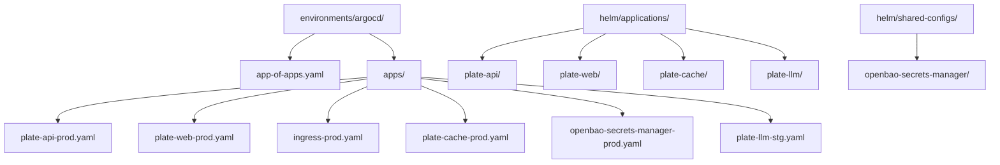
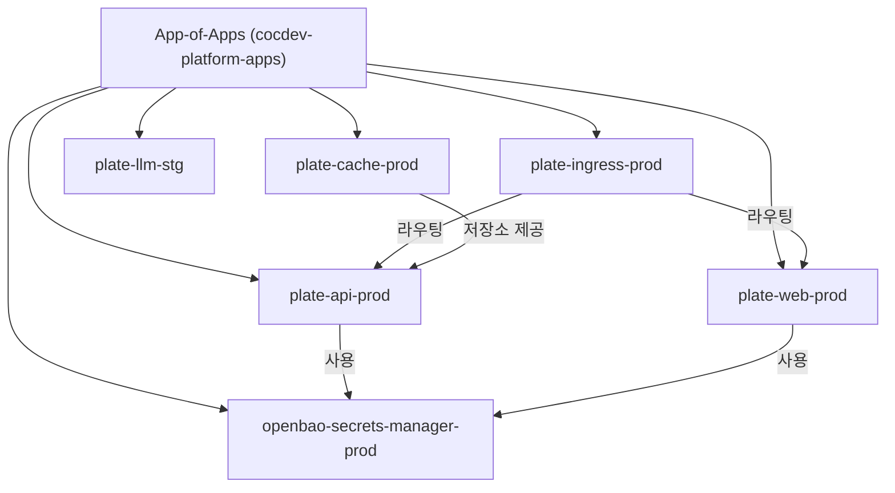
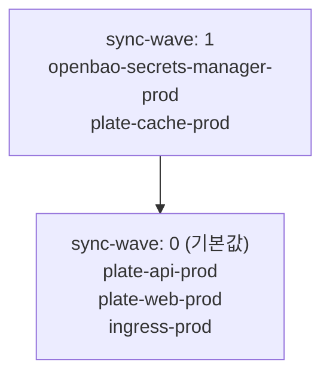

# App-of-Apps 패턴

<cite>
**이 문서에서 참조한 파일**  
- [app-of-apps.yaml](file://environments/argocd/app-of-apps.yaml)
- [plate-api-prod.yaml](file://environments/argocd/apps/plate-api-prod.yaml)
- [plate-web-prod.yaml](file://environments/argocd/apps/plate-web-prod.yaml)
- [ingress-prod.yaml](file://environments/argocd/apps/ingress-prod.yaml)
- [plate-cache-prod.yaml](file://environments/argocd/apps/plate-cache-prod.yaml)
- [plate-llm-stg.yaml](file://environments/argocd/apps/plate-llm-stg.yaml)
- [openbao-secrets-manager-prod.yaml](file://environments/argocd/apps/openbao-secrets-manager-prod.yaml)
- [values-prod.yaml](file://helm/applications/plate-api/values-prod.yaml)
- [values-production.yaml](file://helm/shared-configs/openbao-secrets-manager/values-production.yaml)
- [Chart.yaml](file://helm/applications/plate-api/Chart.yaml)
- [README.md](file://environments/argocd/README.md)
</cite>

## 목차
1. [소개](#소개)
2. [프로젝트 구조](#프로젝트-구조)
3. [App-of-Apps 패턴의 핵심 구성 요소](#app-of-apps-패턴의-핵심-구성-요소)
4. [계층적 배포 아키텍처 개요](#계층적-배포-아키텍처-개요)
5. [상세 구성 요소 분석](#상세-구성-요소-분석)
6. [의존성 및 동기화 분석](#의존성-및-동기화-분석)
7. [성능 및 운영 고려사항](#성능-및-운영-고려사항)
8. [문제 해결 가이드](#문제-해결-가이드)
9. [결론](#결론)

## 소개
App-of-Apps 패턴은 ArgoCD를 사용하여 Kubernetes 애플리케이션을 GitOps 방식으로 관리하는 핵심 설계 패턴입니다. 이 문서는 `environments/argocd/app-of-apps.yaml` 파일을 중심으로, 최상위 애플리케이션이 하위 애플리케이션들을 어떻게 관리하고, 계층적 배포 구조를 통해 복잡한 시스템을 안정적으로 운영하는지 심층적으로 분석합니다. 또한 상태 동기화 메커니즘, GitOps 워크플로우 통합, 애플리케이션 간 종속성 관리 및 배포 순서 제어 방법을 설명하며, 운영 환경에서의 모범 사례와 주의사항을 포함합니다.

## 프로젝트 구조
프로젝트는 명확한 계층 구조를 따르며, 환경별 설정과 애플리케이션 정의를 분리하여 관리합니다. 핵심 구성 요소는 다음과 같습니다.



**Diagram sources**
- [app-of-apps.yaml](file://environments/argocd/app-of-apps.yaml)
- [plate-api-prod.yaml](file://environments/argocd/apps/plate-api-prod.yaml)

**Section sources**
- [app-of-apps.yaml](file://environments/argocd/app-of-apps.yaml)
- [README.md](file://environments/argocd/README.md)

## App-of-Apps 패턴의 핵심 구성 요소

`app-of-apps.yaml` 파일은 전체 시스템의 진입점으로, 다른 모든 애플리케이션을 관리하는 최상위 ArgoCD Application 리소스를 정의합니다. 이 파일은 `environments/argocd/apps` 디렉터리에 있는 모든 하위 애플리케이션 매니페스트를 자동으로 감지하고 동기화합니다.

```yaml
spec:
  source:
    repoURL: https://github.com/kimjoongwon/prj-devops.git
    path: environments/argocd/apps
    targetRevision: main
```

이 설정을 통해 Git 저장소의 `environments/argocd/apps` 경로에 새로운 애플리케이션 YAML 파일을 추가하는 것만으로도, ArgoCD는 자동으로 해당 애플리케이션을 클러스터에 배포합니다. 이는 선언형 방식으로 인프라를 관리하는 GitOps의 핵심 원칙을 구현합니다.

**Section sources**
- [app-of-apps.yaml](file://environments/argocd/app-of-apps.yaml#L1-L35)

## 계층적 배포 아키텍처 개요

App-of-Apps 패턴은 중앙 집중식 관리와 분산형 배포의 장점을 결합합니다. 최상위 애플리케이션이 하위 애플리케이션들의 상태를 감시하고, 각 하위 애플리케이션은 독립적으로 자신의 Helm 차트와 환경별 설정을 관리합니다.



**Diagram sources**
- [app-of-apps.yaml](file://environments/argocd/app-of-apps.yaml#L1-L35)
- [plate-api-prod.yaml](file://environments/argocd/apps/plate-api-prod.yaml#L1-L62)
- [plate-web-prod.yaml](file://environments/argocd/apps/plate-web-prod.yaml#L1-L62)
- [ingress-prod.yaml](file://environments/argocd/apps/ingress-prod.yaml#L1-L81)
- [openbao-secrets-manager-prod.yaml](file://environments/argocd/apps/openbao-secrets-manager-prod.yaml#L1-L80)

## 상세 구성 요소 분석

### 핵심 애플리케이션 분석

#### plate-api-prod 분석
`plate-api-prod` 애플리케이션은 백엔드 API 서버를 관리합니다. 이는 `helm/applications/plate-api` 경로의 Helm 차트를 기반으로 하며, `values-prod.yaml` 파일을 통해 프로덕션 환경의 구체적인 설정을 적용합니다.

```yaml
spec:
  source:
    path: helm/applications/plate-api
    helm:
      valueFiles:
        - values-prod.yaml
```

이 설정은 이미지 태그, 리소스 제한, 서비스 타입 등 프로덕션에 최적화된 값을 정의합니다.

**Section sources**
- [plate-api-prod.yaml](file://environments/argocd/apps/plate-api-prod.yaml#L1-L62)
- [values-prod.yaml](file://helm/applications/plate-api/values-prod.yaml#L1-L31)

#### plate-web-prod 분석
`plate-web-prod` 애플리케이션은 프론트엔드 웹 서비스를 관리합니다. `plate-api-prod`과 유사하게 Helm 차트 기반으로 배포되며, nginx 컨테이너를 사용하여 정적 자산을 제공합니다.

**Section sources**
- [plate-web-prod.yaml](file://environments/argocd/apps/plate-web-prod.yaml#L1-L62)
- [values-prod.yaml](file://helm/applications/plate-web/values-prod.yaml#L1-L39)

#### openbao-secrets-manager-prod 분석
`openbao-secrets-manager-prod` 애플리케이션은 외부 비밀 관리 시스템(OpenBao)과 Kubernetes의 External Secrets Operator를 통합하여, 애플리케이션들이 안전하게 비밀 정보를 사용할 수 있도록 합니다.

```yaml
spec:
  source:
    path: helm/shared-configs/openbao-secrets-manager
    helm:
      valueFiles:
        - values.yaml
        - values-production.yaml
```

`values-production.yaml` 파일은 프로덕션 환경에서 사용할 비밀 정보의 원격 참조 경로를 정의합니다.

```yaml
environments:
  production:
    namespace: "plate-prod"
    remoteRef:
      key: "server/production"
```

이를 통해 `plate-api-prod`이나 `plate-web-prod`은 `app-env-secrets`라는 Kubernetes Secret을 통해 OpenBao에 저장된 비밀 정보를 사용할 수 있습니다.

**Section sources**
- [openbao-secrets-manager-prod.yaml](file://environments/argocd/apps/openbao-secrets-manager-prod.yaml#L1-L80)
- [values-production.yaml](file://helm/shared-configs/openbao-secrets-manager/values-production.yaml#L1-L195)

### 인그레스 및 캐시 구성 요소 분석

#### ingress-prod 분석
`ingress-prod` 애플리케이션은 `helm/ingress` 차트를 사용하여 인그레스 컨트롤러를 배포하고, `plate-web`과 `plate-api` 서비스로의 트래픽을 라우팅합니다. 이는 클러스터 외부에서 애플리케이션에 접근할 수 있는 게이트웨이 역할을 합니다.

**Section sources**
- [ingress-prod.yaml](file://environments/argocd/apps/ingress-prod.yaml#L1-L81)

#### plate-cache-prod 분석
`plate-cache-prod` 애플리케이션은 `helm/applications/plate-cache` 차트를 사용하여 PVC(Persistent Volume Claim)를 생성하고, 컨테이너 빌드 캐시를 위한 영구 스토리지를 제공합니다. 이는 CI/CD 파이프라인의 성능을 크게 향상시킵니다.

**Section sources**
- [plate-cache-prod.yaml](file://environments/argocd/apps/plate-cache-prod.yaml#L1-L51)

## 의존성 및 동기화 분석

App-of-Apps 패턴의 핵심은 애플리케이션 간의 명시적 및 암시적 의존성 관리입니다.

### 암시적 의존성
하위 애플리케이션들은 `app-of-apps`에 의해 자동으로 생성되지만, 그들 사이에는 암시적인 의존성이 존재합니다. 예를 들어, `plate-api-prod`은 `openbao-secrets-manager-prod`이 생성한 `app-env-secrets` Secret을 필요로 합니다. 이 의존성은 ArgoCD의 상태 동기화 메커니즘에 의해 처리됩니다. 만약 `plate-api-prod`이 `app-env-secrets`를 찾지 못하면, 파드는 `CrashLoopBackOff` 상태에 빠지게 됩니다.

### 명시적 배포 순서 제어
`sync-wave` 어노테이션을 사용하면 배포 순서를 명시적으로 제어할 수 있습니다. 예를 들어, `openbao-secrets-manager-prod`에는 다음과 같은 설정이 있습니다.

```yaml
metadata:
  annotations:
    argocd.argoproj.io/sync-wave: "1"
```

이는 이 애플리케이션이 `sync-wave` 값이 1인 다른 애플리케이션들보다 먼저 배포되도록 합니다. `plate-cache-prod`에도 동일한 어노테이션이 적용되어, 스토리지 리소스가 먼저 준비되도록 합니다. 나머지 애플리케이션들은 기본값인 `sync-wave: 0`을 가지므로, `wave 1`의 애플리케이션이 완료된 후에 배포됩니다.



**Diagram sources**
- [openbao-secrets-manager-prod.yaml](file://environments/argocd/apps/openbao-secrets-manager-prod.yaml#L13-L15)
- [plate-cache-prod.yaml](file://environments/argocd/apps/plate-cache-prod.yaml#L9)

**Section sources**
- [openbao-secrets-manager-prod.yaml](file://environments/argocd/apps/openbao-secrets-manager-prod.yaml#L1-L80)
- [plate-cache-prod.yaml](file://environments/argocd/apps/plate-cache-prod.yaml#L1-L51)

## 성능 및 운영 고려사항

### 상태 동기화 메커니즘
ArgoCD는 주기적으로(기본 3분) Git 저장소와 클러스터의 상태를 비교합니다. `app-of-apps.yaml` 파일의 `syncPolicy` 설정은 이 동기화 과정을 자동화합니다.

```yaml
syncPolicy:
  automated:
    prune: true
    selfHeal: true
```

- **`prune: true`**: Git 저장소에서 삭제된 리소스를 클러스터에서도 자동으로 제거합니다. 이는 리소스 누수를 방지합니다.
- **`selfHeal: true`**: 클러스터에서 수동으로 변경된 리소스를 Git 저장소의 선언된 상태로 자동 복구합니다. 이는 구성 일관성을 보장합니다.

### GitOps 워크플로우 통합
이 설정은 완전한 GitOps 워크플로우를 가능하게 합니다. 개발자는 코드를 변경한 후 Git 저장소에 푸시하면, ArgoCD가 자동으로 변경 사항을 감지하고 클러스터에 반영합니다. 이는 배포 과정을 표준화하고, 인간의 실수를 줄이며, 변경 사항의 풀 이력을 제공합니다.

### 운영 환경 모범 사례
- **프로덕션 환경 보수적 설정**: `openbao-secrets-manager-prod`에서는 `prune: false`로 설정하여, 중요한 비밀 관리 리소스가 실수로 삭제되는 것을 방지합니다.
- **재시도 정책**: 실패한 동기화를 위한 재시도 정책(`retry`)은 프로덕션 환경에서 더 긴 대기 시간을 가지도록 설정되어, 일시적인 네트워크 문제에 더 잘 대응할 수 있습니다.
- **무시할 차이점 설정**: `ignoreDifferences`를 사용하면, 클러스터가 자동으로 생성하는 필드(예: Ingress의 annotations)의 변경을 무시하여 불필요한 동기화 사이클을 방지할 수 있습니다.

**Section sources**
- [app-of-apps.yaml](file://environments/argocd/app-of-apps.yaml#L21-L27)
- [openbao-secrets-manager-prod.yaml](file://environments/argocd/apps/openbao-secrets-manager-prod.yaml#L39-L60)
- [ingress-prod.yaml](file://environments/argocd/apps/ingress-prod.yaml#L63-L68)

## 문제 해결 가이드

### 동기화 실패
- **원인**: `app-of-apps` 애플리케이션이 `environments/argocd/apps` 디렉터리에 접근할 수 없거나, YAML 구문 오류가 있을 경우.
- **해결**: `kubectl get application cocdev-platform-apps -n argocd -o yaml` 명령으로 상태를 확인하고, `status.conditions` 섹션에서 오류 메시지를 확인합니다.

### 리소스 충돌
- **원인**: 두 개의 애플리케이션이 동일한 이름의 리소스를 생성하려고 시도할 경우.
- **해결**: 각 애플리케이션의 `metadata.name`과 `spec.destination.namespace`가 고유한지 확인합니다.

### 비밀 정보 누수
- **원인**: `values-production.yaml` 파일에 민감한 정보가 직접 포함되어 있을 경우.
- **해결**: `values-production.yaml`은 비밀 정보의 *참조*만 포함해야 하며, 실제 값은 OpenBao와 같은 외부 시스템에 저장되어야 합니다. `ignoreDifferences` 설정을 통해 Secret의 `data` 필드 변경을 무시하도록 합니다.

**Section sources**
- [openbao-secrets-manager-prod.yaml](file://environments/argocd/apps/openbao-secrets-manager-prod.yaml#L64-L73)
- [app-of-apps.yaml](file://environments/argocd/app-of-apps.yaml#L1-L35)

## 결론
App-of-Apps 패턴은 ArgoCD를 활용하여 복잡한 Kubernetes 환경을 효과적으로 관리하는 강력한 방법입니다. `app-of-apps.yaml` 파일을 중심으로 한 계층적 구조는 중앙 집중적인 가시성과 제어력을 제공하면서도, 각 애플리케이션의 독립성을 유지합니다. `sync-wave`를 통한 배포 순서 제어, `ignoreDifferences`를 통한 불필요한 동기화 방지, 그리고 External Secrets와의 통합을 통한 안전한 비밀 관리는 이 패턴의 핵심 강점입니다. 이 문서에서 분석한 설정들은 안정적이고 확장 가능한 GitOps 기반 운영 환경을 구축하기 위한 모범 사례를 제공합니다.