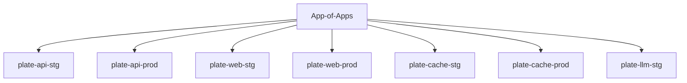
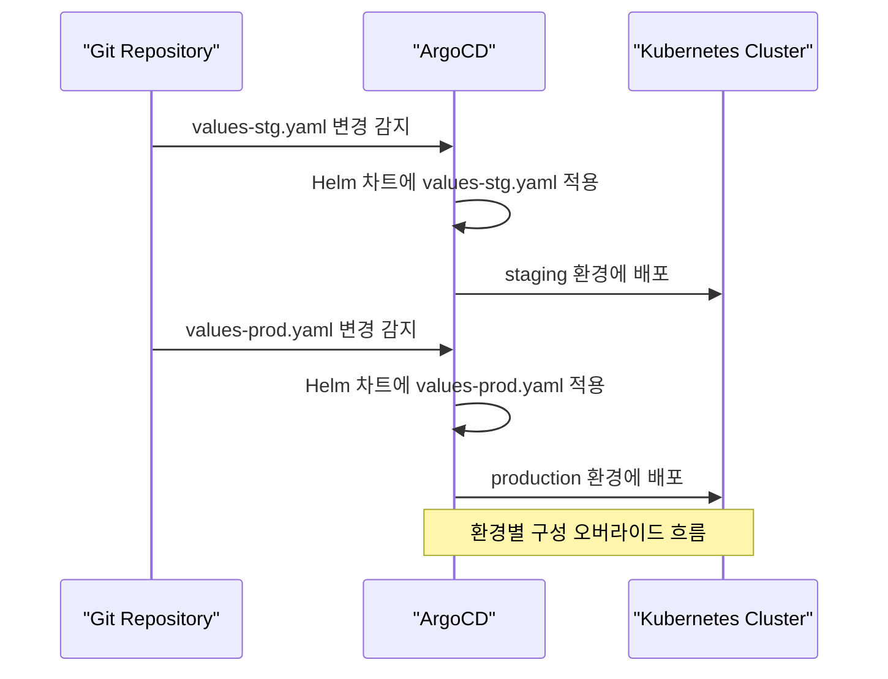
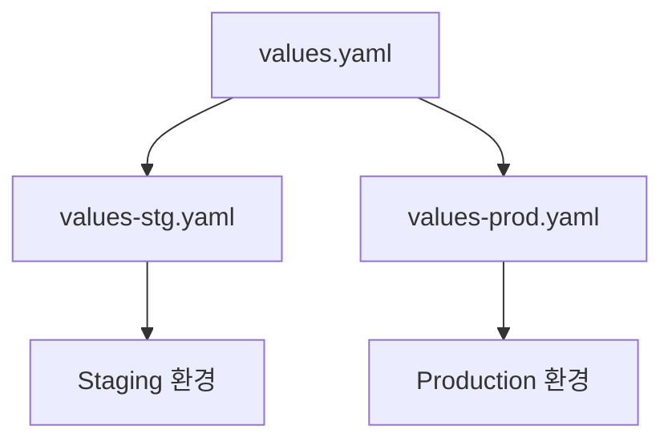
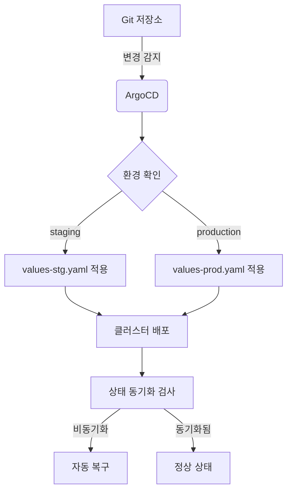

# 구성 관리 방식

<cite>
**이 문서에서 참조한 파일**  
- [app-of-apps.yaml](file://environments/argocd/app-of-apps.yaml)
- [plate-api-stg.yaml](file://environments/argocd/apps/plate-api-stg.yaml)
- [plate-api-prod.yaml](file://environments/argocd/apps/plate-api-prod.yaml)
- [plate-web-stg.yaml](file://environments/argocd/apps/plate-web-stg.yaml)
- [plate-web-prod.yaml](file://environments/argocd/apps/plate-web-prod.yaml)
- [values.yaml](file://helm/applications/plate-api/values.yaml)
- [values-stg.yaml](file://helm/applications/plate-api/values-stg.yaml)
- [values-prod.yaml](file://helm/applications/plate-api/values-prod.yaml)
- [values.yaml](file://helm/applications/plate-web/values.yaml)
- [values-stg.yaml](file://helm/applications/plate-web/values-stg.yaml)
- [values-prod.yaml](file://helm/applications/plate-web/values-prod.yaml)
- [values.yaml](file://helm/applications/plate-cache/values.yaml)
- [values-stg.yaml](file://helm/applications/plate-cache/values-stg.yaml)
- [values-prod.yaml](file://helm/applications/plate-cache/values-prod.yaml)
- [values.yaml](file://helm/shared-configs/openbao-secrets-manager/values.yaml)
- [values-staging.yaml](file://helm/shared-configs/openbao-secrets-manager/values-staging.yaml)
- [values-production.yaml](file://helm/shared-configs/openbao-secrets-manager/values-production.yaml)
</cite>

## 목차
1. [소개](#소개)
2. [App-of-Apps 패턴](#app-of-apps-패턴)
3. [환경별 구성 오버라이드 전략](#환경별-구성-오버라이드-전략)
4. [Helm Values의 계층적 구조](#helm-values의-계층적-구조)
5. [구성 일관성 유지 방안](#구성-일관성-유지-방안)
6. [환경 간 구성 차이 관리 모범 사례](#환경-간-구성-차이-관리-모범-사례)
7. [결론](#결론)

## 소개
본 문서는 GitOps 기반의 구성 관리 전략을 설명합니다. ArgoCD의 App-of-Apps 패턴, 환경별 values 파일을 통한 구성 오버라이드 전략, Helm values의 계층적 구조를 분석하고, 구성의 일관성을 유지하며 환경 간 차이를 효과적으로 관리하는 방법을 제시합니다. 실제 코드 예제를 통해 구성 관리의 동작 방식을 설명합니다.

## App-of-Apps 패턴

App-of-Apps 패턴은 ArgoCD를 사용하여 여러 애플리케이션을 중앙에서 관리하는 전략입니다. 이 패턴을 통해 전체 플랫폼의 구성 상태를 단일 진입점에서 관리할 수 있습니다.

**다이어그램 출처**  
- [app-of-apps.yaml](file://environments/argocd/app-of-apps.yaml#L1-L35)

**섹션 출처**  
- [app-of-apps.yaml](file://environments/argocd/app-of-apps.yaml#L1-L35)

## 환경별 구성 오버라이드 전략

환경별 구성 오버라이드는 `values-stg.yaml`, `values-prod.yaml`과 같은 환경 전용 values 파일을 사용하여 구현됩니다. 각 환경의 ArgoCD Application 리소스는 해당 환경의 values 파일을 명시적으로 참조합니다.

예를 들어, `plate-api-stg.yaml`은 `values-stg.yaml`을, `plate-api-prod.yaml`은 `values-prod.yaml`을 사용합니다.

**다이어그램 출처**  
- [plate-api-stg.yaml](file://environments/argocd/apps/plate-api-stg.yaml#L1-L62)
- [plate-api-prod.yaml](file://environments/argocd/apps/plate-api-prod.yaml#L1-L62)

**섹션 출처**  
- [plate-api-stg.yaml](file://environments/argocd/apps/plate-api-stg.yaml#L1-L62)
- [plate-api-prod.yaml](file://environments/argocd/apps/plate-api-prod.yaml#L1-L62)
- [plate-web-stg.yaml](file://environments/argocd/apps/plate-web-stg.yaml#L1-L62)
- [plate-web-prod.yaml](file://environments/argocd/apps/plate-web-prod.yaml#L1-L62)

## Helm Values의 계층적 구조

Helm values는 계층적 구조를 통해 기본값과 환경별 오버라이드를 관리합니다. 각 애플리케이션은 `values.yaml`에 기본 설정을 두고, `values-stg.yaml`, `values-prod.yaml`에서 환경별로 필요한 항목만 오버라이드합니다.

예를 들어, `plate-api` 차트의 경우:
- `values.yaml`: 기본 replicaCount, image tag, 리소스 요청 등
- `values-stg.yaml`: replicaCount 1로 감소, pullPolicy를 Always로 설정
- `values-prod.yaml`: production 전용 이미지 태그 및 보수적인 리소스 설정

**다이어그램 출처**  
- [values.yaml](file://helm/applications/plate-api/values.yaml#L1-L116)
- [values-stg.yaml](file://helm/applications/plate-api/values-stg.yaml#L1-L30)
- [values-prod.yaml](file://helm/applications/plate-api/values-prod.yaml#L1-L31)

**섹션 출처**  
- [values.yaml](file://helm/applications/plate-api/values.yaml#L1-L116)
- [values-stg.yaml](file://helm/applications/plate-api/values-stg.yaml#L1-L30)
- [values-prod.yaml](file://helm/applications/plate-api/values-prod.yaml#L1-L31)
- [values.yaml](file://helm/applications/plate-web/values.yaml#L1-L73)
- [values-stg.yaml](file://helm/applications/plate-web/values-stg.yaml#L1-L38)
- [values-prod.yaml](file://helm/applications/plate-web/values-prod.yaml#L1-L39)

## 구성 일관성 유지 방안

구성 일관성을 유지하기 위해 다음과 같은 전략을 사용합니다:

1. **중앙화된 비밀 관리**: OpenBao를 사용하여 비밀 정보를 중앙에서 관리하고, `openbao-secrets-manager` 차트를 통해 각 환경에 동기화합니다.
2. **공통 values 파일**: 공통 설정은 `values.yaml`에 두고, 환경별로만 차이가 나는 설정만 오버라이드합니다.
3. **자동화된 동기화 정책**: ArgoCD의 `selfHeal: true` 설정을 통해 클러스터 상태가 Git과 다를 경우 자동으로 복구합니다.

**다이어그램 출처**  
- [app-of-apps.yaml](file://environments/argocd/app-of-apps.yaml#L1-L35)
- [values-staging.yaml](file://helm/shared-configs/openbao-secrets-manager/values-staging.yaml#L1-L164)
- [values-production.yaml](file://helm/shared-configs/openbao-secrets-manager/values-production.yaml#L1-L195)

**섹션 출처**  
- [app-of-apps.yaml](file://environments/argocd/app-of-apps.yaml#L1-L35)
- [values-staging.yaml](file://helm/shared-configs/openbao-secrets-manager/values-staging.yaml#L1-L164)
- [values-production.yaml](file://helm/shared-configs/openbao-secrets-manager/values-production.yaml#L1-L195)

## 환경 간 구성 차이 관리 모범 사례

환경 간 구성 차이를 효과적으로 관리하기 위한 모범 사례는 다음과 같습니다:

1. **명확한 오버라이드 전략**: 기본값은 `values.yaml`에 두고, 환경별로만 필요한 설정만 `values-{env}.yaml`에 정의합니다.
2. **리소스 차이 관리**: staging은 개발 편의를 위해 리소스를 적게, production은 안정성을 위해 충분한 리소스를 할당합니다.
3. **이미지 태그 관리**: staging은 `latest` 태그로 최신 빌드를 사용하고, production은 고정된 버전 태그를 사용합니다.
4. **보안 설정 차이**: production 환경에는 추가적인 보안 컨텍스트와 노드 선택기, 허용 정책을 적용합니다.

예시로 `plate-cache`의 PVC 설정을 살펴보면:
- staging: 30Gi, `openebs-hostpath` 스토리지 클래스
- production: 50Gi, `openebs-hostpath` 스토리지 클래스

이러한 차이는 `values-stg.yaml`과 `values-prod.yaml`에서 각각 정의됩니다.

**섹션 출처**  
- [values.yaml](file://helm/applications/plate-cache/values.yaml#L1-L14)
- [values-stg.yaml](file://helm/applications/plate-cache/values-stg.yaml#L1-L12)
- [values-prod.yaml](file://helm/applications/plate-cache/values-prod.yaml#L1-L12)
- [values-staging.yaml](file://helm/shared-configs/openbao-secrets-manager/values-staging.yaml#L1-L164)
- [values-production.yaml](file://helm/shared-configs/openbao-secrets-manager/values-production.yaml#L1-L195)

## 결론

본 문서는 GitOps 기반의 구성 관리 전략을 상세히 설명하였습니다. App-of-Apps 패턴을 통해 전체 애플리케이션을 중앙에서 관리하고, 환경별 values 파일을 통해 구성 오버라이드를 구현하며, Helm values의 계층적 구조를 활용하여 구성 일관성을 유지하는 방법을 제시하였습니다. 이러한 전략을 통해 다양한 환경에서 안정적이고 일관된 배포를 보장할 수 있습니다.