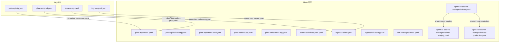
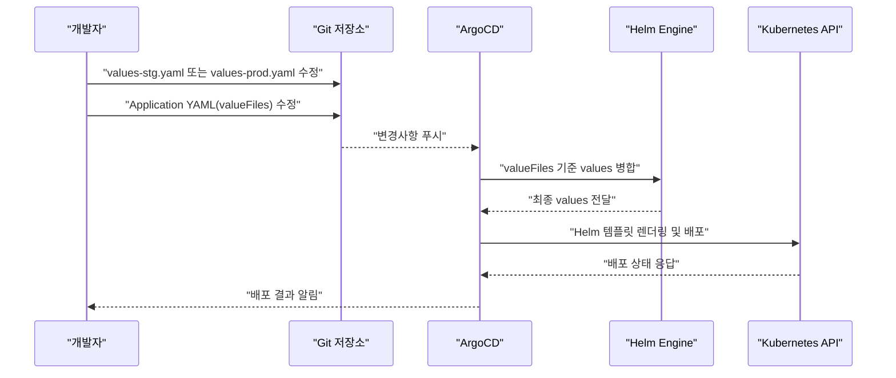
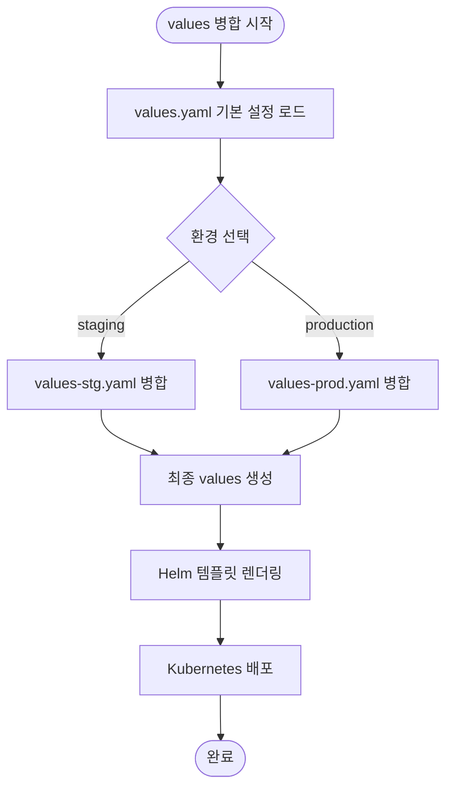
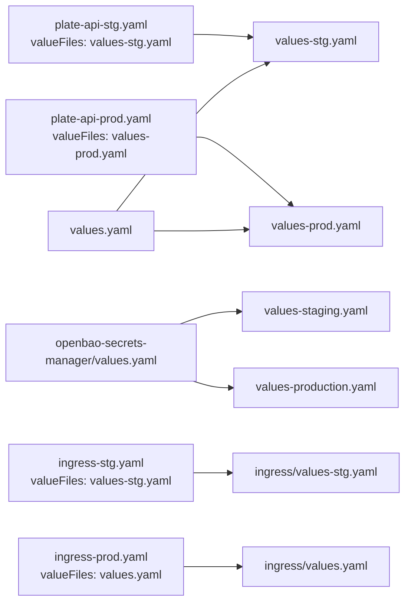

# 구성 계층 구조

<cite>
**문서에서 다루는 파일 목록**
- [values.yaml](file://helm/applications/plate-server/values.yaml)
- [values-stg.yaml](file://helm/applications/plate-server/values-stg.yaml)
- [values-prod.yaml](file://helm/applications/plate-server/values-prod.yaml)
- [plate-api-stg.yaml](file://environments/argocd/apps/plate-api-stg.yaml)
- [plate-api-prod.yaml](file://environments/argocd/apps/plate-api-prod.yaml)
- [values.yaml](file://helm/applications/plate-web/values.yaml)
- [values-stg.yaml](file://helm/applications/plate-web/values-stg.yaml)
- [values-prod.yaml](file://helm/applications/plate-web/values-prod.yaml)
- [values.yaml](file://helm/cluster-services/cert-manager/values.yaml)
- [ingress-stg.yaml](file://environments/argocd/apps/ingress-stg.yaml)
- [ingress-prod.yaml](file://environments/argocd/apps/ingress-prod.yaml)
- [values.yaml](file://helm/shared-configs/openbao-secrets-manager/values.yaml)
- [values-staging.yaml](file://helm/shared-configs/openbao-secrets-manager/values-staging.yaml)
- [values-production.yaml](file://helm/shared-configs/openbao-secrets-manager/values-production.yaml)
</cite>

## 목차
1. [소개](#소개)
2. [프로젝트 구조](#프로젝트-구조)
3. [핵심 구성 요소](#핵심-구성-요소)
4. [아키텍처 개요](#아키텍처-개요)
5. [상세 구성 분석](#상세-구성-분석)
6. [의존성 분석](#의존성-분석)
7. [성능 고려사항](#성능-고려사항)
8. [장애 진단 가이드](#장애-진단-가이드)
9. [결론](#결론)
10. [부록](#부록)

## 소개
본 문서는 Helm 차트 기반의 계층적 구성 관리 구조를 중심으로 설명합니다. 기본 values.yaml 파일이 공통 설정을 정의하고, values-stg.yaml 및 values-prod.yaml과 같은 환경별 오버라이드 파일이 각 환경에 특화된 설정을 제공하는 방식을 상세히 기술합니다. 또한 ArgoCD의 valueFiles 메커니즘을 통해 이러한 구성 파일들이 어떤 우선순위를 가지며 적용되는지를 분석하고, 실제 plate-api, ingress, cert-manager, openbao-secrets-manager 차트 예제를 통해 구체적인 상속 및 오버라이드 동작을 검토합니다. 마지막으로 구성의 일관성 유지와 환경 간 설정 차이 관리를 위한 모범 사례를 제시합니다.

## 프로젝트 구조
- Helm 차트는 helm/applications 하위에 위치하며, 각 애플리케이션 별로 values.yaml, values-stg.yaml, values-prod.yaml이 존재합니다.
- 클러스터 서비스 차트는 helm/cluster-services 하위에 위치하며, cert-manager는 values.yaml 하나만 존재합니다.
- 인그레스는 별도의 helm/ingress 차트를 통해 관리되며, ArgoCD Application에서 valueFiles를 통해 환경별 설정을 적용합니다.
- 공유 구성 차트 openbao-secrets-manager는 values.yaml, values-staging.yaml, values-production.yaml로 환경별 오버라이드를 제공합니다.
- ArgoCD Application은 environments/argocd/apps 아래에 각 환경별 YAML로 정의되어 있으며, valueFiles를 통해 차트 루트 기준 상대 경로의 values 파일을 적용합니다.

**도표 출처**
- [plate-api-stg.yaml](file://environments/argocd/apps/plate-api-stg.yaml#L18-L25)
- [plate-api-prod.yaml](file://environments/argocd/apps/plate-api-prod.yaml#L18-L25)
- [ingress-stg.yaml](file://environments/argocd/apps/ingress-stg.yaml#L23-L27)
- [ingress-prod.yaml](file://environments/argocd/apps/ingress-prod.yaml#L23-L27)
- [values.yaml](file://helm/applications/plate-server/values.yaml#L1-L85)
- [values-stg.yaml](file://helm/applications/plate-server/values-stg.yaml#L1-L19)
- [values-prod.yaml](file://helm/applications/plate-server/values-prod.yaml#L1-L22)
- [values.yaml](file://helm/applications/plate-web/values.yaml#L1-L30)
- [values-stg.yaml](file://helm/applications/plate-web/values-stg.yaml#L1-L23)
- [values-prod.yaml](file://helm/applications/plate-web/values-prod.yaml#L1-L39)
- [values.yaml](file://helm/cluster-services/cert-manager/values.yaml#L1-L35)
- [values.yaml](file://helm/shared-configs/openbao-secrets-manager/values.yaml#L1-L233)
- [values-staging.yaml](file://helm/shared-configs/openbao-secrets-manager/values-staging.yaml#L1-L167)
- [values-production.yaml](file://helm/shared-configs/openbao-secrets-manager/values-production.yaml#L1-L196)

**섹션 출처**
- [plate-api-stg.yaml](file://environments/argocd/apps/plate-api-stg.yaml#L18-L25)
- [plate-api-prod.yaml](file://environments/argocd/apps/plate-api-prod.yaml#L18-L25)
- [ingress-stg.yaml](file://environments/argocd/apps/ingress-stg.yaml#L23-L27)
- [ingress-prod.yaml](file://environments/argocd/apps/ingress-prod.yaml#L23-L27)

## 핵심 구성 요소
- 공통 설정(values.yaml): 모든 환경에 적용되는 기본값을 정의합니다. 예를 들어, 리소스 요청/제한, 이미지 정보, 서비스 타입 등이 포함됩니다.
- 환경별 오버라이드(values-stg.yaml, values-prod.yaml): 공통 설정을 덮어쓰는 환경 특화 설정입니다. 예를 들어, pullPolicy, replicaCount, 리소스 요청/제한, 특정 변수들만 다르게 적용됩니다.
- ArgoCD valueFiles: Application YAML에서 차트 루트 기준 상대 경로로 환경별 values 파일을 지정하여 적용합니다. 이로 인해 values-stg.yaml 또는 values-prod.yaml이 values.yaml보다 높은 우선순위를 가지게 됩니다.
- 공유 구성(openbao-secrets-manager): 여러 환경에 걸쳐 동일한 구조를 가지되, 환경별로 다른 OpenBao 경로나 리소스 제약, 보안 설정 등을 적용합니다.

**섹션 출처**
- [values.yaml](file://helm/applications/plate-server/values.yaml#L1-L85)
- [values-stg.yaml](file://helm/applications/plate-server/values-stg.yaml#L1-L19)
- [values-prod.yaml](file://helm/applications/plate-server/values-prod.yaml#L1-L22)
- [values.yaml](file://helm/applications/plate-web/values.yaml#L1-L30)
- [values-stg.yaml](file://helm/applications/plate-web/values-stg.yaml#L1-L23)
- [values-prod.yaml](file://helm/applications/plate-web/values-prod.yaml#L1-L39)
- [values.yaml](file://helm/shared-configs/openbao-secrets-manager/values.yaml#L1-L233)
- [values-staging.yaml](file://helm/shared-configs/openbao-secrets-manager/values-staging.yaml#L1-L167)
- [values-production.yaml](file://helm/shared-configs/openbao-secrets-manager/values-production.yaml#L1-L196)

## 아키텍처 개요
Helm 차트의 구성 계층은 다음과 같은 우선순위를 따릅니다:
1) 공통 values.yaml
2) 환경별 values-stg.yaml 또는 values-prod.yaml
3) ArgoCD Application의 valueFiles에 명시된 파일 순서

이 순서에 따라 값이 병합되며, 나중에 명시된 값이 이전 값을 덮어씁니다. 이를 통해 공통 설정을 한 번만 정의하고, 환경별 차이만 오버라이드하여 일관성을 유지할 수 있습니다.

**도표 출처**
- [plate-api-stg.yaml](file://environments/argocd/apps/plate-api-stg.yaml#L18-L25)
- [plate-api-prod.yaml](file://environments/argocd/apps/plate-api-prod.yaml#L18-L25)
- [ingress-stg.yaml](file://environments/argocd/apps/ingress-stg.yaml#L23-L27)
- [ingress-prod.yaml](file://environments/argocd/apps/ingress-prod.yaml#L23-L27)

## 상세 구성 분석

### plate-api 차트: 공통 설정과 환경별 오버라이드
- 공통 설정(values.yaml): 기본 replicaCount, 이미지 정보, 리소스 요청/제한, 서비스 타입, Secret 주입 설정(appSecrets) 등을 정의합니다.
- 스테이징(values-stg.yaml): pullPolicy를 Always로 변경하고 일부 리소스 요청/제한을 조정합니다.
- 프로덕션(values-prod.yaml): pullPolicy를 IfNotPresent로 변경하고, 서비스 관련 설정이 추가됩니다.

**도표 출처**
- [values.yaml](file://helm/applications/plate-server/values.yaml#L1-L85)
- [values-stg.yaml](file://helm/applications/plate-server/values-stg.yaml#L1-L19)
- [values-prod.yaml](file://helm/applications/plate-server/values-prod.yaml#L1-L22)

**섹션 출처**
- [values.yaml](file://helm/applications/plate-server/values.yaml#L1-L85)
- [values-stg.yaml](file://helm/applications/plate-server/values-stg.yaml#L1-L19)
- [values-prod.yaml](file://helm/applications/plate-server/values-prod.yaml#L1-L22)
- [plate-api-stg.yaml](file://environments/argocd/apps/plate-api-stg.yaml#L18-L25)
- [plate-api-prod.yaml](file://environments/argocd/apps/plate-api-prod.yaml#L18-L25)

### plate-web 차트: 공통 설정과 환경별 오버라이드
- 공통 설정(values.yaml): nginx 이미지, 서비스 타입, 리소스 요청/제한 등을 정의합니다.
- 스테이징(values-stg.yaml): pullPolicy를 Always로 변경하고, ingress.enabled를 false로 설정하여 통합 템플릿에서 관리하도록 합니다.
- 프로덕션(values-prod.yaml): nginx 버전을 고정하고, backend 이미지를 busybox로 변경하여 프로덕션용 백엔드를 정의합니다.

**섹션 출처**
- [values.yaml](file://helm/applications/plate-web/values.yaml#L1-L30)
- [values-stg.yaml](file://helm/applications/plate-web/values-stg.yaml#L1-L23)
- [values-prod.yaml](file://helm/applications/plate-web/values-prod.yaml#L1-L39)

### 인그레스 차트: 환경별 valueFiles 적용
- 스테이징(ingress-stg.yaml): valueFiles에 values-stg.yaml을 지정하고, parameters를 통해 appName을 지정합니다.
- 프로덕션(ingress-prod.yaml): valueFiles에 values.yaml을 지정하고, ignoreDifferences를 통해 annotations 변경을 무시하도록 설정합니다.

**섹션 출처**
- [ingress-stg.yaml](file://environments/argocd/apps/ingress-stg.yaml#L23-L27)
- [ingress-prod.yaml](file://environments/argocd/apps/ingress-prod.yaml#L23-L27)
- [ingress-prod.yaml](file://environments/argocd/apps/ingress-prod.yaml#L63-L68)

### cert-manager 차트: 공통 설정
- cert-manager/values.yaml에는 production/staging ClusterIssuer 설정이 포함되어 있습니다. 이는 별도의 환경별 values 파일 없이 공통 설정으로 사용됩니다.

**섹션 출처**
- [values.yaml](file://helm/cluster-services/cert-manager/values.yaml#L1-L35)

### openbao-secrets-manager 차트: 환경별 오버라이드
- 공통(values.yaml): global.namespaces, OpenBao 서버 정보, ExternalSecrets 기본 설정, 리소스 및 보안 설정 등을 정의합니다.
- 스테이징(values-staging.yaml): global.namespaces를 staging 전용으로 제한하고, SecretStore 이름, ExternalSecret 이름, refreshInterval, OpenBao remoteRef 경로를 staging으로 변경합니다.
- 프로덕션(values-production.yaml): global.namespaces를 production 전용으로 제한하고, 보다 강화된 securityContext, nodeSelector, tolerations, affinity, OpenBao remoteRef 경로를 production으로 변경합니다.

**섹션 출처**
- [values.yaml](file://helm/shared-configs/openbao-secrets-manager/values.yaml#L1-L233)
- [values-staging.yaml](file://helm/shared-configs/openbao-secrets-manager/values-staging.yaml#L1-L167)
- [values-production.yaml](file://helm/shared-configs/openbao-secrets-manager/values-production.yaml#L1-L196)

## 의존성 분석
- ArgoCD Application → Helm 차트 values 병합: Application YAML의 valueFiles에 명시된 파일 순서대로 병합되며, 나중에 명시된 값이 덮어씁니다.
- 공유 구성 차트(openbao-secrets-manager) → OpenBao 원격 저장소: 환경별 remoteRef 경로를 통해 서로 다른 시크릿 데이터를 동적으로 가져옵니다.
- 인그레스 차트 → plate-web/plate-api: 인그레스 설정이 두 애플리케이션을 함께 라우팅하도록 통합됩니다.

**도표 출처**
- [plate-api-stg.yaml](file://environments/argocd/apps/plate-api-stg.yaml#L18-L25)
- [plate-api-prod.yaml](file://environments/argocd/apps/plate-api-prod.yaml#L18-L25)
- [values-stg.yaml](file://helm/applications/plate-server/values-stg.yaml#L1-L19)
- [values-prod.yaml](file://helm/applications/plate-server/values-prod.yaml#L1-L22)
- [values.yaml](file://helm/applications/plate-server/values.yaml#L1-L85)
- [values-staging.yaml](file://helm/shared-configs/openbao-secrets-manager/values-staging.yaml#L1-L167)
- [values-production.yaml](file://helm/shared-configs/openbao-secrets-manager/values-production.yaml#L1-L196)
- [values.yaml](file://helm/shared-configs/openbao-secrets-manager/values.yaml#L1-L233)
- [ingress-stg.yaml](file://environments/argocd/apps/ingress-stg.yaml#L23-L27)
- [ingress-prod.yaml](file://environments/argocd/apps/ingress-prod.yaml#L23-L27)

**섹션 출처**
- [plate-api-stg.yaml](file://environments/argocd/apps/plate-api-stg.yaml#L18-L25)
- [plate-api-prod.yaml](file://environments/argocd/apps/plate-api-prod.yaml#L18-L25)
- [ingress-stg.yaml](file://environments/argocd/apps/ingress-stg.yaml#L23-L27)
- [ingress-prod.yaml](file://environments/argocd/apps/ingress-prod.yaml#L23-L27)

## 성능 고려사항
- valueFiles 순서: valueFiles에 명시된 순서대로 병합되므로, 자주 변경되는 환경별 파일을 뒤에 두면 덮어씌움이 명확해지고, 실수를 줄일 수 있습니다.
- 리소스 요청/제한: 프로덕션에서는 안정성을 위해 CPU/메모리 요청/제한을 명확히 설정하고, 스테이징에서는 유연성을 위해 더 낮은 제한을 사용하는 것이 일반적입니다.
- 이미지 풀 정책: 스테이징에서는 Always, 프로덕션에서는 IfNotPresent로 설정하여 빌드 속도와 안정성을 균형 있게 조절합니다.
- 인그레스 annotations 무시: 프로덕션에서는 annotations 변경을 무시하도록 설정하여 클러스터가 자동으로 추가하는 annotation에 의해 불필요한 리소스 변경이 발생하지 않도록 합니다.

[이 섹션은 일반적인 성능 팁을 제공하므로 구체적인 파일 분석 없음]

## 장애 진단 가이드
- ArgoCD 동기화 실패: Application YAML의 retry 설정을 확인하고, syncOptions 중 ApplyOutOfSyncOnly를 통해 변경된 리소스만 적용되도록 합니다.
- valueFiles 적용 순서 오류: valueFiles에 지정된 파일 순서를 점검하고, 환경별 values 파일이 공통 values보다 뒤에 오도록 배치합니다.
- 인그레스 annotations 변경: 프로덕션에서는 ignoreDifferences를 통해 annotations 변경을 무시하도록 설정했는지 확인합니다.
- openbao-secrets-manager: 환경별 remoteRef 경로가 올바른지 확인하고, refreshInterval 설정이 적절한지 검토합니다.

**섹션 출처**
- [plate-api-stg.yaml](file://environments/argocd/apps/plate-api-stg.yaml#L33-L50)
- [plate-api-prod.yaml](file://environments/argocd/apps/plate-api-prod.yaml#L33-L50)
- [ingress-prod.yaml](file://environments/argocd/apps/ingress-prod.yaml#L63-L68)
- [values-staging.yaml](file://helm/shared-configs/openbao-secrets-manager/values-staging.yaml#L1-L167)
- [values-production.yaml](file://helm/shared-configs/openbao-secrets-manager/values-production.yaml#L1-L196)

## 결론
Helm 차트 기반의 계층적 구성 관리는 공통 설정(values.yaml)과 환경별 오버라이드(values-stg.yaml, values-prod.yaml)를 통해 일관성과 유연성을 동시에 달성합니다. ArgoCD의 valueFiles 메커니즘을 통해 이러한 파일들이 명확한 우선순위를 가지며 병합되고, 실제 plate-api, plate-web, ingress, cert-manager, openbao-secrets-manager 차트 예제를 통해 구체적인 상속 및 오버라이드 동작을 검토했습니다. 구성 일관성 유지와 환경 간 차이 관리를 위해서는 valueFiles 순서, 리소스 제약, 이미지 풀 정책, 시크릿 관리 전략 등을 체계적으로 관리해야 합니다.

[이 섹션은 요약이므로 구체적인 파일 분석 없음]

## 부록
- 모범 사례
  - 공통 설정은 values.yaml에만 정의하고, 환경별 차이는 values-stg.yaml 또는 values-prod.yaml에만 작성합니다.
  - valueFiles 순서를 명확히 하고, 자주 변경되는 환경별 파일을 뒤에 배치합니다.
  - 프로덕션에서는 리소스 요청/제한, 보안 설정, 이미지 풀 정책을 명확히 하고, 스테이징에서는 유연성을 위해 더 낮은 제한과 Always 풀 정책을 사용합니다.
  - 시크릿 관리는 openbao-secrets-manager를 통해 원격 저장소에서 동적으로 가져오고, 환경별 remoteRef 경로를 분리합니다.
  - 인그레스는 통합 템플릿에서 관리하고, 프로덕션에서는 annotations 변경을 무시하도록 설정합니다.

[이 섹션은 일반적인 모범 사례를 제공하므로 구체적인 파일 분석 없음]