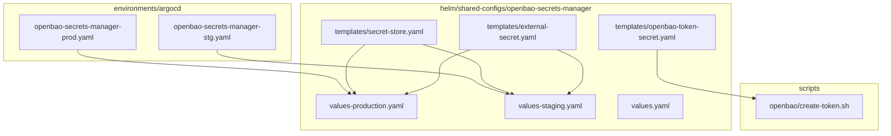
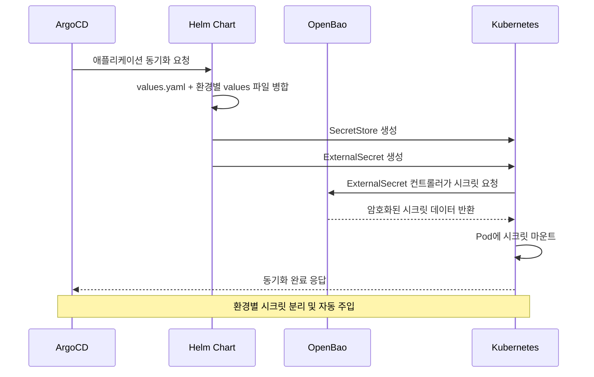
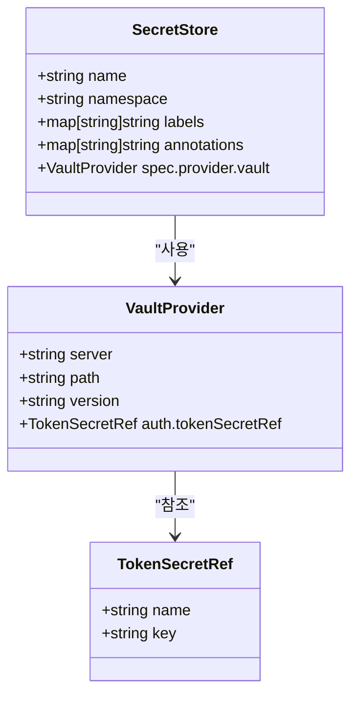
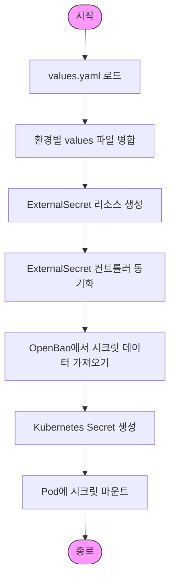
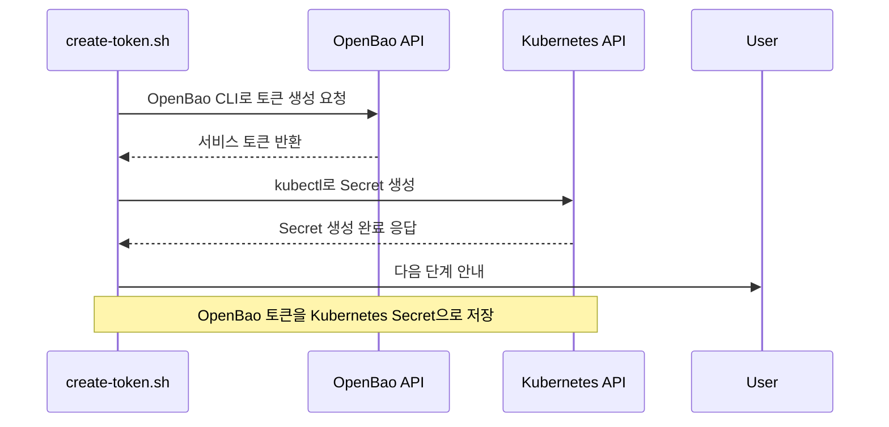
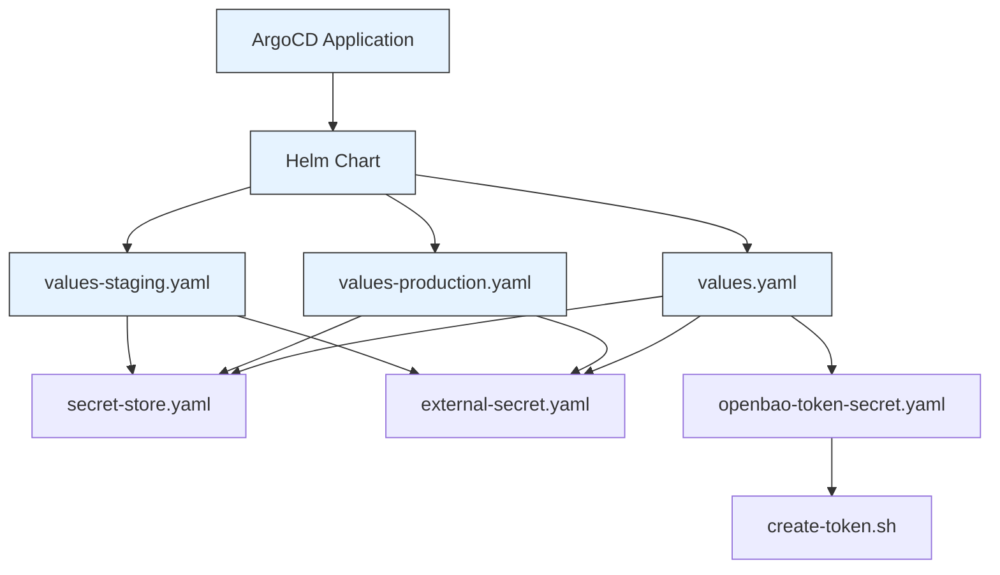
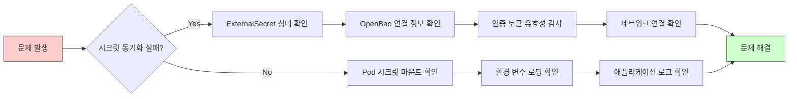

# 민감 정보 관리

<cite>
**이 문서에서 참조된 파일**   
- [secret-store.yaml](file://helm/shared-configs/openbao-secrets-manager/templates/secret-store.yaml)
- [openbao-token-secret.yaml](file://helm/shared-configs/openbao-secrets-manager/templates/openbao-token-secret.yaml)
- [values-production.yaml](file://helm/shared-configs/openbao-secrets-manager/values-production.yaml)
- [values-staging.yaml](file://helm/shared-configs/openbao-secrets-manager/values-staging.yaml)
- [external-secret.yaml](file://helm/shared-configs/openbao-secrets-manager/templates/external-secret.yaml)
- [openbao-secrets-manager-prod.yaml](file://environments/argocd/apps/openbao-secrets-manager-prod.yaml)
- [openbao-secrets-manager-stg.yaml](file://environments/argocd/apps/openbao-secrets-manager-stg.yaml)
- [create-token.sh](file://scripts/openbao/create-token.sh)
</cite>

## 목차
1. [소개](#소개)
2. [프로젝트 구조](#프로젝트-구조)
3. [핵심 구성 요소](#핵심-구성-요소)
4. [아키텍처 개요](#아키텍처-개요)
5. [상세 구성 요소 분석](#상세-구성-요소-분석)
6. [의존성 분석](#의존성-분석)
7. [성능 고려사항](#성능-고려사항)
8. [문제 해결 가이드](#문제-해결-가이드)
9. [결론](#결론)

## 소개
이 문서는 OpenBao 시크릿 매니저를 활용한 민감 정보 관리 전략을 설명합니다. secret-store.yaml을 통한 외부 시크릿 저장소 정의, openbao-token-secret.yaml을 통한 인증 토큰 관리, 그리고 values-production.yaml과 values-staging.yaml에서의 환경별 시크릿 참조 방식을 상세히 기술합니다. 민감 정보가 values 파일에 직접 노출되지 않도록 하는 외부 시크릿 주입 메커니즘, OpenBao와의 통합을 위한 인증 및 권한 부여 절차, 그리고 시크릿 접근에 대한 보안 감사를 위한 로깅 및 모니터링 방법을 포함합니다. 실제 구현 예시를 통해 안전한 구성 관리 프로세스를 설명합니다.

## 프로젝트 구조

**다이어그램 출처**
- [openbao-secrets-manager-prod.yaml](file://environments/argocd/apps/openbao-secrets-manager-prod.yaml#L1-L80)
- [openbao-secrets-manager-stg.yaml](file://environments/argocd/apps/openbao-secrets-manager-stg.yaml#L1-L78)
- [secret-store.yaml](file://helm/shared-configs/openbao-secrets-manager/templates/secret-store.yaml#L1-L29)
- [external-secret.yaml](file://helm/shared-configs/openbao-secrets-manager/templates/external-secret.yaml#L1-L49)
- [values-production.yaml](file://helm/shared-configs/openbao-secrets-manager/values-production.yaml#L1-L196)
- [values-staging.yaml](file://helm/shared-configs/openbao-secrets-manager/values-staging.yaml#L1-L167)

**섹션 출처**
- [helm/shared-configs/openbao-secrets-manager/](file://helm/shared-configs/openbao-secrets-manager/)

## 핵심 구성 요소

OpenBao 기반 민감 정보 관리는 외부 시크릿 저장소(External Secret Store), 환경별 시크릿 참조, 인증 토큰 관리의 세 가지 핵심 요소로 구성됩니다. secret-store.yaml은 OpenBao 서버와의 통합을 위한 SecretStore 리소스를 정의하며, values-production.yaml과 values-staging.yaml은 각 환경별로 시크릿 데이터의 매핑 정보를 제공합니다. openbao-token-secret.yaml은 OpenBao에 접근하기 위한 인증 토큰을 관리하며, 이 토큰은 create-token.sh 스크립트를 통해 생성되어 Kubernetes Secret으로 저장됩니다. 이러한 구성은 민감 정보가 구성 파일에 직접 노출되는 것을 방지하고, 중앙 집중식으로 시크릿을 관리할 수 있는 기반을 제공합니다.

**섹션 출처**
- [secret-store.yaml](file://helm/shared-configs/openbao-secrets-manager/templates/secret-store.yaml#L1-L29)
- [openbao-token-secret.yaml](file://helm/shared-configs/openbao-secrets-manager/templates/openbao-token-secret.yaml#L1-L26)
- [values-production.yaml](file://helm/shared-configs/openbao-secrets-manager/values-production.yaml#L1-L196)
- [values-staging.yaml](file://helm/shared-configs/openbao-secrets-manager/values-staging.yaml#L1-L167)

## 아키텍처 개요

**다이어그램 출처**
- [openbao-secrets-manager-prod.yaml](file://environments/argocd/apps/openbao-secrets-manager-prod.yaml#L1-L80)
- [openbao-secrets-manager-stg.yaml](file://environments/argocd/apps/openbao-secrets-manager-stg.yaml#L1-L78)
- [secret-store.yaml](file://helm/shared-configs/openbao-secrets-manager/templates/secret-store.yaml#L1-L29)
- [external-secret.yaml](file://helm/shared-configs/openbao-secrets-manager/templates/external-secret.yaml#L1-L49)

## 상세 구성 요소 분석

### 외부 시크릿 저장소 정의

**다이어그램 출처**
- [secret-store.yaml](file://helm/shared-configs/openbao-secrets-manager/templates/secret-store.yaml#L1-L29)

**섹션 출처**
- [secret-store.yaml](file://helm/shared-configs/openbao-secrets-manager/templates/secret-store.yaml#L1-L29)

### 환경별 시크릿 참조 메커니즘

**다이어그램 출처**
- [values-production.yaml](file://helm/shared-configs/openbao-secrets-manager/values-production.yaml#L1-L196)
- [values-staging.yaml](file://helm/shared-configs/openbao-secrets-manager/values-staging.yaml#L1-L167)
- [external-secret.yaml](file://helm/shared-configs/openbao-secrets-manager/templates/external-secret.yaml#L1-L49)

**섹션 출처**
- [values-production.yaml](file://helm/shared-configs/openbao-secrets-manager/values-production.yaml#L1-L196)
- [values-staging.yaml](file://helm/shared-configs/openbao-secrets-manager/values-staging.yaml#L1-L167)

### 인증 및 권한 부여 절차

**다이어그램 출처**
- [create-token.sh](file://scripts/openbao/create-token.sh#L511-L549)
- [openbao-token-secret.yaml](file://helm/shared-configs/openbao-secrets-manager/templates/openbao-token-secret.yaml#L1-L26)

**섹션 출처**
- [create-token.sh](file://scripts/openbao/create-token.sh#L511-L549)
- [openbao-token-secret.yaml](file://helm/shared-configs/openbao-secrets-manager/templates/openbao-token-secret.yaml#L1-L26)

## 의존성 분석

**다이어그램 출처**
- [openbao-secrets-manager-prod.yaml](file://environments/argocd/apps/openbao-secrets-manager-prod.yaml#L1-L80)
- [openbao-secrets-manager-stg.yaml](file://environments/argocd/apps/openbao-secrets-manager-stg.yaml#L1-L78)
- [values.yaml](file://helm/shared-configs/openbao-secrets-manager/values.yaml#L1-L233)
- [values-production.yaml](file://helm/shared-configs/openbao-secrets-manager/values-production.yaml#L1-L196)
- [values-staging.yaml](file://helm/shared-configs/openbao-secrets-manager/values-staging.yaml#L1-L167)

**섹션 출처**
- [helm/shared-configs/openbao-secrets-manager/](file://helm/shared-configs/openbao-secrets-manager/)

## 성능 고려사항
OpenBao 기반 시크릿 관리는 시크릿 동기화 간격(refreshInterval)을 통해 성능과 보안 간의 균형을 조절할 수 있습니다. 프로덕션 환경에서는 1시간 간격으로 설정하여 시스템 부하를 최소화하고, 스테이징 환경에서는 30분 간격으로 설정하여 빠른 변경 반영이 가능하도록 구성합니다. 리소스 제한(resources)도 환경별로 차등 적용하여 프로덕션 환경에는 더 많은 CPU와 메모리를 할당함으로써 안정적인 운영을 보장합니다.

## 문제 해결 가이드

**다이어그램 출처**
- [external-secret.yaml](file://helm/shared-configs/openbao-secrets-manager/templates/external-secret.yaml#L1-L49)
- [openbao-token-secret.yaml](file://helm/shared-configs/openbao-secrets-manager/templates/openbao-token-secret.yaml#L1-L26)

**섹션 출처**
- [openbao-secrets-manager-prod.yaml](file://environments/argocd/apps/openbao-secrets-manager-prod.yaml#L1-L80)
- [openbao-secrets-manager-stg.yaml](file://environments/argocd/apps/openbao-secrets-manager-stg.yaml#L1-L78)
- [create-token.sh](file://scripts/openbao/create-token.sh#L511-L549)

## 결론
OpenBao를 활용한 민감 정보 관리 전략은 구성 파일에 민감 정보를 직접 포함하지 않음으로써 보안성을 크게 향상시킵니다. 환경별 values 파일을 통해 시크릿 참조 방식을 명확히 구분하고, ArgoCD와의 통합을 통해 선언형 방식으로 시크릿을 관리함으로써 운영의 일관성과 신뢰성을 확보할 수 있습니다. create-token.sh 스크립트를 통한 인증 토큰 관리는 수동 개입을 최소화하면서도 보안 정책을 준수할 수 있는 효율적인 방법입니다. 이와 같은 접근 방식은 민감 정보의 노출 위험을 줄이고, 감사 추적이 용이한 안전한 구성 관리 프로세스를 구현할 수 있도록 합니다.