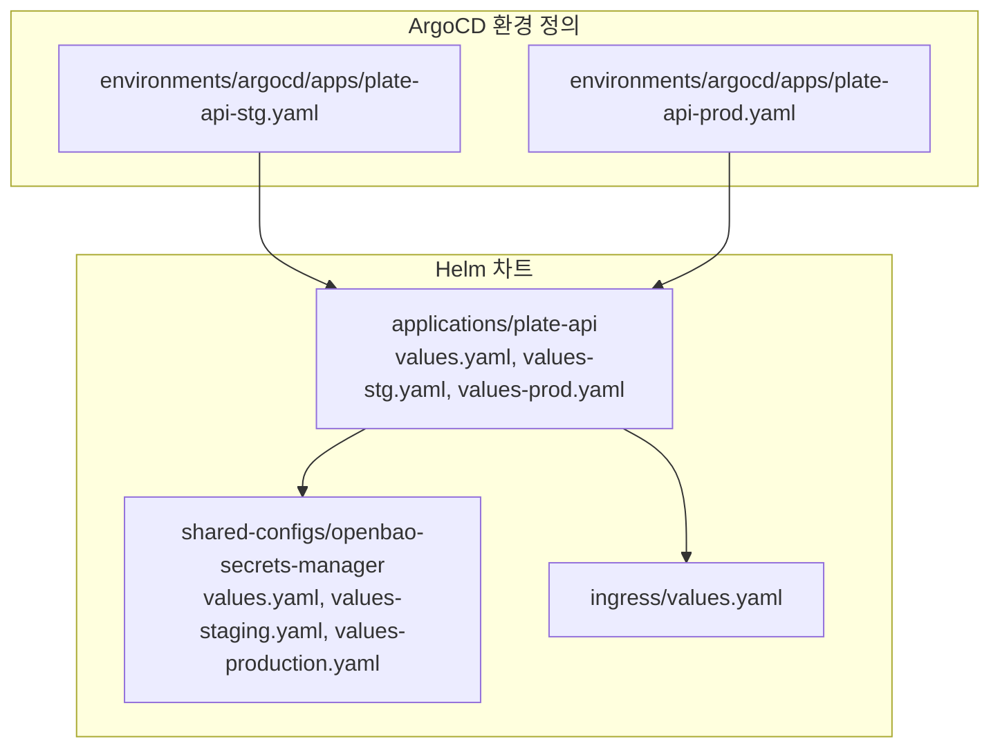
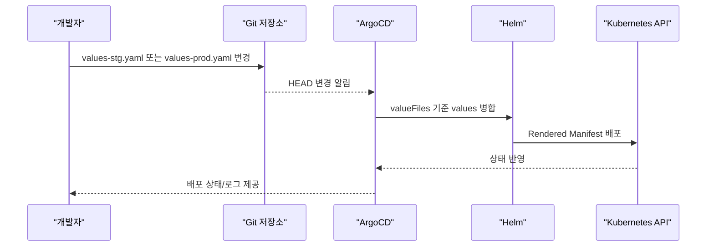
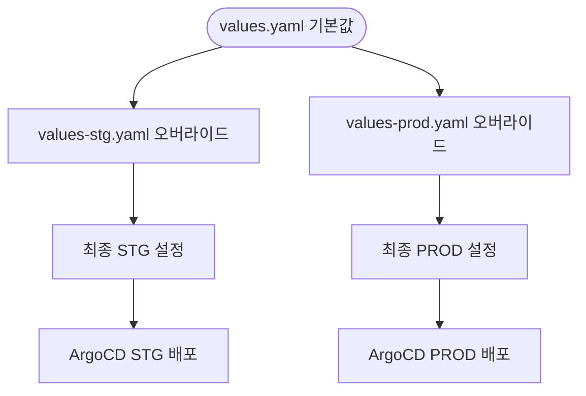
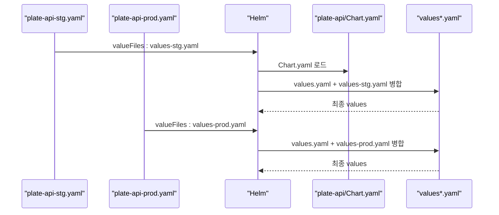
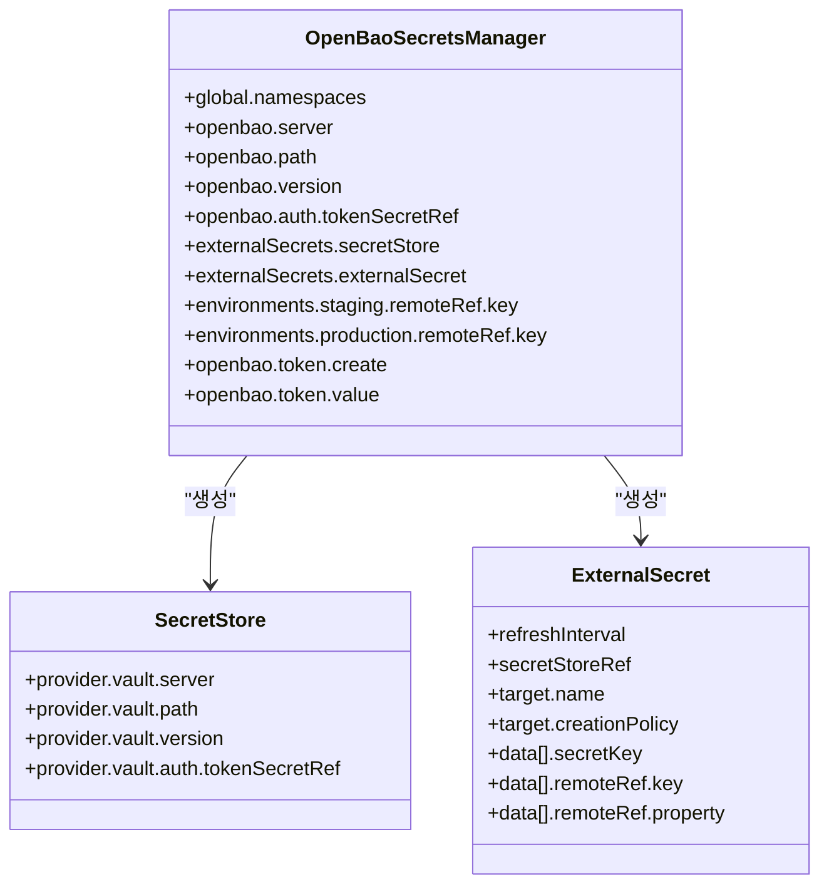
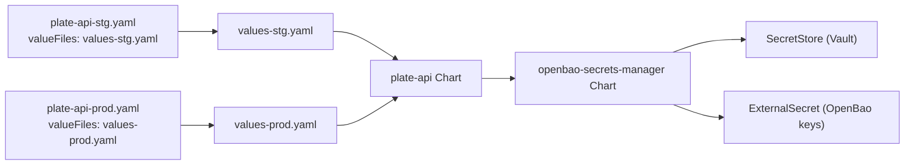

# 환경별 구성 관리

<cite>
**문서에서 참조하는 파일들**
- [values.yaml](file://helm/applications/plate-server/values.yaml)
- [values-stg.yaml](file://helm/applications/plate-server/values-stg.yaml)
- [values-prod.yaml](file://helm/applications/plate-server/values-prod.yaml)
- [Chart.yaml](file://helm/applications/plate-server/Chart.yaml)
- [deployment.yaml](file://helm/applications/plate-server/templates/deployment.yaml)
- [service.yaml](file://helm/applications/plate-server/templates/service.yaml)
- [plate-api-stg.yaml](file://environments/argocd/apps/plate-api-stg.yaml)
- [plate-api-prod.yaml](file://environments/argocd/apps/plate-api-prod.yaml)
- [values.yaml](file://helm/shared-configs/openbao-secrets-manager/values.yaml)
- [values-staging.yaml](file://helm/shared-configs/openbao-secrets-manager/values-staging.yaml)
- [values-production.yaml](file://helm/shared-configs/openbao-secrets-manager/values-production.yaml)
- [Chart.yaml](file://helm/shared-configs/openbao-secrets-manager/Chart.yaml)
- [external-secret.yaml](file://helm/shared-configs/openbao-secrets-manager/templates/external-secret.yaml)
- [secret-store.yaml](file://helm/shared-configs/openbao-secrets-manager/templates/secret-store.yaml)
- [openbao-token-secret.yaml](file://helm/shared-configs/openbao-secrets-manager/templates/openbao-token-secret.yaml)
- [values.yaml](file://helm/ingress/values.yaml)
- [README.md](file://README.md)
</cite>

## 목차
1. [소개](#소개)
2. [프로젝트 구조](#프로젝트-구조)
3. [핵심 구성 요소](#핵심-구성-요소)
4. [아키텍처 개요](#아키텍처-개요)
5. [상세 구성 분석](#상세-구성-분석)
6. [의존성 분석](#의존성-분석)
7. [성능 고려사항](#성능-고려사항)
8. [오류 진단 가이드](#오류-진단-가이드)
9. [결론](#결론)
10. [부록](#부록)

## 소개
본 문서는 Helm 기반의 환경별 구성 관리 전략을 체계적으로 설명합니다. 기본 values.yaml과 환경별 오버라이드 파일(values-stg.yaml, values-prod.yaml)의 계층적 구조를 분석하고, ArgoCD의 valueFiles 기능을 통한 정확한 환경 구성 적용 방식을 설명합니다. 공통 설정과 환경 전용 설정의 분리 원칙, 민감 정보 관리 방법(OpenBao 연동), 구성 오류를 방지하기 위한 검증 절차를 포함합니다. 실제 차트의 values 파일을 예로 들어 구체적인 구성 패턴을 제시합니다.

## 프로젝트 구조
- Helm 차트는 배포 계층별로 구분되어 있습니다.
  - cluster-services: 클러스터 레벨 인프라(예: cert-manager, metallb, nfs-provisioner)
  - development-tools: 개발 및 운영 도구(예: argocd, harbor, prometheus, grafana, openbao)
  - applications: Plate 서비스 애플리케이션(예: plate-web, plate-api, plate-llm, plate-cache)
  - shared-configs: 공유 설정(예: openbao-secrets-manager)
- environments/argocd/apps에는 각 환경별 ArgoCD Application이 정의되어 있으며, valueFiles를 통해 환경별 values를 적용합니다.

**다이어그램 출처**
- [plate-api-stg.yaml](file://environments/argocd/apps/plate-api-stg.yaml#L16-L25)
- [plate-api-prod.yaml](file://environments/argocd/apps/plate-api-prod.yaml#L16-L25)
- [values.yaml](file://helm/applications/plate-server/values.yaml#L1-L116)
- [values-stg.yaml](file://helm/applications/plate-server/values-stg.yaml#L1-L30)
- [values-prod.yaml](file://helm/applications/plate-server/values-prod.yaml#L1-L31)
- [values.yaml](file://helm/shared-configs/openbao-secrets-manager/values.yaml#L1-L230)
- [values-staging.yaml](file://helm/shared-configs/openbao-secrets-manager/values-staging.yaml#L1-L164)
- [values-production.yaml](file://helm/shared-configs/openbao-secrets-manager/values-production.yaml#L1-L195)
- [values.yaml](file://helm/ingress/values.yaml#L1-L15)

**섹션 출처**
- [README.md](file://README.md#L18-L109)

## 핵심 구성 요소
- plate-api Helm 차트
  - 기본 설정: replica 수, 이미지, 리소스, 서비스, 인그레스
  - 환경별 오버라이드: stg/prod 별로 이미지 레지스트리, 서비스 유형, 리소스 요청/제한, 인그레스 여부 등을 다르게 적용
- OpenBao 시크릿 매니저 차트
  - OpenBao 연동, External Secrets Operator 연동, SecretStore/ExternalSecret 자동 생성
  - 환경별 OpenBao 토큰, 시크릿 매핑, 리소스 제약, 노드/어피니티 설정
- ArgoCD Application
  - valueFiles를 통해 차트 루트 기준 상대 경로의 values 파일을 적용
  - destination 네임스페이스에 따라 서로 다른 values가 적용됨

**섹션 출처**
- [values.yaml](file://helm/applications/plate-server/values.yaml#L1-L116)
- [values-stg.yaml](file://helm/applications/plate-server/values-stg.yaml#L1-L30)
- [values-prod.yaml](file://helm/applications/plate-server/values-prod.yaml#L1-L31)
- [values.yaml](file://helm/shared-configs/openbao-secrets-manager/values.yaml#L1-L230)
- [values-staging.yaml](file://helm/shared-configs/openbao-secrets-manager/values-staging.yaml#L1-L164)
- [values-production.yaml](file://helm/shared-configs/openbao-secrets-manager/values-production.yaml#L1-L195)
- [plate-api-stg.yaml](file://environments/argocd/apps/plate-api-stg.yaml#L16-L25)
- [plate-api-prod.yaml](file://environments/argocd/apps/plate-api-prod.yaml#L16-L25)

## 아키텍처 개요
Helm values 계층 구조와 ArgoCD valueFiles 적용 흐름은 다음과 같습니다.

**다이어그램 출처**
- [plate-api-stg.yaml](file://environments/argocd/apps/plate-api-stg.yaml#L16-L25)
- [plate-api-prod.yaml](file://environments/argocd/apps/plate-api-prod.yaml#L16-L25)
- [values.yaml](file://helm/applications/plate-server/values.yaml#L1-L116)
- [values-stg.yaml](file://helm/applications/plate-server/values-stg.yaml#L1-L30)
- [values-prod.yaml](file://helm/applications/plate-server/values-prod.yaml#L1-L31)

## 상세 구성 분석

### 1) 계층적 values 구조 분석
- 기본 values.yaml
  - 공통 설정: replica 수, nginx/백엔드 이미지, 리소스, 서비스, 인그레스
  - 민감 정보: appSecrets.enabled, secretName, envVars 목록
- 환경별 values-stg.yaml
  - nameOverride, replicaCount, 이미지 레지스트리, pullPolicy, 서비스 유형(LoadBalancer), 인그레스 비활성화, 리소스 증설
- 환경별 values-prod.yaml
  - replicaCount, 이미지 레지스트리, 서비스 유형(LoadBalancer), 인그레스 비활성화, 리소스 요청/제한

**다이어그램 출처**
- [values.yaml](file://helm/applications/plate-server/values.yaml#L1-L116)
- [values-stg.yaml](file://helm/applications/plate-server/values-stg.yaml#L1-L30)
- [values-prod.yaml](file://helm/applications/plate-server/values-prod.yaml#L1-L31)
- [plate-api-stg.yaml](file://environments/argocd/apps/plate-api-stg.yaml#L16-L25)
- [plate-api-prod.yaml](file://environments/argocd/apps/plate-api-prod.yaml#L16-L25)

**섹션 출처**
- [values.yaml](file://helm/applications/plate-server/values.yaml#L1-L116)
- [values-stg.yaml](file://helm/applications/plate-server/values-stg.yaml#L1-L30)
- [values-prod.yaml](file://helm/applications/plate-server/values-prod.yaml#L1-L31)

### 2) ArgoCD valueFiles 적용 방식
- plate-api-stg.yaml
  - source.helm.valueFiles에 values-stg.yaml 지정
  - destination.namespace에 따라 plate-stg 네임스페이스에 배포
- plate-api-prod.yaml
  - source.helm.valueFiles에 values-prod.yaml 지정
  - destination.namespace에 따라 plate-prod 네임스페이스에 배포

**다이어그램 출처**
- [plate-api-stg.yaml](file://environments/argocd/apps/plate-api-stg.yaml#L16-L25)
- [plate-api-prod.yaml](file://environments/argocd/apps/plate-api-prod.yaml#L16-L25)
- [Chart.yaml](file://helm/applications/plate-server/Chart.yaml#L1-L16)
- [values.yaml](file://helm/applications/plate-server/values.yaml#L1-L116)
- [values-stg.yaml](file://helm/applications/plate-server/values-stg.yaml#L1-L30)
- [values-prod.yaml](file://helm/applications/plate-server/values-prod.yaml#L1-L31)

**섹션 출처**
- [plate-api-stg.yaml](file://environments/argocd/apps/plate-api-stg.yaml#L16-L25)
- [plate-api-prod.yaml](file://environments/argocd/apps/plate-api-prod.yaml#L16-L25)
- [Chart.yaml](file://helm/applications/plate-server/Chart.yaml#L1-L16)

### 3) 민감 정보 관리 (OpenBao 연동)
- OpenBao 시크릿 매니저 차트
  - global.namespaces: 대상 네임스페이스 목록
  - openbao.server/path/version/auth: OpenBao 연동 설정
  - externalSecrets: ExternalSecret/SecretStore 자동 생성
  - environments.staging/production: 환경별 OpenBao 키 경로(remoteRef.key) 오버라이드
- OpenBao 토큰 시크릿
  - openbao.token.create: 토큰 시크릿 생성 여부
  - openbao.token.value: 토큰 값(기본값 없음)
- 템플릿
  - secret-store.yaml: SecretStore 생성 (Vault provider)
  - external-secret.yaml: ExternalSecret 생성 (OpenBao remoteRef 기반)
  - openbao-token-secret.yaml: 토큰 시크릿 생성

**다이어그램 출처**
- [values.yaml](file://helm/shared-configs/openbao-secrets-manager/values.yaml#L1-L230)
- [values-staging.yaml](file://helm/shared-configs/openbao-secrets-manager/values-staging.yaml#L1-L164)
- [values-production.yaml](file://helm/shared-configs/openbao-secrets-manager/values-production.yaml#L1-L195)
- [secret-store.yaml](file://helm/shared-configs/openbao-secrets-manager/templates/secret-store.yaml#L1-L29)
- [external-secret.yaml](file://helm/shared-configs/openbao-secrets-manager/templates/external-secret.yaml#L1-L49)
- [openbao-token-secret.yaml](file://helm/shared-configs/openbao-secrets-manager/templates/openbao-token-secret.yaml#L1-L26)

**섹션 출처**
- [values.yaml](file://helm/shared-configs/openbao-secrets-manager/values.yaml#L1-L230)
- [values-staging.yaml](file://helm/shared-configs/openbao-secrets-manager/values-staging.yaml#L1-L164)
- [values-production.yaml](file://helm/shared-configs/openbao-secrets-manager/values-production.yaml#L1-L195)
- [secret-store.yaml](file://helm/shared-configs/openbao-secrets-manager/templates/secret-store.yaml#L1-L29)
- [external-secret.yaml](file://helm/shared-configs/openbao-secrets-manager/templates/external-secret.yaml#L1-L49)
- [openbao-token-secret.yaml](file://helm/shared-configs/openbao-secrets-manager/templates/openbao-token-secret.yaml#L1-L26)

### 4) 구성 검증 절차
- values 병합 검증
  - ArgoCD Application의 valueFiles에 지정된 values 파일이 차트 루트 기준 상대 경로인지 확인
  - destination.namespace가 의도한 환경(plate-stg/plate-prod)인지 확인
- 민감 정보 검증
  - OpenBao 토큰 시크릿이 존재하고, 토큰 값이 설정되어 있는지 확인
  - ExternalSecret이 생성되었고, refreshInterval이 적절한지 확인
  - SecretStore가 Vault provider로 올바르게 설정되었는지 확인
- 배포 검증
  - Deployment/Service 리소스가 생성되었고, appSecrets.enabled에 따라 Secret이 바인딩되는지 확인
  - 인그레스 여부(ingress.enabled)에 따라 외부 노출이 필요한지 확인

**섹션 출처**
- [plate-api-stg.yaml](file://environments/argocd/apps/plate-api-stg.yaml#L16-L25)
- [plate-api-prod.yaml](file://environments/argocd/apps/plate-api-prod.yaml#L16-L25)
- [openbao-token-secret.yaml](file://helm/shared-configs/openbao-secrets-manager/templates/openbao-token-secret.yaml#L1-L26)
- [external-secret.yaml](file://helm/shared-configs/openbao-secrets-manager/templates/external-secret.yaml#L1-L49)
- [secret-store.yaml](file://helm/shared-configs/openbao-secrets-manager/templates/secret-store.yaml#L1-L29)
- [deployment.yaml](file://helm/applications/plate-server/templates/deployment.yaml#L1-L61)
- [service.yaml](file://helm/applications/plate-server/templates/service.yaml#L1-L15)

## 의존성 분석
- plate-api 차트는 OpenBao 시크릿 매니저 차트에 의해 생성된 SecretStore/ExternalSecret에 의존합니다.
- ArgoCD Application은 valueFiles를 통해 values-stg.yaml 또는 values-prod.yaml을 적용하고, 이를 통해 배포 대상 네임스페이스에 맞춘 구성이 적용됩니다.

**다이어그램 출처**
- [plate-api-stg.yaml](file://environments/argocd/apps/plate-api-stg.yaml#L16-L25)
- [plate-api-prod.yaml](file://environments/argocd/apps/plate-api-prod.yaml#L16-L25)
- [values-stg.yaml](file://helm/applications/plate-server/values-stg.yaml#L1-L30)
- [values-prod.yaml](file://helm/applications/plate-server/values-prod.yaml#L1-L31)
- [values.yaml](file://helm/shared-configs/openbao-secrets-manager/values.yaml#L1-L230)

**섹션 출처**
- [plate-api-stg.yaml](file://environments/argocd/apps/plate-api-stg.yaml#L16-L25)
- [plate-api-prod.yaml](file://environments/argocd/apps/plate-api-prod.yaml#L16-L25)
- [values-stg.yaml](file://helm/applications/plate-server/values-stg.yaml#L1-L30)
- [values-prod.yaml](file://helm/applications/plate-server/values-prod.yaml#L1-L31)
- [values.yaml](file://helm/shared-configs/openbao-secrets-manager/values.yaml#L1-L230)

## 성능 고려사항
- 리소스 요청/제한
  - stg/prod 별로 CPU/Memory 요청/제한을 다르게 설정하여 격리된 성능을 확보
- PullPolicy
  - stg에서는 Always, prod에서는 IfNotPresent로 설정하여 안정성과 효율성을 균형 부여
- 인그레스 노출
  - 인그레스를 통한 외부 노출 여부를 환경별로 다르게 설정하여 보안과 성능 조정

**섹션 출처**
- [values-stg.yaml](file://helm/applications/plate-server/values-stg.yaml#L1-L30)
- [values-prod.yaml](file://helm/applications/plate-server/values-prod.yaml#L1-L31)

## 오류 진단 가이드
- OpenBao 토큰 누락
  - openbao.token.create가 true이고 openbao.token.value가 비어있을 경우 토큰 시크릿이 생성되나 값이 없어 인증 실패 가능
  - 해결: values-staging.yaml 또는 values-production.yaml에 토큰 값을 설정하거나 외부 시크릿 관리 시스템 연동
- ExternalSecret 동기화 실패
  - SecretStore가 Vault provider로 올바르게 설정되었는지 확인
  - ExternalSecret.data[].remoteRef.key가 OpenBao에 존재하는지 확인
- 네임스페이스 불일치
  - ArgoCD Application의 destination.namespace가 values-stg.yaml 또는 values-prod.yaml에 맞춰져 있는지 확인
- 민감 정보 누출 방지
  - appSecrets.enabled가 true일 때, Secret이 존재하고 envVars에 명시된 키들이 모두 OpenBao에 존재해야 함

**섹션 출처**
- [openbao-token-secret.yaml](file://helm/shared-configs/openbao-secrets-manager/templates/openbao-token-secret.yaml#L1-L26)
- [secret-store.yaml](file://helm/shared-configs/openbao-secrets-manager/templates/secret-store.yaml#L1-L29)
- [external-secret.yaml](file://helm/shared-configs/openbao-secrets-manager/templates/external-secret.yaml#L1-L49)
- [plate-api-stg.yaml](file://environments/argocd/apps/plate-api-stg.yaml#L27-L30)
- [plate-api-prod.yaml](file://environments/argocd/apps/plate-api-prod.yaml#L27-L30)
- [values-stg.yaml](file://helm/applications/plate-server/values-stg.yaml#L1-L30)
- [values-prod.yaml](file://helm/applications/plate-server/values-prod.yaml#L1-L31)

## 결론
- Helm values 계층 구조를 통해 공통 설정과 환경 전용 설정을 명확히 분리하고, ArgoCD의 valueFiles를 통해 정확하게 적용할 수 있습니다.
- OpenBao 시크릿 매니저를 통해 민감 정보를 안전하게 관리하고, ExternalSecret/SecretStore를 통해 자동화된 시크릿 동기화를 실현합니다.
- 구성 검증 절차를 통해 배포 전 오류를 사전에 발견하고, 성능과 보안을 고려한 환경별 설정을 유지함으로써 안정적인 운영이 가능합니다.

## 부록
- plate-api 차트의 공통 설정과 환경별 오버라이드
  - 공통 설정: replicaCount, image, resources, service, ingress
  - 환경별 오버라이드: nameOverride, image.repository/tag/pullPolicy, service.type, ingress.enabled, resources.limits/requests
- OpenBao 시크릿 매니저 환경별 설정
  - global.namespaces: 대상 네임스페이스
  - environments.staging/production.remoteRef.key: OpenBao 키 경로
  - openbao.token.create/value: 토큰 시크릿 관리
  - externalSecrets.refreshInterval: 시크릿 동기화 주기

**섹션 출처**
- [values.yaml](file://helm/applications/plate-server/values.yaml#L1-L116)
- [values-stg.yaml](file://helm/applications/plate-server/values-stg.yaml#L1-L30)
- [values-prod.yaml](file://helm/applications/plate-server/values-prod.yaml#L1-L31)
- [values.yaml](file://helm/shared-configs/openbao-secrets-manager/values.yaml#L1-L230)
- [values-staging.yaml](file://helm/shared-configs/openbao-secrets-manager/values-staging.yaml#L1-L164)
- [values-production.yaml](file://helm/shared-configs/openbao-secrets-manager/values-production.yaml#L1-L195)