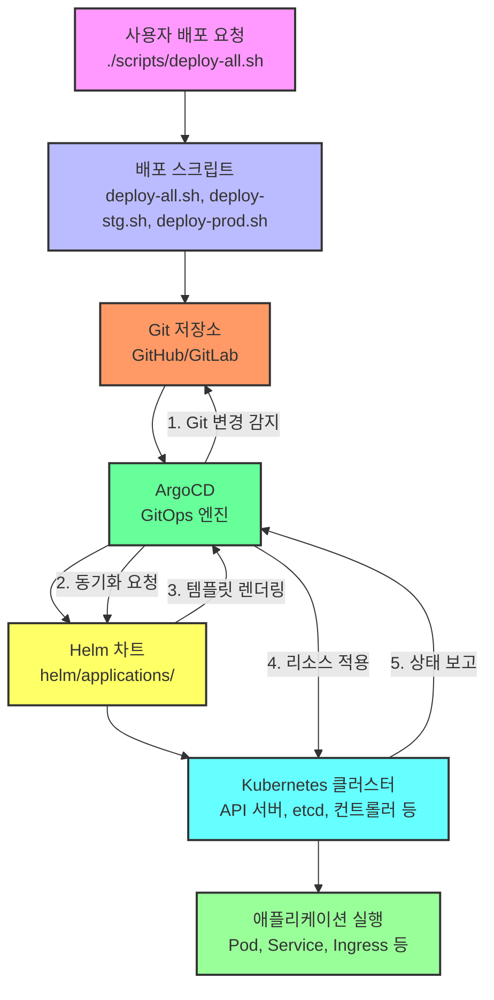

# 구성 요소 관계

<cite>
**이 문서에서 참조한 파일**  
- [deploy-all.sh](file://scripts/deploy-all.sh)
- [deploy-prod.sh](file://scripts/deploy-prod.sh)
- [deploy-stg.sh](file://scripts/deploy-stg.sh)
- [app-of-apps.yaml](file://environments/argocd/app-of-apps.yaml)
- [plate-web-stg.yaml](file://environments/argocd/apps/plate-web-stg.yaml)
- [plate-api-stg.yaml](file://environments/argocd/apps/plate-api-stg.yaml)
- [plate-cache-stg.yaml](file://environments/argocd/apps/plate-cache-stg.yaml)
- [plate-llm-stg.yaml](file://environments/argocd/apps/plate-llm-stg.yaml)
- [plate-web-prod.yaml](file://environments/argocd/apps/plate-web-prod.yaml)
- [plate-api-prod.yaml](file://environments/argocd/apps/plate-api-prod.yaml)
- [plate-cache-prod.yaml](file://environments/argocd/apps/plate-cache-prod.yaml)
- [plate-llm-stg.yaml](file://environments/argocd/apps/plate-llm-stg.yaml)
- [ingress-stg.yaml](file://environments/argocd/apps/ingress-stg.yaml)
- [ingress-prod.yaml](file://environments/argocd/apps/ingress-prod.yaml)
- [openbao-secrets-manager-stg.yaml](file://environments/argocd/apps/openbao-secrets-manager-stg.yaml)
- [openbao-secrets-manager-prod.yaml](file://environments/argocd/apps/openbao-secrets-manager-prod.yaml)
- [Chart.yaml](file://helm/applications/plate-web/Chart.yaml)
- [Chart.yaml](file://helm/applications/plate-api/Chart.yaml)
- [Chart.yaml](file://helm/applications/plate-cache/Chart.yaml)
- [Chart.yaml](file://helm/applications/plate-llm/Chart.yaml)
</cite>

## 목차
1. [소개](#소개)
2. [전체 배포 흐름](#전체-배포-흐름)
3. [각 구성 요소의 책임 영역](#각-구성-요소의-책임-영역)
4. [시스템 관계 다이어그램](#시스템-관계-다이어그램)
5. [배포 요청 전파 흐름](#배포-요청-전파-흐름)
6. [장애 발생 시 영향 범위](#장애-발생-시-영향-범위)

## 소개

이 문서는 `배포 스크립트`, `ArgoCD`, `Helm 차트`, `Kubernetes 클러스터` 간의 상호 작용 관계를 설명합니다. 사용자가 배포 요청을 하면 이 요청이 어떻게 전파되어 최종적으로 Kubernetes 클러스터에 반영되는지에 대한 전체 흐름을 다룹니다. 각 구성 요소의 책임 영역을 명확히 정의하고, 시스템 관계 다이어그램을 통해 시각적으로 이해할 수 있도록 구성하였습니다. 또한 장애 발생 시 영향 범위를 파악할 수 있도록 구성 요소 간 의존성 관계를 문서화합니다.

## 전체 배포 흐름

사용자의 배포 요청은 다음과 같은 순서로 처리됩니다:

1. **배포 스크립트 실행**: 사용자가 `./scripts/deploy-all.sh staging` 또는 `./scripts/deploy-all.sh production` 명령을 실행합니다.
2. **환경 및 옵션 파싱**: `deploy-all.sh` 스크립트는 전달된 인수를 파싱하여 배포 환경(staging/production)과 옵션(`--skip-libraries`, `--libraries-only`, `--dry-run`)을 결정합니다.
3. **라이브러리 배포**: `deploy-libraries.sh` 스크립트를 호출하여 클러스터 서비스(cert-manager, MetalLB, NFS 프로비저너)와 개발 도구(ArgoCD, Harbor, Kubernetes 대시보드)를 배포합니다.
4. **애플리케이션 배포**: 환경에 따라 `deploy-stg.sh` 또는 `deploy-prod.sh` 스크립트를 호출하여 애플리케이션을 배포합니다.
5. **ArgoCD 동기화**: ArgoCD는 Git 저장소의 변경을 감지하고, `environments/argocd/apps/` 디렉터리에 정의된 Application 리소스를 기반으로 Helm 차트를 Kubernetes 클러스터에 배포합니다.
6. **클러스터 반영**: Kubernetes API 서버가 ArgoCD의 요청을 받아 Helm 차트에 정의된 리소스(Deployment, Service, Ingress 등)를 생성하거나 업데이트합니다.

이러한 흐름을 통해 Git 저장소의 코드 변경이 최종적으로 Kubernetes 클러스터에 반영됩니다.

**Section sources**
- [deploy-all.sh](file://scripts/deploy-all.sh#L1-L279)
- [deploy-libraries.sh](file://scripts/deploy-libraries.sh#L1-L200)
- [deploy-stg.sh](file://scripts/deploy-stg.sh#L1-L173)
- [deploy-prod.sh](file://scripts/deploy-prod.sh#L1-L299)

## 각 구성 요소의 책임 영역

### 배포 스크립트

배포 스크립트는 전체 배포 프로세스를 오케스트레이션하는 역할을 합니다. 주요 스크립트는 다음과 같습니다:

- **`deploy-all.sh`**: 라이브러리와 애플리케이션의 배포를 오케스트레이션합니다. 환경과 옵션을 파싱하고, 적절한 스크립트를 호출합니다.
- **`deploy-libraries.sh`**: 클러스터 서비스와 개발 도구를 계층 순서대로 배포합니다.
- **`deploy-stg.sh`**: 스테이징 환경에 애플리케이션을 배포합니다. 빠른 반복 배포와 상태 모니터링을 지원합니다.
- **`deploy-prod.sh`**: 프로덕션 환경에 애플리케이션을 배포합니다. 안전 검사, 백업 생성, 헬스 체크 검증 등의 안전장치를 포함합니다.

이 스크립트들은 사용자 인터페이스 역할을 하며, 복잡한 배포 프로세스를 단순한 명령어로 추상화합니다.

**Section sources**
- [deploy-all.sh](file://scripts/deploy-all.sh#L1-L279)
- [deploy-libraries.sh](file://scripts/deploy-libraries.sh#L1-L200)
- [deploy-stg.sh](file://scripts/deploy-stg.sh#L1-L173)
- [deploy-prod.sh](file://scripts/deploy-prod.sh#L1-L299)

### ArgoCD

ArgoCD는 GitOps 원칙을 기반으로 한 선언적 지속적 배포 도구입니다. 주요 책임은 다음과 같습니다:

- **Git 저장소 감시**: `environments/argocd/` 디렉터리의 변경을 주기적으로 폴링하여 감지합니다.
- **Application 관리**: `environments/argocd/apps/` 디렉터리에 정의된 각 Application 리소스를 관리합니다.
- **자동 동기화**: Git 저장소의 변경 사항을 Kubernetes 클러스터에 자동으로 동기화합니다.
- **상태 헬스 체크**: 클러스터의 실제 상태와 Git 저장소의 선언된 상태를 비교하여 불일치를 감지합니다.
- **자기 치유(self-heal)**: 수동으로 변경된 클러스터 상태를 Git 저장소의 상태로 자동 복구합니다.
- **삭제된 리소스 정리(prune)**: Git 저장소에서 삭제된 리소스를 클러스터에서도 자동으로 삭제합니다.

ArgoCD는 `App of Apps` 패턴을 사용하여 `environments/argocd/app-of-apps.yaml`이 `environments/argocd/apps/` 디렉터리의 모든 Application을 관리합니다.

**Section sources**
- [app-of-apps.yaml](file://environments/argocd/app-of-apps.yaml#L1-L35)
- [plate-web-stg.yaml](file://environments/argocd/apps/plate-web-stg.yaml#L1-L62)
- [plate-api-stg.yaml](file://environments/argocd/apps/plate-api-stg.yaml#L1-L62)
- [plate-cache-stg.yaml](file://environments/argocd/apps/plate-cache-stg.yaml#L1-L51)
- [plate-llm-stg.yaml](file://environments/argocd/apps/plate-llm-stg.yaml#L1-L62)

### Helm 차트

Helm 차트는 Kubernetes 애플리케이션을 패키징하고 배포하는 데 사용되는 템플릿 기반의 패키징 형식입니다. 이 프로젝트에서 Helm 차트는 다음과 같은 역할을 합니다:

- **애플리케이션 정의**: `helm/applications/` 디렉터리에 위치한 각 애플리케이션(plate-web, plate-api, plate-llm, plate-cache)은 자체 Helm 차트로 정의되어 있습니다.
- **템플릿 관리**: `templates/` 디렉터리에는 Deployment, Service, Ingress, ConfigMap 등의 Kubernetes 리소스 템플릿이 포함되어 있습니다.
- **환경별 설정**: `values-stg.yaml`, `values-prod.yaml` 등의 파일을 통해 스테이징과 프로덕션 환경의 설정을 분리합니다.
- **재사용성**: 공통 설정은 `values.yaml`에 정의하고, 환경별로 오버라이드할 수 있습니다.

Helm 차트는 Git 저장소에 저장되어 있으며, ArgoCD에 의해 클러스터에 배포됩니다.

**Section sources**
- [Chart.yaml](file://helm/applications/plate-web/Chart.yaml#L1-L17)
- [Chart.yaml](file://helm/applications/plate-api/Chart.yaml#L1-L16)
- [Chart.yaml](file://helm/applications/plate-cache/Chart.yaml#L1-L16)
- [Chart.yaml](file://helm/applications/plate-llm/Chart.yaml#L1-L19)

### Kubernetes 클러스터

Kubernetes 클러스터는 최종적으로 애플리케이션이 실행되는 환경입니다. 주요 구성 요소와 책임은 다음과 같습니다:

- **API 서버**: 모든 요청의 진입점으로, ArgoCD로부터 배포 요청을 수신합니다.
- **etcd**: 클러스터의 상태를 저장하는 일관성 있는 키-값 저장소입니다.
- **컨트롤러 관리자**: Deployment, ReplicaSet, Service 등의 리소스를 관리하는 컨트롤러를 실행합니다.
- **스케줄러**: Pod를 적절한 노드에 스케줄링합니다.
- **Kubelet**: 각 노드에서 Pod를 실행하고 상태를 보고합니다.
- **Kube-proxy**: 서비스의 네트워크 트래픽을 관리합니다.

클러스터는 ArgoCD가 요청한 리소스를 생성하고, 애플리케이션이 정상적으로 실행되도록 보장합니다.

**Section sources**
- [plate-web-stg.yaml](file://environments/argocd/apps/plate-web-stg.yaml#L27-L30)
- [plate-api-stg.yaml](file://environments/argocd/apps/plate-api-stg.yaml#L27-L30)
- [plate-cache-stg.yaml](file://environments/argocd/apps/plate-cache-stg.yaml#L27-L30)
- [plate-llm-stg.yaml](file://environments/argocd/apps/plate-llm-stg.yaml#L27-L30)

## 시스템 관계 다이어그램

다음 다이어그램은 배포 스크립트, ArgoCD, Helm 차트, Kubernetes 클러스터 간의 상호 관계를 시각적으로 나타냅니다.

**Diagram sources**
- [deploy-all.sh](file://scripts/deploy-all.sh#L1-L279)
- [app-of-apps.yaml](file://environments/argocd/app-of-apps.yaml#L1-L35)
- [plate-web-stg.yaml](file://environments/argocd/apps/plate-web-stg.yaml#L1-L62)

## 배포 요청 전파 흐름

사용자의 배포 요청이 최종적으로 클러스터에 반영되기까지의 전파 흐름은 다음과 같습니다:

1. **사용자 요청**: 사용자가 터미널에서 `./scripts/deploy-all.sh staging` 명령을 실행합니다.
2. **스크립트 실행**: `deploy-all.sh` 스크립트가 실행되어 환경을 `staging`으로 설정하고, `deploy-stg.sh` 스크립트를 호출합니다.
3. **Git 저장소 변경**: `deploy-stg.sh` 스크립트는 `helm/applications/` 디렉터리의 `values-stg.yaml` 파일을 수정하거나, 새로운 커밋을 생성하여 Git 저장소에 푸시합니다.
4. **ArgoCD 감지**: ArgoCD는 설정된 폴링 주기(기본 3분) 내에 Git 저장소의 변경을 감지합니다.
5. **Application 동기화**: ArgoCD는 `environments/argocd/apps/plate-web-stg.yaml` 등의 Application 리소스를 기반으로 동기화를 시작합니다.
6. **Helm 차트 렌더링**: ArgoCD는 `helm/applications/plate-web` 디렉터리의 Helm 차트를 `values-stg.yaml` 파일과 함께 렌더링하여 Kubernetes 리소스 매니페스트를 생성합니다.
7. **클러스터 적용**: ArgoCD는 생성된 매니페스트를 Kubernetes API 서버에 적용 요청합니다.
8. **리소스 생성**: Kubernetes API 서버는 요청을 받아 Deployment, Service, Ingress 등의 리소스를 생성하거나 업데이트합니다.
9. **애플리케이션 실행**: 스케줄러가 Pod를 노드에 스케줄링하고, Kubelet이 컨테이너를 실행합니다.
10. **상태 보고**: ArgoCD는 클러스터의 상태를 주기적으로 확인하여 동기화 상태를 업데이트합니다.

이러한 흐름을 통해 사용자의 배포 요청이 최종적으로 클러스터에 반영됩니다.

**Section sources**
- [deploy-all.sh](file://scripts/deploy-all.sh#L1-L279)
- [deploy-stg.sh](file://scripts/deploy-stg.sh#L1-L173)
- [plate-web-stg.yaml](file://environments/argocd/apps/plate-web-stg.yaml#L1-L62)
- [Chart.yaml](file://helm/applications/plate-web/Chart.yaml#L1-L17)

## 장애 발생 시 영향 범위

각 구성 요소에 장애가 발생했을 때의 영향 범위는 다음과 같습니다:

### 배포 스크립트 장애

- **영향 범위**: 새로운 배포 요청이 불가능해집니다.
- **복구 방법**: 스크립트를 직접 수정하거나, Helm CLI를 사용하여 수동으로 배포합니다.
- **예방 조치**: 스크립트의 버전 관리를 철저히 하고, 테스트 환경에서 검증합니다.

### ArgoCD 장애

- **영향 범위**: Git 저장소의 변경이 클러스터에 반영되지 않습니다. 기존 애플리케이션은 정상적으로 실행되지만, 새로운 배포나 설정 변경이 불가능합니다.
- **복구 방법**: ArgoCD를 재시작하거나, 클러스터에 직접 매니페스트를 적용합니다.
- **예방 조치**: 고가용성(HA) 구성으로 ArgoCD를 배포하고, 백업 전략을 수립합니다.

### Helm 차트 장애

- **영향 범위**: 특정 애플리케이션의 배포에 실패합니다. 예를 들어, `plate-web` 차트에 오류가 있으면 웹 애플리케이션만 영향을 받습니다.
- **복구 방법**: Git 저장소에서 이전 커밋으로 되돌리고, ArgoCD를 재동기화합니다.
- **예방 조치**: `helm lint`와 `helm template`을 사용하여 사전 검증을 수행합니다.

### Kubernetes 클러스터 장애

- **영향 범위**: 모든 애플리케이션이 중단됩니다. 클러스터 전체가 사용 불가능해집니다.
- **복구 방법**: 클러스터의 구성 요소(API 서버, etcd 등)를 재시작하거나, 백업에서 복구합니다.
- **예방 조치**: 고가용성 클러스터를 구성하고, 정기적인 백업과 장애 대응 절차를 수립합니다.

이러한 의존성 관계를 이해함으로써, 장애 발생 시 신속하게 영향 범위를 파악하고 대응할 수 있습니다.

**Section sources**
- [deploy-all.sh](file://scripts/deploy-all.sh#L1-L279)
- [app-of-apps.yaml](file://environments/argocd/app-of-apps.yaml#L1-L35)
- [plate-web-stg.yaml](file://environments/argocd/apps/plate-web-stg.yaml#L1-L62)
- [Chart.yaml](file://helm/applications/plate-web/Chart.yaml#L1-L17)