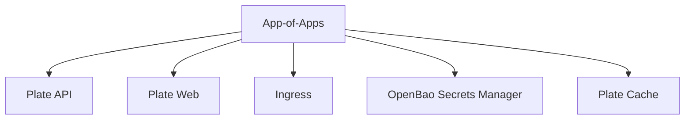

# ArgoCD 통합

<cite>
**참조된 문서**
- [app-of-apps.yaml](file://environments/argocd/app-of-apps.yaml)
- [plate-api-prod.yaml](file://environments/argocd/apps/plate-api-prod.yaml)
- [plate-web-prod.yaml](file://environments/argocd/apps/plate-web-prod.yaml)
- [values.yaml](file://helm/development-tools/argocd/values.yaml)
- [Chart.yaml](file://helm/development-tools/argocd/Chart.yaml)
- [argocd-secret.yaml](file://helm/development-tools/argocd/templates/argocd-configs/argocd-secret.yaml)
- [argocd-cm.yaml](file://helm/development-tools/argocd/templates/argocd-configs/argocd-cm.yaml)
- [argocd-rbac-cm.yaml](file://helm/development-tools/argocd/templates/argocd-configs/argocd-rbac-cm.yaml)
- [argocd-repo-server-tls-secret.yaml](file://helm/development-tools/argocd/templates/argocd-configs/argocd-repo-server-tls-secret.yaml)
- [argocd-server-tls-secret.yaml](file://helm/development-tools/argocd/templates/argocd-configs/argocd-server-tls-secret.yaml)
- [argocd-dex-server-tls-secret.yaml](file://helm/development-tools/argocd/templates/argocd-configs/argocd-dex-server-tls-secret.yaml)
</cite>

## 목차
1. [소개](#소개)
2. [프로젝트 구조](#프로젝트-구조)
3. [App-of-Apps 패턴](#app-of-apps-패턴)
4. [핵심 구성 요소](#핵심-구성-요소)
5. [인증 및 권한 관리](#인증-및-권한-관리)
6. [상태 동기화 메커니즘](#상태-동기화-메커니즘)
7. [고급 설정](#고급-설정)
8. [결론](#결론)

## 소개
ArgoCD는 쿠버네티스 환경에서 GitOps 워크플로우를 구현하는 데 사용되는 선언형 지속적 배포 도구입니다. 이 문서는 ArgoCD가 프로젝트의 GitOps 워크플로우에서 수행하는 역할과 통합 방식을 상세히 설명합니다. App-of-Apps 패턴을 통한 계층적 애플리케이션 관리 구조, ArgoCD의 핵심 구성 요소(Application, ApplicationSet, Repo Server 등)의 역할, 인증 및 권한 관리 설정, 상태 동기화 메커니즘을 문서화합니다. 실제 values.yaml과 app-of-apps.yaml 예제를 기반으로 구성 방법을 설명하고, 배포 자동화 및 상태 감지 동작을 기술합니다. TLS 설정, Redis HA 구성, 알림 통합과 같은 고급 설정에 대해서도 다룹니다.

## 프로젝트 구조
프로젝트는 다음과 같은 디렉터리 구조를 가지고 있습니다:

```
.
├── environments/argocd/
│   ├── apps/
│   │   ├── ingress-prod.yaml
│   │   ├── ingress-stg.yaml
│   │   ├── openbao-secrets-manager-prod.yaml
│   │   ├── openbao-secrets-manager-stg.yaml
│   │   ├── plate-api-prod.yaml
│   │   ├── plate-api-stg.yaml
│   │   ├── plate-cache-prod.yaml
│   │   ├── plate-cache-stg.yaml
│   │   ├── plate-llm-stg.yaml
│   │   ├── plate-web-prod.yaml
│   │   └── plate-web-stg.yaml
│   ├── README.md
│   └── app-of-apps.yaml
├── helm/
│   ├── applications/
│   │   ├── plate-api/
│   │   ├── plate-cache/
│   │   ├── plate-llm/
│   │   └── plate-web/
│   ├── cluster-services/
│   │   ├── cert-manager/
│   │   ├── metallb/
│   │   └── nfs-provisioner/
│   ├── development-tools/
│   │   ├── argocd/
│   │   ├── fluentd/
│   │   ├── grafana/
│   │   ├── harbor/
│   │   ├── jenkins/
│   │   ├── kubernetes-dashboard/
│   │   ├── openbao/
│   │   ├── openebs/
│   │   ├── prometheus/
│   │   └── promtail/
│   ├── ingress/
│   └── shared-configs/openbao-secrets-manager/
├── scripts/
└── README.md
```

**Diagram sources**
- [environments/argocd/app-of-apps.yaml](file://environments/argocd/app-of-apps.yaml)

**Section sources**
- [environments/argocd/app-of-apps.yaml](file://environments/argocd/app-of-apps.yaml)

## App-of-Apps 패턴
App-of-Apps 패턴은 ArgoCD에서 여러 애플리케이션을 하나의 상위 애플리케이션으로 관리하는 방법입니다. 이 패턴을 사용하면 복잡한 애플리케이션 구조를 단순화하고, 전체 시스템의 상태를 쉽게 관리할 수 있습니다.



**Diagram sources**
- [environments/argocd/app-of-apps.yaml](file://environments/argocd/app-of-apps.yaml)

**Section sources**
- [environments/argocd/app-of-apps.yaml](file://environments/argocd/app-of-apps.yaml)

## 핵심 구성 요소
ArgoCD는 여러 핵심 구성 요소로 구성되어 있으며, 각각은 특정한 역할을 수행합니다.

### Application
Application은 ArgoCD에서 관리되는 쿠버네티스 애플리케이션을 나타냅니다. 각 Application은 Git 저장소의 특정 경로에 있는 Helm 차트를 기반으로 하며, 배포 대상 클러스터와 네임스페이스를 지정합니다.

```yaml
apiVersion: argoproj.io/v1alpha1
kind: Application
metadata:
  name: plate-api-prod
  namespace: argocd
spec:
  project: default
  source:
    repoURL: https://github.com/kimjoongwon/prj-devops.git
    path: helm/applications/plate-server
    targetRevision: main
    helm:
      valueFiles:
        - values-prod.yaml
  destination:
    server: https://kubernetes.default.svc
    namespace: plate-prod
  syncPolicy:
    automated:
      prune: true
      selfHeal: true
    syncOptions:
      - CreateNamespace=true
      - ApplyOutOfSyncOnly=true
    retry:
      limit: 3
      backoff:
        duration: 5s
        factor: 2
        maxDuration: 3m
  revisionHistoryLimit: 10
  info:
    - name: "Environment"
      value: "Production"
    - name: "Domain"
      value: "cocdev.co.kr/api, www.cocdev.co.kr/api"
    - name: "Description"
      value: "Plate API Server - Production Environment"
```

**Section sources**
- [environments/argocd/apps/plate-api-prod.yaml](file://environments/argocd/apps/plate-api-prod.yaml)

### ApplicationSet
ApplicationSet은 동적으로 애플리케이션을 생성하고 관리할 수 있는 기능을 제공합니다. 이는 여러 환경이나 클러스터에서 동일한 애플리케이션을 배포할 때 유용합니다.

### Repo Server
Repo Server는 Git 저장소에서 매니페스트를 가져와서 캐시하는 역할을 합니다. 이는 애플리케이션 동기화 속도를 향상시키고, Git 저장소에 대한 부하를 줄이는 데 도움이 됩니다.

**Section sources**
- [helm/development-tools/argocd/values.yaml](file://helm/development-tools/argocd/values.yaml)

## 인증 및 권한 관리
ArgoCD는 다양한 인증 및 권한 관리 기능을 제공합니다. 기본적으로는 로컬 관리자 사용자를 사용할 수 있으며, 외부 ID 제공자(Dex, OIDC 등)를 통한 SSO도 지원합니다.

### RBAC 설정
ArgoCD는 역할 기반 접근 제어(RBAC)를 통해 사용자 권한을 관리합니다. `argocd-rbac-cm` ConfigMap에 정책을 정의하여, 사용자에게 특정 리소스에 대한 접근 권한을 부여할 수 있습니다.

```yaml
p, role:admin, applications, *, *, allow
p, role:admin, clusters, *, *, allow
p, role:admin, repositories, *, *, allow
p, role:admin, logs, get, *, allow
p, role:admin, exec, create, */*, allow
p, role:admin, projects, *, *, allow

p, role:readonly, applications, get, *, allow
p, role:readonly, applications, list, *, allow
p, role:readonly, clusters, get, *, allow
p, role:readonly, repositories, get, *, allow
p, role:readonly, logs, get, *, allow
p, role:readonly, projects, get, *, allow

g, admin, role:admin
```

**Section sources**
- [helm/development-tools/argocd/values.yaml](file://helm/development-tools/argocd/values.yaml)

## 상태 동기화 메커니즘
ArgoCD는 Git 저장소의 상태와 쿠버네티스 클러스터의 상태를 지속적으로 비교하고, 차이가 있을 경우 자동으로 동기화합니다. 이는 `syncPolicy`를 통해 구성할 수 있습니다.

### 자동 동기화
자동 동기화는 Git 저장소에 변경 사항이 푸시될 때마다 클러스터를 자동으로 업데이트합니다. `prune` 옵션을 사용하면 Git 저장소에서 삭제된 리소스를 클러스터에서도 자동으로 삭제할 수 있습니다.

### 셀프 힐링
셀프 힐링은 클러스터에서 수동으로 변경된 리소스를 Git 저장소의 상태로 자동 복구합니다. 이는 시스템의 일관성을 유지하는 데 중요합니다.

**Section sources**
- [environments/argocd/apps/plate-api-prod.yaml](file://environments/argocd/apps/plate-api-prod.yaml)

## 고급 설정
ArgoCD는 다양한 고급 설정을 지원하여, 보안, 성능, 통합 등을 최적화할 수 있습니다.

### TLS 설정
ArgoCD는 HTTPS를 통해 안전한 통신을 제공하기 위해 TLS 설정을 지원합니다. `argocd-server-tls-secret`과 `argocd-repo-server-tls-secret`을 사용하여 서버와 리포지토리 서버에 TLS 인증서를 구성할 수 있습니다.

### Redis HA 구성
Redis는 ArgoCD의 상태 저장소로 사용되며, 고가용성을 위해 Redis HA를 구성할 수 있습니다. `redis-ha` 서브차트를 사용하여 Redis 클러스터를 설정할 수 있습니다.

### 알림 통합
ArgoCD는 애플리케이션 상태 변경 시 알림을 보내는 기능을 제공합니다. Slack, 이메일, 웹훅 등 다양한 알림 서비스를 통합할 수 있습니다.

**Section sources**
- [helm/development-tools/argocd/values.yaml](file://helm/development-tools/argocd/values.yaml)

## 결론
ArgoCD는 GitOps 워크플로우를 구현하는 데 강력한 도구입니다. App-of-Apps 패턴을 통해 복잡한 애플리케이션 구조를 단순화하고, 자동 동기화와 셀프 힐링을 통해 시스템의 일관성을 유지할 수 있습니다. 다양한 인증 및 권한 관리 기능, 고급 설정을 통해 보안과 성능을 최적화할 수 있으며, 알림 통합을 통해 상태 변경을 실시간으로 모니터링할 수 있습니다.