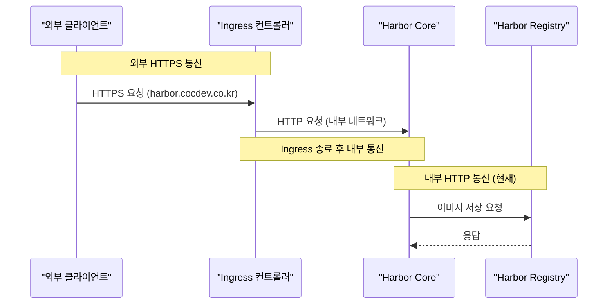
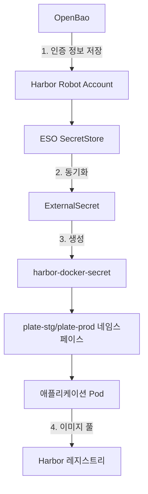

# Harbor 통합

<cite>
**이 문서에서 참조한 파일**   
- [harbor-auth.yaml](file://environments/argocd/harbor-auth.yaml)
- [deploy-harbor-auth.sh](file://scripts/deploy-harbor-auth.sh)
- [verify-harbor-auth.sh](file://scripts/verify-harbor-auth.sh)
- [Chart.yaml](file://helm/development-tools/harbor/Chart.yaml)
- [values.yaml](file://helm/development-tools/harbor/values.yaml)
- [README.md](file://helm/development-tools/harbor/README.md)
- [core-tls.yaml](file://helm/development-tools/harbor/templates/core/core-tls.yaml)
- [portal/tls.yaml](file://helm/development-tools/harbor/templates/portal/tls.yaml)
- [core-dpl.yaml](file://helm/development-tools/harbor/templates/core/core-dpl.yaml)
- [registry-dpl.yaml](file://helm/development-tools/harbor/templates/registry/registry-dpl.yaml)
- [trivy-sts.yaml](file://helm/development-tools/harbor/templates/trivy/trivy-sts.yaml)
- [jobservice-dpl.yaml](file://helm/development-tools/harbor/templates/jobservice/jobservice-dpl.yaml)
- [database-ss.yaml](file://helm/development-tools/harbor/templates/database/database-ss.yaml)
- [redis/statefulset.yaml](file://helm/development-tools/harbor/templates/redis/statefulset.yaml)
- [secret-store.yaml](file://helm/shared-configs/harbor-auth/secret-store.yaml)
- [external-secret.yaml](file://helm/shared-configs/harbor-auth/external-secret.yaml)
- [openbao-token-secret.yaml](file://helm/shared-configs/harbor-auth/openbao-token-secret.yaml)
- [serviceaccount.yaml](file://helm/shared-configs/harbor-auth/serviceaccount.yaml)
</cite>

## 목차
1. [소개](#소개)
2. [Harbor의 역할과 기능](#harbor의-역할과-기능)
3. [Helm 차트를 통한 설치 및 구성](#helm-차트를-통한-설치-및-구성)
4. [핵심 컴포넌트 분석](#핵심-컴포넌트-분석)
5. [RBAC 기반 접근 제어](#rbac-기반-접근-제어)
6. [SSL/TLS 통합](#ssltls-통합)
7. [Clair을 활용한 취약점 스캔](#clair을-활용한-취약점-스캔)
8. [인증 설정 자동화 프로세스](#인증-설정-자동화-프로세스)
9. [검증 방법](#검증-방법)
10. [결론](#결론)

## 소개

Harbor는 오픈소스 기반의 신뢰할 수 있는 클라우드 네이티브 컨테이너 이미지 레지스트리로, 컨테이너 이미지 및 Helm 차트 저장, 서명, 스캔 기능을 제공합니다. 본 문서는 Harbor 컨테이너 레지스트리가 프로젝트에서 수행하는 역할과 통합 방식을 설명하며, 이미지 저장소로서의 기능, 프로젝트별 네임스페이스 관리, RBAC 기반 접근 제어, SSL/TLS 통합, Clair을 활용한 취약점 스캔 기능을 문서화합니다. 또한 Helm 차트를 통한 설치 및 구성 방법, values.yaml의 주요 설정 항목, Harbor의 핵심 컴포넌트(Core, Registry, Notary, Trivy 등)의 역할을 설명합니다. 배포 스크립트(deploy-harbor-auth.sh)를 활용한 인증 설정 자동화 프로세스와 검증 방법을 포함합니다.

**Section sources**
- [README.md](file://helm/development-tools/harbor/README.md#L3-L5)

## Harbor의 역할과 기능

Harbor는 컨테이너 이미지 및 Helm 차트를 안전하게 저장하고 관리하는 레지스트리 서비스로, 기업 환경에서 컨테이너 이미지의 수명 주기 전반을 관리하는 데 핵심적인 역할을 수행합니다. Harbor는 단순한 이미지 저장소를 넘어, 이미지 취약점 스캔, 역할 기반 접근 제어(RBAC), 복제 기능, 이미지 서명 등 다양한 보안 및 운영 기능을 제공합니다. 특히, 프로젝트별 네임스페이스를 기반으로 한 다중 테넌시(Multi-tenancy) 아키텍처를 통해 다양한 팀이나 프로젝트가 서로 격리된 환경에서 이미지를 관리할 수 있도록 지원합니다. 이는 개발, 테스트, 운영 환경을 명확히 분리하고, 각 환경에 맞는 접근 제어 정책을 적용할 수 있게 합니다.

Harbor는 Docker Registry v2 API를 기반으로 하며, Docker CLI, Podman, Kubernetes 등 다양한 도구와 원활하게 통합됩니다. 사용자는 표준 Docker 명령어를 사용하여 이미지를 푸시(Push)하고 풀(Pull)할 수 있습니다. 또한 Harbor는 웹 기반의 사용자 인터페이스를 제공하여 이미지, 태그, 복제 규칙, 사용자 및 그룹을 쉽게 관리할 수 있도록 합니다. Harbor는 내부적으로 PostgreSQL 데이터베이스를 사용하여 메타데이터를 저장하고, Redis를 캐시 및 세션 저장소로 활용합니다. 이미지 데이터 자체는 로컬 파일 시스템, AWS S3, Google Cloud Storage(GCS), Azure Blob Storage 등 다양한 백엔드 스토리지에 저장할 수 있습니다.

**Section sources**
- [README.md](file://helm/development-tools/harbor/README.md#L3-L5)
- [Chart.yaml](file://helm/development-tools/harbor/Chart.yaml#L3-L4)

## Helm 차트를 통한 설치 및 구성

Harbor는 Helm 차트를 통해 Kubernetes 환경에 쉽게 배포할 수 있습니다. 제공된 `helm/development-tools/harbor` 디렉터리에 위치한 Helm 차트는 Harbor의 모든 컴포넌트를 정의하고 있으며, `values.yaml` 파일을 통해 다양한 설정을 커스터마이징할 수 있습니다. Helm을 사용하면 Harbor의 설치, 업그레이드, 롤백을 일관되고 반복 가능한 방식으로 수행할 수 있습니다.

### 주요 values.yaml 설정 항목

`values.yaml` 파일은 Harbor의 동작 방식을 결정하는 핵심 구성 파일입니다. 주요 설정 항목들은 다음과 같습니다:

**표: Harbor Helm 차트 주요 구성 항목**

| 설정 항목 | 설명 | 기본값 |
| :--- | :--- | :--- |
| `expose.type` | 서비스 노출 방식 (`ingress`, `clusterIP`, `nodePort`, `loadBalancer`) | `ingress` |
| `expose.tls.enabled` | TLS 활성화 여부 | `true` |
| `expose.ingress.hosts.core` | Harbor 코어 서비스의 Ingress 호스트 | `harbor.cocdev.co.kr` |
| `externalURL` | Harbor 코어 서비스의 외부 URL | `https://harbor.cocdev.co.kr` |
| `persistence.enabled` | 데이터 지속성 활성화 여부 | `true` |
| `persistence.persistentVolumeClaim.registry.storageClass` | 레지스트리 PVC에 사용할 스토리지 클래스 | `openebs-hostpath` |
| `harborAdminPassword` | Harbor 관리자 계정의 초기 비밀번호 | `Harbor12345` |
| `logLevel` | 로그 레벨 (`debug`, `info`, `warning`, `error`, `fatal`) | `info` |
| `trivy.enabled` | Trivy 스캐너 활성화 여부 | `true` |
| `database.internal.password` | 내부 데이터베이스 비밀번호 | `changeit` |

**Section sources**
- [values.yaml](file://helm/development-tools/harbor/values.yaml#L1-L800)
- [README.md](file://helm/development-tools/harbor/README.md#L78-L424)

## 핵심 컴포넌트 분석

Harbor는 여러 개의 마이크로서비스로 구성되어 있으며, 각 컴포넌트는 특정한 역할을 수행합니다. 이러한 모듈화된 아키텍처는 확장성과 유지보수성을 높여줍니다.

```mermaid
graph TD
subgraph "Harbor Core Components"
Core[Core 서비스]
Registry[Registry 서비스]
Trivy[Trivy 스캐너]
Jobservice[Jobservice]
Database[(PostgreSQL)]
Redis[(Redis)]
end
Core --> Registry : 이미지 푸시/풀 요청
Core --> Trivy : 취약점 스캔 요청
Core --> Database : 메타데이터 저장/조회
Core --> Redis : 세션 및 캐시
Jobservice --> Database : 작업 상태 저장
Jobservice --> Redis : 작업 큐
Registry --> Database : 이미지 메타데이터
Registry --> Redis : 캐시
```

**Diagram sources**
- [core-dpl.yaml](file://helm/development-tools/harbor/templates/core/core-dpl.yaml)
- [registry-dpl.yaml](file://helm/development-tools/harbor/templates/registry/registry-dpl.yaml)
- [trivy-sts.yaml](file://helm/development-tools/harbor/templates/trivy/trivy-sts.yaml)
- [jobservice-dpl.yaml](file://helm/development-tools/harbor/templates/jobservice/jobservice-dpl.yaml)
- [database-ss.yaml](file://helm/development-tools/harbor/templates/database/database-ss.yaml)
- [redis/statefulset.yaml](file://helm/development-tools/harbor/templates/redis/statefulset.yaml)

### Core 서비스

Core 서비스는 Harbor의 중심 허브 역할을 합니다. 사용자 인증, 권한 부여, 이미지 복제, 웹 UI, API 엔드포인트 등을 관리합니다. 모든 클라이언트 요청은 먼저 Core 서비스를 거치며, Core 서비스는 다른 컴포넌트들과의 조정을 담당합니다. 예를 들어, 사용자가 이미지를 푸시하면 Core 서비스는 먼저 사용자의 권한을 확인한 후, Registry 서비스에 이미지 저장을 요청하고, Trivy 서비스에 취약점 스캔을 요청합니다.

### Registry 서비스

Registry 서비스는 Docker Registry v2 사양을 구현한 컴포넌트로, 컨테이너 이미지와 Helm 차트의 실제 바이너리 데이터를 저장하고 제공합니다. Core 서비스는 Registry 서비스에 대한 인증 정보를 관리하며, 클라이언트는 Core 서비스를 통해 Registry 서비스에 접근합니다. Registry 서비스는 내부적으로 `filesystem` 백엔드를 사용하여 OpenEBS의 `openebs-hostpath` 스토리지 클래스를 통해 데이터를 영구 저장소에 저장합니다.

### Trivy 스캐너

Trivy는 오픈소스 취약점 스캐너로, Harbor에 통합되어 이미지에 포함된 OS 패키지 및 애플리케이션 라이브러리의 알려진 취약점을 자동으로 스캔합니다. `values.yaml` 파일에서 `trivy.enabled: true`로 설정되어 있으며, `trivy.severity`를 통해 `UNKNOWN,LOW,MEDIUM,HIGH,CRITICAL` 등 다양한 심각도의 취약점을 검사할 수 있습니다. 스캔 결과는 Harbor 웹 UI에서 시각적으로 확인할 수 있으며, CI/CD 파이프라인에서 정책 위반을 방지하는 데 사용할 수 있습니다.

### Jobservice

Jobservice는 Harbor 내에서 실행되는 다양한 백그라운드 작업을 관리합니다. 예를 들어, 이미지 복제, 정책 기반의 이미지 삭제, 로그 정리 등의 작업이 여기에 해당합니다. `jobservice.maxJobWorkers` 설정을 통해 동시에 실행할 수 있는 작업자의 수를 제어할 수 있습니다.

### 데이터베이스 및 Redis

Harbor는 PostgreSQL 데이터베이스를 사용하여 사용자, 프로젝트, 이미지 메타데이터, 로그 등 모든 구조화된 데이터를 저장합니다. Redis는 세션 저장소, 캐시, 그리고 Jobservice의 작업 큐로 사용됩니다. 두 컴포넌트 모두 내부적으로 배포되며, 각각의 PVC를 통해 데이터를 지속합니다.

**Section sources**
- [core-dpl.yaml](file://helm/development-tools/harbor/templates/core/core-dpl.yaml)
- [registry-dpl.yaml](file://helm/development-tools/harbor/templates/registry/registry-dpl.yaml)
- [trivy-sts.yaml](file://helm/development-tools/harbor/templates/trivy/trivy-sts.yaml)
- [jobservice-dpl.yaml](file://helm/development-tools/harbor/templates/jobservice/jobservice-dpl.yaml)
- [database-ss.yaml](file://helm/development-tools/harbor/templates/database/database-ss.yaml)
- [redis/statefulset.yaml](file://helm/development-tools/harbor/templates/redis/statefulset.yaml)

## RBAC 기반 접근 제어

Harbor는 역할 기반 접근 제어(Role-Based Access Control, RBAC)를 통해 세밀한 권한 관리를 제공합니다. 사용자와 그룹은 프로젝트 단위로 다양한 역할(Admin, Maintainer, Developer, Guest, Limited Guest)이 할당될 수 있습니다.

- **Admin**: 프로젝트의 모든 설정을 관리할 수 있는 최고 권한입니다.
- **Maintainer**: 이미지 푸시/풀, 태그 삭제, 웹훅 관리 등을 수행할 수 있습니다.
- **Developer**: 이미지 푸시/풀이 가능합니다.
- **Guest**: 이미지 풀만 가능합니다.
- **Limited Guest**: 특정 태그만 풀할 수 있는 제한된 권한입니다.

이러한 RBAC 정책은 Harbor 웹 UI 또는 REST API를 통해 구성할 수 있으며, 조직의 보안 정책에 맞게 유연하게 적용할 수 있습니다. 예를 들어, 운영 프로젝트에는 Admin 역할을 가진 소수의 운영팀만 접근할 수 있도록 제한하고, 개발 프로젝트에는 개발팀 전체가 Developer 역할로 접근할 수 있도록 설정할 수 있습니다.

**Section sources**
- [README.md](file://helm/development-tools/harbor/README.md#L3-L5)

## SSL/TLS 통합

Harbor는 내부 및 외부 통신 모두에 SSL/TLS를 적용하여 보안을 강화합니다.

### 외부 TLS

Harbor는 `expose.type: ingress`로 설정되어 있으며, `expose.ingress.hosts.core: harbor.cocdev.co.kr` 도메인을 통해 외부에 노출됩니다. TLS는 `expose.tls.certSource: secret` 방식으로 구성되어 있으며, 미리 생성된 `habor-tls`라는 이름의 Kubernetes Secret에서 인증서와 개인 키를 읽어옵니다. 이는 Cert-Manager와 통합하여 Let's Encrypt로부터 자동으로 인증서를 발급받는 방식과도 호환됩니다.

### 내부 TLS

Harbor의 내부 컴포넌트들(Core, Registry, Jobservice 등) 간의 통신도 암호화되어야 합니다. `values.yaml` 파일에서 `internalTLS.enabled: false`로 설정되어 있어 현재는 내부 TLS가 비활성화되어 있지만, 보안 요구사항이 높은 환경에서는 이를 활성화하여 컴포넌트 간의 통신을 보호할 수 있습니다. 내부 TLS는 `auto`, `manual`, `secret` 세 가지 방식으로 인증서를 제공할 수 있습니다.



**Diagram sources**
- [values.yaml](file://helm/development-tools/harbor/values.yaml#L5-L29)
- [core-dpl.yaml](file://helm/development-tools/harbor/templates/core/core-dpl.yaml)
- [registry-dpl.yaml](file://helm/development-tools/harbor/templates/registry/registry-dpl.yaml)

## Clair을 활용한 취약점 스캔

Harbor는 Trivy를 기본 취약점 스캐너로 사용합니다. Trivy는 Aqua Security에서 개발한 오픈소스 스캐너로, OS 패키지(CVE)와 애플리케이션 종속성(예: npm, pip, gem)의 취약점을 효과적으로 탐지합니다. `values.yaml` 파일에서 `trivy.enabled: true`로 설정되어 있으며, `trivy.vulnType: os,library`로 OS 및 라이브러리 취약점을 모두 스캔하도록 구성되어 있습니다.

이미지가 Harbor에 푸시되면, Core 서비스는 자동으로 Trivy 서비스에 스캔을 요청합니다. Trivy는 GitHub에서 최신 취약점 데이터베이스(Trivy DB)를 다운로드하여 스캔을 수행합니다. 스캔 결과는 Harbor 웹 UI에 표시되며, 사용자는 각 취약점의 심각도(CRITICAL, HIGH 등), 설명, 해결 방법을 확인할 수 있습니다. 이 정보는 보안 정책을 수립하고, 취약한 이미지의 배포를 방지하는 데 중요한 역할을 합니다.

**Section sources**
- [values.yaml](file://helm/development-tools/harbor/values.yaml#L297-L316)
- [trivy-sts.yaml](file://helm/development-tools/harbor/templates/trivy/trivy-sts.yaml)

## 인증 설정 자동화 프로세스

Harbor에 대한 인증 정보는 OpenBao(HashiCorp Vault)에 안전하게 저장되며, External Secrets Operator(ESO)를 통해 Kubernetes 클러스터 내부로 동기화됩니다. 이 과정은 `scripts/deploy-harbor-auth.sh` 스크립트를 통해 자동화되어 있습니다.



**Diagram sources**
- [deploy-harbor-auth.sh](file://scripts/deploy-harbor-auth.sh)
- [secret-store.yaml](file://helm/shared-configs/harbor-auth/secret-store.yaml)
- [external-secret.yaml](file://helm/shared-configs/harbor-auth/external-secret.yaml)

### 자동화 프로세스 단계

1.  **스크립트 실행**: `deploy-harbor-auth.sh` 스크립트를 실행합니다.
2.  **필수 파일 확인**: 스크립트는 `harbor-auth` 디렉터리 내에 `serviceaccount.yaml`, `openbao-token-secret.yaml`, `secret-store.yaml`, `external-secret.yaml` 파일이 존재하는지 확인합니다.
3.  **OpenBao 토큰 확인**: `openbao-token-secret.yaml` 파일에 OpenBao에 접근할 수 있는 유효한 토큰이 설정되어 있는지 확인합니다.
4.  **네임스페이스 생성**: `plate-stg` 및 `plate-prod` 네임스페이스가 존재하지 않으면 생성합니다.
5.  **ESO 상태 확인**: External Secrets Operator가 `external-secrets-system` 네임스페이스에 설치되어 정상적으로 실행 중인지 확인합니다.
6.  **ArgoCD Application 배포**: `argocd/harbor-auth.yaml` 파일을 사용하여 ArgoCD에 새로운 Application을 생성합니다.
7.  **ArgoCD 동기화**: ArgoCD CLI 또는 kubectl을 사용하여 Application을 동기화하여, ESO 리소스들을 클러스터에 적용합니다.
8.  **배포 상태 확인**: SecretStore, ExternalSecret, 그리고 최종적으로 생성된 `harbor-docker-secret`의 상태를 확인합니다.

이 프로세스는 GitOps 원칙을 따르며, 모든 구성이 Git 저장소에 버전 관리되므로 변경 사항을 추적하고 롤백하기 쉽습니다.

**Section sources**
- [deploy-harbor-auth.sh](file://scripts/deploy-harbor-auth.sh#L1-L194)

## 검증 방법

Harbor 인증 설정 자동화 프로세스의 성공 여부를 검증하기 위해 `scripts/verify-harbor-auth.sh` 스크립트를 사용할 수 있습니다. 이 스크립트는 여러 단계의 검사를 수행하여 전체 통합이 정상적으로 작동하는지 확인합니다.

### 검증 단계

1.  **ESO 상태 확인**: `external-secrets-system` 네임스페이스에 ESO Pod가 실행 중인지 확인합니다.
2.  **네임스페이스별 리소스 확인**:
    *   `openbao-token` Secret이 존재하는지 확인합니다.
    *   `harbor-secret-reader` ServiceAccount가 생성되었는지 확인합니다.
    *   `openbao-harbor` SecretStore가 생성되고 연결 상태가 `True`인지 확인합니다.
    *   `harbor-registry-secret` ExternalSecret이 생성되고 동기화 상태가 `True`인지 확인합니다.
    *   `harbor-docker-secret`이 생성되었는지, 타입이 `kubernetes.io/dockerconfigjson`인지, 그리고 `harbor.cocdev.co.kr` URL을 포함하고 있는지 확인합니다.
3.  **Harbor 이미지 풀 테스트**: `plate-stg` 네임스페이스에 테스트용 Pod를 생성하고, Harbor에서 이미지를 성공적으로 풀(Pull)할 수 있는지 확인합니다. 이 테스트는 `imagePullSecrets` 필드를 통해 `harbor-docker-secret`을 사용합니다.
4.  **최종 결과 요약**: 모든 검사 항목의 통과/실패 여부를 요약하여 출력합니다. 모든 검사가 통과하면 "모든 검증 통과!" 메시지를 표시하고, 실패한 검사가 있으면 문제 해결 가이드를 제공합니다.

이 검증 스크립트는 Harbor 통합의 무결성을 보장하는 데 필수적인 도구입니다.

**Section sources**
- [verify-harbor-auth.sh](file://scripts/verify-harbor-auth.sh#L1-L212)

## 결론

Harbor는 프로젝트의 컨테이너 이미지 관리 핵심 인프라로, 안전하고 신뢰할 수 있는 이미지 저장소 기능을 제공합니다. Helm 차트를 통한 선언적 설치와 구성은 배포의 일관성과 재현성을 보장합니다. RBAC 기반 접근 제어와 OpenBao, ESO를 통한 인증 정보 관리는 보안을 크게 강화합니다. Trivy를 통한 자동 취약점 스캔은 보안 정책을 수립하고 위험을 사전에 방지하는 데 중요한 역할을 합니다. `deploy-harbor-auth.sh` 및 `verify-harbor-auth.sh` 스크립트를 통해 인증 설정과 검증 프로세스를 자동화함으로써, 운영 오류를 줄이고 효율적인 관리를 가능하게 합니다. 이와 같은 통합된 접근 방식은 안정적이고 보안성이 높은 컨테이너 기반 애플리케이션 배포 파이프라인을 구축하는 데 기여합니다.