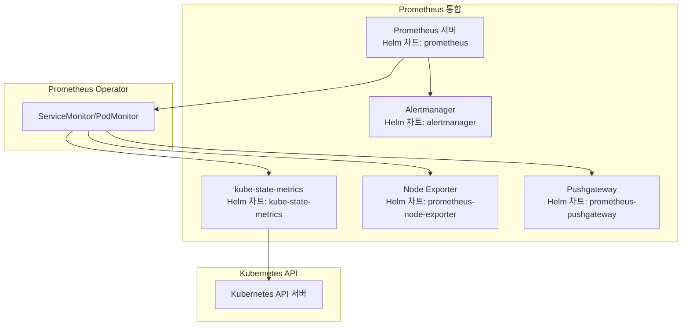
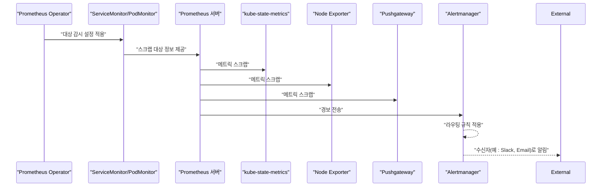
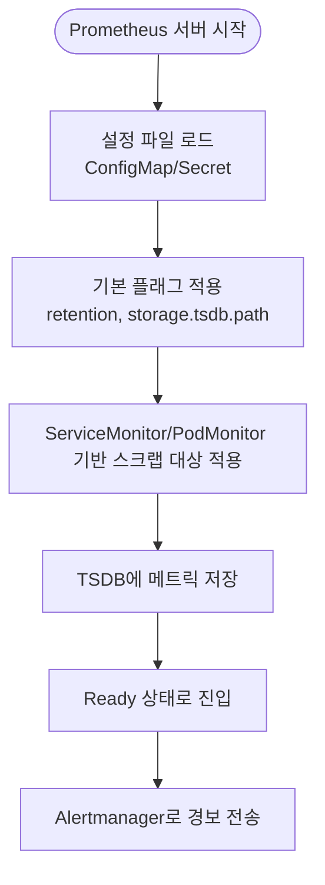
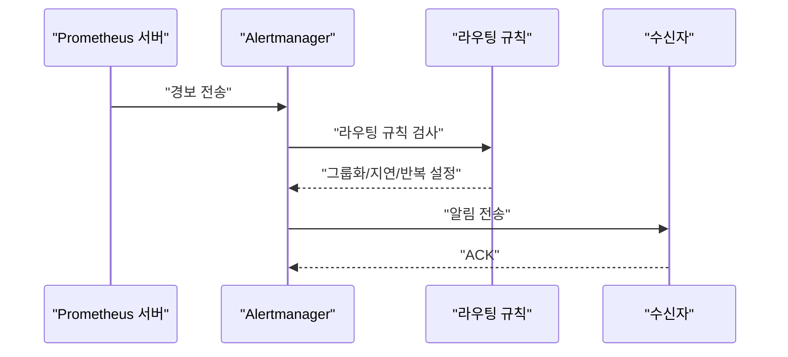
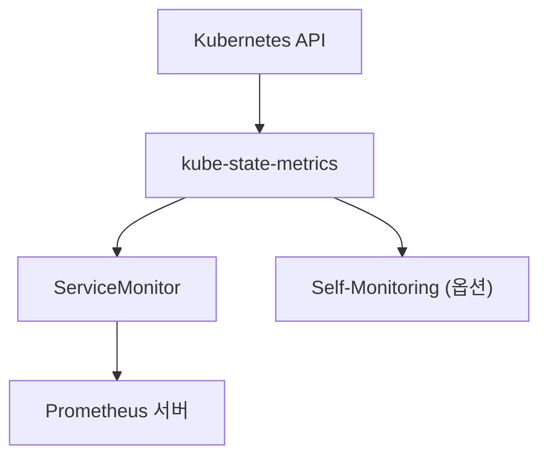
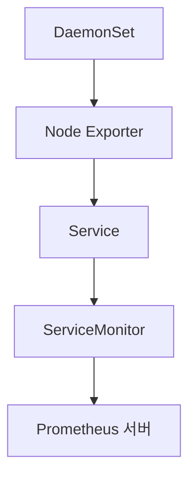
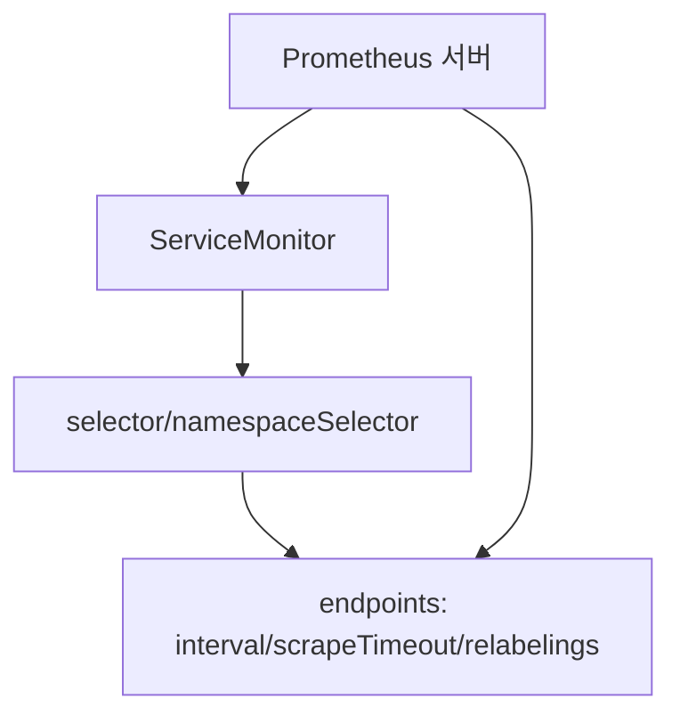
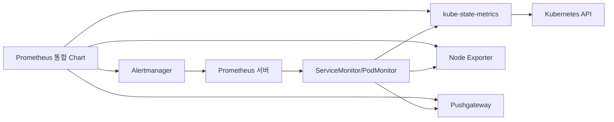

# Prometheus 통합

<cite>
**문서에서 인용된 파일 목록**
- [Chart.yaml](file://helm/development-tools/prometheus/Chart.yaml)
- [values.yaml](file://helm/development-tools/prometheus/values.yaml)
- [deploy.yaml](file://helm/development-tools/prometheus/templates/deploy.yaml)
- [servicemonitor.yaml](file://helm/development-tools/prometheus/templates/servicemonitor.yaml)
- [statefulset.yaml](file://helm/development-tools/prometheus/charts/alertmanager/templates/statefulset.yaml)
- [configmap.yaml](file://helm/development-tools/prometheus/charts/alertmanager/templates/configmap.yaml)
- [values.yaml](file://helm/development-tools/prometheus/charts/alertmanager/values.yaml)
- [deployment.yaml](file://helm/development-tools/prometheus/charts/kube-state-metrics/templates/deployment.yaml)
- [servicemonitor.yaml](file://helm/development-tools/prometheus/charts/kube-state-metrics/templates/servicemonitor.yaml)
- [values.yaml](file://helm/development-tools/prometheus/charts/kube-state-metrics/values.yaml)
- [daemonset.yaml](file://helm/development-tools/prometheus/charts/prometheus-node-exporter/templates/daemonset.yaml)
- [values.yaml](file://helm/development-tools/prometheus/charts/prometheus-node-exporter/values.yaml)
</cite>

## 목차
1. [소개](#소개)
2. [프로젝트 구조](#프로젝트-구조)
3. [핵심 컴포넌트](#핵심-컴포넌트)
4. [아키텍처 개요](#아키텍처-개요)
5. [세부 컴포넌트 분석](#세부-컴포넌트-분석)
6. [의존성 분석](#의존성-분석)
7. [성능 고려사항](#성능-고려사항)
8. [장애 진단 가이드](#장애-진단-가이드)
9. [결론](#결론)
10. [부록](#부록)

## 소개
본 문서는 프로젝트 내 Prometheus 모니터링 시스템이 수행하는 역할과 통합 방식을 설명합니다. 이 시스템은 다음과 같은 기능을 제공합니다:
- 클러스터 및 애플리케이션 메트릭 수집
- Alertmanager를 통한 경보 관리
- kube-state-metrics를 통한 Kubernetes 리소스 상태 모니터링
- Helm 차트를 통한 설치 및 구성
- values.yaml의 주요 설정 항목
- ServiceMonitor/PodMonitor를 통한 대상 서비스 자동 탐지
- Alertmanager 라우팅 규칙, 수신자 설정
- kube-state-metrics 수집 지표 범위

## 프로젝트 구조
Prometheus 통합은 Helm 차트 기반으로 구성되며, Prometheus 서버와 함께 Alertmanager, kube-state-metrics, prometheus-node-exporter, prometheus-pushgateway 등 하위 컴포넌트를 포함합니다. Prometheus 서버는 Prometheus Operator의 ServiceMonitor를 통해 대상을 자동 탐지하고, Alertmanager는 경보 라우팅 및 수신자를 관리하며, kube-state-metrics는 Kubernetes 리소스 상태를 메트릭화합니다.

**다이어그램 출처**
- [Chart.yaml](file://helm/development-tools/prometheus/Chart.yaml#L1-L59)

**섹션 출처**
- [Chart.yaml](file://helm/development-tools/prometheus/Chart.yaml#L1-L59)

## 핵심 컴포넌트
- Prometheus 서버
  - Prometheus 컨테이너를 실행하고, 설정 파일, 볼륨, 프로브, 스케줄링 등을 관리합니다.
  - ServiceMonitor를 통해 대상 자동 탐지 및 스크랩 설정을 적용합니다.
- Alertmanager
  - 경보 수신, 그룹화, 지연, 반복 간격, 수신자 설정 등을 관리합니다.
  - StatefulSet으로 배포되어 클러스터링이 가능합니다.
- kube-state-metrics
  - Kubernetes 리소스 상태를 메트릭화하며, ServiceMonitor를 통해 Prometheus에 노출됩니다.
  - 수집 대상 리소스, 라벨 허용 목록, 네임스페이스 제한 등을 설정 가능합니다.
- prometheus-node-exporter
  - 노드 레벨 메트릭을 수집합니다. DaemonSet으로 배포되며, ServiceMonitor 또는 PodMonitor를 통해 스크랩됩니다.
- prometheus-pushgateway
  - Push 모델을 지원하는 임시 저장소로, 짧은 생명주기 또는 일회성 작업의 메트릭을 수신합니다.

**섹션 출처**
- [deploy.yaml](file://helm/development-tools/prometheus/templates/deploy.yaml#L1-L120)
- [statefulset.yaml](file://helm/development-tools/prometheus/charts/alertmanager/templates/statefulset.yaml#L1-L120)
- [deployment.yaml](file://helm/development-tools/prometheus/charts/kube-state-metrics/templates/deployment.yaml#L1-L120)
- [daemonset.yaml](file://helm/development-tools/prometheus/charts/prometheus-node-exporter/templates/daemonset.yaml#L1-L120)

## 아키텍처 개요
Prometheus Operator의 ServiceMonitor/PodMonitor를 통해 Prometheus 서버는 kube-state-metrics, Node Exporter, Pushgateway 등의 대상을 자동으로 탐지하고 스크랩합니다. Alertmanager는 Prometheus 서버로부터 경보를 수신하여 라우팅 규칙에 따라 알림을 전달합니다.

**다이어그램 출처**
- [deploy.yaml](file://helm/development-tools/prometheus/templates/deploy.yaml#L120-L220)
- [servicemonitor.yaml](file://helm/development-tools/prometheus/templates/servicemonitor.yaml#L1-L120)
- [deployment.yaml](file://helm/development-tools/prometheus/charts/kube-state-metrics/templates/deployment.yaml#L1-L120)
- [daemonset.yaml](file://helm/development-tools/prometheus/charts/prometheus-node-exporter/templates/daemonset.yaml#L1-L120)
- [statefulset.yaml](file://helm/development-tools/prometheus/charts/alertmanager/templates/statefulset.yaml#L1-L120)

## 세부 컴포넌트 분석

### Prometheus 서버
- 역할
  - 메트릭 데이터베이스로서 TSDB에 데이터를 저장하고, 쿼리 엔진을 통해 PromQL을 처리합니다.
  - ServiceMonitor를 통해 kube-state-metrics, Node Exporter, Pushgateway를 스크랩합니다.
- 주요 설정
  - 이미지, 컨테이너 플래그, 프로브, 볼륨, 리소스 요청/제한, 호스트 네트워크, 포트 매핑 등
  - retention, retentionSize, global scrape/evaluation interval, remoteWrite/Read 설정
  - ingress(route/ingress)를 통한 외부 노출
- 구성 파일
  - ConfigMap/Secret을 통해 Prometheus 설정 파일을 마운트하고, configmap-reload 컨테이너를 통해 설정 변경 시 재로드

**다이어그램 출처**
- [deploy.yaml](file://helm/development-tools/prometheus/templates/deploy.yaml#L176-L240)
- [values.yaml](file://helm/development-tools/prometheus/values.yaml#L811-L849)

**섹션 출처**
- [deploy.yaml](file://helm/development-tools/prometheus/templates/deploy.yaml#L1-L200)
- [values.yaml](file://helm/development-tools/prometheus/values.yaml#L1-L200)

### Alertmanager
- 역할
  - Prometheus 서버로부터 경보를 수신하고, 라우팅 규칙에 따라 그룹화, 지연, 반복 간격을 적용한 후 수신자에게 전달합니다.
- 주요 설정
  - replicaCount, clustering peer, baseURL, persistence, service, ingress, route/receivers
  - configmapReload, extraEnv, extraVolumes, sidecars 등을 통한 확장
- 구성
  - StatefulSet으로 배포되며, 볼륨 템플릿을 통해 영구 저장소 사용 가능

**다이어그램 출처**
- [statefulset.yaml](file://helm/development-tools/prometheus/charts/alertmanager/templates/statefulset.yaml#L140-L220)
- [configmap.yaml](file://helm/development-tools/prometheus/charts/alertmanager/templates/configmap.yaml#L1-L22)
- [values.yaml](file://helm/development-tools/prometheus/charts/alertmanager/values.yaml#L313-L360)

**섹션 출처**
- [statefulset.yaml](file://helm/development-tools/prometheus/charts/alertmanager/templates/statefulset.yaml#L1-L200)
- [configmap.yaml](file://helm/development-tools/prometheus/charts/alertmanager/templates/configmap.yaml#L1-L22)
- [values.yaml](file://helm/development-tools/prometheus/charts/alertmanager/values.yaml#L1-L120)

### kube-state-metrics
- 역할
  - Kubernetes API를 통해 클러스터 리소스 상태를 메트릭화합니다.
- 주요 설정
  - collectors, metricLabelsAllowlist/AllowList, metricDenylist, namespaces, namespacesDenylist
  - ServiceMonitor/PodMonitor를 통한 스크랩 설정
  - selfMonitor, kubeRBACProxy, autosharding, affinity, tolerations, topologySpreadConstraints
- 메트릭 범위
  - 기본적으로 모든 리소스를 활성화하나, allowlist/denylist를 통해 특정 리소스/라벨만 수집 가능

**다이어그램 출처**
- [deployment.yaml](file://helm/development-tools/prometheus/charts/kube-state-metrics/templates/deployment.yaml#L1-L120)
- [servicemonitor.yaml](file://helm/development-tools/prometheus/charts/kube-state-metrics/templates/servicemonitor.yaml#L1-L120)
- [values.yaml](file://helm/development-tools/prometheus/charts/kube-state-metrics/values.yaml#L403-L472)

**섹션 출처**
- [deployment.yaml](file://helm/development-tools/prometheus/charts/kube-state-metrics/templates/deployment.yaml#L1-L200)
- [servicemonitor.yaml](file://helm/development-tools/prometheus/charts/kube-state-metrics/templates/servicemonitor.yaml#L1-L120)
- [values.yaml](file://helm/development-tools/prometheus/charts/kube-state-metrics/values.yaml#L375-L472)

### prometheus-node-exporter
- 역할
  - 노드 레벨 메트릭(네트워크, 디스크, CPU, 메모리 등)을 수집합니다.
- 주요 설정
  - DaemonSet 배포, hostNetwork/hostPID/hostIPC, hostPath 마운트, kubeRBACProxy, tolerations, affinity
  - ServiceMonitor/PodMonitor를 통한 스크랩 설정
- 대상 자동 탐지
  - ServiceMonitor 또는 PodMonitor를 통해 Prometheus Operator가 자동으로 탐지합니다.

**다이어그램 출처**
- [daemonset.yaml](file://helm/development-tools/prometheus/charts/prometheus-node-exporter/templates/daemonset.yaml#L1-L120)
- [values.yaml](file://helm/development-tools/prometheus/charts/prometheus-node-exporter/values.yaml#L175-L240)

**섹션 출처**
- [daemonset.yaml](file://helm/development-tools/prometheus/charts/prometheus-node-exporter/templates/daemonset.yaml#L1-L200)
- [values.yaml](file://helm/development-tools/prometheus/charts/prometheus-node-exporter/values.yaml#L1-L120)

### Prometheus Operator 통한 대상 자동 탐지 (ServiceMonitor/PodMonitor)
- ServiceMonitor
  - Service를 기반으로 스크랩 대상을 정의합니다. namespaceSelector, selectorOverride, relabelings, metricRelabelings, interval, scrapeTimeout, scheme, tlsConfig, bearerTokenSecret 등을 설정 가능합니다.
- PodMonitor
  - Pod를 기반으로 스크랩 대상을 정의합니다. Node Exporter의 경우 PodMonitor를 사용하는 것이 대규모 환경에 유리할 수 있습니다.

**다이어그램 출처**
- [servicemonitor.yaml](file://helm/development-tools/prometheus/templates/servicemonitor.yaml#L1-L120)
- [servicemonitor.yaml](file://helm/development-tools/prometheus/charts/kube-state-metrics/templates/servicemonitor.yaml#L1-L120)
- [values.yaml](file://helm/development-tools/prometheus/charts/prometheus-node-exporter/values.yaml#L236-L325)

**섹션 출처**
- [servicemonitor.yaml](file://helm/development-tools/prometheus/templates/servicemonitor.yaml#L1-L120)
- [servicemonitor.yaml](file://helm/development-tools/prometheus/charts/kube-state-metrics/templates/servicemonitor.yaml#L1-L120)
- [values.yaml](file://helm/development-tools/prometheus/charts/prometheus-node-exporter/values.yaml#L236-L325)

## 의존성 분석
- Prometheus 통합 차트는 Alertmanager, kube-state-metrics, prometheus-node-exporter, prometheus-pushgateway를 의존성으로 포함합니다.
- Prometheus 서버는 Prometheus Operator의 ServiceMonitor/PodMonitor를 통해 kube-state-metrics, Node Exporter, Pushgateway에 대한 스크랩을 수행합니다.
- Alertmanager는 Prometheus 서버로부터 경보를 수신하고, 라우팅 규칙에 따라 수신자로 전달합니다.

**다이어그램 출처**
- [Chart.yaml](file://helm/development-tools/prometheus/Chart.yaml#L1-L59)
- [deploy.yaml](file://helm/development-tools/prometheus/templates/deploy.yaml#L1-L120)

**섹션 출처**
- [Chart.yaml](file://helm/development-tools/prometheus/Chart.yaml#L1-L59)
- [deploy.yaml](file://helm/development-tools/prometheus/templates/deploy.yaml#L1-L120)

## 성능 고려사항
- 스크랩 간격과 타임아웃
  - global.scrape_interval, global.scrape_timeout, global.evaluation_interval를 조절하여 성능과 정확도 균형을 맞춥니다.
- 메트릭 양 조절
  - kube-state-metrics의 metricAllowlist/metricDenylist, metricLabelsAllowlist/AllowList, metricAnnotationsAllowList 등을 활용해 불필요한 메트릭 제거.
- 대상 수 증가 대응
  - Node Exporter 대상이 많을 경우 PodMonitor를 사용하여 태그 및 라벨 변화에 따른 시리즈 차이를 고려해야 합니다.
- 저장소 용량
  - Prometheus retention/retentionSize, kube-state-metrics namespaces/namespacesDenylist를 통해 과도한 데이터 방지.
- 리소스 요청/제한
  - Prometheus 서버, Alertmanager, kube-state-metrics, Node Exporter에 대한 resources 설정을 적절히 조정합니다.

[이 섹션은 일반적인 성능 가이드를 제공하므로 구체적인 파일 분석 없음]

## 장애 진단 가이드
- Prometheus 서버
  - readiness/liveness/startup probe 설정 확인, prefixURL/baseURL, external-url 관련 설정 오류 여부 점검.
  - configmap-reload 설정이 올바르게 동작하는지 확인하고, 설정 변경 시 재로드가 되는지 확인.
- Alertmanager
  - cluster peer 설정, baseURL, ingress 설정, route/receivers 설정 확인.
  - configmapReload 사용 시 reload URL이 올바른지 확인.
- kube-state-metrics
  - collectors, metricAllowlist/Denylist, namespaces/namespacesDenylist 설정 확인.
  - ServiceMonitor/PodMonitor relabelings/metricRelabelings 설정 확인.
- Node Exporter
  - DaemonSet 배포, hostNetwork/hostPID/hostIPC 설정, kubeRBACProxy 사용 시 TLS/인증 설정 확인.
  - ServiceMonitor/PodMonitor interval/scrapeTimeout 설정 확인.

**섹션 출처**
- [deploy.yaml](file://helm/development-tools/prometheus/templates/deploy.yaml#L234-L320)
- [statefulset.yaml](file://helm/development-tools/prometheus/charts/alertmanager/templates/statefulset.yaml#L100-L180)
- [values.yaml](file://helm/development-tools/prometheus/charts/alertmanager/values.yaml#L313-L360)
- [deployment.yaml](file://helm/development-tools/prometheus/charts/kube-state-metrics/templates/deployment.yaml#L80-L140)
- [daemonset.yaml](file://helm/development-tools/prometheus/charts/prometheus-node-exporter/templates/daemonset.yaml#L120-L200)

## 결론
Prometheus 통합은 Helm 차트를 통해 Prometheus 서버, Alertmanager, kube-state-metrics, Node Exporter, Pushgateway를 일관되게 배포하고, Prometheus Operator의 ServiceMonitor/PodMonitor를 통해 대상 자동 탐지를 실현합니다. Alertmanager는 라우팅 규칙과 수신자를 통해 효과적인 경보 관리를 제공하며, kube-state-metrics는 Kubernetes 리소스 상태를 포괄적으로 수집합니다. values.yaml을 통해 다양한 설정을 조절함으로써 성능, 보안, 확장성을 균형 있게 관리할 수 있습니다.

[이 섹션은 요약 내용이므로 구체적인 파일 분석 없음]

## 부록

### Helm 차트 설치 및 구성
- 설치
  - Prometheus 통합 차트를 설치하면 Alertmanager, kube-state-metrics, prometheus-node-exporter, prometheus-pushgateway 차트가 함께 설치됩니다.
- 구성
  - values.yaml을 수정하여 Prometheus 서버, Alertmanager, kube-state-metrics, Node Exporter, Pushgateway 각각의 설정을 조절합니다.
  - ServiceMonitor/PodMonitor를 통해 스크랩 대상과 스크랩 설정을 정의합니다.

**섹션 출처**
- [Chart.yaml](file://helm/development-tools/prometheus/Chart.yaml#L1-L59)
- [values.yaml](file://helm/development-tools/prometheus/values.yaml#L1-L120)

### values.yaml 주요 설정 항목
- Prometheus 서버
  - global.scrape_interval, global.scrape_timeout, global.evaluation_interval
  - retention, retentionSize, storagePath, persistentVolume 설정
  - ingress(route/ingress) 설정, baseURL/prefixURL
  - configFromSecret/configMapOverrideName, extraFlags/extraArgs
- Alertmanager
  - replicaCount, baseURL, route/receivers, persistence.enabled
  - configmapReload.enabled, extraEnv, extraVolumes
- kube-state-metrics
  - collectors, metricAllowlist/metricDenylist, metricLabelsAllowlist/AllowList, metricAnnotationsAllowList
  - namespaces, namespacesDenylist, releaseNamespace
  - prometheus.monitor.* relabeling 설정
- Node Exporter
  - hostNetwork/hostPID/hostIPC, extraHostVolumeMounts, extraVolumeMounts
  - prometheus.monitor.* relabeling 설정, PodMonitor 사용 여부

**섹션 출처**
- [values.yaml](file://helm/development-tools/prometheus/values.yaml#L270-L320)
- [values.yaml](file://helm/development-tools/prometheus/values.yaml#L811-L849)
- [values.yaml](file://helm/development-tools/prometheus/charts/alertmanager/values.yaml#L313-L360)
- [values.yaml](file://helm/development-tools/prometheus/charts/kube-state-metrics/values.yaml#L403-L472)
- [values.yaml](file://helm/development-tools/prometheus/charts/prometheus-node-exporter/values.yaml#L175-L240)

### Alertmanager 라우팅 규칙 및 수신자 설정
- 라우팅 규칙
  - group_wait, group_interval, repeat_interval, receiver 설정
- 수신자
  - default-receiver 또는 사용자 정의 수신자 추가
  - Slack/Hipchat/Email 등 수신자별 설정 가능

**섹션 출처**
- [values.yaml](file://helm/development-tools/prometheus/charts/alertmanager/values.yaml#L321-L360)
- [configmap.yaml](file://helm/development-tools/prometheus/charts/alertmanager/templates/configmap.yaml#L1-L22)

### kube-state-metrics 수집 지표 범위
- collectors: 활성화할 리소스 목록
- metricAllowlist/metricDenylist: 메트릭 이름 또는 정규표현식을 통한 허용/차단
- metricLabelsAllowlist/AllowList: 리소스 라벨 허용 목록
- metricAnnotationsAllowList: 리소스 어노테이션 허용 목록
- namespaces/namespacesDenylist/releaseNamespace: 수집할 네임스페이스 제한

**섹션 출처**
- [values.yaml](file://helm/development-tools/prometheus/charts/kube-state-metrics/values.yaml#L403-L472)