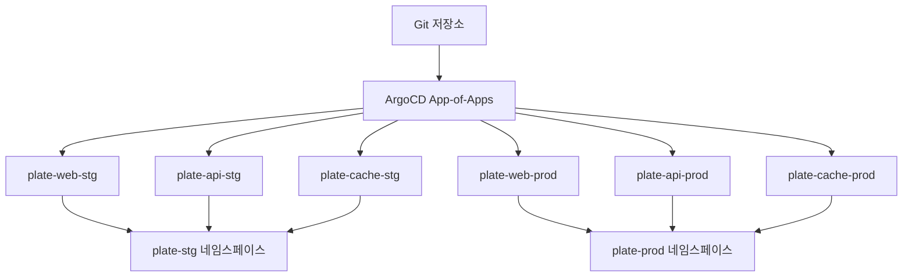
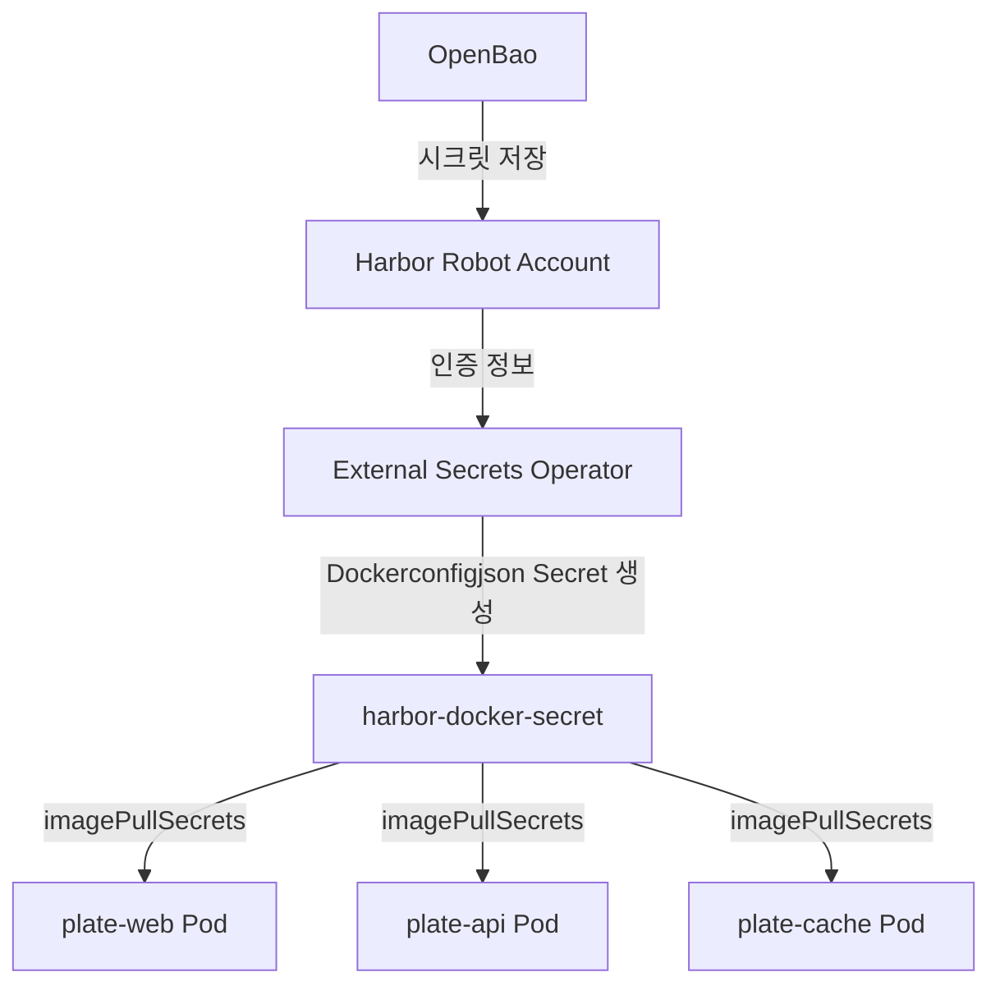
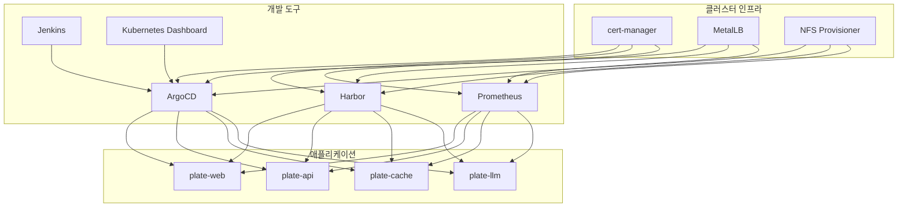

# 외부 의존성

<cite>
**이 문서에서 참조한 파일**
- [README.md](file://README.md)
- [argocd](file://helm/development-tools/argocd)
- [harbor](file://helm/development-tools/harbor)
- [prometheus](file://helm/development-tools/prometheus)
- [app-of-apps.yaml](file://environments/argocd/app-of-apps.yaml)
- [plate-web-stg.yaml](file://environments/argocd/apps/plate-web-stg.yaml)
- [deploy-libraries.sh](file://scripts/deploy-libraries.sh)
- [deploy-harbor-auth.sh](file://scripts/deploy-harbor-auth.sh)
</cite>

## 목차
1. [소개](#소개)
2. [ArgoCD](#argocd)
3. [Harbor](#harbor)
4. [Prometheus](#prometheus)
5. [의존성 통합 아키텍처](#의존성-통합-아키텍처)
6. [버전 관리 및 업데이트 전략](#버전-관리-및-업데이트-전략)
7. [결론](#결론)

## 소개

이 문서는 프로젝트에서 사용하는 주요 외부 의존성인 ArgoCD, Harbor, Prometheus의 역할과 통합 방식을 설명합니다. 각 도구는 클라우드 네이티브 애플리케이션의 배포, 보안, 모니터링을 위한 핵심 구성 요소로, GitOps 기반의 인프라 운영 체계를 구축하는 데 필수적입니다. 이 문서는 각 도구의 설치 및 구성 방법, 프로젝트 아키텍처 내에서의 기능, 다른 구성 요소와의 상호 작용 방식을 상세히 설명합니다.

**Section sources**
- [README.md](file://README.md#L1-L417)

## ArgoCD

ArgoCD는 Kubernetes 애플리케이션을 위한 선언형 GitOps 지속적 배포 도구입니다. 이 프로젝트에서는 ArgoCD를 사용하여 모든 애플리케이션과 인프라 구성 요소의 배포를 자동화하고, Git 저장소의 상태를 클러스터의 실제 상태와 지속적으로 동기화합니다. ArgoCD는 "App-of-Apps" 패턴을 활용하여 복잡한 다중 애플리케이션 환경을 체계적으로 관리합니다.

### 설치 및 구성

ArgoCD는 Helm 차트를 통해 설치되며, `helm/development-tools/argocd` 디렉터리에 정의된 구성 파일을 사용합니다. 설치는 `scripts/deploy-libraries.sh` 스크립트를 통해 자동화되며, 이 스크립트는 클러스터 서비스와 개발 도구를 계층적으로 배포합니다. 주요 구성 요소는 다음과 같습니다:

- **App-of-Apps 패턴**: `environments/argocd/app-of-apps.yaml` 파일은 모든 하위 ArgoCD Application을 관리하는 메인 애플리케이션입니다. 이 메인 애플리케이션은 `environments/argocd/apps` 디렉터리에 있는 개별 애플리케이션 정의를 동기화합니다.
- **자동 동기화**: `syncPolicy.automated` 설정을 통해 Git 저장소에 변경 사항이 발생하면 자동으로 클러스터에 배포됩니다. `prune: true` 옵션은 Git에서 삭제된 리소스를 클러스터에서도 자동으로 제거합니다.
- **환경 분리**: 스테이징과 프로덕션 환경은 별도의 ArgoCD Application으로 관리되며, 각 환경은 `values-stg.yaml` 또는 `values-prod.yaml`과 같은 환경별 설정 파일을 사용합니다.

**Diagram sources**
- [app-of-apps.yaml](file://environments/argocd/app-of-apps.yaml#L1-L35)
- [plate-web-stg.yaml](file://environments/argocd/apps/plate-web-stg.yaml#L1-L62)

**Section sources**
- [README.md](file://README.md#L356-L407)
- [argocd](file://helm/development-tools/argocd)
- [app-of-apps.yaml](file://environments/argocd/app-of-apps.yaml)
- [deploy-libraries.sh](file://scripts/deploy-libraries.sh#L105-L115)

## Harbor

Harbor는 신뢰할 수 있는 클라우드 네이티브 레지스트리로, 컨테이너 이미지와 Helm 차트를 저장, 서명, 스캔하는 기능을 제공합니다. 이 프로젝트에서는 Harbor를 프라이빗 컨테이너 이미지 레지스트리로 사용하여 이미지의 보안과 무결성을 보장합니다. 이미지 스캔 기능을 통해 취약점을 사전에 탐지하고, RBAC 기반의 접근 제어를 통해 이미지에 대한 접근 권한을 엄격히 관리합니다.

### 설치 및 구성

Harbor도 Helm 차트를 통해 설치되며, `helm/development-tools/harbor` 디렉터리에 정의된 구성 파일을 사용합니다. 설치는 `scripts/deploy-libraries.sh` 스크립트를 통해 수행됩니다. 주요 구성 요소는 다음과 같습니다:

- **Ingress 및 TLS**: `expose.type: ingress`로 설정되어 있으며, `cert-manager`와 통합하여 Let's Encrypt를 통해 자동으로 SSL/TLS 인증서를 발급받습니다. 외부 URL은 `https://harbor.cocdev.co.kr`로 설정됩니다.
- **지속성 저장소**: `persistence.enabled: true`로 설정되어 있으며, OpenEBS의 `openebs-hostpath` 스토리지 클래스를 사용하여 이미지 데이터를 영구적으로 저장합니다.
- **통합 인증**: Harbor는 OpenBao 시크릿 매니저와 통합되어 있으며, `scripts/deploy-harbor-auth.sh` 스크립트를 통해 External Secrets Operator(ESO)를 사용하여 OpenBao에서 Harbor 인증 정보를 가져와 Kubernetes Secret으로 생성합니다. 이를 통해 애플리케이션은 Harbor에서 이미지를 안전하게 풀(Pull)할 수 있습니다.

**Diagram sources**
- [harbor](file://helm/development-tools/harbor)
- [deploy-harbor-auth.sh](file://scripts/deploy-harbor-auth.sh#L1-L194)

**Section sources**
- [README.md](file://README.md#L249-L258)
- [harbor](file://helm/development-tools/harbor)
- [deploy-harbor-auth.sh](file://scripts/deploy-harbor-auth.sh#L1-L194)
- [verify-harbor-auth.sh](file://scripts/verify-harbor-auth.sh#L1-L212)

## Prometheus

Prometheus는 모니터링 시스템 및 시계열 데이터베이스로, 이 프로젝트에서는 클러스터 및 애플리케이션의 메트릭을 수집하고 모니터링하기 위해 사용됩니다. 현재는 기본적인 메트릭 수집 기능만 활성화되어 있으며, 향후 Grafana와 통합하여 대시보드를 제공하고, Alertmanager를 통해 경보를 설정할 예정입니다.

### 설치 및 구성

Prometheus는 Helm 차트를 통해 설치되며, `helm/development-tools/prometheus` 디렉터리에 정의된 구성 파일을 사용합니다. 설치는 `scripts/deploy-libraries.sh` 스크립트를 통해 수행됩니다. 주요 구성 요소는 다음과 같습니다:

- **Ingress 및 TLS**: `server.ingress.enabled: true`로 설정되어 있으며, `cert-manager`와 통합하여 Let's Encrypt를 통해 자동으로 SSL/TLS 인증서를 발급받습니다. 외부 URL은 `https://prometheus.cocdev.co.kr`로 설정됩니다.
- **지속성 저장소**: `server.persistentVolume.enabled: true`로 설정되어 있으며, OpenEBS의 `openebs-hostpath` 스토리지 클래스를 사용하여 메트릭 데이터를 영구적으로 저장합니다.
- **확장성**: Helm 차트는 Alertmanager, kube-state-metrics, node-exporter 등의 관련 컴포넌트를 종속성으로 포함하고 있어, 필요 시 쉽게 확장할 수 있습니다.

**Section sources**
- [prometheus](file://helm/development-tools/prometheus)
- [deploy-libraries.sh](file://scripts/deploy-libraries.sh#L105-L115)

## 의존성 통합 아키텍처

이 프로젝트의 외부 의존성은 계층화된 아키텍처를 기반으로 긴밀하게 통합되어 있습니다. 아래 다이어그램은 ArgoCD, Harbor, Prometheus가 클러스터 인프라, 개발 도구, 애플리케이션 계층과 어떻게 상호 작용하는지를 보여줍니다.

**Diagram sources**
- [README.md](file://README.md#L16-L84)
- [deploy-libraries.sh](file://scripts/deploy-libraries.sh#L105-L115)

## 버전 관리 및 업데이트 전략

이 프로젝트의 외부 의존성은 다음과 같은 전략을 통해 버전 관리 및 업데이트가 이루어집니다.

### 버전 관리

- **Helm 차트 버전**: 각 개발 도구(Harbor, ArgoCD, Prometheus 등)는 `helm/development-tools/<도구>/Chart.yaml` 파일에 명시된 버전을 사용합니다. 예를 들어, ArgoCD는 `8.3.1`, Harbor는 `1.17.2` 버전을 사용합니다.
- **이미지 태그**: Helm 차트 내부에서는 각 컴포넌트의 컨테이너 이미지 태그가 명시되어 있습니다. 예를 들어, Harbor는 `goharbor/nginx-photon:v2.13.2` 이미지를 사용합니다.
- **GitOps 원칙**: 모든 구성 파일은 Git 저장소에 형상 관리되며, 변경 사항은 Pull Request를 통해 검토된 후 적용됩니다. 이는 변경 사항의 추적성과 재현성을 보장합니다.

### 업데이트 전략

1. **스테이징 환경에서 검증**: 새로운 버전의 의존성을 적용하기 전에, 먼저 스테이징 환경에서 `scripts/deploy-stg.sh` 스크립트를 사용하여 배포하고 기능 및 성능을 철저히 검증합니다.
2. **드라이런(Dry-run) 실행**: 프로덕션 환경에 적용하기 전에 `scripts/deploy-all.sh production --dry-run` 명령어를 사용하여 실제 변경 없이 배포 과정을 시뮬레이션합니다.
3. **점진적 적용**: 검증이 완료되면 `scripts/deploy-all.sh production` 명령어를 사용하여 프로덕션 환경에 적용합니다. 이 스크립트는 사용자 확인 프롬프트, 백업 생성, 헬스 체크 검증 등의 안전장치를 포함하고 있습니다.
4. **롤백 절차**: 문제가 발생할 경우, `scripts/deploy-prod.sh rollback` 명령어를 사용하여 이전 버전으로 빠르게 롤백할 수 있습니다. Git 저장소의 이전 커밋으로 되돌린 후 ArgoCD를 재동기화하는 것이 기본적인 롤백 방법입니다.

**Section sources**
- [README.md](file://README.md#L209-L213)
- [deploy-all.sh](file://scripts/deploy-all.sh)
- [deploy-prod.sh](file://scripts/deploy-prod.sh)

## 결론

ArgoCD, Harbor, Prometheus는 이 프로젝트의 핵심 외부 의존성으로, GitOps 기반의 자동화된 배포, 안전한 이미지 관리, 효과적인 모니터링을 가능하게 합니다. 이들 도구는 Helm 차트를 통해 일관되게 설치 및 구성되며, `deploy-libraries.sh` 스크립트를 통해 계층적으로 배포됩니다. ArgoCD의 App-of-Apps 패턴은 복잡한 애플리케이션 구조를 단순화하고, Harbor와 OpenBao의 통합은 이미지 풀(Pull) 인증을 안전하게 처리합니다. 이러한 통합된 아키텍처는 프로덕션 레디한 안정성과 보안을 제공하며, 표준화된 업데이트 전략을 통해 안정적인 운영을 보장합니다.